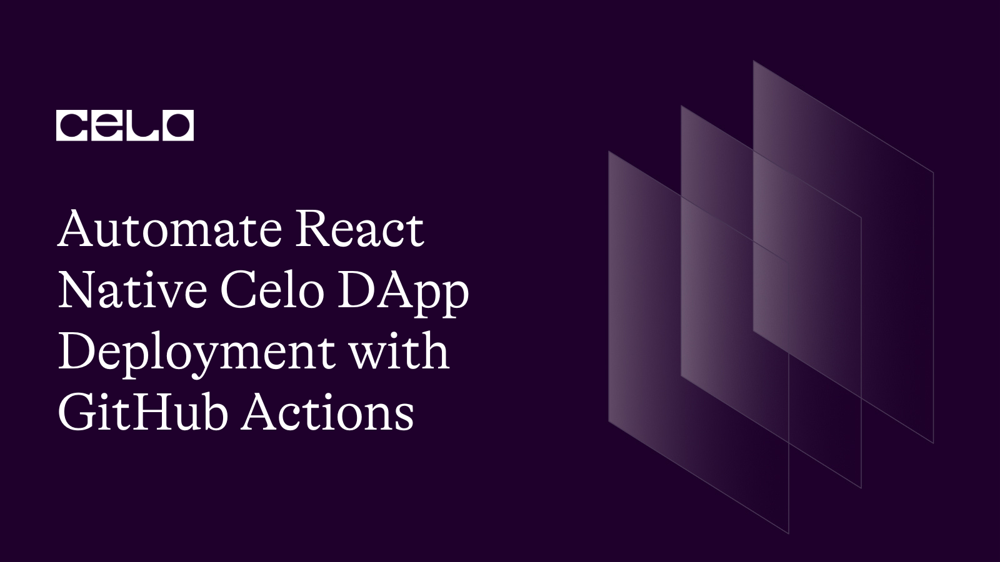
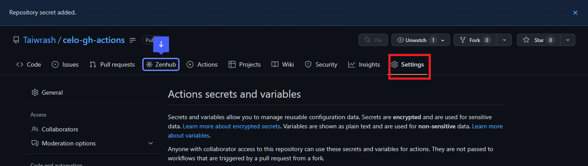
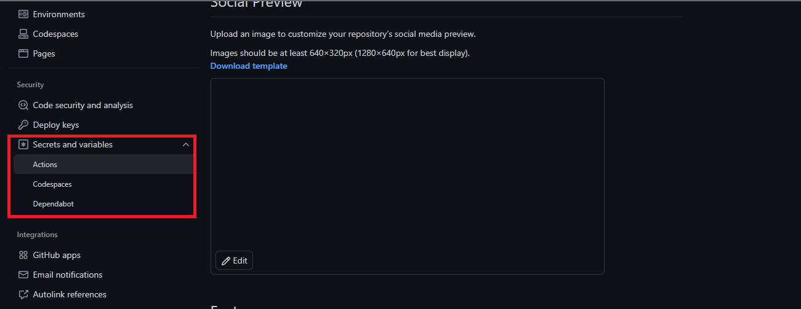
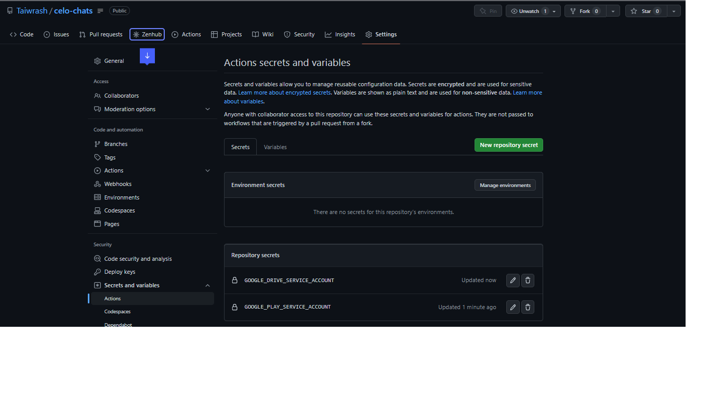
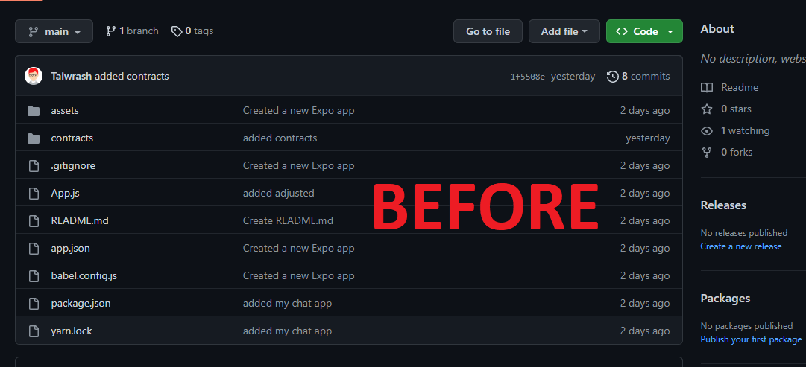
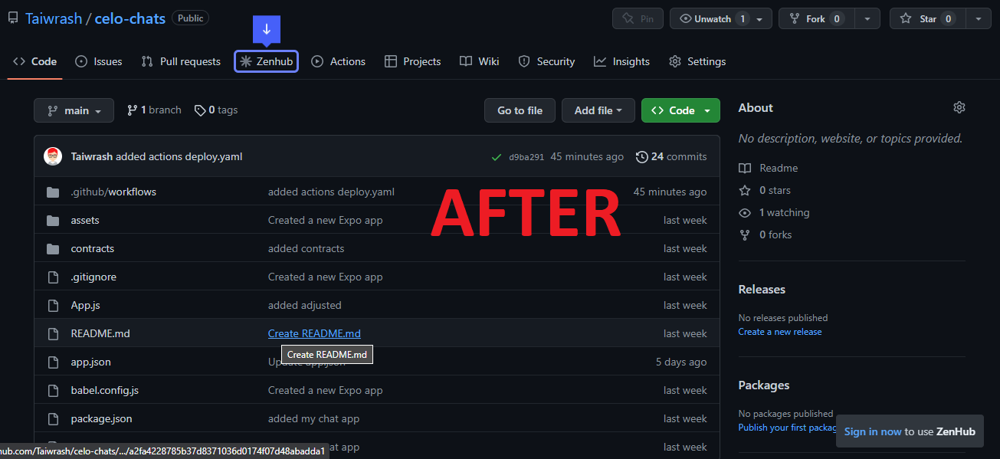

## Introduction

It is impossible to overstate the importance of automation in terms of software and problem-solving to boost productivity and assure effective releases. Version control systems have made it possible for developers to work together to create solutions. adopting automation to automate the developers' code integration (continuous integration, or CI), and promoting early release, whether it be on the Google Play store or Google Drive.
In this article, we'll walk you through the process of setting up an automation system on GitHub to make it simple to deploy React Native DApps and publish them to Google Drive or the Playstore. The next step after creating a Celo DApp with React Native is making it accessible to users via the Play Store or Google Drive (for people without Google Play Accounts). By doing this, upgrades will take much less time and will not require tedious manual work. We'll be using a React Native application created by a Celo Sage member in this course. Check out the article in the repository here. Notice that we are not constructing a React Native DApp by ourselves. As soon as the development team has completed a successful build, it is our responsibility to make it accessible to our customers.

## Prerequisite

- YAML
- GitHub Account
- React Native
- A repository of a Celo DApp built with React Native
- GitHub Actions
- A Celo wallet with some testnet CELO and Celo Dollars (cUSD)
- Node.js and npm installed on your machine
- Expo CLI installed on your machine

A beginner's-level familiarity with everything on the aforementioned list is sufficient to be able to follow along in this session.

### Important Terms

[GitHub Actions](https://docs.github.com/en/actions): Automate, customize, and execute your software development workflows right in your repository with GitHub Actions. You can discover, create, and share actions to perform any job you'd like, including CI and CD, and combine actions in a completely customized workflow.
[React Native](https://reactnative.dev/): React Native combines the best parts of native development with React, a best-in-class JavaScript library for building user interfaces.
[DApp](https://www.freecodecamp.org/news/what-is-a-dapp-a-guide-to-ethereum-dapps/): A Dapp, or decentralized application, is a software application that runs on a distributed network. It's not hosted on a centralized server but instead on a peer-to-peer, decentralized network.
[YAML](https://en.wikipedia.org/wiki/YAML): Is a human-readable data-serialization language. It is commonly used for configuration files and in applications where data is being stored or transmitted- Wikipedia

## Credentials Creation Stage

It is obvious to us that in order to protect privacy and prevent security breaches, establishing interactions between two systems (such as GitHub and Google Console) calls for extensive verification and authentication. For that reason, we ought to be able to build an automation system that can do this for us without much difficulty. To make the work easy for both beginning and advanced readers, we will set up all the necessary credentials and concentrate on the most crucial ones.

## Setting up the Google Cloud Service JSON Account

A service JSON account, also known as an activity JSON account, is a JSON-based credential or set of data that enables simple access to and interaction with the Google Cloud Platform. It gives users access to the Google Play Store, the Google Drive API, and other GCP resources that are open for interaction. Here is a link to a 2-minute video that clarifies how to accomplish it. Now that the service account JSON has been downloaded successfully, we can go to the next stage in obtaining our subsequent credential.

## Setting up Google Play Android and Google Drive Developer API

The following steps are essential for configuring the Google Drive API and the Google Play Android Developer API. Remember that they are extremely similar to the previously described approach for obtaining a service account JSON with just a few minor adjustments and a different option, so the video can potentially be followed by selecting the required and expected service instead, but with the same procedure. As they both require the same steps to be taken, I'm consolidating them here:

- Step 1: Go to the Google API Console.
- Step 2: Select your project from the drop-down menu in the top navigation bar.
- Step 3: Click on the `Dashboard` button in the left-hand sidebar.
- Step 4: Click on the `+ Enable APIs and Services` button.
- Step 5: Search for `Google Drive API` and click on it. And while creating Play API, choose it here
- Step 6: On the `+ Enable` button
- Step 7: Click on the `Create Credentials` button.
- Step 8: Select `Service Account` as the `Application Type` and click `Continue`.
- Step 9: Enter a name for your service account and click `Create`.
- Step 10: Select the `Editor` role and click `Continue`.
- Step 11: Skip the `Grant users access to this service account` page and click `Done`.
- Step 12: Click on the `Create Credentials` button again and select `Service Account Key`.
- Step 13: Select your service account, select `JSON` as the key type, and click `Create`.
- Step 14: Save the JSON file to your computer.

It is very important to keep all these mentioned JSONs safe for security purposes; anybody who gains access to all the mentioned JSONs can push an app to our platform, and the bill will be on us. For security purposes, let’s pay attention to this very point.

## Add Expo Credentials Secrets

Next, you need to add the EXPO_CREDENTIALS secret to your repository. This secret is used by the GitHub workflow to authenticate with Expo and upload your app to the app store.

To add the EXPO_CREDENTIALS secret, navigate to Settings > Secrets in your repository, and then click on the "New secret" button. Enter EXPO_CREDENTIALS as the secret name, and paste your Expo credentials by creating secrets for both username is Expo_Username and password is Expo_Password as the secret value. Ensure the secret is set from GitHub security repository secrets.

## Let’s Connect the two parties together (GitHub and Google Cloud)

We will use the strength of GitHub's security policy because, as was already established, these JSONs are intended to be kept as secrets. Its name is GitHub Secrets, and it was designed with the express aim of safely storing sensitive data like your API keys. Use the "secrets" function on GitHub. Your processes can utilize these secrets to authenticate with external services without disclosing your credentials. to make adding secrets and API keys and creating them simple. I indicated the following basic actions to take:

- Step 1: Go to the GitHub repository.
- Step 2: Go to the "Settings" tab of the same repository as shown below
  

- Step 3: Click on the `Secrets` tab in the left-hand sidebar.
  

- Step 4: Click on `New repository secret`.



- Step 5: Enter the name and value of the secret. For example, you can create a secret called `SERVICE_ACCOUNT_KEY` and paste the contents of your JSON key file as the value.
  Repeat this process for the other secrets that you need, such as `GOOGLE_DRIVE_ACCESS_TOKEN`, `GOOGLE_DRIVE_REFRESH_TOKEN`, and `GOOGLE_PLAY_API_ACCESS_KEY`.
  Once you've added all the necessary secrets, you can reference them in your `YAML` file using the `${{ secrets.SECRET_NAME }}` syntax.

That's it! With the YAML file and secrets set up, you can now automate the process of uploading your APK file to Google Drive and the Google Play Store every time you make a new release of your Celo dApp.

## Before and After Look of the Repo




## Creating the Configurations

After gaining access to numerous credentials, the automated phase begins. It is the moment to employ them in order to automate the deployment procedure and work miracles. We will be writing the appropriate scripts to enable all of the aforementioned actions, and GitHub Actions makes this process simple for us by only requiring that `.github/workflows/` directories be present at the root of our React Native DApp projects.

## Setting the configuration for the actions

To push GitHub Actions into action, we need to include the set of scripts needed to be executed on our repository in the directories we created. inside the `workflows` folder created in the `.github` folder before. We will create a file; it could be a YAML file or a JSON file, but in this tutorial, we will be using a YAML file. We will be naming the file `deploy.yaml` or `deploy.yml`. Both work the same way; choose a notation that works for you. For easy access, I will be dropping the whole script and explaining it line by line for your understanding.

```yaml
name: Deploy to GDrive and GPlay
on:
  push:
    branches:
      - main
jobs:
  deploy:
    runs-on: ubuntu-latest
    steps:
      - uses: actions/checkout@v2
      - name: Set up Node.js
        uses: actions/setup-node@v2
        with:
          node-version: '14.x'
      - name: Install dependencies
        run: |
          npm install
      - name: Build app
        run: |
          expo login --username ${{secrets.Expo_Username}} --password ${{secrets.Expo_Password}}
          expo build:android -t apk --no-publish
          expo build:ios --no-publish
      - name: Upload APK to Google Drive
        uses: Peaceiris/actions-gdrive@v3
        with:
          service_account_json: ${{ secrets.GOOGLE_DRIVE_SERVICE_ACCOUNT }}
          source: ./android/app/build/outputs/apk/release/app-release.apk
          destination: /deployments/app-release.apk

      - name: Deploy the app to Google Play Store
        uses: r0adkll/upload-google-play@v1.2.2
        with:
          serviceAccountJson: ${{ secrets.GOOGLE_PLAY_SERVICE_ACCOUNT }}
          packageName: com.example.myapp
          track: production
          apk: ./android/app/build/outputs/apk/release/app-release.apk
          releaseNotes: "Initial release”
```

Don't panic if you are unfamiliar with YAML; it is simply a key-value pair-based data structure, much like JSON, an array, or a list. I will be going over the most important parts of the scripts for easy understanding:

The `name` field gives a name to the workflow. As the project grows, we may need to automate many tasks beyond deploying to the Play Store or Google Drive; we may need to automate the integration of codes from different developers; we may need to onboard new members to the repository when they create their first issues or make their first pull request. All of this is achievable through GitHub actions. To be able to identify the task that is running or failing, we need a name for it. That is the function of the name field.

The `on` field specifies the events or actions that make the workflow run, in this case when there is a “push” to the main branch. It could happen when a pull request is made or during any other available event on GitHub.

The `jobs` field defines the jobs that the workflow will run. These are the various related tasks that need to be done. It could be a test job, a lint job, and so on, but in this case, there is only one job called `deploy.`

The `runs-on` field specifies the type of virtual environment to run the job on. In this case, we're using Ubuntu-latest. This is another aspect of GitHub Actions. As React Native is cross-platform, it can run on Android, iOS, the web, and other platforms. But only Mac users can build iOS, but with the help of GitHub Actions, we can set up a Mac virtual machine with XCode installed that can handle that for us without thinking about getting a Mac Book.

The `steps` field lists the individual steps that the job will run. These include

1. Checking out the code
2. Setting up NodeJS and React Native
3. Install packages and dependencies
4. Building the release APK
5. Authenticating the service account
6. Uploading the APK to Google Drive
7. Publishing the APK to the Google Play Store, and many more.

## Breakdown of each of these 7 steps

- Step 1: Checking out the code:
  The first step is to check out the code from the GitHub repository. You can use the `actions/checkout` action to do this. Here's an example:

```yaml
- name: Checkout code
  uses: actions/checkout@v2
```

- Step 2: Setting up NodeJS and React Native:
  Next, you need to set up NodeJS and React Native on the build machine. You can use the `actions/setup-node` action to do this. Here's an example:

```yaml
- name: Set up Node.js
  uses: actions/setup-node@v2
  with:
    node-version: "14.x"
- name: Install React Native CLI
  run: npm install -g react-native-cli
```

- Step 3: Install packages and dependencies:
  You need to install all the packages and dependencies required for the app. You can use the npm install command for this.

```yaml
- name: Install packages and dependencies
  run: |
    npm install
```

- Step 4: Building the release APK:
  You need to build the release APK for the app. You can use the expo build:android command for this. Here's an example:

```yaml
- name: Build release APK
  run: |
    expo login --username${{ secrets.Expo_Username}} --password ${{secrets.Expo_Password}}
    expo build:android -t apk --no-publish
```

- Step 5: Authenticating the service account:
  You need to authenticate the service account that will be used to upload the APK to Google Drive and publish it to the Google Play Store. You can create a JSON key for your service account in the Google Cloud Console and store it as a secret in your GitHub repository. Here's an example of how to authenticate the service account:

```yaml
- name: Authenticate service account
  uses: google-github-actions/setup-gcloud@master
  with:
    version: "290.0.1"
    service_account_email: ${{ secrets.SERVICE_ACCOUNT_EMAIL }}
    service_account_key: ${{ secrets.SERVICE_ACCOUNT_KEY }}
```

- Step 6: Uploading the APK to Google Drive:
  You can use the `google-github-actions/upload-to-google-drive` action to upload the APK to Google Drive. Here's an example:

```yaml
- name: Upload APK to Google Drive
  uses: google-github-actions/upload-to-google-drive@master
  with:
    path_to_file: app-release.apk
    mime_type: application/vnd.android.package-archive
    folder_id: ${{ secrets.GOOGLE_DRIVE_FOLDER_ID }}
    service_account_key: ${{ secrets.SERVICE_ACCOUNT_KEY }}
```

- Step 7: Publishing the APK to the Google Play Store:
  Finally, you can use the `google-github-actions/publish-to-google-play-store` action to publish the APK to the Google Play Store. Here's an example:

```yaml
- name: Publish APK to Google Play Store
  uses: google-github-actions/publish-to-google-play-store@master
  with:
    bundle_file_path: app-release.aab
    track: "internal"
    service_account_key: ${{ secrets.SERVICE_ACCOUNT_KEY }}
```

The above is the explanation for the fields and key. It is necessary to examine some of the values to better understand them. Below are some explanations of the values of the necessary and important keys:

```bash
 expo build:android -t apk --no-publish
 expo build:ios --no-publish
```

The above contains three keys: `name`, `on`, with a subkey under “on” that is `push`, which in turn has a subkey `branches` with a value of `main`. It is important to note at this point that the subkeys are values for the parent key, and they always expect their own value. The structure means that when a push is made to the main branch, it executes the upcoming jobs that we will be having. The `name` key has a direct value, the name of the workflow.

```yaml
jobs:
  deploy:
    runs-on: ubuntu-latest
    steps:
      - uses: actions/checkout@v2
      - name: Set up Node.js
        uses: actions/setup-node@v2
        with:
          node-version: "14.x"
      - name: Install dependencies
        run: |
          npm install
      - name: Build app
        run: |
          expo build:android -t apk --no-publish
          expo build:ios --no-publish
      - name: Upload APK to Google Drive
        uses: Peaceiris/actions-gdrive@v3
        with:
          service_account_json: ${{ secrets.GOOGLE_DRIVE_SERVICE_ACCOUNT }}
          source: ./android/app/build/outputs/apk/release/app-release.apk
          destination: /deployments/app-release.apk
      - name: Deploy app to Google Play Store
        uses: r0adkll/upload-google-play@v1.2.2
        with:
          serviceAccountJson: ${{ secrets.GOOGLE_PLAY_SERVICE_ACCOUNT }}
          packageName: com.example.myapp
          track: production
          apk: ./android/app/build/outputs/apk/release/app-release.apk
          releaseNotes: "Initial release"
```

The `jobs` key has a single direct subkey (value), and it is the `deploy` job. In this section, we need a series of actions and tasks to deploy. For us to be able to deploy, we need a virtual environment to run our codes, just as we will do on our local machine. We are using `ubuntu-latest` here, which is the `runs-on` key function. followed by a series of steps, and each step is given a name for easy tracing in case of any issues or updates. The first thing to do is check out the code from the GitHub repository on the virtual machine we are running on. This is abstracted away by a package (`actions/checkout@v2`) built by the GitHub action team with the help of the `uses` key. This will be repeated for every task and job if it requires more than one job, as in our case.

The `with` specifies the dependencies that are required and needed to execute the defined task at that level. with the help of packages that can all be gotten from the GitHub Actions Marketplace. And lastly, let’s talk about accessing secrets in our YAML file. To do this, we will be using the keyword “secrets” with a dot (`.`) and attaching the name of the key we use in creating the GitHub secrets in one of the sections above.

Summarily, the whole sample code can be gotten from the marketplace, and we can modify it to suit our goals and what we want to achieve, and a closer look will reveal how some React Native commands that we normally execute in our local machine are executed to make this possible.

## Conclusion

After successfully following the tutorial as it is on [this repository](https://github.com/Taiwrash/celo-chats), I believe you’ve been able to deploy your DApp to both Google Drive and the Google Play Store, and apart from that, you’ve been able to learn YAML and how to use YAML to configure the GitHub Actions to kick start the process of deployment through automation.

## About the author

My name is Rasheed Mudasiru, and I'm a software developer, passionate about community building based in Nigeria. I have recently been experimenting with DevOps and blockchain promotions.
