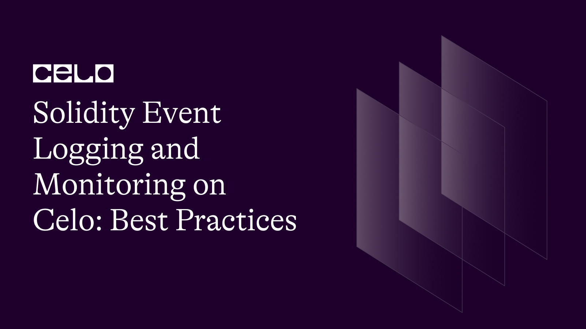

## Introduction

Events in Solidity are essential for providing insight into the inner workings of a smart contract. They serve as a communication channel between the smart contract and the outside world. Events are particularly useful for debugging and contract interaction, as they log and emit information about contract state changes and function calls.

Get full source code [here](https://github.com/richiemikke/solidity-event-logging)

## Prerequisites

To fully follow up with these tutorials, you should have a good understanding of the following technologies.

- Solidity, smart-contract and blockchain concepts.
- Truffle
- Basic Web developement.
- Javascipt.

## Purpose and Importance of Event

Events serve several purposes in a smart contract:

- Notify external applications about changes in the contract's state
- Enable efficient and cost-effective retrieval of data by using indexed parameters
- Assist in debugging by logging meaningful information about contract execution
- Provide an audit trail for contract interactions

### Defining and Emitting Events

**Syntax for Defining Events**

To define an event in Solidity, use the event keyword followed by the event name and a list of indexed and non-indexed parameters within parentheses. For example:

```solidity
pragma solidity ^0.8.0;

contract MyContract {
    event MyEvent(address indexed sender, uint256 value);
}
```

**How to Emit Events in Your Solidity Functions**

To emit an event, simply call it like a function with the appropriate arguments:

```solidity
function myFunction(uint256 _value) public {
    emit MyEvent(msg.sender, _value);
}
```

### Common Use Cases for Events

Events are commonly used to signal the completion of a transaction, the change in contract ownership, or the update of a contract's state variable. Some common use cases for events include:

- Token transfers
- Auctions
- Voting systems
- Decentralized finance (DeFi) protocols

### Best Practices for Event Logging

When designing events, consider the following best practices:

- Create meaningful events that are easy to understand and provide valuable information about the contract's state and actions.
- Include relevant data in event parameters, making sure to differentiate between indexed and non-indexed parameters based on their usage.
- Balance gas costs and event verbosity by carefully choosing the number of parameters and their data types.
- Implement error handling and event reporting for exceptional situations.

### Setting Up Your Celo Development Environment

To set up your Celo development environment, follow these steps:

1. [Install](https://nodejs.org/) Node.js and npm (if not already installed)
2. Install Truffle globally: npm install -g truffle
3. Install Celo CLI globally: npm install -g @celo/celocli
4. Set up a new Truffle project with Celo support: truffle unbox celo-org/truffle-dappkit-box
5. [Install](https://metamask.io/) MetaMask browser extension

**Installing Necessary Tools and Dependencies**

In addition to the installations mentioned above, you should also install the following dependencies for your project:

- @celo/contractkit: A Celo-specific library for interacting with smart contracts on the Celo network. Install it using `npm install @celo/contractkit`.
- @celo/utils: A library containing utility functions for Celo. Install it using `npm install @celo/utils`.

**Connecting to the Celo Network with MetaMask**

To connect MetaMask to the Celo network, follow these steps:

1. Open MetaMask and click on the network dropdown (usually set to "Ethereum Mainnet" by default).
2. Choose "Custom RPC" from the dropdown menu.
3. In the "Network Name" field, enter "Celo Testnet" or another appropriate name.
4. In the "New RPC URL" field, enter the URL of the Celo testnet you're connecting to (e.g., `https://alfajores-forno.celo-testnet.org` for the Alfajores testnet).
5. Fill in the "Chain ID" field with the corresponding chain ID of the Celo testnet (e.g., `44787` for Alfajores).
6. Click "Save" to add the Celo network to MetaMask.

### Celo-Specific Event Logging Considerations

Celo is a mobile-first blockchain platform with a focus on financial inclusion. It shares similarities with Ethereum but has a few key differences. When working with Celo, make sure to:

- Account for Celo-specific features such as the stability protocol, native tokens, and lightweight identity.
- Use the appropriate libraries and tools designed for Celo, like ContractKit and DAppKit.

### Monitoring and Interpreting Event Logs

To monitor and interpret event logs, you can use the following tools:

- Truffle: Offers a built-in event watcher for testing and development.
- Web3.js or Ethers.js: Provides JavaScript libraries to interact with smart contracts and listen for events.
- Celo ContractKit: A Celo-specific library for interacting with smart contracts on the Celo network.

### Tools for Monitoring Events

To monitor events using Truffle, you can add the following code to your Truffle migration script:

```javascript
const MyContract = artifacts.require("MyContract");

module.exports = function (deployer) {
  deployer.deploy(MyContract).then((instance) => {
    instance.MyEvent().on("data", (event) => {
      console.log("Event data:", event.returnValues);
    });
  });
};
```

Using ContractKit, you can monitor events like this:

```javascript
const ContractKit = require("@celo/contractkit");
const kit = ContractKit.newKit("https://alfajores-forno.celo-testnet.org");
const myContractInstance = new kit.web3.eth.Contract(abi, contractAddress);

myContractInstance.events
  .MyEvent({ filter: { sender: someAddress } })
  .on("data", (event) => {
    console.log(event.returnValues);
  })
  .on("error", (error) => {
    console.error(error);
  });
```

### How to Filter and Query Event Logs

To filter and query event logs, use the appropriate functions and filters provided by the libraries. For example, with Web3.js:

```javascript
const myContractInstance = new web3.eth.Contract(abi, contractAddress);

myContractInstance.getPastEvents(
  "MyEvent",
  {
    filter: { sender: someAddress },
    fromBlock: 0,
    toBlock: "latest",
  },
  (error, events) => {
    if (error) {
      console.error(error);
    } else {
      events.forEach((event) => console.log(event.returnValues));
    }
  }
);
```

### Interpreting Event Logs for Debugging and Contract Interaction

Interpreting event logs can help you debug your smart contract, understand the flow of transactions, and enable better interaction with the contract by external applications. While working with event logs, consider the following:

- Look for patterns in event logs to identify potential issues or bugs.
- Analyze event logs to gain insight into contract usage and user behavior.
- Use event logs to optimize contract performance by identifying bottlenecks and inefficient code.

### Code Examples and Use Cases

_Sample smart contract with event logging:_

```javascript
pragma solidity ^0.8.0;

contract SampleToken {
    event Transfer(address indexed from, address indexed to, uint256 value);

    mapping(address => uint256) public balances;

    function transfer(address _to, uint256 _value) public {
        require(balances[msg.sender] >= _value, "Insufficient balance");
        balances[msg.sender] -= _value;
        balances[_to] += _value;
        emit Transfer(msg.sender, _to, _value);
    }
}
```

_Monitoring events with a JavaScript application:_

```javascript
const Web3 = require('web3');
const web3 = new Web3('https://alfajores-forno.celo-testnet.org');
const abi = [...] // ABI from the compiled smart contract
const contractAddress = '0x...'; // Deployed contract address
const sampleToken = new web3.eth.Contract(abi, contractAddress);

sampleToken.events.Transfer({fromBlock: 0})
.on('data', (event) => {
    console.log(event.returnValues);
})
.on('error', console.error);
```

_Event logging in a decentralized exchange (DEX):_

In a DEX smart contract, you may define events such as `TokenPurchase`, `TokenSale`, and `LiquidityAdded`. These events provide crucial information about trades and liquidity provision, which can be used by users and external applications to monitor the DEX activities.

### Summary and Next Steps

In this tutorial, you learned about Solidity event logging and monitoring on the Celo network, including best practices, setting up a Celo development environment, and working with event logs for debugging and contract interaction. You also explored code examples and use cases.

To further expand your knowledge, consider exploring the following resources:

- [Solidity documentation](https://solidity.readthedocs.io/)
- [Celo documentation](https://docs.celo.org/)
- [Truffle Suite](https://www.trufflesuite.com/)
- [Web3.js](https://web3js.readthedocs.io/)
- [Ethers.js](https://docs.ethers.io/v5/)
