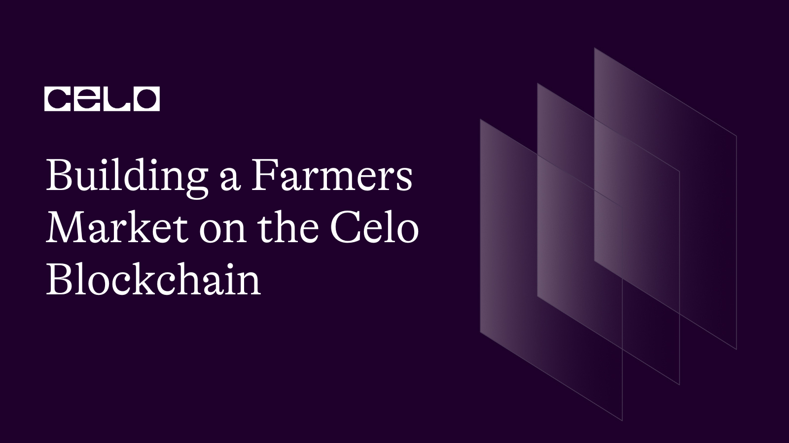

## Introduction

Aloha Readers! Welcome to another by yours truly. In this tutorial, you will be guided on how to build a farmers marketplace where farmers can sell their produce.
We would start off this tutorial by introducing Celo to those who might not be aware of the fascinating technology.

## What is Celo

Celo is a blockchain platform that focuses on enabling mobile-first financial services. It is built using the Ethereum codebase and employs a proof-of-stake consensus mechanism for transaction validation. One unique aspect of Celo is its focus on usability and accessibility, aiming to create a more inclusive and decentralized financial system.

## Prerequisites

- Prior knowledge of javascript
- Familiarity with the command line
- Basic understanding of blockchain concepts
- Have some knowledge of solidity and its concepts
- Have a basic understanding of **[React](https://react.org)**. Knowledge of JSX, props, state, and hooks.

## Requirements

- **[NodeJS](https://nodejs.org/en/download)** from V12.or higher
- A code editor or text editor. **[VSCode](https://code.visualstudio.com/download)** is recommended
- A terminal. **[Git Bash](https://git-scm.com/downloads)** is recommended
- An Internet Browser and a good internet connection
- **[Remix](https://remix.ethereum.org)**
- **[Celo Extension Wallet](https://chrome.google.com/webstore/detail/celoextensionwallet/kkilomkmpmkbdnfelcpgckmpcaemjcdh?hl=en)**.

## Smart Contract Development

Those who have viewed my past instructional materials would recognize that I am an advocate of using Remix to compose intelligent contracts. Remix is an online Integrated Development Environment (IDE) that empowers programmers to create, evaluate, and release intelligent contracts on the Celo blockchain.

On Remix, We would create a new workspace and then a new file which we would name `Farmscribe.sol`

Starting in the first line, you include a statement that specifies the license under which the code is being released.

```solidity
// SPDX-License-Identifier: MIT
pragma solidity >=0.7.0 <0.9.0;
```

The first line is a SPDX license identifier and a Solidity version pragma.

SPDX (Software Package Data Exchange) is a specification that provides a standard way to declare the license of open source software packages. The SPDX-License-Identifier is a header that specifies the license of a given source code file.
The Solidity version pragma specifies the version of the Solidity programming language used to write the smart contract code. The version range specified is greater than or equal to 0.7.0 and less than 0.9.0, meaning that the code should be compiled with a Solidity compiler version between 0.7.0 and 0.8.x.

Following that, we define an `IERC20Token` interface which enables us to interact with the celo stablecoin (cUSD).

```solidity
// SPDX-License-Identifier: MIT

pragma solidity >=0.7.0 <0.9.0;

interface IERC20Token {
  function transfer(address, uint256) external returns (bool);
  function approve(address, uint256) external returns (bool);
  function transferFrom(address, address, uint256) external returns (bool);
  function totalSupply() external view returns (uint256);
  function balanceOf(address) external view returns (uint256);
  function allowance(address, address) external view returns (uint256);

  event Transfer(address indexed from, address indexed to, uint256 value);
  event Approval(address indexed owner, address indexed spender, uint256 value);
}
```

ERC-20 tokens are a well-established standard utilized to generate digital assets on the Ethereum blockchain, including cUSD. These tokens come equipped with pre-defined functions and events that can be effortlessly integrated into contracts, without the need for additional implementation. When interacting with the token, you will be employing the ERC-20 token's interface, which allows your contract to communicate with the token.

For more information on using these functions and events, you can refer to the Celo **[documentation](https://docs.celo.org/developer-guide/celo-for-eth-devs)**. The documentation provides comprehensive details on how to work with ERC-20 tokens and how to utilize them in conjunction with the Celo network.

Moving forward, we possess a Solidity contract with the title "Farmer". Now, let's analyze the code:

```solidity
struct Product{
        address payable owner;
        string name;
        string description;
        string imageHash;
        uint quantity;
        uint price;
    }
    address internal cUsdTokenAddress = 0x874069Fa1Eb16D44d622F2e0Ca25eeA172369bC1;
```

You define a struct called `Product` which has several properties that describe a product. These properties include:

- `owner` which is an address variable that is payable, meaning it can receive payments in cryptocurrency.
- `name` which is a string variable that holds the name of the product.
- `description` which is a string variable that holds the description of the product.
- `imageHash` which is a string variable that holds the hash of the image of the product.
- `quantity` which is an unsigned integer variable that holds the quantity of the product available for sale.
- `price` which is an unsigned integer variable that holds the price of the product in some unspecified cryptocurrency.

Additionally, the code defines an internal variable called `cUsdTokenAddress` which is an address that points to the smart contract address of cUSD. This token is used as a means of payment for purchasing the products defined by the `Product` struct.

Up next, you would design a way for users to create and manage a list of products for sale.

```solidity
    mapping(uint => Product) products;
    uint productLength = 0;
```

You would define a mapping called `products` which maps unsigned integer keys to values of type `Product`. This means that you can use a unique unsigned integer value to retrieve a corresponding `Product` struct.

Additionally, the code initializes a variable called `productLength` with a value of 0. This variable is used to keep track of the number of products that have been added to the `products` mapping. As new products are added to the mapping, the `productLength` variable is incremented to reflect the new number of products.

Now, you would move to the fun part... Creating our functions

Our first function would be the `addProduct` function which allows users to add new products to the list of products for sale.

```solidity
    function addProduct(
        string memory _name,
        string memory _description,
        string memory _imageHash,
        uint _quantity,
        uint _price
    )public {
        products[productLength] = Product(
            payable(msg.sender),
            _name,
            _description,
            _imageHash,
            _quantity,
            _price
        );

        productLength++;
    }
```

This function takes in several parameters that describe a product, including its `name`, `description`, `imageHash`, `quantity`, and `price`. The function then creates a new `Product` struct using these parameters and stores it in the `products` mapping at the index specified by the current value of the `productLength` variable.

The `owner` property of the new `Product` struct is set to the address of the user who called the function, which is obtained using the `msg.sender` keyword. The `productLength` variable is then incremented by one to reflect the fact that a new product has been added to the `products` mapping.

Now that we are done with the `addProduct` function we would move forward to the next function which is the `getProduct` function which allows users to retrieve information about a product stored in the `products` mapping at a specified index.

```js
    function getProduct(uint _index) public view returns(
        address payable,
        string memory,
        string memory,
        string memory,
        uint,
        uint
    ){
        Product storage product = products[_index];
        return(
            product.owner,
            product.name,
            product.description,
            product.imageHash,
            product.quantity,
            product.price
        );
    }
```

You define the function which takes in an unsigned integer parameter called `_index` and returns a tuple containing information about the product stored at that index in the `products` mapping.

The function first retrieves the `Product` struct stored at the specified index in the `products` mapping and assigns it to a local variable called "product". It then returns a tuple containing the following information about the product:

- `owner` - the address of the user who created the product, stored as a payable address.
- `name` - the name of the product, stored as a string.
- `description` - the description of the product, stored as a string.
- `imageHash` - the hash of the image associated with the product, stored as a string.
- `quantity` - the quantity of the product available for sale, stored as an unsigned integer.
- `price` - the price of the product, stored as an unsigned integer.

Up next, we would need a mechanism for the owner of a product to update the quantity of that product. This is a useful feature in a decentralized marketplace, where product quantities may change over time due to various factors such as demand and supply.

```solidity
    function editQuantity(uint _index, uint _quantity)public{
        require(msg.sender == products[_index].owner, "Not the owner");
        products[_index].quantity = _quantity;
    }
```

The function takes in two parameters: an unsigned integer called `_index` that represents the index of the product in the `products` mapping, and an unsigned integer called "\_quantity" that represents the new quantity to set for the product.

The function first checks whether the caller of the function (i.e. the user who is attempting to edit the quantity of the product) is the owner of the product stored at the specified index in the `products` mapping. This is done using the `require` statement, which throws an exception with the given error message if the condition is not met. In this case, if the caller is not the owner of the product, the function will throw an exception and stop executing.

If the caller is the owner of the product, the function sets the `quantity` property of the product stored at the specified index in the `products` mapping to the value of the `_quantity` parameter. This updates the quantity of the product to the new value provided by the caller.

Your next function would be called `confirmBuy` that allows a user to confirm their purchase of a product listed in the decentralized marketplace. This is a key feature in a decentralized marketplace, where users need to be able to securely and efficiently purchase products without the need for intermediaries.

```solidity
    function confirmBuy(uint _index , uint _quantity) public payable{
      require(
            IERC20Token(cUsdTokenAddress).transferFrom(
                msg.sender,
                products[_index].owner,
                products[_index].price * _quantity
            ),
            "Transaction could not be performed"
        );
        products[_index].quantity--;
    }
```

The function takes in two parameters: an unsigned integer called `_index` that represents the index of the product in the `products` mapping, and an unsigned integer called `_quantity` that represents the quantity of the product to purchase.

The function first checks that the caller of the function has transferred the correct amount of cUSD tokens to the product owner's address. This is done using the `transferFrom` function of the cUSD token contract, which is accessed using the `IERC20Token` interface and the `cUsdTokenAddress` variable. The `transferFrom` function transfers cUSD tokens from the caller's address to the product owner's address, with the amount of tokens transferred equal to the product price multiplied by the quantity of the product being purchased.

If the `transferFrom` function call is successful, the function then updates the quantity of the product stored at the specified index in the "products" mapping. In this case, the quantity is decremented by one to reflect the fact that one unit of the product has been purchased.

Our final function would be the `getProductsLength` function which provides a simple and efficient way for users and developers to retrieve information about the current state of the decentralized marketplace, which is an important feature in any blockchain-based application.

The function does not take in any parameters and simply returns an unsigned integer representing the current length of the mapping.

This function is useful because it provides transparency and visibility into the number of products currently listed in the marketplace. This information can be helpful for users who want to gauge the size and popularity of the marketplace, as well as for developers who may want to build applications or integrations that interact with the marketplace.

Because the function is marked as `public` and does not modify the state of the contract, it can be called by anyone on the blockchain network without incurring any gas fees. Additionally, because the function returns a value, it can be used in other functions or contracts to retrieve the current length of the `products` mapping.

```solidity
// SPDX-License-Identifier: MIT

pragma solidity >=0.7.0 <0.9.0;

interface IERC20Token {
  function transfer(address, uint256) external returns (bool);
  function approve(address, uint256) external returns (bool);
  function transferFrom(address, address, uint256) external returns (bool);
  function totalSupply() external view returns (uint256);
  function balanceOf(address) external view returns (uint256);
  function allowance(address, address) external view returns (uint256);

  event Transfer(address indexed from, address indexed to, uint256 value);
  event Approval(address indexed owner, address indexed spender, uint256 value);
}

contract Farmer{

    struct Product{
        address payable owner;
        string name;
        string description;
        string imageHash;
        uint quantity;
        uint price;
    }
    address internal cUsdTokenAddress = 0x874069Fa1Eb16D44d622F2e0Ca25eeA172369bC1;


    mapping(uint => Product) products;
    uint productLength = 0;

    function addProduct(
        string memory _name,
        string memory _description,
        string memory _imageHash,
        uint _quantity,
        uint _price
    )public {
        products[productLength] = Product(
            payable(msg.sender),
            _name,
            _description,
            _imageHash,
            _quantity,
            _price
        );

        productLength++;
    }

    function getProduct(uint _index) public view returns(
        address payable,
        string memory,
        string memory,
        string memory,
        uint,
        uint
    ){
        Product storage product = products[_index];
        return(
            product.owner,
            product.name,
            product.description,
            product.imageHash,
            product.quantity,
            product.price
        );
    }

    function editQuantity(uint _index, uint _quantity)public{
        require(msg.sender == products[_index].owner, "Not the owner");
        products[_index].quantity = _quantity;
    }

    function confirmBuy(uint _index , uint _quantity) public payable{
      require(
            IERC20Token(cUsdTokenAddress).transferFrom(
                msg.sender,
                products[_index].owner,
                products[_index].price * _quantity
            ),
            "Transaction could not be performed"
        );
        products[_index].quantity--;
    }

    function getProductLength () public view returns (uint){
        return (productLength);
    }
}
```

## Contract Deployment

To deploy the contract, we would need:

1. [CeloExtensionWallet](<(https://chrome.google.com/webstore/detail/celoextensionwallet/kkilomkmpmkbdnfelcpgckmpcaemjcdh?hl=en)>)
2. [ Celo Faucet](https://celo.org/developers/faucet)
3. Celo Remix Plugin

Download the Celo Extension Wallet from the Google chrome store using the link above. After doing that, create a wallet, and store your key phrase in a very safe place to avoid permanently losing your funds.

After downloading and creating your wallet, you will need to fund it using the Celo Faucet. Copy the address to your wallet, click the link to the faucet above and paste the address into the text field, and confirm.

Next up, on remix, download and activate the celo plugin from the plugin manager. Connect your wallet and deploy your contract.

## Conclusion

Congratulations on the completion of this tutorial, In summary, we learnt how to write a smart contract for a Farmer marketplace where products can be added, listed, and sold using a stablecoin called cUSD. The contract has several functions, including adding products to the marketplace, retrieving product details, editing product quantity, confirming product purchases, and getting the total number of products in the marketplace.

## Next steps

You can challenge yourself by implementing a frontend and add extra features to your smart contract like time stamps e.t.c. 😉
You can use this [link](https://github.com/dahnny/farmer) for reference

## About the Author

Daniel Ogbuti is a web3 developer with a passion for teaching as well as learning. I would love to connect on Twitter @daniel_ogbuti and linkedin @ Daniel Ogbuti

See you soon!
