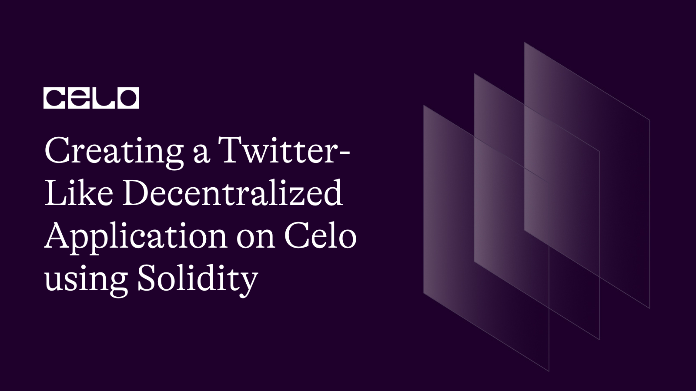
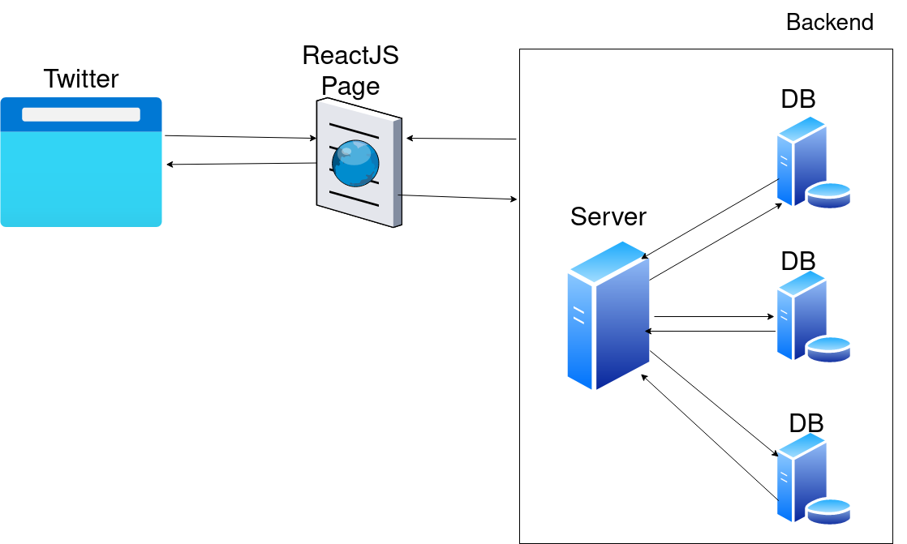
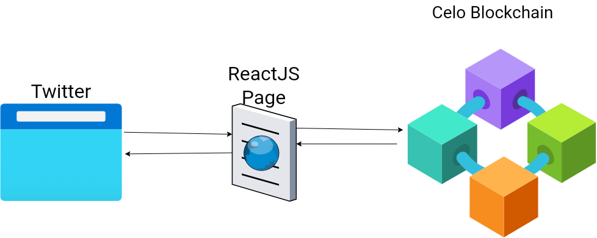
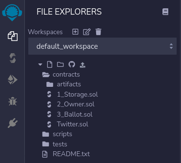

## Introduction

In this series, we will create a Twitter-like decentralized application that runs on the Celo blockchain. It is a two part series and this is part one of the series where we will learn how to create a smart contract in Solidity for our Twitter dapp.

## Prerequisites

- Basic knowledge of [Solidity](https://docs.soliditylang.org) programming language
- Basic knowledge of working with [Ethereum](https://ethereum.org/en/) or the [Celo](https://celo.org/) blockchain

Let's get to the fundamentals of How Twitter works in real life.



When you hit twitter.com on the URL bar, it sends a request to Twitter's server and shares a ReactJs page from the public cloud storage resources available in Twitter's data center to you on your browser which is then compiled with a Javascript engine and rendered on your screen. According to your preferences, you use the functionality and features of Twitter with proper authorization. But what is the problem with the traditional method of sharing and receiving data from Twitter?

The problem is with our data and its privacy policy. When we signup on Twitter, we agree with their terms and conditions which state that they will share our data with 3rd parties which are not known to the general public. Thus, we need to confide our trust in Twitter. So, there is not enough trust built with Twitter because we don't know what the heck they are doing with our data. Have you heard about big tech data breaches?

Let's Deep Dive into Twitter's Decentralized Application that we are going to build.



**Now we need to ask some big and universal questions!**

**How decentralization will help to solve the major issues previously listed?**

**And how the second diagram will solve these problems?**

These questions will be answered throughout the tutorial.

In our dapp which will be built by us in this series, we will use the Celo blockchain networks (the Alfajores testnet for testing and the Mainnet for deploying our dapp in Series 2)

## Intro to Solidity

According to Wikipedia, **_Solidity is an object-oriented programming language for writing smart contracts. It is used for implementing smart contracts on various blockchain platforms, most notably, Ethereum._**

Solidity is an advanced programming language for implementing smart contracts on EVM (Ethereum Virtual Machine). It is highly influenced by Javascript, C++, and Python and was created by Gavin Wood. It is a statically typed language where variables are explicitly declared.

Solidity itself cannot be understood by the Ethereum Virtual Machine, thus converted into EVM assembly or low-level byte code. There are other languages for interacting with EVM like Vyper, LLL, eWasm, Huff, etc.

The Celo blockchain uses the official Golang implementation of the Ethereum protocol - GoEthereum (GETH). So all EVM assembly code that is understood by Ethereum Network can be understood by The Celo network.

Let's get started in building our Twitter smart contract.

## Getting Our Code Environment Ready

We will write our Solidity code on the web IDE provided by the Ethereum foundation which can be found on [Remix IDE](https://remix.ethereum.org) or you can download the Remix IDE on your system from Github. [Download Remix IDE here](https://github.com/ethereum/remix-desktop/releases).

After opening Remix IDE on your browser or installing Remix IDE on System, you can create a Solidity file called `Twitter.sol` in your workspace section.



Let's start the coding section of our smart contract for the Twitter Dapp.

Attach an SPDX License to the heading of your contract with a comment indicating the license.

```solidity

 // SPDX-License-Identifier: MIT

```

You can include a specific license according to the trust you want to build in the smart contract. The SPDX Licensing System in a source code is for describing your smart contract or Solidity code about copyright issues. If you don't want to attach a license then you can specify the value `UNLICENSED`. More information about SPDX License System is on the SPDX website. You can visit here [SPDX](https://spdx.dev/). The List of License supported by SPDX is on the SPDX website [License List](https://spdx.org/licenses/).

Now we need to touch the compiler versioning of the Solidity code.

```solidity
pragma solidity ^0.8.9;

```

At the start of the Solidity code, we need to define the compiler version of solidity which will be helpful for getting the latest syntax and generating ABI and bytecode. (ABI stands for Application Binary Interface. It allows interaction with Solidity outside the Ethereum or Celo blockchain networks. It is mainly helpful for UI which tends to invoke the contract method and properties. Bytecodes are the opcodes (operation codes) deployed on the Celo blockchain network). The `pragma` keyword is used to tell the compiler about the version it needs to use for compilation.

A contract in Solidity code is a collection of codes that have a specific address on the blockchain. It is defined by

```solidity

contract Twitter{}

```

## Structure of a Tweet

**If you have experience with C/C++ programming language then it will be easy to code in Solidity because Solidity and C/C++ are both statically typed language and Solidity borrow some syntax from C/C++.**

Our Twitter dapp is made by tweets that are tweeted by different users. We can define the structure of a tweet in Solidity as:

```solidity
struct Tweet{}
```

Here we have given a basic structure of a Tweet that doesn't contain any information about the tweet. For that, we need to define some basic structure of data that contains information about Tweet. We can have four information resources such as the tweet body, a unique hash for that tweet, the time when the tweet was created, and the owner of the tweet.

```solidity

 struct Tweet{

     string body;

     bytes32 hash;

     uint time;

     address tweeter;

 }
```

Let's break the code into pieces.

- `string body` defines the tweet of the body which is a string.
- `bytes32 hash` is a unique hash generated at the time of the creation of the tweet. It will help to index the tweet easily from the blockchain.
- `uint time` is a time variable that can store an unsigned integer from 0 up to 2^256-1 but here it will store a UNIX timestamp (UNIX timestamp is a way to track the time in running total of seconds from January 1, 1970).
- `address tweeter` is an address variable that stores a 40 hexadecimal character long prefixed by `0x` which is also known as a unique account address created by a wallet.

## Creating Tweet's collection and more

After we have defined the structure of a Tweet. We need to create a database that contains all the Tweets created by each user.

```solidity
Tweet [] public tweets;
```

Here we have created a dynamic state array variable that will store all the Tweets. There are three kinds of variables in Solidity which are state, local, and global variables. But now we need a hashTable that can store key-value pairs (unique hash of Tweet => index of Tweet in storage). For creating a hash table, Solidity provides a special keyword called mapping which will directly implement the hash table for storing and reading the data.

```solidity

mapping(bytes32 => uint) hashtoindex;
mapping(address => uint) private userTweetCount;

```

Now we have created two hash tables for mapping our unique hash to the index number of the tweet in the `tweets` array and also to store the individual amount of tweets for each user in storage. Let's create a constructor which will be used for a different purpose or more specifically will be used in Series 2 but for now, let's create an empty constructor by using the `constructor` keyword followed by empty parameters and curly braces.

```solidity
constructor(){}
```

For now, we need to log our created Tweet on the Celo network also known as the event log which stores tweet descriptions in the transaction log. Solidity provides two special keywords called `event` and `emit`. `event` describes what event needs to be emitted and should be defined in our Solidity code, `emit` keyword is used for invoking an `event` which is stored on the transaction log.

```solidity
event Tweeting(string body, bytes32 hash, uint time, address indexed tweeter);
```

The above code is the definition of an event that stores the tweet information like the body also known as the tweet statement, a unique hash of the tweet, the time when the blockchain recorded the tweet, and the address which made this tweet.

## Creating Tweet on the Celo blockchain

We will write a function that takes a string argument and return a true variable if the tweet is successfully created.

```solidity
function createTweet(string memory _body) public returns(bool success){}
```

The above code states that there is a function named `createTweet()` which takes a string as a parameter and is also available publicly and could be called with the contract and returns a true variable as return type. Let's write some more code onto the `createTweet` function for creating Tweet on the Celo blockchain network and logging the `Tweeting` event.

```solidity

function createTweet(string memory _body) public returns(bool success){

    uint time = block.timestamp;

    bytes32 hash = keccak256(abi.encodePacked(_body,msg.sender,time));

    hashtoindex[hash] = tweets.length;

    userTweetCount[msg.sender]++;

    Tweet memory _temporaryTweet;

    _temporaryTweet.body = _body;

    _temporaryTweet.hash = hash;

    _temporaryTweet.time = time;

    _temporaryTweet.tweeter = msg.sender;

    tweets.push(_temporaryTweet);

    emit Tweetting(temp.body,temp.hash,temp.time,temp.tweeter);

    return true;

}

```

In the `createTweet` function, there is an unsigned variable named `time` which takes the transaction's created time as a UNIX timestamp in its value. A `hash` variable is created which is a derive primitive type of bytes32 which holds 32 bytes. The `hash` variable takes a invoke nested function return.

`keccak256` is a function that computes the Keccak-256 hash of the input. It gives a signature hash of the input data. **`keccak256` shouldn't be confused with sha256. They both are relatively the same.**

`keccak256` takes another function as input. `abi.encodePacked` takes a list of different data types and returns bytes of memory. `abi.encodePacked` performs packed encoding (Packed Encoding also called ASN.1 which takes any kind of data type or cross-platform data and return a single encoded data.) `abi.encodePacked` gives an ambiguous encoding which doesn't mean anything.

We call the mapping variable created as `hashtoindex` that takes a key as the hash of the tweet and makes a pair with the length of the tweets variable. Why do we create `hashtoindex` mapping variable? We will know in the next series.

We also increment the value stored in `userTweetCount` for the tweeter which represent the total number of tweets made by the tweeter.

We named a variable `_temporaryTweet` that is a local variable and doesn't store in the blockchain network. The purpose of the `_temporaryTweet` variable is to store the data of creating Tweet types. While we assigned the complete data respectively to the temporary Tweet variable we created and also pushed the temporary Tweet variable to the state variable `tweets`, we need to invoke the event Tweeting to make a Transaction log on this current Transaction. For that, we need to invoke by keyword `emit` following the event name define as `Tweeting` by passing down the exact order of data.

At Last, we need to return `true` because we have successfully created a tweet in the `tweets` state array variable like database and made a Transaction Log on the Transaction block that a Tweet had been created so at the end we `return true`.

## Getting the Tweet which is recorded on the Celo blockchain network

For reading the tweets from the Celo blockchain network. We are creating two function named `getAllTweets` and `getTweetsByUser`.

```solidity

 function getAllTweets() public view returns(Tweet [] memory){

     return tweets;

 }

```

We have created the `getAllTweets` function that takes no parameter and is a public function, which can be called with the contract itself and have a view modifier which means no state variable will be modified and can read the state variable and will return Tweet array variable which is created to store all the Tweet. At the end of `getAllTweets` function, the function returns the tweets state variable which acts as a storage for this contract.

```solidity

    function getTweetByUser(address _sender) public view returns(Tweet [] memory){

        uint tweetsLength = Tweets.length;

        uint _userTweetCount = userTweetCount[_sender];

        Tweet [] memory _tweet = new Tweet[](_userTweetCount);

        uint j;

        for(uint a = 0; a < tweetsLength; a++){

            if(Tweets[a].tweeter == _sender){

                _tweet[j] = Tweets[a];

                j += 1;
            }
        }

        return _tweet;
    }

```

In the `getTweetByUser` function we take a parameter `_sender` as a tweeter address which will then return an array of tweets, the tweeter created. Firstly, we create two variables `tweetsLength` and `_userTweetCount` to respectively store the current total number of tweets in our smart contract and the total number of tweets made by the `_sender`. We then initialize the `_tweet` variable which we will use to temporarily store all the tweets made by the `_sender` address. Next, we loop through the `Tweets` array, and for each iteration, we check if the tweet is owned by the `_sender` and if it is, we store it in the `_tweet` array. Finally, we return the `_tweet` array.

## Final Source Code

Here is your final Source code for this first series of Twitter Dapps.

```solidity

//SPDX-License-Identifier: MIT
pragma solidity ^0.8.9;

contract Twitter{

    struct Tweet{
        string body;
        bytes32 hash;
        uint time;
        address tweeter;
    }

    Tweet [] private Tweets;
    uint private totalCounts = 0;
    mapping(bytes32 => uint) private hashToindex;
    mapping(address => uint) private userTweetCount;

    event Tweetting(string body, bytes32 hash, uint time, address timer);


    function createTweet(string memory _body) public returns(bool) {
        uint time = block.timestamp;
        bytes32 hash = keccak256(abi.encodePacked(_body,msg.sender,time));
        hashToindex[hash] = totalCounts;
        userTweetCount[msg.sender]++;
        totalCounts += 1;
        Tweet memory temp;
        temp.body = _body;
        temp.hash = hash;
        temp.time = time;
        temp.tweeter = msg.sender;
        Tweets.push(temp);
        emit Tweetting(temp.body,temp.hash,temp.time,temp.tweeter);
        return true;
    }

    function getAllTweet() public view returns(Tweet [] memory){
        return Tweets;
    }

    function getTweetByUser(address _sender) public view returns(Tweet [] memory){
        uint tweetsLength = Tweets.length;
        uint _userTweetCount = userTweetCount[_sender];
        Tweet [] memory _tweet = new Tweet[](_userTweetCount);
        uint j;
        for(uint a = 0; a < tweetsLength; a++){
            if(Tweets[a].tweeter == _sender){
                _tweet[j] = Tweets[a];
                j += 1;
            }
        }
        return _tweet;
    }
}

```

## Deploying the Contract on the blockchain

Now we are at the final stage of deploying our simple Twitter-like smart contract on our preferable network. In this tutorial, we will deploy our smart contract to the Alfajores Testnet.

(1) Install [Celo Extension Wallet](https://chrome.google.com/webstore/detail/celoextensionwallet/kkilomkmpmkbdnfelcpgckmpcaemjcdh?hl=en) or [Metamask](https://metamask.io/)

(2) Create a wallet using the Celo Extension Wallet and follow the instruction or if you choose Metamask then follow the setup [guide](https://docs.celo.org/blog/tutorials/3-simple-steps-to-connect-your-metamask-wallet-to-celo)

(3) Get tokens for the Alfajores Testnet using this [faucet](https://celo.org/developers/faucet)

(4) At last we have to compile and deploy our code on Alfajores Testnet. You can use this [guide](https://docs.celo.org/developer/deploy/remix) for compilation and deployment guide.

## Conclusion

Now we are at the end of the first part of our series where we created our smart contract and deployed it to the Alfajores testnet.

What will we learn in part two of our series?

(1) Adding more features like retweeting a tweet, setting up a Twitter handle username, uploading your profile picture, sending a personal message to any user, searching users by username, and adding a like button to each tweet.

(2) We need a front end to make it easy to interact with our Twitter smart contract. So We will try to connect with a pre-built front-end application.

(3) Getting some real and hard stuff done like gas optimization and interacting with inline assembly or bytecode.

(4) Writing test scripts.

(5) Deploying on Mainnet.

(6) Answering to **some big and universal questions! How decentralization will help to solve the major issues listed above? And how the second diagram will solve the problem?**

## About the Author

My name is Anish Gupta and I am a blockchain engineer. With my passion for technology and cryptography, I am on a mission to encrypt the world! I believe that the power of encryption can create a more secure and trustworthy digital future for all.
