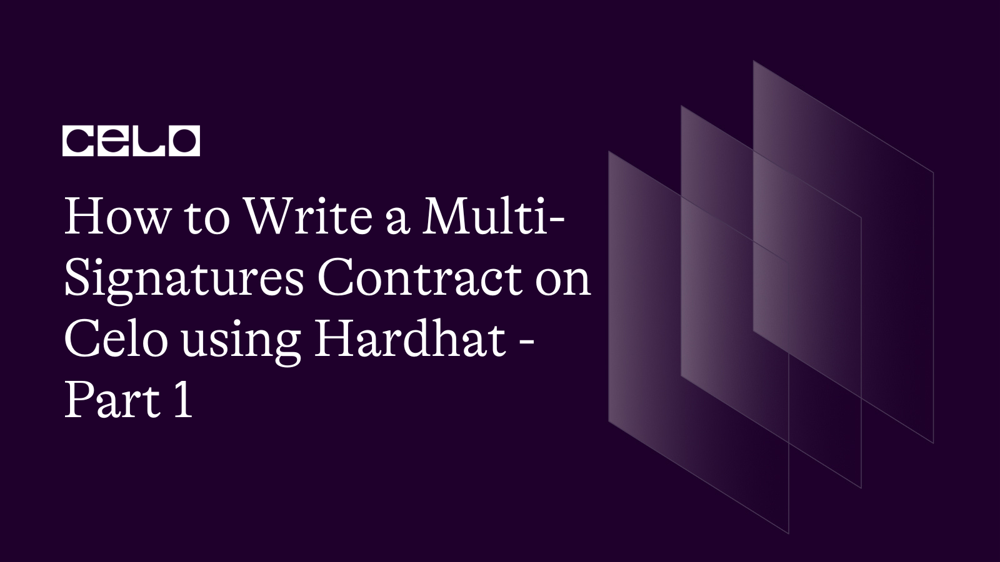

## Introduction

In this tutorial, we will write a multi-signature smart contract in Solidity using Hardhat. Multi-signatures are a secure way to protect your cryptocurrency assets and the ownership of your smart contract. The multi-signature contract acts as a wallet, capable of executing transactions to transfer Ethereum or call other smart contracts.

In this contract, we will set multiple owners, and any transaction executed by the contract will require multiple private keys to sign the transaction. This added security means that if one of your private keys is compromised, your funds and contract ownership are still safe, as multiple private keys (wallets) are required.

Additionally, this contract can be used to decentralize the ownership of a contract between different team members, ensuring that no single individual has complete control over the contract. By utilizing a multi-signature contract, you can ensure that your cryptocurrency assets and smart contract ownership are protected against any potential security breaches or malicious activity.

## Prerequisites

To follow this tutorial, you will need:

- A GitHub account [GitHub](https://github.com)
- Some knowledge of [Solidity](https://docs.soliditylang.org)
- Understanding of the multi-signatures concept (you can read more about it in [What Is a Multisig Wallet?](https://www.coindesk.com/learn/what-is-a-multisig-wallet/))
- Familiarity with the following multi-signature contract terms:

  - **Owners** - Addresses that can sign and execute transactions on this wallet contract.
  - **Threshold** - The number of owner signatures required for a transaction to be executed.
  - **Nonce** - A unique number that identifies each request to prevent signatures from being used on more than one transaction.

## Requirements​

To complete this tutorial, you will need:

- Node.js [Node.js](https://nodejs.org/)
- VS Code [VS Code](https://code.visualstudio.com/)

## Creating a GitHub Repository, Cloning it, and Setting Up Hardhat

### Creating a GitHub Repository

Go to [GitHub](https://github.com) and click on your profile picture in the top right corner, click on **Your repositories** to view your existing repositories.

> **Note**
> If you don't have a GitHub account, create one at [GitHub Sign-up](https://github.com/signup).

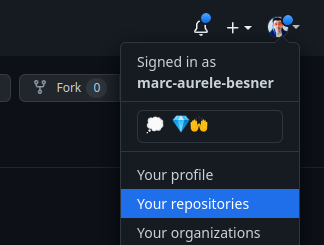

Click on the **New** button to create a new repository.

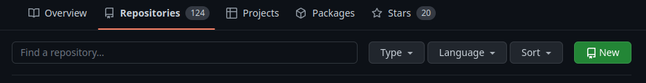

Fill in the details of the repository, give it a **name**, a **description**, select the **visibility** and a **license**.
Then click on **Create repository**

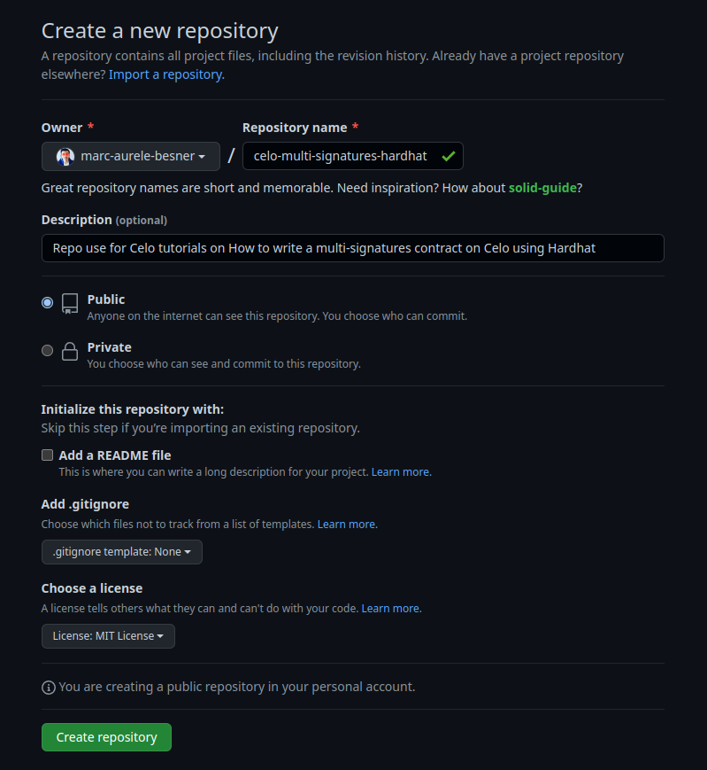

You have now created a new GitHub repository.

### Clone the Repository on Your Computer

Now that you have created a repository for this project, copy the repository URL by clicking on **Code** on your GitHub repository page.

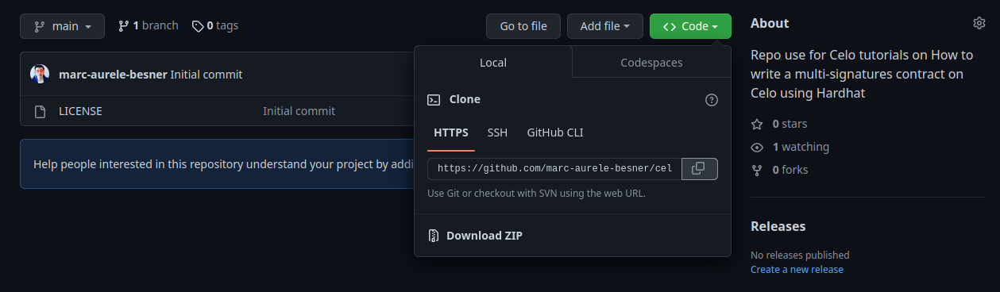

Open VS Code and open a new terminal by pressing "Ctrl + Shift + P" to get the control palette, and then searching for **Create New Terminal** and enter or go in **Terminal > New Terminal** in the top bar.

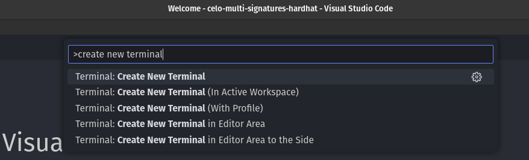

In the terminal, clone your repository by typing:

```bash
git clone <repository url>
```

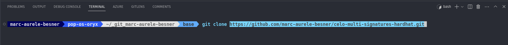

This will have created a new folder with the name of your repo, so we need to move inside this folder using the cd command in the terminal, alternatively you can also use File > Open Folder in the top bar of VS Code to open the repository folder directly in the editor.

```bash
cd <repository name>
```

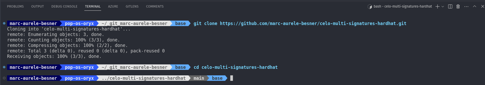

Now that we are inside our project (our repository), let's initialize a Node.js project by running npm init. This will create a package.json file that will contain the project's metadata and dependencies.

In the terminal, run the following command:

### Install and setup this Hardhat project

```bash
npm init -y
```

The -y flag will create a default package.json file without asking any questions. Alternatively, you can omit the -y flag to manually set all the options for your project.

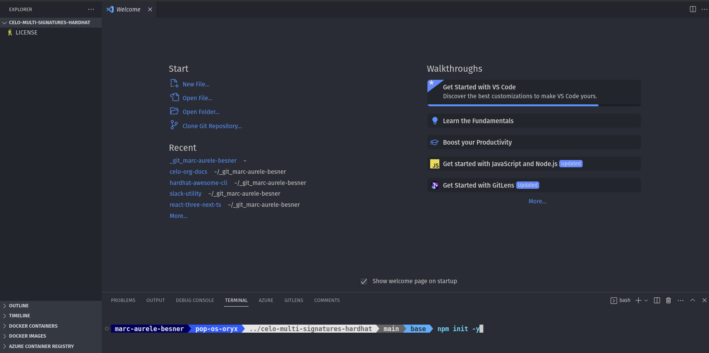

Once it's done, you should see a **package.json** file in the root of your project. This file has basic information about your project and, more importantly, it will keep track of all your project dependencies.

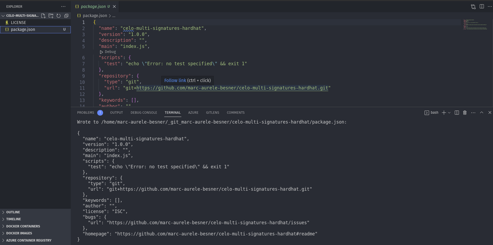

You can install Hardhat in your project by running the following command in your terminal:

```bash
npm install hardhat --save-dev
```

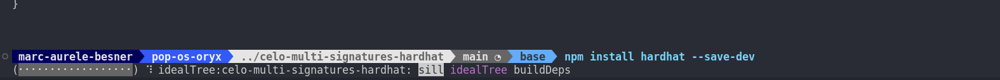

This will install Hardhat as a development dependency and add it to your project's **package.json** file under the **devDependencies** section.

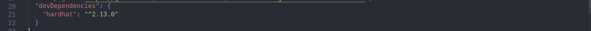

To begin using Hardhat, start by adding the basic boilerplate code. You can do this by running the following command:

```bash
npx hardhat
```

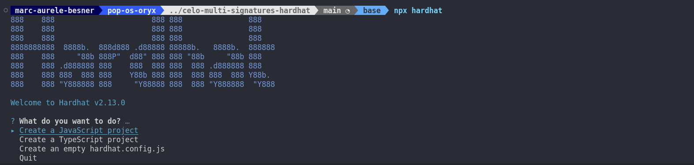

In this menu, you can use the **Up** and **Down** arrow keys to navigate and select **Create a JavaScript project** using the **Enter** key. Once you have made your selection, press **Enter** three times to add the .gitignore file and the Hardhat toolbox.

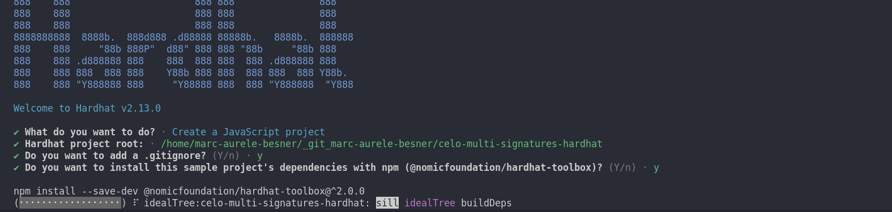

After completing the previous step, you should now have the basic Hardhat boilerplate code. Here is a quick description of the folders and files that have been added:

- **contracts/** - This folder contains all your smart contract code.
- **scripts/** - This folder contains scripts that we will write to deploy our contracts.
- **test/** - This folder contains all the Hardhat tests used to test our contracts.
- **.gitignore** - This file lists all the files we don't want to upload on GitHub.
- **hardhat.config.js** - This file contains all the settings for Hardhat.
- **README.md** - This file serves as documentation and the homepage for this repository.

### Install more dependencies

Let's install a few more dependencies:

- **dotenv** - [dotenv](https://www.npmjs.com/package/dotenv)
- **hardhat-awesome-cli** - [hardhat-awesome-cli](https://www.npmjs.com/package/hardhat-awesome-cli)
- **@openzeppelin/contracts** - [@openzeppelin/contracts](https://www.npmjs.com/package/@openzeppelin/contracts)

```bash
npm install dotenv hardhat-awesome-cli --save-dev
```

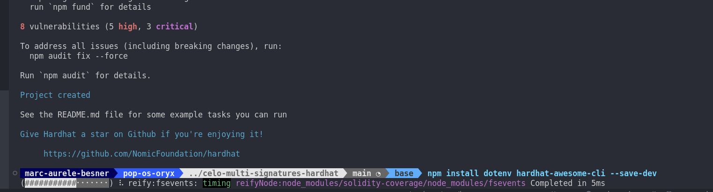

```bash
npm install @openzeppelin/contracts
```

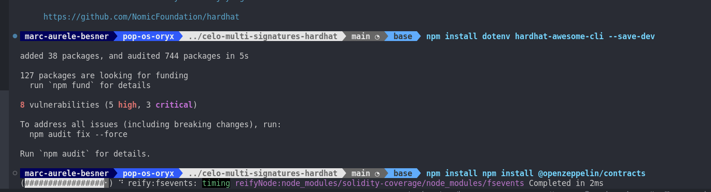

We will use some of these dependencies a bit later to setup our Hardhat configuration, write our contract and write tests.

### Setup the Hardhat setting with Celo blockchain

Open **hardhat.config.js** to set up Celo blockchain. Initially, this file should look like:

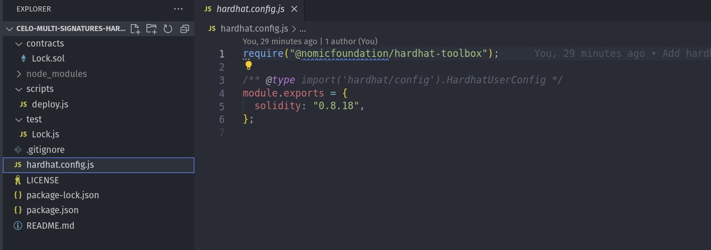

At the top of the file, we will import some of the Hardhat plugins and dependencies we have previously installed in our project.

So, add the following below the last **require()**:

```js
require("hardhat-awesome-cli");
require("dotenv").config();
```

This way, we will have access to the local environment variables we will set to avoid compromising our private key and other secrets by committing them to GitHub by mistake, and we will have access to the **cli** task for easier use of Hardhat.

Now, the top of this file should look like:

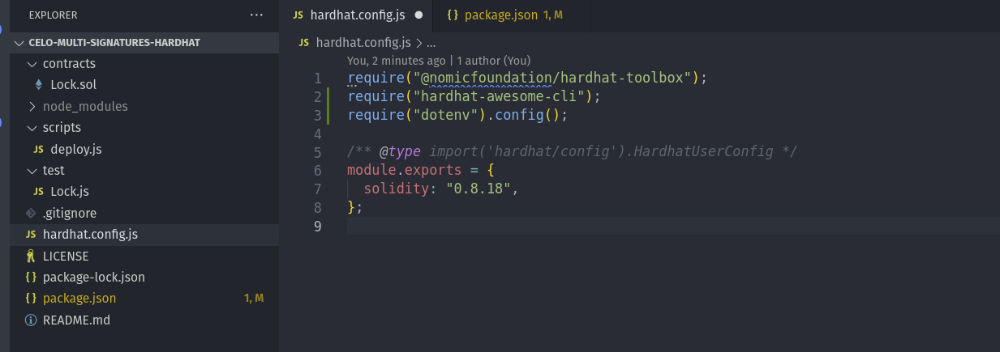

Now, let's change the Hardhat settings to be able to test our contract locally, as well as on Celo Testnet Alfajores and on Celo Mainnet, while keeping our private key secure.

So, let's replace all the content of `hardhat.config.js` after the lines we just added by:

```js
const { CELO_MAINNET_MNEMONIC, CELO_TESTNET_MNEMONIC, CELO_API_KEY } =
  process.env;

/** @type import('hardhat/config').HardhatUserConfig */
module.exports = {
  networks: {
    localhost: {
      accounts: {
        mnemonic: "test test test test test test test test test test test junk",
      },
      chainId: 31337,
    },
    celoMainnet: {
      url: `https://forno.celo.org`,
      accounts: {
        mnemonic: `${CELO_MAINNET_MNEMONIC}`,
      },
      chainId: 44787,
    },
    celoAlfajores: {
      url: `https://alfajores-forno.celo-testnet.org`,
      accounts: {
        mnemonic: `${CELO_TESTNET_MNEMONIC}`,
      },
      chainId: 44787,
    },
  },
  etherscan: {
    apiKey: {
      celoMainnet: `${CELO_API_KEY}`,
      celoAlfajores: `${CELO_API_KEY}`,
    },
  },
  solidity: {
    compilers: [
      {
        version: "0.8.18",
        settings: {
          optimizer: {
            enabled: true,
            runs: 200,
          },
        },
      },
    ],
  },
};
```

Like this:

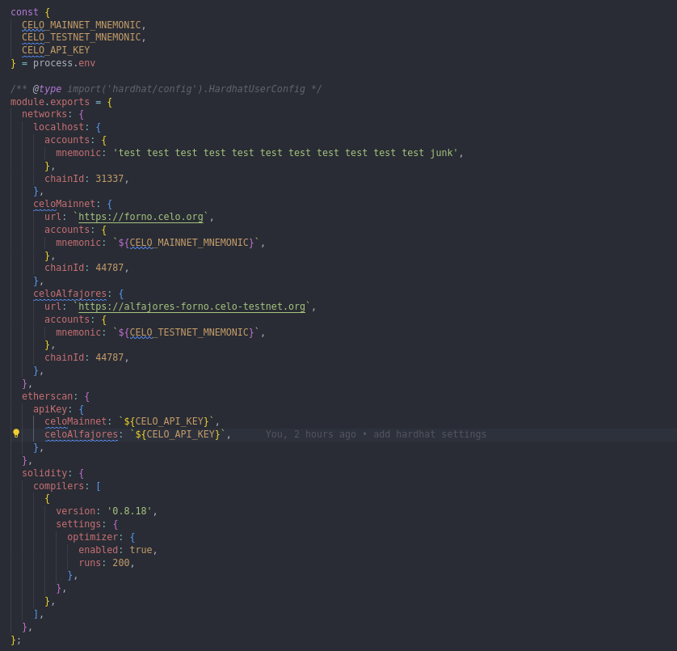

### Setup your environment variables

Create a file `.env` in the root of this project with the 3 secrets we have used in `hardhat.config.js`.

```txt
# Mnemonic
CELO_MAINNET_MNEMONIC=""
CELO_TESTNET_MNEMONIC=""

# Celo Explorer
CELO_API_KEY=""
```

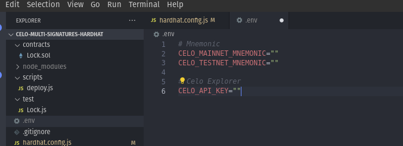

Enter your mnemonic in this file between the `""`. In this tutorial, I use mnemonics as it contains multiple wallets, and we will eventually need multiple wallets to test our multi-signature contract. However, you can also use a private key by changing the setting in `hardhat.config.js` following this documentation [Hardhat config documentation](https://hardhat.org/hardhat-runner/docs/config).

The next step is to make sure these secrets never get compromised and committed to GitHub. We will add this new file `.env` to `.gitignore`. Simply add one line to `.gitignore`.

```txt
.env
```

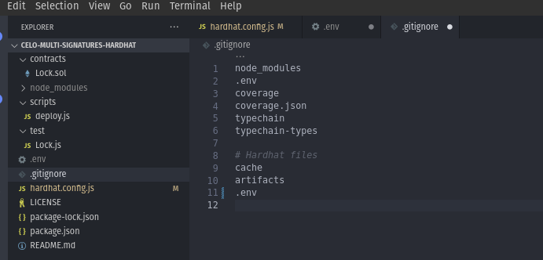

## Start writing the Multi-Signature contract

After setting up all of this, we are ready to write the contract. First of all, we will rename the boilerplate contract that Hardhat has added to our project.

1. Go to `contracts/`.
2. Rename the file `Lock.sol` to `CeloMultiSig.sol`.

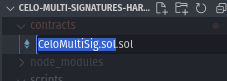

Let's also change the content of the file for an empty contract for now. Replace all by this:

```solidity
// SPDX-License-Identifier: MIT
pragma solidity ^0.8.18;

// Uncomment this line to use console.log
// import "hardhat/console.sol";

contract CeloMultiSig {

}
```

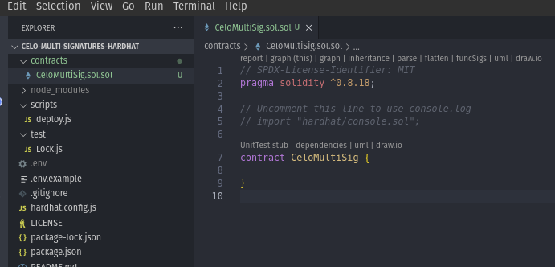

### Importing OpenZeppelin contracts in our contract

OpenZeppelin is one of the most trustworthy open-source libraries to build smart contracts. Therefore, we will import two contracts from the **@openzeppelin/contracts** package, which we previously installed in our project.

At the top of our contract, below the **pragma** statement and before the **contract** keyword, we will add the following code:

```solidity
import "@openzeppelin/contracts/security/ReentrancyGuard.sol";
import "@openzeppelin/contracts/utils/cryptography/EIP712.sol";
```

Like this

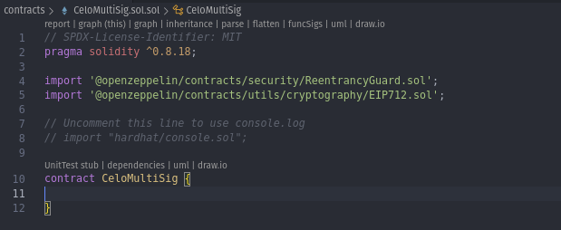

- `ReentrancyGuard.sol` is used to secure our contract against an attack vector called `reentrancy`. You can read more about this attack in smart contracts [here](https://www.geeksforgeeks.org/reentrancy-attack-in-smart-contracts/).
- `EIP712.sol` is used to sign transactions in a secure way following the latest signature standard `EIP712`. You can read more about `EIP712` and how to use it [here](https://medium.com/metamask/eip712-is-coming-what-to-expect-and-how-to-use-it-bb92fd1a7a26).

To ensure that our contract has access to the imported contracts, we need to inherit from them. To do so, we will change the contract line to:

```solidity
contract CeloMultiSig is ReentrancyGuard, EIP712 {

}
```

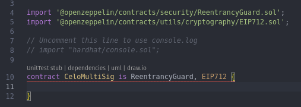

### Assigning Storage for Our Contract

To use storage in our contract, we need to declare it within the contract {} block. Therefore, we will add the following code:

```solidity
uint16 private _ownerCount;
uint16 private _threshold;
uint96 private _nonce;

mapping(address => bool) private _owners;
mapping(uint256 => bool) private _ownerNonceUsed;

bytes32 private constant _TRANSACTION_TYPEHASH = keccak256('Transaction(address to,uint256 value,bytes data,uint256 gas,uint96 nonce)');
```

Like this:

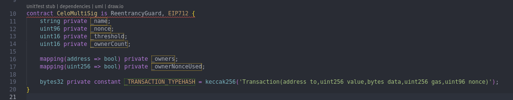

Here is a description of the purpose of each storage/variable:

- **\_ownerCount**: Represents the number of owners of this contract.
- **\_threshold**: Represents the number of owners' signatures required to execute a transaction.
- **\_nonce**: Represents the next nonce to be used by the next transaction.
- **\_owners**: Represents the mapping of each address to a bool value. True means the address is an owner of the contract.
- **\_ownerNonceUsed**: Represents the mapping of each nonce used by the contract to a bool value. True means the nonce has already been used.
- **\_TRANSACTION_TYPEHASH**: A constant value representing the types of different elements hashed to form the signature used to validate each signature. This value is constant and does not use any storage.

### Declaring Events

When we execute a transaction or other function in our contract, we want to emit events to be able to track what happens more easily. To do so, we need to declare some events before using them.

Therefore, under the last line that we added, let's add some events:

```solidity
event OwnerAdded(address indexed owner);
event OwnerRemoved(address indexed owner);
event ThresholdChanged(uint256 indexed threshold);
event TransactionExecuted(
  address indexed sender,
  address indexed to,
  uint256 indexed value,
  bytes data,
  uint256 txnGas,
  uint256 txnNonce
);
event TransactionFailed(
  address indexed sender,
  address indexed to,
  uint256 indexed value,
  bytes data,
  uint256 txnGas,
  uint256 txnNonce
);
```

Like this:

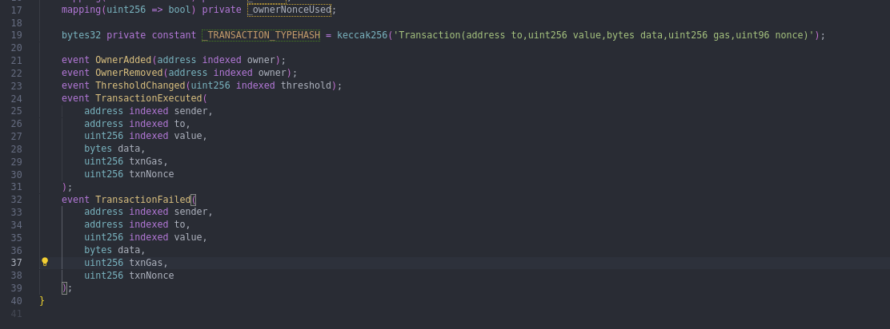

These events do not execute any logic; they only emit events that we can later find inside the transaction receipt or query the blockchain to list all the events a smart contract has emitted.

### Create the constructor function

During the deployment of our contract, we will want to set the different owners' addresses and the threshold for the contract to be used. To do this, we will add a constructor function that will ensure that these values are written in storage at the same time we deploy the contract.

Therefore, under the last line we added, let's add the following code:

```solidity
constructor(address[] memory owners_, uint16 threshold_) EIP712(name(), version()) {
  require(owners_.length <= 2 ** 16 - 1, 'CeloMultiSig: cannot add owner above 2^16 - 1');
  uint256 length = owners_.length;
  for (uint256 i = 0; i < length; ) {
    _owners[owners_[i]] = true;
    unchecked {
      ++i;
    }
  }
  _ownerCount = uint16(owners_.length);
  changeThreshold(threshold_);
}
```

Like this:


So, this constructor function takes 2 arguments:

- **address[] memory owners\_** - A list of owners' addresses
- **uint16 threshold\_** - The minimum number of owners required to sign a transaction for the transaction to be executed (this number needs to be greater than 0 but smaller or equal to the number of owners).

> **Note**
> At this stage, it's normal to have some warnings indicating errors in our contract. The logic inside our constructor function calls other functions that we have not yet written.

### Add functions to the contract

Now it's time to add the bulk of the logic to our contract, including all the functions. Let's start by adding all the view and pure functions, which are read-only calls that don't require any transaction to be accessed.

Therefore, under the last line we added, let's add the following code:

```solidity
/// @notice Retrieves the contract name
/// @return The name as a string memory.
function name() public pure returns (string memory) {
  return 'CeloMultiSig';
}

/// @notice Retrieves the contract version
/// @return The version as a string memory.
function version() public pure returns (string memory) {
  return '1.0';
}

/// @notice Retrieves the current threshold value
/// @return The current threshold value as a uint16.
function threshold() public view returns (uint16) {
  return _threshold;
}

/// @notice Retrieves the amount of owners
/// @return The amount of owners value as a uint16.
function ownerCount() public view returns (uint16) {
  return _ownerCount;
}

/// @notice Retrieves the last txn nonce used
/// @return The txn nonce value as a uint96.
function nonce() public view returns (uint96) {
  return _nonce;
}

/// @notice Determines if the address is the owner
/// @param owner The address to be checked.
/// @return True if the address is the owner, false otherwise.
function isOwner(address owner) public view returns (bool) {
  return _owners[owner];
}
```

Like this:

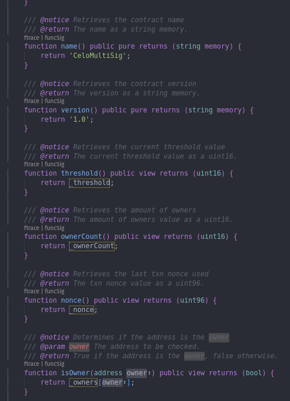

Here is the list of functions we added and their purposes:

- **name()**: Returns the name of the contract (mainly used to form the signature).
- **version()**: Returns the version of the contract (mainly used to form the signature).
- **threshold()**: Returns the threshold of the contract.
- **ownerCount()**: Returns the owner count of the contract.
- **nonce()**: Returns the next nonce of the contract to be used to assemble the signature.
- **isOwner(address owner)**: Returns true or false if an address is an owner of the contract.

Now let's add some housekeeping functions to add, remove, or change owners and to change the threshold.

After the last line, add the following code:

```solidity
/// @notice Adds an owner
/// @param owner The address to be added as an owner.
/// @dev This function can only be called inside a multisig transaction.
function addOwner(address owner) public onlyThis {
  require(_ownerCount < 2 ** 16 - 1, 'CeloMultiSig: cannot add owner above 2^16 - 1');
  _owners[owner] = true;
}

/// @notice Removes an owner
/// @param owner The owner to be removed.
/// @dev This function can only be called inside a multisig transaction.

function removeOwner(address owner) public onlyThis {
  if (_ownerCount <= _threshold) revert('CeloMultiSig: cannot remove owner below threshold');
  _owners[owner] = false;
  _ownerCount--;
}

/// @notice Changes the threshold
/// @param newThreshold The new threshold.
/// @dev This function can only be called inside a multisig transaction.
function changeThreshold(uint16 newThreshold) public onlyThis {
  require(newThreshold > 0, 'CeloMultiSig: threshold must be greater than 0');
  require(newThreshold <= _ownerCount, 'CeloMultiSig: threshold must be less than or equal to owner count');
  _threshold = newThreshold;
}

/// @notice Replaces an owner with a new owner
/// @param oldOwner The owner to be replaced.
/// @param newOwner The new owner.
/// @dev This function can only be called inside a multisig transaction.
function replaceOwner(address oldOwner, address newOwner) public onlyThis {
  require(_owners[oldOwner], 'CeloMultiSig: old owner must be an owner');
  require(!_owners[newOwner], 'CeloMultiSig: new owner must not be an owner');
  require(newOwner != address(0), 'CeloMultiSig: new owner must not be the zero address');
  _owners[oldOwner] = false;
  _owners[newOwner] = true;
}
```

Like this:

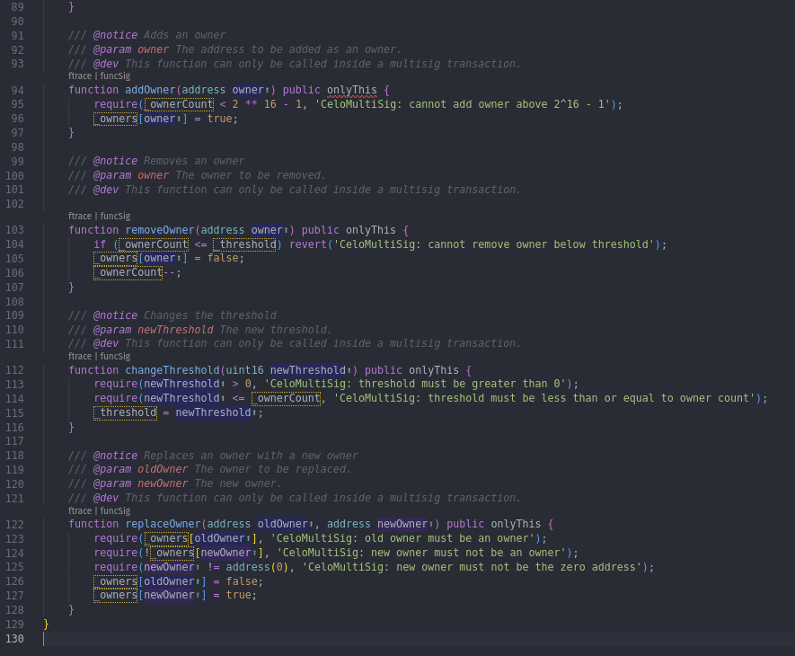

Here is the list of the functions we added and their purposes:

- **addOwner(address owner)**: Add an address to the list of owners.
- **removeOwner(address owner)**: Remove an address from the list of owners (will only work if the new owner count is still higher or equal to the current threshold).
- **changeThreshold(uint16 newThreshold)**: Change the number of owners required to sign a transaction for the transaction to be executed.
- **replaceOwner(address oldOwner, address newOwner)**: Replace one owner address with a different owner address (will only work if the old owner was an owner and the new owner is not already an owner).

The last 4 functions we added are very powerful and can be used to change the ownership of this contract and the number of owners required to authorize and execute a transaction. To keep things safe, you can see in the header of all these functions the modifier **onlyThis**. This is a modifier, a piece of reusable logic that will be executed before the function is executed. It's time to add this logic.

Therefore, near the top of our contract, after the last event and before the constructor function, we will add:

```solidity
modifier onlyThis() {
  require(msg.sender == address(this), 'CeloMultiSig: only this contract can call this function');
  _;
}
```

Like this:


Since **msg.sender** is equal to the address that is sending the transaction, and **address(this)** is equal to the address of the contract, we allow the transaction to proceed **only** if the sender of the transaction is the contract itself. This ensures that the only way to add, remove or change an owner or to change the threshold (after the deployment of the contract) is if a sufficient number of owners sign a transaction to call, for example, addOwner() and execute the transaction.

Now, we need to add the main function in our contract, which will validate the signatures and execute the transaction.

Add the following code after the **function isOwner(address owner)** and before the **function addOwner(address owner)**:

```solidity
  /// @notice Executes a transaction
  /// @param to The address to which the transaction is made.
  /// @param value The amount of Ether to be transferred.
  /// @param data The data to be passed along with the transaction.
  /// @param txnGas The gas limit for the transaction.
  /// @param signatures The signatures to be used for the transaction.
  function execTransaction(
    address to,
    uint256 value,
    bytes memory data,
    uint256 txnGas,
    bytes memory signatures
  ) public payable nonReentrant returns (bool success) {
    uint16 threshold_ = _threshold;
    if (signatures.length < 65 * threshold_) revert('CeloMultiSig: invalid signatures');
    bytes32 txHash = _hashTypedDataV4(
      keccak256(abi.encode(_TRANSACTION_TYPEHASH, to, value, keccak256(data), txnGas, _nonce))
    );
    address currentOwner;
    uint256 currentOwnerNonce;
    for (uint16 i; i < threshold_; ) {
      unchecked {
        currentOwner = _getCurrentOwner(txHash, signatures, i);
        currentOwnerNonce = uint256(uint96(_nonce)) + uint256(uint160(currentOwner) << 96);
        require(_owners[currentOwner], 'CeloMultiSig: invalid owner');
        require(!_ownerNonceUsed[currentOwnerNonce], 'CeloMultiSig: owner already signed');
        _ownerNonceUsed[currentOwnerNonce] = true;
        ++i;
      }
    }
    _nonce++;
    uint256 gasBefore = gasleft();
    assembly {
      success := call(txnGas, to, value, add(data, 0x20), mload(data), 0, 0)
    }
    require(gasBefore - gasleft() < txnGas, 'CeloMultiSig: not enough gas');
    if (success) emit TransactionExecuted(msg.sender, to, value, data, txnGas, _nonce);
    else emit TransactionFailed(msg.sender, to, value, data, txnGas, _nonce);
    return success;
  }

  /// @notice Return the current owner address from the full signature at the id position
  /// @param txHash The transaction hash.
  /// @param signatures The signatures to be used for the transaction.
  /// @param id The id of the position of the owner in the full signature.
  /// @return currentOwner The current owner address.
  function _getCurrentOwner(
    bytes32 txHash,
    bytes memory signatures,
    uint16 id
  ) private pure returns (address currentOwner) {
    unchecked {
      uint8 v;
      bytes32 r;
      bytes32 s;
      assembly {
        let signaturePos := mul(0x41, id)
        r := mload(add(signatures, add(signaturePos, 32)))
        s := mload(add(signatures, add(signaturePos, 64)))
        v := and(mload(add(signatures, add(signaturePos, 65))), 255)
      }
      currentOwner = ecrecover(txHash, v, r, s);
    }
  }
```

Like this:

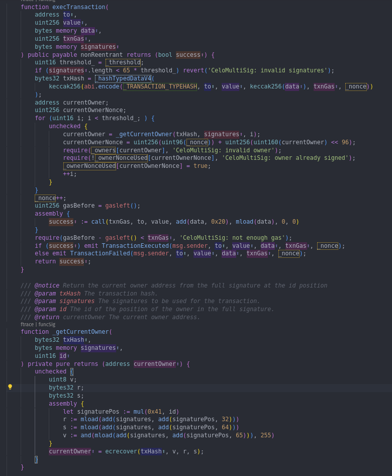

Let's explain what our `execTransaction` function does. First, let's take a look at the arguments it takes:

- `address to`: The address of the target contract or user.
- `uint256 value`: The value to be sent with this transaction in Celo. If you're calling a smart contract and the function doesn't require Celo, pass in 0.
- `bytes memory data`: The call data of the transaction. You can pass in some call data like any transaction. If you're calling a smart contract function, this is where you'll enter the encoded function signature and arguments.
- `uint256 txnGas`: The maximum gas to be used by this transaction. If the call consumes more gas than this, the transaction will fail.
- `bytes memory signatures`: The signatures of all the owners that approved this transaction.

Inside the logic of the function, our first verification is to check that `signatures` argument is at least as long as the length of a regular signature multiplied by the threshold of the contract. We use the `hashTypedDataV4` function in `EIP712.sol` from OpenZeppelin to independently hash all the arguments, the same way the owners would have hashed them prior to signing them, with the following code: `hashTypedDataV4(keccak256(abi.encode(_TRANSACTION_TYPEHASH, to, value, keccak256(data), txnGas, _nonce)))`. This way, we can retrieve the signer of each signature to verify that they are the right owners.

We use a loop to verify each signature for up to the amount of threshold using an internal function, `_getCurrentOwner()`. This internal function uses assembly, a lower-level programming language that allows us to perform simple operations (in this case, byte manipulation) at lower gas cost. The main purpose of this internal function is to split the different signatures that we had previously concatenated all together and finally call `ecrecover()` to retrieve the signer of each signature.

We then verify that this owner has not already signed this transaction and that they are an owner. After verifying all signatures, we save in storage that the owner has signed this transaction, and we increment the nonce so that it cannot be used again. This prevents replay attacks.

We then execute the call (the transaction) and record the gas used by looking at `gasLeft()` before and after, making sure it did not consume more than the limit passed as an argument. Finally, we emit an event with the result of the call, either `TransactionExecuted` or `TransactionFailed`, with the details of this transaction.

## Compile the contract

We have finished writing our contract, and now it's time to see if our contract compiles! To do so, let's run:

```bash
npx hardhat compile
```

Like this:

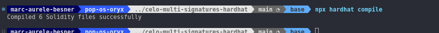

## Conclusion

Congratulations! You've now learned how to write a multi-signature smart contract in Solidity using Hardhat. By following this tutorial, you've gained a solid understanding of how multi-signature contracts work, and you can now implement this secure form of contract ownership protection in your own projects.

In [the second part of this tutorial](https://docs.celo.org/blog/tutorials/how-to-write-a-multi-signatures-contract-on-celo-using-hardhat-part-2-2), we'll explore how to test the multi-signature contract we've just written using Hardhat. Testing is an essential aspect of any smart contract development process, and it ensures that your code works as intended and meets all requirements.

Don't forget that you can view, clone, or fork the full code of this tutorial on GitHub at [Celo Multi-Signatures Hardhat](https://github.com/marc-aurele-besner/celo-multi-signatures-hardhat). You can use this code as a reference for your own multi-signature contracts or modify it to suit your specific needs.

I hope you found this tutorial helpful in your journey towards becoming a proficient blockchain developer. If you have any questions or feedback, please don't hesitate to reach out. Thank you for reading, and happy coding!

## About the author

Hi there! My name is **Marc-Aurele**, but please feel free to call me **Mark**. Thank you for taking the time to read my tutorial. I am a Web3 full-stack and Solidity engineer with a passion for blockchain technology, smart contract development, and building open-source tools.

My mission is to make it easier for developers to build decentralized applications and integrate smart contracts into their projects by creating innovative solutions and tools. I firmly believe that blockchain technology has the potential to revolutionize the way we interact online, and I am committed to contributing to its development.

With extensive expertise in frameworks such as Hardhat and Foundry for Smart Contracts development, I have built multiple open-source tools that facilitate smart contract development and make it more accessible for developers. I am always exploring new technologies and frameworks to stay ahead of the curve and bring fresh ideas to the table.

Sharing my knowledge and helping other developers is also one of my passions. I am always willing to lend a hand to those who are stuck on a blocker, and I am open to collaborating and contributing to the ecosystem. Teaching and mentoring are essential to me, and I believe that by helping others, we can all grow and advance together.

Lastly, if you want to stay updated on my latest projects, tools, and insights on blockchain technology and smart contract development, please consider following me on Twitter at [@marcaureleb](https://twitter.com/marcaureleb) or connecting with me on LinkedIn at [Marc-Aurele Besne](https://www.linkedin.com/in/marc-aurele-besner/). I'm always excited to connect with like-minded individuals and share knowledge and ideas. Let's stay in touch!
