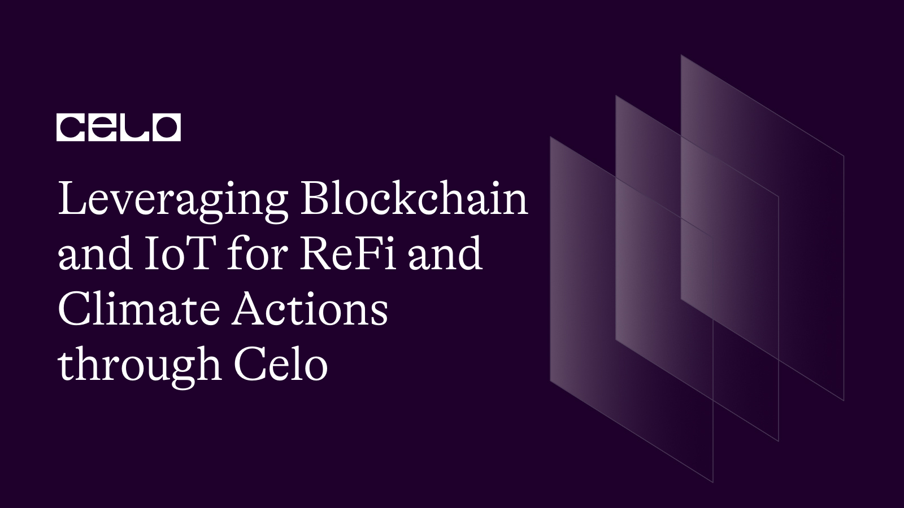

## Introduction​

There is no denying the individual potentials of blockchain and the Internet of Things (IoT)/hardware and the benefits of their intersection in facilitating ReFi and climate actions. What is missing is a conscious effort from developers, ReFi, and climate action advocates to leverage these tools (blockchain and IoT).
There are only a few applications of IoT and blockchain for ReFi and climate action. This situation calls for more applications and products that leverage these tools. However, this will be possible with sound knowledge of focus areas, tools, and current use cases. Providing this knowledge is the focus of this tutorial.

## Prerequisites​

Understanding the following concepts makes the knowledge in this tutorial a no-brainer:

- [Blockchain technology](https://docs.celo.org/blog/tutorials/potential-growth-of-blockchain-and-its-use-cases#what-is-blockchain)
- [Internet of Things (IoT)](https://aws.amazon.com/what-is/iot/#:~:text=The%20term%20IoT%2C%20or%20Internet,as%20between%20the%20devices%20themselves.)
- [Regenerative Finance (ReFi)](https://docs.celo.org/blog/tutorials/regenerative-finance-and-celo-the-process-and-partnership#regenerative-finance-and-celo-the-process-and-partnership)
- [The Celo Ecosystem](https://docs.celo.org/learn/celo-ecosystem#:~:text=CELO%20is%20a%20platform%2Dnative,circulate%20and%20transact%20on%20Celo.)

Aside from the information in the embedded links, I will briefly explain each concept below.

## Understanding the Basics

Before moving into these key elements of ReFi and areas where IoT/hardware can be applied, here are certain basic concepts you must first understand. These concepts are the basic knowledge needed to efficiently leverage blockchain and IoT tools for ReFi purposes.

- **Blockchain Technology**

Blockchain is a distributed, immutable ledger that aids the process of recording transactions and keeping track of assets, which can be digital (cryptocurrencies), tangible (cash, landed properties, etc.), or non-tangible (copyrights, branding, etc.). Almost everything valuable can be tracked, kept safe, and traded using blockchain technology. Blockchain reduces security and ownership risks and cuts costs for every involved party.

- **Internet of Things**

The Internet of Things (IoT) is a network of tangible objects (things) embedded with sensors, software, and other technologies. The purpose of this network is to connect and exchange data with other devices and systems over the internet for informational, resource provisioning, and validation purposes.

IoT devices vary from simple household items to sophisticated industrial tools. Today, there are more than 10 billion connected IoT devices. And experts expect this figure to rise to 22 billion by 2025.

- **Regenerative Finance (ReFi)**

As coined by economist John Fullerton, “ReFi” institutes a process and financial system that uses markets to solve the issues markets create. Presently, blockchain technology and cryptocurrencies, as the most accessible market system yet, help bootstrap efforts to regenerate the world through a regenerative economy. And with platforms like the Celo blockchain, the future of ReFi and climate action is promising.

- **The Celo Ecosystem**

Celo is a layer one blockchain protocol that promotes the ideals of ReFi “to build a financial system that creates the conditions for prosperity—for everyone.” The setup of the Celo ecosystem creates a platform for developers to leverage, enabling features to create a fresh burst of financial solutions accessible to mobile users with just a mobile number. This is possible on Celo thanks to the following key features:

- Layer-1 protocol
- EVM compatible
- Proof-of-stake
- Carbon negative
- Mobile-first identity
- Ultra-light clients
- Localized stablecoins (cUSD, cEUR, cREAL)
- Gas payable in multiple currencies

With blockchain technology, the Internet of Things, and Celo, the potentials are limitless in their applications towards creating a regenerative economy and facilitating climate action.

## Potential Applications of Blockchain and IoT for ReFi and Climate Actions

The powers of blockchain technology and IoT in enabling practical climate actions and creating a regenerative economy are beyond what is presently obtainable. Below are other areas in blockchain and IoT that can be applied to critical elements of ReFi and facilitate climate actions.

### 1. Carbon Pricing

Carbon pricing is a famed mechanism with immense potential and numerous feats achieved over time. That explains how it continues to gain relevance and acceptance. This mechanism helps maximize market forces to tackle climate change by introducing financial incentives for companies and countries to reduce their emissions. Reductions can either be by embracing more environmental-friendly processes like using cleaner fuels.

Carbon pricing comes as either a carbon tax or charge or a cap-and-trade system (also known as the Emissions Trading System). The latter works based on government allotments or permits.

An ETS or a cap-trade system caps the total level of GHG emissions, allowing those industries with low emissions to trade their extra allowances for those that emit more. With supply and demand around emissions allowances, an ETS creates a market price for GHG emissions. Thanks to this cap/budget, you can ensure that the emission reductions happen to keep the emitters in check.

For carbon taxes, there is a direct price set on carbon emissions in the form of a defined tax rate on GHG emissions or, more commonly, on the carbon content of fossil fuels. Carbon taxing is different from an ETS in that the emission reduction outcome of a carbon tax is not predetermined, but the carbon price is.

_The national and economic context determines the government's choice between these two measures._

Developers on Celo can leverage blockchain technology and the Internet of Things (IoT) for better carbon pricing with IoT tools like drones, GHG sensors, and oracles for data validation to determine the correct carbon prices. Also, these tools help gather validated data useful for blockchain tools like decentralized applications, which need this validated data to interact with smart contracts that implement carbon taxes or an emissions trading system.

### 2. Gamification for ReFi

Gamification is the application of gaming elements in non-gaming contexts to influence specific real-world behaviors. These gamified projects use gaming features like points, badges, leaderboards, and challenges to keep players’ attention. Then, they apply these gaming activities to real-world situations that are otherwise unable to increase engagement, like climate action. Through gamification, these ReFi products engage users, solve environmental problems like waste management and GHG emission control, and drive specific behaviors.

This initiative is becoming increasingly popular, both generally and in the ReFi space. Lately, gamification has increased attention to climate change and sustainability movements. An existing real-life gamification use case on Celo is [IntotheVerse](https://intotheverse.xyz/metaverse). This L2 platform is a Celo-based Metaverse project that utilizes a pixelated imitation of planet Earth. Game players live in a crypto-native city and have virtual banks and farms. Rewards on this gamified experience include tokens for eventual cash value and an avenue to contribute towards universal basic income (UBI) projects.

Other examples outside Celo include Wheelcoin, Littercoin, HumanDAO, Ecosapiens, Climate Guardians, etc. With IoT tools like drones and sensor nodes, these gamified platforms can effortlessly validate the carbon and resource data needed to estimate the impact of the gamified actions in real life.

### 3. Waste management and IoT

The possible impacts and potentials of IoT in waste management are exciting. IoT tools can be helpful data collectors, validators, metrics, and triggers to promote proper waste management, keep correct records and data and trigger incentives for proper waste management actions. IoT applications for waste management can include but are not limited to the following:

- Smart waste bins for emission collection, proper solid waste collection, and sorting for recycling and upcycling purposes.
- Sensor nodes for waste collection centers to determine the amount and type of waste collected at various locations.
- Sensor nodes, drones, and geolocation devices for data collection and validation for Oracles of waste management platforms interested in collecting correct waste data.
- Information provision and verification to trigger incentives on waste management platforms, incentivizing proper waste management actions.

[The Wasset platform](https://wasset.io/) is an excellent example of an existing application of IoT in waste management on the Celo blockchain, even though it is still building. [The Wasset whitepaper](https://wasset.io/wasset-whitepaper.pdf) provides more details.

### 4. Mineral Conservation and Exploration

Here is another potential application of blockchain and IoT to create a regenerative economy and ensure sustainability.

Blockchain networks like Celo can help store mineral exploration data, deposit data, and other appropriate data updates around exploration and conservation efforts. Like other blockchains, this data record process works on the Celo blockchain in a decentralized manner.

Also, IoT sensor nodes can help mineral conservationists measure and validate mineral conservation concerns like water level, water consumption level, and mineral usage in specific areas. This process helps keep track of minerals and ensures problems get identified and taken care of early enough.

And when these issues are identified, blockchain smart contracts can ensure efforts to rectify them are profitable by leveraging information and validation from necessary IoT tools like sensors and oracles.

### 5. IoT for Risk and Natural Disaster Management

This possible application of blockchain and IoT on Celo is helpful for insurance companies, government parastatals, and organizations in the environmental and climate space. These bodies can effortlessly monitor environmental changes, indicating possible risks and natural disasters, by leveraging IoT sensor nodes and oracles.

These bodies can also leverage dapps on the Celo blockchain to interact with specific smart contracts designed to prompt actions and reactions to warning signs and reward actions directed at alleviating such risks. This application does not only protect our planet, but it also makes efforts to address these warnings rewarding through incentivization.

## Conclusion

The Celo ecosystem allows and facilitates all of these applications and use cases at the intersection of blockchain and IoT for ReFi and climate action. With a few existing use cases like
**SavePlanetEarth**, **Toucan Protocol**, etc., developers can leverage the Celo blockchain for new solutions in these aspects. Celo provides tools, community, and financial aid to ensure developers can quickly build and scale.

## Next Steps

[The Celo Docs](https://docs.celo.org/) will provide the resources needed to leverage these tools for ReFi and climate actions in the areas mentioned above and more as your next step.

## About the Author

Boyejo Oluwafemi is a hardware product developer working at the intersection of hardware and blockchain technology. He’s working to leverage his wealth of experience working on several products ranging from smart health devices to sporting gadgets to deliver smart payment solutions for crypto for a more inclusive future.

## References

- [What is IoT?](https://aws.amazon.com/what-is/iot/#:~:text=The%20term%20IoT%2C%20or%20Internet,as%20between%20the%20devices%20themselves.)
- [Celo Docs](https://docs.celo.org/)
- [Ecologi](https://ecologi.com/articles/blog/gamification-the-key-to-sustainability-engagement-and-behaviour-change)
- [What is Carbon Pricing?](https://www.spglobal.com/en/research-insights/articles/what-is-carbon-pricing#:~:text=Carbon%20pricing%20is%20an%20increasingly,efficient%20processes%20or%20cleaner%20fuels.)
