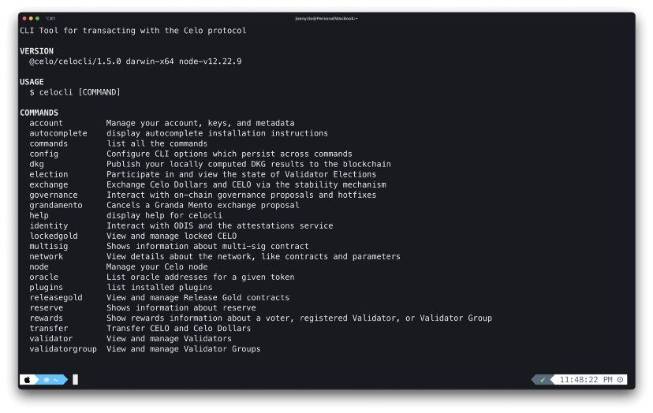
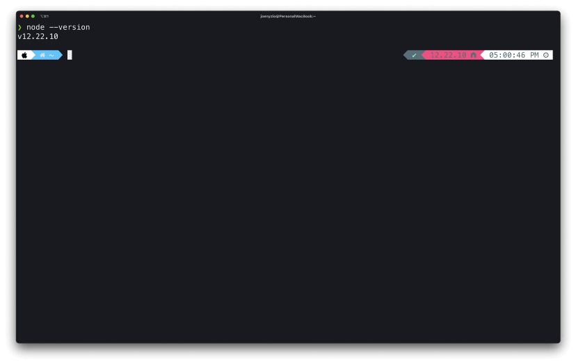
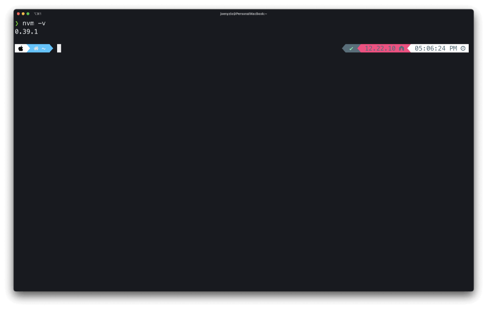
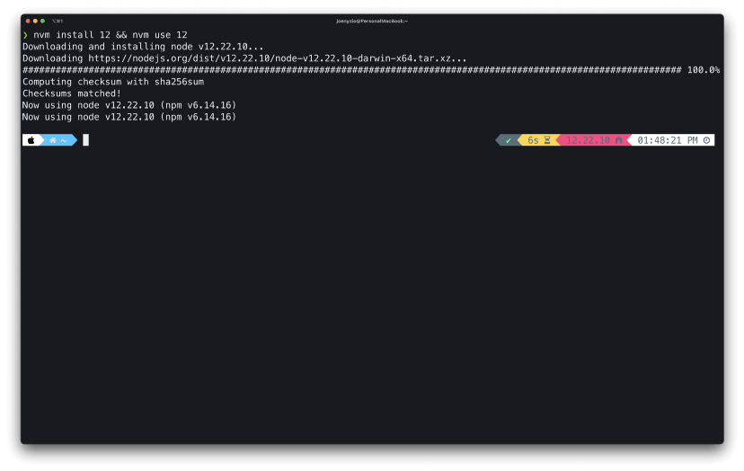
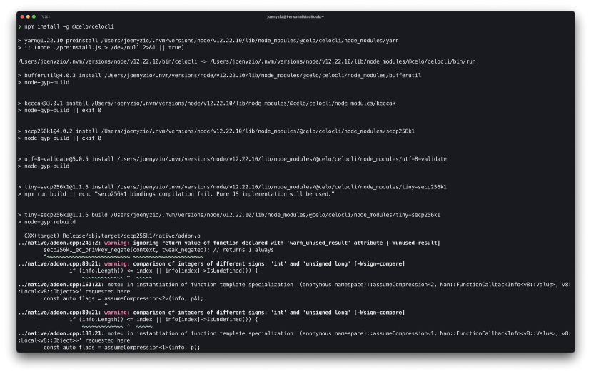
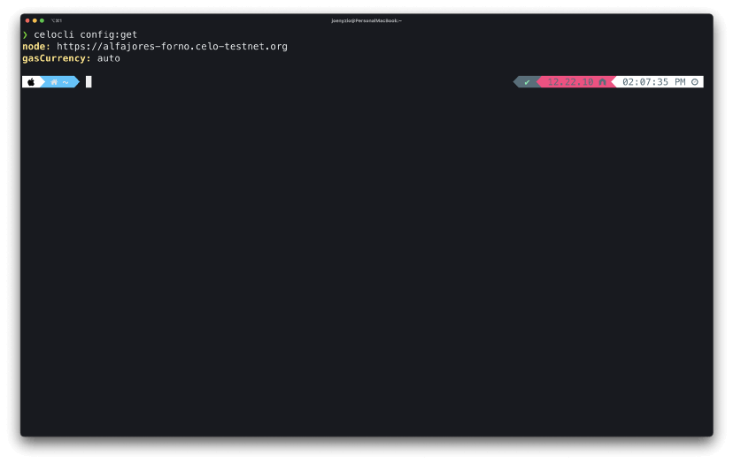
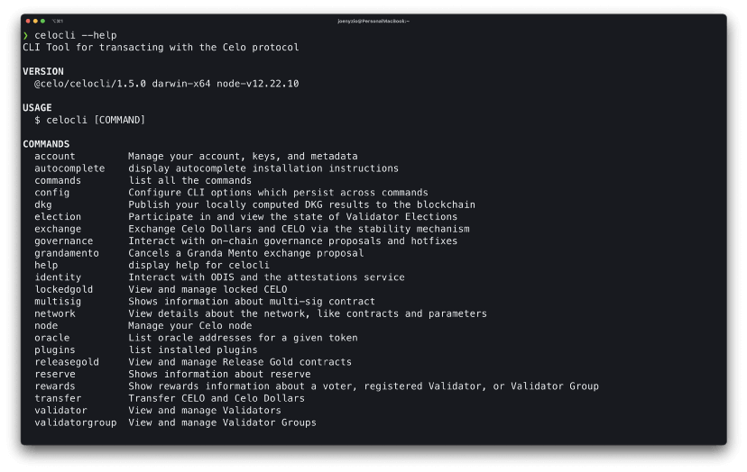
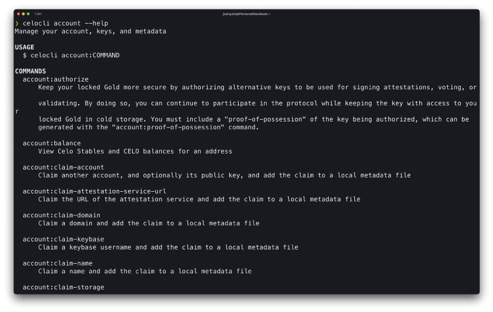
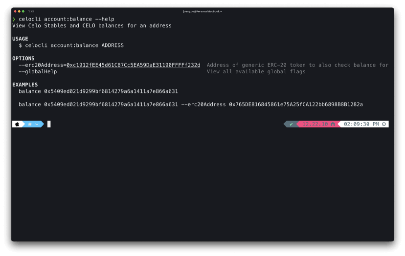

import YouTube from '@components/YouTube';

# Celo CLI: A Practical Guide to Energize your Celo Toolkit

_Explore the Celo blockchain using a command-line interface._


## Hello Developers 🌱

Welcome to today’s post, where we’ll break down a blockchain topic into bite-sized pieces to help you learn and apply your new skills in the real world.

Today’s topic is Getting started with the Celo CLI.

**Here’s a list of what we’ll cover 🗒**

- ✅ Introduction to the Celo CLI
- ✅ CLI Modules
- ✅ Prerequisites
- ✅ Install the CLI
- ✅ CLI Configuration
- ✅ Help Command
- ✅ Example: Find account balance

By the end of this post, you’ll be able to create, deploy, and interact with your mobile dApp using the Celo CLI.

Let’s go! 🚀

## Introduction to the Celo CLI

The Celo Command-Line Interface (CLI) allows you to interact with the Celo Protocol and smart contracts using command-line tools. It provides a set of modules for interacting with [ContractKit](https://github.com/celo-org/celo-monorepo/tree/master/packages/sdk/contractkit) and is an excellent code reference when defining your own modules.



Some common features you may want to consider are helping users participate in elections or in on-chain governance, voting for validators, or helping users interact with multi-sig contracts.

:::tip

Learn more about Celo: [Everything you need to get started with Celo](https://medium.com/@nyzio/celo-spotlight-build-a-financial-system-that-creates-the-conditions-for-prosperity-for-everyone-7b1830efc254)

:::

# CLI Modules

The Celo CLI has a growing collection of modules you can use to interact with the Celo Platform. This post will go through each of these modules in detail and provide references you can use to learn more.

- [account](https://docs.celo.org/command-line-interface/account)
- [autocomplete](https://docs.celo.org/command-line-interface/autocomplete)
- [commands](https://docs.celo.org/command-line-interface/commands)
- [config](https://docs.celo.org/command-line-interface/config)
- [dkg](https://docs.celo.org/command-line-interface/dkg)
- [election](https://docs.celo.org/command-line-interface/election)
- [exchange](https://docs.celo.org/command-line-interface/exchange)
- [governance](https://docs.celo.org/command-line-interface/governance)
- [grandamento](https://docs.celo.org/command-line-interface/grandamento)
- [identity](https://docs.celo.org/command-line-interface/identity)
- [lockedgold](https://docs.celo.org/command-line-interface/lockedgold)
- [multisig](https://docs.celo.org/command-line-interface/multisig)
- [network](https://docs.celo.org/command-line-interface/network)
- [node](https://docs.celo.org/command-line-interface/node)
- [oracle](https://docs.celo.org/command-line-interface/oracle)
- [plugins](https://docs.celo.org/command-line-interface/plugins)
- [releasegold](https://docs.celo.org/command-line-interface/releasegold)
- [reserve](https://docs.celo.org/command-line-interface/reserve)
- [rewards](https://docs.celo.org/command-line-interface/rewards)
- [transfer](https://docs.celo.org/command-line-interface/transfer)
- [validator](https://docs.celo.org/command-line-interface/validator)
- [validatorgroup](https://docs.celo.org/command-line-interface/validatorgroup)

:::tip

Learn more: [View the code](https://github.com/celo-org/celo-monorepo/tree/master/packages/cli/src/commands)

:::

## Prerequisites

Before installing the CLI, you’ll need to install its dependencies.

### Dependencies

Celo is currently deploying the CLI with Node.js v12.x. If you are running a different version of Node.js, consider using NVM to manage your node versions.

Check node version

```
node --version
```



### Install Node Version Manager (NVM)

If you have the wrong version of node or don’t have node, install the Node Version Manager (NVM) to help manage your node versions.

curl

```
curl -o- https://raw.githubusercontent.com/nvm-sh/nvm/v0.39.1/install.sh | bash
```

or…

wget

```
wget -qO- https://raw.githubusercontent.com/nvm-sh/nvm/v0.39.1/install.sh | bash
```

### Verify NVM Installation

You can check that NVM is properly installed using the following command.

```
nvm -v
```



### Install Node.js using NVM

Install and use the correct version of node with the following command.

```
nvm install 12 && nvm use 12
```



:::tip

Install and learn more about npm [here](https://www.npmjs.com/)

:::

## Install the CLI

Install the Celo CLI with npm using the following command.

```
npm install -g @celo/celocli
```



:::tip

Install and learn more about celocli [here](https://www.npmjs.com/package/@celo/celocli)

:::

## CLI Configuration

You can configure the CLI to work with Celo Mainnet, Alfajores Testnet, or Baklava Testnet using the following commands.

### Celo Mainnet

```
celocli config:set --node=https://forno.celo.org
```

### Alfajores Testnet

```
celocli config:set --node=https://alfajores-forno.celo-testnet.org
```

### Baklava Testnet

```
celocli config:set --node=https://baklava-forno.celo-testnet.org
```

### Verify CLI configuration

Verify your network configuration using the following command. The image below shows configuration with the Alfajores Testnet.

```
celocli config:get
```



### Help Command

The Help command allows you to display additional details for any CLI command. This post provides the help command for every command so that you can easily run them from your terminal to learn more.

```
celocli --help
```



You’re ready to start reading from the Celo blockchain!

### Example: Find account balance

Before going through each of the CLI commands, follow this example to read an account balance from the Alfajores Testnet.

### Set configuration to Alfajores Testnet

```
celocli config:set --node=https://alfajores-forno.celo-testnet.org
```

### View account help details

View the account help details and look for account:balance. You’ll use this command to view the balance of your account.

```
celocli account --help
```



### View account:balance details

You can read additional details for account:balance (and any sub-command) by including that command in your help command.

```
celocli account:balance --help
```



This command with show you the usage, options, and examples for this command. By using these options and replacing the examples with your own values, you can return your own values from the Celo blockchain.

```
celocli account:balance --help
```

### View account balance

Choose any Alfajores Testnet account balance to view from the terminal. If you don’t have an account, you can use the one provided here.

```
celocli account:balance 0xd55e4A1412E28BcFA56e8Acf6F9F2E65Ce4c9923
```

<!-- image -->

If you made it this far you have installed the CLI and read your first account balance! You’re now ready to read the docs and code to explore any command on the Celo CLI.

For any command you find interesting, run it in your terminal, explore the docs, and click See code to get a better understanding of how each CLI command works. Once you get the hang of it, you won’t need this post, the docs, or the code. Everything you need is available from the terminal for you to explore however you’d like!

## Congratulations 🎉

That wraps up today’s topic on Getting started with the Celo CLI. You can review each of the items we covered below and check that you’re ready to apply these new skills.

**Here’s a quick review of what we covered 🤔**

- ✅ Introduction to the Celo CLI
- ✅ CLI Modules
- ✅ Prerequisites
- ✅ Install the CLI
- ✅ CLI Configuration
- ✅ Help Command
- ✅ Example: Find account balance

If you run into any issues, try reviewing the content or searching online to explore each topic in more detail. Hopefully, you’ve learned a few things about Getting started with the Celo CLI that you can apply in the real world.

GN! 👋
