import YouTube from '@components/YouTube';

# Celo Composer: Easily Build Full-Stack Mobile dApps on Celo

_Quickly develop full-stack progressive web applications on Celo with the Celo Composer._

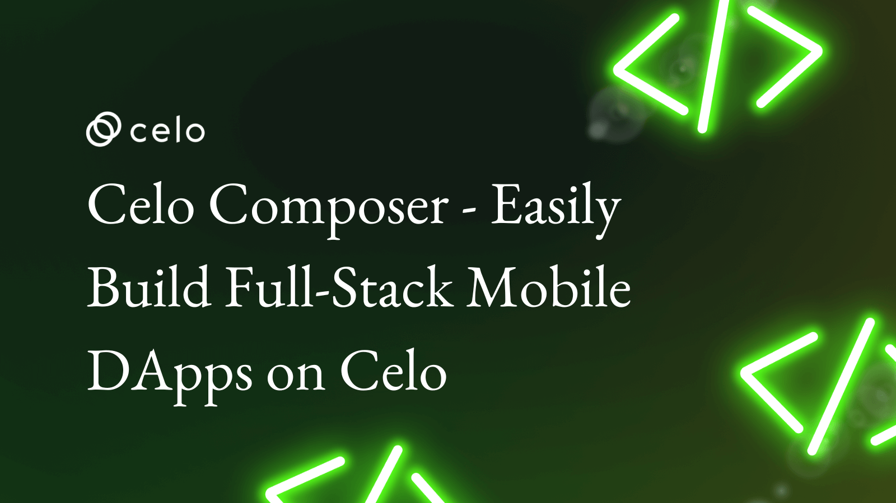

## Hello Developers 🌱

Welcome to today’s post, where we’ll break down a blockchain topic into bite-sized pieces to help you learn and apply your new skills in the real world.

Today’s topic is Building full-stack mobile dApps with Celo Composer.

**Here’s a list of what we’ll cover 🗒**

- ✅ **Step 1:** Set up your project repo
- ✅ **Step 2:** Create a local project
- ✅ **Step 3:** Set up your testnet account
- ✅ **Step 4:** Deploy smart contracts​
- ✅ **Step 5:** Start the front-end
- ✅ **Step 6:** Explore your dApp
- ✅ **Step 7:** Customize your dApp
- ✅ **Step 8:** View on mobile

By the end of this post, you’ll be able to create, deploy, and interact with your mobile dApp using the Celo Composer.

Let’s go! 🚀

## Introduction to Celo Composer

The [Celo Composer](https://celo-progressive-dapp-starter.netlify.app/) is a starter pack to get you up and running fast with Celo DApp development. From there you can quickly build, iterate, and deploy new DApps on the Celo blockchain.

**Here’s a quick look at what you’ll build:**

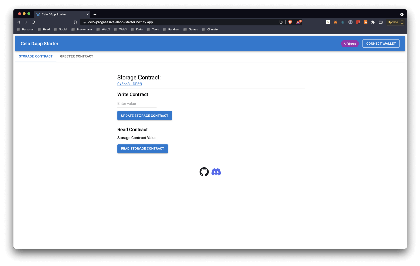

:::tip

Learn more: View the project [README](https://github.com/celo-org/celo-progressive-dapp-starter)

:::

### Prerequisites​

To start building, you’ll need a basic understanding of web development, Node (v12), yarn, and Git.

- [Node (v12)](https://nodejs.org/en/), [NVM](https://github.com/nvm-sh/nvm)
- [Yarn](https://classic.yarnpkg.com/en/)
- [Git](https://git-scm.com/)

The Celo Composer uses the [Next.js](https://nextjs.org/) React framework with [Material UI](https://mui.com/), and [use-contractkit](https://www.npmjs.com/package/@celo-tools/use-contractkit).

## ✅ Step 1: Set up your project repo​

Navigate to the [project repo](https://github.com/celo-org/celo-progressive-dapp-starter) and select **Use this template**.

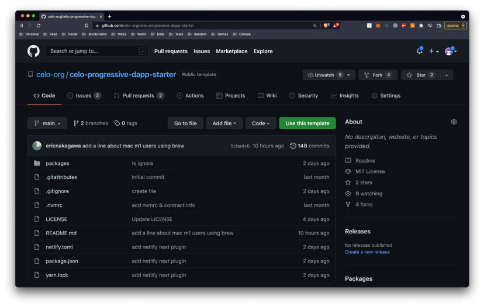

Add a repository `name` and `description` and click Create repository from template.

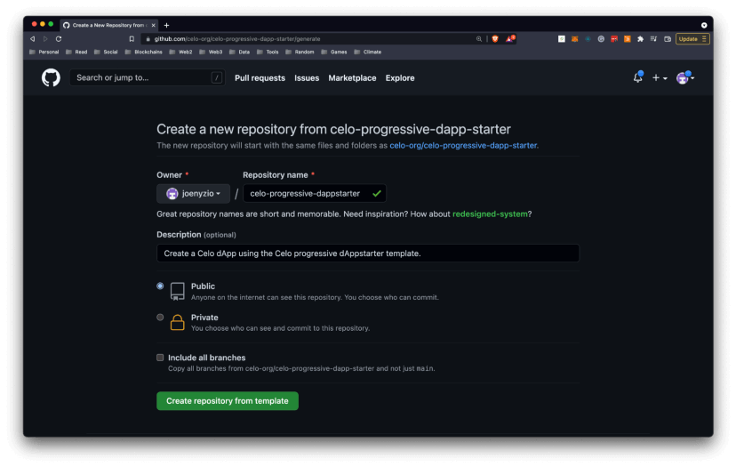

:::tip

Contributors: Celo Composer accepts community contributions! If you would like to contribute to the project, you can instead fork this repo and submit a PR to suggest improvements.

:::

## ✅ Step 2: Create a local project​

From your new GitHub repository, select code, and copy the GitHub URL for your project.


Open your terminal, navigate to your project directory, and `git clone` your project using the GitHub URL.

```
git clone https://github.com/path-to-your-project-repo
```

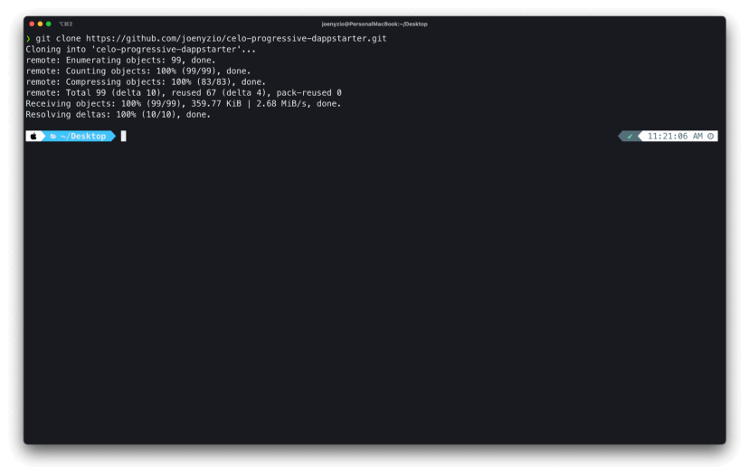

Navigate into your Celo project and run `nvm use` to switch to a Celo compatible Node version. Celo is compatible with Node v12 as specified in `.nvmrc` of the project folder.

```
cd your-project-name
nvm use
```

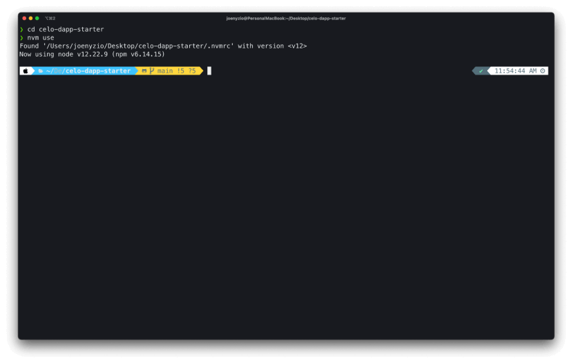

### Open Project

Open your project using your favorite IDE (example: VS Code).

```
code .
```

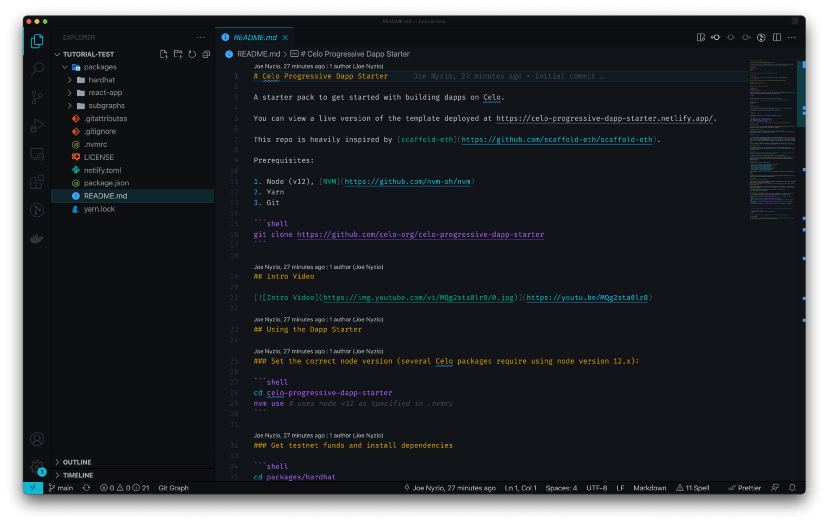

## ✅ Step 3: Setup your testnet account

Navigate into the `packages/hardhat` directory.

```
cd packages/hardhat
```

Install the project dependencies from within the `packages/hardhat` folder.

```
yarn install
```

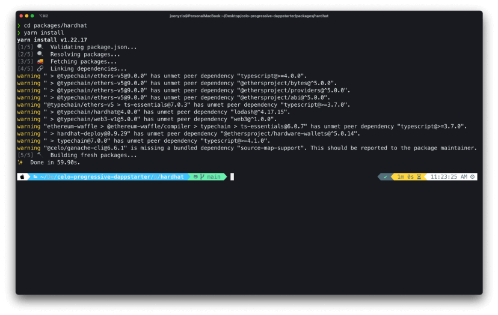

Create a new account and print the account number and private key using hardhat `create-account`.

```
npx hardhat create-account
```

:::tip

Copy your `PRIVATE_KEY` and testnet account address into a place you can easily access them later.

:::

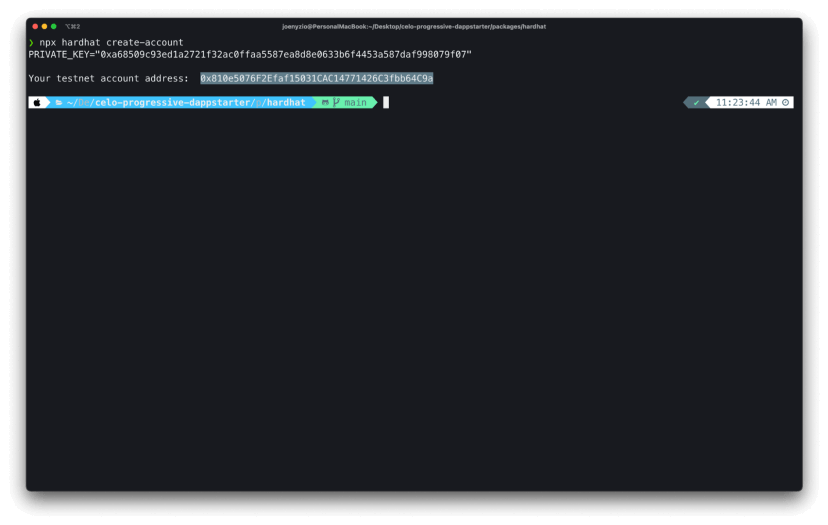

Copy the testnet `account address`, paste it into the [Celo Testnet Faucet](https://faucet.celo.org) and select Get Started to transfer funds into your testnet account.

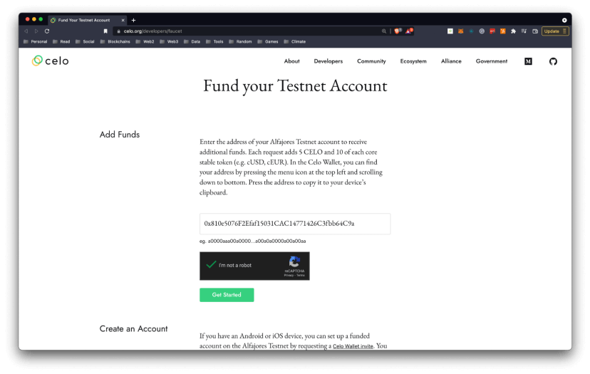

Import a new account to MetaMask using your `private key` to view your newly funded Alfajores Testnet Account.

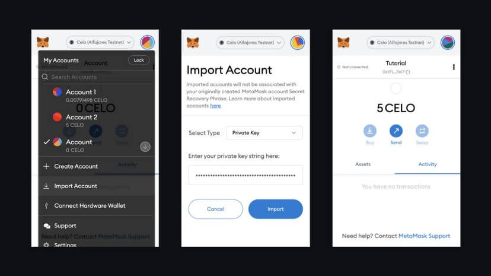

Check that your network is set to Celo (Alfajores Tesnet).

:::tip

MetaMask Setup: Learn more about setting up your Alfajores Testnet with MetaMask [here](/wallet/metamask/setup#adding-a-celo-network-to-metamask)

:::

## ✅ Step 4: Deploy smart contracts​

Open the `hardhat/.env` file and replace `PRIVATE_KEY` with the account private key from your terminal.

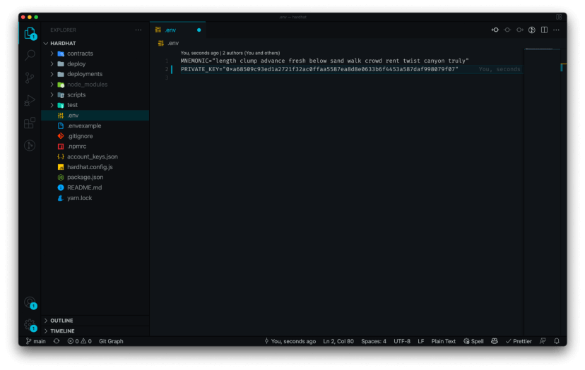

Return to your terminal and run `yarn deploy` to deploy your smart contracts.

```
yarn deploy
```

### Redeploy Contracts

You can run `yarn deploy --reset` to force re-deploy your contracts anytime you would like. This will deploy all contracts to a new address whether or not you made any changes.

```
yarn deploy --reset
```

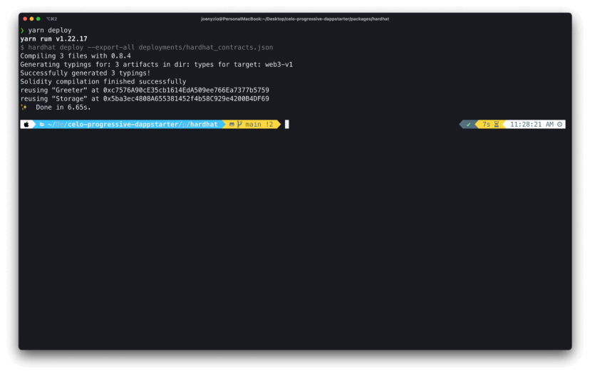

## ✅ Step 5: Start the front-end​

Navigate into the `packages/react-app` folder and run `yarn install` to install the project front-end dependencies.

```
cd ../react-app
yarn install
```

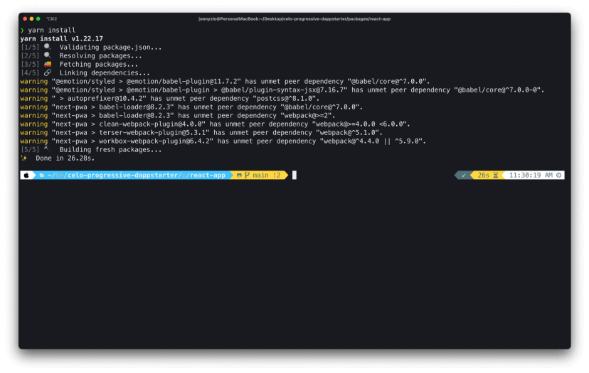

Run `yarn dev` to start your development environment.

```
yarn dev
```

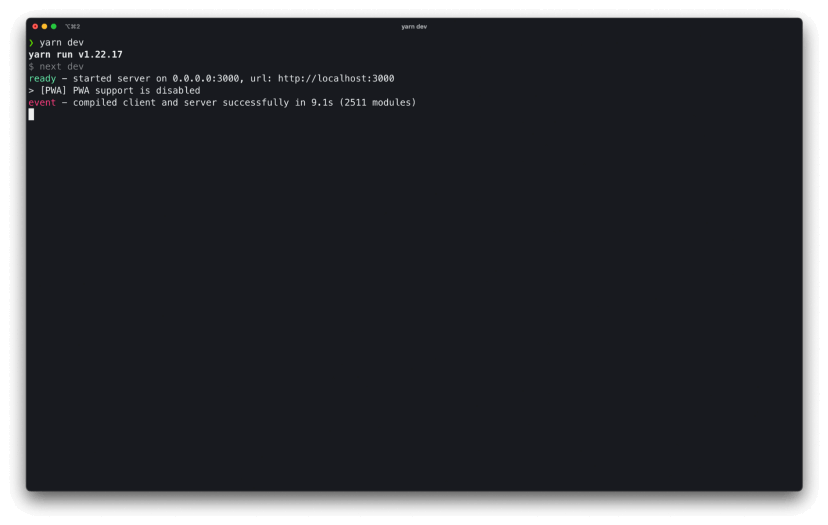

Open `localhost:3000` to view your project.


## ✅ Step 6: Explore your dApp​

Enter a value in the write contract function and confirm the transaction to store a value.

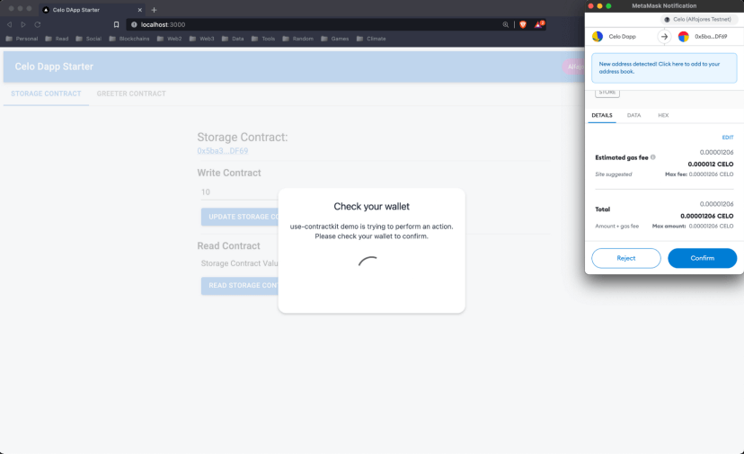

Once the transaction has been complete (approximately 5 seconds) you may view the transaction using the alert that appears with a link to the [Celo Alfajores Block Explorer](https://alfajores-blockscout.celo-testnet.org/).

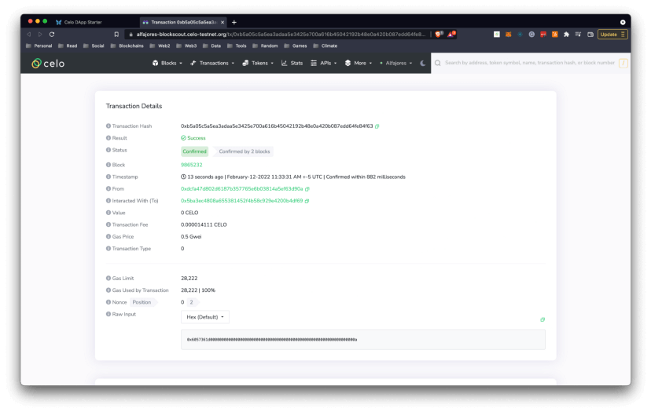

You should now be able to view the updated storage value using the Read Storage Contract function.

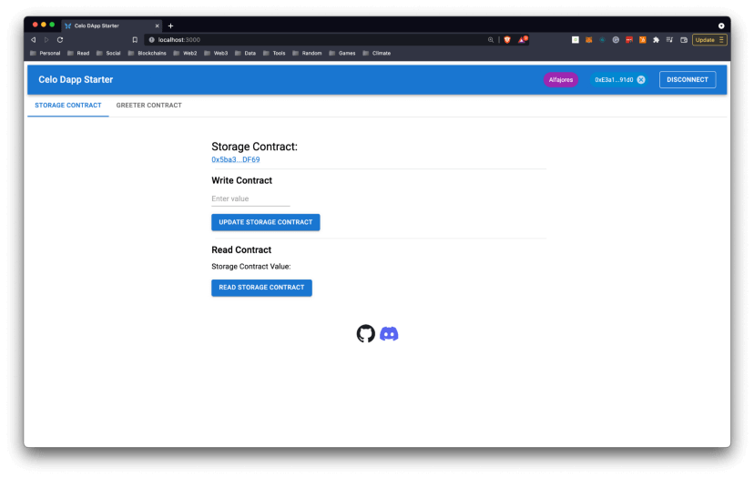

View the `Greeter Contract` using the tabs to interact with a similar contract that allows you to read and write string values rather than numbers.

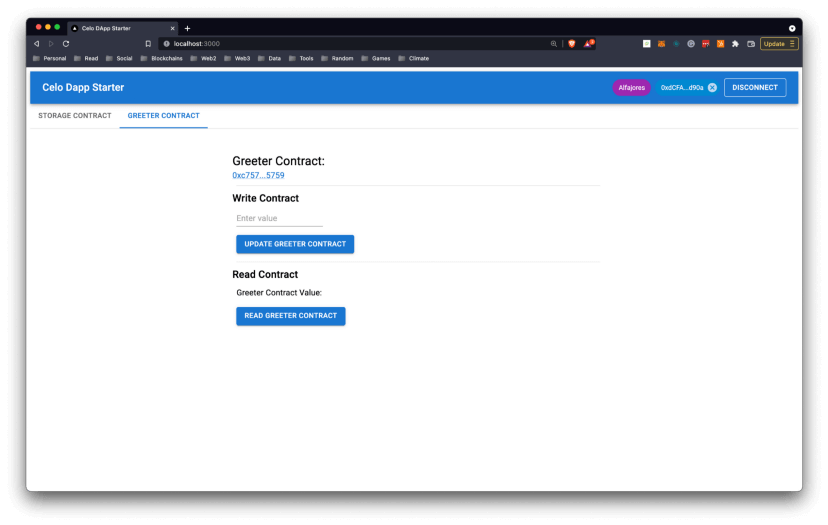

## ✅ Step 7: Customize your dApp​

The Celo Composer makes it easy to customize your dApp and build entirely new dApps from scratch. Here’s a quick look at where you’ll want to focus to edit or build your new dApp.

:::tip

For a step-by-step guide to create a new custom dApp, view [Celo Composer: Extend and Customize your Full-Stack Mobile Dapps](https://joenyzio.medium.com/celo-dappstarter-customize-your-full-stack-mobile-dapps-on-celo-232d85b7a2c5)

:::

### Smart contracts

Smart contracts for this project are in the `packages/hardhat/contracts` folder. You may edit existing contracts or create new contracts to update the functionality of your dApp.

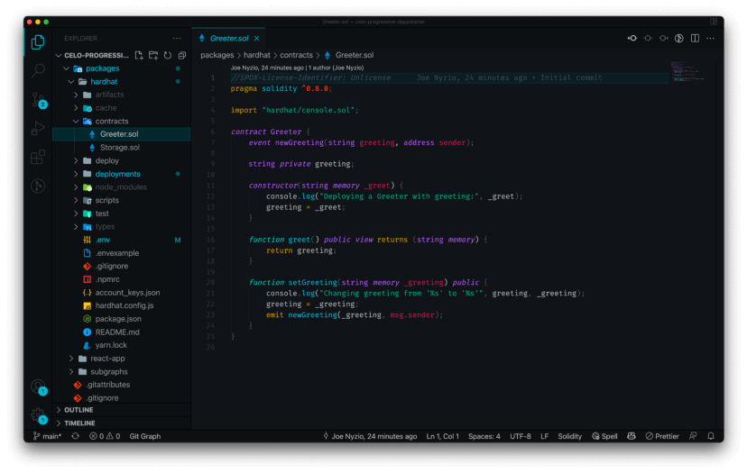

### Deploy scripts

The deploy scripts for each smart contract are found in `packages/hardhat/deploy/00-deploy.js`.

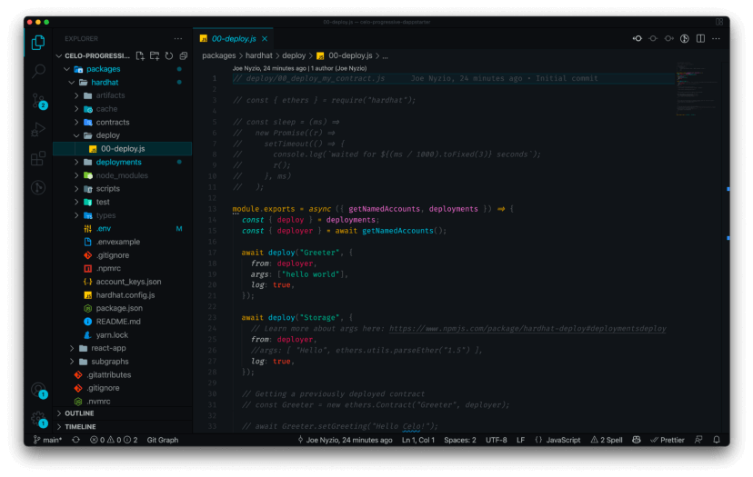

### Front-end

The front-end code for each smart contract interface is found in `packages/react-app/components` and are named as components that should be similar to the name of the smart contract.

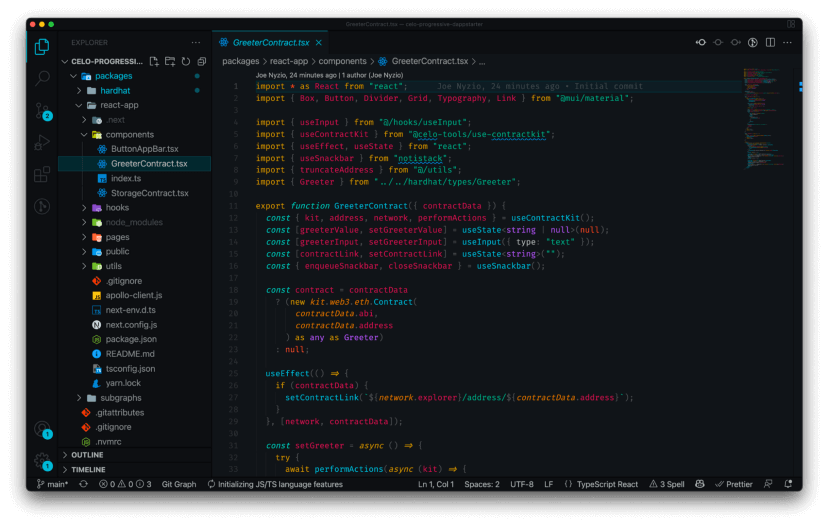

## ✅ Step 8: View on Mobile​

Serve your React app to your mobile device for testing via a tunnel. Next.js defaults to serving your app on `port 3000`.

```
npx localtunnel --port 3000
```

### Local Tunnel

Read more about localtunnel [here](https://www.npmjs.com/package/localtunnel).

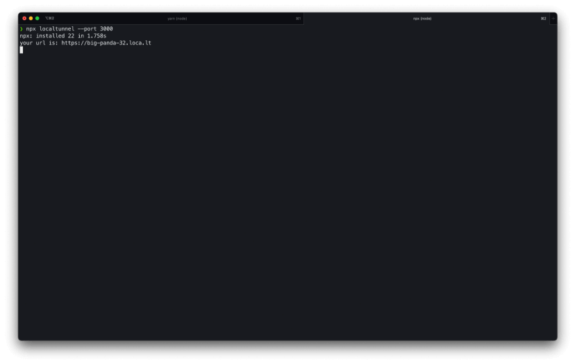

Your Celo dApp is now available on your mobile device at the URL provided in your terminal.

### Contribute to the project​

Celo welcomes contributions to the repository! If you decide to try this out and find something confusing, consider opening a pull request to make things more clear for the next developer. If you improve the user interface or create new components that you think might be useful for other developers, consider opening a PR.

## Congratulations 🎉

That wraps up today’s topic on Building full-stack mobile dApps with Celo Composer. You can review each of the items we covered below and check that you’re ready to apply these new skills.

**Here’s a list of what we covered 🤔**

- ✅ **Step 1:** Set up your project repo
- ✅ **Step 2:** Create a local project
- ✅ **Step 3:** Set up your testnet account
- ✅ **Step 4:** Deploy smart contracts​
- ✅ **Step 5:** Start the front-end
- ✅ **Step 6:** Explore your dApp
- ✅ **Step 7:** Customize your dApp
- ✅ **Step 8:** View on mobile

If you run into any issues, try reviewing the content or searching online to explore each topic in more detail. Hopefully, you’ve learned a few things about _Building full-stack mobile dApps with Celo Composer_ that you can apply in the real world.

GN! 👋
