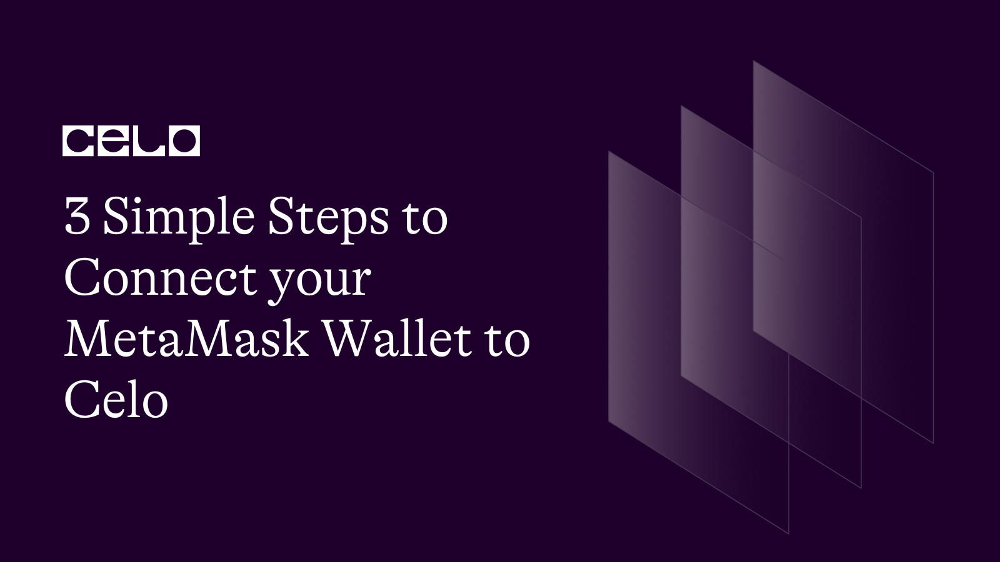
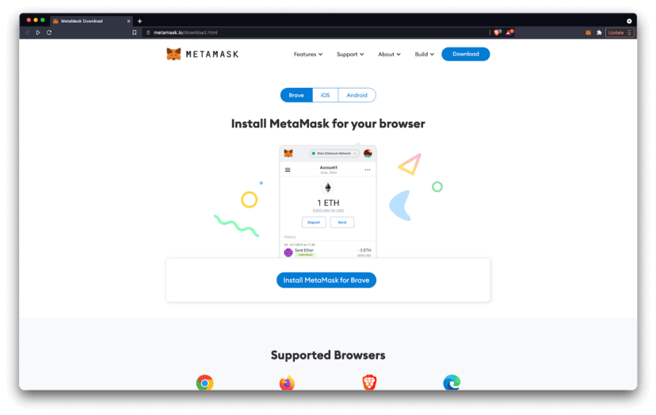
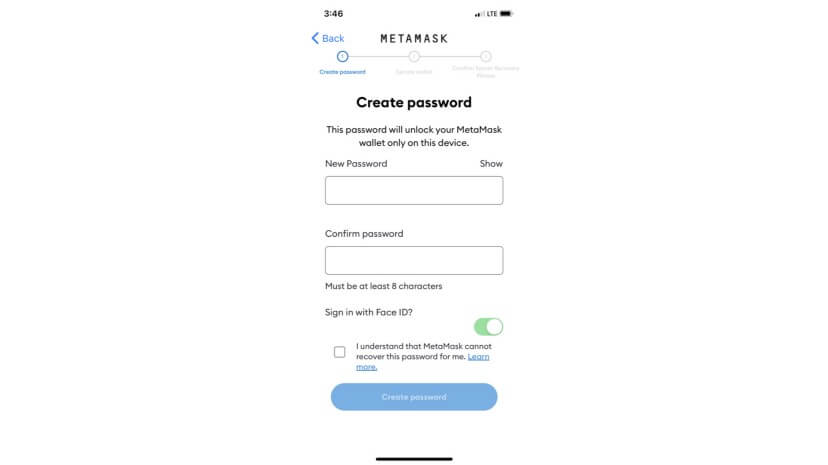
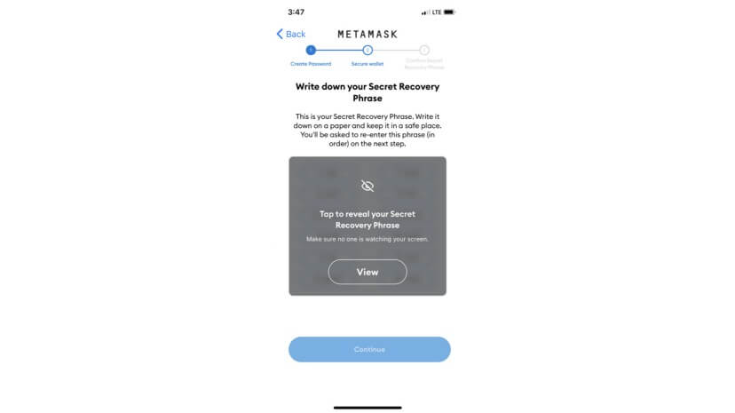
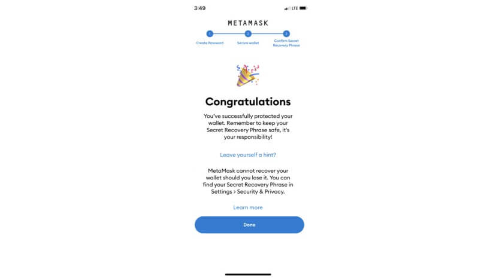
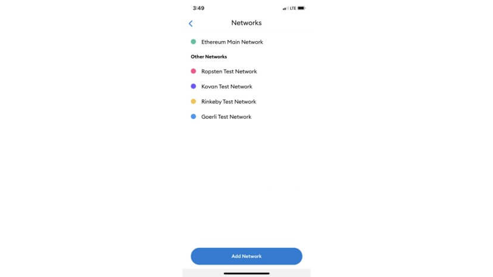
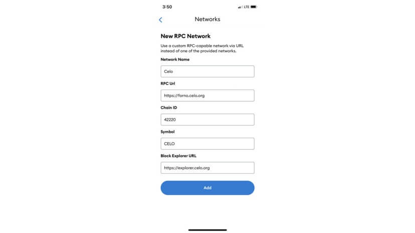
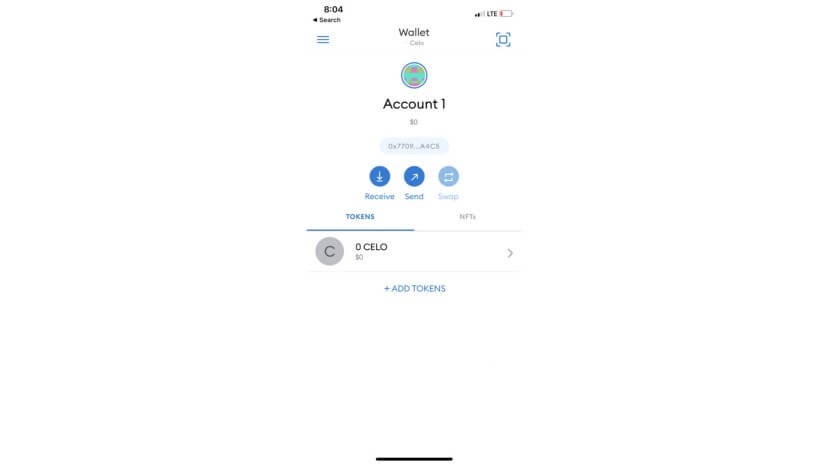
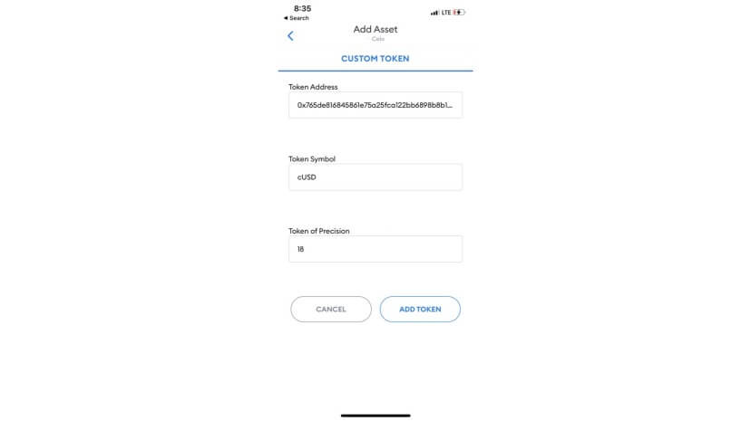
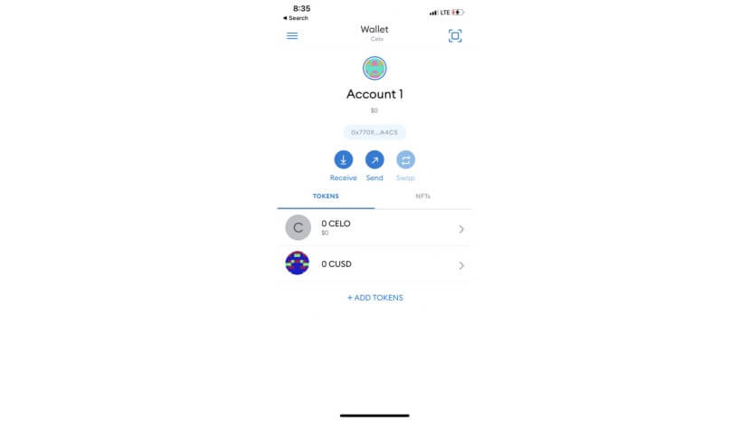

import YouTube from '@components/YouTube';

# 3 Simple Steps to Connect your MetaMask Wallet To Celo

_A step-by-step tutorial to add the Celo network to your MetaMask wallet._

## Hello Developers 🌱

Welcome to today’s post, where we’ll break down a blockchain topic into bite-sized pieces to help you learn and apply your new skills in the real world.

Today’s topic is Connecting your MetaMask wallet to Celo.

**Here’s an overview of what we’ll cover 🗒**

- ✅ Introduction to MetaMask
- ✅ **Step 1:** How to Download MetaMask
- ✅ **Step 2:** How to Create a MetaMask Wallet
- ✅ **Step 3:** How to Add a Celo Network to MetaMask
- ✅ **Optional:** Add Celo Assets to MetaMask

In 3 simple steps, you’ll be able to access the entire Celo network from your MetaMask wallet!

:::tip

Learn more: [How to Add Celo to MetaMask](https://www.youtube.com/watch?v=JLHeCb01fzs) A Brief History of MetaMask on Celo

:::

Let’s go! 🚀

## Introduction to MetaMask

MetaMask is a crypto wallet that allows you to buy, store, send and swap tokens. Celo enables MetaMask users to connect with Celo and interact with all of the dApps available on the Celo network.

<YouTube videoId="YVgfHZMFFFQ"/>

### MetaMask integrates with Celo

Celo users are able to integrate with [MetaMask](https://metamask.io/), the world’s most popular non-custodial digital wallet and Web3 gateway for desktop and mobile. Millions of users worldwide use MetaMask to safely discover, store and send digital assets, securely interact with third-party sites without exposing unnecessary data, and source the best prices across the widest variety of digital tokens.

### Why use MetaMask with Celo?

MetaMask is a blockchain-based application that equips you with a key vault, secure login, token wallet and token exchange. It provides a secure means to connect to blockchain-based applications. MetaMask was originally created to interact with the Ethereum blockchain, has a large and growing community of users, and provides both an in-browser extension and a mobile app. Using MetaMask with Celo makes it quick and easy to access the Celo dApps with this powerful crypto wallet.

### A quick note before getting started

Celo works with MetaMask, but MetaMask does not actively support compatibility with Celo. For that reason, it’s important to note that a few things might not work perfectly. For example, the MetaMask UI might show the ETH logo or currency symbol where you might expect it to show the Celo logo or currency symbol, or it might show no logo at all.

## Step 1: Download MetaMask

MetaMask is compatible with Chrome, Firefox, Brave and Opera. It’s also available on all iOS and Android devices. You can download MetaMask for your browser or device at [metamask.io/download](https://metamask.io/download.html).

:::note

This guide shows images using the MetMask mobile app on iOS, but the UI is similar on all devices.

:::

## Step 2: Create a MetaMask Wallet

Once MetaMask is installed you can create a new wallet.

- Open the MetaMask app or select the MetaMask icon in the top right corner of your browser
- Select **Create a New Wallet**. If you have used MetaMask previously, you may choose to import your wallet using your Secret Recovery Phrase or by Syncing with your MetaMask extension.

- Create and confirm a new password, Accept the Terms of Use, and select **Create Password**

- Select **Reveal secret words** to reveal your 12 word seed phrase

- Copy your seed words to a secure location and select **Continue**
- Verify your secret phrase then select **Confirm**

## Step 3: Add a Celo Network to MetaMask

You can now connect to a Celo network from your MetaMask wallet.

- From MetaMask select **Settings > Networks > Add Network**

Add the Celo **network details** to MetaMask (shown below)

### Celo Mainnnet

- **Network Name:** `Celo (Mainnet)`
- **New RPC URL:** `https://forno.celo.org`
- **Chain ID:** `42220`
- **Currency Symbol (Optional):** `CELO`
- **Block Explorer URL (Optional):** `https://explorer.celo.org`

### Celo Testnet

- **Network Name:** `Celo (Alfajores Testnet)`
- **New RPC URL:** `https://alfajores-forno.celo-testnet.org`
- **Chain ID:** `44787`
- **Currency Symbol (Optional):** `CELO`
- **Block Explorer URL (Optional):** `https://alfajores-blockscout.celo-testnet.org`

- After adding Celo network details select Save
- You can view the Celo network configuration from the MetaMask Networks screen

Your MetaMask wallet is properly configured. It’s that easy! The setup process is simple and fast. You can now use it to explore our network, add, transfer, send and receive assets on the Celo Network.

### Optional: Add Celo Assets to MetaMask

Now that MetaMask wallet is set up with Celo, you can add additional Celo assets such as cUSD and cEUR to your wallet.

- Open **MetaMask** and select the **Celo network**

- Select **Add Token** to navigate to the **Custom Token** tab

- Copy your preferred **Token Address** from the options below

### Celo Mainnet

- **cUSD:** `0x765de816845861e75a25fca122bb6898b8b1282a`
- **cEUR:** `0xd8763cba276a3738e6de85b4b3bf5fded6d6ca73`

### Celo Testnet

- **cUSD:** `0x874069fa1eb16d44d622f2e0ca25eea172369bc1`
- **cEUR:** `0x10c892a6ec43a53e45d0b916b4b7d383b1b78c0f`

- Paste the **Token Address** into the **Token Address Field**

- The **Token Symbol** and **Decimals of Precision** will populate automatically
- Select Next and choose **Add Tokens**
- This will take you to the home screen viewable under **Tokens**

### Next steps with MetaMask and Celo

You’re now set up with MetaMask and Celo using a variety of Celo assets! If you’re interested in exploring DeFi options on Celo with your MetaMask wallet, you can check out networks like Ubeswap by going to [https://app.ubeswap.org](https://app.ubeswap.org) and selecting the Connect to a wallet button.

If you are using Metamask mobile, you will have to go to the Ubeswap app via the Metamask browser in the mobile app. Choose Metamask as your connection method. If you are connected to the wrong network (ie Ethereum), Ubeswap will prompt you to connect to the Celo network.

## Congratulations 🎉

That wraps up today’s topic on _Connecting your MetaMask wallet to Celo_. You can review each of the items we covered below and check that you’re ready to apply these new skills.

**Here’s a quick review of what we covered 🤔**

- ✅ Introduction to MetaMask
- ✅ **Step 1:** How to Download MetaMask
- ✅ **Step 2:** How to Create a MetaMask Wallet
- ✅ **Step 3:** How to Add a Celo Network to MetaMask
- ✅ **Optional:** Add Celo Assets to MetaMask

If you run into any issues, try reviewing the content or searching online to explore each topic in more detail. Hopefully, you’ve learned a few things about _Connecting your MetaMask wallet to Celo_ that you can apply in the real world.

GN! 👋
