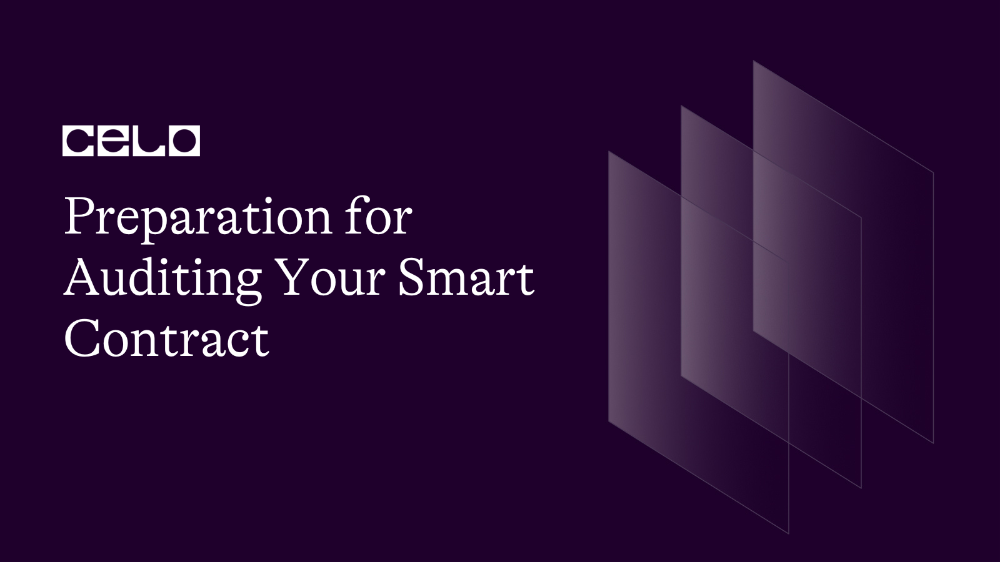

## Introduction

Smart contracts are self-executing contracts with the terms of the agreement between buyer and seller being directly written into lines of code. They can be used to automate and enforce the negotiation or performance of a contract. However, since smart contracts operate on a decentralized blockchain network, they are often subject to attacks and vulnerabilities that can compromise the security and functionality of the contract.

To ensure the security and functionality of your smart contract, it is important to prepare for auditing your code. Auditing is the process of reviewing your smart contract's code for errors, vulnerabilities, and potential weaknesses. The goal is to identify and fix any issues before the contract is deployed on the blockchain network.

Here are some reasons why you should prepare for auditing your smart contract:

 **Ensure Security:** Auditing can help identify potential security risks and vulnerabilities in your smart contract, preventing hackers from exploiting any weaknesses and stealing your assets.
 
 **Improve Functionality:** Auditing can help improve the functionality of your smart contract by identifying potential bugs or errors in your code, which can prevent your contract from executing as intended. 
 
**Increase User Trust:** Auditing can help increase user trust in your smart contract, as users will be more likely to use and interact with a contract that has undergone a thorough auditing process.

**Accuracy:** The code in smart contracts is executed automatically without human intervention, making accuracy crucial. Auditing helps ensure that the code is accurate and functions as intended.

**Reputation:** A smart contract with a security breach or coding error can damage the reputation of the project or organization. Auditing helps prevent such incidents and enhances the reputation of the project.

**Compliance:** In some cases, smart contracts may need to comply with legal or regulatory requirements. Auditing helps ensure compliance and prevent any legal or regulatory violations.

## Issue Levels – Audit Report

During a smart contract audit, the auditor reviews the code and conducts testing to identify any potential security risks or vulnerabilities. The auditor provides a report summarizing their findings and recommendations for addressing any issues. The report typically includes a description of the issues identified and their severity level. Here are the levels of issues that may be found in a smart contract audit report:

**Critical:** A critical issue is a severe vulnerability that could result in the loss or theft of assets. This includes issues such as the ability of an attacker to execute arbitrary code or steal user funds. These issues require immediate attention and remediation.

**High:** A high issue is a serious vulnerability that could lead to the compromise of the contract's security. This includes issues such as denial-of-service attacks, which could render the contract unusable. These issues also require immediate attention and remediation.

**Medium:** A medium issue is a moderate vulnerability that could impact the performance or functionality of the contract. This includes issues such as code inefficiencies, which could result in increased gas costs for users. These issues should be addressed as soon as possible.

**Low:** A low issue is a minor vulnerability that may not have a significant impact on the contract's functionality or security. This includes issues such as naming conventions or documentation errors. These issues should be addressed at the discretion of the contract owner.

**Informational:** An informational issue is not a security vulnerability but provides additional information that may be useful to the contract owner. This includes issues such as coding best practices or suggestions for improving the user experience.

It is important to note that the severity level of an issue depends on the specific context of the contract and its intended use. What may be a critical issue for one contract may be a low issue for another. The auditor will work with the contract owner to determine the appropriate level of severity for each issue and provide recommendations for remediation. In summary, a smart contract audit report will provide a detailed analysis of the issues identified, their severity level, and recommendations for addressing them.

## Common audit process and methodology

The smart contract audit process and methodology typically involves the following steps:

**Pre-Audit Planning:** This involves understanding the contract's purpose, scope, and expected outcomes. The auditor reviews the contract's documentation, requirements, and specifications to determine the audit's objectives.

**Code Review:** The auditor conducts a thorough review of the contract's code to identify potential security vulnerabilities and performance issues. The auditor may use manual or automated tools to analyze the code, identify patterns, and assess the quality of the code.

**Testing:** The auditor conducts a series of tests to evaluate the contract's functionality and performance. These tests may include functional testing, regression testing, stress testing, and security testing.

**Reporting:** The auditor prepares a report detailing the findings of the audit. The report includes a summary of the issues identified, their severity level, and recommendations for addressing them. The report may also include a detailed analysis of the contract's performance, usability, and compliance with industry standards and best practices.

**Remediation:** The contract owner works to address the issues identified in the audit report. This may involve making changes to the code, updating documentation, or implementing new security measures. The auditor may provide guidance and support during the remediation process.

**Follow-up Audit:** The auditor may conduct a follow-up audit to verify that the issues identified in the initial audit report have been addressed. This is important to ensure that the contract remains secure and functional over time.

The methodology for conducting a smart contract audit may vary depending on the auditor's approach, the complexity of the contract, and the desired outcomes of the audit. However, a thorough audit process typically involves a combination of code review, testing, and reporting to identify and mitigate potential security risks and vulnerabilities in the contract. By following a rigorous audit process, contract owners can ensure that their contracts are secure, accurate, and compliant with industry standards and best practices.

## Prepare for auditing your smart contract

Here are some steps to prepare for auditing your smart contract:

**Choose a Reputable Auditor:** Choose a reputable auditing firm or individual to review your smart contract's code. Look for auditors with experience in auditing smart contracts and a track record of providing high-quality audits.

**Use a Solidity Linter:** A Solidity linter is a tool that checks your code for potential issues and errors. It is a good idea to use a linter before submitting your code for auditing.

**Follow Best Practices:** Follow best practices when coding your smart contract, such as using secure coding techniques, avoiding hardcoded values, and thoroughly testing your code.

**Libraries like No-Reentrant, pause/unpause:** using libraries and functions that have been developed specifically to address common security issues in smart contracts. Here are two examples:
 - *No-Reentrant Libraries:* No-Reentrant libraries are designed to prevent reentrancy attacks, which can allow an attacker to repeatedly call a contract function while it is still executing. This can lead to unintended side effects and potentially result in the theft of funds. No-Reentrant libraries provide a way to lock a contract function so that it cannot be called again until it has finished executing. This helps to prevent reentrancy attacks and improve the security of the contract.
 - *Pause/Unpause Functions:* Pause/unpause functions are designed to allow contract owners to pause the execution of the contract in the event of an emergency or security issue. These functions provide a way to temporarily suspend the contract's operations, preventing any further transactions from occurring until the issue has been resolved. This can help to prevent the loss of funds and protect the contract's users from potential security risks.

**Merge functions:** Merging functions involves consolidating similar functions to reduce the overall size and complexity of the contract. Here are some tips on how to prepare for a smart contract audit report by merging functions:

 - *Identify Similar Functions:* Review the contract's code and identify functions that perform similar tasks or have similar logic. This may involve analyzing the code's structure and identifying patterns.

 - *Consolidate Functions:* Merge similar functions into a single function to reduce the overall size and complexity of the contract. This can improve readability, reduce the risk of errors, and simplify the contract's logic.

 - *Ensure Consistency:* Ensure that the merged function is consistent with the contract's documentation, requirements, and specifications. This can help ensure that the contract functions as intended and is compliant with industry standards and best practices.

 - *Test the Merged Function:* Test the merged function to ensure that it performs as expected and does not introduce any new vulnerabilities or issues. This may involve conducting functional testing, regression testing, and security testing.

 - *Document the Changes:* Document the changes made to the contract, including the functions that were merged and the rationale behind the decision. This can help ensure that future developers and auditors understand the contract's logic and can easily identify any potential issues or vulnerabilities.

**Gas Optimisation:** is a crucial aspect of smart contract development that can greatly impact the efficiency, cost, and security of the contract. Here are some tips on how to prepare for a smart contract audit report by optimizing gas usage:

 - *Minimize Storage Usage:* Every piece of data that is stored on the blockchain incurs a gas cost. Therefore, minimizing the amount of storage used by the contract can significantly reduce gas costs. This can be achieved by using data structures that are optimized for gas usage, such as *arrays*, *bytes*, and *structs*.

 - *Reduce Loops and Iterations:* Loops and iterations are computationally expensive operations that can consume a lot of gas. Therefore, minimizing the number of loops and iterations in the contract can reduce gas costs. This can be achieved by using optimized algorithms and data structures.

 - *Use Optimized Solidity Code:* Solidity is the programming language used to write smart contracts on the Celo blockchain. Using optimized Solidity code can significantly reduce gas costs. This can be achieved by following best practices and using optimized coding patterns.

 - *Use External Libraries:* External libraries can be used to reduce the amount of code that needs to be executed on the blockchain. This can significantly reduce gas costs. However, it is important to ensure that the external libraries used are secure and do not introduce new security risks.

 - *Test Gas Usage:* Gas usage can be tested using tools such as Ganache or Remix. These tools simulate the execution of the contract and provide detailed information on the gas usage of each operation. This can be used to identify gas-intensive operations and optimize them.

**Withdrawal functions:** are an essential part of many smart contracts, allowing users to withdraw funds or assets from the contract. However, these functions can also be a potential source of security vulnerabilities if not implemented properly. Here are some steps to be prepared for a smart contract audit report with regards to withdrawal functions:

 - *Use Standard Libraries:* It is recommended to use standard libraries for withdrawal functions to ensure that they are secure and well-tested. This helps to reduce the risk of vulnerabilities and errors in the code.

 - *Limit Access:* Limit the access to withdrawal functions to authorized users only. This can be done by implementing role-based access control or requiring authentication before allowing withdrawals.

 - *Implement Security Measures:* Implement security measures such as two-factor authentication, multi-signature verification, and time-delayed withdrawals to prevent unauthorized withdrawals and mitigate the risk of potential attacks.

 - *Test Withdrawal Functions:* Test the withdrawal functions extensively to identify any potential issues or vulnerabilities. This includes functional testing, regression testing, stress testing, and security testing.

**Relevant checks:** It is important for smart contract developers to place relevant checks first in their code because it helps to improve the overall security and functionality of the contract. Relevant checks refer to security and validation checks that are necessary to ensure that the contract is functioning as intended and that user inputs are validated and processed correctly.

By placing relevant checks first in the code, developers can ensure that critical security and validation checks are performed before other parts of the code are executed. This helps to prevent potential security vulnerabilities and reduce the risk of errors or bugs in the contract. For example, if a contract processes a user input before validating it, this could result in unexpected behavior or security vulnerabilities.

In addition, placing relevant checks first in the code helps to improve the overall performance of the contract. By validating user inputs and performing necessary security checks early in the code execution, the contract can avoid unnecessary computations and improve the efficiency of the code.

**Naming conventions:** are an important aspect of smart contract development and auditing. They help to ensure consistency and clarity in the code, making it easier for auditors and other developers to understand and review the contract. Here are some tips on how to prepare for auditing your smart contract by following naming conventions:

 - *Use descriptive and meaningful names:* When naming variables, functions, and other components of the contract, use descriptive and meaningful names that accurately reflect their purpose and functionality. This makes it easier for auditors to understand the code and identify potential issues.
 - *Follow a consistent naming convention:* Use a consistent naming convention throughout the code to make it easier to read and understand. This includes using consistent capitalization, avoiding special characters, and using underscores to separate words.
 - *Avoid abbreviations and acronyms:* Avoid using abbreviations or acronyms in the code unless they are commonly understood or widely accepted in the industry. Using abbreviations can make the code harder to understand and may lead to confusion or errors.
 - *Use comments to explain complex code:* Use comments to explain complex code or functions that may be difficult to understand. This helps auditors to quickly identify the purpose and functionality of different parts of the code.
 - *Use clear and concise language:* Use clear and concise language when naming components of the contract and writing comments. This helps to reduce the risk of misunderstandings and ensures that the code is easily understandable.

**Contract Order:** is an important consideration in smart contract development. It refers to the sequence in which different parts of the contract are executed during runtime. The order of contract execution can have a significant impact on the contract's functionality, performance, and security.

Here are some factors to consider when determining the contract order:

 - *Security:* Security should be the primary consideration when determining the contract order. The most critical security checks and validations should be executed first to ensure that user inputs are processed securely and to prevent potential vulnerabilities such as reentrancy attacks.
 - *Dependencies:* Smart contracts often have dependencies on other contracts or external systems such as oracles. In such cases, it is important to ensure that dependencies are executed in the correct order to ensure that the contract functions as intended.
 - *Gas Efficiency:* Gas efficiency is a critical consideration for smart contract developers as every transaction on the blockchain requires a certain amount of gas to execute. Contract order can impact gas efficiency, so it is important to structure the code in a way that minimizes gas usage.
 - *Performance:* Contract order can also impact performance, so developers should consider the most efficient order of execution to ensure that the contract functions optimally.

**Missing functionality:** in smart contract development refers to situations where the code does not include all of the necessary features or functions to meet the intended use case. This can occur due to a variety of reasons, including miscommunication between stakeholders, lack of planning, or inadequate testing.

Missing functionality can have significant consequences for the smart contract, including security vulnerabilities, incorrect behavior, or failed transactions. For example, if a contract is intended to process a certain type of input but is missing the necessary validation checks, this could result in unexpected behavior or security vulnerabilities.

To avoid missing functionality in smart contract development, it is important to take a structured approach to the development process. This includes proper planning, stakeholder communication, and thorough testing. During the planning phase, it is important to identify all of the necessary features and functions and ensure that they are included in the requirements and specifications.

**Data validation:** is an important aspect of smart contract development that involves checking and verifying user inputs to ensure that they are valid and meet certain criteria. Proper data validation helps to prevent errors, vulnerabilities, and other issues that can compromise the security and functionality of the contract.

Here are some key considerations for data validation in smart contract development:

 - *Validate all inputs:* All user inputs should be validated to ensure that they are of the correct type, within the expected range, and meet any other relevant criteria. This includes inputs such as addresses, amounts, and other parameters.
 - *Use appropriate data types:* The correct data type should be used for each input parameter to ensure that it can be correctly processed and validated. This includes using integer types for whole numbers, string types for text inputs, and so on.
 - *Sanitize user inputs:* User inputs should be sanitized to remove any potentially harmful or malicious characters or code. This can help to prevent security vulnerabilities such as SQL injection or cross-site scripting attacks.
 - *Implement error handling:* Proper error handling should be implemented to detect and handle invalid inputs. This can include returning error messages or rejecting invalid inputs altogether.
 - *Use testing and debugging tools:* Testing and debugging tools can be used to identify and resolve data validation issues during development. These tools can help to catch errors and vulnerabilities early in the development process, before they become larger issues.

**Event emission on critical functions:** is an important aspect of smart contract development. Events are a way for contracts to communicate with external systems and notify them when important actions or changes occur within the contract. Emitting events on critical functions can provide valuable information to users and external systems about the status and actions of the contract.

When a critical function is executed in a smart contract, such as a transfer of tokens or an update to the contract state, emitting an event can provide transparency and accountability for the action. By emitting an event, the contract can notify external systems and users of the action and provide relevant details such as the sender, receiver, amount, and timestamp of the action. This can help to prevent fraud or errors and improve trust in the contract.

In addition, emitting events on critical functions can provide valuable insights and analytics for contract owners and users. By analyzing the events emitted by the contract, users can gain insights into the usage and behavior of the contract and identify any potential issues or areas for improvement.

It is important to note that emitting events on critical functions should be done thoughtfully and with consideration for the privacy and security of users. The events emitted should provide relevant information without exposing sensitive information or compromising the security of the contract.

**Access control:** is a critical aspect of smart contract development as it helps to ensure that only authorized users can interact with the contract and perform specific actions. Modifiers are a feature in Solidity, the programming language used for Celo smart contract development, that can be used to enforce access control.

Modifiers are a type of function that can be added to a smart contract to restrict access to specific functions or actions. They are typically used to ensure that only authorized users can perform certain actions, such as transferring funds or updating contract state. Modifiers can be used in combination with other programming features, such as event logging and error handling, to create a comprehensive access control system for a smart contract.

**Contract configuration:** is an important aspect of smart contract development that involves setting various parameters and values that affect the behavior and functionality of the contract. These configuration settings are typically defined in the contract code and can be adjusted by the contract owner or administrator as needed.

Some examples of configuration settings that may be included in a smart contract include:

 - *Gas Limits:* Gas limits determine the maximum amount of gas that can be used to execute a transaction or function call in the contract. Setting appropriate gas limits is important to ensure that the contract can be executed efficiently and without running out of gas.
 - *Security Settings:* Security settings may include parameters such as access controls, permissions, and other security measures to prevent unauthorized access or manipulation of the contract.
 - *Contract Parameters:* Contract parameters may include values such as contract expiration date, contract owner, or other parameters that define the behavior of the contract.
 - *External Contracts and Addresses:* Smart contracts may interact with external contracts or addresses. Configuring these external interactions correctly is important to ensure that the contract can interact with external contracts securely and accurately.
 - *Token Parameters:* If the contract includes tokens, various token parameters such as total supply, decimal places, and symbol may need to be configured.

**Unrestricted action or call:** An unrestricted action or call in smart contract development refers to a scenario where a user or external entity is able to execute a contract function or modify contract state without proper authorization or validation. This can result in security vulnerabilities, data loss, or financial loss for the contract owner and users.

Unrestricted actions or calls can occur in a variety of ways, such as:

 - *Lack of Access Control:* If a contract function does not properly enforce access control, it may be possible for an unauthorized user to execute the function and modify the contract state.
 - *Input Validation:* If a contract function does not properly validate user input, it may be possible for an attacker to submit malicious input that can exploit vulnerabilities in the contract.
 - *Overflows and Underflows:* If a contract function uses variables that are not properly bounded or checked for overflow and underflow conditions, it may be possible for an attacker to modify contract state or execute unauthorized actions.

To prevent unrestricted actions or calls in smart contract development, developers should follow best practices such as:

 - *Implement Access Control:* Contracts should implement access control to ensure that only authorized users can execute contract functions and modify contract state.
 - *Validate User Input:* Contracts should validate user input to ensure that it is properly formatted, within expected limits, and does not contain malicious code or commands.
 - *Use Safe Math Operations:* Contracts should use safe math operations to prevent integer overflow and underflow vulnerabilities.

## Post-Auditing Best Practices for Secure and Trustworthy Smart Contracts

Once a smart contract has been audited, it is important to follow post-auditing best practices to ensure its security, functionality, and user trust. Here are some best practices to consider:

**Review the Auditor's Report:** Once the auditor has completed their review, carefully review their report and address any issues or recommendations they have made. This can help you identify potential vulnerabilities and ensure that your smart contract is secure and functional.

**Address Any Issues or Recommendations:** If the auditor has identified any issues or made recommendations, it is important to address them as soon as possible. This can help you avoid potential security vulnerabilities and ensure that your smart contract functions as intended.

**Thoroughly Test the Contract:** After making any necessary changes based on the auditor's report, thoroughly test your smart contract to ensure it functions as intended. This can help you identify any remaining issues or bugs and ensure that your smart contract is secure and functional.

**Implement Continuous Monitoring:** Once your smart contract is live, it is important to implement continuous monitoring to identify any potential security threats or issues. This can help you address issues as soon as they arise and ensure the ongoing security and functionality of your smart contract.

**Keep Your Contract Up to Date:** As technology and security threats evolve, it is important to keep your smart contract up-to-date. This may involve making updates to the contract code or implementing new security measures to ensure its ongoing security and functionality.

By following these post-auditing best practices, you can ensure the security, functionality, and user trust of your smart contract. It is important to take a proactive approach to smart contract development and maintenance to ensure that your contract is secure and trustworthy for its users.

## Conclusion

In conclusion, auditing is a crucial step in the development of a smart contract as it helps to identify potential vulnerabilities and security threats. By conducting a smart contract audit and following best practices, developers can ensure that their contracts are secure, functional, and trustworthy for their users. 

As the world of smart contracts and decentralized finance continues to grow, it is important for developers to take a proactive approach to smart contract development and maintenance to ensure the safety and security of their users.

## Next step

As the next steps, I suggest you consult other Celo tutorials [here](https://docs.celo.org/tutorials).

## About the author

I am a serial entrepreneur, founder of Guizo Studios, and always available to help the Celo ecosystem.

[LinkedIn](https://www.linkedin.com/in/ewertonlopes/)
