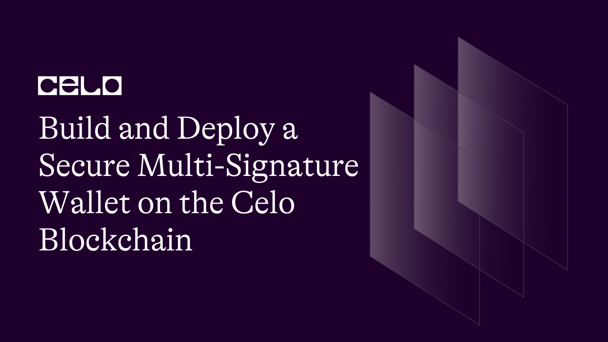

## Introduction

In this tutorial, we will walk through the process of building and deploying a secure multi-signature wallet on the Celo blockchain. We will be using Solidity, Hardhat, a development environment to write and deploy our smart contract. By the end of this tutorial, you will have a better understanding of how multi-signature wallets work and be able to create your own on the Celo blockchain.

## Prerequisites

Before we dive into building our multi-signature wallet, there are a few prerequisites that you should have:

1. Familiarity with Solidity: This tutorial assumes that you have a basic understanding of Solidity, the programming language used to write smart contracts on the Celo blockchain.

2. Familiarity with Hardhat: We will be using Hardhat to write and deploy our smart contract. Therefore, you should have some familiarity with Hardhat or a similar Ethereum development environment such as Truffle.

3. Familiarity with JavaScript: Although Solidity is the primary language used to write smart contracts, we will also be using JavaScript to test our smart contracts. Therefore, you should have some familiarity with JavaScript and how it interacts with smart contracts.

4. A Celo wallet: To interact with the Celo blockchain, you will need a Celo wallet. There are several wallets available such as MetaMask and Celo Extension Wallet. You should have a basic understanding of how to create a wallet, receive and send funds, and how connect your wallet to the Celo blockchain.

## Requirements

To build and deploy our multi-signature wallet on the Celo blockchain, we will need to:

1. Set up a development environment: We will need to set up a development environment with [Hardhat](https://hardhat.org/), which will allow us to write, test, and deploy our smart contract.

2. Write the smart contract code: Using Solidity, we will write the code for our multi-signature wallet. The code will include functions for adding and removing owners, submitting and confirming transactions, and withdrawing funds from the wallet.

3. Test the smart contract: We will use JavaScript to write automated tests for our smart contract to ensure that it functions as expected. [Mocha](https://mochajs.org/) and [Chai](https://www.chaijs.com/) are popular testing frameworks for JavaScript that can be used for this purpose.

4. Deploy the smart contract: Once we have written and tested our smart contract, we will deploy it to the Celo blockchain. To do this, we'll need some test funds to pay for the deployments and main transactional functions. You can find test funds from the Celo faucet [here](https://faucet.celo.org/alfajores)

5. Interact with the deployed contract: We will use our Celo wallet to interact with our deployed contract, adding and removing owners, submitting transactions, and confirming transactions.

## Setting up the project

Before we can start writing our smart contract code, we need to set up a development environment with Hardhat. Follow these steps to get started:

1. Install Node.js: Hardhat requires Node.js version 12.0.0 or later. You can download and install the latest version of Node.js from the official website: [https://nodejs.org/](https://nodejs.org/)

Create a new project directory: Create a new directory for your project and navigate to it in your terminal.

```bash
mkdir multisig-wallet
cd multisig-wallet
```

Initialize a new npm project: Use the following command to initialize a new npm project in your directory. This will create a `package.json` file, which will be used to manage dependencies for your project.

```bash
npm init -y
```

Install Hardhat: Use npm to install Hardhat as a dev dependency in your project directory.

```bash
npm install --save-dev hardhat
```

Create a Hardhat project: Use the following command to create a new Hardhat project in your project directory. This will generate some initial files and directories for your project.

```bash
npx hardhat
```

Select `Create a JavaScript project` and continue rest with the `y` flag to install all the necessary dependencies.

```bash
$ npx hardhat
888    888                      888 888               888
888    888                      888 888               888
888    888                      888 888               888
8888888888  8888b.  888d888 .d88888 88888b.   8888b.  888888
888    888     "88b 888P"  d88" 888 888 "88b     "88b 888
888    888 .d888888 888    888  888 888  888 .d888888 888
888    888 888  888 888    Y88b 888 888  888 888  888 Y88b.
888    888 "Y888888 888     "Y88888 888  888 "Y888888  "Y888

Welcome to Hardhat v2.10.0

? What do you want to do? …
▸ Create a JavaScript project
  Create a TypeScript project
  Create an empty hardhat.config.js
  Quit
```

## Writing the Contract

We start by defining the version of Solidity we will be using for our smart contract. In this case, we are using version 0.8.9.

```solidity
pragma solidity ^0.8.9;
```

The next few lines define some custom errors that we will be using in our contract. These errors will be thrown if certain conditions are met, such as if a user is already registered or a transaction has already been executed. These errors will make it easier for us to handle exceptions and debug our code.

```solidity
error MultisigWallet__UserAlreadyFound();
error MultisigWallet__NotAnOwner();
error MultisigWallet__TransactionDoesNotExist();
error MultisigWallet__TransactionAlreadyExecuted();
error MultisigWallet__UserAlreadyConfirmedTransaction();
error MultisigWallet__TransactionNeedsApproval();
error MultisigWallet__TransactionExecutionFailed();
```

### Defining the state variables

Creating and naming the contract `MultisigWallet`, we have also defined and declared some variables as shown below.

```solidity
contract MultisigWallet {
    // get all owners / addresses in the wallet
    address[] private s_owners;

    uint256 private s_balance;

    //Check if an address is the owner of the wallet.
    mapping(address => bool) private isOwner;

    //specifies the number of confirmations required for a transaction to be executed.
    uint256 private s_numOfConfirmationsRequired;

}
```

The first variable `s_owners` is an array of addresses that represent the owners of the wallet. We use the `private` keyword to restrict access to this variable only to the contract itself.

The second variable `s_balance` is an unsigned integer that represents the balance of the wallet. This variable will be updated every time a transaction is executed or reversed.

The third variable `isOwner` is a mapping that allows us to check whether an address is the owner of the wallet. We use the `mapping` keyword to create a key-value mapping where the key is the address of the owner and the value is a boolean that indicates whether that address is an owner.

The fourth variable `s_numOfConfirmationsRequired` is an unsigned integer that specifies the number of confirmations required for a transaction to be executed. This means that if we set this variable to 2, for example, then two owners of the wallet will have to confirm a transaction before it can be executed.

By setting these variables and defining our data structures, we are laying the groundwork for our multi-signature wallet.

Since we've made the state variables `private` to the contract, we may need a way of accessing them outside the contract. And to achieve this, we define `getter` or `pure`, or `view` functions that are called when outside the contract, and they return whichever variable is needed.

Typically, `view` functions are defined at the end of the contract as shown below.

```solidity
    // Pure / View
    function getOwners() public view returns (address[] memory) {
        return s_owners;
    }

    function getNumberOfConfimationsRequired() public view returns (uint256) {
        return s_numOfConfirmationsRequired;
    }

    function getTransactions() public view returns (Transaction[] memory) {
        return s_transactions;
    }

    function getTransaction(
        uint256 _txIndex
    ) public view returns (Transaction memory) {
        return s_transaction[_txIndex];
    }

    function getBalance() public view returns (uint256) {
        return s_balance;
    }
```

By doing it this way, we save on some of the gas consumption by the contract.

### Handling events

We have defined some events and other data structures that will be used in our contract, as shown below.

```solidity
    // events
    event SubmitTx(
        address indexed owner,
        uint256 indexed txIndex,
        address indexed to,
        uint256 amount,
        string reason
    );

    event ConfirmTx(address indexed owner, uint indexed txIndex);

    event ExecuteTx(address indexed owner, uint indexed txIndex);

    struct Transaction {
        uint256 txIndex;
        address to;
        uint256 amount;
        string reason;
        bool executed;
        uint256 confirmations;
    }

    Transaction[] private s_transactions;

    mapping(uint256 => Transaction) private s_transaction;

    mapping(uint256 => bool) private txExits;

    mapping(uint256 => mapping(address => bool)) s_userHasConfimed;
```

First, we have defined three events: `SubmitTx`, `ConfirmTx`, and `ExecuteTx`. These events will be emitted when a new transaction is submitted, when an owner confirms a transaction, and when a transaction is executed, respectively. The `indexed` keyword is used to make these events searchable by the specified parameters.

Next, we have defined a new data structure called `Transaction`. This structure represents a transaction that can be executed on the wallet. It includes several properties such as the transaction index, the recipient address, the amount to be transferred, the reason for the transaction, whether it has been executed, and the number of confirmations it has received.

We have also defined an array called `s_transactions` that will store all of the transactions that have been submitted to the wallet. We use the `private` keyword to restrict access to this array only to the contract itself.

Additionally, we have defined two mappings. The first mapping `s_transaction` maps the transaction index to the transaction data. This will allow us to easily retrieve information about a particular transaction. The second mapping `txExists` is a boolean mapping that tells us whether a transaction with a particular index exists or not.

Finally, we have defined a mapping `s_userHasConfirmed` that keeps track of which user has confirmed a particular transaction using the transaction index. This mapping will be used to ensure that a user cannot confirm a transaction multiple times.

### Defining the constructor

Next, we are defining the constructor for our smart contract. The constructor is a special function that is executed when the smart contract is deployed on the blockchain. The constructor takes an array of addresses as input, which represents the initial list of owners for our multi-sig wallet.

```solidity
    constructor(address[] memory _owners) payable {
        s_numOfConfirmationsRequired = _owners.length;

        // Loop through the entered array and add all the addresses to the s_owners group
        for (uint i = 0; i < _owners.length; i++) {
            // Extract out the looped address
            address user = _owners[i];

            if (isOwner[user] == true) {
                revert MultisigWallet__UserAlreadyFound();
            }

            // Add it to the isOwner mapping to make sure it is part of the owners of the wallet
            isOwner[user] = true;
            s_owners.push(user);
        }

        s_balance = msg.value;
    }
```

First, we set the number of confirmations required for a transaction to be executed. This is equal to the length of the input array since we require all owners to confirm a transaction before it can be executed.

Next, we loop through the input array of addresses, add each address to the `s_owners` array, and set the corresponding `isOwner` mapping to `true` to indicate that the address is an owner of the multi-sig wallet.

We also check to make sure that the address being added is not already an owner, and if it is, we revert the transaction by calling the `MultisigWallet__UserAlreadyFound()` error function.

Finally, we set the initial balance of the wallet to be equal to the value of `msg.value`, which is the amount of Ether sent with the contract deployment transaction.

### Main contract functions

In this part of the code, we are defining the main functions of our smart contract. The first function is `submitTransaction`, which allows any owner of the wallet to submit a new transaction to be approved by other owners.

```solidity
    function submitTransaction(
        address receiver,
        uint256 _amount,
        string memory _reason
    ) public {
        if (isOwner[msg.sender] != true) {
            revert MultisigWallet__NotAnOwner();
        }

        // Get the tx length
        uint256 txNum = s_transactions.length;

        s_transactions.push(
            Transaction({
                txIndex: txNum,
                to: receiver,
                amount: _amount,
                reason: _reason,
                executed: false,
                confirmations: 0
            })
        );

        txExits[txNum] = true;

        emit SubmitTx(msg.sender, txNum, receiver, _amount, _reason);
    }
```

The function takes in three parameters: the address of the receiver, the amount of Celo coins to be sent, and a string describing the reason for the transaction.

The first line of the function checks whether the caller of the function is an owner of the wallet. If not, the function will revert and throw an error with the message `MultisigWallet__NotAnOwner()`.

The next lines of the function create a new transaction with the specified parameters and push it onto an array called `s_transactions`. We also set a mapping called `txExits` to true to indicate that the transaction exists. Finally, we emit an event called `SubmitTx`, which logs information about the transaction such as the owner who submitted it, the transaction index, the receiver address, the amount of Celo coins, and the reason for the transaction.

This function is an important part of our multi-signature wallet, as it allows any owner to propose a new transaction and begin the approval process.

Next, we have a function named `confirmTransaction` which allows an owner to confirm a submitted transaction.

```solidity
    function confirmTransaction(uint256 _txIndex) public {
        // Verify that the user trying to confirm the transaction is a verified owner
        if (isOwner[msg.sender] != true) {
            revert MultisigWallet__NotAnOwner();
        }

        // Verify that the transaction exists
        if (txExits[_txIndex] != true) {
            revert MultisigWallet__TransactionDoesNotExist();
        }

        // Verify that the transaction is not yet executed
        if (s_transactions[_txIndex].executed == true) {
            revert MultisigWallet__TransactionAlreadyExecuted();
        }

        // Verify that the user has not already confirmed the transaction
        if (s_userHasConfimed[_txIndex][msg.sender] == true) {
            revert MultisigWallet__UserAlreadyConfirmedTransaction();
        }

        // Extract out the wanted transaction
        Transaction storage transaction = s_transactions[_txIndex];

        // Update the number of confirmations
        transaction.confirmations += 1;

        // Update user confirmation status
        s_userHasConfimed[_txIndex][msg.sender] = true;

        // Emit the confirmation event
        emit ConfirmTx(msg.sender, _txIndex);
    }
```

To do so, the function verifies that the user trying to confirm the transaction is a verified owner by checking if the `msg.sender` is an owner. If not, it will revert and throw an error message using the `NotAnOwner` error.

Next, the function verifies that the transaction exists by checking if the `txIndex` provided exists in the `txExits` mapping. If it does not exist, it will revert and throw an error message using the `TransactionDoesNotExist` error.

Then, the function checks if the transaction has not already been executed by checking if the `executed` flag in the `Transaction` struct is false. If it is already executed, it will revert and throw an error message using the `TransactionAlreadyExecuted` error.

The function then checks if the user has not already confirmed the transaction by checking the `s_userHasConfirmed` mapping for the transaction index and the user's address. If the user has already confirmed the transaction, it will revert and throw an error message using the `UserAlreadyConfirmedTransaction` error.

If all the above checks pass, the function updates the number of confirmations for the transaction and updates the `s_userHasConfirmed` mapping to record that the user has confirmed the transaction. It also emits a `ConfirmTx` event with the `msg.sender` and the `txIndex`.

Note that this function does not execute the transaction, but only confirms it. The execution happens in a separate function that we defined in the `executeTransaction` function below.

The `executeTransaction` function allows an owner of the multi-signature wallet to execute a transaction once it has been confirmed by the required number of owners, as defined below.

```solidity
    function executeTransaction(uint256 _txIndex) public {
        // Verify that the user trying to confirm the transaction is a verified owner
        if (isOwner[msg.sender] != true) {
            revert MultisigWallet__NotAnOwner();
        }

        // Verify that the transaction exists
        if (txExits[_txIndex] != true) {
            revert MultisigWallet__TransactionDoesNotExist();
        }

        // Verify that the transaction is not yet executed
        if (s_transactions[_txIndex].executed == true) {
            revert MultisigWallet__TransactionAlreadyExecuted();
        }

        Transaction storage transaction = s_transactions[_txIndex];

        // Verify that the wanted transaction to be executed has the required number of confirmations to continue
        if (transaction.confirmations < s_numOfConfirmationsRequired) {
            revert MultisigWallet__TransactionNeedsApproval();
        }

        // set the transaction to be executed
        transaction.executed = true;

        (bool success, ) = transaction.to.call{value: transaction.amount}('');

        if (!success) {
            revert MultisigWallet__TransactionExecutionFailed();
        }

        s_balance -= transaction.amount;

        emit ExecuteTx(msg.sender, _txIndex);
    }
```

First, the function verifies that the user trying to execute the transaction is a verified owner and that the transaction exists and has not already been executed. Then, the function checks that the transaction has the required number of confirmations to continue.

If the transaction meets all the requirements, the function sets the transaction to be executed and sends the specified amount of ether to the specified receiver address. If the transaction fails, the function reverts and the funds remain in the multi-signature wallet.

Finally, the function emits an event to indicate that the transaction has been executed.

Overall, the `executeTransaction` function provides an important security feature for the multi-signature wallet, ensuring that funds can only be transferred when a sufficient number of owners have confirmed the transaction.

Our smart contract code is done, we can now compile it.

In your terminal type;

```bash
npx hardhat compile
```

Output:


Here's the full contract code below;

```solidity
// SPDX-License-Identifier: UNLICENSED
pragma solidity ^0.8.9;

error MultisigWallet__UserAlreadyFound();
error MultisigWallet__NotAnOwner();
error MultisigWallet__TransactionDoesNotExist();
error MultisigWallet__TransactionAlreadyExecuted();
error MultisigWallet__UserAlreadyConfirmedTransaction();
error MultisigWallet__TransactionNeedsApproval();
error MultisigWallet__TransactionExecutionFailed();

contract MultisigWallet {
    // get all owners / addresses in the wallet
    address[] private s_owners;

    uint256 private s_balance;

    //Check if an address is the owner of the wallet.
    mapping(address => bool) private isOwner;

    //specifies the number of confirmations required for a transaction to be executed.
    uint256 private s_numOfConfirmationsRequired;

    // events
    event SubmitTx(
        address indexed owner,
        uint256 indexed txIndex,
        address indexed to,
        uint256 amount,
        string reason
    );

    event ConfirmTx(address indexed owner, uint indexed txIndex);

    event ExecuteTx(address indexed owner, uint indexed txIndex);

    struct Transaction {
        uint256 txIndex;
        address to;
        uint256 amount;
        string reason;
        bool executed;
        uint256 confirmations;
    }

    Transaction[] private s_transactions;

    mapping(uint256 => Transaction) private s_transaction;

    mapping(uint256 => bool) private txExits;

    // This mapping keeps track of which user has confirmed a tx using the tx index
    mapping(uint256 => mapping(address => bool)) s_userHasConfimed;

    constructor(address[] memory _owners) payable {
        s_numOfConfirmationsRequired = _owners.length;

        // Loop through the entered array and add all the addresses to the s_owners group
        for (uint i = 0; i < _owners.length; i++) {
            // Extract out the looped address
            address user = _owners[i];

            if (isOwner[user] == true) {
                revert MultisigWallet__UserAlreadyFound();
            }

            // Add it to the isOwner mapping to make sure it is part of the owners of the wallet
            isOwner[user] = true;
            s_owners.push(user);
        }

        s_balance = msg.value;
    }

    // Main functions
    function submitTransaction(
        address receiver,
        uint256 _amount,
        string memory _reason
    ) public {
        if (isOwner[msg.sender] != true) {
            revert MultisigWallet__NotAnOwner();
        }

        // Get the tx length
        uint256 txNum = s_transactions.length;

        s_transactions.push(
            Transaction({
                txIndex: txNum,
                to: receiver,
                amount: _amount,
                reason: _reason,
                executed: false,
                confirmations: 0
            })
        );

        txExits[txNum] = true;

        emit SubmitTx(msg.sender, txNum, receiver, _amount, _reason);
    }

    // confirmTransaction allows an owner to confirm a submitted transaction
    function confirmTransaction(uint256 _txIndex) public {
        // Verify that the user trying to confirm the transaction is a verified owner
        if (isOwner[msg.sender] != true) {
            revert MultisigWallet__NotAnOwner();
        }

        // Verify that the transaction exists
        if (txExits[_txIndex] != true) {
            revert MultisigWallet__TransactionDoesNotExist();
        }

        // Verify that the transaction is not yet executed
        if (s_transactions[_txIndex].executed == true) {
            revert MultisigWallet__TransactionAlreadyExecuted();
        }

        // Verify that the user has not already confirmed the transaction
        if (s_userHasConfimed[_txIndex][msg.sender] == true) {
            revert MultisigWallet__UserAlreadyConfirmedTransaction();
        }

        // Extract out the wanted transaction
        Transaction storage transaction = s_transactions[_txIndex];

        // Update the number of confirmations
        transaction.confirmations += 1;

        // Update user confirmation status
        s_userHasConfimed[_txIndex][msg.sender] = true;

        // Emit the confirmation event
        emit ConfirmTx(msg.sender, _txIndex);
    }

    // used to execute a transaction once it has been confirmed by the required number of owners
    function executeTransaction(uint256 _txIndex) public {
        // Verify that the user trying to confirm the transaction is a verified owner
        if (isOwner[msg.sender] != true) {
            revert MultisigWallet__NotAnOwner();
        }

        // Verify that the transaction exists
        if (txExits[_txIndex] != true) {
            revert MultisigWallet__TransactionDoesNotExist();
        }

        // Verify that the transaction is not yet executed
        if (s_transactions[_txIndex].executed == true) {
            revert MultisigWallet__TransactionAlreadyExecuted();
        }

        Transaction storage transaction = s_transactions[_txIndex];

        // Verify that the wanted transaction to be executed has the required number of confirmations to continue
        if (transaction.confirmations < s_numOfConfirmationsRequired) {
            revert MultisigWallet__TransactionNeedsApproval();
        }

        // set the transaction to be executed
        transaction.executed = true;

        (bool success, ) = transaction.to.call{value: transaction.amount}('');

        if (!success) {
            revert MultisigWallet__TransactionExecutionFailed();
        }

        s_balance -= transaction.amount;

        emit ExecuteTx(msg.sender, _txIndex);
    }

    // Pure / View
    function getOwners() public view returns (address[] memory) {
        return s_owners;
    }

    function getNumberOfConfimationsRequired() public view returns (uint256) {
        return s_numOfConfirmationsRequired;
    }

    function getTransactions() public view returns (Transaction[] memory) {
        return s_transactions;
    }

    function getTransaction(
        uint256 _txIndex
    ) public view returns (Transaction memory) {
        return s_transaction[_txIndex];
    }

    function getBalance() public view returns (uint256) {
        return s_balance;
    }
}
```

### Writing unit tests for the contract

Before we can deploy the contract to the blockchain, we need to first make sure that it behaves the way we want it to behave. And we can only confirm this by writing unit tests for the contract.

Create a file called `Multisig.test.js` under the `/test` folder and inside the files import;

```js
const { expect } = require("chai");
const { ethers } = require("hardhat");
```

We will be writing unit tests for our smart contract using the Chai assertion library and the Hardhat development environment. The `expect` function is a method provided by the Chai assertion library that allows us to make assertions about the values returned by our smart contract functions. The `ethers` object is a library provided by Hardhat that allows us to interact with our smart contract during testing. We will use this object to deploy the contract and interact with it in our tests.

We start by defining a `describe` block, which groups together related tests under a common title in this case, "MultisigWallet" as shown below;

```js
describe('MultisigWallet', function () {
  async function deployMultisigWallet() {
    const signers = await ethers.getSigners()

    const account1 = await signers[0].getAddress()
    const account2 = await signers[1].getAddress()

    const amount = ethers.utils.parseEther('10')

    const Contract = await ethers.getContractFactory(
      'MultisigWallet',
      signers[0]
    )
    const multisigContract = await Contract.deploy([account1, account2], {
      value: amount,
    })

    await multisigContract.deployed()

    contract = multisigContract
    contractAddress = multisigContract.address

    return { contract, contractAddress, account1, account2 }
  }
}
```

Within this `describe` block, we define an `async` function called `deployMultisigWallet` which will be used to deploy an instance of our contract for testing. This function does the following:

1. Retrieves a list of available signers using the `ethers.getSigners()` function
2. Gets the addresses of the first two signers in the list, which will be used as the initial owners of the multi-sig wallet
3. Defines an amount of ether to be sent to the wallet during deployment
4. Retrieves the contract factory using `ethers.getContractFactory()` and passes in the name of our contract and the first signer as the default deployer.
5. Deploys an instance of the contract using the factory's `deploy()` method, passing in the initial owners as an array and the amount of ether to be sent.
6. Waits for the contract deployment to be confirmed on the blockchain using `await multisigContract.deployed()`
7. Stores the deployed contract and its address in a variable called `contract` and `contractAddress`, respectively, along with the addresses of the first two signers.

This function will be called at the start of each test to provide a fresh instance of the contract for testing.

### Testing the constructor

The `describe` function is used to group related tests together, and in this case, we are grouping tests related to the constructor function.

```js
describe("Constructor", function () {
  it("Should add the owners to the contract", async function () {
    const {
      contract,
      contractAddress,
      account1,
      account2,
    } = await deployMultisigWallet();

    const owners = await contract.getOwners();

    expect(account1, account2).to.equal(owners[0], owners[1]);
  });

  it("Should add the number of confimations successfully", async function () {
    const {
      contract,
      contractAddress,
      account1,
      account2,
    } = await deployMultisigWallet();

    const confirmations = await contract.getNumberOfConfimationsRequired();
    expect(Number(confirmations.toString())).to.equal(2);
  });
});
```

The first test case uses the `it` function to verify that the owners are added to the contract successfully. The `deployMultisigWallet` function is called to deploy the contract, and then the `getOwners` function is called to retrieve the list of owners. Finally, the `expect` function is used to compare the retrieved owners with the expected owners, which are `account1` and `account2`.

The second test case verifies that the number of confirmations required is added successfully. Again, we call the `deployMultisigWallet` function to deploy the contract, and then we use the `getNumberOfConfimationsRequired` function to retrieve the number of confirmations required for a transaction to be executed. Finally, we use the `expect` function to compare the retrieved number of confirmations with the expected value of 2.

To run tests, specific to the constructor, in the terminal type;

```bash
npx hardhat test --grep "Constructor"
```

Output:


By using the `--grep "Constructor"` we can tell Hardhat to jump through specific sections of the tests and only test the logic inside the `Constructor` block. We can also jump through specific `it()` function tests too, by using the block description in the function, like

### A Failed test

An example of a failed test will look like this;


Chai is a very powerful library for testing software because it raises very clear error messages of why and where the test failed as shown above.

It's clearly showing that the expected addresses received are not the same and comparable.

```bash
npx hardhat test --grep "Should add the owners to the contract"
```

### Testing the submitTransaction function

The purpose of this test is to verify that the function can successfully submit a new transaction to the contract.

```js
  describe('SubmitTx', function () {
    it('Should successfully submit a transaction, async function () {
      const { contract, contractAddress, account1, account2 } =
        await deployMultisigWallet()

      const amount = ethers.utils.parseEther('1')

      const reason = 'Payment for stuff'
      await contract.submitTransaction(account2, amount, reason, {
        from: account1,
      })

      const txs = await contract.getTransactions()

      expect(txs.length).to.be.greaterThan(0)
    })
  })
```

We begin by using the `deployMultisigWallet` function to deploy a new instance of the `MultisigWallet` contract, and then we create a new transaction by calling the `submitTransaction` function with a destination address, amount, and reason.

After the transaction is submitted, we use the `getTransactions` function to retrieve an array of all the transactions in the contract, and we verify that the array has a length greater than zero using the `expect` function from the `chai` library.

To run this test, open your terminal and type;

```bash
npx hardhat test --grep "Should successfully submit a transaction"
```

Output:


This test is important because it ensures that the contract can properly receive and store new transactions, which is a fundamental feature of a multi-sig wallet.

### Testing the confirmTransaction function

The `confirmTransaction` has several multiple test cases as shown in the code below;

```js
  describe('ConfirmTx', function () {
    it('Should fail when a non owner tries to confirm the transaction', async function () {
      const { contract } = await deployMultisigWallet()

      // const signers = await ethers.getSigners()
      const [deployer, otherAccount, thirdAccount] = await ethers.getSigners()

      const localContract = await contract.connect(thirdAccount)

      await expect(localContract.confirmTransaction(0)).to.be
        .revertedWithCustomError
    })

    it('Should fail when a transaction entered does not exist', async function () {
      const { contract, account1, account2 } = await deployMultisigWallet()

      const amount = ethers.utils.parseEther('1')
      const reason = 'Payments for stuff'

      // Add a new transaction
      awaiting contract.submitTransaction(account2, amount, reason, {
        from: account1,
      })

      await expect(contract.confirmTransaction(100)).to.be
        .revertedWithCustomError
    })
  })

```

The first test case checks whether the function fails when a non-owner tries to confirm a transaction. We simulate this scenario by using a signer account that is not one of the owners of the wallet. We expect the function call to be reverted with a custom error message.

The second test case checks whether the function fails when the transaction index entered does not exist. We add a new transaction to the wallet and then try to confirm a non-existent transaction. We expect the function call to be reverted with a custom error message.

The third test case checks if a transaction is successfully confirmed. We add a new transaction and then confirm it using `await contract.confirmTransaction(0)`. Then we check to see if the transaction is confirmed by checking the confirmations count of the transaction with `await contract.getTransactions()`. We use `expect` to make sure that the number of confirmations of the first transaction is equal to 1.

### Testing the executeTransaction function

The `executeTransaction` is used to execute a transaction that has received the required number of confirmations and in it, we have two test cases as shown below;

```js
describe("ExecuteTx", function () {
  it("Should fail when the transaction has less confirmations", async function () {
    const { contract, account1, account2 } = await deployMultisigWallet();

    const amount = ethers.utils.parseEther("1");
    const reason = "Payments for stuff";

    // Add a new transaction
    await contract.submitTransaction(account2, amount, reason, {
      from: account1,
    });

    // Confirm the Tx
    await contract.confirmTransaction(0);

    await expect(contract.executeTransaction(0)).to.be.revertedWithCustomError;
  });

  it("Should successfully execute the transaction and transfer the balance", async function () {
    const { contract, account1, account2 } = await deployMultisigWallet();

    const [deployer, otherAccount, thirdAccount] = await ethers.getSigners();

    const localContract = await contract.connect(otherAccount);

    const amount = ethers.utils.parseEther("1");
    const reason = "Payments for stuff";

    // Add a new transaction
    await contract.submitTransaction(account2, amount, reason, {
      from: account1,
    });

    // Confirm the Tx
    await contract.confirmTransaction(0);

    await localContract.confirmTransaction(0);

    // Execute the tx
    await contract.executeTransaction(0);

    const tx = await contract.getTransactions();

    expect(tx[0].executed).to.be.true;
  });
});
```

1. The first test case tests if the function fails when the transaction has fewer confirmations than required.

2. The second test case tests if the function successfully executes the transaction and transfers the balance.

In the first test case, we first submit a new transaction and confirm it once. We then try to execute the transaction without confirming it twice, which should fail.

In the second test case, we submit a new transaction and confirm it twice. Then, we execute the transaction and check if it was successfully executed by checking the `executed` field of the transaction object returned by `getTransactions`.

We use the `expect` syntax to check the results of each test case.

All the major contract test cases have been defined accordingly.

To run the full test file, open your terminal and type;

```bash
npx hardhat test
```

Output:


Running the full test without a flag will run the test from top to bottom as shown below.

Here's the full test file code:

```js
const { expect } = require("chai");
const { ethers } = require("hardhat");

describe("MultisigWallet", function () {
  async function deployMultisigWallet() {
    const signers = await ethers.getSigners();

    const account1 = await signers[0].getAddress();
    const account2 = await signers[1].getAddress();

    const amount = ethers.utils.parseEther("10");

    const Contract = await ethers.getContractFactory(
      "MultisigWallet",
      signers[0]
    );
    const multisigContract = await Contract.deploy([account1, account2], {
      value: amount,
    });

    await multisigContract.deployed();

    contract = multisigContract;
    contractAddress = multisigContract.address;

    return { contract, contractAddress, account1, account2 };
  }

  describe("Constructor", function () {
    it("Should add the owners to the contract", async function () {
      const {
        contract,
        contractAddress,
        account1,
        account2,
      } = await deployMultisigWallet();

      const owners = await contract.getOwners();

      expect(account1, account2).to.equal(owners[0], owners[1]);
    });

    it("Should add the number of confimations successfully", async function () {
      const {
        contract,
        contractAddress,
        account1,
        account2,
      } = await deployMultisigWallet();

      const confirmations = await contract.getNumberOfConfimationsRequired();
      expect(Number(confirmations.toString())).to.equal(2);
    });
  });

  describe("SubmitTx", function () {
    it("Should successfully submit a transaction", async function () {
      const {
        contract,
        contractAddress,
        account1,
        account2,
      } = await deployMultisigWallet();

      const amount = ethers.utils.parseEther("1");

      const reason = "Payment for stuff";
      await contract.submitTransaction(account2, amount, reason, {
        from: account1,
      });

      const txs = await contract.getTransactions();

      expect(txs.length).to.be.greaterThan(0);
    });
  });

  describe("ConfirmTx", function () {
    it("Should fail when a non owner tries to confirm the transaction", async function () {
      const { contract } = await deployMultisigWallet();

      // const signers = await ethers.getSigners()
      const [deployer, otherAccount, thirdAccount] = await ethers.getSigners();

      const localContract = await contract.connect(thirdAccount);

      await expect(localContract.confirmTransaction(0)).to.be
        .revertedWithCustomError;
    });

    it("Should fail when a transaction entered does not exist", async function () {
      const { contract, account1, account2 } = await deployMultisigWallet();

      const amount = ethers.utils.parseEther("1");
      const reason = "Payments for stuff";

      // Add a new transaction
      await contract.submitTransaction(account2, amount, reason, {
        from: account1,
      });

      await expect(contract.confirmTransaction(100)).to.be
        .revertedWithCustomError;
    });
  });

  it("Should successfully confirm the transaction", async function () {
    const { contract, account1, account2 } = await deployMultisigWallet();

    const amount = ethers.utils.parseEther("1");
    const reason = "Payments for stuff";

    // Add a new transaction
    await contract.submitTransaction(account2, amount, reason, {
      from: account1,
    });

    // Confirm the Tx
    await contract.confirmTransaction(0);

    // Check to see if it was confirmed
    const txStatus = await contract.getTransactions();

    expect(Number(txStatus[0].confirmations.toString())).to.equal(1);
  });

  describe("ExecuteTx", function () {
    it("Should fail when the transaction has less confirmations", async function () {
      const { contract, account1, account2 } = await deployMultisigWallet();

      const amount = ethers.utils.parseEther("1");
      const reason = "Payments for stuff";

      // Add a new transaction
      await contract.submitTransaction(account2, amount, reason, {
        from: account1,
      });

      // Confirm the Tx
      await contract.confirmTransaction(0);

      await expect(contract.executeTransaction(0)).to.be
        .revertedWithCustomError;
    });

    it("Should successfully execute the transaction and transfer the balance", async function () {
      const { contract, account1, account2 } = await deployMultisigWallet();

      const [deployer, otherAccount, thirdAccount] = await ethers.getSigners();

      const localContract = await contract.connect(otherAccount);

      const amount = ethers.utils.parseEther("1");
      const reason = "Payments for stuff";

      // Add a new transaction
      await contract.submitTransaction(account2, amount, reason, {
        from: account1,
      });

      // Confirm the Tx
      await contract.confirmTransaction(0);

      await localContract.confirmTransaction(0);

      // Execute the tx
      await contract.executeTransaction(0);

      const tx = await contract.getTransactions();

      expect(tx[0].executed).to.be.true;
    });
  });
});
```

### Deploying the contract

To deploy the contract, we need to make add some additional information to the `hardhat.config.js` file. Information like the network URL, deployer's account, and many others

### Configuring the hardhat script file

The hardhat script file is used to deploy and interact with the smart contract.

In this script, we define three networks: `hardhat`, `localhost`, and `alfajores`.

Both the hardhat and local networks are the default used for local testing.

Finally, the alfajores network is used to deploy the smart contract on the Alfajores testnet. This is where we'll deploy our contract. Each network configuration includes a chainId, which is a unique identifier for each blockchain network.

Next, we define the Solidity compiler versions that we want to use. In this script, we specify four different versions of the Solidity compiler, ranging from version `0.6.6` to version `0.8.18`. By including multiple compiler versions, we can compile our smart contracts with different versions of Solidity and ensure that our contracts will work on different networks.

We also define a named account in this script, `deployer`, which is used to deploy the smart contract. By defining a named account, we can easily refer to it in our deployment scripts.

Finally, the `etherscan` section is used to configure Etherscan API keys for different networks. We provide an API key for the `alfajores` network, which allows us to verify our deployed contract on the Etherscan block explorer.

### Obtaining env keys

To configure and get the environment variables for the `hardhat.config.js` file, you need to create a `.env` file in the root directory of the project. The `.env` file should contain the required environment variables.

As shown below:

```js
ALFAJORES_API_KEY=<ALAFAJORES API KEY>
ALFAJORES_URL=https://celo-alfajores.infura.io/v3/<INFURA RPC KEY>
PRIVATE_KEY=<WALLET PRIVATE KEY FROM METAMASK>
```

1. `ALFAJORES_API_KEY`: This is the API key for the Alfajores network provided by Celscan. You can get an API key by creating an account on Celoscan [here](https://celoscan.io/login) and going to the API section of your account.
2. `ALFAJORES_URL`: This is the URL for the Aljajores network. To get this URL, create an account with Infura [here](https://app.infura.io)
3. `PRIVATE_KEY`: This is the private key for the account that will be used to deploy the contract. This can be found in your MetaMask wallet.

Overall, this script file is used to configure the various settings of the Hardhat framework and is crucial for developing, testing, and deploying smart contracts using Hardhat.

Full `hardhat.config.js` file;

```js
require("@nomicfoundation/hardhat-toolbox");
require("dotenv").config();

const { ALFAJORES_API_KEY, ALFAJORES_URL, PRIVATE_KEY } = process.env;

/** @type import('hardhat/config').HardhatUserConfig */
module.exports = {
  defaultNetwork: "hardhat",
  networks: {
    hardhat: {
      chainId: 31337,
    },
    localhost: {
      url: "http://127.0.0.1:8545",
      chainId: 31337,
    },
    alfajores: {
      url: ALFAJORES_URL,
      accounts: [PRIVATE_KEY],
      chainId: 44787,
    },
  },
  solidity: {
    compilers: [
      {
        version: "0.8.9",
      },
      {
        version: "0.8.18",
      },
      {
        version: "0.8.7",
      },
      {
        version: "0.6.6",
      },
    ],
  },
  namedAccounts: {
    deployer: {
      default: 0,
    },
  },
  etherscan: {
    apiKey: {
      alfajores: ALFAJORES_API_KEY,
    },
    customChains: [
      {
        network: "alfajores",
        chainId: 44787,
        urls: {
          apiURL: "https://api-alfajores.celoscan.io/api",
          browserURL: "https://alfajores.celoscan.io/",
        },
      },
    ],
  },
};
```

### Deploy script

To simplify the deployment process of the contract, we'll use the `hardhat-deploy` package, and we need to install it.

In your terminal:

```bash
npm install -D hardhat-deploy
```

Import the package at the top of your `hardhat.config.js`:

```bash
require('hardhat-deploy');
```

Since `hardhat-deploy-ethers` is a fork of `@nomiclabs/hardhat-ethers` and that other plugin might have a hardcoded dependency on `@nomiclabs/hardhat-ethers` the best way to install `hardhat-deploy-ethers` and ensure compatibility is the following:

```bash
npm install --save-dev  @nomiclabs/hardhat-ethers@npm:hardhat-deploy-ethers ethers
```

Now that our hardhat configuration is complete, we can now write a deploy script for the contract.

Inside `/scripts` create a file called `01-multisig-deploy.js`. This will define the main deploy script for the contract with the code below:

```js
const { ethers, network } = require("hardhat");
const verifyContract = require("../utils/verifyContract");

module.exports = async ({ getNamedAccounts, deployments }) => {
  const { deployer } = await getNamedAccounts();

  const account1 = "0x5CBDf5f9E468dF3888e04155668CcAfC6F6C4dcf";
  const account2 = "0xD2c2591162162Fc57a40bc8a3C9cff0E6dFc9824";
  const chainId = network.config.chainId;
  const amount = ethers.utils.parseEther("0.5");

  const { deploy, log } = deployments;

  const args = [[account1, account2]];
  const waitConfirmations = 1;

  // Only verify the contract when we are deploying on the celo test net
  const tx = await deploy("MultisigWallet", {
    from: deployer,
    args: args,
    waitConfirmations: waitConfirmations,
    log: true,
    value: amount,
  });
  log("MultisigWallet contract deployed --------------");

  if (chainId != 31337) {
    log("Verifying the contract on celoscan...");
    await verifyContract(tx.address);
  }
};

module.exports.tags = ["all", "deploy"];
```

The script exports an async function that takes an object with two properties, `getNamedAccounts` and `deployments`, as its argument. The `getNamedAccounts` function is used to retrieve the addresses of named accounts that are defined in the `hardhat.config.js` file. The `deployments` object is used to deploy the MultisigWallet contract.

The script first defines two variables, `account1` and `account2`, which are hardcoded addresses of two accounts. It also retrieves the `chainId` of the network on which the contract will be deployed and defines the `amount` of Ether to be sent along with the contract deployment.

The script then calls the `deploy` function of the `deployments` object to deploy the MultisigWallet contract with the specified arguments. The `from` property of the options object specifies the account that will deploy the contract. The `args` property specifies the arguments to be passed to the contract constructor, which in this case is an array of two addresses. The `waitConfirmations` property specifies the number of confirmations required for a transaction to be executed, and the `log` property specifies that deployment logs should be printed to the console. Finally, the `value` property specifies the amount of Ether to be sent along with the deployment.

After the contract is deployed, the script checks if the `chainId` is not equal to 31337 (the chain ID for the local Hardhat network). If so, it calls an external utility function `verifyContract` to verify the contract on celoscan, a Celo blockchain explorer.

The script is tagged with the `all` and `deploy` tags, which means it will be executed when the `deploy` command is run.

### The verify script

The `verifyContract()` is used to verify the contract programmatically on the chain. The script is defined inside the `/utils` folder.

```js
const { run } = require("hardhat");

const verifyContract = async (contractAddress) => {
  console.log("Verifying contract...");
  try {
    await run("verify:verify", {
      address: contractAddress,
    });

    console.log("Contract verified!");
  } catch (err) {
    console.log(err);
  }
};

module.exports = { verifyContract };
```

The `verifyContract` file is a utility function that exports a single function called `verifyContract`. This function takes in a `contractAddress` parameter and it verifies the contract on the blockchain.

The function uses the `run` function from the Hardhat framework to execute the `verify:verify` command, passing the `contractAddress` as an argument. This command runs a verification script that checks the contract's bytecode and ABI against the corresponding source code and ensures that they match.

If the verification is successful, the function logs a message saying "Contract verified!". If it fails, it logs the error message.

This function is used in the `01-multisig.deploy.js` file to verify the deployed contract on the blockchain if the chain ID is not `31337`.

Using the defined deploy script, we can now deploy the contract from the terminal.

In your terminal type:

```bash
npx hardhat deploy --network alfajores
```

This will automatically push the contract to Celo Alfajore's network using all the predefined environment variables in the `hardhat.config.js` file.

Output:


The contract was successfully deployed and verified on the alfajores network, [here](https://alfajores.celoscan.io/address/0x3cc6B4D4ef124B3C767aEE625Dc7F94f7BE669f9#code)

## Conclusion

We have learned how to deploy a multi-signature wallet smart contract on the Celo blockchain using the Hardhat development environment and Solidity programming language. We started by setting up our project environment and defining our smart contract. We then wrote tests to ensure our contract functions correctly and finally deployed it to the Celo blockchain using the Hardhat deployment scripts. With this knowledge, you should be able to create and deploy your multi-signature wallet contract on Celo.

## NextSteps

Now that you have learned the basics of creating a multi-sig wallet, you can extend this tutorial to add more functionality to your contract, such as:

1. Adding support for more signers to the contract
2. Adding the ability to cancel transactions
3. Adding a timelock for transaction execution
4. Creating a user interface for the multisig wallet

These are just a few examples of the features you can add to your multisig wallet. With this knowledge, you can explore the world of smart contracts and blockchain development further. Keep learning and building!

## About the Author

Created by Jovan Mwesigwa B, Blockchain, Solidity developer

Reach out:

- Twitter: [@unreal_joova](http://twitter.com/unreal_joova)
- Github: [JovanMwesigwa](https://github.com/JovanMwesigwa)
- Linkedin: [JovanMwesigwa](https://www.linkedin.com/in/jovan-mwesigwa/)

## References

- [Hardhat](https://hardhat.org/hardhat-runner/docs/getting-started) | Hardhat Docs
- [Project code](https://github.com/JovanMwesigwa/multisig-smartcontract) | Github
- [Infura](https://app.infura.io/login) | Infura RPC Provider
- [Celo faucet](https://faucet.celo.org/alfajores) | Celo test funds
