## Introduction

In [Part 1](https://docs.celo.org/blog/tutorials/how-to-write-a-multi-signatures-contract-on-celo-using-hardhat-part-1-2), we wrote a multi-signature smart contract in Solidity using Hardhat. Multi-signatures are a secure way to protect your cryptocurrency assets and the ownership of your smart contract. The multi-signature contract acts as a wallet capable of executing transactions to transfer Ethereum or call other smart contracts.

In this Part 2, we will write tests for our multi-signature contract using Hardhat. We will also deploy our contract on the Celo Alfajores testnet.

## Prerequisites

To follow this tutorial, you will need:

- A GitHub account [GitHub](https://github.com)
- Some knowledge of [Solidity](https://docs.soliditylang.org)
- Understanding of the multi-signatures concept (you can read more about it in [What Is a Multisig Wallet?](https://www.coindesk.com/learn/what-is-a-multisig-wallet/))
- Familiarity with the following multi-signature contract terms:

  - **Owners** - Addresses that can sign and execute transactions on this wallet contract.
  - **Threshold** - The number of owner signatures required for a transaction to be executed.
  - **Nonce** - A unique number that identifies each request to prevent signatures from being used on more than one transaction.

## Requirements

To complete this tutorial, you will need:

- Node.js [Node.js](https://nodejs.org/)
- VS Code [VS Code](https://code.visualstudio.com/)
- The Multi-Signature Smart Contract that we wrote in [Part 1](https://docs.celo.org/blog/tutorials/how-to-write-a-multi-signatures-contract-on-celo-using-hardhat-part-1-2), available on [GitHub](https://github.com/marc-aurele-besner/celo-multi-signatures-hardhat/tree/part-1-2).

## Setup Our Test Helpers

To help us write our tests more efficiently, minimize code duplication, improve the maintainability of our repository, and make our tests more readable, we will create a few helper functions that we can reuse in our tests.

To do so, we will create a new folder called `helpers` inside the `test` folder. Inside this folder, we will create a few files:

- `errors.js` - This file will contain all the error messages that we will use in our tests (error messages from the `require` statements in our contract).
- `utils.js` - This file will contain all the general-purpose functions that we will use in our tests (retrieve our wallets, deploy our contract, etc.).
- `signature.js` - This file will contain the functions that we will use to sign the transaction requests before sending them to the contract.
- `test.js` - This file will contain the helper functions that we will use to call the contract functions and verify the results.
- `index.js` - This file will export all the functions from the other files.

To create the required directories and files, you can run the following commands:

```bash
mkdir test/helper
touch test/helper/errors.js test/helper/utils.js test/helper/signature.js test/helper/test.js test/helper/index.js
```

This should give you the following directory structure:

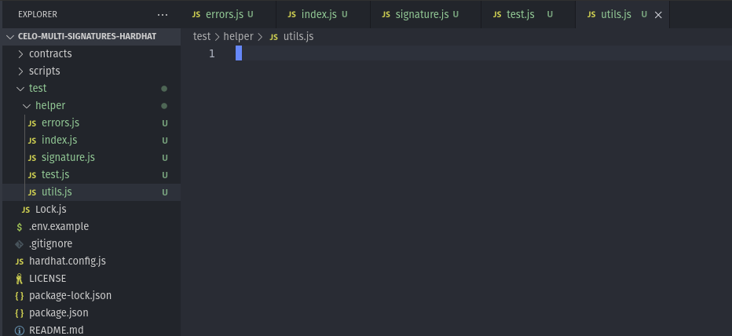

### Errors helper

In the `errors.js` file, we will add the following code:

```js
module.exports = {
  NOT_SELF: "CeloMultiSig: only this contract can call this function",
  MAX_OWNERS_COUNT_EXCEEDED: "CeloMultiSig: cannot add owner above 2^16 - 1",
  INVALID_SIGNATURE: "CeloMultiSig: invalid signatures",
  INVALID_OWNER: "CeloMultiSig: invalid owner",
  OWNER_ALREADY_SIGNED: "CeloMultiSig: owner already signed",
  NOT_ENOUGH_GAS: "CeloMultiSig: not enough gas",
  OWNER_COUNT_BELOW_THRESHOLD:
    "CeloMultiSig: cannot remove owner below threshold",
  THRESHOLD_IS_ZERO: "CeloMultiSig: threshold must be greater than 0",
  THRESHOLD_GREATER_THAN_OWNERS_COUNT:
    "CeloMultiSig: threshold must be less than or equal to owner count",
  OLD_OWNER_NOT_OWNER: "CeloMultiSig: old owner must be an owner",
  NEW_OWNER_ALREADY_OWNER: "CeloMultiSig: new owner must not be an owner",
  NEW_OWNER_IS_ZERO_ADDRESS:
    "CeloMultiSig: new owner must not be the zero address",
};
```

These error messages are the same as the ones we used in our contract. We simply copied and pasted them here and assigned them to a variable. This has the advantage of making our tests more readable and easier to maintain. This way, if we change the error message in our contract, we will only have to change it in one place.

This should give you the following result:

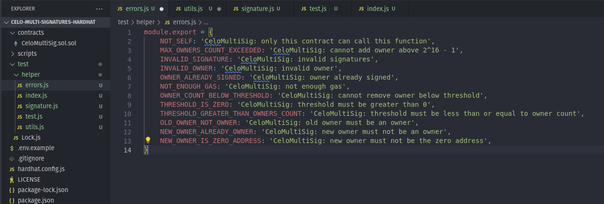

### Utils helper

In the `utils.js` file, we will add the following code:

```js
const { ethers, network, addressBook } = require("hardhat");

module.exports = {
  setupProviderAndWallets: async function () {
    const provider = ethers.provider;
    let owner01;
    let owner02;
    let owner03;

    let user01;
    let user02;
    let user03;

    if (network.config.accounts && network.config.accounts.mnemonic) {
      // If the network is configured with a mnemonic, use it to generate the wallets
      owner01 = new ethers.Wallet(
        ethers.Wallet.fromMnemonic(
          network.config.accounts.mnemonic,
          `m/44'/60'/0'/0/0`
        ).privateKey,
        provider
      );
      owner02 = new ethers.Wallet(
        ethers.Wallet.fromMnemonic(
          network.config.accounts.mnemonic,
          `m/44'/60'/0'/0/1`
        ).privateKey,
        provider
      );
      owner03 = new ethers.Wallet(
        ethers.Wallet.fromMnemonic(
          network.config.accounts.mnemonic,
          `m/44'/60'/0'/0/2`
        ).privateKey,
        provider
      );

      user01 = new ethers.Wallet(
        ethers.Wallet.fromMnemonic(
          network.config.accounts.mnemonic,
          `m/44'/60'/0'/0/3`
        ).privateKey,
        provider
      );
      user02 = new ethers.Wallet(
        ethers.Wallet.fromMnemonic(
          network.config.accounts.mnemonic,
          `m/44'/60'/0'/0/4`
        ).privateKey,
        provider
      );
      user03 = new ethers.Wallet(
        ethers.Wallet.fromMnemonic(
          network.config.accounts.mnemonic,
          `m/44'/60'/0'/0/5`
        ).privateKey,
        provider
      );
    } else {
      // If the network is not configured with a mnemonic, use the 3 first accounts as owners and the 3 next as users
      owner01 = new ethers.Wallet(network.config.accounts[0], provider);
      owner02 = new ethers.Wallet(network.config.accounts[1], provider);
      owner03 = new ethers.Wallet(network.config.accounts[2], provider);

      user01 = new ethers.Wallet(network.config.accounts[3], provider);
      user02 = new ethers.Wallet(network.config.accounts[4], provider);
      user03 = new ethers.Wallet(network.config.accounts[5], provider);
    }
    return [provider, owner01, owner02, owner03, user01, user02, user03];
  },
  deployContract: async function (owners, threshold) {
    // Retrieve the contract factory
    const CeloMultiSig = await ethers.getContractFactory("CeloMultiSig");
    // Deploy the contract with the specified parameters for the constructor
    const contract = await CeloMultiSig.deploy(owners, threshold, {
      gasLimit: 10000000,
    });
    // Wait for the contract to be deployed
    await contract.deployed();
    // Save the contract address in the address book
    await addressBook.saveContract(
      "CeloMultiSig",
      contract.address,
      network.name,
      contract.deployTransaction.from,
      network.config.chainId,
      contract.deployTransaction.blockHash,
      contract.deployTransaction.blockNumber,
      undefined,
      {
        owners,
        threshold,
      }
    );
    // Return the contract
    return contract;
  },
};
```

This file should now look like this:

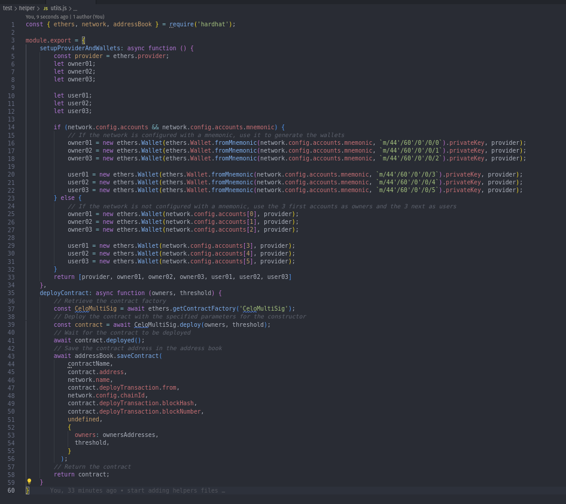

In this file, we added two functions:

- `setupProviderAndWallets`: This function will set up the provider and the wallets we will use in our tests. It will also check if the network is configured with a mnemonic or not. If it is, it will use it to generate the wallets. If it is not, it will use the first 6 accounts in the network configuration.
- `deployContract`: This function will deploy the contract with the specified parameters for the constructor. It will also save the contract address in the address book.

### Signature helper

In the `signature.js` file, we will add the following code:

```js
const { network } = require("hardhat");

module.exports = {
  signTransaction: async function (
    contractAddress,
    wallet,
    to,
    value,
    data,
    gas,
    nonce
  ) {
    const signature = await wallet._signTypedData(
      {
        name: "CeloMultiSig",
        version: "1.0",
        chainId: network.config.chainId,
        verifyingContract: contractAddress,
      },
      {
        Transaction: [
          {
            name: "to",
            type: "address",
          },
          {
            name: "value",
            type: "uint256",
          },
          {
            name: "data",
            type: "bytes",
          },
          {
            name: "gas",
            type: "uint256",
          },
          {
            name: "nonce",
            type: "uint96",
          },
        ],
      },
      {
        to,
        value,
        data,
        gas,
        nonce,
      }
    );
    return signature;
  },
};
```

> **Note**
> This function uses **\_signTypedData** to sign the transaction as per ethersJS documentation [here](https://docs.ethers.io/v5/api/signer/#Signer-_signTypedData). However, in future versions of ethersJS, this function will be deprecated and replaced by **signTypedData**.

Like this:

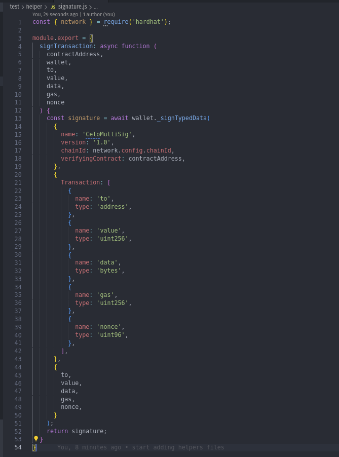

### Test helper

In the `test.js` file, we will add the following code:

```js
const { ethers, network } = require("hardhat");
const { expect } = require("chai");

const signature = require("./signatures");

const ZERO = ethers.BigNumber.from(0);

const sendRawTxn = async (input, sender, ethers, provider) => {
  // Get the nonce
  const txCount = await provider.getTransactionCount(sender.address);
  // Prepare the transaction
  const rawTx = {
    chainId: network.config.chainId,
    nonce: ethers.utils.hexlify(txCount),
    to: input.to,
    value: input.value || 0x00,
    gasLimit: ethers.utils.hexlify(3000000),
    gasPrice: ethers.utils.hexlify(25000000000),
    data: input.data,
  };
  // Sign the transaction
  const rawTransactionHex = await sender.signTransaction(rawTx);
  // Send the transaction
  const { hash } = await provider.sendTransaction(rawTransactionHex);
  // Wait for the transaction to be mined
  return await provider.waitForTransaction(hash);
};

const checkRawTxnResult = async (input, sender, error) => {
  let result;
  // Check if the transaction should fail or not
  if (error)
    if (network.name === "hardhat" || network.name === "localhost")
      await expect(
        sendRawTxn(input, sender, ethers, ethers.provider)
      ).to.be.revertedWith(error);
    else expect.fail("AssertionError: " + error);
  else {
    result = await sendRawTxn(input, sender, ethers, ethers.provider);
    expect(result.status).to.equal(1);
  }
  return result;
};

const getEventFromReceipt = async (contract, receipt, eventName) => {
  // Parse the logs
  const log = receipt.logs.map((log) => {
    try {
      return contract.interface.parseLog(log);
    } catch (e) {
      return;
    }
  });
  return log;
};
```

These functions are used to send raw transactions and check the result of the transaction. They also allow us to get the event from the receipt.

It should now look like this:

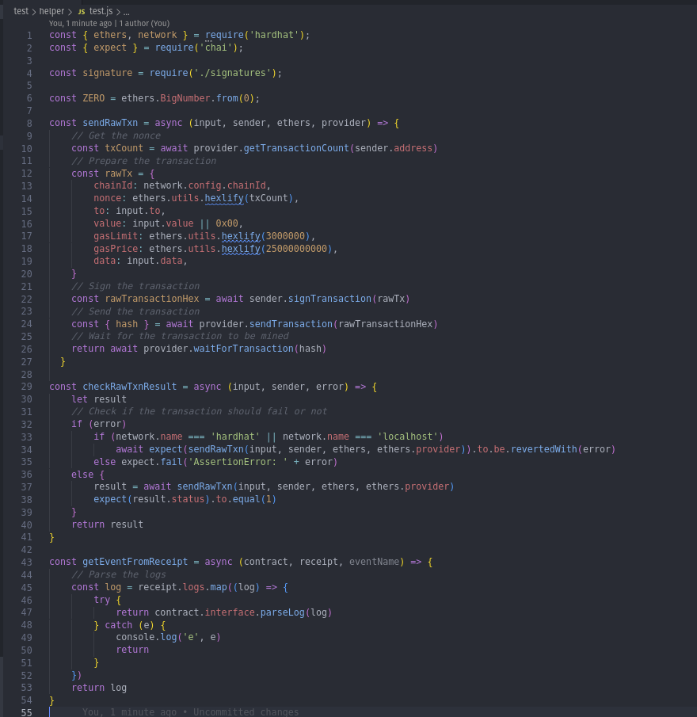

Now after the last line you added, add the following code:

```js
const prepareSignatures = async (
  contract,
  owners,
  to,
  value,
  data,
  gas = 30000
) => {
  // Query the next nonce
  const nonce = await contract.nonce();
  let signatures = "0x";
  for (var i = 0; i < owners.length; i++) {
    // For each owners, sign the transaction
    const sig = await signature.signTransaction(
      contract.address,
      owners[i],
      to,
      value,
      data,
      gas,
      nonce
    );
    // Concatenate the signatures
    signatures += sig.substring(2);
  }
  // Return signatures of all owners
  return signatures;
};
```

This function will prepare the signatures of all the owners of the contract. We will pass an array of owners using their wallets to the function and sign the transaction with each of them. The signatures will be concatenated and returned.

It should now look like this:

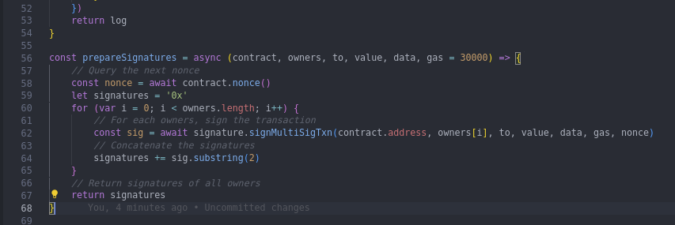

We still need to add the main helper function for testing the execution of the transaction. Please add the following code:

```js
const execTransaction = async (
  contract,
  submitter,
  owners,
  to,
  value,
  data,
  gas = 30000,
  errorMsg,
  extraEvents,
  signatures
) => {
  // Prepare signatures if not provided
  if (!signatures)
    signatures = await prepareSignatures(
      contract,
      owners,
      to,
      value,
      data,
      gas
    );
  // Prepare transaction
  const input = await contract
    .connect(submitter)
    .populateTransaction.execTransaction(to, value, data, gas, signatures);

  // Send the transaction and check the result
  const receipt = await checkRawTxnResult(input, submitter, errorMsg);
  if (!errorMsg) {
    // Check the event emitted (if transaction should succeed)
    const event = await getEventFromReceipt(
      contract,
      receipt,
      "TransactionExecuted"
    );
    let found = false;
    for (var i = 0; i < event.length; i++) {
      if (event[i] && event[i].name === "TransactionExecuted") {
        // If the event is found, check the parameters
        expect(event[i].args.sender).to.be.equal(submitter.address);
        expect(event[i].args.to).to.be.equal(to);
        expect(event[i].args.value).to.be.equal(value);
        expect(event[i].args.data).to.be.equal(data);
        expect(event[i].args.txnGas).to.be.equal(gas);
        found = true;
        return receipt;
      } else {
        // If the event is not found, check if the transaction failed
        if (
          extraEvents &&
          extraEvents.find(
            (extraEvent) => extraEvent === "TransactionFailed"
          ) &&
          event[i] &&
          event[i].name === "TransactionFailed"
        ) {
          // If the transaction failed, check the parameters and if we expect a failure
          expect(event[i].args.sender).to.be.equal(submitter.address);
          expect(event[i].args.to).to.be.equal(to);
          expect(event[i].args.value).to.be.equal(value);
          expect(event[i].args.data).to.be.equal(data);
          expect(event[i].args.txnGas).to.be.equal(gas);
          found = true;
          return receipt;
        } else {
          // If the transaction failed but we don't expect it, throw an error
          if (found) expect.fail("TransactionExecuted event not found");
        }
      }
    }
    // If the event is not found, throw an error
    if (event.length == 0) expect.fail("TransactionExecuted event not found");
    // If we expect an extra event, check if it is emitted
    if (extraEvents && extraEvents.length > 0) {
      for (let i = 1; i < extraEvents.length; i++) {
        const eventsFound = await getEventFromReceipt(contract, receipt, event);
        for (var ii = 0; i < eventsFound.length; ii++) {
          if (eventsFound[ii]) {
            expect(submitter.address).to.be.equal(eventsFound[ii].sender);
            return receipt;
          }
        }
      }
    }
  }
};
```

This function will prepare the transaction, send it, and check the result. It will also check the event emitted by the transaction. This helper function is flexible and can be used to test the execution of a transaction, the failure of a transaction, or the execution of a transaction with extra event.

Please make sure the function looks like this:

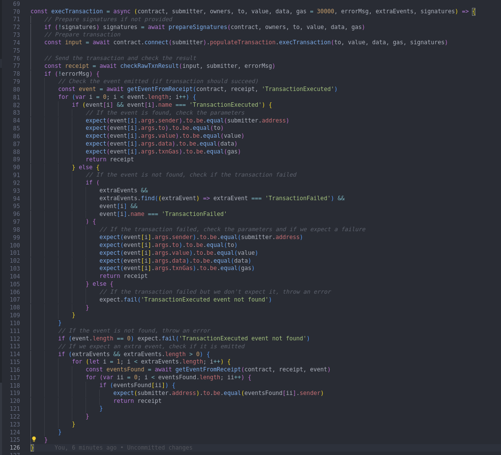

Lastly, we need to add the function that will be used to test the addOwner, removeOwner, changeThreshold, and replaceOwner functions. Please add the following code:

```js
const addOwner = async (
  contract,
  submitter,
  owners,
  ownerToAdd,
  gas = 30000,
  errorMsg,
  extraEvents
) => {
  const data = contract.interface.encodeFunctionData("addOwner(address)", [
    ownerToAdd,
  ]);

  await execTransaction(
    contract,
    submitter,
    owners,
    contract.address,
    ZERO,
    data,
    gas,
    errorMsg,
    extraEvents
  );

  if (!errorMsg) expect(await contract.isOwner(ownerToAdd)).to.be.true;
};

const removeOwner = async (
  contract,
  submitter,
  owners,
  ownerToRemove,
  gas = 30000,
  errorMsg,
  extraEvents
) => {
  const data = contract.interface.encodeFunctionData("removeOwner(address)", [
    ownerToRemove,
  ]);

  await execTransaction(
    contract,
    submitter,
    owners,
    contract.address,
    ZERO,
    data,
    gas,
    undefined,
    extraEvents
  );

  if (!errorMsg) expect(await contract.isOwner(ownerToRemove)).to.be.false;
  else expect(await contract.isOwner(ownerToRemove)).to.be.true;
};

const changeThreshold = async (
  contract,
  submitter,
  owners,
  newThreshold,
  gas = 30000,
  errorMsg,
  extraEvents
) => {
  const data = contract.interface.encodeFunctionData(
    "changeThreshold(uint16)",
    [newThreshold]
  );

  await execTransaction(
    contract,
    submitter,
    owners,
    contract.address,
    ZERO,
    data,
    gas,
    errorMsg,
    extraEvents
  );

  if (!errorMsg) expect(await contract.threshold()).to.be.equal(newThreshold);
};

const replaceOwner = async (
  contract,
  submitter,
  owners,
  ownerToAdd,
  ownerToRemove,
  gas = 30000,
  errorMsg,
  extraEvents
) => {
  const data = contract.interface.encodeFunctionData(
    "replaceOwner(address,address)",
    [ownerToRemove, ownerToAdd]
  );

  await execTransaction(
    contract,
    submitter,
    owners,
    contract.address,
    ZERO,
    data,
    gas,
    errorMsg,
    extraEvents
  );

  if (!errorMsg) {
    expect(await contract.isOwner(ownerToAdd)).to.be.true;
    expect(await contract.isOwner(ownerToRemove)).to.be.false;
  }
};
```

These four functions make use of the `execTransaction` function to test the execution of the `addOwner`, `removeOwner`, `changeThreshold`, and `replaceOwner` functions. They will also check if the owner was added, removed, or replaced correctly or if the threshold was changed correctly.

As our main `execTransaction` function takes data as an argument, we need to encode our function call before sending it. We can do that using the `encodeFunctionData` function from the contract interface. This function will encode the function name and the arguments into a data string that can be used to call the function.

Please ensure the text looks like this:

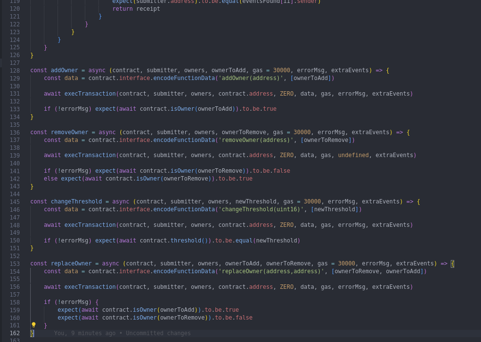

Finally, we need to export all the helper functions. Please add the following code at the end of the file:

```js
module.exports = {
  checkRawTxnResult,
  prepareSignatures,
  execTransaction,
  addOwner,
  removeOwner,
  changeThreshold,
  replaceOwner,
};
```

This way, we can import all the helper functions in our test file.

Please make sure the text looks like this:

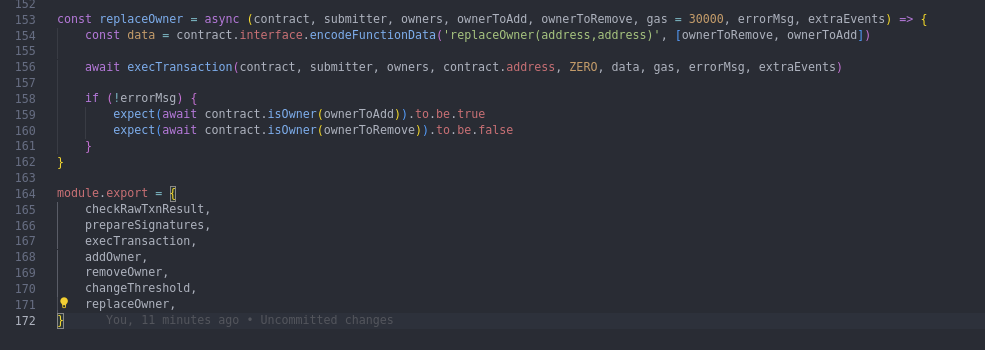

### Exporting all the helpers

In the `index.js` file, we will add the following code:

```js
const errors = require("./errors");
const test = require("./test");
const signature = require("./signatures");
const utils = require("./utils");

module.exports = {
  errors,
  test,
  signature,
  ...utils,
};
```

This way, we can import all the helper functions in our test file by importing the `index.js` file.

Please ensure the text looks like this:

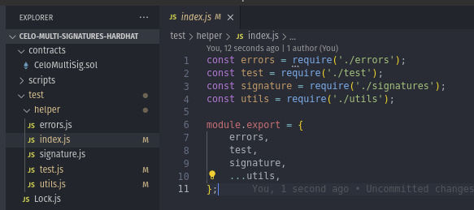

## Writing our first test

Now that we have all the helper functions ready, we can start writing our first test. In the `test` folder, rename the `Lock.js` file that Hardhat had added for us to `CeloMultiSig.test.js`. Then, replace all the content of the file with the following code:

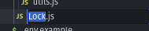
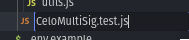

```js
const { expect } = require("chai");
const { ethers } = require("hardhat");

const Helper = require("./helper");

let provider;
let owner01;
let owner02;
let owner03;
let ownerCount;
let user01;
let user02;
let user03;
let contract;

describe("CeloMultiSig", function () {
  before(async function () {
    [provider, owner01, owner02, owner03, user01, user02, user03] =
      await Helper.setupProviderAndWallets();
  });

  beforeEach(async function () {
    const owners = [owner01.address, owner02.address, owner03.address];
    ownerCount = owners.length;
    contract = await Helper.deployContract(
      [owner01.address, owner02.address, owner03.address],
      2
    );
  });

  it("Contract return correct contract name", async function () {
    expect(await contract.name()).to.be.equal("CeloMultiSig");
  });

  it("Contract return correct contract version", async function () {
    expect(await contract.version()).to.be.equal("1.0");
  });
});
```

Please make sure the text looks like this:

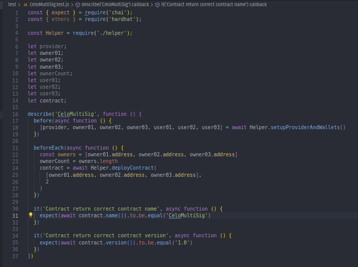

Now that we have some tests, we can run them using the following command:

```bash
npx hardhat test
```

Doing so, we should have our first error! It should look something like this:

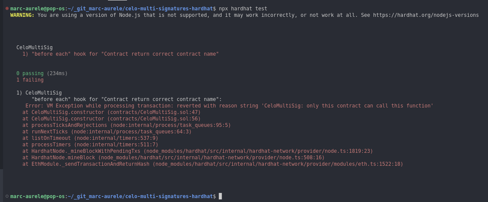

The important part of the error is the following:

```bash
Error: VM Exception while processing transaction: reverted with reason string 'CeloMultiSig: only this contract can call this function'
```

This error is telling us that somewhere in our constructor function logic, we are calling a function that is not allowed to be called by anyone else than the contract itself. Let's fix that!

### Fix the constructor function

This is our constructor function:

```solidity
constructor(address[] memory owners_, uint16 threshold_) EIP712(name(), version()) {
  require(owners_.length <= 2 ** 16 - 1, 'CeloMultiSig: cannot add owner above 2^16 - 1');
  uint256 length = owners_.length;
  for (uint256 i = 0; i < length; ) {
    _owners[owners_[i]] = true;
    unchecked {
      ++i;
    }
  }
  _ownerCount = uint16(owners_.length);
  changeThreshold(threshold_);
}
```

The last line of this logic is calling the `changeThreshold` function. Let's take a look at this function:

```solidity
function changeThreshold(uint16 newThreshold) public onlyThis {
  require(newThreshold > 0, 'CeloMultiSig: threshold must be greater than 0');
  require(newThreshold <= _ownerCount, 'CeloMultiSig: threshold must be less than or equal to owner count');
  _threshold = newThreshold;
}
```

This function is using the `onlyThis` modifier. Let's take a look at this modifier:

```solidity
modifier onlyThis() {
  require(msg.sender == address(this), 'CeloMultiSig: only this contract can call this function');
  _;
}
```

This modifier checks that `msg.sender` is the contract itself. This is not what we want in our constructor function, as we want to allow anyone to call this function. There are different ways to solve this issue. We could either paste the logic of the `changeThreshold` function in the constructor function or create a private `_changeThreshold` function that does not use the `onlyThis` modifier. Let's go with the second option.

However, we must not simply remove the `onlyThis` modifier to fix the issue. Doing so would allow anyone to call the `changeThreshold` function, which is not what we want. Instead, we want to allow anyone to call the constructor function but not the `changeThreshold` function.

To achieve this, we can replace the `changeThreshold` function with the following code:

```solidity
function _changeThreshold(uint16 newThreshold) private {
  require(newThreshold > 0, 'CeloMultiSig: threshold must be greater than 0');
  require(newThreshold <= _ownerCount, 'CeloMultiSig: threshold must be less than or equal to owner count');
  _threshold = newThreshold;
}

/// @notice Changes the threshold
/// @param newThreshold The new threshold.
/// @dev This function can only be called inside a multisig transaction.
function changeThreshold(uint16 newThreshold) public onlyThis {
    _changeThreshold(newThreshold);
}
```

The result should look like this:

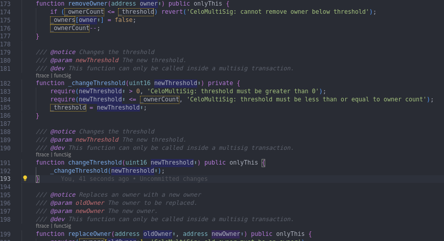

Now, in the constructor function, we can call the `_changeThreshold` function instead of the `changeThreshold` function. Therefore, we should replace the `changeThreshold` function by changing the last line of the constructor function with the following code:

```solidity
_changeThreshold(threshold_);
```

The constructor function should now look like this:

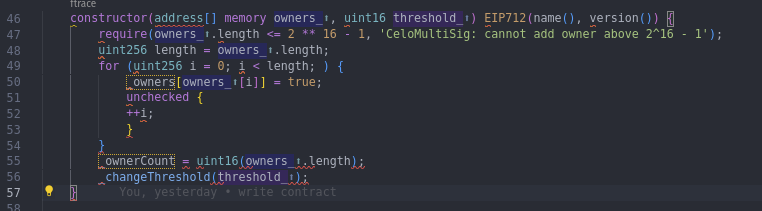

### Run the tests again

Now that we have fixed the issue, we can run the tests again using the following command:

```bash
npx hardhat test
```

Doing so, we should have the following result:

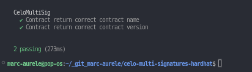

### Add more read functions tests

Now let's add more tests to our test file. We'll go back to the `test/CeloMultiSig.test.js` file and add the following code:

```javascript
it("Contract return correct threshold", async function () {
  expect(await contract.threshold()).to.be.equal(2);
});

it("Contract return correct ownerCount", async function () {
  expect(await contract.ownerCount()).to.be.equal(ownerCount);
});

it("Contract return correct nonce", async function () {
  expect(await contract.nonce()).to.be.equal(0);
});

it("Contract return true when calling isOwner for the original owners addresses", async function () {
  expect(await contract.isOwner(owner01.address)).to.be.true;
  expect(await contract.isOwner(owner02.address)).to.be.true;
  expect(await contract.isOwner(owner03.address)).to.be.true;
});

it("Contract return false when calling isOwner for non owners addresses", async function () {
  expect(await contract.isOwner(user01.address)).to.be.false;
  expect(await contract.isOwner(user02.address)).to.be.false;
  expect(await contract.isOwner(user03.address)).to.be.false;
});
```

The result should look like this:

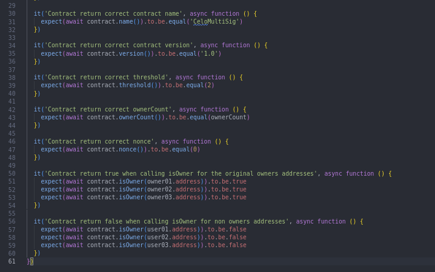

These tests are simple but important. They are testing the read functions of our contract. We are testing that the contract returns the correct threshold, the correct ownerCount, the correct nonce, and that the contract returns the correct value when calling the `isOwner` function for the original owners' addresses and for non-owners' addresses.

We can now run the tests again using the following command:

```bash
npx hardhat test
```

Doing so, we should have the following result:

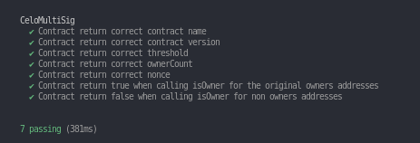

### Add the first write function test

Now let's add the first test for a write function. We'll go back to the `test/CeloMultiSig.test.js` file and add the following code:

```javascript
it("Can add a new owner", async function () {
  await Helper.test.addOwner(
    contract,
    owner01,
    [owner01, owner02, owner03],
    user01.address,
    undefined,
    undefined,
    ["OwnerAdded"]
  );
});

it("Can add a new owner and then use it to sign a new transaction replaceOwner", async function () {
  await Helper.test.addOwner(
    contract,
    owner01,
    [owner01, owner02, owner03],
    user01.address,
    undefined,
    undefined,
    ["OwnerAdded"]
  );
  await Helper.test.replaceOwner(
    contract,
    owner01,
    [user01, owner02, owner03],
    user02.address,
    owner01.address,
    undefined,
    undefined,
    ["OwnerRemoved", "OwnerAdded"]
  );
});

it("Can add a new owner and then use it to sign a new transaction changeThreshold", async function () {
  await Helper.test.addOwner(
    contract,
    owner01,
    [owner01, owner02, owner03],
    user01.address,
    undefined,
    undefined,
    ["OwnerAdded"]
  );
  await Helper.test.changeThreshold(
    contract,
    owner01,
    [user01, owner02, owner03],
    3,
    undefined,
    undefined,
    ["ThresholdChanged"]
  );
});

it("Can add a new owner and then use it to sign a new transaction removeOwner", async function () {
  await Helper.test.addOwner(
    contract,
    owner01,
    [owner01, owner02, owner03],
    user01.address,
    undefined,
    undefined,
    ["OwnerAdded"]
  );
  await Helper.test.removeOwner(
    contract,
    owner01,
    [user01, owner02, owner03],
    owner01.address,
    undefined,
    undefined,
    ["OwnerRemoved"]
  );
});
```

The result should look like this:

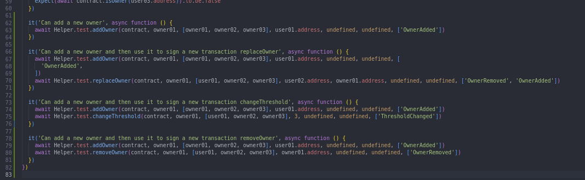

```bash
npx hardhat test
```

Doing so, we should have the following result:

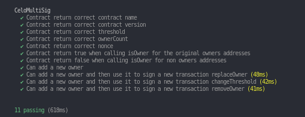

### Add tests expecting failures

Time to add some tests expecting the transaction to fail. We'll go back to the `test/CeloMultiSig.test.js` file and add the following code:

```javascript
it("Cannot add a new owner with just 10k gas", async function () {
  await Helper.test.addOwner(
    contract,
    owner01,
    [owner01, owner02, owner03],
    user01.address,
    10000,
    Helper.errors.NOT_ENOUGH_GAS
  );
});

it("Cannot add a new owner with 3x the signature of owner01", async function () {
  await Helper.test.addOwner(
    contract,
    owner01,
    [owner01, owner01, owner01],
    user01.address,
    30000,
    Helper.errors.OWNER_ALREADY_SIGNED
  );
});

it("Cannot remove all owners", async function () {
  await Helper.test.removeOwner(
    contract,
    owner01,
    [owner02, owner03],
    owner01.address,
    undefined,
    undefined,
    ["OwnerRemoved"]
  );
  await Helper.test.removeOwner(
    contract,
    owner02,
    [owner02, owner03],
    owner03.address,
    undefined,
    Helper.errors.OWNER_COUNT_BELOW_THRESHOLD,
    ["TransactionFailed"]
  );
  await Helper.test.removeOwner(
    contract,
    owner03,
    [owner02, owner03],
    owner02.address,
    undefined,
    Helper.errors.OWNER_COUNT_BELOW_THRESHOLD,
    ["TransactionFailed"]
  );
});

it("Cannot reuse a signature", async function () {
  const data = contract.interface.encodeFunctionData("addOwner(address)", [
    user02.address,
  ]);
  const signatures = await Helper.test.prepareSignatures(
    contract,
    [owner01, owner02],
    contract.address,
    0,
    data
  );
  await Helper.test.execTransaction(
    contract,
    owner01,
    [owner01, owner02],
    contract.address,
    0,
    data,
    30000,
    undefined,
    ["OwnerAdded"],
    signatures
  );
  await Helper.test.execTransaction(
    contract,
    owner01,
    [owner01, owner02],
    contract.address,
    0,
    data,
    30000,
    Helper.errors.INVALID_OWNER,
    undefined,
    signatures
  );
});
```

The result should look like this:

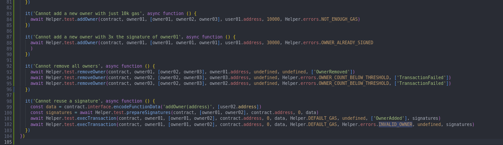

You can see that in these tests, we use the errors object from the `Helper` object to pass to our test helper function the error message we expect to be thrown by the contract.

We can now run the tests again using the following command:

```bash
npx hardhat test
```

Doing so, we should have the following result:

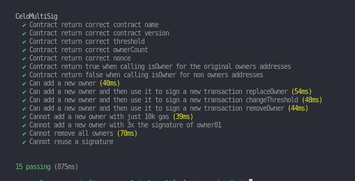

### Add tests of regular ethereum transactions

Let's add a few tests of regular Ethereum transactions. We'll go back to the `test/CeloMultiSig.test.js` file and add the following code:

```javascript
it("Execute transaction without data but 1 ETH in value", async function () {
  await owner01.sendTransaction({
    to: contract.address,
    value: ethers.utils.parseEther("1"),
    data: "",
    gasLimit: 30000,
  });
  await Helper.test.execTransaction(
    contract,
    owner01,
    [owner01, owner02, owner03],
    owner01.address,
    ethers.utils.parseEther("1"),
    "0x",
    30000
  );
});

it("Execute transaction without data but 2x 1 ETH in value", async function () {
  await owner01.sendTransaction({
    to: contract.address,
    value: ethers.utils.parseEther("2"),
    data: "",
    gasLimit: 30000,
  });
  await Helper.test.execTransaction(
    contract,
    owner01,
    [owner01, owner02, owner03],
    owner01.address,
    ethers.utils.parseEther("1"),
    "0x",
    30000
  );
  await Helper.test.execTransaction(
    contract,
    owner02,
    [owner01, owner02, owner03],
    owner01.address,
    ethers.utils.parseEther("1"),
    "0x",
    30000
  );
});
```

The result should look like this:


We can now run the tests again using the following command:

```bash
npx hardhat test
```

Doing so, we should have the following result:

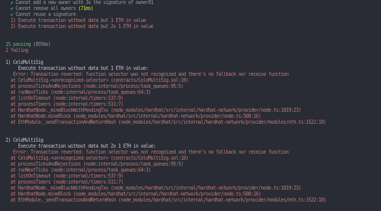

As you can see, we have our second test failing. We were able to execute transactions that called our contract functions, but we can't send Ethereum to our contract successfully. This is because our multisignature contract does not have a `receive` function.

### Add a receive Function

Let's fix this issue by adding a `receive` function. We'll go back to the `contracts/CeloMultiSig.sol` file and add the following code at the end of the contract:

```javascript
  /// @notice Receives Ether
  receive() external payable {}
```

The result should look like this:

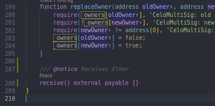

We can now run the tests again using the following command:

```bash
npx hardhat test
```

Doing so, we should have the following result:

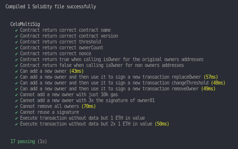

As you can see, all our tests are now passing. So far, we have tested all our contract functions and tested that we can use this multisignature contract to send Ethereum to another address. However, one thing we have not tested yet is that we can use this contract to interact with other contracts.

### Add tests of contract interactions

To test that we can use this contract to interact with other contracts, we will use the [Hardhat-Awesome-CLI](https://www.npmjs.com/package/hardhat-awesome-cli) to add a couple of mock contracts to our project. So, run the following command:

```bash
npx hardhat cli
```

Doing so, you should see the following menu:

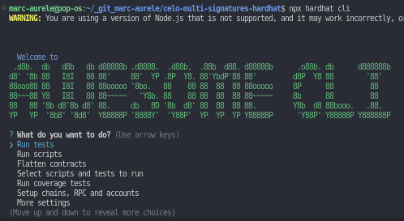

Press 7 time on the down arrow key to select the **Create Mock contracts** option:

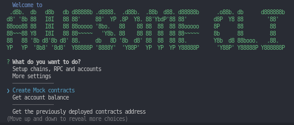

Then press enter. You should see the following menu:

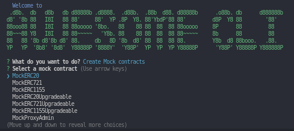

Now select the **MockERC20** option by pressing enter. You should see the following menu:

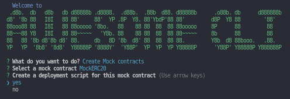

Now select **no** by pressing the down arrow and enter. You should see the following menu:

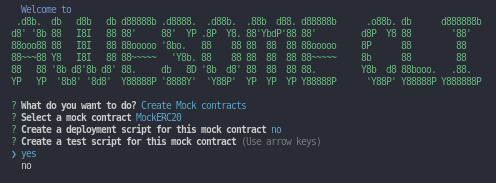

Now select **yes** by pressing the down arrow and enter. After a few seconds, you should see one new file in the `contracts` folder and one new file in the `test` folder:

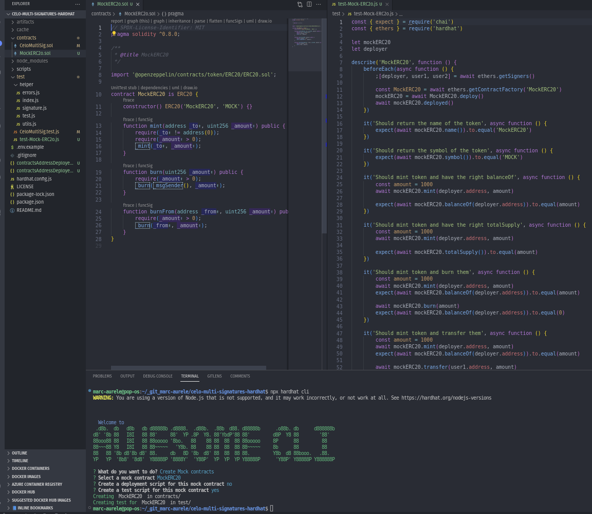

Let's organize these new files better, let's add the `MockERC20.sol` contract in the `contracts/mocks` folder and the `MockERC20.test.js` test file in the `test/mocks` folder. So go back to the `contracts` folder and create a new folder named `mocks` and move the `MockERC20.sol` contract in it. Then go back to the `test` folder and create a new folder named `mocks` and move the `MockERC20.test.js` test file in it. The result should look like this:

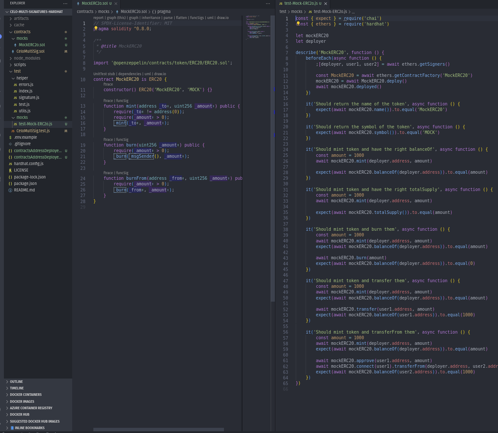

Now if we run the tests again using the following command:

```bash
npx hardhat test
```

Doing so, we should have the following result:

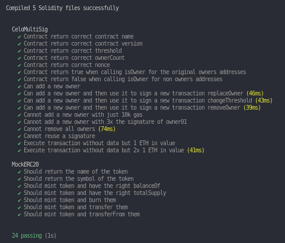

We see that there is more tests for our mock ERC20 contract (a basic token contract), our next step is to add test in our `CeloMultiSig.test.js` file to test that we can deploy the Mock ERC20 contract, then use our multi-signatures contract to interact with it.
Let's open first the `test/mocks/MockERC20.test.js` file to copy the deployment code of the Mock ERC20 contract:

```javascript
const MockERC20 = await ethers.getContractFactory("MockERC20");
mockERC20 = await MockERC20.deploy();
await mockERC20.deployed();
```

This is the code that deploys the mock ERC20 contract, so let's go back to the `test/CeloMultiSig.test.js` file and add the following code at the end of the file:

```javascript
it("Deploy MockERC20 contract and mint token using the multi-signatures", async function () {
  const MockERC20 = await ethers.getContractFactory("MockERC20");
  mockERC20 = await MockERC20.deploy();
  await mockERC20.deployed();

  const data = mockERC20.interface.encodeFunctionData("mint(address,uint256)", [
    user02.address,
    1000000,
  ]);
  const signatures = await Helper.test.prepareSignatures(
    contract,
    [owner01, owner02, owner03],
    mockERC20.address,
    0,
    data,
    50000
  );
  await Helper.test.execTransaction(
    contract,
    owner01,
    [owner01, owner02, owner03],
    mockERC20.address,
    0,
    data,
    50000,
    undefined,
    ["Transfer"],
    signatures
  );
  expect(await mockERC20.balanceOf(user02.address)).to.equal(1000000);
});

it("Deploy MockERC20 contract and mint token using the multi-signatures then burn them using the multi-signatures", async function () {
  const MockERC20 = await ethers.getContractFactory("MockERC20");
  mockERC20 = await MockERC20.deploy();
  await mockERC20.deployed();

  const data1 = mockERC20.interface.encodeFunctionData(
    "mint(address,uint256)",
    [contract.address, 1000000]
  );
  const signatures1 = await Helper.test.prepareSignatures(
    contract,
    [owner01, owner02, owner03],
    mockERC20.address,
    0,
    data1,
    50000
  );
  await Helper.test.execTransaction(
    contract,
    owner01,
    [owner01, owner02, owner03],
    mockERC20.address,
    0,
    data1,
    50000,
    undefined,
    ["Transfer"],
    signatures1
  );
  expect(await mockERC20.balanceOf(contract.address)).to.equal(1000000);

  const data2 = mockERC20.interface.encodeFunctionData("burn(uint256)", [
    1000000,
  ]);
  const signatures2 = await Helper.test.prepareSignatures(
    contract,
    [owner01, owner02, owner03],
    mockERC20.address,
    0,
    data2,
    50000
  );
  await Helper.test.execTransaction(
    contract,
    owner01,
    [owner01, owner02, owner03],
    mockERC20.address,
    0,
    data2,
    50000,
    undefined,
    ["Transfer"],
    signatures2
  );
  expect(await mockERC20.balanceOf(contract.address)).to.equal(0);
});
```

It should look like this:

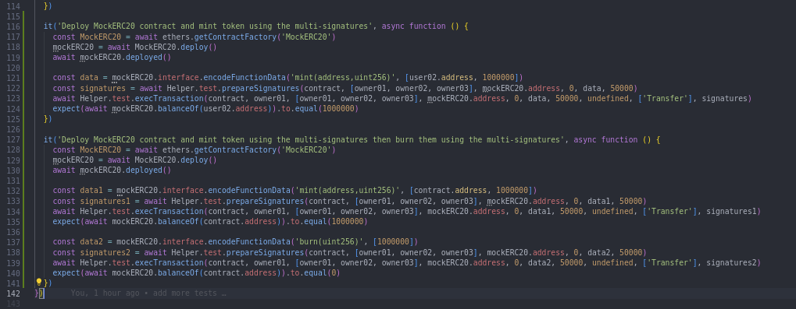

Now if we run the tests again using the following command:

```bash
npx hardhat test
```

Doing so, we should have the following result:

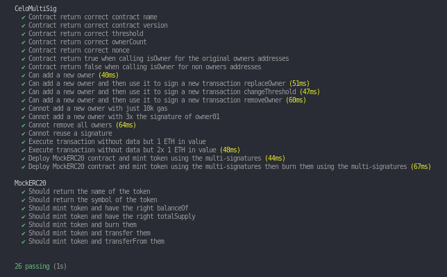

Perfect! We did it! We now have a multi-signature contract that can interact with other contracts and be used for regular transactions. Now let's deploy our multi-signature contract on the Celo Alfajores Testnet.

## Deploy the Multi-Signature Contract on Celo Alfajores Testnet

It's time to deploy our multi-signature contract on the Celo Alfajores Testnet. Let's go back to the `scripts/deploy.js` file and change the code to the following:

```javascript
const Helper = require("../test/helper");

async function main() {
  const [, owner01, owner02, owner03] = await Helper.setupProviderAndWallets();

  const owners = [owner01.address, owner02.address, owner03.address];
  const contract = await Helper.deployContract(owners, 2);

  console.log(`Contract CeloMultiSig deployed to ${contract.address}`);
  console.log(`Owners: ${owners}`);
  console.log(`Required confirmations (threshold): 2`);
}

main().catch((error) => {
  console.error(error);
  process.exitCode = 1;
});
```

It should look like this:

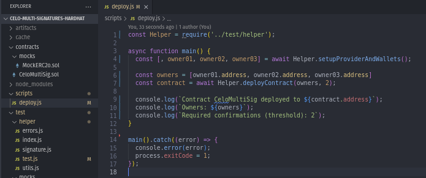

### Deploy locally

Now let's run the following command to deploy our contract:

```bash
npx hardhat run scripts/deploy.js
```

Doing so, we should have the following result:

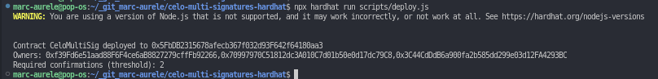

### Deploy on Celo Alfajores Testnet

We have now deployed our contract locally, but we want to deploy it on the Celo Alfajores Testnet. If you have set up your mnemonic phrase in the `.env` file, you can run the following command to deploy your contract on the Celo Alfajores Testnet:

```bash
npx hardhat run scripts/deploy.js --network celoAlfajores
```

By doing so, we should get the following result:

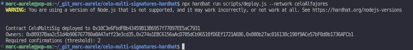

We have successfully deployed our contract on the Celo Alfajores Testnet.

## Conclusion

Congratulations! You have now learned how to write tests for a multi-signature smart contract in JavaScript using Hardhat. By following this tutorial, you have gained a solid understanding of how multi-signature contracts work and how to use them with ethers.js. You can now implement this secure form of contract ownership protection in your own projects.

Don't forget that you can view, clone, or fork the full code of this tutorial on GitHub at [Celo Multi-Signatures Hardhat](https://github.com/marc-aurele-besner/celo-multi-signatures-hardhat). You can use this code as a reference for your own multi-signature contracts or modify it to suit your specific needs.

I hope you found this tutorial helpful in your journey towards becoming a proficient blockchain developer. If you have any questions or feedback, please do not hesitate to reach out. Thank you for reading, and happy coding!

## Next steps

From here, there are multiple roads you can choose, depending if you are planning on using this multi-signature contract to secure the ownership or some access roles of your smart contract, or to secure your personal funds. As you can see from this tutorials, using a multi-signature to execute calls to other smart contracts adds a level of complexity, as you need to have the ABI of the contract you are calling, encode the call and assemble the different signature. So to make multi-signatures very flexible and user-friendly, it can be a daunting task. However, it can be pretty simple to integrate at a smaller scale in one specific project workflow, as a way to secure the ownership of a contract, and will often be a suggestion from the auditors.

In a future set of tutorials we will look at how we can do a flexible DApp to manage the multi-signatures, and make it user friendly for the owners to sign transactions.

In the meantime, I invite you to start planning yourself for this next tutorial, by starting designing the DApp we will be building. You can start by looking at the [Designing a User-Friendly Celo DApp- A Beginners Guide to UI/UX](https://docs.celo.org/blog/tutorials/designing-a-user-friendly-celo-dapp-a-beginners-guide-to-uiux).

And if you want to go one step further, you can start setting up a react project, by following the [React based DApp](https://docs.celo.org/blog/developer-guide/start/web-dapp) tutorial.

## References

- [Tutorial Part 1](https://docs.celo.org/blog/tutorials/how-to-write-a-multi-signatures-contract-on-celo-using-hardhat-part-1-2)
- [This project repo](https://github.com/marc-aurele-besner/celo-multi-signatures-hardhat/tree/part-1-2)
- [Solidity](https://docs.soliditylang.org)
- [What Is a Multisig Wallet?](https://www.coindesk.com/learn/what-is-a-multisig-wallet/)
- [Hardhat Documentation](https://hardhat.org/getting-started/)
- [Ethers.js Documentation](https://docs.ethers.org/v5/)

## About the author

Hi there! My name is **Marc-Aurele**, but please feel free to call me **Mark**. Thank you for taking the time to read my tutorial. I am a Web3 full-stack and Solidity engineer with a passion for blockchain technology, smart contract development, and building open-source tools.

My mission is to make it easier for developers to build decentralized applications and integrate smart contracts into their projects by creating innovative solutions and tools. I firmly believe that blockchain technology has the potential to revolutionize the way we interact online, and I am committed to contributing to its development.

With extensive expertise in frameworks such as Hardhat and Foundry for Smart Contracts development, I have built multiple open-source tools that facilitate smart contract development and make it more accessible for developers. I am always exploring new technologies and frameworks to stay ahead of the curve and bring fresh ideas to the table.

Sharing my knowledge and helping other developers is also one of my passions. I am always willing to lend a hand to those who are stuck on a blocker, and I am open to collaborating and contributing to the ecosystem. Teaching and mentoring are essential to me, and I believe that by helping others, we can all grow and advance together.

Lastly, if you want to stay updated on my latest projects, tools, and insights on blockchain technology and smart contract development, please consider following me on Twitter at [@marcaureleb](https://twitter.com/marcaureleb) or connecting with me on LinkedIn at [Marc-Aurele Besne](https://www.linkedin.com/in/marc-aurele-besner/). I'm always excited to connect with like-minded individuals and share knowledge and ideas. Let's stay in touch!
