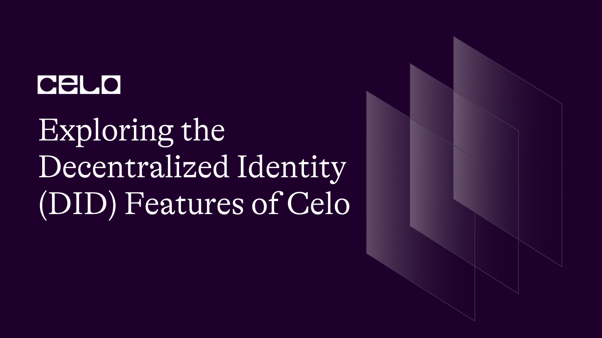

## Introduction

Decentralized identity is quickly becoming an essential component of many blockchain ecosystems, allowing users to control their identity and data without relying on centralized authorities. Celo, a mobile-first blockchain platform, is leading the charge in providing robust support for decentralized identity features, allowing users to generate and manage decentralized identifiers (DIDs) with the help of its DID library.

In this article, we'll go over the underlying principles of using Celo's DID library, such as how to create a new DID, add verifiable credentials, and use them to authenticate with third-party applications and services.

We'll also look at how Celo's DID library gives users self-sovereign control over their identity and data, as well as how it interacts with other blockchain networks and protocols that support the [W3C DID standard](https://www.w3.org/TR/did-core/). By the end of this article, you'll have a thorough understanding of Celo's DID library and its significance in establishing a secure and user-centric decentralized future.

## Prerequisite

Before delving into the technical aspects of decentralized identity and Celo's DID library, a basic understanding of blockchain technology and its underlying concepts is required. Understanding the implementation of Celo's DID library will also require familiarity with programming languages such as JavaScript and Solidity, as well as a basic understanding of smart contracts.

Furthermore, prior experience with Celo's mobile-first blockchain platform and familiarity with its unique features, such as stablecoins and the ability to send payments via phone numbers, is recommended.

## Requirements

- Vscode

## Discover the Power of Decentralized Identity: Revolutionizing Digital Identity with Blockchain Technology

Decentralization is the name of the game in the world of blockchain. It is what gives the blockchain its power and security. Decentralized identity, or DID for short, is a critical component of many blockchain ecosystems, and it is altering our perceptions of digital identity.

Digital identity has traditionally been centralized, which means it is controlled by a single entity, such as a government, bank, or corporation. This model has numerous flaws, including concerns about privacy, security risks, and a lack of user control over their own data.

Decentralized identity, on the other hand, empowers users to control their own identities and data. Users own their identity and data in a decentralized identity system and they have control over who can access it and how it is used.

This is where blockchain technology comes into play. Blockchain technology offers a decentralized, immutable ledger ideal for storing and managing digital identities. Users can create a digital identity that is unique, secure, and tamper-proof by using blockchain.

Decentralized identity is critical in blockchain ecosystems because it allows for secure and private transactions, eliminates the need for intermediaries, and gives users control over their own identity and data. This is especially important in a world where data breaches and identity theft are on the rise.

Users can finally regain control of their digital lives and enjoy a more secure and private online experience thanks to the power of blockchain technology.

## Celo Blockchain Platform: Enabling Fast and Secure Payments with Unique Features for Financial Inclusion and Decentralized Identity (DID)

[Celo](https://celo.org/) is a mobile-first blockchain platform that is causing quite a stir in the blockchain community. While there are many blockchain platforms available, Celo has several distinguishing features that set it apart from the competition.

Celo's focus on enabling fast and secure payments is one of its distinguishing features. Unlike many other blockchain platforms that prioritize scalability and security over speed, Celo prioritizes quick and efficient payments. This is accomplished by employing a novel consensus algorithm known as [Proof of Stake](https://ethereum.org/pos/) with Identity (PoS-I), which enables faster block times and lower transaction fees.

Celo's commitment to financial inclusion is another distinguishing feature. Celo is intended to be a platform for the development of decentralized applications (DApps) that can be used by anyone, anywhere in the world, regardless of financial status. The Celo Dollar (cUSD), Celo's built-in stablecoin, is intended to be a stable and accessible form of currency that can be used for everyday transactions even in places where traditional banking services are unavailable.

Celo is also notable in the blockchain space for its strong support for decentralized identity (DID) features. As previously stated, DID is becoming increasingly important in blockchain ecosystems, and Celo has prioritized it. Celo adheres to the [W3C DID standard](https://www.w3.org/TR/did-core/), which allows users to manage their own identity and data. This is accomplished by utilizing Celo's DID library, which enables developers to create secure and user-centric decentralized applications.

Finally, Celo's distinct governance model deserves mention. Unlike many other blockchain platforms, Celo is governed by a decentralized community of validators and token holders rather than a small group of developers or a single organization. This ensures that the platform maintains its democratic, transparent, and anti-centralization characteristics.

## How Celo Enables Secure and Convenient Decentralized Identity Management: A Comprehensive Guide

[Decentralized identity](https://ethereum.org/en/decentralized-identity/) is becoming increasingly important in blockchain ecosystems, with Celo leading the way. In this article, we will look at how Celo supports decentralized identity features and the benefits of using Celo for decentralized identity management.

Celo's DID library, for example, offers robust support for decentralized identity features. This library allows developers to create secure, user-centric, decentralized applications that provide users with self-sovereign control over their identity and data. Celo supports the W3C DID standard, which allows users to create a tamper-proof, cryptographically secure, and unique identifier.

The security and privacy that Celo provides is one of the perks of using it for decentralized identity management. Users can protect their personal information from data breaches, identity theft, and other forms of digital fraud by using a decentralized identity system.

Furthermore, the use of blockchain technology by Celo ensures that user data is tamper-proof and immutable, which means that it cannot be altered or deleted without the user's permission.

Another upside of using Celo for decentralized identity management is the ease of use and accessibility it offers. Celo allows users to create and manage their digital identity using only their mobile device, anywhere in the world.

This is especially important in areas where traditional banking services are unavailable, as it allows users to participate in the digital economy without having to open a traditional bank account.

Another key feature of Celo's decentralized identity system is its support for verifiable credentials. **Verifiable credentials** are digital documents that contain information about a user's identity and can be used to verify that identity to third parties. By using verifiable credentials on the Celo blockchain, users can provide proof of their identity without having to reveal their personal information to third parties.

Finally, another upside of using the platform for decentralized identity management is Celo's commitment to financial inclusion. Celo's built-in stablecoin, the Celo Dollar (cUSD), provides a stable and accessible form of currency that can be used for everyday transactions even where traditional banking services are unavailable. This allows users to participate in the digital economy and gain access to previously unavailable financial services.

## Discover DApps that Utilize Celo's DID Features: A Showcase of Examples

Celo's decentralized identity features offer numerous advantages to developers creating decentralized applications (DApps) on the platform. Developers can use these features to create DApps that prioritize user privacy, data sovereignty, and security. Here are some decentralized applications that make use of Celo's decentralized identity features:

- **CeloPay** is a decentralized payment application that makes secure and instant payments possible by leveraging Celo's decentralized identity features. CeloPay allows users to control their own identity and data by leveraging Celo's DID system, ensuring that their personal information remains private. Furthermore, CeloPay authenticates users using verifiable credentials, ensuring that only authorized users can send and receive payments.

```javascript
// Import necessary libraries
const celoSDK = require("@celo/contractkit");
const Web3 = require("web3");

// Set up connection to Celo network
const web3 = new Web3(
  "https://<celo-network>.infura.io/v3/<infura-project-id>"
);
const kit = celoSDK.newKitFromWeb3(web3);
const account = web3.eth.accounts.privateKeyToAccount("<private-key>");

// Initialize CeloPay contract
const CeloPayContract = new web3.eth.Contract(
  `<CeloPay-ABI>`,
  `<CeloPay-contract-address>`
);
const celoPay = CeloPayContract.methods;

// Define payment function
async function makePayment(recipientAddress, amount) {
  // Get user's DID from Celo's DID system
  const did = await kit.getWallet().getAccounts();

  // Generate verifiable credential
  const vc = {
    "@context": "https://www.w3.org/2018/credentials/v1",
    type: ["VerifiableCredential", "PaymentCredential"],
    issuer: did,
    issuanceDate: new Date().toISOString(),
    credentialSubject: {
      id: did,
      payment: {
        to: recipientAddress,
        amount: amount,
      },
    },
  };

  // Sign and send payment transaction
  const nonce = await web3.eth.getTransactionCount(account.address);
  const gasPrice = await kit.web3.eth.getGasPrice();
  const tx = celoPay.pay(recipientAddress, amount).encodeABI();
  const signedTx = await account.signTransaction({
    to: `<CeloPay-contract-address>`,
    data: tx,
    gas: 500000,
    gasPrice: gasPrice,
    nonce: nonce,
    value: 0,
    chainId: kit.networkId,
  });
  const txReceipt = await kit.web3.eth.sendSignedTransaction(
    signedTx.rawTransaction
  );

  return txReceipt;
}
```

This code outline demonstrates how to use Celo's decentralized identity features to authenticate users and enable secure payments within the CeloPay application. It first sets up a connection to the Celo network, initializes the CeloPay contract, and defines a payment function that takes a recipient address and payment amount as input. The function then uses Celo's DID system to retrieve the user's DID and generate a verifiable credential that includes the payment information. Finally, the function signs and sends the payment transaction using the user's private key, ensuring that only authorized users are able to make payments within the CeloPay application.

- **ImpactMarket** is a decentralized marketplace that makes use of Celo's decentralized identity features to enable secure and transparent transactions. ImpactMarket uses Celo's DID system to ensure that only verified users can participate in the marketplace, reducing the risk of fraud and protecting users from scams.
  Furthermore, ImpactMarket makes use of Celo's personal data vaults to give users control over the data shared with marketplace participants, ensuring that their personal information remains private.

```javascript
// Import necessary libraries
const celoSDK = require("@celo/contractkit");
const Web3 = require("web3");

// Set up connection to Celo network
const web3 = new Web3(
  "https://<celo-network>.infura.io/v3/<infura-project-id>"
);
const kit = celoSDK.newKitFromWeb3(web3);
const account = web3.eth.accounts.privateKeyToAccount("<private-key>");

// Initialize ImpactMarket contract
const ImpactMarketContract = new web3.eth.Contract(
  `<ImpactMarket-ABI>`,
  `<ImpactMarket-contract-address>`
);
const impactMarket = ImpactMarketContract.methods;

// Define function to add item to marketplace
async function addItem(itemName, price) {
  // Get user's DID from Celo's DID system
  const did = await kit.getWallet().getAccounts();

  // Generate verifiable credential
  const vc = {
    "@context": "https://www.w3.org/2018/credentials/v1",
    type: ["VerifiableCredential", "MarketplaceCredential"],
    issuer: did,
    issuanceDate: new Date().toISOString(),
    credentialSubject: {
      id: did,
      marketplace: {
        itemName: itemName,
        price: price,
      },
    },
  };

  // Store verifiable credential in personal data vault
  const dataVaultId = await impactMarket.getDataVaultId(did);
  const encryptedVc = await kit.web3.eth.personal.encrypt(
    JSON.stringify(vc),
    account.privateKey
  );
  const addDataVaultResult = await impactMarket.addDataVault(
    dataVaultId,
    encryptedVc
  );

  // Add item to marketplace
  const nonce = await web3.eth.getTransactionCount(account.address);
  const gasPrice = await kit.web3.eth.getGasPrice();
  const tx = impactMarket.addItem(itemName, price).encodeABI();
  const signedTx = await account.signTransaction({
    to: `<ImpactMarket-contract-address>`,
    data: tx,
    gas: 500000,
    gasPrice: gasPrice,
    nonce: nonce,
    value: 0,
    chainId: kit.networkId,
  });
  const txReceipt = await kit.web3.eth.sendSignedTransaction(
    signedTx.rawTransaction
  );

  return txReceipt;
}

// Define function to get item from marketplace
async function getItem(itemId) {
  const item = await impactMarket.getItem(itemId).call();
  return item;
}
```

This code sets up a connection to the Celo network using the Celo SDK and Web3 library. It also initializes the ImpactMarket contract and defines two functions to add and get items from the marketplace.

The `addItem` function takes in an item name and price, generates a verifiable credential for the user's DID (Decentralized Identifier) using Celo's DID system, stores the credential in the user's personal data vault using the ImpactMarket contract, and then adds the item to the marketplace by sending a signed transaction to the contract.
The `getItem` function takes in an item ID and retrieves the item details from the ImpactMarket contract.

Please note that the placeholders for `<celo-network>`, `<infura-project-id>`, `<private-key>`, `<ImpactMarket-ABI>`, and `<ImpactMarket-contract-address>` should be replaced with actual values.

In summary, Celo's decentralized identity features offer a plethora of advantages to developers building decentralized applications on the platform. Developers can use these features to create DApps that prioritize user privacy, data sovereignty, and security. The examples above show how Celo's decentralized identity features can be used to create a variety of decentralized applications, payment apps, and more.

## Celo DID Library Demo: Learn How to Create and Verify Verifiable Credentials on the Celo Network

Using Celo's DID library is a simple process that can be completed in a few simple steps. First, the user must create a Celo wallet, which will serve as their platform identity. After creating the wallet, the user can use the Celo DID library to generate a new decentralized identifier (DID). This DID will be unique to the user and will allow them to be identified on the Celo blockchain.

Following the creation of a DID, the user can add verifiable credentials to their identity, such as a government-issued ID or a university diploma. These verifiable credentials can be used to prove the user's identity to third-party applications and services while avoiding the disclosure of unnecessary personal information.

One of the primary advantages of using Celo's DID library is the level of control users have over their identity and data. This means that users can decide what information to share and with whom, rather than relying on centralized authorities to verify their identity.
Furthermore, Celo's DID system is compatible with other blockchain networks and protocols that adhere to the W3C DID standard. This allows users to use their Celo identity across multiple platforms, resulting in a more seamless and secure user experience.

## Decentralized Identifier (DID) Management with Celo's DID Library: A Code Example

This is JavaScript code that demonstrates how to use the Celo SDK and Celo DID library to create a new Celo wallet, connect to the Celo network, create a new DID, add a verifiable credential to the DID, and verify the credential.

_Here's a step-by-step breakdown of what the code does in Javascript_

- Import the Celo SDK and Celo DID library

```javascript
const CeloSDK = require("@celo/contractkit");
const { CeloDID } = require("@celo/did");
```

- Create a new Celo wallet and obtain its private key

```javascript
const kit = CeloSDK.newKit("https://alfajores-forno.celo-testnet.org");
const account = kit.web3.eth.accounts.create();
const privateKey = account.privateKey;
```

- Connect to the Celo network using the private key

```javascript
kit.connection.addAccount(privateKey);
const address = account.address;
kit.defaultAccount = address;
```

- Create a new DID using the Celo DID library

```javascript
const did = new CeloDID(kit, address);
```

- Add a verifiable credential to the DID

```javascript
const credential = {
  type: ["VerifiableCredential", "UniversityDegreeCredential"],
  issuer: "did:example:123",
  issuanceDate: "2022-03-05T13:00:00Z",
  credentialSubject: {
    id: "did:example:456",
    degree: {
      type: "BachelorDegree",
      name: "Bachelor of Science and Arts",
      degreeType: "double",
      degreeLevel: "bachelor",
      fieldOfStudy: "Computer Science",
      issuer: "University of Example",
    },
  },
};
const credentialResponse = await did.addVerifiableCredential(credential);
console.log(credentialResponse);
```

- Verify the verifiable credential

```javascript
const verificationResponse = await did.verifyVerifiableCredential(
  credentialResponse
);
console.log(verificationResponse);
```

The `credential` object represents a university degree credential, and it includes information such as the issuer, issuance date, and credential subject (i.e., the person who holds the degree). The `addVerifiableCredential` method adds the credential to the DID and returns a response that includes the credential and its proof. The `verifyVerifiableCredential` method verifies the credential and returns a response that indicates whether the credential is valid or not.

Note that this code snippet is intended for demonstration purposes only and should not be used in production without appropriate security measures in place.

```javascript
// Import the Celo SDK and DID library
const CeloSDK = require("@celo/contractkit");
const { CeloDID } = require("@celo/did");

// Create a new Celo wallet
const kit = CeloSDK.newKit("https://alfajores-forno.celo-testnet.org");
const account = kit.web3.eth.accounts.create();
const privateKey = account.privateKey;

// Connect to the Celo network using the private key
kit.connection.addAccount(privateKey);
const address = account.address;
kit.defaultAccount = address;

// Create a new DID using the Celo DID library
const did = new CeloDID(kit, address);

// Add a verifiable credential to the DID
const credential = {
  type: ["VerifiableCredential", "UniversityDegreeCredential"],
  issuer: "did:example:123",
  issuanceDate: "2022-03-05T13:00:00Z",
  credentialSubject: {
    id: "did:example:456",
    degree: {
      type: "BachelorDegree",
      name: "Bachelor of Science and Arts",
      degreeType: "double",
      degreeLevel: "bachelor",
      fieldOfStudy: "Computer Science",
      issuer: "University of Example",
    },
  },
};
const credentialResponse = await did.addVerifiableCredential(credential);
console.log(credentialResponse);

// Verify the verifiable credential
const verificationResponse = await did.verifyVerifiableCredential(
  credentialResponse
);
console.log(verificationResponse);
```

This code creates a new Celo wallet, generates a new decentralized identifier (DID) using the Celo DID library, adds a verifiable credential to the DID and verifies the credential. With these basic steps, developers can start leveraging Celo's decentralized identity features to build secure and user-centric applications.

## Conclusion

In this article, we looked at decentralized identity and its role in blockchain ecosystems. We concentrated on Celo, a mobile-first blockchain platform that offers robust support for decentralized identity features, such as the ability to generate and manage decentralized identifiers (DIDs) through its DID library. The advantages of using Celo's DID library were discussed, including self-sovereign control over identity and data, interoperability with other blockchain networks, and support for verifiable credentials. We also provided a code skeleton for generating and managing DIDs on the Celo blockchain using Celo's DID library.

**_Key Takeaways_**

- Many blockchain ecosystems rely on decentralized identity to give users control over their identity and data without relying on centralized authorities.

- Celo offers extensive support for decentralized identity features, including the ability to generate and manage decentralized identifiers (DIDs) through its DID library.

- Using Celo's DID library is a simple process that can be completed in a few simple steps, including the creation of a Celo wallet, the generation of a new DID, and the addition of verifiable credentials to the user's identity.

- Celo's DID library enables users to have self-sovereign control over their identity and data, allowing them to choose what information to share and with whom without relying on centralized authorities to authenticate their identity.

- Celo's DID system is compatible with other blockchain networks and protocols that adhere to the W3C DID standard, allowing users to use their Celo identity across multiple platforms.

- Celo is paving the way for a more secure and user-centric decentralized future by supporting verifiable credentials and interoperability with other networks.

### Next Steps

You now have a better understanding of Celo's decentralized identity features and how they allow users to maintain control over their identity and data on the blockchain. However, don't stop there!

We recommend exploring Celo's documentation and community resources to learn more about their DID library and how to use it in your own applications as you continue your journey into the world of decentralized identity. Other blockchain platforms and protocols that support decentralized identity include [Ethereum](https://ethereum.org/), [Hyperledger Indy](https://www.hyperledger.org/use/hyperledger-indy), and [Sovrin](https://sovrin.org/).

Additionally, as the field of decentralized identity technology evolves and expands, keep an eye out for new developments. You can stay ahead of the curve and help shape the future of decentralized identity by staying up to date on the latest trends and innovations.

## Author

I take pride in being a results-driven manager as well as a marketing and technical writing expert. I've spent the last five years honing my skills in building paid and organic marketing funnels for SaaS companies. Furthermore, I am a skilled Web 3 technical writer, allowing me to create compelling content that drives business growth. [LinkedIn](https://www.linkedin.com/in/maxwell-onyeka-3b4b1118b/) [Github](https://github.com/maxzysparks)

### References

- [Celo Official Website](https://celo.org/)
- [Celo Documentation](https://docs.celo.org/)
- [Celo DID Library](https://github.com/celo-org/celo-monorepo/tree/master/packages/sdk/src/identity)
- [Verifiable Credentials](https://w3c.github.io/vc-data-model/)
- [CeloPay GitHub Repository](https://github.com/celo-tools/celo-pay)
- [Web3.js Documentation](https://web3js.readthedocs.io/en/v1.3.0/)
- [Celo/contractkit Documentation](https://github.com/celo-org/celo-monorepo/tree/master/packages/contractkit)
- [Ethereum JSON-RPC API Documentation](https://eth.wiki/json-rpc/API)
