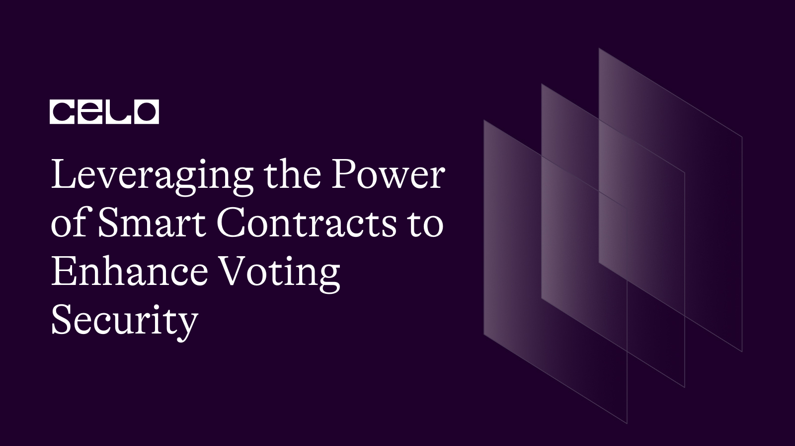

## Introduction

**Voting** is one of the most important processes that we engage in as citizens of a democratic society. It gives us a voice in decision-making and helps to ensure that our values and beliefs are represented. Traditional voting systems, on the other hand, are not always secure and transparent, which can lead to problems such as voter fraud, tainted election results, and a loss of trust in the process. That is where ballot contracts come in, which I will discuss further in this article.

## Prerequisites

Basic understanding of blockchain development and voting systems

## Requirements

- [Remix](https://remix.ethereum.org/#optimize=false&runs=200&evmVersion=null&version=soljson-v0.8.17+commit.8df45f5f.js)
- [Vscode](https://code.visualstudio.com/download)

## Overview of smart contracts

Do you know what smart contracts are? Smart contracts are digital programs that are designed to automatically carry out specific tasks when certain conditions are met. They are used to make transactions more secure and efficient in a variety of industries, from finance to real estate.

A smart contract is analogous to a digital vending machine. A smart contract performs a task automatically when certain conditions are met, similar to how a vending machine gives you what you want when you put in the right amount of money. A smart contract, for example, could be programmed to release funds to a seller only when the buyer receives the goods they ordered.

Smart contracts rely on blockchain technology, which is a digital ledger that securely and transparently records transactions. When a smart contract is created, it is stored on the blockchain and can be executed by the network automatically. Smart contracts are extremely secure and transparent because the blockchain is decentralized and tamper-proof.

We can eliminate the need for intermediaries, such as banks or lawyers, to oversee transactions by using smart contracts. Transactions can be made faster, cheaper, and more secure as a result of this. Smart contracts have the potential to transform many industries and make transactions more efficient for all parties involved.

Resources and tutorials to help you learn how to use the Solidity programming language to create a smart contract for voting systems on the Celo blockchain.

- The Solidity documentation provides a comprehensive guide on how to write, deploy, and test smart contracts. [Solidity Documentation](https://solidity.readthedocs.io/en/v0.8.12/)

- The Celo Developer Documentation also provides a guide on how to create and deploy smart contracts on the Celo blockchain. [Celo Docs](https://docs.celo.org/developer-guide/overview)

- OpenZeppelin is a popular open-source framework for building and deploying smart contracts. They have a tutorial on how to create a simple voting system using smart contracts. [Open Zeppelin](https://docs.openzeppelin.com/learn/developing-smart-contracts/voting)

## Challenges associated with traditional voting systems

**Voting** is an important process that gives people a voice in decisions that affect their lives. Traditional voting systems, on the other hand,
can have some issues that make the process less secure and transparent.

- One of the major issues with traditional voting systems is the possibility of fraud. Because the process is frequently paper-based and manual, it can be difficult to verify the accuracy of the results. This can lead to disagreements and a lack of trust in the election's outcome.

- Another difficulty is the possibility of counting errors. Even with meticulous counting and oversight, human error can occur, resulting in incorrect results. This can erode trust in the system and make it difficult for people to accept election results.

- Furthermore, traditional voting systems can be difficult for some people to use. For example, those with disabilities or who live in remote areas may have difficulty getting to a polling station, limiting their ability to vote.

While traditional voting systems have served us well for many years, they do have some limitations that can make the process less secure and transparent. As a result, experimenting with new technologies, such as smart contracts, can provide exciting opportunities to improve the voting process and make it more accessible to everyone.

## Smart contracts offer a solution to these challenges

- One of the major issues with traditional voting systems, as we previously discussed, is the possibility of fraud. Smart contracts, on the other hand, can help to address this issue by ensuring that the voting process is secure and transparent.

- All votes in a smart contract-based voting system are recorded on the blockchain, a secure and tamper-proof digital ledger. Because all votes are publicly visible, it is much more difficult for anyone to tamper with the results.

- Once they are recorded on the blockchain, they are visible and cannot be changed.

- Furthermore, smart contracts can aid in ensuring the accuracy of the counting process. Because the results are automatically recorded and cannot be altered, there is no need for manual counting, and the possibility of human error is greatly reduced.

- Another advantage of smart contract-based voting systems is that they can be made more accessible to all. Because the process is digital, anyone with an internet connection can access it. This means that people who have difficulty getting to a polling station, such as those with disabilities or living in remote areas, can still vote.

In conclusion, smart contracts provide an exciting solution to the problems associated with traditional voting systems. They make voting more secure, transparent, and accessible to all voters. We can use this new technology to help ensure that all people's voices are heard and that decisions that affect our lives are made in a fair and democratic manner.

## The ballot contract: what it is and how it works

We've learned about the power of **smart contracts** and how they can improve the voting process. But how do we make a smart contract that can be used to vote? This is where the ballot contract comes into play.

The **ballot contract** is a type of smart contract that is specifically designed for use in voting systems. So, how does the ballot contract work? To begin, the contract is pre-programmed with a set of rules that define the voting process. These rules may include who is eligible to vote, how many times they can vote, and how votes are counted. Once the rules are established, the contract is placed on the blockchain and can be accessed by anyone who wants to vote.

When a voter wants to cast their ballot, they use a special interface to interact with the ballot contract. This interface allows them to enter their vote and confirm that it was correctly recorded. When a vote is cast, it is added to the blockchain, where it is stored in an unchangeable format.

When all of the votes are cast, the ballot contract automatically counts them and determines the election winner. This process is completely automated, so no human intervention or oversight is required.

As can be seen, the ballot contract is an effective tool for developing secure and transparent voting systems. By utilizing this technology, we can help ensure that every vote counts and that the democratic process is fair and equitable for all.

## Real-world examples of how the ballot contract has been used

The ballot contract has already been used successfully in a number of real-world scenarios. Here are some real-world examples of how the ballot contract has been used

- **Elections in the Celo Community** The **Celo** blockchain is a popular platform for developing smart contracts, and it was used to deploy the **Celo Community Elections** ballot contract. Members of the Celo community were able to vote on proposals that would help shape the platform's future. The ballot contract enables everyone to participate in the decision-making process by providing a secure, transparent, and accessible voting process.

- **Sierra Leone Presidential Elections** Sierra Leone used blockchain technology, including the ballot contract, to create a more transparent and secure election process in 2018. The ballot contract was used to register and verify voters as well as record their votes securely. This contributed to the election being fair and free of fraud.

- **Moscow City Duma Elections** In 2019, Moscow used the ballot contract to make the city's Duma elections more efficient and transparent. The ballot contract enabled the voting process to be automated, reducing the risk of human error and providing a secure, tamper-proof record of the election results.

These real-world examples demonstrate the ballot contract's power and ability to change the way we think about voting. We can create a more secure, transparent, and accessible voting process that allows everyone to participate in our democracy by utilizing this innovative technology. We can expect to see even more exciting applications and use cases in the future as we continue to develop and refine the ballot contract.

## The process of deploying the ballot contract on the Celo blockchain

Are you ready to immerse yourself in the exciting world of blockchain technology and learn how to deploy a powerful tool for secure and transparent voting? We will walk you through the process of deploying the ballot contract on the Celo blockchain in this article.

But first, let's go over what a blockchain is. A blockchain is a digital ledger that securely and transparently records transactions. Celo is one of the most innovative and user-friendly blockchains available, and it provides an excellent platform for deploying smart contracts such as the ballot contract.

Let us now begin the deployment procedure. The first step is to create a Celo blockchain wallet. A wallet is similar to a digital bank account that you can use to send and receive Celo tokens, the Celo network's currency.

Once you've created your wallet, go to the **Celo DApp Store** and look for the ballot contract. You must link your wallet to the DApp Store and authorize the contract to interact with it.

The ballot contract must then be configured. Setting up the ballot question, the list of candidates, and the start and end times for the voting period are all part of this. You can also include extra security features such as access controls to restrict who can interact with the contract.

You can deploy the contract to the Celo blockchain once it has been configured. This is a simple process that entails clicking a few buttons and waiting for the network to confirm the contract.

To summarize, deploying the ballot contract on the Celo blockchain is an easy process that anyone can learn. You can use this powerful tool to build secure, transparent voting systems that are resistant to fraud and manipulation. So, why not give it a shot and see what smart contracts can do for secure and transparent voting?

_Moreover, when deploying a contract on the Celo network, there are numerous other factors to consider, such as gas fees and contract testing._

- Now you are going to create a folder for the ballot contract and save it with `Ballot.sol` and the same with the test contract `Ballot-test.js` before deploying.

The first line, `// SPDX-License-Identifier: UNLICENSED`, is an SPDX License Identifier. It indicates that the code is not licensed under any open source license.

The second line, `pragma solidity ^0.8.0;`, specifies the version of Solidity being used.

The contract has two main structs: `Voter` and `Proposal`. The `Voter` struct contains three boolean values: `isRegistered`, `hasVoted`, and `votedProposalId`. The `Proposal` struct has a string description and a vote count.

The `Ballot` contract has four public variables: `chairperson`, `voters`, `proposals`, and `members`. `Chairperson` is the address of the person who deploys the contract. `Voters` is a mapping of addresses to `Voter` structs.

`Proposals` is an array of `Proposal` structs. `Members` is a mapping of addresses to boolean values that indicate whether or not a member is registered.

The `totalMembers` variable is an array that keeps track of all registered members.

The constructor function takes an array of member addresses and registers them as voters.

The `register` function allows the chairperson to register additional voters. It requires that the caller is the chairperson.

The `register` function has been explained in the previous answer.
The `propose` function allows registered members to propose a new proposal. It requires that the caller is a member. The function creates a new `Proposal` struct and adds it to the `proposals` array.

The `vote` function allows registered voters to vote on a proposal. It requires that the caller is a registered voter and has not already voted. The function updates the `hasVoted` and `votedProposalId` variables of the `Voter` struct and increments the `voteCount` of the corresponding proposal.

The `winningProposal` function determines the proposal with the highest number of votes. It iterates through the `proposals` array and compares the `voteCount` of each proposal to the current highest vote count. If a proposal has a higher vote count, it becomes the new winner.

The `winnerName` function returns the description of the winning proposal. It calls the `winningProposal` function to get the ID of the winning proposal, and then retrieves the description from the `proposals` array.

## Deployment using Testing

This is a JavaScript test script using the Mocha testing framework and the Chai assertion library. The test is checking the functionality of a smart contract called `Ballot`.

The first line imports the `expect` function from the Chai library.
The `describe`block defines a group of related test cases. In this case, the group is named `Ballot`.

The `beforeEach` block sets up the necessary variables and creates a new instance of the `Ballot` contract using the Hardhat Ethereum development environment. It also performs some initial contract setup such as registering voters and proposing proposals.
The `it` blocks define individual test cases. The first test case checks that the contract correctly returns the chairman and member addresses. The second test case checks that only the chairman can register a new member. The third test case checks that only a registered member can vote.

Each test case uses the `expect` function to make assertions about the expected behavior of the contract. The `expect` function takes a value and returns an object that provides a set of chainable assertions that can be used to test the value. For example, the first test case checks that the value returned by the `chairperson` function is equal to the address of the `owner` variable. If the assertion fails, the test will fail and provide an error message.

Overall, this script is testing the behavior of the `Ballot` smart contract and ensuring that it is functioning correctly according to the specified requirements. Now you can type the command `cd packages/hardat` and then run `yarn deploy`

## Best practices for improving contract security and implementing access controls

Security is critical in the world of smart contracts and voting systems. To ensure that a voting system is secure and transparent, best practices for improving contract security and implementing access controls must be followed.

- Multi-factor authentication (MFA), which requires multiple forms of verification to access the system, is one best practice. This can consist of a password, a fingerprint, or a security token. It becomes much more difficult for someone to gain unauthorized access by requiring more than one factor to access the system.

- Another best practice is to restrict access to the contract to those who require it. This can be accomplished through the use of access controls, which allow you to specify who can interact with the contract and what actions they can perform. You can, for example, restrict access to certain contract functions to only the designated election officials and not allow anyone else to interact with it.

- It is also critical to audit the contract on a regular basis to ensure that there are no vulnerabilities that could be exploited. This can be accomplished by engaging a security expert to conduct a thorough audit of the contract code and identify any potential flaws.

By implementing access controls and improving contract security, you can help ensure that your voting system is secure and transparent, and that the election results are accurate and trustworthy.

### Conclusion

Let's summarize what we've learned about smart contracts and their potential for secure and transparent voting systems as we near the end of this article.

We began by discussing the problems with traditional voting systems, such as the possibility of fraud, errors, and a lack of transparency. We then looked at how smart contracts can help solve these problems by providing a secure and transparent voting platform.

We introduced and explained the ballot contract, a type of smart contract designed for voting scenarios. We also showed how the ballot contract has been used in real-world scenarios, such as the Celo Foundation's Community Fund governance vote.

We walked readers through the process of deploying the ballot contract on the Celo blockchain, providing step-by-step instructions and visual aids to aid comprehension. We also talked about best practices for improving contract security and implementing access controls, as well as tips and tricks for securing the contract and restricting access to authorized users.

Finally, smart contracts have the potential to revolutionize the way we vote by providing a secure and transparent decision-making platform. As technology advances, we can expect to see more and more smart contract applications in governance and decision-making. By embracing this technology, we can contribute to the creation of a more democratic and equitable society.

### Next Steps

Congratulations on finishing this tutorial on smart contracts and their application in secure and transparent voting systems!

There are numerous resources available to you if you want to learn more about smart contracts and blockchain technology. Here are some pointers for ongoing education.

- **More articles and books on the subject** When it comes to learning about smart contracts and blockchain technology, there is no shortage of resources. Examine books and articles written by experts in the field, as well as the vast array of online resources available on websites such as Medium and Hacker Noon.

- **Take online courses** There are many online courses available to help you learn more about smart contracts and blockchain technology. Courses are taught by experts in the field on websites such as Coursera, Udemy, and edX.

- **Participate in online communities** Join online communities to connect with others who are interested in smart contracts and blockchain technology. You can find like-minded people on forums like Reddit, Telegram, or Discord.

- **Experiment with blockchain technology** Experimenting with smart contracts and blockchain technology is one of the best ways to learn about them. Set up a test blockchain environment and create your own smart contracts.

You will gain a better understanding of this exciting and rapidly evolving field if you continue to learn about smart contracts and blockchain technology. Best wishes on your professional development journey!

### Author

I take pride in being a results-driven manager as well as a marketing and technical writing expert. I've spent the last five years honing my skills in building paid and organic marketing funnels for SaaS companies. Furthermore, I am a skilled Web 3 technical writer, allowing me to create compelling content that drives business growth. [LinkedIn](https://www.linkedin.com/in/maxwell-onyeka-3b4b1118b/) [Github](https://github.com/maxzysparks)

### References

- Buterin, V. (2014). A next-generation smart contract and decentralized application platform [Ethereum Whitepaper](https://ethereum.org/en/whitepaper/)
- Celo. (2022) [Celo Documentation](https://docs.celo.org/)
- What are smart contracts? (2022). Investopedia [Smart Contracts](https://www.investopedia.com/terms/s/smart-contracts.asp)
- Blockchain voting [Voting](https://blockgeeks.com/guides/blockchain-voting/)
- Celo block explorer [Explorer](https://explorer.celo.org/)
