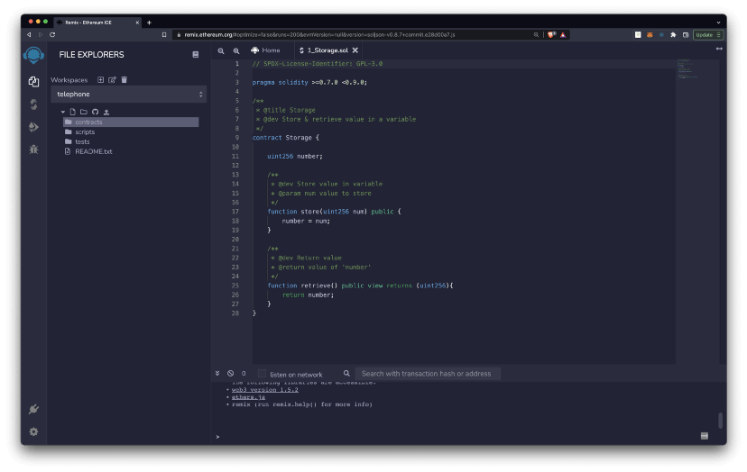
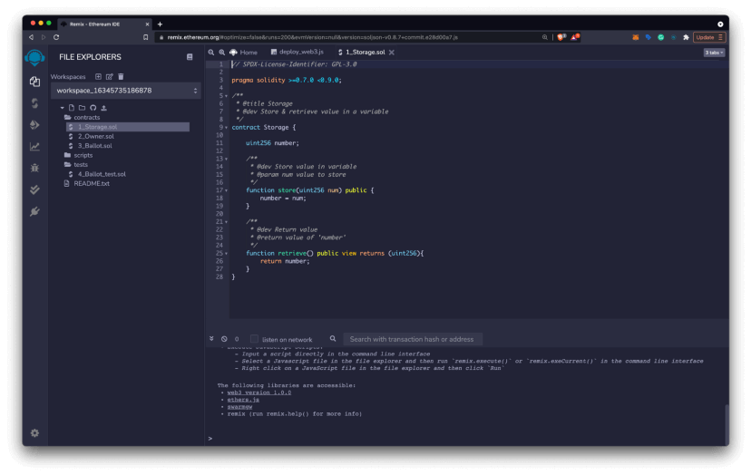
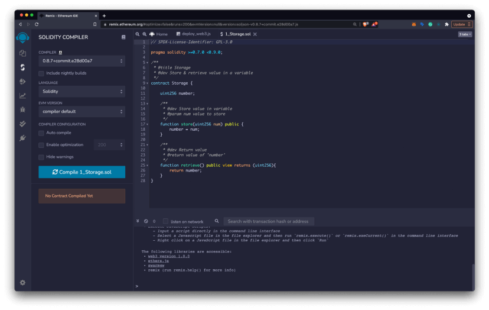
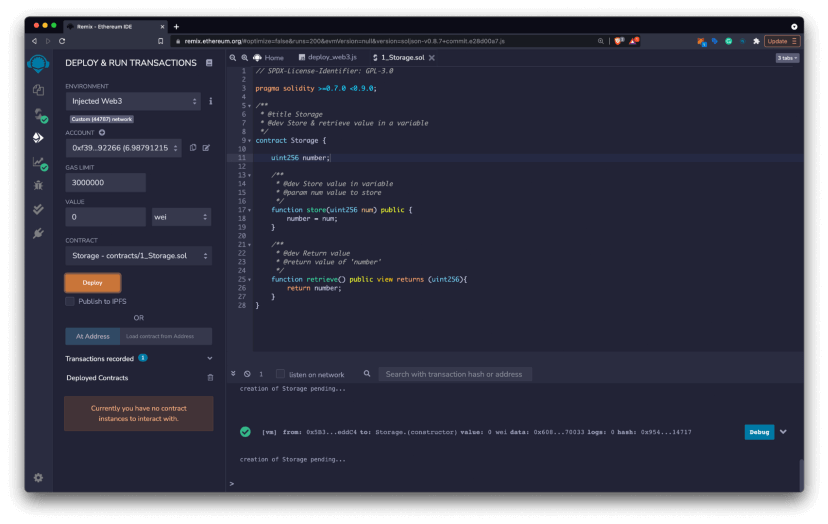
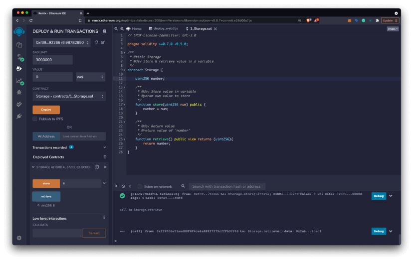
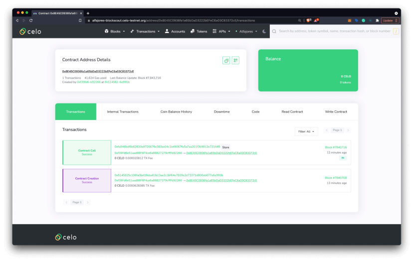
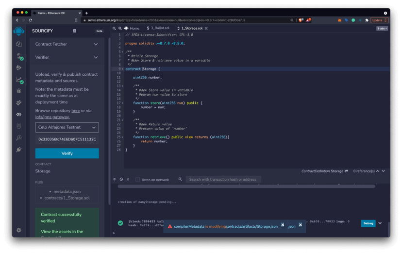

import YouTube from '@components/YouTube';

# 6 Steps to Quickly Build Smart Contracts on Celo with Remix

_How to create, deploy and interact with smart contracts on Celo testnet or mainnet using Remix._

## Hello Developers 🌱

Welcome to today’s post, where we’ll break down a blockchain topic into bite-sized pieces to help you learn and apply your new skills in the real world.

Today’s topic is Deploying on Celo with Remix.

**Here’s a list of what we’ll cover 🗒**

- ✅ Introduction to Remix
- ✅ **Step 1:** Write your smart contract
- ✅ **Step 2:** Compile your contract
- ✅ **Step 3:** Deploy your contract
- ✅ **Step 4:** Interact with your contract
- ✅ **Step 5:** View contract details
- ✅ **Step 6:** Verify your contract on Blockscout

By the end of this post, you’ll be able to create, deploy, and interact with your smart contract on Celo testnet or mainnet.

Let’s go! 🚀

## Introduction to Remix

The [Remix IDE](https://remix-project.org/) is an open-source web and desktop application for creating and deploying Smart Contracts. Originally created for Ethereum, it fosters a fast development cycle and has a rich set of plugins with intuitive GUIs. Remix is used for the entire journey of contract development and is a playground for learning and teaching EVM-compatible blockchains like Celo.

In this guide, you will learn to deploy a smart contract on Celo using [remix.ethereum.org](https://remix-ide.readthedocs.io/en/latest/).

:::tip

To learn more about the features available to you as a smart contract developer with Remix, visit the [Remix documentation](https://remix-ide.readthedocs.io/en/latest/).

:::

## Step 1: Write your smart contract​

The first step when creating a smart contract is to write the smart contract code. If you’re just getting started, you can use one of their default contracts or learn to write your own contracts using the [Solidity docs](https://docs.soliditylang.org/en/latest/) or [Solidity by Example](https://solidity-by-example.org/).

- Navigate to [remix.ethereum.org](http://remix.ethereum.org/) and select `contracts > 1_Storage`.sol from the `File Explorers` pane.
- Make any changes to your smart contract and save the final version using `Command/Ctrl + S`.

## Step 2: Compile your Contract​

Now that you’ve created your smart contract, the next step is to compile it. Compiling translates your smart contract into code the Ethereum Virtual Machine (EVM) understands before deploying it to the network.

- Choose the `Solidity Compiler Icon` on the left side menu.
- Check that your compiler version is within the versions specified in the pragma solidity statement. Example `pragma solidity ≥0.7.0<0.9.0;` and `compiler 0.8.7+commit.e28d00a7`.
- Select `Compile 1_Storage.sol`(or your contract name) to compile your smart contract. If you have any errors, your contract will fail to compile and you can debug using the console and warnings as needed.

## Step 3: Deploy the Contract​

Now that your contract is compiled, you can deploy your smart contract to the network. You can deploy to any Ethereum compatible network, and in this case we’ll be deploying the Celo testnet or mainnnet depending on your preference. If you’re brand new to this stick with testnet!

- Click the `Deploy and Run Transactions` Icon on the left side menu.
- Choose `Injected Web3` as your environment.
- [Connect MetaMask to Celo](https://medium.com/@joenyzio/3-simple-steps-to-connect-your-metamask-wallet-to-celo-732d4a139587) testnet and verify the network.

:::tip Network details

- Custom (44787) network for Celo testnet
- Custom (42220) network for Celo mainnet

:::

- **Note:** If you don’t have Celo setup with MetaMask, you can also choose `JavaScript VM London` as your environment. This will deploy to a local non-Celo environment and is helpful for testing.
- Finally, click `Deploy` and select `Confirm` in the MetaMask notification window to pay for the transaction. You’re creating a transaction because when you deploy a contract you’re writing its code to the blockchain. You’ll need to approve and pay for a transaction anytime you write to the blockchain — like right now!

## Step 4: Interact with your Contract​

If you made it this far, congratulations your contract is live on the Celo network! You can now use the built-in Remix tools to interact with your contract and check out how it works.

- Select the `dropdown` on the newly deployed contract at the bottom of the left panel.
- View the deployed contract’s functions using the `Deployed Contracts window`.
- Select functions to read or write on Celo using the function inputs. These inputs are the same as the functions in your contract code.
- Confirm transactions in the `MetaMask Notification Window` to pay the transaction fee whenever writing to the blockchain. You will not need to pay for functions that read information from the blockchain.

## Step 5: View Contract Details​

All smart contracts deployed on Celo can be viewed on the [Celo Block Explorer](https://explorer.celo.org/) (known as Blockscout). From there you can view contract details, transactions, and all types of other information.

- Copy the contract address from the `Deployed Contracts window` on the left panel in Remix.
- Navigate to [Blockscout](https://explorer.celo.org/) and use the contract address to search for your contract in the top right search bar. Check that you’re on same network as your deployed contract (Celo Mainnet, Alfajores Testnet) using the dropdown to the left of the search bar.
- Learn more about the Block Explorer [here](http://docs.blockscout.com/) and take some time to explore the details of your deployed smart contract.

## Step 6: Verify the Smart Contract​

While you can view a variety of contract details using blockscout, you cannot view the code by default. Verifying your smart contract takes care of this for you and allows anyone to review your code from within the Celo Block Explorer. This can be done using the `Remix Sourcify Plugin`.

- Navigate back to the `Remix IDE`, select `Plugin Manager` from the left side menu.
- Search for `Sourcify`, click `Activate`, and open the newly installed `Sourcify Plugin`.
- Choose `Verifier`, select the dropdown menu, and choose the location for your deployed contract (example: Celo (Alfajores)).
- Paste your contract address into the `Contract Address field` and select Verify.

Navigate to the `Contract Address Details Page` in the block explore to use the `Code`, `Read Contract`, and `Write Contract panels` to view and interact with your deployed smart contract. After your contract is verified you’ll now be able to view the smart contract code from Blockscout. Head back to your contract and check it out!

:::tip Tip for Truffle & Hardhat users

The source code of the contract that you are verifying will need to be in Remix. Contracts deployed with Truffle, Hardhat, and other tools can also be verified using the Remix Sourcify plugin, but you will need to copy your contract source code into Remix first.

:::

## Congratulations 🎉

That wraps up today’s topic on _Deploying on Celo with Remix_. You can review each of the items we covered below and check that you’re ready to apply these new skills.

**Here’s a review of what we covered 🤔**

- ✅ Introduction to Remix
- ✅ **Step 1:** Write your smart contract
- ✅ **Step 2:** Compile your contract
- ✅ **Step 3:** Deploy your contract
- ✅ **Step 4:** Interact with your contract
- ✅ **Step 5:** View contract details
- ✅ **Step 6:** Verify your contract on Blockscout

If you run into any issues, try reviewing the content or searching online to explore each topic in more detail. Hopefully, you’ve learned a few things about _Deploying on Celo with Remix_ that you can apply in the real world.

GN! 👋
