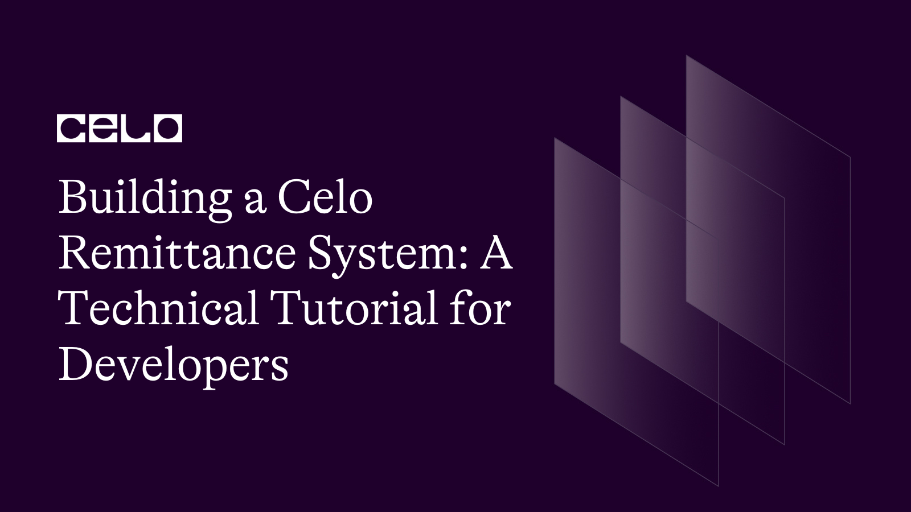
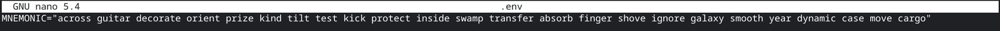
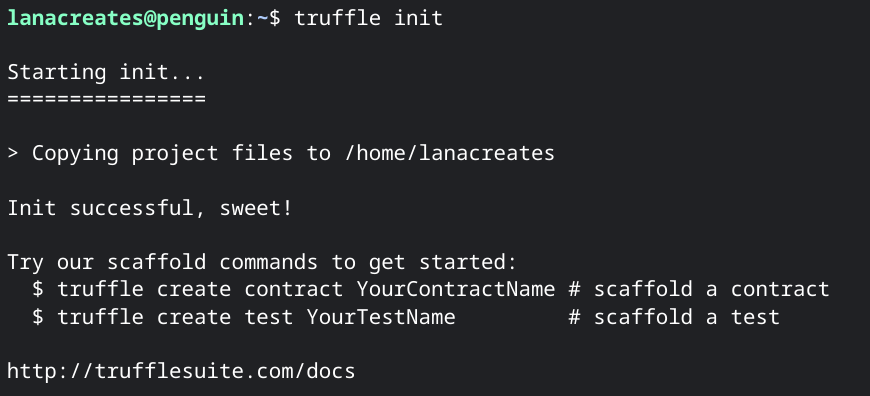
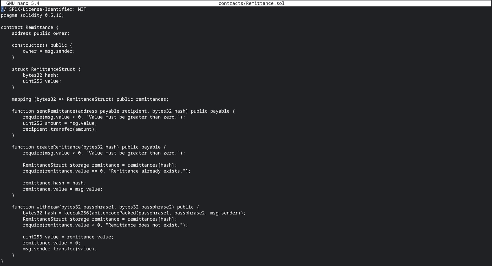
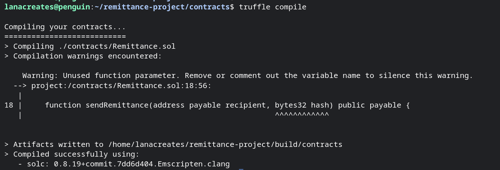

## Introduction

Celo is a blockchain platform, designed to enable a new universe of financial solutions accessible, including remittance systems. In this tutorial, we will explore the technical aspects of building a remittance system on the Celo network. We will cover topics such as Celo's secure messaging protocol, smart contract architecture, and decentralized governance. This tutorial is aimed at developers interested in building remittance systems and those looking to expand their knowledge of Celo's technical capabilities. By the end of this tutorial, you will have learned how to build a basic remittance system on the Celo network using Solidity and Truffle.

## Prerequisites

To get the most out of this tutorial, you should have a solid understanding of Solidity and experience with building smart contracts. Familiarity with Celo's messaging protocol and smart contract architecture is also recommended. You should also have a basic understanding of blockchain concepts and terminology. Additionally, you will need a Celo account and some testnet CELO tokens to interact with the Celo network. Create one [here](https://docs.celo.org/developer/setup/wallet).

## Requirements

Before starting this tutorial, you will need to have the following tools installed:

Celo SDK: This is a set of tools for building and deploying smart contracts on the Celo network. You can install it using npm by running `npm install -g @celo/celocli`.

Truffle: This is a popular development framework for building Ethereum-based applications. You can install it using npm by running `npm install -g truffle`.

You will also need a text editor of your choice and a web3-enabled browser such as Chrome.

Finally, it is recommended that you have some familiarity with using the command line interface. Note the installation of these tools will not be covered in this tutorial.

## Getting Started:

A remittance is money that is sent from one party to another. Broadly speaking, any payment of an invoice or a bill can be called a remittance. However, the term is most often used nowadays to describe a sum of money sent by someone working abroad to their family back home. The term is derived from the word remit, which means to send back.

A remittance system is a type of payment system that allows users to transfer money across borders. It is especially useful for people who work abroad and want to send money back to their families. In this tutorial, we will build a basic remittance system on the Celo network.

The remittance system we will build will consist of two parts: a smart contract and a user interface. The smart contract will handle the actual transfer of funds, while the user interface will allow users to interact with the smart contract.
This tutorial would focus on building the Remittance smart contract.

## Setting up the Development Environment

Before we start building our remittance system, we need to set up our development environment. We assume that you have already installed the necessary tools, as described in the Requirements section of this tutorial.

Create a new directory for your project.
Open a terminal and navigate to the directory you just created.
Run `truffle init` to initialize a new Truffle project.
Create a new file called `.env` in the root directory of your project. This file will contain environment variables for our project. Add the following line to this file:


Replace "your-mnemonic" with your own Celo account's mnemonic. You can find your mnemonic in your Celo account's settings.



This mnemonic is a test, so don't try to copy paste this

## Creating the Smart Contract

The first step in building our remittance system is to create the smart contract. The smart contract will handle the actual transfer of funds between two parties.

Defining the Remittance Contract
Create a new file called ‘Remittance.sol’ in the contracts directory of your project.
Add the following code to this file:

```solidity
/ SPDX-License-Identifier:MIT
pragma solidity 0.5.16;

contract Remittance {
    address public owner;

    constructor() public {
        owner = msg.sender;
    }
```

This code defines a new smart contract called ‘Remittance’. The ‘owner’ variable is set to the address of the contract creator. The `sendRemittance` function is used to send funds to the `recipient` address. The hash parameter is used to ensure that the recipient can only withdraw the funds if they know the correct passphrase.

## Adding the Secure Messaging Protocol

Next, we need to add the secure messaging protocol to our smart contract. The secure messaging protocol allows the recipient to withdraw the funds only if they know the correct passphrase.

Add the following code to the Remittance contract:

```solidity
struct RemittanceStruct {
        bytes32 hash;
        uint256 value;
    }

    mapping (bytes32 => RemittanceStruct) public remittances;

    function sendRemittance(address payable recipient, bytes32 hash) public payable {
        require(msg.value > 0, "Value must be greater than zero.");
        uint256 amount = msg.value;
        recipient.transfer(amount);
    }

    function createRemittance(bytes32 hash) public payable {
        require(msg.value > 0, "Value must be greater than zero.");

        RemittanceStruct storage remittance = remittances[hash];
        require(remittance.value == 0, "Remittance already exists.");

        remittance.hash = hash;
        remittance.value = msg.value;
    }

    function withdraw(bytes32 passphrase1, bytes32 passphrase2) public {
        bytes32 hash = keccak256(abi.encodePacked(passphrase1, passphrase2, msg.sender));
        RemittanceStruct storage remittance = remittances[hash];
        require(remittance.value > 0, "Remittance does not exist.");

        uint256 value = remittance.value;
        remittance.value = 0;
        msg.sender.transfer(value);
    }
}
```

Let's examine what's happening in this added code. When a user creates a remittance, the `createRemittance` function is called, and a new `RemittanceStruct` is created with the provided `hash` and `value`. The value must be greater than `zero`, and the `hash` must not already exist in the `remittances` mapping.

When a recipient wants to withdraw the funds, they must provide two passphrases and call the `withdraw` function. The two passphrases are concatenated with the recipient's address and hashed to generate the `hash` used to identify the `RemittanceStruct`. If the `RemittanceStruct` exists and has a non-zero value, the value is transferred to the recipient's address, and the value in the `RemittanceStruct` is set to zero, preventing anyone else from withdrawing the funds.

The added secure messaging protocol ensures that only the recipient with knowledge of the correct passphrases can withdraw the funds, thereby adding an additional layer of security to our remittance system.

This what your complete smart contract should look like:

```
//SPDX-License-Identifier: MIT
pragma solidity 0.5.16;

contract Remittance {
    address public owner;

    constructor() public {
        owner = msg.sender;
    }
struct RemittanceStruct {
        bytes32 hash;
        uint256 value;
    }

    mapping (bytes32 => RemittanceStruct) public remittances;

    function sendRemittance(address payable recipient, bytes32 hash) public payable {
        require(msg.value > 0, "Value must be greater than zero.");
        uint256 amount = msg.value;
        recipient.transfer(amount);
    }

    function createRemittance(bytes32 hash) public payable {
        require(msg.value > 0, "Value must be greater than zero.");

        RemittanceStruct storage remittance = remittances[hash];
        require(remittance.value == 0, "Remittance already exists.");

        remittance.hash = hash;
        remittance.value = msg.value;
    }

    function withdraw(bytes32 passphrase1, bytes32 passphrase2) public {
        bytes32 hash = keccak256(abi.encodePacked(passphrase1, passphrase2, msg.sender));
        RemittanceStruct storage remittance = remittances[hash];
        require(remittance.value > 0, "Remittance does not exist.");

        uint256 value = remittance.value;
        remittance.value = 0;
        msg.sender.transfer(value);
    }
}
```

## Deploying the Remittance System to the Celo Network

Now that we have created the remittance system contract, it's time to deploy it to the Celo network. We will use Truffle to deploy the smart contract, but before we can deploy the remittance system, we need to ensure that we have the following:

- A Celo wallet with some testnet funds.
- Truffle installed on our computer.
- The Celo SDK installed on our computer.
- `Node.js` installed on our computer.

If you don't have a Celo wallet with testnet funds, you can create one by following the instructions on the [Celo Testnet Faucet](https://celo.org/developers/faucet).

To install Truffle, run the following command:

```bash
npm install -g truffle
```

To install the Celo SDK, run the following command:

```bash
npm install -g @celo/contractkit
```

To install Node.js, visit [here](https://nodejs.org/en/) and download the version for your operating system.

## Creating a Truffle Project

Now that we have all the prerequisites, let's create a Truffle project for our remittance system.

In your terminal, navigate to the directory where you want to create your project and run the following commands:

```bash
mkdir remittance-system
cd remittance-system
truffle init
```



This will create a new Truffle project with the following directory structure:

```bash
remittance-system/
├── contracts/
├── migrations/
├── test/
└── truffle-config.js
```

Now, let's create a new Solidity contract file in the ‘contracts/’ directory and name it `Remittance.sol`. Copy and paste the entire `Remittance` smart contract that we wrote earlier into this file.



## Compiling and Deploying the Smart Contract

Before we can deploy the smart contract, we need to compile it. In your terminal, run the following command:

```bash
truffle compile
```

This will compile the smart contract and generate the necessary artifacts in the build/contracts directory.



The warning message about an unused function parameter can be safely ignored. We can proceed to testing and deploying the contract.

Next, let's configure Truffle to deploy the smart contract to the Celo network. In the `truffle-config.js` file, add the following code:

```solidity
const HDWalletProvider = require('@truffle/hdwallet-provider');
module.exports = {
  networks: {
    local: {
      host: "127.0.0.1",
      port: 7545,
      network_id: "*"
    },
    alfajores: {
      provider: function() {
        return new HDWalletProvider(
          "across guitar decorate orient prize kind tilt test kick protect inside swamp transfer absorb finger shove ignore galaxy smooth year dynamic case move cargo", // Replace with your MNEMONIC
          "https://alfajores-forno.celo-testnet.org"
        )
      },
      network_id: 44787,
      gas: 10000000
    },
    celo: {
      provider: function() {
        return new HDWalletProvider(
          "across guitar decorate orient prize kind tilt test kick protect inside swamp transfer absorb finger shove ignore galaxy smooth year dynamic case move cargo", // Replace with your MNEMONIC
          "https://forno.celo.org"
        )
      },
      network_id: 42220,
      gas: 10000000
    }
  },
  compilers: {
    solc: {
      version: "0.8.7",
      settings: {
        optimizer: {
          enabled: false,
          runs: 200
        },
        evmVersion: "istanbul"
      }
    }
  }
};
```

This code configures Truffle to use the Celo network, specifically the `alfajores-forno` testnet. Replace the URL with the URL of the Celo network you want to use If you are deploying to the Celo mainet.

Now, let's deploy the smart contract to the Celo network. In your terminal, run the following command:

```bash
truffle deploy --network alfajores
```

This would deploy directly to the alfajores network.

You might get an error like this:


The error indicates there are not sufficient funds in the contract address, this address should be funded. You can either fund this address by sending funds to it from the testnet faucet or metamask.

Running the `truffle deploy --network alfajores` command again, will deploy the smart contract to the Celo network, and you should see an output similar to this:


Note the contract address for the deployed Remittance contract. We will need this address to interact with the contract on the Celo network.

With the contract deployed, we can build a React application to interact with our remittance system.

## Conclusion

In this tutorial, we covered how to build and deploy a remittance system on the Celo network using smart contracts and Truffle. By finishing this tutorial, you have gained technical skills and knowledge in:

- Setting up a development environment for Celo blockchain development.
- Writing and deploying smart contracts on the Celo network using Solidity and Truffle.
- Implementing secure messaging protocols to enhance the security of the remittance system. Congratulations on successfully building a remittance system on the Celo network!

## Next Steps

Now that you have completed this tutorial, here are some ideas for continued learning and exploration. You can experiment with different user interfaces for your remittance system, such as building a mobile app or a web-based interface. You can also explore adding more features to the remittance system, such as transaction tracking, user authentication, or automatic conversion to local currencies.

It is strongly recommended that as you build on Celo, you check out Celo's documentation, and join the Celo Developer Discord community to connect with other developers.

## About the Author

Oluwalana is a technical writer and developer with a passion for all things tech and web3. As an analog-by-birth and digital-by-nature individual, Oluwalana leverages his unique perspective to craft compelling stories and thought-provoking content while building web3 projects along the way.

## References

- [Source Code](https://github.com/lanacreates/celo-remittance-system)
- [Investopedia](https://www.investopedia.com/terms/r/remittance.asp)
- [Deploy on Celo with Truffle](https://docs.celo.org/developer/deploy/truffle)
- [Testnet Wallets](https://docs.celo.org/developer/setup/wallet)
- [Fund your Celo Testnet Account](https://faucet.celo.org/)
- [Celo Truffle Configuration](https://github.com/celo-org/DevRel/blob/main/configuration/truffle-config.js)
- [Code Playground - Metamask](https://docs.celo.org/blog/code-metamask)
- [Celo Developers](https://docs.celo.org/developer)
- [Installing the Solidity Compiler](https://docs.soliditylang.org/en/latest/installing-solidity.html)
- [Alfajores Celo Explorer](https://explorer.celo.org/alfajores/)
