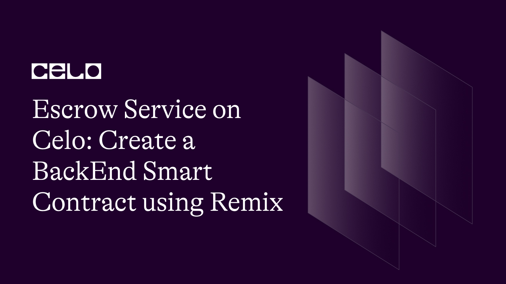

## Prerequisite

- The [Remix IDE](https://remix-project.org/) is an open-source web and desktop application for creating and deploying Smart Contracts. Originally created for Ethereum, it fosters a fast development cycle and has a rich set of plugins with intuitive GUIs. Remix is used for the entire journey of contract development and is a playground for learning and teaching EVM-compatible blockchains like Celo. Before starting this tutorial, see how [Build Smart Contract on Celo with Remix](https://docs.celo.org/blog/tutorials/6-steps-to-quickly-build-smart-contracts-on-celo-with-remix)

## Introduction

The contract allows the buyer and seller to deposit funds into the contract. The contract then holds these funds until the end date specified in the contract. If the buyer or seller fulfills their obligations, they can withdraw the funds after the end date. If neither party fulfills their obligations, either the buyer or the seller can withdraw their deposit.

## Code

Here are the steps to code this contract:

1. Import the required packages
   This contract uses two external libraries: OpenZeppelin's ReentrancyGuard and SafeMath. These libraries provide additional functionality for our smart contract and prevent certain vulnerabilities that can occur while executing smart contracts.

```solidity
// SPDX-License-Identifier: MIT
pragma solidity ^0.8.0;

import "@openzeppelin/contracts/security/ReentrancyGuard.sol";
import "@openzeppelin/contracts/utils/math/SafeMath.sol";

```

2. Define the contract and declare the contract variables

The contract has several variables that you need to declare. Here's a list of them and their types:

- seller: address payable
- buyer: address payable
- feeAddress: address payable
- contractBalance: uint256
- sellerBalance: uint256
- buyerBalance: uint256
- securityDeposit: uint256
- sellerPreAgreementAmount: uint256
- buyerPreAgreementAmount: uint256
- endDate: uint256
- daysForWithdrawal: uint256
- transferFee: uint256
- fee: uint256

Here's how to declare them:

```solidity
contract Escrow is ReentrancyGuard {
  address payable seller;
  address payable buyer;
  address payable feeAddress;

  uint256 public contractBalance;
  uint256 public sellerBalance;
  uint256 public buyerBalance;

  uint256 public securityDeposit;
  uint256 public sellerPreAgreementAmount;
  uint256 public buyerPreAgreementAmount;
  uint256 public endDate;
  uint256 public daysForWithdrawal;

  uint256 transferFee;
  uint256 fee;
}
```

3. Event when funds are deposited

```solidity
event FundsDeposited(address indexed depositor, uint256 amount);

event Deposit(address indexed contractAddress, address indexed from, uint amount);
```

4. Declare the SafeMath
   The code using SafeMath for uint256; is importing the SafeMath library and applying it to the uint256 data type.

In Solidity, the uint256 data type is an unsigned integer that has a range of 0 to 2^256-1. This data type is commonly used for storing and manipulating large numbers, such as those involved in cryptocurrency transactions.

The SafeMath library is a set of functions that provides arithmetic operations for uint256 numbers with added protection against integer overflow and underflow. Integer overflow and underflow are common errors in Solidity where the result of an arithmetic operation exceeds the maximum or minimum value that can be stored in a data type. These errors can lead to unexpected results or even security vulnerabilities in smart contracts.

By using the SafeMath library, developers can avoid these errors and ensure that arithmetic operations involving uint256 numbers are performed safely.

```solidity
    using SafeMath for uint256;
```

5. Create the constructor
   Create the constructor that will initialize the contract with the required parameters: addresses of the seller and buyer, the security deposit, pre-agreement amounts, end date, days for withdrawal, and the fee address

```solidity
constructor(
  address payable _seller,
  address payable _buyer,
  uint256 _securityDeposit,
  uint256 _sellerPreAgreementAmount,
  uint256 _buyerPreAgreementAmount,
  uint256 _endDate,
  uint256 _daysForWithdrawal,
  address _feeAddress
) {
  seller = _seller;
  buyer = _buyer;
  securityDeposit = _securityDeposit;
  sellerPreAgreementAmount = _sellerPreAgreementAmount;
  buyerPreAgreementAmount = _buyerPreAgreementAmount;
  endDate = _endDate;
  daysForWithdrawal = _daysForWithdrawal;
  transferFee = 1;
  feeAddress = payable(_feeAddress);
}
```

6. Create the fallback and receive functions
   The fallback and receive functions allow the contract to accept funds. Here's how to create them:

```solidity
fallback() external payable {
  emit Deposit(address(this), msg.sender, msg.value);
}

receive() external payable {
  emit Deposit(address(this), msg.sender, msg.value);
}
```

7. Create the deposit function
   The deposit function allows either the seller or buyer to deposit funds into the contract. Here's how to create it:

```solidity
function deposit(address _user) external payable {
  require(_user == seller || _user == buyer, "Only the seller or buyer can deposit funds");
  if (_user == seller) {
    sellerBalance += msg.value;
  } else {
    buyerBalance += msg.value;
  }
  contractBalance += msg.value;
  emit FundsDeposited(_user, msg.value);
}
```

8. Withdraw
   Function for the buyer or seller to withdraw the money.

```solidity
function withdraw(address _user) external payable nonReentrant {
        require (address(this).balance != 0, "Contract don't have funds");
        require (block.timestamp < endDate, "Time is not over yet");
        fee = address(this).balance.mul(transferFee).div(100);
          // If the end date has passed but don't have passed enddate + daystowithdraw and the seller have fulfilled his or her obligations, the seller can withdraw the funds
        if (sellerBalance > sellerPreAgreementAmount && block.timestamp > endDate && block.timestamp < endDate + (daysForWithdrawal * 1 days)) {
            require (seller == _user, "You are not the seller");
            seller.transfer(address(this).balance.sub(fee));
            feeAddress.transfer(fee);
        }
        // The buyer didn't withdraw the balance. So he or she backed out of the deal
        else if  (buyerBalance > securityDeposit && block.timestamp > endDate + (daysForWithdrawal * 1 days)) {
            require (buyer == _user, "You are not the buyer");
            buyer.transfer(address(this).balance.sub(fee));
            feeAddress.transfer(fee);
        }
        // The time expired but neither of the two deposited the pre-agreement
        else if (address(this).balance != 0 && sellerBalance < sellerPreAgreementAmount && buyerBalance < buyerPreAgreementAmount && block.timestamp > endDate + (daysForWithdrawal * 1 days)){
                require(_user == buyer || _user == seller, "Just buyer or seller can withdraw");
                if (_user == buyer && buyerBalance != 0){
                    fee = buyerBalance.mul(transferFee).div(100);
                    buyer.transfer(buyerBalance.sub(fee));
                    feeAddress.transfer(fee);
                    buyerBalance = 0;
                }
                else if(_user == seller && sellerBalance != 0) {
                    fee = sellerBalance.mul(transferFee).div(100);
                    seller.transfer(sellerBalance.sub(fee));
                    feeAddress.transfer(fee);
                    sellerBalance = 0;
                }
        }

    }

```

9. Return functions

This smart contract contains a series of functions that allow other contracts or external parties to access specific data stored in the contract. Each function is defined with the public keyword, which means that they can be accessed by anyone on the network. The view keyword indicates that these functions do not modify any data within the contract and simply return data.

Here's a brief explanation of each function:

- returnSeller() - This function returns the address of the seller in the contract.

  ```solidity
  function returnSeller() public view returns(address){
      return seller;
  }
  ```

- returnBuyer() - This function returns the address of the buyer in the contract.

  ```solidity
  function returnBuyer() public view returns(address){
      return buyer;
  }
  ```

- returnSellerBalance() - This function returns the current balance of the seller in the contract.

  ```solidity
  function returnSellerBalance() public view returns(uint){
      return sellerBalance;
  }
  ```

- returnBuyerBalance() - This function returns the current balance of the buyer in the contract.

  ```solidity
  function returnBuyerBalance() public view returns(uint){
      return buyerBalance;
  }
  ```

- returnSecurityDeposit() - This function returns the security deposit amount stored in the contract.

  ```solidity
  function returnSecurityDeposit() public view returns(uint){
      return securityDeposit;
  }
  ```

- returnSellerPreAgreementAmount() - This function returns the amount that the seller had agreed to before the contract was created.

  ```solidity
  function returnSellerPreAgreementAmount() public view returns(uint){
      return sellerPreAgreementAmount;
  }
  ```

- returnBuyerPreAgreementAmount() - This function returns the amount that the buyer had agreed to before the contract was created.

  ```solidity
  function returnBuyerPreAgreementAmount() public view returns(uint){
      return buyerPreAgreementAmount;
  }
  ```

- returnEndDate() - This function returns the end date of the contract.

  ```solidity
  function returnEndDate() public view returns(uint){
      return endDate;
  }
  ```

- returnDaysForWithdrawal() - This function returns the number of days allowed for withdrawal after the contract is created.

  ```solidity
  function returnDaysForWithdrawal() public view returns(uint){
      return daysForWithdrawal;
  }
  ```

## Full Code

You can see the full code below or access it on [github](https://github.com/guizostudios/escrow-servoce-on-celo)

```solidity
// SPDX-License-Identifier: MIT

pragma solidity ^0.8.0;

import "@openzeppelin/contracts/security/ReentrancyGuard.sol";
import "@openzeppelin/contracts/utils/math/SafeMath.sol";

//contract Escrow
contract escrow is ReentrancyGuard {
    // Variables to store the addresses of the seller and buyer
    address payable seller;
    address payable buyer;
    address payable feeAddress;

    // Variable to store the balance of the contract
    uint256 public contractBalance;
    uint256 public sellerBalance;
    uint256 public buyerBalance;

    // Variables to store the security deposit, pre-agreement amounts, end date, and days for withdrawal
    uint256 public securityDeposit;
    uint256 public sellerPreAgreementAmount;
    uint256 public buyerPreAgreementAmount;
    uint256 public endDate;
    uint256 public daysForWithdrawal;

    //Application fee
    uint transferFee;
    uint fee;

    // Event to emit when funds are deposited
    event FundsDeposited(address indexed depositor, uint256 amount);

    // Deposit event
    event Deposit(address indexed contractAddress, address indexed from, uint amount);

    using SafeMath for uint256;

    // Constructor to initialize the contract with the addresses of the seller and buyer, the security deposit, pre-agreement amounts, end date, and days for withdrawal
    constructor(address payable _seller, address payable _buyer, uint256 _securityDeposit, uint256 _sellerPreAgreementAmount, uint256 _buyerPreAgreementAmount, uint256 _endDate, uint256 _daysForWithdrawal, address _feeaddress)  {
        seller = _seller;
        buyer = _buyer;
        securityDeposit = _securityDeposit;
        sellerPreAgreementAmount = _sellerPreAgreementAmount;
        buyerPreAgreementAmount = _buyerPreAgreementAmount;
        endDate = _endDate;
        daysForWithdrawal = _daysForWithdrawal;
        transferFee = 1;
        feeAddress = payable(_feeaddress);
    }

          //Fallback function
    fallback () external payable {
        emit Deposit(address(this), msg.sender, msg.value);
    }

    //Receive function
    receive () external payable {
        emit Deposit(address(this), msg.sender, msg.value);
    }


    // Function to deposit funds to the contract
    function deposit(address _user) external payable {
        require(_user == seller || _user == buyer, "Only the seller or buyer can deposit funds");
        if (_user == seller) {
            sellerBalance += msg.value;
        } else {
            buyerBalance += msg.value;
        }
        contractBalance += msg.value;
        emit FundsDeposited(_user, msg.value);
    }


    // Function for the buyer or seller to withdraw the security deposit

    function withdraw(address _user) external payable nonReentrant {
        require (address(this).balance != 0, "Contract don't have funds");
        require (block.timestamp < endDate, "Time is not over yet");
        fee = address(this).balance.mul(transferFee).div(100);
          // If the end date has passed but don't have passed enddate + daystowithdraw and the seller have fulfilled his or her obligations, the seller can withdraw the funds
        if (sellerBalance > sellerPreAgreementAmount && block.timestamp > endDate && block.timestamp < endDate + (daysForWithdrawal * 1 days)) {
            require (seller == _user, "You are not the seller");
            seller.transfer(address(this).balance.sub(fee));
            feeAddress.transfer(fee);
        }
        // The buyer didn't withdraw the balance. So he or she backed out of the deal
        else if  (buyerBalance > securityDeposit && block.timestamp > endDate + (daysForWithdrawal * 1 days)) {
            require (buyer == _user, "You are not the buyer");
            buyer.transfer(address(this).balance.sub(fee));
            feeAddress.transfer(fee);
        }
        // The time expired but neither of the two deposited the pre-agreement
        else if (address(this).balance != 0 && sellerBalance < sellerPreAgreementAmount && buyerBalance < buyerPreAgreementAmount && block.timestamp > endDate + (daysForWithdrawal * 1 days)){
                require(_user == buyer || _user == seller, "Just buyer or seller can withdraw");
                if (_user == buyer && buyerBalance != 0){
                    fee = buyerBalance.mul(transferFee).div(100);
                    buyer.transfer(buyerBalance.sub(fee));
                    feeAddress.transfer(fee);
                    buyerBalance = 0;
                }
                else if(_user == seller && sellerBalance != 0) {
                    fee = sellerBalance.mul(transferFee).div(100);
                    seller.transfer(sellerBalance.sub(fee));
                    feeAddress.transfer(fee);
                    sellerBalance = 0;
                }
        }

    }


    function returnSeller() public view returns(address){
        return seller;
    }

    function returnBuyer() public view returns(address){
        return buyer;
    }

    function returnSellerBalance() public view returns(uint){
        return sellerBalance;
    }

    function returnBuyerBalance() public view returns(uint){
        return buyerBalance;
    }


    function returnSecurityDeposit() public view returns(uint){
        return securityDeposit;
    }

    function returnSellerPreAgreementAmount() public view returns(uint){
        return sellerPreAgreementAmount;
    }

    function returnBuyerPreAgreementAmount() public view returns(uint){
        return buyerPreAgreementAmount;
    }

    function returnEndDate() public view returns(uint){
        return endDate;
    }

    function returnDaysForWithdrawal() public view returns(uint){
        return daysForWithdrawal;
    }

}
```

## Next step

As the next steps, I suggest you consult other Celo tutorials using Remix [here](https://docs.celo.org/tutorials?tags=remix).

## About the author

I am a serial entrepreneur, founder of Guizo Studios, and always available to help the Celo ecosystem.

[LinkedIn](https://www.linkedin.com/in/ewertonlopes/)
