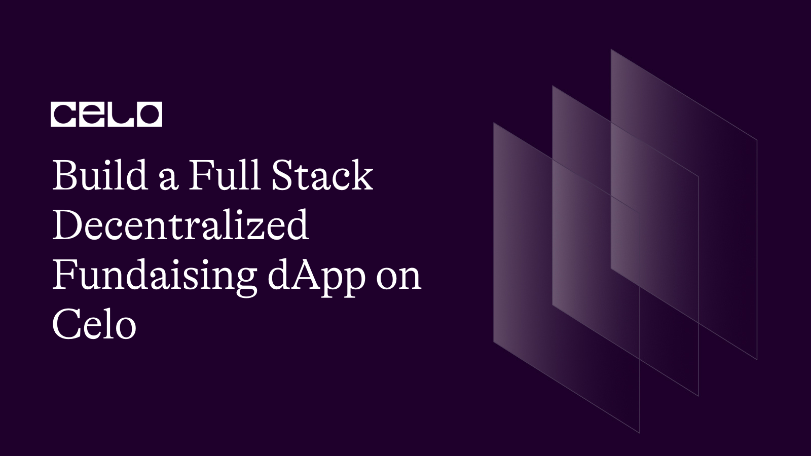
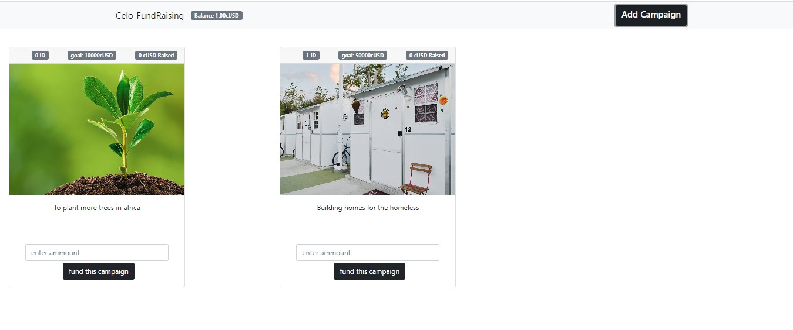

## Introduction

In this tutorial, we will be exploring a Solidity smart contract that allows users to create fundraising campaigns and receive donations in cUSD token. The contract will have two main functions: `createCampaign` and `fundCampaign`. With the `createCampaign` function, a user can create a new fundraising campaign by providing the campaign details, including the beneficiary's address and the campaign's goal. The `fundCampaign` function allows users to fund an existing campaign by sending cUSD tokens to the campaign's beneficiary address.

We will explain the code in detail, including the `Campaign` struct, the mapping used to store the campaigns, and the events emitted during the contract's execution. By the end of this tutorial, you will have a good understanding of how to create a fundraising smart contract in Solidity. So let's get started!

Here’s a demo [link](https://grand-chaja-78fe41.netlify.app) of what you’ll be creating.

And a screenshot.


## Prerequisites

To fully follow up with these tutorials, you should have a basic understanding of the following technologies.

Solidity, smart-contract and blockchain concepts.
React.
Basic web Development.

## Requirements

- Solidity.
- React.
- Bootstrap.
- NodeJS 12.0.1 upwards installed.
- Celo Extension Wallet.
- Remix IDE

## SmartContract

Let's begin writing our smart contract in Remix IDE

The completed code Should look like this.

```solidity
// SPDX-License-Identifier: MIT
pragma solidity ^0.8.0;

interface IERC20Token {
    function transfer(address, uint256) external returns (bool);
    function approve(address, uint256) external returns (bool);
    function transferFrom(address, address, uint256) external returns (bool);
    function totalSupply() external view returns (uint256);
    function balanceOf(address) external view returns (uint256);
    function allowance(address, address) external view returns (uint256);

    event Transfer(address indexed from, address indexed to, uint256 value);
    event Approval(address indexed owner, address indexed spender, uint256 value);
}

contract Fundraising {

    address internal cUsdTokenAddress = 0x874069Fa1Eb16D44d622F2e0Ca25eeA172369bC1;
    uint internal totalCampaigns = 0;

    struct Campaign {
        string image;
        string description;
        address beneficiary;
        uint totalRaised;
        uint goal;
    }

    mapping(uint => Campaign) public campaigns;

    event CampaignCreated(address indexed beneficiary, uint goal);
    event CampaignFunded(address indexed beneficiary, uint amount);
    event CampaignGoalReached(address indexed beneficiary);

    function createCampaign(
        string memory _image,
        string memory _description,
        address _beneficiary,
        uint _goal
        ) public {
        require(msg.sender == _beneficiary);

        Campaign storage campaign = campaigns[totalCampaigns];
        campaign.image = _image;
        campaign.description = _description;
        campaign.beneficiary = _beneficiary;
        campaign.totalRaised = 0;
        campaign.goal = _goal;
        totalCampaigns ++;

        emit CampaignCreated(_beneficiary, _goal);
    }

    function fundCampaign(uint _campaignId, uint _amount) public payable {
        Campaign storage campaign = campaigns[_campaignId];

        require(msg.sender != campaign.beneficiary);
        require(campaign.totalRaised < campaign.goal, "Campaign goal reached");

        campaign.totalRaised += _amount;

         require(
            IERC20Token(cUsdTokenAddress).transferFrom(
                msg.sender,
                campaign.beneficiary,
                _amount
            ),
            "Transfer failed."
        );


        emit CampaignFunded(campaign.beneficiary, _amount);

        if (campaign.totalRaised >= campaign.goal) {
            emit CampaignGoalReached(campaign.beneficiary);
        }
    }

    function getCampaign(uint256 _campaignId)
        public
        view
        returns (
            string memory,
            string memory,
            address,
            uint,
            uint
        )
    {
         Campaign storage campaign = campaigns[_campaignId];
        return (
            campaign.image,
            campaign.description,
            campaign.beneficiary,
            campaign.totalRaised,
            campaign.goal
        );
    }

     function getCampaignLength() public view returns (uint256){
         return (totalCampaigns);
     }
}
```

### Break down

First, we declared our license and the solidity version.

```solidity
// SPDX-License-Identifier: MIT
pragma solidity ^0.8.0;
```

Next, let's declare our cUSD ERC20 token interface.

```solidity
interface IERC20Token {
  function transfer(address, uint256) external returns (bool);
  function approve(address, uint256) external returns (bool);
  function transferFrom(address, address, uint256) external returns (bool);
  function totalSupply() external view returns (uint256);
  function balanceOf(address) external view returns (uint256);
  function allowance(address, address) external view returns (uint256);

  event Transfer(address indexed from, address indexed to, uint256 value);
  event Approval(address indexed owner, address indexed spender, uint256 value);
}
```

The `IERC20Token` interface provides functions to transfer tokens, approve tokens, and view the total supply and balance of tokens. To create the interface, we need to define each of the required functions:

`transfer` – This function is used to transfer tokens from one address to another. It takes two parameters: the address to send the tokens to and the amount of tokens to send.

`approve` – This function is used to approve another address to transfer tokens from the sender's account. It takes two parameters: the address to approve and the amount of tokens to approve.

`transferFrom` – This function is used to transfer tokens from one address to another. It takes three parameters: the address to transfer tokens from, the address to transfer tokens to, and the amount of tokens to transfer.

`totalSupply` – This function is used to view the total number of tokens in circulation. It takes no parameters and returns a uint256 value.

`balanceOf` – This function is used to view the balance of tokens for a given address. It takes one parameter: the address to check the balance for. It returns a uint256 value.

`allowance` – This function is used to view the approved allowance for a given address. It takes two parameters: the owner address and the spender address. It returns a uint256 value.

`Transfer` and `Approval` events – These events are used to emit Transfer and Approval events when tokens are transferred or approved.

Now let's start building our fundraising smart contract

```solidity
contract Fundraising {

    address internal cUsdTokenAddress = 0x874069Fa1Eb16D44d622F2e0Ca25eeA172369bC1;
    uint internal totalCampaigns = 0;

    struct Campaign {
        string image;
        string description;
        address beneficiary;
        uint totalRaised;
        uint goal;
    }

    mapping(uint => Campaign) public campaigns;

    event CampaignCreated(address indexed beneficiary, uint goal);
    event CampaignFunded(address indexed beneficiary, uint amount);
    event CampaignGoalReached(address indexed beneficiary);
}
```

The `cUsdTokenAddress` is the address of the `ERC-20` token contract that is used to accept donations. The `totalCampaigns` variable is used to keep track of the total number of campaigns that have been created.

Next we declare a struct called `Campaign` which is used to store information about each campaign. It contains the image and description of the campaign, the address of the beneficiary, the total amount raised so far, and the goal amount that needs to be raised.

Then we added the campaigns mapping which is used to store the `Campaign` struct for each campaign.

The `CampaignCreated`, `CampaignFunded`, and `CampaignGoalReached` events are used to notify external applications when a campaign is created, funded, or when its goal is reached.

Let's take a look at the `createCampaign` function.

```solidity
function createCampaign(
        string memory _image,
        string memory _description,
        address _beneficiary, uint _goal
        ) public {
        require(msg.sender == _beneficiary);

        Campaign storage campaign = campaigns[totalCampaigns];
        campaign.image = _image;
        campaign.description = _description;
        campaign.beneficiary = _beneficiary;
        campaign.totalRaised = 0;
        campaign.goal = _goal;
        totalCampaigns ++;

        emit CampaignCreated(_beneficiary, _goal);
    }
```

The `createCampaign` function takes four parameters: `image`, `description`, `beneficiary`, and `goal`. These parameters define the fundraising campaign's details. The function first verifies that the caller is the beneficiary and then creates a new Campaign struct to store the campaign details. The function also emits a `CampaignCreated` event with the beneficiary address and the campaign's goal.

Next is the `fundCampaign` function.

```solidity
function fundCampaign(uint _campaignId, uint _amount) public payable {
        Campaign storage campaign = campaigns[_campaignId];

        require(msg.sender != campaign.beneficiary);
        require(campaign.totalRaised < campaign.goal, "Campaign goal reached");

        campaign.totalRaised += _amount;

         require(
            IERC20Token(cUsdTokenAddress).transferFrom(
                msg.sender,
                campaign.beneficiary,
                _amount
            ),
            "Transfer failed."
        );

        emit CampaignFunded(campaign.beneficiary, _amount);

        if (campaign.totalRaised >= campaign.goal) {
            emit CampaignGoalReached(campaign.beneficiary);
        }
    }
```

The `fundCampaign` function is used to fund an existing campaign. It takes two parameters: `campaignId` and `amount`. The function first gets the campaign details using the `campaignId` parameter. It then verifies that the caller is not the beneficiary and that the campaign has not reached its goal. If these conditions are met, the function adds the amount to the campaign's `totalRaised` variable and transfers the amount of cUSD tokens from the caller to the campaign beneficiary. The function then emits a `CampaignFunded` event with the beneficiary address and the funded amount.

If the campaign's `totalRaised` variable is greater than or equal to the campaign's `goal` after the funding, the function emits a `CampaignGoalReached` event with the beneficiary address.

Next up is the `getCampain` function

```solidity
 function getCampaign(uint256 _campaignId)
        public
        view
        returns (
            string memory,
            string memory,
            address,
            uint,
            uint
        )
    {
         Campaign storage campaign = campaigns[_campaignId];
        return (
            campaign.image,
            campaign.description,
            campaign.beneficiary,
            campaign.totalRaised,
            campaign.goal
        );
    }
```

The `getCampaign` function is used to get the details of a campaign using the `campaignId` parameter. It returns a tuple with the campaign's `image`, `description`, `beneficiary` address, `totalRaised`, and `goal`.

And finally the `getCampaignLength` function

```solidity
 function getCampaignLength() public view returns (uint256){
         return (totalCampaigns);
     }
```

The `getCampaignLength` function returns the total number of campaigns created so far by returning the current value of the `totalCampaigns` variable.

## Deployment

To deploy our smart contract successfully, we need the celo extention wallet which can be downloaded from [here](https://chrome.google.com/webstore/detail/celoextensionwallet/kkilomkmpmkbdnfelcpgckmpcaemjcdh?hl=en)

Next, we need to fund our newly created wallet which can done using the celo alfojares faucet [Here](https://celo.org/developers/faucet)

You can now fund your wallet and deploy your contract using the celo plugin in remix.

### Frontend

Click on [this](https://github.com/4undRaiser/celo-fundraising-dapp) repo from your github.

- Clone the repo to your computer.
- open the project from from vscode.
- Run `npm install` command to install all the dependencies required to run the app locally.

#### App.js

The completed code should look like this.

```javascript
import "./App.css";
import Home from "./components/home";
import { Campaigns } from "./components/Campaigns";
import { useState, useEffect, useCallback } from "react";
import Web3 from "web3";
import { newKitFromWeb3 } from "@celo/contractkit";
import fundraising from "./contracts/fundraising.abi.json";
import IERC from "./contracts/IERC.abi.json";

const ERC20_DECIMALS = 18;
const contractAddress = "0xadB1C74ce3b79344D3587BB2BC8530d95cDEEAa2";
const cUSDContractAddress = "0x874069Fa1Eb16D44d622F2e0Ca25eeA172369bC1";

function App() {
  const [contract, setcontract] = useState(null);
  const [address, setAddress] = useState(null);
  const [kit, setKit] = useState(null);
  const [cUSDBalance, setcUSDBalance] = useState(0);
  const [campaigns, setCampaigns] = useState([]);

  const connectToWallet = async () => {
    if (window.celo) {
      try {
        await window.celo.enable();
        const web3 = new Web3(window.celo);
        let kit = newKitFromWeb3(web3);

        const accounts = await kit.web3.eth.getAccounts();
        const user_address = accounts[0];
        kit.defaultAccount = user_address;

        await setAddress(user_address);
        await setKit(kit);
      } catch (error) {
        console.log(error);
      }
    } else {
      alert("Error Occurred");
    }
  };

  const getBalance = useCallback(async () => {
    try {
      const balance = await kit.getTotalBalance(address);
      const USDBalance = balance.cUSD.shiftedBy(-ERC20_DECIMALS).toFixed(2);

      const contract = new kit.web3.eth.Contract(fundraising, contractAddress);
      setcontract(contract);
      setcUSDBalance(USDBalance);
    } catch (error) {
      console.log(error);
    }
  }, [address, kit]);

  const getCampaigns = useCallback(async () => {
    const campaignsLength = await contract.methods.getCampaignLength().call();
    const campaigns = [];
    for (let index = 0; index < campaignsLength; index++) {
      let _campaigns = new Promise(async (resolve, reject) => {
        let campaign = await contract.methods.getCampaign(index).call();

        resolve({
          index: index,
          image: campaign[0],
          description: campaign[1],
          beneficiary: campaign[2],
          totalRaised: campaign[3],
          goal: campaign[4],
        });
      });
      campaigns.push(_campaigns);
    }

    const _campaigns = await Promise.all(campaigns);
    setCampaigns(_campaigns);
  }, [contract]);

  const addCampaign = async (_image, _description, _beneficiary, _goal) => {
    try {
      await contract.methods
        .createCampaign(_image, _description, _beneficiary, _goal)
        .send({ from: address });
      getCampaigns();
    } catch (error) {
      alert(error);
    }
  };

  const fundCampaign = async (_index, _ammount) => {
    try {
      const cUSDContract = new kit.web3.eth.Contract(IERC, cUSDContractAddress);

      await cUSDContract.methods
        .approve(contractAddress, _ammount)
        .send({ from: address });
      await contract.methods
        .fundCampaign(_index, _ammount)
        .send({ from: address });
      getCampaigns();
      getBalance();
      alert("you have successfully sent cusd to this user");
    } catch (error) {
      alert(error);
    }
  };

  useEffect(() => {
    connectToWallet();
  }, []);

  useEffect(() => {
    if (kit && address) {
      getBalance();
    }
  }, [kit, address, getBalance]);

  useEffect(() => {
    if (contract) {
      getCampaigns();
    }
  }, [contract, getCampaigns]);

  return (
    <div className="App">
      <Home cUSDBalance={cUSDBalance} addCampaign={addCampaign} />
      <Campaigns
        campaigns={campaigns}
        fundCampaign={fundCampaign}
        walletAddress={address}
      />
    </div>
  );
}

export default App;
```

### Break down

Let's break down the `App.js` file.

```javascript
import "./App.css";
import Home from "./components/home";
import { Campaigns } from "./components/Campaigns";
import { useState, useEffect, useCallback } from "react";
import Web3 from "web3";
import { newKitFromWeb3 } from "@celo/contractkit";
import fundraising from "./contracts/fundraising.abi.json";
import IERC from "./contracts/IERC.abi.json";

const ERC20_DECIMALS = 18;
const contractAddress = "0xadB1C74ce3b79344D3587BB2BC8530d95cDEEAa2";
const cUSDContractAddress = "0x874069Fa1Eb16D44d622F2e0Ca25eeA172369bC1";
```

In the first few lines, the necessary dependencies and contracts are imported. Here, we are importing the `Home` and `Campaigns` components, React hooks, the `Web3` library, the `ContractKit` library, and the ABIs of the smart contracts.

The `ERC20_DECIMALS`, `contractAddress`, and `cUSDContractAddress` are constants that represent the number of decimal places for the `ERC20` token, the address of the fundraising smart contract, and the address of the cUSD `ERC20` token contract on the Celo Blockchain.

```javascript
function App() {
  const [contract, setcontract] = useState(null);
  const [address, setAddress] = useState(null);
  const [kit, setKit] = useState(null);
  const [cUSDBalance, setcUSDBalance] = useState(0);
  const [campaigns, setCampaigns] = useState([]);
```

Next, we define a functional component called `App`. This component holds the state variables of the contract instance, the wallet address, the ContractKit instance, the cUSD balance, and the campaigns.

```javascript
const connectToWallet = async () => {
  if (window.celo) {
    try {
      await window.celo.enable();
      const web3 = new Web3(window.celo);
      let kit = newKitFromWeb3(web3);

      const accounts = await kit.web3.eth.getAccounts();
      const user_address = accounts[0];
      kit.defaultAccount = user_address;

      await setAddress(user_address);
      await setKit(kit);
    } catch (error) {
      console.log(error);
    }
  } else {
    alert("Error Occurred");
  }
};
```

The `connectToWallet` function enables the user's wallet on the Celo network and sets the kit instance and user's address as the default account for the `ContractKit` instance.

```javascript
const getBalance = useCallback(async () => {
  try {
    const balance = await kit.getTotalBalance(address);
    const USDBalance = balance.cUSD.shiftedBy(-ERC20_DECIMALS).toFixed(2);

    const contract = new kit.web3.eth.Contract(fundraising, contractAddress);
    setcontract(contract);
    setcUSDBalance(USDBalance);
  } catch (error) {
    console.log(error);
  }
}, [address, kit]);
```

The `getBalance` function uses the `ContractKit` instance to get the user's total balance, converts it to the cUSD balance, and sets the `contract` and `cUSDBalance` state variables.

```javascript
const getCampaigns = useCallback(async () => {
  const campaignsLength = await contract.methods.getCampaignLength().call();
  const campaigns = [];
  for (let index = 0; index < campaignsLength; index++) {
    let _campaigns = new Promise(async (resolve, reject) => {
      let campaign = await contract.methods.getCampaign(index).call();

      resolve({
        index: index,
        image: campaign[0],
        description: campaign[1],
        beneficiary: campaign[2],
        totalRaised: campaign[3],
        goal: campaign[4],
      });
    });
    campaigns.push(_campaigns);
  }

  const _campaigns = await Promise.all(campaigns);
  setCampaigns(_campaigns);
}, [contract]);
```

Next, we have the `getCampaigns` function which uses the `contract` object to retrieve a list of `campaigns`. It does this by calling the `getCampaignLength` method of the contract to get the number of `campaigns` and then iterating through them to get their details using the `getCampaign` method. The details are then added to an array and returned as a promise. Once all promises are resolved using Promise.all, the campaigns are set using `setCampaigns`.

```javascript
const addCampaign = async (_image, _description, _beneficiary, _goal) => {
  try {
    await contract.methods
      .createCampaign(_image, _description, _beneficiary, _goal)
      .send({ from: address });
    getCampaigns();
  } catch (error) {
    alert(error);
  }
};
```

After that, we have the `addCampaign` function, which takes in the required parameters to create a new campaign and sends a transaction using the `createCampaign` method of the contract object. It then calls the `getCampaigns` function to update the list of campaigns.

```javascript
const fundCampaign = async (_index, _ammount) => {
  try {
    const cUSDContract = new kit.web3.eth.Contract(IERC, cUSDContractAddress);

    await cUSDContract.methods
      .approve(contractAddress, _ammount)
      .send({ from: address });
    await contract.methods
      .fundCampaign(_index, _ammount)
      .send({ from: address });
    getCampaigns();
    getBalance();
    alert("you have successfully sent cusd to this user");
  } catch (error) {
    alert(error);
  }
};
```

Lastly, we have the `fundCampaign` function which takes in the index of the campaign and the amount of cUSD to be sent. It first approves the contract to spend the specified amount of cUSD using the approve method of the `cUSDContract` object. It then sends a transaction to the contract to fund the `campaign` using the `fundCampaign` method. Finally, it calls the `getCampaigns` and `getBalance` functions to update the list of `campaigns` and the user's `cUSD` balance.

```javascript
useEffect(() => {
  connectToWallet();
}, []);

useEffect(() => {
  if (kit && address) {
    getBalance();
  }
}, [kit, address, getBalance]);

useEffect(() => {
  if (contract) {
    getCampaigns();
  }
}, [contract, getCampaigns]);
```

We use useEffect to call the connectToWallet, getBalance, and getCampaigns functions at the appropriate times.

```javascript
return (
    <div className="App">
      <Home cUSDBalance={cUSDBalance} addCampaign={addCampaign} />
      <Campaigns
        campaigns={campaigns}
        fundCampaign={fundCampaign}
        walletAddress={address}
      />
    </div>
  );
}

export default App;

```

And finally, we render the App component and return the Home and Campaigns components with the necessary props.

## Next Steps

I hope you learned a lot from this tutorial. Here are some relevant links that would aid your learning further.

- [Celo docs](https://docs.celo.org/)
- [Solidity Docs](https://docs.soliditylang.org/en/v0.8.17/)

## About the author

I'm Jonathan Iheme, A full stack block-chain Developer from Nigeria. let's connect on [linkedIn](https://www.linkedin.com/in/jonathan-iheme-31a63718b)

Thank You!!
