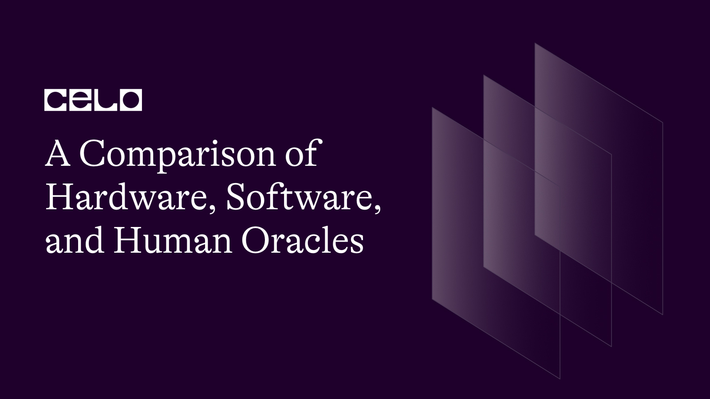

## Introduction

The increasing adoption and application of blockchain in different areas of our lives draw attention to specific unexplored or underexplored tools compatible with blockchain technology. An example of these tools is Oracles, also known as middleware.

Divided into three types based on what they do and how they work, these oracles bring several possibilities into the blockchain space and the Celo ecosystem. And to maximize these possibilities, blockchain developers and enthusiasts must first understand these oracles, their types, uniqueness, and functions, as well as existing and other possible real-life applications. These areas are the focus of this article. Dive in!

## Prerequisites

Understanding the following concepts helps you grasp the knowledge in this tutorial:

- [Blockchain technology](https://docs.celo.org/blog/tutorials/potential-growth-of-blockchain-and-its-use-cases#what-is-blockchain)
- [Internet of Things (IoT)](https://aws.amazon.com/what-is/iot/#:~:text=The%20term%20IoT%2C%20or%20Internet,as%20between%20the%20devices%20themselves.)
- [Regenerative Finance (ReFi)](https://docs.celo.org/blog/tutorials/regenerative-finance-and-celo-the-process-and-partnership#regenerative-finance-and-celo-the-process-and-partnership)
- [The Celo Ecosystem](https://docs.celo.org/learn/celo-ecosystem#:~:text=CELO%20is%20a%20platform%2Dnative,circulate%20and%20transact%20on%20Celo.)

## Basic Questions to Answer

### What are Blockchain Oracles?

Blockchain oracles, also known as blockchain middleware, are tools that serve as links between blockchains and external (off-chain) third-party clients and services. They provide a channel for interactions between blockchain applications and external data sources.

For instance, smart contracts, especially hybrid versions (smart contracts that use oracle), employ Decentralized Oracle Networks (DONs) to check, verify and validate resources from external services for the appropriate execution of the terms in such smart contracts.

### Why Do Blockchains Need Oracles?

The design of blockchains does not provide them with data. Hence, they often need accurate and validated data from external sources to function. And with the different oracle decision models Decentralized Oracle Networks (DONs) utilize, they can compute and analyze data from several sources to guarantee a high degree of data accuracy with zero points of failure.

Also, blockchain oracles provide interoperability solutions needed in the blockchain space. These solutions are possible as oracles like Chainlink and Band Protocol function on multiple blockchain networks, including the Celo blockchain.

### How Do Oracles Work?

Oracles use tools like SDKs, IoT sensors, APIs, drones, and other sources to collect data. Oracles then send this data as a signed message on the blockchain. Also, smart contracts can either access the data provided by the oracle for execution or store the data in smart contract storage for accessibility.

### What are the Types of Oracle?

All blockchain oracles have the same goal, which is to bridge the information gap between on-chain and off-chain sources securely. But, even with the same goals, not all oracles work through the same process. Here are six ways to distinguish blockchain oracles based on their methods:

1. **Inbound and Outbound Oracles**: This classification of oracles refers to the direction of the oracle's data flow. With inbound oracles, data comes into the blockchain, while outbound oracles take data to an external source from the blockchain. Presently, there are more inbound oracles than outbound ones.

2. **Hardware and Software Oracles**: The hardware versus software category relates to the source of the oracle’s data. Hardware oracles depend on information from physical devices (for example, IoT sensors), while software oracles get data from the web (for example, APIs from exchanges).

3. **Centralized and Decentralized Oracles**: Centralized oracles depend on a single centralized trusted source for their data feeds and require smart contract users to place extra trust in the oracle provider. On the other hand, decentralized oracles provide data feeds to blockchains without a centralized source. Instead, they employ token incentives, consensus mechanisms, and multiple node operators. A popular example of decentralized oracles is Chainlink.

4. **Compute-enabled Oracles**: These oracles handle complicated computations that are not possible on-chain due to restrictions like cost and block constraints. They perform such computations off-chain (mostly verifying its correctness) and relay the outcome on-chain for use.

5. **Human Oracles**: Here, humans provide blockchain oracles to data feeds. This process could involve meteorologists, for instance, inputting weather prediction data into a smart contract. Human oracles often employ an advanced verification system to verify the sender's identity.

6. **Contract-specific Oracles**: These are one-time oracles with their use case completed once the parameters of their specific smart contract get fulfilled.

For this article, we will pay close attention to hardware, software, and human oracles. How do they work? What sets them apart from each other? Are there existing use cases? What are the existing or possible applications of each oracle type on the Celo blockchain? Keep reading to find out!

## Hardware Oracles

Hardware oracles create a link to the real world for data sourcing and verification using an interface. What this means is that these hardware oracles provide smart contracts with a connection to the real world when these smart contracts need to relay information from barcode scanners, electronic sensors, and so on.

They efficiently convert real-world information to digital values by connecting to hardware and computer peripherals like IoT sensors and RFID tags to retrieve data for use on the blockchain. A major advantage of using this kind of oracle is that they are harder to compromise.

General use cases of hardware oracles include determining carbon pricing, supply chain management, geolocation for delivery services, weather data provision, etc.

## Software Oracles

Software oracles connect to the Internet and take information from online sources before sending such data to the blockchain. Their sources and tools include databases, web scrapers, APIs, servers, and several other sources.

They are the most widely used of all types of oracles due to their versatility. This type of oracle helps in providing supply chain information to smart contracts in real-time, obtaining, verifying, and updating digital asset prices, providing real-time traffic information, etc.

An application of software oracles on the Celo blockchain is presently in the stability protocol. Find more details below. Also, Witnet, Band Protocol, Celo Reserve Oracles, and RedStone Oracles are examples of software oracles on the Celo blockchain.

## Human Oracles

Even in blockchain, especially ReFi blockchain ecosystems like Celo, individuals with specialized knowledge in a particular field can act as oracles. These human oracles help by conducting research, collecting information, and verifying the authenticity of data (existing ones and the ones they collect) before it gets translated and utilized by any smart contract.

Thanks to the use of cryptography in human oracles, the humans involved can verify their identity, reducing the chances of a fraudster impersonating them and inputting tampered data into the smart contract.

Existing examples of human oracle applications on the Celo blockchain are the [Pyth Network](https://pythnetwork.mypinata.cloud/ipfs/QmZyXccxUfhHjqHevkhWXKw5zWcnFj3NY4JvnrXbkeAEhw) and [the Human Protocol](https://www.humanprotocol.org/blog/how-human-is-used-as-a-defi-oracle) (leverages the Pyth Network).

## Importance of Oracles on the Celo Blockchain

The Celo blockchain utilizes these oracles in certain core areas of the Celo ReFi ecosystem. There are more existing and potential applications of these oracles on Celo. But, the most important applications present below are primary.

1. Stability Protocol for Celo Tokens

Software oracles on the Celo blockchain enable Celo Dollars to track the US dollar price. Each of these software oracles, at regular intervals, gathers aggregate price data from exchanges, considering the exchange volume and the bid/ask spread of the order book. Each of them then optionally updates its on-chain price report to reflect any change in the price. Overall, the stability protocol applies the median value of the aggregate Oracle reports to decide the on-chain exchange rate for Celo Dollars and the CELO token.

2. Interacting with Smart Contracts, DApps, and DEXes on Celo

On Celo, oracles connect the off-chain world and smart contracts used by [DApps on the Celo ecosystem](https://docs.celo.org/showcase). Below are some categories of data provided by these oracles for decentralized applications:

- Time and interval data based on exact time measurements needed to trigger on-chain events.
- Pricing bundles of tokenized assets like waste and carbon emissions from the capital markets for validation and reward systems and the operation of DEXes on Celo.
- Benchmark reference data like interest rates needed for smart financial derivatives.
- Weather data needed to calculate insurance premiums and for weather forecasts.
- Geolocation data as required for seamless supply chain tracking.
- Damage verification required for executing insurance contracts

## Conclusion

[Existing oracle services on Celo](https://docs.celo.org/protocol/oracle) portray this blockchain as a good leveraging point for developers hoping to use any Oracle in whatever product they build on the Celo blockchain. Yet, there are still several potentials, as highlighted in this article, to leverage on the Celo blockchain.

## Next Steps

From now on, developers on the Celo blockchain looking to build can leverage this opportunity provided by Celo. [This tutorial](https://docs.celo.org/protocol/oracle/run) will come in handy once you are ready.

## About the Author

Boyejo Oluwafemi is a hardware product developer working at the intersection of hardware and blockchain technology. He’s working to leverage his wealth of experience working on several products ranging from smart health devices to sporting gadgets to deliver smart payment solutions for crypto for a more inclusive future.

## References

- [Oracles on Celo](https://docs.celo.org/protocol/oracle)
- [DApps on Celo](https://docs.celo.org/showcase)
- [“What are Blockchain Oracles?” LogRocket](https://blog.logrocket.com/what-are-blockchain-oracles/#how-blockchain-oracles-work)
- [“Blockchain Oracles: Know about the Fundamentals.” 101Blockchains](https://101blockchains.com/blockchain-oracles/#:~:text=Hardware%20oracles%20are%20oracles%20that,do%20it%20with%20hardware%20oracle.https://101blockchains.com/blockchain-oracles/#:~:text=Hardware%20oracles%20are%20oracles%20that,do%20it%20with%20hardware%20oracle.)
- [“An Introduction to Celo Oracles” Celo Docs](https://blog.celo.org/an-introduction-to-celo-oracles-fd1a534669bb)
