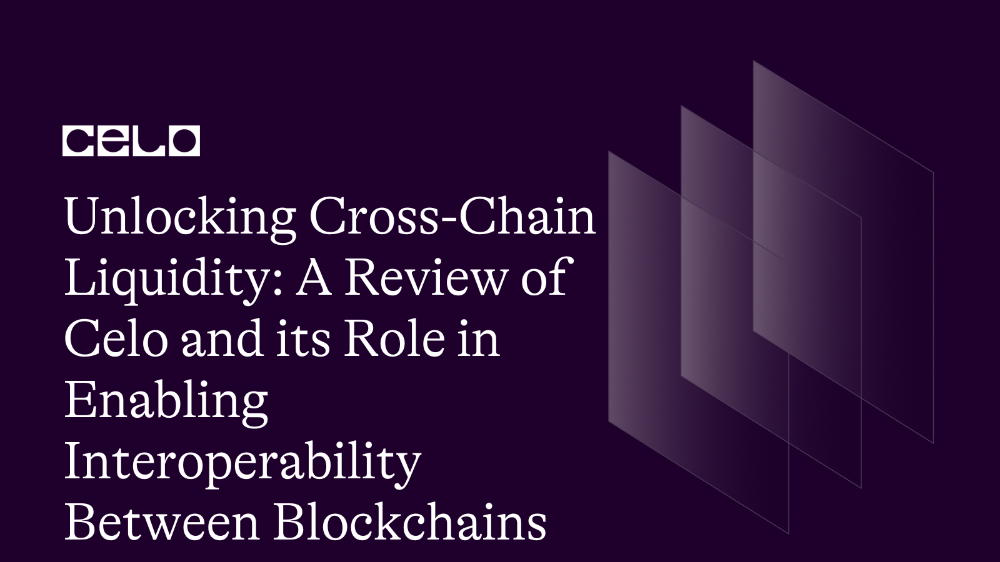

## Introduction

Blockchain technology has emerged as a transformative force with the potential to revolutionize the financial landscape as it evolves rapidly. Celo, a blockchain platform, is driving innovation and opening up new avenues for financial inclusion and access. Celo is creating new opportunities for growth in the blockchain industry through its unique combination of mobile and blockchain technology.

We will explore the innovative nature of Celo's solutions and their role in shaping the future of the blockchain industry in this developer-focused examination of Celo's cross-chain liquidity solutions. We'll start with a primer on Celo and the significance of cross-chain interoperability for industry growth. We'll then look at cross-chain liquidity and how Celo makes it possible between different blockchains.

We will go over Celo's interoperability solutions, such as the Celo-Ethereum Bridge and the Celo-Ankr Bridge, and the benefits they provide for facilitating cross-chain transactions.

We will show real-world illustrations of Celo's cross-chain liquidity solutions, emphasizing the benefits of using Celo for cross-chain transactions. This study involves limitations and challenges, as well as potential solutions and example code for transferring assets from Ethereum to Celo via the Celo Ethereum Bridge and from Ankr to Celo via Web3.js.

## Prerequisites

Prior to delving into Celo's cross-chain liquidity solutions and their transformative potential for the blockchain industry, it is critical to first understand Celo's fundamentals. With this foundational understanding, we can now explore Celo's cross-chain liquidity solutions and their implications for the blockchain industry's future.

## Requirements

- [Vscode](https://code.visualstudio.com/download)
- [Node.js](https://nodejs.org/en/download/)
- [NPM](https://www.npmjs.com/get-npm)

## Overview of Celo

Are you fed up with traditional financial systems that are exclusive, slow, and costly? Consider Celo, a blockchain platform that is reimagining finance for the 21st century. Celo is a game-changing platform that combines mobile technology and blockchain to provide fast, low-cost, and secure transactions.

[Celo](https://celo.org/), however, is more than just a blockchain platform. It is a global movement aimed at creating a more inclusive and transparent financial system that empowers individuals and communities. Celo is creating a decentralized ecosystem that puts control back in the hands of the people by leveraging the power of blockchain technology.

What truly distinguishes Celo is its mission to build a financial system that is accessible to everyone, regardless of location or financial status. Celo, through the use of mobile technology, allows anyone with a smartphone to participate in the global economy. This is a powerful vision with the potential to change the lives of billions of people worldwide.

Look no further than Celo if you're looking for a platform that combines cutting-edge technology with a powerful mission to create a more inclusive and transparent financial system. Join the movement today and help shape the financial future!

## Why Cross-Chain Interoperability is Crucial for Industry Growth and the Future of Blockchain Technology

I am excited to discuss the significance of cross-chain interoperability in the ever-changing blockchain industry.

Blockchain technology has transformed the way we exchange value and information. However, as the number of blockchain platforms grows, it becomes increasingly important for these platforms to seamlessly communicate and exchange information. And that’s where interoperability comes into play.

The ability of different blockchain networks to communicate with one another and exchange information or assets is referred to as interoperability.

Interoperability enables seamless transactions and interactions between different networks by fostering a more connected and interoperable ecosystem. This is critical for opening up new avenues for innovation and growth in the blockchain industry.

Celo, a blockchain platform, understands the value of cross-chain interoperability and has made it a priority in its mission to create a more accessible and equitable financial system. Celo is helping to unlock new possibilities for innovation and growth in the blockchain industry by focusing on facilitating cross-chain liquidity.

Interoperability can enable previously impossible use cases and applications. Cross-chain liquidity, for example, allows users to move assets between networks and gain access to a broader range of financial services. Interoperability will become increasingly important as the blockchain industry grows, allowing for a more connected and integrated ecosystem that fosters innovation and growth.

Cross-chain interoperability is a critical aspect of the blockchain industry because it allows different networks to seamlessly communicate and exchange value. Celo, with its emphasis on cross-chain liquidity, is at the forefront of developing a more connected and interoperable ecosystem that opens up new avenues for innovation and growth.

## Cross-chain Liquidity and Celo's Solutions

### Definition of cross-chain liquidity

The ability to transfer assets or value between different blockchain networks is referred to as cross-chain liquidity. This is critical for enabling seamless transactions and interactions between different networks, as well as unlocking new opportunities for blockchain innovation and growth. Cross-chain liquidity allows users to move assets between networks and gain access to a broader range of financial services.

It also reduces the blockchain ecosystem's reliance on a single network, lowering the risk of network congestion and increasing overall security and resilience.

### Explanation of Celo's cross-chain liquidity solutions

- **Celo-Ethereum Bridge**

The Celo-Ethereum Bridge is a critical piece of infrastructure for enabling cross-chain liquidity between the Ethereum and Celo networks. This two-way bridge allows users to seamlessly move assets between the two networks, creating new opportunities for blockchain innovation and growth. The Celo-Ethereum Bridge enables users to transfer any ERC-20 token between the two networks, making it simple and efficient to access a wide range of financial services on both platforms.

The ability of the Celo-Ethereum Bridge to improve interoperability between Ethereum and Celo is one of its most significant advantages. This interoperability gives users access to the distinct features and benefits of both networks, thereby opening up new avenues for innovation and growth in the blockchain industry.
The Celo-Ethereum Bridge also helps to minimize network congestion and relies less on a single network, improving the overall security and resilience of the blockchain ecosystem.

- **Celo-Ankr Bridge**

The Celo-Ankr Bridge is another critical solution that enables cross-chain liquidity between the Celo and Ankr networks. This solution makes use of the Ankr network's infrastructure to provide a seamless and efficient way of transferring assets between the two networks. The Celo-Ankr Bridge is critical for enabling cross-chain liquidity between Celo and networks other than Ethereum, thereby opening up new avenues for blockchain innovation and growth.

The Celo-Ankr Bridge's ability to improve cross-chain interoperability and provide users with access to a broader range of financial services is one of its most significant advantages. The Celo-Ankr Bridge also lowers the risk of network congestion by relying less on a single network, improving the overall security and resilience of the blockchain ecosystem.

Simply put, the Celo-Ethereum Bridge and the Celo-Ankr Bridge are critical solutions for enabling cross-chain liquidity and improving interoperability between various blockchain networks. These solutions open up new avenues for blockchain innovation and growth while also providing users with a more seamless and efficient way to access a broader range of financial services. As blockchain technology advances, solutions like these will play an increasingly important role in shaping the industry's future.

## Real-world applications of Celo's cross-chain liquidity solutions

As someone who has spent a significant amount of time in the blockchain industry, I am excited to share the benefits of Celo's cross-chain liquidity solutions with you. This innovative technology has a wide range of real-world applications, allowing users to benefit from interoperability and efficient asset transfers across different blockchain networks.

Celo's cross-chain liquidity solutions have a wide range of real-world applications, including decentralized finance (DeFi). Celo's solutions enable DeFi applications built on blockchain networks to interact with other networks, giving users greater flexibility and access to a broader range of financial services.

Celo's cross-chain liquidity solutions, for example, enable users to move assets between different DeFi protocols or facilitate cross-border transactions, which is critical for global businesses.

Celo's cross-chain liquidity solutions also shine in the realm of remittances. Celo's solutions, with their ability to enable seamless asset transfers between different blockchain networks, provide a cost-effective and efficient way for users to send and receive money across borders. This application has the potential to completely transform the traditional remittance industry by providing a much-needed solution to high fees and prolonged processing times.

Not only that, but Celo's cross-chain liquidity solutions can also be used in decentralized marketplaces. These solutions, by enabling interoperability between different networks, can make it easier for buyers and sellers to transact with one another, opening up new opportunities for e-commerce and other types of online marketplaces. This advancement is especially important in today's world, where online transactions are on the rise.

Celo's cross-chain liquidity solutions can also be used in gaming, social media, and identity verification, in addition to the applications listed above. Celo's solutions, with their ability to enable seamless asset transfers between different networks, open up a wide range of possibilities for blockchain innovation and growth.

Celo's cross-chain liquidity solutions have a wide range of real-world applications and the potential to transform a wide range of industries and use cases. As more developers and users adopt these solutions, we can anticipate a growing ecosystem of interconnected blockchain networks that will provide greater flexibility and efficiency to users worldwide. So, what are you holding out for?

Embrace the power of Celo's cross-chain liquidity solutions today and experience blockchain technology at its most advanced!

## Celo-Ethereum bridge limitations and challenges

Are you curious about the potential benefits of the Celo-Ethereum Bridge for cross-chain liquidity and interoperability? While this technology has many benefits, it also has some limitations and challenges that must be addressed in order for it to reach its full potential.

One of the primary concerns with the Celo-Ethereum Bridge is the possibility of security flaws. When assets are transferred between networks, there is always the risk of malicious actors attempting to exploit any weaknesses in the system. Despite the fact that the bridge has multiple security measures in place, such as multi-signature wallets and auditing protocols, we must remain vigilant and aware of any new vulnerabilities that may emerge.

Another limitation is the possibility of transaction processing congestion and delays. The network may become congested as more users use the Celo-Ethereum Bridge for cross-chain transactions, resulting in longer processing times and higher fees. This can be especially difficult for decentralized finance (DeFi) applications, which rely on fast and reliable transaction processing to function properly.

Finally, as with any new technology, the Celo-Ethereum Bridge is still in its early stages of development, and we can expect additional limitations and challenges to arise as it is further tested and refined. It will take time for developers and users to fully comprehend and utilize its capabilities, but with ongoing improvements and efforts to address these challenges, we will be able to realize the full potential of cross-chain interoperability and create a more connected and efficient blockchain ecosystem.

## Exploring Potential Solutions for the Celo-Ethereum Bridge

The Celo-Ethereum Bridge has many advantages for facilitating asset transfers between different blockchain networks, but it has some limitations and challenges that must be addressed. As more users and applications adopt this solution, the network may become congested and processing times may slow, resulting in higher transaction fees and a less efficient user experience.

To address these issues, developers can work to improve the Celo-Ethereum Bridge's capacity to handle higher volumes of transactions and accelerate asset transfers. This could include implementing new data compression and network optimization techniques as well as investigating new approaches to consensus and validation mechanisms. By doing so, we can ensure that users of the Celo-Ethereum Bridge have a smooth and efficient experience.

Furthermore, broadening the types of assets that can be transferred via the Celo-Ethereum Bridge is another potential solution to these issues. The bridge currently supports the transfer of CELO and cUSD tokens, but other assets, such as other ERC-20 tokens or non-fungible tokens(NFTs), may be requested in the future.

Developers can work on new protocols and standards for cross-chain compatibility to enable the transfer of a broader range of assets. We can unlock new possibilities for cross-chain liquidity and innovation in the blockchain industry by exploring new approaches to asset wrapping and bridging, as well as collaborating with other blockchain networks and communities to promote interoperability and cross-chain integration.

The Celo-Ethereum Bridge has a lot of potential for facilitating asset transfers between different blockchain networks, but it also has some issues that need to be worked out. We can unlock new possibilities for cross-chain liquidity and innovation in the blockchain industry by leveraging the developer community's expertise and working collaboratively to improve the scalability, performance, and range of assets supported by this solution.

**_here's an example code for transferring assets from Ethereum to Celo using the Celo-Ethereum Bridge and the Web3.js library_**

```javascript
const Web3 = require("web3");
const ERC20ABI = require("./ERC20ABI.json");
const CeloBridgeABI = require("./CeloBridgeABI.json");

// Initialize web3 instance for Ethereum network
const ethProviderUrl = "https://mainnet.infura.io/v3/YOUR_INFURA_PROJECT_ID";
const ethProvider = new Web3.providers.HttpProvider(ethProviderUrl);
const ethWeb3 = new Web3(ethProvider);

// Initialize web3 instance for Celo network
const celoProviderUrl = "https://forno.celo.org";
const celoProvider = new Web3.providers.HttpProvider(celoProviderUrl);
const celoWeb3 = new Web3(celoProvider);

// Set up contract instances
const ethTokenAddress = "0x6b175474e89094c44da98b954eedeac495271d0f"; // Example: Dai token on Ethereum network
const ethTokenContract = new ethWeb3.eth.Contract(ERC20ABI, ethTokenAddress);
const celoBridgeAddress = "0xe7e0f58efa7e83c61bfdedcad8a55ac9b68f3b6d"; // Celo-Ethereum Bridge contract
const celoBridgeContract = new celoWeb3.eth.Contract(
  CeloBridgeABI,
  celoBridgeAddress
);

// Set up transfer parameters
const fromAddress = "0x123..."; // Sender's Ethereum address
const toAddress = "0x456..."; // Recipient's Celo address
const amount = "1000000000000000000"; // Amount of tokens to transfer (in Wei)

// Approve the transfer on the Ethereum network
const ethNonce = await ethWeb3.eth.getTransactionCount(fromAddress);
const ethApproveTx = ethTokenContract.methods.approve(
  celoBridgeAddress,
  amount
);
const ethSignedTx = await ethWeb3.eth.accounts.signTransaction(
  {
    to: ethTokenAddress,
    data: ethApproveTx.encodeABI(),
    nonce: ethNonce,
    gas: 150000,
    gasPrice: await ethWeb3.eth.getGasPrice(),
  },
  "YOUR_ETHEREUM_PRIVATE_KEY"
);
const ethTxReceipt = await ethWeb3.eth.sendSignedTransaction(
  ethSignedTx.rawTransaction
);

// Wait for approval transaction to confirm
await ethWeb3.eth.waitForTransactionReceipt(ethTxReceipt.transactionHash);

// Initiate transfer on the Celo network
const celoNonce = await celoWeb3.eth.getTransactionCount(fromAddress);
const celoTransferTx = celoBridgeContract.methods.transferTokens(
  toAddress,
  ethTokenAddress,
  amount
);
const celoSignedTx = await celoWeb3.eth.accounts.signTransaction(
  {
    to: celoBridgeAddress,
    data: celoTransferTx.encodeABI(),
    nonce: celoNonce,
    gas: 150000,
    gasPrice: await celoWeb3.eth.getGasPrice(),
  },
  "YOUR_CELO_PRIVATE_KEY"
);
const celoTxReceipt = await celoWeb3.eth.sendSignedTransaction(
  celoSignedTx.rawTransaction
);

// Wait for transfer transaction to confirm
await celoWeb3.eth.waitForTransactionReceipt(celoTxReceipt.transactionHash);

console.log("Transfer successful!");
```

This code transfers ERC20 tokens from an Ethereum network to a Celo network via the Celo-Ethereum bridge contract.
To use this code, you need to do the following
Replace `YOUR_INFURA_PROJECT_ID` with your own Infura project ID.
Replace `0x123...` with the sender's Ethereum address.
Replace `0x456...` with the recipient's Celo address.
Replace `1000000000000000000` with the amount of ERC20 tokens to transfer (in Wei).
Replace `YOUR_ETHEREUM_PRIVATE_KEY` with the sender's Ethereum private key.
Replace `YOUR_CELO_PRIVATE_KEY` with the sender's Celo private key.

Using HTTP providers, the code first creates Web3 instances for the Ethereum and Celo networks. It then uses their respective ABI files to create contract instances for the ERC20 token and the Celo-Ethereum bridge contract.

The code then configures transfer parameters such as the sender's Ethereum address, the recipient's Celo address, and the number of ERC20 tokens to transfer.

The code then approves the transfer on the Ethereum network by calling the ERC20 token contract instance's `approve` method. The transaction is then signed and sent using the sender's Ethereum private key.

Once the approval transaction on the Ethereum network has been confirmed, the code initiates the transfer on the Celo network by calling the `transferTokens` method of the Celo-Ethereum bridge contract instance. The transaction is then signed and sent using the sender's Celo private key.

Finally, the code waits for the transfer transaction on the Celo network to confirm itself before logging a message indicating that the transfer was successful.

To run this code, you must have [Node.js](https://nodejs.org/) and [Vscode](https://code.visualstudio.com/download) installed on your machine. Node.js can be downloaded from the official website.

To save this code in your folder, create a new file with any name you want, but make sure it ends in.js. You should save it as `celo-eth-bridge-transfer.js`.

You can run the code from the command line by navigating to the directory where the code file is saved and typing node `celo-eth-bridge-transfer.js`. Before running the code, ensure that the placeholders `YOUR INFURA PROJECT ID`, `YOUR ETHEREUM PRIVATE KEY`, and `YOUR CELO PRIVATE KEY` have been replaced with your actual Infura project ID, Ethereum private key, and Celo private key, respectively.

After you've replaced the placeholders, run the command as described above to deploy the code. The code will connect to the Ethereum and Celo networks, approve token transfers on the Ethereum network, begin transfers on the Celo network, and wait for the transactions to confirm. Finally, a message will be logged to the console indicating whether or not the transfer was successful.

## Celo-Ankr Bridge Limitations and Potential Solutions

The Celo-Ankr Bridge is a novel solution that allows for cross-chain liquidity between the Celo and Ankr networks. While the bridge has many advantages, it also has some limitations and challenges that must be addressed.

The Celo-Ankr Bridge has a limitation in that it does not support certain token standards. For example, on the Ethereum network, the bridge currently only supports ERC-20 tokens, which means that tokens based on other standards, such as ERC-721 or ERC-1155, cannot be transferred using the bridge. This limitation may limit the bridge's use cases and thus its overall impact.

Another issue with the Celo-Ankr Bridge is the possibility of long transaction times. Cross-chain transfers, like any other blockchain-based transaction, can take some time to complete due to network congestion and other factors. The Celo-Ankr Bridge, on the other hand, may face additional delays due to the need to bridge tokens across two different networks. This delay may have an impact on the user experience and limit the bridge's practical applications.

There are several potential solutions to these limitations and challenges. One option is to broaden the range of token standards supported by the bridge. By supporting a broader range of token standards, the bridge may be able to support a broader range of use cases, increasing its overall utility.

Another possible solution is to optimize the transfer process in order to shorten transaction times. This could include implementing more efficient transfer protocols or optimizing the underlying networks' performance. The bridge could improve the user experience and make cross-chain transfers more practical for a wider range of applications by reducing transfer times.

Overall, despite some limitations and challenges, the Celo-Ankr Bridge represents an important step forward in the development of cross-chain liquidity solutions. By addressing these issues and improving the bridge's functionality, developers can open up new possibilities for cross-chain transactions and pave the way for a more interconnected blockchain ecosystem.

**_here's an example code for transferring assets from Ankr to Celo using the Web3.js library_**

```javascript
const Web3 = require("web3");
const AnkrBridgeABI = require("./AnkrBridgeABI.json");
const CeloBridgeABI = require("./CeloBridgeABI.json");

// Set up web3 connections for Ankr and Celo networks
const ankrWeb3 = new Web3(
  new Web3.providers.HttpProvider("https://ankrapi.com/")
);
const celoWeb3 = new Web3(
  new Web3.providers.HttpProvider("https://celoapi.com/")
);

// Set up contract instances for Ankr and Celo bridges
const ankrBridgeAddress = "0xAnkrBridgeAddress";
const celoBridgeAddress = "0xCeloBridgeAddress";
const ankrBridge = new ankrWeb3.eth.Contract(AnkrBridgeABI, ankrBridgeAddress);
const celoBridge = new celoWeb3.eth.Contract(CeloBridgeABI, celoBridgeAddress);

// Specify transfer details
const amount = ankrWeb3.utils.toWei("10", "ether");
const recipient = "0xCeloRecipientAddress";

// Approve transfer on the Ankr bridge
const approveTx = await ankrBridge.methods
  .approve(celoBridgeAddress, amount)
  .send({ from: "0xAnkrSenderAddress" });
const approveTxHash = approveTx.transactionHash;

// Wait for approval transaction to be confirmed
await ankrWeb3.eth.waitForTransactionReceipt(approveTxHash);

// Initiate transfer on the Celo bridge
const transferTx = await celoBridge.methods
  .transfer(recipient, amount)
  .send({ from: "0xCeloSenderAddress" });
const transferTxHash = transferTx.transactionHash;

// Wait for transfer transaction to be confirmed
await celoWeb3.eth.waitForTransactionReceipt(transferTxHash);
```

This is JavaScript code that uses the Web3 library to transfer funds from the Ankr network to the Celo network through their respective bridges.

The code sets up contract instances for the Ankr and Celo networks as well as transfer details such as the amount of funds to be transferred and the recipient's address.

To approve the transfer of funds to the Celo bridge contract instance, the `approve()` method is called on the Ankr bridge contract instance. This is followed by waiting for the Ankr network to confirm the transaction.

The `transfer()` method on the Celo bridge contract instance is then called to initiate the transfer of funds to the specified recipient's address. Following that, the transaction must be confirmed by the Celo network.

It should be noted that the addresses in the code are placeholders and should be replaced with actual addresses. In order for the code to work, the ABI (Application Binary Interface) JSON files for the Ankr and Celo bridge contracts must also be provided.

To run and deploy the code, complete the following steps

- On your system, install Node.js and NPM (Node Package Manager).
- Run the following command in the terminal to install the required dependencies:

`npm install web3`

- Save the code in a folder on your system with a.js file extension, such as transfer.js.
- To deploy the code, type the following command into the terminal:

`node transfer.js`

This command will run the JavaScript code that connects to the Ankr and Celo networks, initializes contract instances, approves transfer on the Ankr bridge, waits for the transaction to be confirmed, and then initiates transfer on the Celo bridge.
Before running the code, make sure to replace the following placeholders with actual values:

- `0xAnkrBridgeAddress` Replace with the address of the Ankr bridge contract.
- `0xCeloBridgeAddress` Replace with the address of the Celo bridge contract.
- `0xAnkrSenderAddress` Replace with the address of the sender on the Ankr network.
- `0xCeloSenderAddress` Replace with the address of the sender on the Celo network.
- `0xCeloRecipientAddress` Replace with the address of the recipient on the Celo network.

It's also worth noting that the code contains asynchronous functions that use the `await` keyword to wait for transaction confirmations. As a result, you must ensure that your system supports the use of asynchronous JavaScript functions.

### Conclusion

Finally, Celo's cross-chain liquidity solutions are transforming the blockchain industry by enabling seamless and secure interoperability across multiple blockchains. Celo has provided developers with a powerful toolkit for building cross-chain applications and facilitating transactions between different blockchain ecosystems through its innovative Celo-Ethereum and Celo-Ankr Bridges.

While Celo's solutions have limitations and challenges, such as the requirement for bridging fees and the possibility of network congestion, they represent a significant step forward in addressing the critical issue of cross-chain interoperability. Cross-chain liquidity will become increasingly important in unlocking the full potential of decentralized applications as the blockchain industry grows and evolves.

Developers who understand Celo's cross-chain liquidity solutions and how they work will be well placed to capitalize on new opportunities in this space. They can begin developing their own cross-chain applications and contributing to the development of a more interconnected and interoperable blockchain ecosystem by using the example codes provided in this article.

Overall, Celo's cross-chain liquidity solutions have the potential to significantly alter the industry landscape and accelerate blockchain technology adoption in real-world applications. The importance of cross-chain interoperability cannot be overstated as we move toward a more decentralized and connected future, and Celo is at the forefront of this critical movement.

### Next Steps

You now have a thorough understanding of Celo's cross-chain liquidity solutions and how they have the potential to transform the blockchain industry. There are, however, some critical next steps you can take to broaden your knowledge and stay current on the latest developments in this field.

To begin, you can look at more real-world examples of Celo's cross-chain liquidity solutions and see how they are being used to enable new use cases and unlock new opportunities in the blockchain space. You can also stay up to date on the latest Celo interoperability solution updates and improvements, as well as any new bridges or partnerships that are announced.

Furthermore, you can further your understanding of blockchain technology and its potential impact on various industries by investigating related topics such as decentralized finance (DeFi), smart contracts, and tokenomics. You can position yourself to take advantage of the opportunities presented by this rapidly changing ecosystem by staying informed and engaged.

You can also interact with the Celo community and contribute to the platform's ongoing development. There are many ways to get involved and help shape the future of this exciting technology, whether through social media discussions or by contributing to open-source projects.

### Author

I take pride in being a results-driven manager as well as a marketing and technical writing expert. I've spent the last five years honing my skills in building paid and organic marketing funnels for SaaS companies. Furthermore, I am a skilled Web 3 technical writer, allowing me to create compelling content that drives business growth. [LinkedIn](https://www.linkedin.com/in/maxwell-onyeka-3b4b1118b/) [Github](https://github.com/maxzysparks)

### References

- [Celo Website](https://celo.org/)
- [Celo Documentation](https://docs.celo.org/)
- [Ankr Website](https://www.ankr.com/)
- [Ethereum Website](https://ethereum.org/)
- [Web3.js Documentation](https://web3js.readthedocs.io/en/v1.4.0/)
