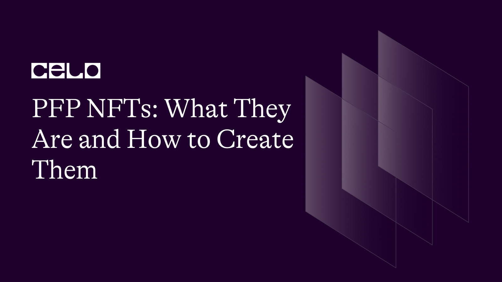
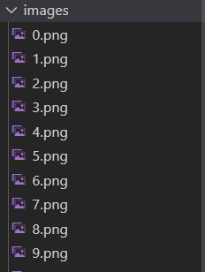
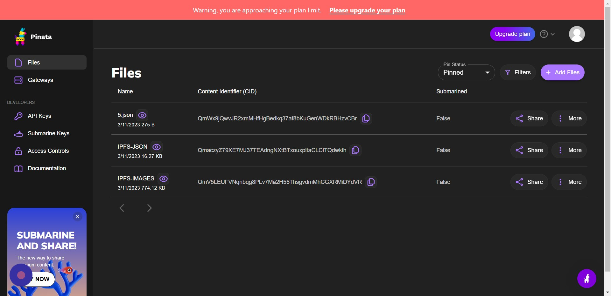
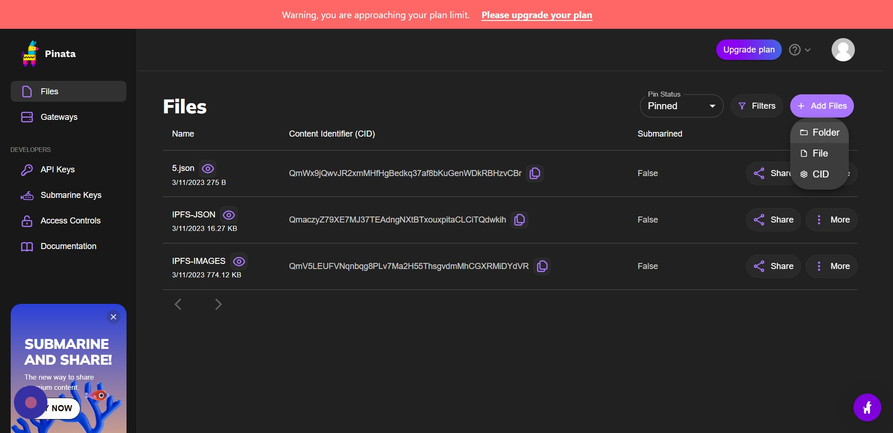
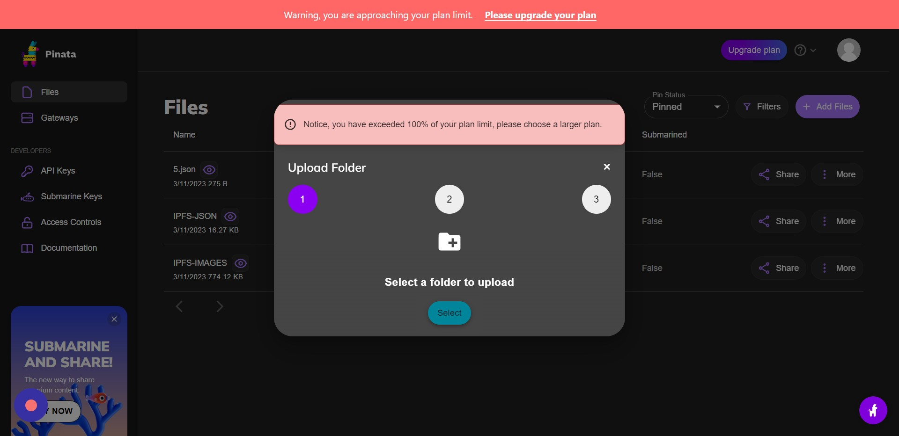
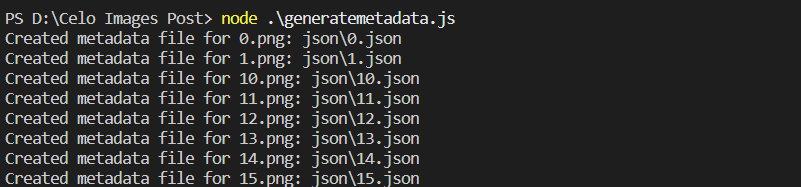

## 🌱 Introduction

PFP NFTs are unique digital assets that serve as profile pictures for their owners. These NFTs are typically sold in limited quantities, and each one is unique in some way, either through its design, color scheme, or other distinguishing features.

One of the key benefits of PFP NFTs is their rarity. Owning a PFP NFT can be seen as a status symbol, and the limited supply of these tokens means that they can increase in value over time. Additionally, PFP NFTs can be used to provide access to exclusive content or events, adding even more value for their owners.

Let's get started!

## 🗈 Prerequisites

- A computer with an internet connection. You will need a computer with a stable internet connection to follow along with this guide.

- Basic knowledge of programming. While we will provide step-by-step instructions, it will be helpful to have some basic knowledge of programming languages such as JavaScript and Solidity.

- Node.js and npm installed. You will need to have Node.js and npm (the package manager for Node.js) installed on your computer. You can check if you have them installed by running the following commands in your terminal:

```bash
node -v
npm -v
```

- A code editor. You will need a code editor to write and edit your code. Some popular options include Visual Studio Code and Atom.
- A Metamask account. You will need a Metamask account to interact with the Celo blockchain from your web browser. If you don't already have one, you can create one by installing the Metamask extension for Chrome or Firefox.

## ⚠️ Requirements

- Truffle: a development environment, testing framework, and asset pipeline for Ethereum
- Node.js: a JavaScript runtime that allows you to run JavaScript on the command line
- Yarn: a package manager for JavaScript
- next: Next.js is a framework for building server-rendered or statically-exported React applications.
- CeloCli - The celocli lets you interact with the Celo Protocol smart contracts.

## What are PFP NFTs?

PFP (profile picture) NFTs are unique digital assets that serve as profile pictures for their owners. They are a type of NFT (non-fungible token) and are typically sold in limited quantities. Each PFP NFT is unique in some way, either through its design, color scheme, or other distinguishing features. Owning a PFP NFT can be seen as a status symbol, and the limited supply of these tokens means that they can increase in value over time. Additionally, PFP NFTs can be used to provide access to exclusive content or events, adding even more value for their owners.

**_ Let's start building the future together! _**

:::tip
To learn more about setting up the environment to create PFP NFTs , check out the **[step-by-step guide to deploying your first full-stack dApp on Celo](https://docs.celo.org/blog/tutorials/step-by-step-guide-to-deploying-your-first-full-stack-dapp-on-celo#steps-to-set-up-the-truffle-project-and-its-configs)**, which provides detailed instructions on getting started.
:::

## Steps To Create PFP NFTs

### Step 1: Decide on your concept

The first step in creating a PFP NFT is to come up with a concept for your image. This can be anything from a digital portrait of yourself to a whimsical cartoon character. The key is to make it unique and interesting enough that someone would want to use it as their profile picture.

### Step 2: Create the artwork

Once you have a concept in mind, it's time to create the artwork for your PFP NFT. This can be done using various digital art tools such as Photoshop, Illustrator, or Procreate. Make sure to save your final image as a high-resolution file in PNG or JPEG format.

### Step 3: Create a Smart Contract

To create a PFP NFT, you will need to create a smart contract that represents the token. This smart contract should include all relevant information such as the title, description, and any additional details that potential buyers might be interested in.

You can create a smart contract using various blockchain development tools such as Remix, Truffle, or Hardhat. Make sure to test your smart contract thoroughly before deploying it to the blockchain.

### Step 4: Deploy Smart Contract and Mint NFT

Once your smart contract is ready, it's time to deploy it to the blockchain and mint your PFP NFT. This involves creating a digital token on a blockchain network (such as Ethereum) that represents ownership of the image.

When minting your PFP NFT, make sure to include all relevant information such as the title, description, and any additional details that potential buyers might be interested in. You will also need to specify the number of NFTs you want to create, and their corresponding ID numbers.

### Step 5: Upload NFTs to IPFS

Once your PFP NFTs are minted, it's time to upload them to a decentralized storage network like IPFS. This involves uploading the image files and the smart contract code to IPFS, and generating a base URL for your NFTs.

You can use various IPFS upload tools such as Pinata, Infura, or Fleek. Make sure to test your IPFS links thoroughly to ensure that your NFTs are accessible to potential buyers.

**_ Let's get started! _**

### Generate images using Canva Nodejs Library

1. Create a Folder Name as GenerateWork.

2. Run Command

```bash
npm init
npm i canvas
```

3. Create a file name `generateimg.js` and create a folder name images.

4. Coding for `generateimg.js`

```js
const { createCanvas } = require("canvas");
const fs = require("fs");
const readline = require("readline").createInterface({
  input: process.stdin,
  output: process.stdout,
});
async function createImage(number) {
  // Set canvas size and create a new canvas instance
  const canvas = createCanvas(500, 500);

  // Set background color
  const context = canvas.getContext("2d");
  context.fillStyle = `rgb(${Math.floor(Math.random() * 256)}, ${Math.floor(
    Math.random() * 256
  )}, ${Math.floor(Math.random() * 256)})`;
  context.fillRect(0, 0, 500, 500);

  // Add skin tone gradient
  const gradient = context.createLinearGradient(0, 0, 500, 0);
  gradient.addColorStop(
    0,
    `rgb(${Math.floor(Math.random() * 256)}, ${Math.floor(
      Math.random() * 256
    )}, ${Math.floor(Math.random() * 256)})`
  );
  gradient.addColorStop(
    1,
    `rgb(${Math.floor(Math.random() * 256)}, ${Math.floor(
      Math.random() * 256
    )}, ${Math.floor(Math.random() * 256)})`
  );
  context.fillStyle = gradient;
  context.fillRect(0, 0, 500, 500);
  // Randomize face shape
  const faceX = 250 + (Math.random() - 0.5) * 100;
  const faceY = 250 + (Math.random() - 0.5) * 100;
  const faceRadius = 150 + Math.random() * 100;
  context.beginPath();
  context.arc(faceX, faceY, faceRadius, 0, 2 * Math.PI);
  context.fillStyle = `rgb(${Math.floor(Math.random() * 256)}, ${Math.floor(
    Math.random() * 256
  )}, ${Math.floor(Math.random() * 256)})`;
  context.fill();

  // Randomize eye shapes
  const eyeX1 = 175 + (Math.random() - 0.5) * 50;
  const eyeY1 = 200 + (Math.random() - 0.5) * 50;
  const eyeRadius1 = 15 + Math.random() * 20;
  context.beginPath();
  context.arc(eyeX1, eyeY1, eyeRadius1, 0, 2 * Math.PI);
  context.fillStyle = `rgb(${Math.floor(Math.random() * 256)}, ${Math.floor(
    Math.random() * 256
  )}, ${Math.floor(Math.random() * 256)})`;
  context.fill();
  const eyeX2 = 325 + (Math.random() - 0.5) * 50;
  const eyeY2 = 200 + (Math.random() - 0.5) * 50;
  const eyeRadius2 = 15 + Math.random() * 20;
  context.beginPath();
  context.arc(eyeX2, eyeY2, eyeRadius2, 0, 2 * Math.PI);
  context.fillStyle = `rgb(${Math.floor(Math.random() * 256)}, ${Math.floor(
    Math.random() * 256
  )}, ${Math.floor(Math.random() * 256)})`;
  context.fill();

  // Randomize mouth shape
  const mouthX = 250 + (Math.random() - 0.5) * 50;
  const mouthY = 325 + (Math.random() - 0.5) * 50;
  const mouthRadius = 50 + Math.random() * 50;
  const mouthStartAngle = (Math.random() * Math.PI) / 2 - Math.PI / 4;
  const mouthEndAngle = (Math.random() * Math.PI) / 2 + Math.PI / 4;
  context.beginPath();
  context.arc(mouthX, mouthY, mouthRadius, mouthStartAngle, mouthEndAngle);
  context.lineWidth = 10;
  context.strokeStyle = `rgb(${Math.floor(Math.random() * 256)}, ${Math.floor(
    Math.random() * 256
  )}, ${Math.floor(Math.random() * 256)})`;
  context.stroke();
  const buffer = canvas.toBuffer("image/png");
  fs.writeFileSync(`./images/${number}.png`, buffer);
}

(async () => {
  let numImages;
  readline.question(
    "How many images do you want to generate? ",
    async (numImages) => {
      for (let i = 0; i < numImages; i++) {
        await createImage(i);
      }
      console.log("Images has been generated");
      readline.close();
    }
  );
})();
```

5. Save the File and Run Command.

```bash
node ./generateimg.js
```

6. Enter the number of images you want to create! i created this script to generate random faces.

7. Images will be created now and an output will be shown like image down this.

 

### Uploading Images to IPFS

**_ I am using [Pinata](https://www.pinata.cloud/) for IPFS. _**

1. Navigate to [Pinata Panel](https://app.pinata.cloud/pinmanager)

2. Click "Add Files"



3. Click "Folder"



4. Click "Select" And then Select the Images Folder and Upload It.



5. After Upload it will ask For Name, Just Name what ever you like.

6. Now Save its CID Somewhere Like i have Mine `QmV5LEUFVNqnbqg8PLv7Ma2H55ThsgvdmMhCGXRMiDYdVR`

### Create Metadata for NFT with Images IPFS CID.

**_ We now gonna create Json Metadata for Our NFTs _**

1. Create a folder name `json` and create a file name `generatemetadata.js`.

```js
const fs = require("fs");
const path = require("path");

// Define the directory where the NFT images are located
const nftDirectory = "./images";

// Read the files in the directory and filter out non-image files
const files = fs.readdirSync(nftDirectory).filter((file) => {
  const extension = path.extname(file).toLowerCase();
  return [".jpg", ".jpeg", ".png", ".gif"].includes(extension);
});

// Create metadata JSON files for each NFT
files.forEach((file, index) => {
  const metadata = {
    name: `Face NFT #${index + 1}`,
    description: `This is an NFT with ID #${index + 1}`,
    image: `https://gateway.pinata.cloud/ipfs/QmV5LEUFVNqnbqg8PLv7Ma2H55ThsgvdmMhCGXRMiDYdVR/${file}`,
    // Replace QmV5LEUFVNqnbqg8PLv7Ma2H55ThsgvdmMhCGXRMiDYdVR CID with Your Uploaded Images CID
    attributes: [
      {
        trait_type: "Generation",
        value: "1",
      },
    ],
  };
  const jsonFileName = path.basename(file, path.extname(file)) + ".json";
  const jsonFilePath = path.join("./json", jsonFileName);
  fs.writeFileSync(jsonFilePath, JSON.stringify(metadata, null, 2));
  console.log(`Created metadata file for ${file}: ${jsonFilePath}`);
});
```

2. You Can Change the Metadata as You want.

3. Run the Script

```bash
node generatemetadata.js
```

4. Now we have Metadata in json format in json folder.



5. Lets upload the json folder same as we uploaded images folder to IPFS Above and Copy its CID, We gonna use CID in Smart contract For NFT.

### Coding for Smart Contract

:::tip
To learn more about setting up the environment to create PFP NFTs , check out the **[step-by-step guide to deploying your first full-stack dApp on Celo](https://docs.celo.org/blog/tutorials/step-by-step-guide-to-deploying-your-first-full-stack-dapp-on-celo#steps-to-set-up-the-truffle-project-and-its-configs)**, which provides detailed instructions on getting started.
:::

```solidity
// SPDX-License-Identifier: MIT
pragma solidity ^0.8.9;

import "@openzeppelin/contracts/token/ERC721/ERC721.sol";
import "@openzeppelin/contracts/access/Ownable.sol";
import "@openzeppelin/contracts/utils/Counters.sol";
import "@openzeppelin/contracts/utils/Strings.sol"; 

contract FACEPFP is ERC721, Ownable {
    using Counters for Counters.Counter;

    Counters.Counter private _tokenIdCounter;

    constructor() ERC721("FACEPFP", "PFP") {}

    function _baseURI() internal pure override returns (string memory) {
        return
            "https://cloudflare-ipfs.com/ipfs/QmaczyZ79XE7MJ37TEAdngNXtBTxouxpitaCLCiTQdwkih/";
    }
// Change the CID here With Your Json Folder CID
    function safeMint() public onlyOwner {
        uint256 tokenId = _tokenIdCounter.current();
        require(tokenId + 1 < totalSupply(), "Total supply reached");
        _tokenIdCounter.increment();
        _safeMint(msg.sender, tokenId);
    }

    function totalSupply() public pure returns (uint256) {
        return 50; // set the total supply here
    }

    function tokenURI(
        uint256 tokenId
    ) public view override returns (string memory) {
        if (!_exists(tokenId)) revert("URI query for nonexistent token");
        return
            string(abi.encodePacked(_baseURI(), Strings.toString(tokenId), ".json"));
    }

}
```

**The smart contract defines several functions that are used to create Mint NFTs, Here is the Explaination of those functions.**

- The _baseURI() function is an internal function that returns the base URI for the token metadata. In this case, it returns a hardcoded URI that points to a JSON file stored on IPFS.

- The safeMint() function is a public function that allows the owner of the contract to create new NFTs. Each NFT has a unique ID which is incremented by one each time a new NFT is created. The totalSupply() function returns the total number of NFTs that can be created, which in this case is 50.

- The tokenURI() function returns the metadata URI for a given token ID. It concatenates the base URI, the token ID and the extension ".json" to form the complete URI. If the token ID does not exist, the function will revert with an error message.

:::tip
Use the [OpenZeppelin Wizard](https://wizard.openzeppelin.com/) to easily create, deploy, and interact with smart contracts using the OpenZeppelin library. And For the Frontend You Can Go threw [Celo Frontend NFT Minter](https://github.com/developerkunal/Celo-frontend)
:::

## Conclusion

Creating a PFP NFT can be a fun and rewarding experience for digital artists and enthusiasts alike. By following these simple steps, you can create a unique and valuable digital asset that you can either use as your own profile picture or sell on an NFT marketplace. Remember to create a smart contract, deploy it to the blockchain, mint your NFTs, and upload them to a decentralized storage network like IPFS.

## About Author

Hi! My name is Kunal Dawar and I am a Full Stack web2/web3 Developer. I have participated in numerous hackathons and have been fortunate enough to win many of them.

One thing that I am truly passionate about is creating things that are reliable and don't break easily. I believe that creating high-quality products is important not only for the users but also for the overall growth and success of a business.

In my free time, I enjoy learning about new technologies and staying up-to-date with the latest trends in the field. I also love to share my knowledge with others and mentor those who are interested in pursuing a career in web development.