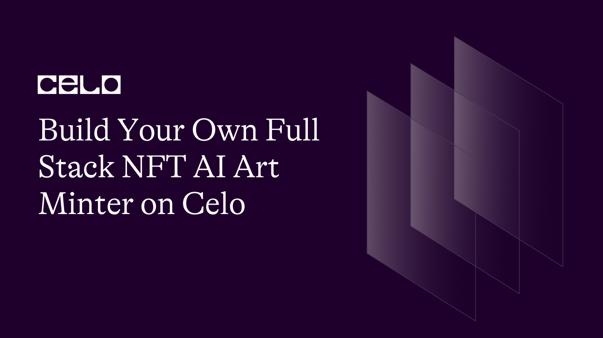

## Introduction

AI is a revolutionary technology that will transform our world as we know it. Its capabilities are endless and in this tutorial i'll be showing you how to use an A.I model `stablediffusion` to generate high quality digital art and turn that art into an NFT.

Here’s a demo [link](https://zippy-centaur-ee7a65.netlify.app/) of what you’ll be creating.

And a screenshot.


## Prerequisites

To fully follow up with these tutorials, you should have a basic understanding of the following technologies.

Solidity, smart-contract and blockchain concepts.
Hardhat.
React.
Basic web Development.

## Requirements

- Solidity.
- OpenZeppelin.
- Hardhat.
- React.
- NodeJS 12.0.1 upwards installed.
- Celo Extention wallet.

## Installation

Click on [this](https://github.com/4undRaiser/celo-ai-art-minter) repo from your github.

- Clone the repo to your computer.
- open the project from from vscode.
- Run `npm install` command to install all the dependencies required to run the app locally.

## SmartContract

In this chapter, we’ll be creating our Nft minter contract

## NFT Minter

Go to the contracts folder in root directory of the project and you will find the solidity file MyNFT.sol.

Open the file to file to access this smart contract.

```solidity
// SPDX-License-Identifier: MIT
pragma solidity ^0.8.0;

import "@openzeppelin/contracts/utils/Counters.sol";
import "@openzeppelin/contracts/token/ERC721/ERC721.sol";
import "@openzeppelin/contracts/token/ERC721/extensions/ERC721URIStorage.sol";

contract MyNFT is ERC721URIStorage {
    using Counters for Counters.Counter;
    Counters.Counter private _tokenIds;

    address public owner;

    constructor(
        string memory _name,
        string memory _symbol
    ) ERC721(_name, _symbol) {
        owner = msg.sender;
    }

    function mintArt(string memory tokenURI) public payable {
        _tokenIds.increment();

        uint256 newItemId = _tokenIds.current();
        _mint(msg.sender, newItemId);
        _setTokenURI(newItemId, tokenURI);
    }

    function totalSupply() public view returns (uint256) {
        return _tokenIds.current();
    }

}

```

We create a smart contract that mints a new NFT (non-fungible token) using the `ERC721` standard from the `OpenZeppelin` library. The contract allows anyone to mint a new NFT by calling the `mintArt` function and passing in a string parameter for the token URI. Each `NFT` has a unique ID that is incremented using a counter from the `Counters` library. The contract also keeps track of the total number of NFTs that have been minted using the `totalSupply` function. Additionally.

## Front end

In this Part, we'll be building a React application that will allow users to create and mint their own Non-Fungible Tokens (NFTs). We'll be using the Celo Wallet as our wallet provider, the NFT.Storage api to upload a user's custom image to IPFS, and the Hugging Face API to generate a custom image based on the user's description.

### Setup .env File

Firstly, we need to grap our environment variables as seen in the env example.

To get our hugging face api key, [click here](https://huggingface.co/) create an account and navigate to your profile and create a new api key.

You'll also need to create an account on [NFT.Storage](https://nft.storage/), and create a new API key.

And finally we need to provide a mnemonic for our celo wallet.

### Deployment

We’ll use hardhat to deploy our smart-contracts to the celo blockchain.

```javascript
require("@nomicfoundation/hardhat-toolbox");
require("dotenv").config({ path: ".env" });

// This is a sample Hardhat task. To learn how to create your own go to
// https://hardhat.org/guides/create-task.html
task("accounts", "Prints the list of accounts", async (taskArgs, hre) => {
  const accounts = await hre.ethers.getSigners();

  for (const account of accounts) {
    console.log(account.address);
  }
});

module.exports = {
  solidity: "0.8.9",
  networks: {
    alfajores: {
      url: "https://alfajores-forno.celo-testnet.org",
      accounts: {
        mnemonic: process.env.MNEMONIC,
        path: "m/44'/52752'/0'/0",
      },
      chainId: 44787,
    },
  },
};
```

Configure your hardhat.config file to look like this to enable hardhat to deploy the smart contracts to the celo blockchain.

Next let's create a script to deploy the smart contracts.

```javascript
const hre = require("hardhat");

async function main() {
  const NAME = "AI Generated NFT";
  const SYMBOL = "AINFT";

  const MyNFT = await hre.ethers.getContractFactory("MyNFT");
  const myNFT = await MyNFT.deploy(NAME, SYMBOL);

  await myNFT.deployed();

  console.log("MyNFT deployed to:", myNFT.address);
  storeContractData(myNFT);
}

function storeContractData(contract) {
  const fs = require("fs");
  const contractsDir = __dirname + "/../src/contracts";

  if (!fs.existsSync(contractsDir)) {
    fs.mkdirSync(contractsDir);
  }

  fs.writeFileSync(
    contractsDir + "/MyNFT-address.json",
    JSON.stringify({ MyNFT: contract.address }, undefined, 2)
  );

  const MyNFTArtifact = artifacts.readArtifactSync("MyNFT");

  fs.writeFileSync(
    contractsDir + "/MyNFT.json",
    JSON.stringify(MyNFTArtifact, null, 2)
  );
}

main()
  .then(() => process.exit(0))
  .catch((error) => {
    console.error(error);
    process.exit(1);
  });
```

The Script Above will deploy our minter smart contracts and create a contract folder for the ABI and contract address for the NFT minter contract.

Deploy the smart contracts to the celo block-chain by running this command.

`npx hardhat run scripts/deploy.js --network alfajores`

You should see something like this in the terminal

`MyNFT deployed to: 0x49F39D9531B826826EDc7066161F20570105AFb1`

### App.js

Now lets break down the main functionalities of our A.I Art Minter.
This is the compplete App.js code

```javascript
import { NFTStorage, File } from "nft.storage";
import { Buffer } from "buffer";
import Web3 from "web3";
import { newKitFromWeb3 } from "@celo/contractkit";
import { useState, useEffect, useCallback } from "react";

import axios from "axios";
import MyNFTAbi from "./contracts/MyNFT.json";
import MyNFTAddress from "./contracts/MyNFT-address.json";

// Components
import Spinner from "react-bootstrap/Spinner";
import Navigation from "./components/Navigation";

const ERC20_DECIMALS = 18;

function App() {
  const [contract, setContract] = useState(null);
  const [address, setAddress] = useState(null);
  const [kit, setKit] = useState(null);
  const [cUSDBalance, setcUSDBalance] = useState(0);

  // const [nft, setNFT] = useState(null)

  const [name, setName] = useState("");
  const [description, setDescription] = useState("");
  const [image, setImage] = useState(null);
  const [url, setURL] = useState(null);

  const [message, setMessage] = useState("");
  const [isWaiting, setIsWaiting] = useState(false);

  const connectToWallet = async () => {
    if (window.celo) {
      try {
        await window.celo.enable();
        const web3 = new Web3(window.celo);
        let kit = newKitFromWeb3(web3);

        const accounts = await kit.web3.eth.getAccounts();
        const user_address = accounts[0];
        kit.defaultAccount = user_address;

        await setAddress(user_address);
        await setKit(kit);
      } catch (error) {
        console.log(error);
      }
    } else {
      alert("Error Occurred");
    }
  };

  const getBalance = useCallback(async () => {
    try {
      const balance = await kit.getTotalBalance(address);
      const USDBalance = balance.cUSD.shiftedBy(-ERC20_DECIMALS).toFixed(2);

      const contract = new kit.web3.eth.Contract(
        MyNFTAbi.abi,
        MyNFTAddress.MyNFT
      );
      setContract(contract);
      setcUSDBalance(USDBalance);
    } catch (error) {
      console.log(error);
    }
  }, [address, kit]);

  const submitHandler = async (e) => {
    e.preventDefault();

    if (name === "" || description === "") {
      window.alert("Please provide a name and description");
      return;
    }

    setIsWaiting(true);

    // Call AI API to generate a image based on description
    const imageData = await createImage();

    // Upload image to IPFS (NFT.Storage)
    if (imageData) {
      const url = await uploadImage(imageData);
      await mintImage(url);
    }

    // Mint NFT

    setIsWaiting(false);
    setMessage("");
  };

  const createImage = async () => {
    setMessage("Generating Image...");

    // You can replace this with different model API's
    const URL = `https://api-inference.huggingface.co/models/stabilityai/stable-diffusion-2`;

    // Send the request
    const response = await axios({
      url: URL,
      method: "POST",
      headers: {
        Authorization: `Bearer ${process.env.REACT_APP_HUGGING_FACE_API_KEY}`,
        Accept: "application/json",
        "Content-Type": "application/json",
      },
      data: JSON.stringify({
        inputs: description,
        options: { wait_for_model: true },
      }),
      responseType: "arraybuffer",
    });

    const type = response.headers["content-type"];
    const data = response.data;

    const base64data = Buffer.from(data).toString("base64");
    const img = `data:${type};base64,` + base64data; // <-- This is so we can render it on the page
    setImage(img);
    console.log(data);

    return data;
  };

  const uploadImage = async (imageData) => {
    setMessage("Uploading Image...");

    // Create instance to NFT.Storage
    const nftstorage = new NFTStorage({
      token: process.env.REACT_APP_NFT_STORAGE_API_KEY,
    });

    // Send request to store image
    const { ipnft } = await nftstorage.store({
      image: new File([imageData], "image.jpeg", { type: "image/jpeg" }),
      name: name,
      description: description,
    });

    // Save the URL
    const url = `https://ipfs.io/ipfs/${ipnft}/metadata.json`;
    setURL(url);

    return url;
  };

  const mintImage = async (tokenURI) => {
    setMessage("Waiting for Mint...");
    await contract.methods.mintArt(tokenURI).send({ from: address });
  };

  useEffect(() => {
    connectToWallet();
  }, []);

  useEffect(() => {
    if (kit && address) {
      getBalance();
    }
  }, [kit, address, getBalance]);

  return (
    <div>
      <Navigation
        connectToWallet={connectToWallet}
        address={address}
        balance={cUSDBalance}
      />

      <div className="form">
        <form onSubmit={submitHandler}>
          <input
            type="text"
            placeholder="Create a name..."
            onChange={(e) => {
              setName(e.target.value);
            }}
          />
          <input
            type="text"
            placeholder="Create a description..."
            onChange={(e) => {
              setDescription(e.target.value);
            }}
          />
          <input type="submit" value="Create & Mint" />
        </form>

        <div className="image">
          {!isWaiting && image ? (
            
          ) : isWaiting ? (
            <div className="image__placeholder">
              <Spinner animation="border" />
              <p>{message}</p>
            </div>
          ) : (
            <></>
          )}
        </div>
      </div>

      {!isWaiting && url && (
        <p>
          View&nbsp;
          <a href={url} target="_blank" rel="noreferrer">
            Metadata
          </a>
        </p>
      )}
    </div>
  );
}

export default App;
```

### Breakdown

Let's break down app.js file.

Let's start by importing the necessary libraries and components into our App.js file.

```javascript
import { NFTStorage, File } from "nft.storage";
import { Buffer } from "buffer";
import Web3 from "web3";
import { newKitFromWeb3 } from "@celo/contractkit";
import { useState, useEffect, useCallback } from "react";

import axios from "axios";
import MyNFTAbi from "./contracts/MyNFT.json";
import MyNFTAddress from "./contracts/MyNFT-address.json";

// Components
import Spinner from "react-bootstrap/Spinner";
import Navigation from "./components/Navigation";
```

Next, we'll define the constant ERC20_DECIMALS that we'll be using in our application. Now, let's create the state variables that we'll be using in our application. We'll be using the `contract`, `address`, `kit`, `cUSDBalance`, `name`, `description`, `image`, `url`, `message` and `isWaiting` variables to store the user's wallet address, the contract instance, the user's balance in `cUSD`, the `name` and `description` of the NFT, the `image`, the URL of the image, a message to be displayed to the user, and a boolean value to indicate whether the user is waiting for a transaction to be mined.

```javascript
const ERC20_DECIMALS = 18;

function App() {

  const [contract, setContract] = useState(null);
  const [address, setAddress] = useState(null);
  const [kit, setKit] = useState(null);
  const [cUSDBalance, setcUSDBalance] = useState(0);

 // const [nft, setNFT] = useState(null)

  const [name, setName] = useState("")
  const [description, setDescription] = useState("")
  const [image, setImage] = useState(null)
  const [url, setURL] = useState(null)

  const [message, setMessage] = useState("")
  const [isWaiting, setIsWaiting] = useState(false)
```

Now that we have our state variables defined, let's create the `connectToWallet` function, which will be used to connect the user's wallet to our application. We'll be using the Celo Wallet as our wallet provider, and the `newKitFromWeb3` library to create a new instance of our wallet. Once the wallet is connected, we'll store the user's address in the address state variable, and the wallet instance in the kit state variable.

```javascript
const connectToWallet = async () => {
  if (window.celo) {
    try {
      await window.celo.enable();
      const web3 = new Web3(window.celo);
      let kit = newKitFromWeb3(web3);

      const accounts = await kit.web3.eth.getAccounts();
      const user_address = accounts[0];
      kit.defaultAccount = user_address;

      await setAddress(user_address);
      await setKit(kit);
    } catch (error) {
      console.log(error);
    }
  } else {
    alert("Error Occurred");
  }
};
```

Now, let's create the `getBalance` function, which will be used to get the user's `cUSD` balance. This function will be called when the user connects their wallet, and will set the `cUSDBalance` state variable with the user's balance and also initialize our contract object.

```javascript
const getBalance = useCallback(async () => {
  try {
    const balance = await kit.getTotalBalance(address);
    const USDBalance = balance.cUSD.shiftedBy(-ERC20_DECIMALS).toFixed(2);

    const contract = new kit.web3.eth.Contract(
      MyNFTAbi.abi,
      MyNFTAddress.MyNFT
    );
    setContract(contract);
    setcUSDBalance(USDBalance);
  } catch (error) {
    console.log(error);
  }
}, [address, kit]);
```

Now that we have our connectivity functions defined, let's create the `submitHandler` function, which will be used to handle the submission of the form. This function will be used to generate the image using the Hugging Face API, upload the image to IPFS using the NFT.Storage library, and mint the NFT using the user's wallet.

```javascript
const submitHandler = async (e) => {
  e.preventDefault();

  if (name === "" || description === "") {
    window.alert("Please provide a name and description");
    return;
  }

  setIsWaiting(true);

  // Call AI API to generate a image based on description
  const imageData = await createImage();

  // Upload image to IPFS (NFT.Storage)
  if (imageData) {
    const url = await uploadImage(imageData);

    // Mint an Image
    await mintImage(url);
  }

  setIsWaiting(false);
  setMessage("");
};
```

Next, let's create the `createImage` function, which will be used to generate the image based on the user's description. We'll be using the Hugging Face API for this, and we'll store the image in the image state variable.

```javascript
const createImage = async () => {
  setMessage("Generating Image...");

  // You can replace this with different model API's
  const URL = `https://api-inference.huggingface.co/models/stabilityai/stable-diffusion-2`;

  // Send the request
  const response = await axios({
    url: URL,
    method: "POST",
    headers: {
      Authorization: `Bearer ${process.env.REACT_APP_HUGGING_FACE_API_KEY}`,
      Accept: "application/json",
      "Content-Type": "application/json",
    },
    data: JSON.stringify({
      inputs: description,
      options: { wait_for_model: true },
    }),
    responseType: "arraybuffer",
  });

  const type = response.headers["content-type"];
  const data = response.data;

  const base64data = Buffer.from(data).toString("base64");
  const img = `data:${type};base64,` + base64data; // <-- This is so we can render it on the page
  setImage(img);
  console.log(data);

  return data;
};
```

Next, let's create the `uploadImage` function, which will be used to upload the image to IPFS using the NFT.Storage library. We'll store the URL of the image in the url state variable.

```javascript
const uploadImage = async (imageData) => {
  setMessage("Uploading Image...");

  // Create instance to NFT.Storage
  const nftstorage = new NFTStorage({
    token: process.env.REACT_APP_NFT_STORAGE_API_KEY,
  });

  // Send request to store image
  const { ipnft } = await nftstorage.store({
    image: new File([imageData], "image.jpeg", { type: "image/jpeg" }),
    name: name,
    description: description,
  });

  // Save the URL
  const url = `https://ipfs.io/ipfs/${ipnft}/metadata.json`;
  setURL(url);

  return url;
};
```

Finally, let's create the `mintImage` function, which will be used to mint the NFT. This function will be called after the image has been uploaded to IPFS, and will use the ContractKit library to mint the NFT.

```javascript
const mintImage = async (tokenURI) => {
  setMessage("Waiting for Mint...");
  await contract.methods.mintArt(tokenURI).send({ from: address });
};
```

We'll use the useEffect hook to connect to the Celo wallet and get the balance when the kit and address are set.

```javascript
useEffect(() => {
  connectToWallet();
}, []);

useEffect(() => {
  if (kit && address) {
    getBalance();
  }
}, [kit, address, getBalance]);
```

Next. let's render our components which will displays a form for creating and minting NFT Digital Arts The form includes input fields for `name` and `description` and a button to submit the form. After submitting the form, a loading spinner is displayed while the image for the NFT is generated. Once the image is generated and minted, it is displayed, and a link to view the metadata for the NFT is provided. The component also displays the user's wallet address and balance.

```javascript
 return (
    <div>
      <Navigation connectToWallet={connectToWallet} address={address} balance={cUSDBalance} />

      <div className='form'>
        <form onSubmit={submitHandler}>
          <input type="text" placeholder="Create a name..." onChange={(e) => { setName(e.target.value) }} />
          <input type="text" placeholder="Create a description..." onChange={(e) => { setDescription(e.target.value)}} />
          <input type="submit" value="Create & Mint" />
        </form>

        <div className="image">
          {!isWaiting && image ? (
            
          ) : isWaiting ? (
            <div className="image__placeholder">
              <Spinner animation="border" />
              <p>{message}</p>
            </div>
          ) : (
            <></>
          )}
        </div>
      </div>

      {!isWaiting && url && (
        <p>
          View&nbsp;<a href={url} target="_blank" rel="noreferrer">Metadata</a>
        </p>
      )}
    </div>
  );
}

export default App;
```

## Next Steps

I hope you learned a lot from this tutorial. Here are some relevant links that would aid your learning further.

- [celo docs](https://docs.celo.org/)
- [Huggingface docs](https://huggingface.co/docs)
- [OpenZeppelin](https://www.openzeppelin.com/contracts)
- [NFT.storage docs](https://nft.storage/docs/)

## About the author

I'm Jonathan Iheme, A full stack block-chain Developer from nigeria who is passionate abot block-chain technology.

Thank You!!
