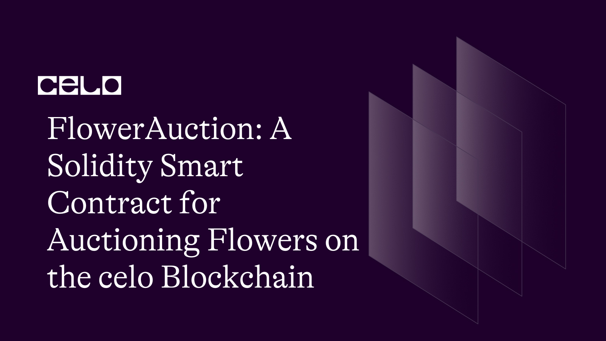

## INTRODUCTION

**What is Celo?**

Celo is a decentralized platform with a goal to enable access to financial tools to people worldwide, particularly in developing markets. The platform uses blockchain technology to secure transactions and enable fast, low-cost, and safe transfers of its stablecoin, CELO. The value of CELO is linked to a basket of national currencies to mitigate fluctuations. The Celo network is maintained by a group of validators who operate the blockchain software and are incentivized with CELO tokens. Additionally, the platform comprises several decentralized applications (dApps) that offer financial services, including remittances, loans, and payments.

## REQUIREMENT

To take this tutorial, you will need:

- Access to a code editor or text editor such as Remix.

- A reliable internet browser and internet connection

## PREREQUISITE

- Basic knowledge of Javascript.
- Understand how Blockchain works.
- Have a basic knowledge of solidity.

## Tutorial Overview

In this tutorial, we will be developing a smart contract for a flower auction platform on the Celo blockchain. The smart contract includes a set of conditions and rules that must be satisfied before a transaction can occur. These conditions include the minimum bid price, the auction duration, and other relevant terms. Once these conditions are met, the smart contract automatically executes the transaction, transferring ownership of the flowers to the highest bidder and the payment to the seller in a secure, transparent, and tamper-proof manner. This eliminates the need for intermediaries and ensures that the auction is fair, efficient, and trustworthy.

Now let's begin writing our smart contract.

To get started, we will create a new file on Remix called `flowerAuction.sol`. Click on this link to learn how to create a new file on Remix [(here)](https://remix-ide.readthedocs.io/en/latest/file_explorer.html#:~:text=Creating%20new%20files,-There%20are%202&text=The%20first%20is%20to%20click,will%20open%20in%20the%20Editor.).

After creating a new file we start by declaring some statements in our smart contract.

```solidity
// SPDX-License-Identifier: MIT

pragma solidity >=0.7.0 <0.9.0;
```

The line `SPDX-License-Identifier: MIT` is an identifier for the license of the code, in this case, the `MIT License`. [The SPDX (Software Package Data Exchange)](https://spdx.dev/) identifier is a standardized way to identify open-source licenses.

The next line is the declaration of the version of the Solidity programming language used in the smart contract, specifically stating that the code is written in Solidity version 0.7.0 or later, but not later than 0.9.0.

Next, we add our ERC20 token interface.

```solidity
interface IERC20Token {
  function transfer(address, uint256) external returns (bool);
  function approve(address, uint256) external returns (bool);
  function transferFrom(address, address, uint256) external returns (bool);
  function totalSupply() external view returns (uint256);
  function balanceOf(address) external view returns (uint256);
  function allowance(address, address) external view returns (uint256);
  event Transfer(address indexed from, address indexed to, uint256 value);
  event Approval(address indexed owner, address indexed spender, uint256 value);
}
```

The **IERC20Token** is an interface in the Ethereum network that defines the standard set of functions that an ERC-20 token contract must implement. It specifies the following functions:

- **transfer**: This function allows the transfer of a specified amount of cUSD tokens from the caller's account to another address.
- **approve**: This function allows the caller to approve a specified address to transfer a specified amount of cUSD tokens from their account.
- **transferFrom**: This function allows us to transfer a specified amount of cUSD tokens from one address to another if the caller has previously approved the transfer.
- **totalSupply**: This function returns the total supply of tokens in the contract.
- **balanceOf**: This function returns the balance of cUSD tokens for a specified address.
- **allowance**: This function returns the amount of cUSD tokens that a specified spender is approved to transfer from a specified owner's account.
- **Transfer**: This is an event that is triggered whenever cUSD tokens are transferred from one address to another.
- **Approval**: This is an event that is triggered whenever a transfer of tokens is approved.

Next, we begin by naming our contract and also creating our struct.

A `struct` in Solidity is a user-defined complex data type that allows you to group multiple variables under a single name. It is used to define a custom type in the contract and can be used to store multiple values of different types under a single object. A struct can contain elements of different data types including other structs, arrays, and mappings. (Learn more about [structs](https://docs.soliditylang.org/en/v0.8.17/types.html#structs))

```solidity
contract FloralAuction {
    struct Flower {
        address payable owner;
        string name;
        string description;
        string image;
        uint initialPrice;
        uint highestBid;
        address highestBidder;
        bool forSale;
        bool sold;
    }
event AuctionEnded(
    address winner,
    address highestBidder,
    uint highestBid
);
```

The FloralAuction contract contains a data structure Flower which represents a flower that can be put up for auction. The Flower structure has several properties such as the current owner, the flower's name, description, image, initial price, current highest bid, highest bidder, and flags for indicating if the flower is for sale or has been sold.

The event AuctionEnded is an event that is emitted when the auction for a flower ends. It contains three parameters: winner which represents the address of the winner of the auction, highestBidder which represents the address of the highest bidder, and highestBid which represents the highest bid made during the auction. The event is useful for external applications that want to be notified when an auction ends, for example, to update the user interface with the latest information about the auction.

Additionally, to interact with the cUSD token on the Celo Alfajores test network, it is necessary to include the address of the token.

```solidity
address internal ownerAddress = 0xb7BF999D966F287Cd6A1541045999aD5f538D3c6;
 address internal cUsdTokenAddress = 0x874069Fa1Eb16D44d622F2e0Ca25eeA172369bC1;
```

Next, we add out mapping

```solidity
 mapping (uint => Flower) internal flowers;
   uint internal flowersLength = 0;
   uint public auctionEndTime;

   constructor() {
       auctionEndTime = block.timestamp + 24 hours;
   }
```

This code initializes a mapping called flowers that maps an unsigned integer (uint) to a Flower struct. The Flower struct contains various details about a flower, such as its owner, name, description, image, initial price, highest bid, highest bidder, and whether it is for sale or sold.

Additionally, the code initializes two unsigned integers: flowersLength and auctionEndTime. flowersLength is set to 0 by default, while auctionEndTime is set to the current block timestamp plus 24 hours.

The constructor function is a special function that is executed only once, when the contract is deployed. In this case, the constructor sets the auctionEndTime to 24 hours after the current block timestamp. This means that the auction will end exactly 24 hours after the contract is deployed.

Furthermore, to make our smart contract more interesting we begin to add functions. The first function we will be adding is the `createFlower` function.

```solidity
    function createFlower(
        string memory _name,
        string memory _description,
        string memory _image,
        uint _price,
        bool _isSale
    ) public {
        flowers[flowersLength] = Flower(
            payable(msg.sender),
            _name,
            _description,
            _image,
            _price,
            0,
            address(0),
            _isSale,
            false
        );
        flowersLength++;
    }
```

The createFlower function is a public function that allows a user to create a new Flower struct in the flowers mapping. The Flower struct has several fields such as owner, name, description, image, initialPrice, highestBid, highestBidder, forSale, and sold.

The function takes in several parameters such as the name of the flower, a description, an image URL, the initial price, and a boolean value indicating whether the flower is for sale or not.

When the function is called, it creates a new Flower struct and assigns the values of the parameters to the appropriate fields. It sets the owner of the flower as the address of the person who called the function (msg.sender) and sets the highestBid to 0, the highestBidder to address(0), indicating that no bids have been made yet.

It also sets the forSale field to the value of the \_isSale parameter, which indicates whether the flower is for sale or not, and sets the sold field to false.

Finally, the function increments the flowersLength variable, which keeps track of the number of flowers that have been added to the mapping. This allows for easy iteration over the flowers mapping when displaying all the flowers available for auction.

Next, we create the `getFlower` function.

```solidity
   function getFlower(uint _index) public view returns (
        address payable,
        string memory,
        string memory,
        string memory,
        uint,
        uint,
        address,
        bool,
        bool
    ) {
        Flower storage flower = flowers[_index];
        return (
            flower.owner,
            flower.name,
            flower.description,
            flower.image,
            flower.initialPrice,
            flower.highestBid,
            flower.highestBidder,
            flower.forSale,
            flower.sold
        );
    }
```

The getFlower function is a public view function that takes an input parameter `_index` which represents the index of the flower to retrieve from the flowers mapping.

When the function is called, it creates a local variable flower of the Flower struct type and assigns it the value of the flower at the \_index position in the flowers mapping.

Then, the function returns a tuple containing the different properties of the flower, such as owner, name, description, image, initialPrice, highestBid, highestBidder, forSale, and sold.

By using this function, other users of the contract can easily view the details of a specific flower listed on the auction platform without having to access the mapping directly.

Next, we add a `bidFlower` function that will enable users to bid for flowers from the blockchain.

```solidity

    function bid(uint _index) public payable {
        require(flowers[_index].forSale, "Flower is not for sale");
        require(block.timestamp < auctionEndTime, "Auction has already ended");

        Flower storage flower = flowers[_index];

        require(msg.value > flower.highestBid, "Bid must be higher than the current highest bid");

        if (flower.highestBidder != address(0)) {
            payable(flower.highestBidder).transfer(flower.highestBid);
        }

        flower.highestBid = msg.value;
        flower.highestBidder = msg.sender;
    }
    }
```

This is the bid function in the FloralAuction contract. This function is used to place a bid on a specific flower identified by its \_index in the flowers mapping.

First, the function checks whether the flower is actually for sale by checking the `forSale` property of the Flower struct. It also checks whether the auction has already ended by comparing the current block timestamp with the auctionEndTime variable.

Next, the function retrieves the Flower struct using the \_index provided, and checks whether the new bid amount is higher than the current highest bid for the flower.

If the new bid is higher, the function transfers the previous highest bid amount to the previous highest bidder (if there was one) using the transfer function of the payable address type.

Finally, the function updates the highestBid and highestBidder properties of the Flower struct to reflect the new highest bid and the bidder who placed it.

Up next is the `endAuction` function.

```solidity
     function endAuction(uint _index) public {
    require(block.timestamp >= auctionEndTime, "Auction has not yet ended");

    Flower storage flower = flowers[_index];

    require(flower.forSale, "Flower is not for sale");
    require(!flower.sold, "Flower has already been sold");

    if (flower.highestBidder == address(0)) {
        // No bids were made, flower remains unsold
        flower.forSale = true;
    } else {
        // Transfer the highest bid to the owner and mark the flower as sold
        require(
            IERC20Token(cUsdTokenAddress).transferFrom(
                flower.highestBidder,
                flower.owner,
                flower.highestBid
            ),
            "Transfer failed"
        );
        flower.forSale = false;
        flower.sold = true;
    }

    // Reset auction parameters
    flower.highestBidder = address(0);
    flower.highestBid = 0;
    auctionEndTime = 0;
    emit AuctionEnded(flower.owner, flower.highestBidder, flower.highestBid);
}
```

This function is used to end the auction for a specific flower identified by its index. The function checks if the auction has ended based on the expiration time, and if it has not yet ended, it will throw an error. Then it checks if the flower is for sale and has not been sold yet. If the flower has not received any bids, it will remain unsold, and the 'forSale' flag is set to true. If there are bids, the highest bidder will transfer the highest bid amount to the owner of the flower using the 'transferFrom' function of the cUSD token contract. The 'forSale' flag is set to false, indicating that the flower is no longer available for purchase, and the 'sold' flag is set to true. Finally, the function resets the auction parameters, including the highest bidder, the highest bid amount, and the auction end time. It also emits an 'AuctionEnded' event, which logs the winner, highest bidder, and highest bid amount.

The complete code for this session is provided below.

```solidity
  // SPDX-License-Identifier: MIT

pragma solidity >=0.7.0 <0.9.0;

// Token Interface
interface IERC20Token {
  function transfer(address, uint256) external returns (bool);
  function approve(address, uint256) external returns (bool);
  function transferFrom(address, address, uint256) external returns (bool);
  function totalSupply() external view returns (uint256);
  function balanceOf(address) external view returns (uint256);
  function allowance(address, address) external view returns (uint256);
  event Transfer(address indexed from, address indexed to, uint256 value);
  event Approval(address indexed owner, address indexed spender, uint256 value);
}

contract FloralAuction {
    struct Flower {
        address payable owner;
        string name;
        string description;
        string image;
        uint initialPrice;
        uint highestBid;
        address highestBidder;
        bool forSale;
        bool sold;
    }
event AuctionEnded(
    address winner,
    address highestBidder,
    uint highestBid
);
    address internal ownerAddress = 0xb7BF999D966F287Cd6A1541045999aD5f538D3c6;
    address internal cUsdTokenAddress = 0x874069Fa1Eb16D44d622F2e0Ca25eeA172369bC1;
    mapping (uint => Flower) internal flowers;
    uint internal flowersLength = 0;
    uint public auctionEndTime;

    constructor() {
        auctionEndTime = block.timestamp + 24 hours;
    }

    function createFlower(
        string memory _name,
        string memory _description,
        string memory _image,
        uint _price,
        bool _isSale
    ) public {
        flowers[flowersLength] = Flower(
            payable(msg.sender),
            _name,
            _description,
            _image,
            _price,
            0,
            address(0),
            _isSale,
            false
        );
        flowersLength++;
    }

    function getFlower(uint _index) public view returns (
        address payable,
        string memory,
        string memory,
        string memory,
        uint,
        uint,
        address,
        bool,
        bool
    ) {
        Flower storage flower = flowers[_index];
        return (
            flower.owner,
            flower.name,
            flower.description,
            flower.image,
            flower.initialPrice,
            flower.highestBid,
            flower.highestBidder,
            flower.forSale,
            flower.sold
        );
    }

    function bid(uint _index) public payable {
        require(flowers[_index].forSale, "Flower is not for sale");
        require(block.timestamp < auctionEndTime, "Auction has already ended");

        Flower storage flower = flowers[_index];

        require(msg.value > flower.highestBid, "Bid must be higher than the current highest bid");

        if (flower.highestBidder != address(0)) {
            payable(flower.highestBidder).transfer(flower.highestBid);
        }

        flower.highestBid = msg.value;
        flower.highestBidder = msg.sender;
    }
 function endAuction(uint _index) public {
    require(block.timestamp >= auctionEndTime, "Auction has not yet ended");

    Flower storage flower = flowers[_index];

    require(flower.forSale, "Flower is not for sale");
    require(!flower.sold, "Flower has already been sold");

    if (flower.highestBidder == address(0)) {
        // No bids were made, flower remains unsold
        flower.forSale = true;
    } else {
        // Transfer the highest bid to the owner and mark the flower as sold
        require(
            IERC20Token(cUsdTokenAddress).transferFrom(
                flower.highestBidder,
                flower.owner,
                flower.highestBid
            ),
            "Transfer failed"
        );
        flower.forSale = false;
        flower.sold = true;
    }

    // Reset auction parameters
    flower.highestBidder = address(0);
    flower.highestBid = 0;
    auctionEndTime = 0;
    emit AuctionEnded(flower.owner, flower.highestBidder, flower.highestBid);
}
}
```

## CONTRACT DEPLOYMENT

To deploy the flower smart contract on the Celo blockchain, you would need the following:

CeloExtensionWallet: Download and install the Celo Extension Wallet from the Google Chrome store, create a wallet, and securely store your key phrase. [Click here to intall the celo extension wallet](https://chrome.google.com/webstore/detail/celoextensionwallet/kkilomkmpmkbdnfelcpgckmpcaemjcdh?hl=en)

Celo Faucet: Fund your wallet by copying your wallet address and pasting it into the Celo Faucet, then confirm. [Click here to access celo faucet](https://faucet.celo.org/)

Celo Remix Plugin: Open Remix and create a new Solidity file, paste the FloraNft contract code into the file, and ensure the Solidity compiler is set to version 0.8.7 or later. [Click here to access to access the remix ide](https://remix.ethereum.org/)

Compile the contract by clicking the "Compile FlowerAuction.sol" button in the Solidity Compiler tab in Remix.

In the "Deploy & Run Transactions" tab, select the Celo network from the dropdown menu, connect your wallet to Remix by clicking "Connect to wallet", and select "FloralNft" from the "Contract" dropdown menu.

Click the "Deploy" button, confirm the transaction in your wallet, and wait for the transaction to be confirmed on the Celo blockchain.

Once the transaction is confirmed, the FloralNft contract will be deployed on the Celo blockchain and you can interact with it using Remix.

## CONCLUSION

Congratulations on your accomplishment! You have done an excellent job of developing a smart contract for the auction of flowers on the Celo blockchain. Well done, and enjoy your success! 🎉

## NEXT STEPS

I trust that you found this tutorial informative and learned a lot from it. If you would like to continue your education, I have provided some helpful links below that you may find useful to explore:

The official Celo documentation:[Click here to access celo docs](https://docs.celo.org/)

Solidity By Example, a website with code examples for learning Solidity: [Click here to learn more about solidity](https://solidity-by-example.org/)

OpenZeppelin Contracts, a library of secure, tested smart contract code: [Click here tp know more about OpenZeppelin Contracts](https://www.openzeppelin.com/contracts/)

Solidity documentation for version 0.8.17: [Click here to access solidity docs](https://docs.soliditylang.org/en/v0.8.17/)

I hope these resources prove to be useful to you!

## About the author

I'm David Ikanji, a web3 developer residing in Nigeria, and I have a strong passion for working with blockchain technology.
