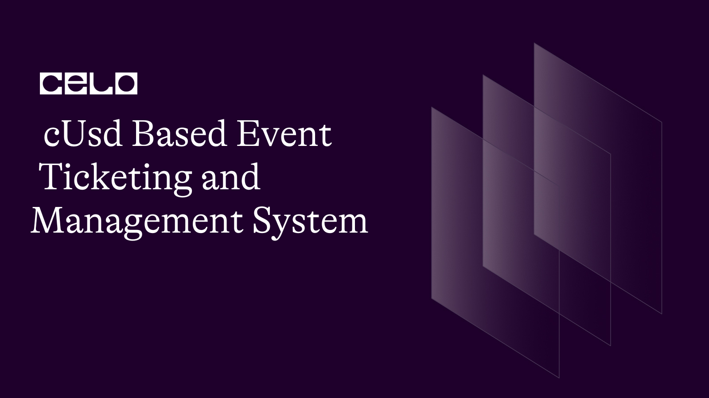

## Introduction

In this tutorial, we will explore the world of blockchain-based event ticketing and management systems built on the Celo blockchain. Specifically, we will focus on a smart contract for a cUSD-based event ticketing and management system. This tutorial will provide you with an introduction to the concept of blockchain event ticketing, and guide you through the process of setting up and interacting with this type of application. Upon completion of this tutorial, you will have the knowledge and skills necessary to start building and utilizing your very own cUSD-based event ticketing and management system smart contract on the Celo blockchain. Let's get started!

## REQUIREMENT

To follow this tutorial, you will require:

- A code editor or text editor such as Remix.

- An internet browser and a stable internet connection.
  
## PREREQUISITE

To successfully complete this tutorial, it is recommended that you have:

- Familiarity with Javascript programming language.
  
- A basic understanding of Blockchain technology and its functioning.
  
- Basic knowledge of the Solidity programming language used for smart contract development on the blockchain.
  
  We will begin by using the Remix IDE to write our smart contract. Let's get started!

  The complete code:

```solidity
   // SPDX-License-Identifier: MIT

pragma solidity >=0.7.0 <0.9.0;

interface IERC20Token {
    function transfer(address, uint256) external returns (bool);

    function approve(address, uint256) external returns (bool);

    function transferFrom(
        address,
        address,
        uint256
    ) external returns (bool);

    function totalSupply() external view returns (uint256);

    function balanceOf(address) external view returns (uint256);

    function allowance(address, address) external view returns (uint256);

    event Transfer(address indexed from, address indexed to, uint256 value);
    event Approval(
        address indexed owner,
        address indexed spender,
        uint256 value
    );
}

contract Evently {
    uint private eventsLength = 0;
    address internal cUsdTokenAddress =
        0x874069Fa1Eb16D44d622F2e0Ca25eeA172369bC1;

    struct Event {
        address payable owner;
        string image;
        string theme;
        string location;
        uint follow;
        uint price;
        bool sale;
        mapping(address => bool) hasFollowed;

    }

    mapping(uint => Event) internal events;
    mapping(uint => bool) private exists;

    modifier checkPrice(uint _price) {
        require(_price > 0, "Price needs to be at least one wei");
        _;
    }

    modifier checkStatus(uint _index) {
        require(events[_index].sale, "Not on sale");
        _;
    }

    modifier exist(uint _index) {
        require(exists[_index], "Query of nonexistent event");
        _;
    }

    function getEvent(uint _index)
        public
        view
        returns (
            address payable owner,
            string memory image,
            string memory theme,
            string memory location,
            uint follow,
            uint price,
            bool sale,
            bool hasFollowed
        )
    {
        owner = events[_index].owner;
        image = events[_index].image;
        theme = events[_index].theme;
        location = events[_index].location;
        follow = events[_index].follow;
        price = events[_index].price;
        sale = events[_index].sale;
        hasFollowed = events[_index].hasFollowed[msg.sender];
    }

    /// @dev allows users to create an event
    function createEvent(
        string calldata _image,
        string calldata _theme,
        string calldata _location,
        uint _price
    ) external checkPrice(_price) {
        require(bytes(_image).length > 0, "Empty image url");
        require(bytes(_theme).length > 0, "Empty theme");
        require(bytes(_location).length > 0, "Empty location");

        Event storage Evento = events[eventsLength];
        exists[eventsLength] = true;
        eventsLength++;
        Evento.owner = payable(msg.sender);
        Evento.image = _image;
        Evento.theme = _theme;
        Evento.location = _location;
        Evento.price = _price;
        Evento.sale = true;
    }

    /// @dev allows users to buy an event
    function buyEvent(uint _index)
        public
        payable
        exist(_index)
        checkStatus(_index)
    {
        require(events[_index].owner != msg.sender, "Owners can't buy tickets");
        require(
            IERC20Token(cUsdTokenAddress).transferFrom(
                msg.sender,
                events[_index].owner,
                events[_index].price
            ),
            "Transfer failed."
        );

        events[_index].owner = payable(msg.sender);
        events[_index].sale = false;
    }

    /// @dev allows users to put an event back on sale or out of sale
    function toggleSale(uint _index) public exist(_index) {
        require(events[_index].owner == msg.sender, "Owners can't buy tickets");
        events[_index].sale = !events[_index].sale;
    }

    function changePrice(uint _index, uint _price)
        public
        exist(_index)
        checkPrice(_price)
        checkStatus(_index)
    {
        require(events[_index].owner == msg.sender, "Owners can't buy tickets");
        events[_index].sale = !events[_index].sale;
    }

    function followEvent(uint _index) public exist(_index) {
        require(
            events[_index].hasFollowed[msg.sender] == false,
            "User can follow the event only once"
        );
        events[_index].follow++;
        events[_index].hasFollowed[msg.sender] = true;
    }

    function unfollowEvent(uint _index) public exist(_index) {
        require(
            events[_index].hasFollowed[msg.sender],
            "User isn't following this event"
        );
        events[_index].follow--;
        events[_index].hasFollowed[msg.sender] = false;
    }


    function getEventsLength() public view returns (uint) {
      return eventsLength;
    }
}

```

## Analyzing the code

```solidity
// SPDX-License-Identifier: MIT
pragma solidity >=0.7.0 <0.9.0;
```

We start with this two directives that play a significant role. The first directive specifies the open-source license that governs the usage of the code, while the second one indicates the range of Solidity versions that are compatible with the code. Using these directives helps ensure that the code is appropriately licensed and can be compiled using the intended Solidity version range.

```solidity
interface IERC20Token {
    function transfer(address, uint256) external returns (bool);

    function approve(address, uint256) external returns (bool);

    function transferFrom(
        address,
        address,
        uint256
    ) external returns (bool);

    function totalSupply() external view returns (uint256);

    function balanceOf(address) external view returns (uint256);

    function allowance(address, address) external view returns (uint256);

    event Transfer(address indexed from, address indexed to, uint256 value);
    event Approval(
        address indexed owner,
        address indexed spender,
        uint256 value
    );
}
```

The code above is an interface definition for an ERC20 token on the Celo blockchain. ERC20 is a standard used for creating tokens on the Celo blockchain. An interface definition specifies how to interact with a smart contract on the blockchain.

The code outlines six essential functions that a Celo ERC20 token contract should implement, including transfer, approve, and transferFrom. These functions enable users to transfer tokens to other addresses, authorize other addresses to spend tokens on their behalf, and move tokens from one address to another.

The code also includes three functions for retrieving information about a Celo ERC20 token contract, including totalSupply, balanceOf, and allowance. These functions provide insights into the total supply of tokens, the balance of tokens held by an address, and the amount of tokens authorized for spending by a specific address.

Finally, the code has two events that are triggered when a token transfer or approval occurs, enabling external applications to receive notifications when a token transfer or approval occurs on the Celo blockchain.

```solidity
contract Evently {
    uint private eventsLength = 0;
    address internal cUsdTokenAddress =
        0x874069Fa1Eb16D44d622F2e0Ca25eeA172369bC1;

    struct Event {
        address payable owner;
        string image;
        string theme;
        string location;
        uint follow;
        uint price;
        bool sale;
        mapping(address => bool) hasFollowed;

    }
```

We begin by declaring the name of our contract called `Evently` that initializes a private variable named `eventsLength` to zero. The contract also has an internal address variable `cUsdTokenAddress`, which is assigned a specific address on the Celo blockchain.

Furthermore, we declare a struct named `Event`, which has several properties such as `owner`, `image`, `theme`, `location`, `follow`, `price`, `sale`, and a mapping named `hasFollowed`. The `owner` property is the address of the event owner, while the `image`, `theme`, and `location` properties store details such as image URL, theme, and location of the event. The `follow` property counts the number of people following the event, while the `price` property holds the price of the event ticket in cUSD. The "sale" property is a boolean flag indicating whether the event tickets are on sale or not. The `hasFollowed` mapping is used to track the addresses that have followed the event.

```solidity
 mapping(uint => Event) internal events;
    mapping(uint => bool) private exists;

    modifier checkPrice(uint _price) {
        require(_price > 0, "Price needs to be at least one wei");
        _;
    }

    modifier checkStatus(uint _index) {
        require(events[_index].sale, "Not on sale");
        _;
    }

    modifier exist(uint _index) {
        require(exists[_index], "Query of nonexistent event");
        _;
    }

```

Now we add our mappings and three modifiers. The `events` mapping will be used to store events, where each event is identified by a unique index number. The `exists` mapping will be used to keep track of whether an event with a particular index number exists or not.

The first modifier named `checkPrice` help to check if the price of an event is greater than zero, and if not, it throws an error with a message stating that the price should be at least one wei.

The second modifier named `checkStatus` help to check if an event with a particular index number is currently on sale or not on sale. If the event is not on sale, the modifier will throw an error with a message stating that the event is not available for purchase.

The third modifier named `exist` also help to check if an event with a particular index number exists in the `events` mapping or not. If the event does not exist, the modifier throws an error with a message stating that the queried event does not exist.

```solidity
    function getEvent(uint _index)
        public
        view
        returns (
            address payable owner,
            string memory image,
            string memory theme,
            string memory location,
            uint follow,
            uint price,
            bool sale,
            bool hasFollowed
        )
    {
        owner = events[_index].owner;
        image = events[_index].image;
        theme = events[_index].theme;
        location = events[_index].location;
        follow = events[_index].follow;
        price = events[_index].price;
        sale = events[_index].sale;
        hasFollowed = events[_index].hasFollowed[msg.sender];
    }

```

The `getEvent` function is a public and view function in our contract that takes an unsigned integer parameter called `_index` representing the index of an event to retrieve. This function does not change the state of the contract and can be called externally by any account.

The function returns eight values, declared using tuple notation, that correspond to specific data associated with the event at the given index. These include the event owner's address, an image URL, the event's theme or name, location, number of followers, price in cUsd, sale status, and whether the caller has followed the event or not.

To retrieve these values, the function accesses an array called `events` at the given index and retrieves the corresponding values. The events array is a data structure that stores information about each event, including its owner, image, theme, location, follow count, price, sale status, and a mapping of whether each account has followed the event or not.

The function returns the values as a tuple, which can be unpacked by the caller to access each individual value.

Furthermore, we add the `createEvent` function that will be used to add events to the blockchain, and the `buyEvent` function that will be used to buy event tickets on the blockchain.

```solidity
  function createEvent(
        string calldata _image,
        string calldata _theme,
        string calldata _location,
        uint _price
    ) external checkPrice(_price) {
        require(bytes(_image).length > 0, "Empty image url");
        require(bytes(_theme).length > 0, "Empty theme");
        require(bytes(_location).length > 0, "Empty location");

        Event storage Evento = events[eventsLength];
        exists[eventsLength] = true;
        eventsLength++;
        Evento.owner = payable(msg.sender);
        Evento.image = _image;
        Evento.theme = _theme;
        Evento.location = _location;
        Evento.price = _price;
        Evento.sale = true;
    }

    /// @dev allows users to buy an event
    function buyEvent(uint _index)
        public
        payable
        exist(_index)
        checkStatus(_index)
    {
        require(events[_index].owner != msg.sender, "Owners can't buy tickets");
        require(
            IERC20Token(cUsdTokenAddress).transferFrom(
                msg.sender,
                events[_index].owner,
                events[_index].price
            ),
            "Transfer failed."
        );

        events[_index].owner = payable(msg.sender);
        events[_index].sale = false;
    }

```

Next, we add two functions that will help in creating and buying events. The `createEvent()` function lets the contract owner create an event by providing an `image URL`, `theme`, `location`, and `price`. The function works by first checking that the price is greater than zero and that the image URL, theme, and location are not empty. If the conditions are met, the function creates a new event and adds it to an events array.

The `buyEvent()` function lets users buy an event from the events array by specifying the index of the event they want to purchase. Before executing, the function assist to check that the event exists and is available for purchase, and that the caller of the function is not already the owner of the event. If all these conditions are met, the function transfers the event price from the caller to the event owner using the `transferFrom()` function. If the transfer succeeds, the function updates the event owner and marks the event as sold. If the transfer fails, the function throws an error.

Next, we add a function that will be used to `togglesale` and `changePrice`.

```solidity
 /// @dev allows users to put an event back on sale or out of sale
    function toggleSale(uint _index) public exist(_index) {
        require(events[_index].owner == msg.sender, "Owners can't buy tickets");
        events[_index].sale = !events[_index].sale;
    }

    function changePrice(uint _index, uint _price)
        public
        exist(_index)
        checkPrice(_price)
        checkStatus(_index)
    {
        require(events[_index].owner == msg.sender, "Owners can't buy tickets");
        events[_index].sale = !events[_index].sale;
    }

```

The first function, named `toggleSale`, will take in one argument `_index` and will allow users to put an event back on sale or out of sale. The function first checks whether the event exists by calling the exist modifier. Then, it verifies that the caller of the function is the owner of the event by comparing their addresses with msg.sender. If the owner is not the caller, the function throws an error message. Otherwise, it toggles the sale property of the event by negating its current value using the ! operator.

Next we add another function named `changePrice`, this function takes two arguments `_index` and `_price` and allows the owner of an event to change its price. Similar to the previous function, this function also first checks whether the event `exists`, and then it applies two modifiers, `checkPrice` and `checkStatus`, to ensure that the new price is valid and the event is not canceled. Then, it verifies that the caller of the function is the owner of the event. If not, the function throws an error message. Otherwise, it sets the sale property of the event to false to take it out of sale, and updates the price property of the event with the new price provided by the caller.

```solidity
  function followEvent(uint _index) public exist(_index) {
        require(
            events[_index].hasFollowed[msg.sender] == false,
            "User can follow the event only once"
        );
        events[_index].follow++;
        events[_index].hasFollowed[msg.sender] = true;
    }

    function unfollowEvent(uint _index) public exist(_index) {
        require(
            events[_index].hasFollowed[msg.sender],
            "User isn't following this event"
        );
        events[_index].follow--;
        events[_index].hasFollowed[msg.sender] = false;
    }


    function getEventsLength() public view returns (uint) {
      return eventsLength;
    }
}
```

Finally, we add this three functions, namely `followEvent`, `unfollowEvent`, and `getEventsLength`.

The `followEvent`, this function takes an input parameter `_index`, which is an unsigned integer representing the index of an event in an array of events. This function is used to allow users to follow a specific event identified by the given index.

The function first checks if the event exists at the given index by calling the exist modifier (not shown in the code snippet). If the event exists, itthen check if the user has already followed the event by checking the value of the `hasFollowed` mapping associated with the event and the user's address. If the user has not followed the event, the function increments the follow counter associated with the event and updates the hasFollowed mapping to indicate that the user has followed the event.

The `unfollowEvent` function takes an input parameter _index similar to followEvent and is used to allow users to unfollow a specific event identified by the given index.

Similar to followEvent, the function first checks if the event exists at the given index and then checks if the user has already followed the event. If the user has followed the event, the function decrements the follow counter associated with the event and updates the hasFollowed mapping to indicate that the user has unfollowed the event.

The `getEventsLength` function. This is a public view function that returns the total number of events that is currently stored in the contract's state variable eventsLength. This function does not modify the state of the contract and can be called by anyone without requiring any gas fees.

## CONTRACT DEPLOYMENT

In order to deploy the Event smart contract on the Celo blockchain, several things are required such as:

To ensure a smooth deployment of our smart contract, it is essential to download the Celo extension wallet from the given link, [Celo Extension wallet](https://chrome.google.com/webstore/detail/celoextensionwallet/kkilomkmpmkbdnfelcpgckmpcaemjcdh?hl=en). Once done, the next step is to fund the wallet that we have created, [Celo faucet](https://faucet.celo.org/). This can be accomplished by accessing the Celo Alfojares faucet using the provided link.

With our wallet funded, we can now proceed to deploy the smart contract using the Celo plugin available in Remix.

## CONCLUSION

Great work on completing the smart contract for the sale of event tickets on the Celo blockchain! Your achievement is impressive, and I want to congratulate you on your success. You can now feel proud of yourself and enjoy the results of your hard work. Keep up the good work! 🎉

## Next step

Great job! It's always helpful to provide additional resources for further learning. Don't hesitate to reach out if you have any more questions or if you need further assistance, you can reach out to me on twitter by clicking [this link](https://twitter.com/thompsonogoyi). Happy learning!

## About the author

My name is Ogoyi Thompson, and I'm a web3 developer based in Nigeria. I am enthusiastic about working with blockchain technology.
