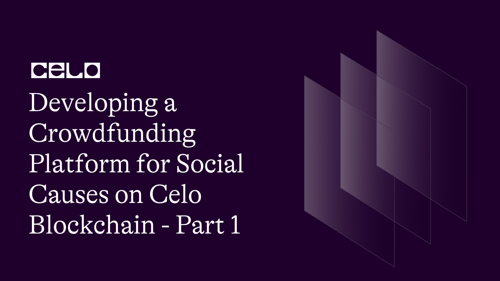

## 🌱 Introduction

Crowdfunding has emerged as a popular and effective way to raise funds for social causes. However, traditional crowdfunding platforms charge high fees and lack transparency, which can make it difficult for people to trust them with their donations. To address these issues, we can leverage the Celo blockchain to develop a decentralized crowdfunding platform for social causes that is transparent, secure, and cost-effective. In this blog post, we will explore how to develop such a platform on the Celo blockchain, and we will provide the Solidity code to implement it.

## Overview of the Platform

The platform we will develop will allow anyone to create a campaign to raise funds for a social cause. Donors will be able to donate to these campaigns using Celo Dollars (cUSD) or Celo Gold (cGLD), and their donations will be recorded on the Celo blockchain, making the platform transparent and secure. The platform will also be governed by a smart contract, which will ensure that funds are distributed fairly and that campaigns are legitimate.

Let's get started!

## 🗈 Prerequisites

- A computer with an internet connection. You will need a computer with a stable internet connection to follow along with this guide.

- Basic knowledge of programming. While we will provide step-by-step instructions, it will be helpful to have some basic knowledge of programming languages such as JavaScript and Solidity.

- Node.js and npm installed. You will need to have Node.js and npm (the package manager for Node.js) installed on your computer. You can check if you have them installed by running the following commands in your terminal:

```bash
node -v
npm -v
```

- A code editor. You will need a code editor to write and edit your code. Some popular options include Visual Studio Code and Atom.
- A Metamask account. You will need a Metamask account to interact with the Celo blockchain from your web browser. If you don't already have one, you can create one by installing the Metamask extension for Chrome or Firefox.

## ⚠️ Requirements

- Truffle: a development environment, testing framework, and asset pipeline for Ethereum
- Node.js: a JavaScript runtime that allows you to run JavaScript on the command line
- Yarn: a package manager for JavaScript
- next: Next.js is a framework for building server-rendered or statically-exported React applications.
- CeloCli - The celocli lets you interact with the Celo Protocol smart contracts.

## What is Crowd Funding 

Crowdfunding is a method of raising funds for a project or venture by soliciting contributions from a large number of people, typically via the internet. It allows individuals, businesses, and organizations to obtain financial support from a large pool of people, instead of seeking funding from a single source, such as a bank or venture capitalist. Crowdfunding can be used to support a wide range of projects, including creative works, social causes, and entrepreneurial ventures. It often involves using a dedicated online platform that connects project creators with potential backers or donors, who can make contributions of varying amounts to support the project. Crowdfunding can be an effective way to raise funds, as it allows people to reach out to a large audience of potential supporters and tap into the power of social networks.

**_ Let's start building the future together! _**

:::tip
To learn more about setting up the environment to create Crowd Funding Project , check out the **[step-by-step guide to deploying your first full-stack dApp on Celo](https://docs.celo.org/blog/tutorials/step-by-step-guide-to-deploying-your-first-full-stack-dapp-on-celo#steps-to-set-up-the-truffle-project-and-its-configs)**, which provides detailed instructions on getting started.
:::

## Writing the Smart Contract

**The smart contract for our crowdfunding platform will handle contributions and withdrawals of funds, as well as keeping track of the total amount raised and the goal amount. We will also implement a mechanism for withdrawing funds only when the owner of smart is withdrawing its gonna withdraw the amount.**

- We Gonna Create 2 Files 1. Gonna be `FundraiserFactory.sol` and 2. Gonna be `Fundraiser.sol`.

- **`FundraiserFactory.sol`**

```solidity
// SPDX-License-Identifier: MIT
pragma solidity ^0.8.0;

import "./Fundraiser.sol";

contract FundraiserFactory {
    Fundraiser[] private _fundraisers;

    event FundraiserCreated(
        Fundraiser indexed fundraiser,
        address indexed owner
    );

    uint256 constant maxLimit = 20;

    uint256 public currentId;

    function createFundraiser(
        string memory name,
        string[] memory images,
        string[] memory categories,
        string memory description,
        string memory region,
        address payable beneficiary,
        uint256 goal
    ) public {
        Fundraiser fundraiser = new Fundraiser(
            currentId,
            name,
            images,
            categories,
            description,
            region,
            beneficiary,
            msg.sender,
            goal
        );
        _fundraisers.push(fundraiser);
        currentId += 1;
        emit FundraiserCreated(fundraiser, msg.sender);
    }

    // Query the number of fundrisers in our smart contract
    function fundraisersCount() public view returns (uint256) {
        return _fundraisers.length;
    }

    // Query all fundraisers in our smart contract
    function fundraisers(
        uint256 limit,
        uint256 offset
    ) public view returns (Fundraiser[] memory coll) {
        require(offset <= fundraisersCount(), "offset out of bounds");
        uint256 size = fundraisersCount() - offset;
        // size should not exceed the maxLimit
        size = size < limit ? size : limit;
        size = size < maxLimit ? size : maxLimit;
        coll = new Fundraiser[](size);

        for (uint256 i = 0; i < size; i++) {
            coll[i] = _fundraisers[offset + i];
        }

        return coll;
    }
}
```

- This is a smart contract written in the Solidity programming language for a Fundraiser Factory.

- The first line // SPDX-License-Identifier: MIT is a special SPDX identifier comment that specifies the license under which the code is released.

- The pragma solidity ^0.8.0; line specifies the version of the Solidity compiler that should be used to compile the code.

- The import "./Fundraiser.sol"; statement imports a smart contract called Fundraiser.sol.

- The FundraiserFactory contract contains a private array _fundraisers to store instances of the Fundraiser smart contract. It also has an event FundraiserCreated that is emitted whenever a new fundraiser is created. The maxLimit constant specifies the maximum number of fundraisers that can be queried at once, and the currentId variable keeps track of the ID of the next fundraiser to be created.

- The createFundraiser function creates a new instance of the Fundraiser contract and adds it to the _fundraisers array. It takes several parameters including the name, images, categories, description, region, beneficiary, and fundraising goal for the new fundraiser.

- The fundraisersCount function returns the number of fundraisers in the _fundraisers array.

- The fundraisers function takes two parameters, limit and offset, and returns an array of fundraisers up to limit in size, starting from the offset index. It checks that the offset parameter is within bounds and limits the size of the returned array to maxLimit.

- **`Fundraiser.sol`**

```solidity
// SPDX-License-Identifier: MIT
pragma solidity ^0.8.0;

import "@openzeppelin/contracts/access/Ownable.sol";
import "@openzeppelin/contracts/utils/math/SafeMath.sol";

contract Fundraiser is Ownable {
    using SafeMath for uint256;

    struct Donation {
        uint256 value;
        //uint256 conversionFactor;
        uint256 date;
    }

    struct allDonation {
        address donor;
        uint256 value;
        uint256 date;
    }

    mapping(address => Donation[]) private _donations;
    mapping(uint256 => allDonation[]) private _allDonations;

    event DonationReceived(address indexed donor, uint256 value);
    event Withdraw(uint256 amount);

    uint256 public id;
    string public name;
    string[] public images;
    string[] public categories;
    string public description;
    string public region;
    address payable public beneficiary;
    address public custodian;
    uint256 public totalDonations;
    uint256 public totalDonationsCount;
    uint256 public donationsCount;
    uint256 public goal;

    constructor(
        uint256 _id,
        string memory _name,
        string[] memory _images,
        string[] memory _categories,
        string memory _description,
        string memory _region,
        address payable _beneficiary,
        address _custodian,
        uint256 _goal
    ) {
        id = _id;
        name = _name;
        images = _images;
        categories = _categories;
        description = _description;
        region = _region;
        beneficiary = _beneficiary;
        _transferOwnership(_custodian);
        goal = _goal;
    }

    // Set New Beneficiary of a fundraiser
    function setBeneficiary(address payable _beneficiary) public onlyOwner {
        beneficiary = _beneficiary;
    }

    function getImageUrls() public view returns (string[] memory) {
        return images;
    }

    function getCategories() public view returns (string[] memory) {
        return categories;
    }

    // Query My Donations count
    function myDonationsCount() public view returns (uint256) {
        return _donations[msg.sender].length;
    }

    // Query all Donations count
    function allDonationsCount() public view returns (uint256) {
        return _allDonations[id].length;
    }

    // Make a donation
    function donate() public payable {
        Donation memory donation = Donation({
            value: msg.value,
            date: block.timestamp
        });

        allDonation memory AllDonations = allDonation({
            donor: msg.sender,
            value: msg.value,
            date: block.timestamp
        });

        _donations[msg.sender].push(donation);
        _allDonations[id].push(AllDonations);
        totalDonations = totalDonations.add(msg.value);
        donationsCount = donationsCount + 1;
        totalDonationsCount = totalDonationsCount + 1;

        emit DonationReceived(msg.sender, msg.value);
    }

    // Query my donations
    function myDonations()
        public
        view
        returns (uint256[] memory values, uint256[] memory dates)
    {
        uint256 count = myDonationsCount();
        values = new uint256[](count);
        dates = new uint256[](count);

        for (uint256 i = 0; i < count; i++) {
            Donation storage donation = _donations[msg.sender][i];
            values[i] = donation.value;
            dates[i] = donation.date;
        }

        return (values, dates);
    }

    // Query all donations
    function allDonations()
        public
        view
        returns (
            address[] memory donors,
            uint256[] memory values,
            uint256[] memory dates
        )
    {
        uint256 count = allDonationsCount();
        donors = new address[](count);
        values = new uint256[](count);
        dates = new uint256[](count);

        for (uint256 i = 0; i < count; i++) {
            allDonation storage AllDonation = _allDonations[id][i];
            donors[i] = AllDonation.donor;
            values[i] = AllDonation.value;
            dates[i] = AllDonation.date;
        }

        return (donors, values, dates);
    }

    // Withdraw Function
    function withdraw() public onlyOwner {
        uint balance = address(this).balance;
        beneficiary.transfer(balance);

        emit Withdraw(balance);
    }

    receive() external payable {
        totalDonations = totalDonations.add(msg.value);
        donationsCount++;
    }
}
```

- **This is a Solidity smart contract that implements a fundraising platform. It allows people to donate funds to a specific cause or campaign, and tracks the donations made by individuals and the total amount of donations made towards the campaign.**

- The contract defines a Donation struct, which contains the value of the donation and the date it was made. It also defines an allDonation struct, which includes the donor address, value of the donation and date it was made.

- The contract contains two mappings, _donations and _allDonations, which track the donations made by each address and all donations made towards the campaign respectively.

- The contract includes functions to make a donation, get the number of donations made by an address, get the number of all donations made, get the list of all donations made, and withdraw funds from the contract.

- The contract is owned by an address, which has the ability to change the beneficiary of the fundraiser, i.e., the address to which the funds will be transferred after the fundraising campaign is complete.

- The contract is also integrated with the OpenZeppelin libraries for Ownable and SafeMath. The Ownable library allows the contract owner to have special privileges, while the SafeMath library is used to perform safe arithmetic operations to avoid integer overflow or underflow vulnerabilities.

- The contract includes a license declaration using SPDX, which is a standardized way of identifying open source licenses in source code. In this case, the contract is licensed under the MIT license.

- Function `setBeneficiary(address payable _beneficiary)`

This function is used to set the new beneficiary of the fundraiser. Only the owner of the contract can call this function.

- Function `getImageUrls()`

This function is used to get the URLs of the images associated with the fundraiser.

- Function `getCategories()`

This function is used to get the categories associated with the fundraiser.

- Function `myDonationsCount()`

This function is used to get the count of donations made by the caller of the function.

- Function `allDonationsCount()`

This function is used to get the count of all donations made to the fundraiser.

- Function `donate()`

This function is used to make a donation to the fundraiser. It creates a Donation struct to store the value of the donation and the timestamp of the donation. It also creates an allDonation struct to store the address of the donor, the value of the donation, and the timestamp of the donation. The Donation struct is stored in the _donations mapping with the address of the donor as the key. The allDonation struct is stored in the _allDonations mapping with the ID of the fundraiser as the key. The value of the donation is added to the totalDonations variable, and the donationsCount and totalDonationsCount variables are incremented. Finally, an event DonationReceived is emitted with the address of the donor and the value of the donation as the parameters.

- Function `myDonations()`

This function is used to get the values and timestamps of all the donations made by the caller of the function.

- Function `allDonations()`

This function is used to get the addresses, values, and timestamps of all the donations made to the fundraiser.

- Function `withdraw()`

This function is used to withdraw the balance of the contract to the beneficiary. Only the owner of the contract can call this function.

- Function `receive()`

This function is called when ether is sent to the contract without a function call. It increments the totalDonations and donationsCount variables with the value of the donation.

## Conclusion
In this tutorial, we have developed a crowdfunding platform for social causes on the Celo blockchain. We used Truffle and React to build the smart contract and the front-end of the platform. We also deployed the smart contract to the Celo blockchain using Truffle.
By using Celo, we can ensure that the crowdfunding platform is transparent, secure, and accessible to everyone, regardless of their location or financial status. We hope that this tutorial has been helpful in understanding how to develop decentralized applications on the Celo blockchain.

**In conclusion, Part 1 of this tutorial has covered the Solidity code for developing a crowdfunding platform for social causes on the Celo blockchain. Stay tuned for Part 2, where we will dive into the frontend development of the platform.**

## About Author

Hi! My name is Kunal Dawar and I am a Full Stack web2/web3 Developer. I have participated in numerous hackathons and have been fortunate enough to win many of them.

One thing that I am truly passionate about is creating things that are reliable and don't break easily. I believe that creating high-quality products is important not only for the users but also for the overall growth and success of a business.

In my free time, I enjoy learning about new technologies and staying up-to-date with the latest trends in the field. I also love to share my knowledge with others and mentor those who are interested in pursuing a career in web development.