## Table of Content
- [How to deploy a celo composer application on spheron protocol(decentralized cloud storage).](#how-to-deploy-a-celo-composer-application-on-spheron-protocol)
  - [Introduction](#introduction)
  - [Table of Content](#table-of-content)
  - [Prerequisites](#prerequisites​)
  - [Celo Composer](#celo-composer)
  - [Spheron Protocol](#spheron-protocol)
  - [Getting Started](#getting-started)
  - [Upload Project to Github](#bootstrap-the-application)
  - [Deploying the App on Spheron](#deploying-the-app-on-spheron)
  - [Testing the App](#testing-the-app)
  - [Conclusion](#conclusion)
  - [About the Author](#about-the-author)
  - [Resources](#resources)

## Introduction

In this tutorial, we will be learning how to deploy a dapp built using celo composer on a decentalised cloud service called spheron protocol.


## Prerequisites​

To start building, you’ll need a basic understanding of web development, Node (v12), yarn, and Git.

- [Node (v12)](https://nodejs.org/en/), [NVM](https://github.com/nvm-sh/nvm)
- [Yarn](https://classic.yarnpkg.com/en/)
- [Git](https://git-scm.com/)

  
## Celo Composer

The easiest way to get started with Celo Composer is using `@celo/celo-composer`
. This CLI tool enables you to quickly start building dApps on Celo for multiple frameworks including React, React Native (w/o Expo), Flutter, and Angular. You can create the dApp using the default Composer templates provided by Celo. In our case, we will work with react, specifically NextJS. The stack included in celo composer:

- [NextJS](https://nextjs.org/) - React framework
- [Typescript](https://www.typescriptlang.org/)
- [React Celo](https://github.com/celo-org/react-celo)
- [TailwindCSS](https://tailwindcss.com/) for styling
- [Hardhat](https://hardhat.org/) Smart contract development environment

## Spheron Protocol
[Spheron Protocol](https://spheron.network/) is an all-in-one decentralized platform for automating modern dapps.

They provide a frictionless developer experience to take care of the hard things: deploying instantly, scaling automatically, and serving personalized content on decentralized networks.


Let's start building:
---

## Getting Started

1. Bootstrap the application using this Celo Composer command.

```bash
npx @celo/celo-composer create
```

2. Select *React* framework(NextJS)

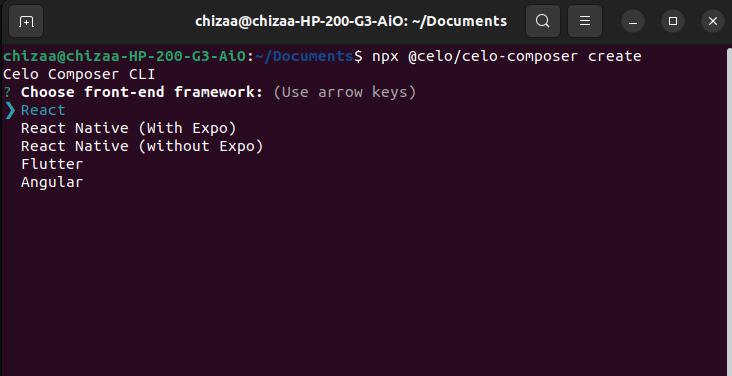

3. Select *react-celo* as the web3 library

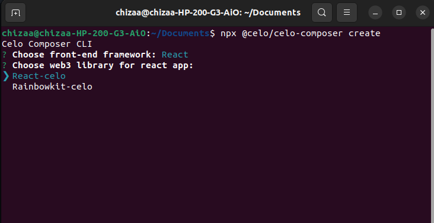

4. Select *none* for the smart contract framework since we’ll be working with the 0x Protocol API.

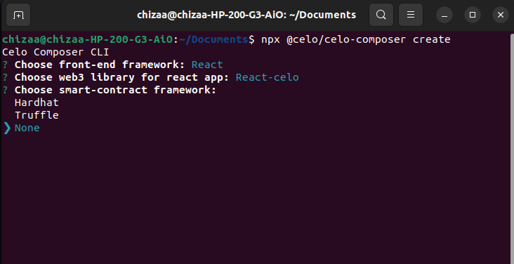

5. Select *No* for subgraph
    
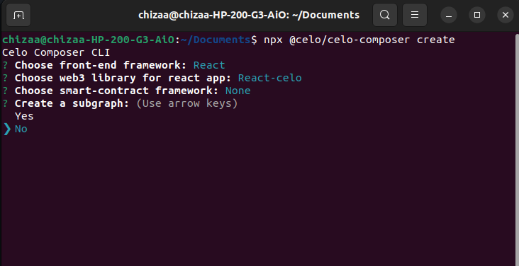
    

6. Give a name to your project and you are done.


Launch the app in your code editor then install the dependencies required in the project. In the root directory, run 

```bash
yarn 

//or

npm install
```

---

## Upload Project to Github


### **Navigate to your repositories**

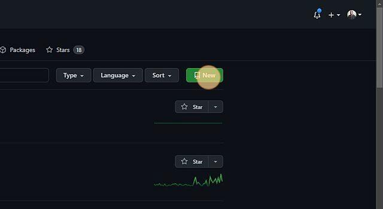

### **Input your repository name.**

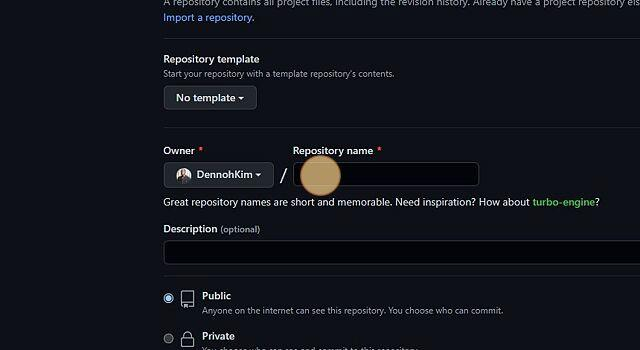

### **Click on create repository or press enter.**

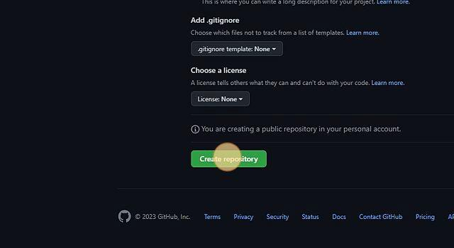

### **Follow the guide to upload your project on github**

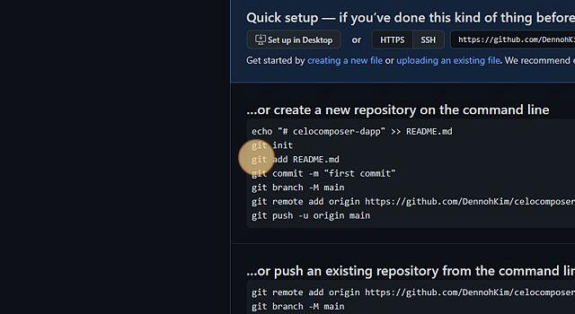

---
<br>

## Deploying the App on Spheron

### Navigate to [https://spheron.network/](https://spheron.network/)

<br>

### **Click "Deploy Now”**

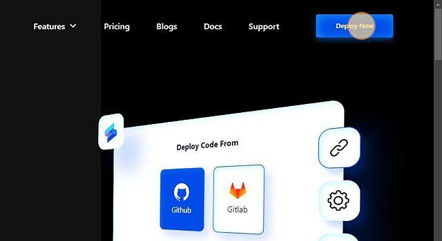

<br>

### **Click "Sign Up”**


<br>

### **Click "Continue with GitHub”**

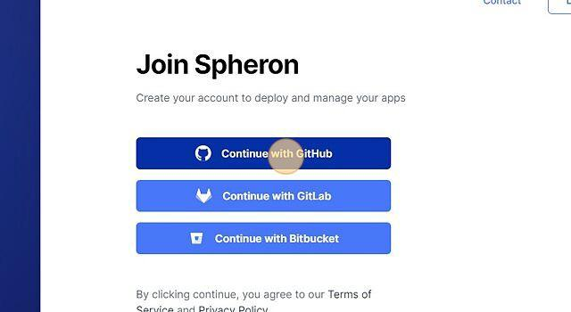
<br>

### **Select an organisation of your choice.**

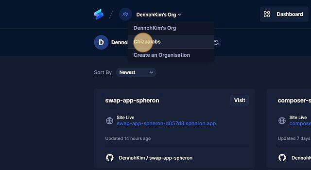
<br>

### **Click "New Project”**

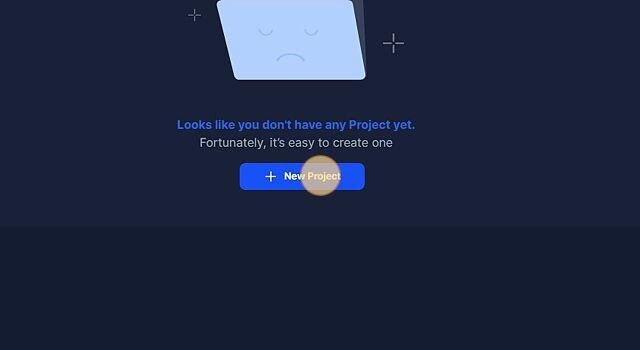
<br>

### **Click "Github”**

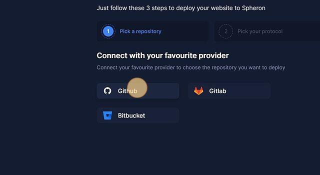
<br>

### **Pick the github account.**

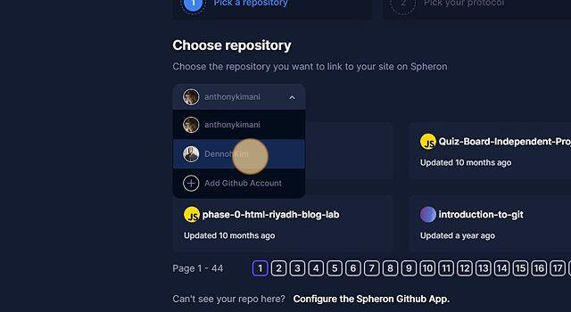
<br>

### **Click the "Search repository" field and search the repository that you want to deploy.**

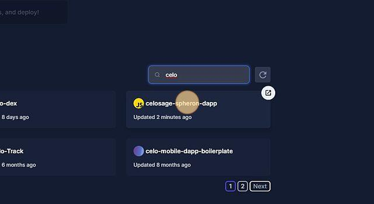
<br>

### **Select "Filecoin" or "IPFS”**

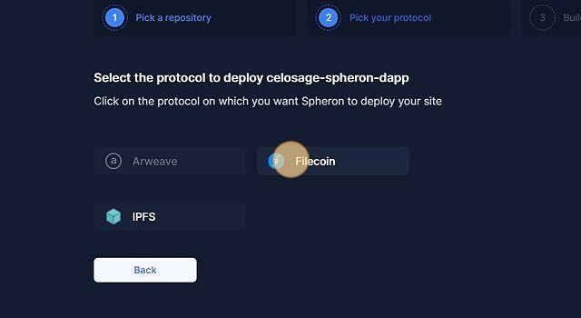
<br>

### **Input the directory with react application which is "packages/react-app”**

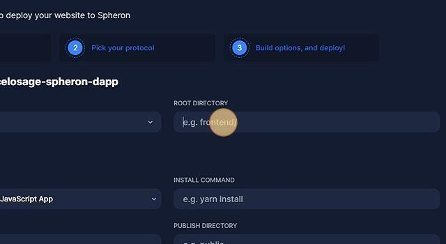
<br>

### **Select NextJS.**

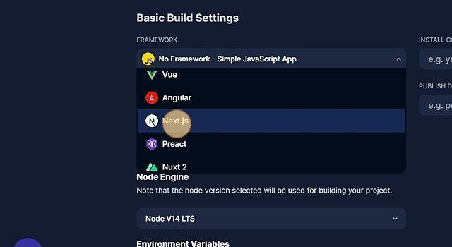
<br>

### **Click "Deploy”**

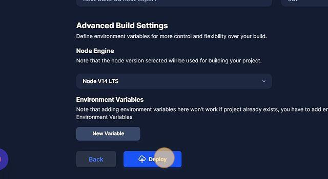
<br>

### **Check the logs for the installation process.**

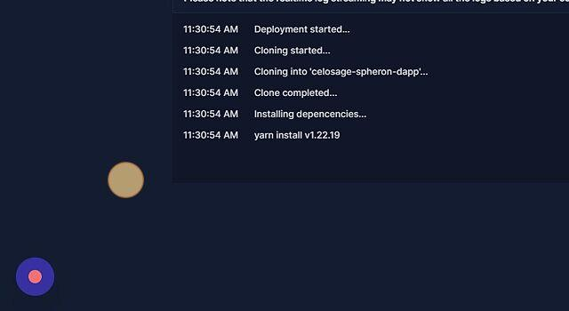
<br>

---

## Testing the App

### **Click [celosage-spheron-dapp-c0ebae.spheron.app](celosage-spheron-dapp-c0ebae.spheron.app) to view your deployed site**

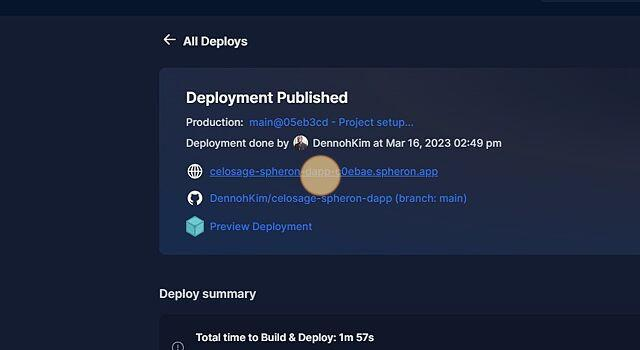
<br>

### **Click "Connect”**


<br>

### **Click "MetaMask” or any other wallet of your choice.**

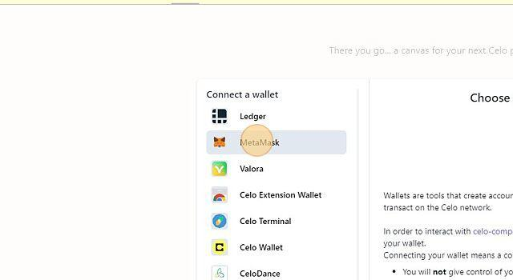
<br>

---

## Conclusion

With the assistance of Spheron protocol, you have the capability to continue developing your application, and once you push your changes to GitHub, they are automatically deployed through your deployed link. This is made possible by the built-in CI/CD workflow.

###  **Why choose Spheron Protocol**

Here are reasons why you should use spheron to deploy your decentralised app: 

- **Secure data storage:** Spheron Protocol utilizes blockchain technology to provide secure and tamper-proof data storage. The data is distributed across the network and is protected by strong encryption and access controls, ensuring that it is only accessible to authorized parties.

- **Data privacy and ownership:** With Spheron Protocol, users have full control and ownership of their data. They can choose who has access to their data and can revoke access at any time. This ensures that user privacy is protected and gives users the confidence to share their data on the platform.

- **Scalability:** Spheron Protocol is designed to be highly scalable and can handle large volumes of data and transactions. This makes it suitable for a wide range of applications that require high performance and throughput.

- **Interoperability:** Spheron Protocol is designed to be interoperable with other blockchain networks and protocols, making it easier for developers to integrate their apps with the platform.

- **Incentivization:** Spheron Protocol provides incentives for users to participate in the network by offering rewards for contributing computing resources and validating transactions. This incentivizes users to help secure the network and ensure its reliability.

- **Lower costs:** Spheron Protocol can help reduce the costs of data storage and management by eliminating the need for centralized servers and intermediaries. This can result in significant cost savings for businesses and organizations.

- **Community support:** Spheron Protocol has an active and growing community of developers, users, and enthusiasts who are committed to building a decentralized data ecosystem. This community provides support, feedback, and resources to help developers build and deploy their decentralized apps on the platform.

- **Use cases:** Spheron Protocol has a wide range of potential use cases in various industries such as healthcare, finance, supply chain management, and more. By deploying your decentralized app on Spheron Protocol, you can tap into this growing market and leverage the benefits of blockchain technology.


## About the Author
I am Dennis Kimathi, a UI/UX designer, full-stack developer, and blockchain enthusiast. I have a strong passion for creating user-centered designs that are not only aesthetically pleasing but also efficient and intuitive to use. Over the years, I have honed my skills in developing web applications that are robust, scalable, and secure, thanks to my experience in full-stack development.

As a blockchain enthusiast, I am constantly exploring and learning about the potential of this technology and how it can be applied in various industries. I believe that blockchain has the potential to revolutionize the way we do things, from finance to healthcare and beyond. Its ability to provide decentralized, secure, and transparent systems has the potential to bring about significant changes that will benefit society.

Fun fact about me, i am into archeoastronomy.

## Resources

- [Celo Composer](https://github.com/celo-org/celo-composer)
- [Spheron Protocol](https://spheron.network/)


