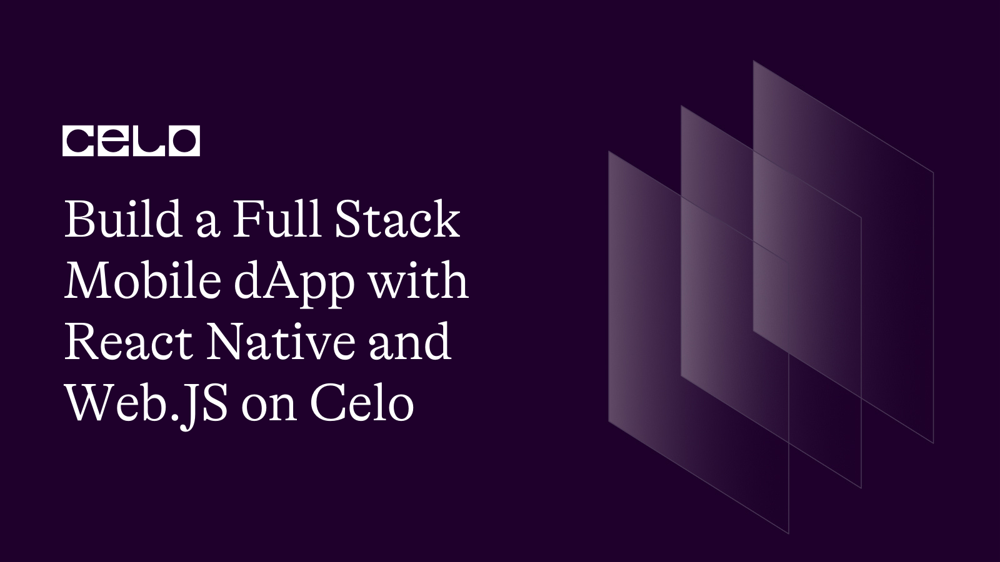
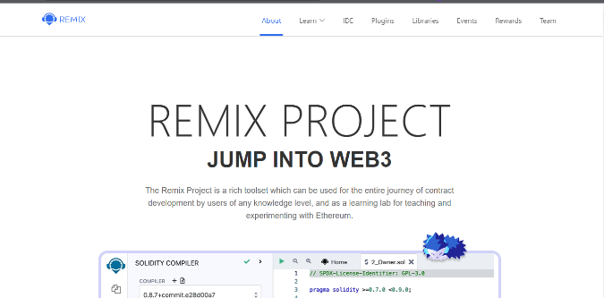
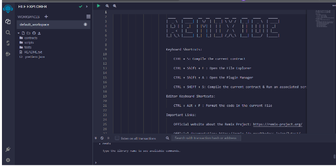
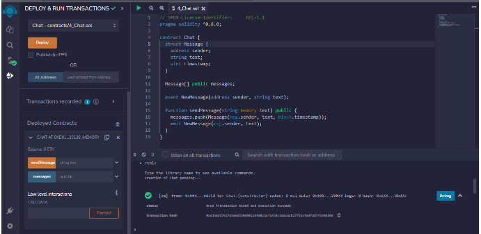

## Introduction

As the importance of mobile Dapps grows, it's more important than ever to have a strong understanding of how to build and deploy them. This tutorial will provide a step-by-step guide to building a fully functional mobile Dapp on the Celo platform, making it an invaluable resource for any developer looking to get started. This article will demonstrate how to use React Native and Web.JS to build a full-stack mobile Dapp that interacts with a Solidity chat smart contract created with Remix. The messages will be stored on the smart contract, and they will be made available to authenticated users. Users' authentication is done using the Celo wallet address. Every eye loves seeing beautiful pages, which we will create together using TailwindCSS - “rapidly build modern websites without ever leaving your HTML. A utility-first CSS framework packed with classes like flex, pt-4, text-center and rotate-90 that can be composed to build any design, directly in your markup”. Since this is a full-stack application, it is essential to make clear which tools and stacks we are focusing on today”. It is also worth noting that the code of this tutorial can run in a cross-platform environment, but the tutorial will be using Android as an example. Finally, we want to focus more on building on Celo. We pay less attention to stack usage and focus more on Celo integration. For that reason, we will be exploring the react-native-gifted-chat

## Focus Stacks

[React Native](https://reactnative.dev/) - “Create native apps for Android, iOS, and more using React. React Native combines the best parts of native development with React, a best-in-class JavaScript library for building user interfaces.”

[TailwindCSS](https://tailwindcss.com/) - “rapidly build modern websites without ever leaving your HTML. A utility-first CSS framework packed with classes like flex, pt-4, text-center and rotate-90 that can be composed to build any design, directly in your markup.” Since this is a full-stack application, it is essential to clarify which tools and stacks we focus on today."

[Web3.js](https://web3js.org/#/) - “A JavaScript library for building on Ethereum”.

[React-Native-Gifted-Chat](https://gifted.chat/)

[DataHub API](https://datahub.figment.io/signup)

## Prerequisites

To effectively follow these tutorials, it is recommended that you have a foundational understanding of the following technologies:
In view of the focus stacks mentioned above, it is important for the reader to focus and prepare to have beginner to intermediate knowledge of the above-mentioned stacks (not compulsory), along with having NodeJS installed, a funded Celo Wallet and a DataHub active account are the some of the requirements for this tutorial.

- Solidity

- Smart-contract

- React Native

- Blockchain concepts

- TailwindCSS

- Web3.JS

## Initial Setup

Having a basic knowledge of the above stacks will get us up to speed on getting the project set up as quickly as possible. At first, we kick start the journey from our development environment, and the tool we will be using is Expo - “Expo tools and services empower you to create incredible apps using Expo CLI and the Expo SDK, the Expo Go app, our cloud build and submission services, and Expo Snack”.

For this project, we are using Expo-CLI. To install Expo-CLI, run the command

```bash
	npm install -g expo-cli
```

What does the command do? It installs the CLI globally on your device with the help of the `-g` command included. This gives us the right tools and power in our toolbox to be able to create a react-native project.

### Let’s create the reactive-native project and call the app celo-chats!

```bash
	expo init celo-chats
```

This command prompts you to choose a template from the list of options before the initiation continues. Choose the empty or blank template, and let’s create everything together from scratch. After the successful initialization of our celo-chats app, a folder will be created with the name of the app, `celo-chats`. Move into this folder, and again, it is important for us to install the necessary dependencies.

### Move into the folder/directory

```bash
	cd celo-chats
```

### Install Dependencies

```bash
	npm install web3 react-native-gifted-chat tailwindcss
```

### Start the server

```bash
npm start
```

The first command above changes our current working directory to our project working directory, while the second command installs other necessary packages we will need in building our chat application.

## Let’s build the smart contract that all chat messages will rely on upon!

As mentioned before, all the chat messages will be stored using the smart contract. For that reason, we will be creating a simple smart contract using Solidity on the Remix-project. Following the following steps will help in creating the smart contract through the Remix-project app.

- Step 1:[Go to Remix - Ethereum IDE and Community (remix-project.org)](https://remix-project.org/) or skip the four steps below using [this link](https://remix.ethereum.org/)



- Step 2: Click on the IDE tab.
- Step 3: Then select Remix Online IDE.
- Step 4:Follow the tour if you are a first user and at the end, you will have the below interface.



- Step 5: Create a file inside the contract folder by right-clicking the contract folder on the left panel and selecting `New File` Give it any name in this tutorial; I will name it `4_Chat.sol` and then paste the below sample code as content. Upon pasting it, you will get a warning telling you to be careful with what you wish to run as it has an effect on your wallet and can affect your money.
  Pro tip: Never copy and paste something you don’t understand as a contract to avoid losing money.

```solidity
	// SPDX-License-Identifier: 	AFL-1.1
	pragma solidity ^0.8.0;

	contract Chat {
	struct Message {
		address sender;
		string text;
		uint timestamp;
	}

	Message[] public messages;

	event NewMessage(address sender, string text);

	function sendMessage(string memory text) public {
		messages.push(Message(msg.sender, text, block.timestamp));
		emit NewMessage(msg.sender, text);
	}
}
```

These 19 lines of code will do the magic, as explained here. This smart contract has a sendMessage function that takes a string parameter named text and adds a new message to the messages array. It also emits a NewMessage event. The Message struct stores the sender's address, the message text, and the timestamp. After this, we need to deploy the contract we just built, and Remix does this for us very easily by letting us compile using the tab and seeing if there are any errors. If there are no errors, then you can deploy the app using the deploy tab to generate the ABI needed to interface with the contract built into our React-Native app using web3.



After successful compilation, click the "Deploy" tab, and you should have everything displaying success as seen in the picture above. Successful completion of the above gave us access to the ABI and the addresses needed in our React-Native app. Up next, let's design the app in React-Native.

## Setting up the App Interface using React-Native and Gifted-Chat

Let’s take this one step by step for easy follow-along and understanding.

- Step 1: Back to the app initialize using expo before, open the App.js file
- Step 2: Clean the content and add the below line to import the dependencies installed beforehand.

### App.js

```js
import { useEffect, useState } from "react";
import { GiftedChat, Send, Icon } from "react-native-gifted-chat";
import Web3 from "web3";
import "tailwindcss/tailwind.css";
import { TextInput, View } from "react-native";
```

Three of the most important dependencies we will be using in this tutorial are imported. The "react-native-gifted-chat" package will handle all chats and chat interfaces, while the "web3" package will interface with and communicate with the deployed smart contract, and we will use the TailwindCSS package to style our app.

We need a way to keep track of the state of addresses and chats, and we will manage this using react hooks. Hooks in React help in storing, managing, and manipulating data in a React app.

### App.js

```js
const [userAddress, setUserAddress] = useState("");
const [messages, setMessages] = useState([]);
```

As explicit as the names are, the userAddress will be used to store and manage the user's cello wallet address, while the messages will be used to store and manage chat messages.

- Step 3: Initialize the Web3 instance. The Web3 package imported needed to create interaction, which requires an instance of itself. The API key is the DataHub API key. You can put it directly because we are not putting it into production. But if you want to move beyond this tutorial using the same code, you will need to check out how to use environment variables for the security reasons of the secret keys. Add the below code to your App.js file.

### App.js

```js
const web3 = new Web3(
  "https://celo-testnet--rpc--alfajores.datahub.figment.io/apikey/<YOUR_API_KEY>/"
);
```

- Step 4: We need a way to keep track of the state of addresses, chats, and the ABI.We will manage the user address and chat messages using react hooks and assign contract address and contract ABI to a constant variable. Hooks in React help in storing, managing, and manipulating data in a React app.

### App.js

```js

// Replace the ABI with yours
const contractABI = [
	{
		"anonymous": false,
		"inputs": [
			{
				"indexed": false,
				"internalType": "address",
				"name": "sender",
				"type": "address"
			},
			{
				"indexed": false,
				"internalType": "string",
				"name": "text",
				"type": "string"
			}
		],
		"name": "NewMessage",
		"type": "event"
	},
	{
		"inputs": [
			{
				"internalType": "uint256",
				"name": "",
				"type": "uint256"
			}
		],
		"name": "messages",
		"outputs": [
			{
				"internalType": "address",
				"name": "sender",
				"type": "address"
			},
			{
				"internalType": "string",
				"name": "text",
				"type": "string"
			},
			{
				"internalType": "uint256",
				"name": "timestamp",
				"type": "uint256"
			}
		],
		"stateMutability": "view",
		"type": "function"
	},
	{
		"inputs": [
			{
				"internalType": "string",
				"name": "text",
				"type": "string"
			}
		],
		"name": "sendMessage",
		"outputs": [],
		"stateMutability": "nonpayable",
		"type": "function"
	}
]

// Replace the contract address
const contractAddress = "0xd9145CCE52D386f254917e481eB44e9943F39138"
export default function App() {
const [userAddress, setUserAddress] = useState("");
const [messages, setMessages] = useState([]);
```

As explicit as the names are, the userAddress will be used to store and manage the user's cello wallet address, while the messages will be used to store and manage chat messages.

- Step 5: It is at this point that we need to subscribe to the NewMessage event for the purpose of requesting access to the Celo wallet address. We normally handle this type of event in React Native using useEffects, as it is considered a side effect action that needs to be carried out. Feel free to copy and paste the below code into your App.js.

### App.js

```js
useEffect(() => {
  // Subscribe to new message events
  const contract = new web3.eth.Contract(contractABI, contractAddress);
  contract.events.NewMessage({}, (error, event) => {
    if (!error) {
      const { sender, text, timestamp } = event.returnValues;
      setMessages((prevMessages) =>
        GiftedChat.append(prevMessages, [
          {
            _id: Math.random().toString(36).substring(7),
            text,
            createdAt: new Date(timestamp * 1000),
            user: {
              _id: sender,
              name: sender,
            },
          },
        ])
      );
    }
  });

  // Request access to user's Celo wallet
  async function requestAccount() {
    const accounts = await web3.eth.requestAccounts();
    setUserAddress(accounts[0]);
  }
  requestAccount();
}, []);
```

A few things to note, the GiftedChat package has an append function that accepts necessary things from us as long as we pass in the right argument. Everything works towards our way

- Step 6: We need the code to actually send out the messages. The below snippet handles that for us smoothly. At this point, we will be creating a function to handle the process of sending messages to the smart contract with the help of the web and its built-in packages and methods (e.g., web.eth.Contract) and then displaying it on the app through the GiftedChat package.

### App.js

```js
async function handleSend(messages) {
  const text = messages[0].text.trim();
  const contract = new web3.eth.Contract(contractABI, contractAddress);
  await contract.methods.sendMessage(text).send({ from: userAddress });
}
```

The above sends the message to the smart contract. This function takes an array of messages (in our case, only one message at a time), extracts the message text, and calls the sendMessage function on the smart contract using the web3.eth.Contract instance. We also pass in the userAddress as the from address. while the below snippet will display the message on our mobile app.

### App.js

```js
return (
	<GiftedChat
	messages={messages}
	user={{ _id: userAddress, name: userAddress }}
	onSend={handleSend}
	placeholder="Type your message here..."
	renderComposer={(props) => (
		<TextInput
			{...props}
			style="w-full px-4 py-2 border-gray-300 rounded-md shadow-sm focus:outline-none focus:ring-2 focus:ring-blue-500"
		/>
		)}
		renderSend={(props) => (
		<Send {...props}>
			<View style="flex items-center justify-center w-10 h-10 rounded-full bg-blue-500">
			<Icon name="send" size={24} color="#fff" />
			</View>
		</Send>
		)}
		messagesContainerStyle="flex-1 bg-gray-100"
	/>
	);
}
```

With the help of the `handleSend` function on the send properties of the GiftedChat Component, we can send messages. And the user attribute helps the user handle the sender's credentials, which we can access using `user._id`, `user.name`, and finally, a placeholder for better accessibility.

Here, the renderComposer prop was used to style the chat input box and the `renderSend` prop to style the send button. We also use the messagesContainerStyle prop to set the background colour of the chat messages.

And that's it! We have successfully built a chat application with React Native, web3.js, and tailwindCSS, with a focus on the Celo blockchain. The final code will look like below.

### Full App.js Code

```js
import { useEffect, useState } from "react";
import { GiftedChat, Send, Icon } from "react-native-gifted-chat";
import Web3 from "web3";
import "tailwindcss/tailwind.css";
import { TextInput, View } from "react-native";

// Replace the ABI with yours
const contractABI = [
  {
    anonymous: false,
    inputs: [
      {
        indexed: false,
        internalType: "address",
        name: "sender",
        type: "address",
      },
      {
        indexed: false,
        internalType: "string",
        name: "text",
        type: "string",
      },
    ],
    name: "NewMessage",
    type: "event",
  },
  {
    inputs: [
      {
        internalType: "uint256",
        name: "",
        type: "uint256",
      },
    ],
    name: "messages",
    outputs: [
      {
        internalType: "address",
        name: "sender",
        type: "address",
      },
      {
        internalType: "string",
        name: "text",
        type: "string",
      },
      {
        internalType: "uint256",
        name: "timestamp",
        type: "uint256",
      },
    ],
    stateMutability: "view",
    type: "function",
  },
  {
    inputs: [
      {
        internalType: "string",
        name: "text",
        type: "string",
      },
    ],
    name: "sendMessage",
    outputs: [],
    stateMutability: "nonpayable",
    type: "function",
  },
];

// Replace the contract address
const contractAddress = "0xd9145CCE52D386f254917e481eB44e9943F39138";
// Replace this with datahub API
const web2 = new Web3(
  "https://celo-testnet--rpc--alfajores.datahub.figment.io/apikey/<YOUR_API_KEY>/"
);
export default function App() {
  const [userAddress, setUserAddress] = useState("");
  const [messages, setMessages] = useState([]);

  useEffect(() => {
    // Subscribe to new message events
    const contract = new web3.eth.Contract(contractABI, contractAddress);
    contract.events.NewMessage({}, (error, event) => {
      if (!error) {
        const { sender, text, timestamp } = event.returnValues;
        setMessages((prevMessages) =>
          GiftedChat.append(prevMessages, [
            {
              _id: Math.random().toString(36).substring(7),
              text,
              createdAt: new Date(timestamp * 1000),
              user: {
                _id: sender,
                name: sender,
              },
            },
          ])
        );
      }
    });
    async function requestAccount() {
      const accounts = await web3.eth.requestAccounts();
      setUserAddress(accounts[0]);
    }
    requestAccount();
  }, []);

  async function handleSend(messages) {
    const text = messages[0].text.trim();
    const contract = new web3.eth.Contract(contractABI, contractAddress);
    await contract.methods.sendMessage(text).send({ from: userAddress });
  }

  return (
    <GiftedChat
      messages={messages}
      user={{ _id: userAddress, name: userAddress }}
      onSend={handleSend}
      placeholder="Type your message here..."
      renderComposer={(props) => (
        <TextInput
          {...props}
          style="w-full px-4 py-2 border-gray-300 rounded-md shadow-sm focus:outline-none focus:ring-2 focus:ring-blue-500"
        />
      )}
      renderSend={(props) => (
        <Send {...props}>
          <View style="flex items-center justify-center w-10 h-10 rounded-full bg-blue-500">
            <Icon name="send" size={24} color="#fff" />
          </View>
        </Send>
      )}
      messagesContainerStyle="flex-1 bg-gray-100"
    />
  );
}
```

## Conclusion

I will like to thank you for coming this far. In this tutorial, we are able to learn the process of creating, compiling, and deploying smart contracts on Remix, After generating the address and the ABI. We looked into how to integrate both into our React Native app with the help of Web3, handle the chat with react-native-gifted-chat and finally style it with Tailwind CSS.

I believe this tutorial is helpful. Let me know what you think.
Full code on [this repository](https://github.com/Taiwrash/celo-chats) 🎉

## About the author

My name is Rasheed Mudasiru, and I'm a software developer, passionate about community building based in Nigeria. I am recently experimenting DevOps and Blockchain promotions.
