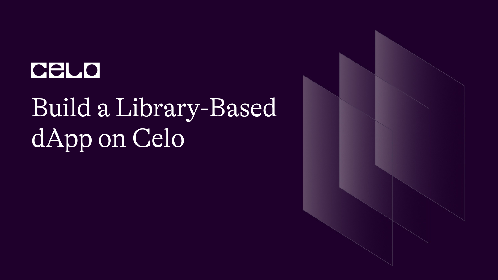

## Introduction

Writing a robust smart contract relies on different factors. These factors range from understanding solidity concepts and conventions such as types, global variables, interfaces, libraries, etc. Library as one is a bit vast in scope hence developers should familiarize themselves with this concept so as to maximize its usage.

## Prerequisites​

Library in solidity is categorized under the advanced concept. To grab the full weight of this tutorial, you're expected to know solidity programming

- For tutorials on how to get started with solidity, please refer to **[here](https://docs.celo.org/blog/tutorials/)**.

## Requirements​

Install the following tools:

- An editor. VSCode recommended.
- NodeJs version >=14.0.0. I recommend that you use v18.12.1
- [How to set up and configure hardhat](https://docs.celo.org/blog/tutorials/advance-hardhat-configuration-on-celo-using-plugins).

**Smart contracts**

It is assumed that you have followed the link above and completed the hardhat setup. In your new setup, navigate to the 'contracts' folder and create a structure as follows:

```bash
- contracts - _top-level folder_
  - account - _folder_
  - interfaces - _folder_
  - lib - _folder_
  - reward - _folder_
  - Vault.sol - _file_
```

Before we proceed, let's understand what we're building. Our contracts will perform decentralized swapping of both ERC20 tokens to $Celo and ERC20 to ERC20. This is an extension of the previous contracts that were found **[here](https://github.com/bobeu/nft-gated-dapp-dexHosting/)**.

We will use `Vault.sol` as the main deployable contract while the libraries go into the `lib` folder. The Vault contract will perform two categories of swap:

1. Exchanging ERC20 assets for $CELO coin.
2. Exchanging ERC20 assets for another.

For safety, we will employ the use of a detached contract that will be launched internally when a user first interacts with the main contract. In their subsequent interactions, the main contract will first search the storage if an account has previously been created and mapped to the caller otherwise a new version is created for the user. After unstaking their $Celo, we will only allow them to withdraw via the internally mapped account. By so doing, we remove the single point of failure since the main contract does not hold Celo.

- `contracts/account/Account.sol`

```js
  // SPDX-License-Identifier: MIT
  pragma solidity 0.8.17;

  import "../lib/libraryAsUtility/Utility.sol";
  import "../interfaces/IAccount.sol";

  contract Account is IAccount {
    error UnAuthorizedCaller(address);
    event CeloReceived(uint);

    // Owner's address
    address private owner;

    // Reward token
    IERC20 private rewardToken;

    constructor(IERC20 _rewardToken) payable {
      owner = msg.sender;
      rewardToken = _rewardToken;
    }

    //Fallback
    receive() external payable {
      emit CeloReceived(msg.value);
    }

    // Only owner can call when this is invoked
    modifier onlyOwner() {
      if(msg.sender != owner) revert UnAuthorizedCaller(msg.sender);
      _;
    }

    ///@dev Withdraw Celo of @param amount : amount to withdraw from contract
    function withdrawCelo(address to) external onlyOwner {
      uint balance = address(this).balance;
      (bool success,) = to.call{value: balance}("");
      require(success, "withdrawal failed");
    }

    ///@dev Withdraw reward token
    function withdrawERC20(address to) external onlyOwner {
      uint balance = IERC20(rewardToken).balanceOf(address(this));
      if(balance >  0) require(IERC20(rewardToken).transfer(to, balance), "Failed");
    }
  }
```

The `Account` contract is uniquely mapped to each user while ownership is transferred to the user at construction/deployment. The only way we update the reward token is via the constructor. To withdraw $CELO coin, the owner will call the `withdrawals` function while `withdrawERC20` withdraws ERC20 tokens.

We will make interfaces for `Account`, `RewardToken`, and `Vault` contracts.

```bash
- interfaces
  - IAccount.sol
  - IERC20.sol
  - IVault.sol
```

For the sake of this tutorial, we write a mock token in the `reward` folder to be used as a reward for staking $CELO.

> Note: We'd want the owner's privilege for the main contract so it will be the sole caller of the `mint` function.

- `contracts/reward/RewardToken.sol`

```js
  // SPDX-License-Identifier: UNLICENSED
  pragma solidity 0.8.17;

  import "../account/Account.sol";
  import "./ERC20.sol";

  contract RewardToken is ERC20 {
    uint public maxSupply;

    address public owner;

    constructor (address _owner, uint _maxSupply) ERC20("RewardToken", "RTK") {
      require(_maxSupply > 0, "Zero supply");
      maxSupply = _maxSupply * (10**18);
      owner = _owner;
    }

    function mint(address to, uint amount) external returns(bool) {
      require(msg.sender == owner, "Not Authorized");
      _mint(to, amount);
      return true;
    }

  }
```

**Libraries**

All of the libraries we'll use reside in the `lib` folder. Libraries can be used in different contexts. In this case, we are going to use it in two different contexts.

1. library as utility

Using the library as a utility is a way of moving reusable code that should have resided in the main contract (s) elsewhere. Some of this code could be separated into modifiers as well but the advantage (s) of doing so could be either to reuse code, avoid redundancy, or anything else. An example of such a library-based utility contract is "Openzeppelin's SafeMath library".

`contracts/libraryAsUtility/Utility.sol`

To explain a few of the utilities,

- `assertChained_2` ensures that the two conditional parameters evaluate to true simultaneously otherwise execution terminates and the related `errormessasge` is returned.

> Note: The first argument in a library function can be used to invoke it. For example, `assertChained_2` can be invoked by the type of the first argument.

```js
uint n = 4; uint m = 2;

function testZero(bool a, bool 2, string memory err1, string memory err2) internal {
  bool(n > 0).assertChained_2(m > 0, 'n is zero', 'm is zero');
}
```

From the example, in the `testZero()`, we use the boolean constructor to evaluate the expression `n > 0` to either 'true' or 'false'. The result will be a 'bool' type which has the same type as the first argument in the `testZero` function hence the function can be invoked using the result of the expression.

```js
  // SPDX-License-Identifier: MIT
  pragma solidity 0.8.17;

  import "@openzeppelin/contracts/utils/Address.sol";
  import "@openzeppelin/contracts/utils/math/SafeMath.sol";
  import "../../interfaces/IERC20Extended.sol";

  library Utility {
    using Address for address;
    using SafeMath for uint256;

    // ///@dev Requires the three conditions to be true
    function assertChained_2(bool a, bool b, string memory errorMessage1, string memory errorMessage2) internal pure {
      require(a, errorMessage1);
      require(b, errorMessage2);
    }

    ///@dev Requires the three conditions to be true
    function assertEqual(bool condition, bool value, string memory errorMessage) internal pure {
      require(condition == value, errorMessage);
    }

    function assertUintGT(uint a, uint b, string memory errorMessage) internal pure {
      require(a > b, errorMessage);
    }

    ///@dev Requires either of the conditions to be true
    function assertEither(bool a, bool b, string memory errorMessage) internal pure {
      require(a || b, errorMessage);
    }

    function getAndCompareAllowance(address token, address owner, address beneficiary, uint comparedTo) internal view returns(uint allowance) {
      allowance = IERC20Extended(token).allowance(owner, beneficiary);
      require(allowance >= comparedTo, "Allowance value is too low");
      return allowance;
    }

    function transferToken(address token, address to, uint amount) internal {
      require(IERC20Extended(token).transfer(to, amount), 'Failed');
    }

    function transferAllowance(uint amount, address token, address owner, address recipient) internal returns(uint) {
      require(IERC20Extended(token).transferFrom(owner, recipient, amount), "Operation failed");
      return amount;
    }

    function calculateReward(uint stakedAmt, uint depositTime, uint divisor) internal view returns(uint reward) {
      uint curTime = block.timestamp;
      if(curTime == depositTime) {
        reward = 10 ** 15;
        return reward;
      }

      if(curTime > depositTime) {
          uint timeDiff = curTime.sub(depositTime);
          if(timeDiff > 0){
              reward = timeDiff.mul(stakedAmt).div(divisor); // Weighted reward
          } else {
              reward = 1e15;
          }

      }
      return reward;
    }

    /// Mint rewardToken to staker on staking receipt
    function mintRewardToken(address to, address token, uint amount) internal {
      require(IERC20Extended(token).mint(to, amount), "Error minting");
    }
  }
```

2. library as storage.

Don’t be confused with the context name, libraries in solidity are reusable code snippets, and cannot have state variables. They can only contain data that are constant i.e variables whose values are known ahead of time and do not change in form or context. We are only going to use it to access and modify storage that exists elsewhere. The code in this library file will be executed in the context of the contract that invokes it. This opens up more use cases as we can deploy as many libraries as we want and connect multiple contracts to them by simply referencing the library's addresses.

- `StorageData` is the type of data in storage that this library will be compatible with. We grouped all of the storage data into a user-defined type using the `struct` keyword. You do not have to worry about where structs are placed in a file. Me, I love defining them outside the contract files either in the interface or globally. You can choose where to place a struct in your files.

- Libraries are created using the keyword `library` followed by the reference name, and then the curly brace. Every other code logic comes in between the curly braces. Our library name is called `VaultLib`.

- Library allows us to declare constant variables whose values are immutable and known at compile time.

`contracts/libraryAsStorage/VaultLib.sol`

```js
  // SPDX-License-Identifier: MIT
  pragma solidity 0.8.17;

  import '../../interfaces/IVault.sol';
  import '../../account/Account.sol';

  struct StorageData {
    uint minimumStake;
    uint stakersCount;
    IERC20 token;
    IVault.Pair[] pairs;
    mapping (address => bool) supportedTokens;
    mapping (address => mapping(address => mapping(address => IVault.Staker))) stakers;
  }

  library VaultLib {
    using Address for address;
    using Utility for *;
    using SafeMath for uint256;
1
    event Staked(uint);
    event Unstaked(uint);

    function setRewardToken(StorageData storage self, address _token) internal {
      Address.isContract(_token).assertEqual(true, "Only contract address is allowed");
      self.token = IERC20(_token);
    }

    function setSupportedToken(StorageData storage self, address token) internal {
      if(self.supportedTokens[token]) revert IVault.TokenAlreadySupported(token);
      self.supportedTokens[token] = true;
    }

    function validateId(StorageData storage self, uint pairId) internal view {
      require(pairId < self.pairs.length, "Invalid id");
    }

    function setUpTokenPair(StorageData storage self, address tokenA, address tokenB, uint8 earnRate, uint _minStake) internal {
      bool(earnRate < 101).assertEqual(true, "Rate should be less than 101");
      bool(tokenA != address(0)).assertChained_2(tokenB != address(0), 'TokenA is zero', 'TokenB is zero');
      bool(self.supportedTokens[tokenB]).assertChained_2(self.supportedTokens[tokenA], "TokenB not supported", "TokenA not supported");
      bool(self.supportedTokens[tokenB] && self.supportedTokens[tokenA]).assertEqual(true, "Tokens not supported");
      uint liq = tokenB.getAndCompareAllowance(msg.sender, address(this), _minStake).transferAllowance(tokenB, msg.sender, address(this));
      self.pairs.push(IVault.Pair(tokenA, tokenB, earnRate, _minStake, liq, true));
    }

    function stakeToken(StorageData storage self, uint pairId) internal {
      validateId(self, pairId);
      self.stakersCount ++;
      IVault.Pair memory pr = self.pairs[pairId];
      pr.isOpen.assertEqual(true, "Locked");
      bool(pr.liquidity > 10 * (10 ** 18)).assertEqual(true, "No liquidity for this pair");
      bool(pr.tokenA != address(0)).assertChained_2(pr.tokenB != address(0), "TokenA is zero", "TokenB is zero");
      address to = address(this);
      address alc = self.stakers[msg.sender][pr.tokenA][pr.tokenB].account;
      uint stake = pr.tokenA.getAndCompareAllowance(msg.sender, to, pr.minimumStake).transferAllowance(pr.tokenA, msg.sender, to);
      self.stakers[msg.sender][pr.tokenA][pr.tokenB] = IVault.Staker(_now(), stake, 0, alc);
    }

    function unstakeToken(StorageData storage self, uint pairId) internal {
      validateId(self, pairId);
      IVault.Staker memory stk = getStakeProfile(self, msg.sender);
      IVault.Pair memory pr = self.pairs[pairId];
      stk.stake.assertUintGT(0, "No stake");
      self.stakers[msg.sender][pr.tokenA][pr.tokenB].stake = 0;
      self.stakers[msg.sender][pr.tokenA][pr.tokenB].depositTime = 0;
      pr.tokenA.transferToken(msg.sender, stk.stake);
      uint reward = stk.stake.calculateReward(stk.depositTime, pr.rate);
      if(pr.liquidity < reward) {
        reward = pr.liquidity;
      }
      self.pairs[pairId].liquidity = pr.liquidity.sub(reward);
      if(self.pairs[pairId].liquidity < 10 * (10**18)) {
        self.pairs[pairId].isOpen = false;
      }
      pr.tokenB.transferToken(msg.sender, reward);
    }

    /**@dev Stake Celo for token reward.
     * - The amount of Celo sent along the call must be greater
     *      than the minimum staking amount.
     * - We check if caller has existing account otherwise we
     *      create a new account for them.
     * - We can make a dynamic staking i.e stakers can stake any amount
     *      Celo, anytime. Each stake is unique to another in timing and
     *      identity.
     */
    function _stake(StorageData storage self, address who, uint value) private returns(bool){
      address alc;
      IVault.Staker memory stk = getStakeProfile(self, who);
      if(value < self.minimumStake) revert IVault.ZeroValue(value);
      alc = stk.account;
      if(alc == address(0)) {
        alc = address(new Account(self.token));
      }

      if(stk.celoAmount > 0) {
        _unstake(self, alc, stk.celoAmount, stk.depositTime);
      }
      address _k = address(this);
      self.stakers[msg.sender][_k][_k] = IVault.Staker(_now(), 0, value, alc);
      self.stakersCount ++;
      emit Staked(value);

      return true;
    }

    function _unstake(StorageData storage self, address alc, uint value, uint depositTime) private {
      self.stakersCount --;
      address _k = address(this);
      self.stakers[msg.sender][_k][_k].celoAmount = 0;
      self.stakers[msg.sender][_k][_k].depositTime = 0;
      (bool sent,) = alc.call{value: value}("");
      require(sent, "Transfer rejected");
      uint reward = value.calculateReward(depositTime, 60);
      if(reward > 0) alc.mintRewardToken(address(self.token), reward);

      emit Unstaked(value);
    }

    ///@dev deposit $Celo to vault
    function stakeCelo(StorageData storage self, uint msgValue) internal returns(bool) {
      return _stake(self, msg.sender, msgValue);
    }

    ///@dev Stake on behalf of @param who Account to stake for
    function stakeOnBehalf(StorageData storage self, address who, uint value) internal returns(bool) {
      require(msg.sender != who, "please use designated function");
      return _stake(self, who, value);
    }

    /**@dev Unstake Celo from the vault.
     */
    function unstake(StorageData storage self) internal returns(bool) {
      address _k = address(this);
      IVault.Staker memory stk = self.stakers[msg.sender][_k][_k];
      if(stk.celoAmount == 0) revert IVault.NoStakingDetected(stk.celoAmount);
      require(stk.account != address(0), "Account anomally detected");
      _unstake(self, stk.account, stk.celoAmount, stk.depositTime);

      return true;
    }

    ///@dev Returns current unix time stamp
    function _now() internal view returns(uint) {
        return block.timestamp;
    }

    function getStakeProfile(StorageData storage self, address who) internal view returns(IVault.Staker memory) {
      address _k = address(this);
      return self.stakers[who][_k][_k];
    }

    ///@dev returns account of @param who : any valid address
    function withdraw(StorageData storage self) public {
      address alc = getStakeProfile(self, msg.sender).account;
      IAccount(alc).withdrawCelo(msg.sender);
      IAccount(alc).withdrawERC20(msg.sender);
    }

  }
```

- Libraries do not inherit from other libraries, interfaces, or contracts. But we can use them with other libraries. Here, we use the `SafeMath` library for all unsigned integers of 256 bits. This connotes we can invoke "SafeMath's" functions with values that are of type `uint256` only. Same go for `Utility` and `Address`. "Utility" will be used for all types whether they match or not.

- To use the library as a storage modifier, we must pass the storage type reference often as the first argument. It's a convention to name storage as `self`. The type of storage you want to modify in the function should correspond to that of the main contract.

- `setRewardToken(StorageData storage self, address _token)` accepts two arguments. The first argument is 'self' of type `StorageData` and the location is `storage`. To use this function, we must supply storage data of the same type as the first argument. When invoked, it modifies `self` with the new `_token` contract address but the storage does not exist in this library. It is executed in the context of whichever contract invoked it. Technically, libraries are neutral entity that cannot perform any action there but is deployable. They rely on executable contracts to be effective. The concept works like a proxy.

- `setSupportedToken(StorageData storage self, address token)` add up 'token' to the list of supported tokens.

- `validateId(StorageData storage self, uint pairId)` tests `pairId` input from the user against the 'self.pair' array in storage to ensure that the location is not empty otherwise we get an 'out of bound' error.

- `setUpTokenPair(StorageData storage self, address tokenA, address tokenB, uint8 earnRate, uint _minStake)` add `tokenA` as stakeable token with reward distribution specified as `tokenB` to `self.pair` in storage.

- `stakeToken(StorageData storage self, uint pairId)`: This function is invoked when users want to stake ERC20 token and earn ERC20 token in return.

- `unstakeToken(StorageData storage self, uint pairId)` removes staking whose data is located at `pairId` in `self.pair` array in storage.

- `stakeCelo(StorageData storage self, uint msgValue)` stakes $Celo coin to earn ERC20 token.

- `stakeOnBehalf(StorageData storage self, address who, uint value)` allows the account to stake on behalf of other accounts.

- `unstake(StorageData storage self)` unstakes $Celo.

- `getStakeProfile(StorageData storage self, address who)`retrieves the profile of 'who' from the storage.

- `withdraw(StorageData storage self)` simultaneously withdraw both $Celo and token from the user's account.

`contracts/Vault.sol`

This is the main executable contract that will consume from the library - VaultLib.

```js
  // SPDX-License-Identifier: MIT
  pragma solidity 0.8.17;

  import "@openzeppelin/contracts/access/Ownable.sol";
  import "./lib/libraryAsStorage/VaultLib.sol";

  contract Vault is Ownable{
    using VaultLib for StorageData;
    StorageData private data;

    constructor (uint _minimumStake) {
      require(_minimumStake > 0, "Minimum staking too low");
      data.minimumStake = _minimumStake;
    }

    receive() external payable {
      require(msg.value > 0, "");
    }

    function setToken(address _token) public onlyOwner {
      data.setRewardToken(_token);
    }

    function setUpTokenPair(address tokenA, address tokenB, uint8 rate, uint _minStake) public {
      data.setUpTokenPair(tokenA, tokenB, rate, _minStake);
    }

    function stakeToken(uint pairId) public {
      data.stakeToken(pairId);
    }

    function unstakeToken(uint pairId) public {
      data.unstakeToken(pairId);
    }

    ///@dev deposit $Celo to vault
    function stakeCelo() public payable returns(bool) {
      return data.stakeCelo(msg.value);
    }

    ///@dev Stake on behalf of @param who Account to stake for
    function stakeOnBehalf(address who) public payable returns(bool) {
      return data.stakeOnBehalf(who, msg.value);
    }

    /**@dev Unstake Celo from the vault.
     */
    function unstake() public returns(bool) {
      data.unstake();
      return true;
    }

    ///@dev returns account of @param who : any valid address
    function withdraw() public {
      data.withdraw();
    }

    function setSupportedToken(address _token) public onlyOwner {
        data.setSupportedToken(_token);
    }
  }
```

- To use VaultLib, we have specified what we want to use the library for. in this case for `StorageData`. Since this is the executable contract, we must create slots in storage for 'StorageData'.

- At deployment, we update the `minimumStake` variable.

- Since our storage data reference is `data`, and the first argument in the library functions is of the same type, we can always invoke them using the 'data' reference. The same is applicable to every function that consumes from the library.

**Compilation**

Run

```
bash npx hardhat compile
```

If your setup is correct, you should get a success message.

**Deployment**

We want our future contracts to feed on `VaultLib` hence it will be deployed ahead of them.

`scripts/deploy.ts`

```js
import { ethers } from "hardhat";
import Web3 from "web3";

async function main() {
  const minimumStake = Web3.utils.toHex("100000000000000000");
  const maxStake = Web3.utils.toHex("500000000000000000000000000");
  const VaultLib = await ethers.getContractFactory("VaultLib");
  const vaultLib = await VaultLib.deploy();

  const Vault = await ethers.getContractFactory("Vault", {
    libraries: {
      VaultLib: vaultLib.address,
    },
  });
  const RewardToken = await ethers.getContractFactory("RewardToken");

  const vault = await Vault.deploy(minimumStake);
  const token = await RewardToken.deploy(vault.address, maxStake);

  await vault.deployed();
  await token.deployed();

  console.log(`Vault depoyed to ${vault.address}`);
  console.log(`Token depoyed to ${token.address}`);
}

// We recommend this pattern to be able to use async/await everywhere
// and properly handle errors.
main().catch((error) => {
  console.error(error);
  process.exitCode = 1;
});
```

- From the script, we extract and deploy the `VaultLib` artifacts. The library's address is accessible from `vaultLib`.

- Since the `Vault` contract solely depends on `VaultLib`, we need to link the library to it. Hardhat provides a way to easily link libraries with contracts by passing a second argument to the `getContractFactory` function. This is not optional if your contracts require a library address.

An argument is an object, and we set the key as the library name i.e `VaultLib`. The value will be the library's address. From this point, for as many contracts as we wish to consume from the library, we only need to link them with the library's address.

> Note: You don't need this step if the library does not involve modifying the storage such as `Utility.sol`.

**Deploy locally to hardhat**

```bash
npx hardhat run scripts/deploy.ts
```

**Deploy to testnet**

```bash
npx hardhat run scripts/deploy.ts --testnet alfajores
```

## Conclusion​

Congratulation on making it to this point. Working with libraries is a great way to write robust contracts, especially where the contracts exceed the deployable size. It could be a bit technical and advanced, but consistently practicing will help you in the long run. Visit **[here](https://docs.celo.org/blog/tutorials/)** For more celo-related tutorials.

## What next?

​
Are you thinking of launching your own project on the Celo blockchain right now? Get started with the **[developers documentation](https://docs.celo.org/tutorials)**.

## About the Author​

**Isaac Jesse** , aka _Bobelr_ is a smart contract/Web3 developer. He has been in the field since 2018, worked as an ambassador with several projects like Algorand and so on as a content producer. He has also contributed to Web3 projects as a developer.

## References​

- [Celo developers resources](https://docs.celo.org/developer/)
- [Source code](https://github.com/bobeu/build-a-library-based-dapp-on-celo)
- [Solidity documentation](https://solidity.readthedocs.io/)
