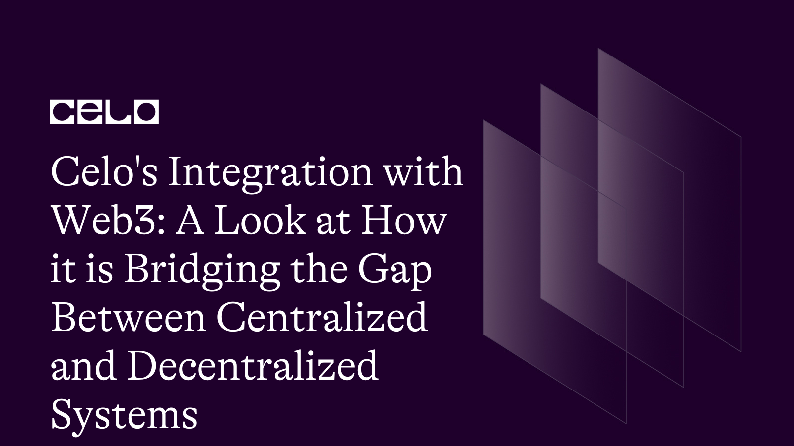

## Introduction

As a developer and technology enthusiast, the potential of blockchain technology has always piqued my interest. But, as much as I believe in the power of decentralized systems, I am also aware of the difficulties associated with bridging the gap between centralized and decentralized platforms. That is why I am thrilled to introduce you to Celo, a blockchain platform that is pushing the integration of Web3 technologies to new heights.

Celo is a revolutionary blockchain platform that aims to create more inclusive financial systems for individuals and communities around the world. Celo is bridging the gap between centralized and decentralized systems in unprecedented ways, using stablecoins, governance mechanisms, and advanced blockchain technology.

Celo has something to offer developers looking to create smart contracts, dApps, or decentralized identity solutions. In this technical article we will delve into the technical details of Celo's platform and technology, exploring its unique features and how they are changing the Web3 ecosystem.

Join me on this exciting journey as we explore Celo and its innovative approach to bridging the gap between centralized and decentralized systems.

## Prerequisites

Before we get into the technical details of Celo's platform and technology, there are a few things you should know.

To begin, a thorough understanding of blockchain technology and its underlying principles is required. This includes understanding how blockchains work, as well as consensus algorithms and cryptographic techniques like digital signatures and hash functions.

Secondly, you must be familiar with smart contracts and their capabilities. Smart contracts are self-executing contracts in which the terms of the buyer-seller agreement are directly written into code. They are used to automate the execution of an agreement, removing the need for intermediaries and increasing transaction efficiency.

Lastly, it is critical to understand Web3 technologies and their potential impact on the financial sector. Web3 technologies are a set of decentralized technologies that enable peer-to-peer transactions, service decentralization, and secure authentication. These technologies have the potential to increase financial access and inclusion for individuals and communities all over the world.

## Requirements

- **Node.js:** Node.js is a JavaScript runtime that allows you to run JavaScript code outside of a web browser. You can download [Node.js](https://nodejs.org/) from the official website.

- **Yarn:** Yarn is a package manager for Node.js that allows you to easily manage and install packages for your Node.js projects. You can download [Yarn](https://yarnpkg.com/) from the official website.

- **A code editor:** You'll need a code editor to create and edit your smart contract and JavaScript files. There are many code editors available, such as **Visual Studio Code, Atom, and Sublime Text**.

## Unlocking the Full Potential of Celo: Real-World Use Cases and Technical Applications

**Celo** is a blockchain platform that integrates Web3 technologies to bridge the gap between centralized and decentralized systems. Celo accomplishes this in part by enabling developers to create decentralized applications (dApps) and smart contracts that benefit individuals and communities worldwide.

Celo's platform and technology provide powerful tools and features that can be used in a variety of ways by developers. Celo can be used to create smart contracts, which automate the execution of agreements, reducing the need for intermediaries and increasing transaction efficiency. Developers can use Celo's smart contract functionality to build a variety of applications and services, such as crowdfunding platforms, supply chain management systems, and digital asset exchanges.

Another area where Celo excels is in decentralized identity solutions. Celo's platform enables the creation of secure, decentralized identities, which can be used to authenticate users and grant access to services and applications. Developers can create innovative solutions that improve user security and privacy by leveraging Celo's identity features.

Celo has a wide range of real-world applications. Microlending is one example of how Celo's platform can be used to provide small loans to individuals and businesses that would not otherwise have access to traditional lending services.

Celo can also be used for digital payments, allowing for quick and secure transactions between individuals and businesses all over the world. Celo's platform enables low-cost, borderless transactions that can be processed in real time, making remittances another promising use case.

To summarize, Celo's platform and technology offer powerful tools and features that can be used in a variety of ways. Celo is a promising platform with the potential to improve financial accessibility and inclusion for individuals and communities worldwide, from developing innovative dApps and smart contracts to enabling microlending and digital payments.

## Bridging the Gap: Exploring the Potential Benefits and Challenges of Web3 Technologies for Financial Inclusion and How Celo is Addressing Them

As developers, we recognize that Web3 technologies have the potential to transform financial systems while also improving accessibility and inclusion for individuals and communities worldwide. Decentralized systems provide numerous advantages, including transparency, security, and the elimination of intermediaries, which can lead to lower costs and greater efficiency.

However, implementing Web3 technologies is not without difficulties. Scalability is one of the most difficult issues. Decentralized systems rely on consensus mechanisms to validate transactions, which can reduce network speed and throughput. Furthermore, Web3 technology adoption is still limited, which may limit its impact on financial inclusion.

Celo comes into play here. Celo is a blockchain platform that integrates Web3 technologies to bridge the gap between centralized and decentralized systems. Celo is addressing some of the issues associated with decentralized systems by utilizing stablecoins, governance mechanisms, and other Web3 tools.

Celo's ability to facilitate microlending is one of its primary advantages. Microlending is the practice of making small loans to people or businesses who are not typically served by traditional financial systems. Celo facilitates microlending by offering a stablecoin pegged to the value of fiat currency.

The **Celo Dollar (cUSD)** stablecoin allows lenders and borrowers to transact without the volatility that is often associated with cryptocurrencies.

However, Celo's platform is not limited to financial applications. Celo can also be used for decentralized identity solutions, which can aid in the prevention of identity theft and privacy violations. Developers can use Celo's platform to create decentralized identity systems that are secure, transparent, and accessible to all.

Finally, Web3 technologies have the potential to improve financial access and inclusion for individuals and communities all over the world. While there are challenges to implementing Web3 technologies, Celo is playing an important role in addressing these challenges. Celo's stablecoins, governance mechanisms, and other Web3 tools enable developers to create more inclusive financial systems by unlocking the full potential of decentralized systems.

## Building Decentralized Solutions with Celo's Contract Kit: A Comprehensive Code Example

To run this code, you must have the following tools installed on your machine: **Node.js, Yarn, and Code Editor**. You can check the requirements above to download them.

Once you have these tools, you can install the necessary packages and run the code by following the instructions in the code example.

- First, run the following commands to install the necessary packages:

```
yarn add @celo/contractkit

yarn add @openzeppelin/contracts
```

- Then, create a folder inside your directory named contracts and in that make new smart contract file named `MyToken.sol` and add the following code:

```solidity

// SPDX-License-Identifier: MIT

pragma solidity ^0.8.0;

import "@openzeppelin/contracts/token/ERC20/ERC20.sol";

contract MyToken is ERC20 {
    constructor(uint256 initialSupply) ERC20("MyToken", "MTK") {
        _mint(msg.sender, initialSupply);
    }
}

```

This smart contract is based on the ERC20 standard and uses the token name "MyToken" with the symbol "MTK" as its symbol. The constructor function initializes the total supply of tokens and assigns them to the address of the contract deployer.

- Next, create a new JavaScript file named `deploy.js` and add the following code:

```javascript
const ContractKit = require("@celo/contractkit");
const Web3 = require("web3");
const MyToken = require("./contracts/MyToken.sol");

async function deploy() {
  // Create a new instance of ContractKit
  const web3 = new Web3("https://alfajores-forno.celo-testnet.org");
  const kit = ContractKit.newKitFromWeb3(web3);

  // Set the account that will deploy the contract
  const account = await kit.web3.eth
    .getAccounts()
    .then((accounts) => accounts[0]);
  kit.defaultAccount = account;

  // Create a new instance of the MyToken contract
  const contract = new kit.web3.eth.Contract(MyToken.abi);
  const bytecode = MyToken.bytecode;
  const gas = 1000000;
  const tx = contract.deploy({ data: bytecode, arguments: [1000000] });
  const receipt = await tx.send({ gas });
  const address = receipt.contractAddress;

  console.log(`MyToken deployed at address ${address}`);
}

deploy();
```

This script connects to the Celo blockchain and deploys the MyToken contract using ContractKit. It first configures the account that will deploy the contract, then launches a new instance of the MyToken contract with an initial supply of 1,000,000 tokens. Note that both files created need to be in the same folder.

- Execute the following command to run this script:

```
node deploy.js
```

The MyToken contract will be deployed to the Celo blockchain, and the contract address will be returned.

That's all! Developers can easily create and deploy smart contracts that interact with the Celo blockchain and other Web3 technologies using **Celo's ContractKit and OpenZeppelin's ERC20 standard**.

### Conclusions

To summarize, Celo's importance in bridging the gap between centralized and decentralized systems via Web3 technologies cannot be overstated. Developers can create more inclusive financial systems that benefit individuals and communities worldwide by using Celo's unique approach to blockchain technology, stablecoins, and governance mechanisms.

We can build decentralized applications and services that have the potential to improve financial accessibility and inclusion for everyone by leveraging Celo's platform and technology. With implementation challenges such as scalability and adoption, Celo is an important player in the Web3 ecosystem, providing developers with the tools they need to create a more decentralized and accessible future.

### Next Steps

It's time to take action now that you have a better understanding of the potential benefits and challenges of Web3 technologies, as well as the importance of Celo in addressing those challenges. The following are some next steps you can take to begin using Celo in your projects:

- **Investigate Celo's developer resources:** Celo offers a variety of developer resources, such as documentation, tutorials, and code examples. These resources can assist you in understanding how to build decentralized applications and services using Celo's platform and technology.

- **Become a member of the Celo community:** Celo has an active and supportive developer, entrepreneur, and enthusiast community. Joining the community allows you to connect with other people who share your interests and stay up-to-date on the latest developments in the Celo ecosystem.

- **Construct and test your own smart contracts:** You can easily integrate Celo into your decentralized applications and services using Celo's contract kit and packages like @celo/contractkit and @openzeppelin/contracts. Create and test your own smart contracts to see how Celo can help you.

- **Experiment with Celo's stablecoins:** Celo's stablecoins are an excellent resource for developing decentralized financial applications. Experiment with stablecoins in your own projects to see how they can improve financial inclusion and accessibility.

You can begin leveraging Celo's platform and technology to create more inclusive financial systems by taking the next steps. Remember that, with the challenges of implementing Web3 technologies, Celo is an important player in the Web3 ecosystem, providing developers with the tools they need to create a more decentralized and accessible future.

### Author

As a digital marketing and technical writing expert with a focus on Web3, I specialize in optimizing online content for SaaS companies. I am a solutions-driven manager with over 5 years of experience who has built effective paid and organic marketing funnels. [LinkedIn](https://www.linkedin.com/in/maxwell-onyeka-3b4b1118b/) [Github](https://github.com/maxzysparks)

### References

- [Celo](https://celo.org/)
- [Web3 Foundation](https://web3.foundation/)
- [Ethereum](https://ethereum.org/)
- [ERC20 token standard](https://ethereum.org/en/developers/docs/standards/tokens/erc-20/)
- [Celo/contractkit](https://www.npmjs.com/package/@celo/contractkit)
- [Openzeppelin/contracts](https://www.npmjs.com/package/@openzeppelin/contracts)
- [Source Code](https://github.com/maxzysparks/integration)
