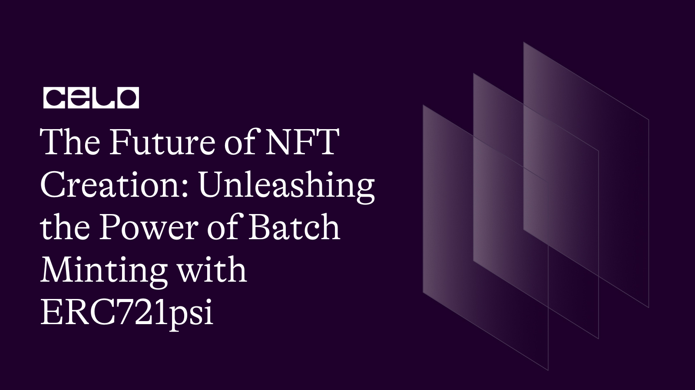

## 🌱 Introduction

The world of non-fungible tokens (NFTs) has exploded in recent years, with creators and collectors alike flocking to this new and exciting space. From digital art and music to virtual real estate and sports memorabilia, NFTs are changing the way we think about ownership and value in the digital age. However, with the increasing popularity of NFTs, creators are facing new challenges in creating and managing large collections of tokens. This is where batch minting with ERC721psi comes in.

## What is Batch Minting with ERC721psi?

Batch minting is the process of creating multiple NFTs at once, rather than creating them one by one. This approach can save creators time and money by reducing the number of transactions needed to mint tokens. ERC721psi is a new standard for NFTs that builds on the existing ERC721 standard. It was created to address some of the scalability issues of ERC721 and to enable new features such as batch minting.

ERC721psi is a fork of the ERC721 standard that includes an additional function called batchMint. This function allows creators to mint multiple NFTs in a single transaction, rather than having to create each NFT individually. This can be a huge time-saver for creators who want to create large collections of NFTs.

To demonstrate how batch minting works with ERC721psi, let's walk through an example. Suppose that you are a digital artist who has just created a collection of 100 NFTs. Traditionally, you would need to mint each NFT individually, which could take a significant amount of time and resources.

With ERC721psi, however, you can use the batchMint function to mint all 100 NFTs at once. Here's how the function call might look:

```bash
myNFT.batchMint(msg.sender, [1, 2, 3, ..., 100], ["https://ipfs.io/ipfs/Qm...","https://ipfs.io/ipfs/Qm...", "https://ipfs.io/ipfs/Qm...", ..., "https://ipfs.io/ipfs/Qm..."])
```

In this example, we're calling the batchMint function on a contract called myNFT. We're passing in the address of the user who will receive the NFTs (in this case, msg.sender), as well as two arrays. The first array contains the token IDs for each NFT (in this case, [1, 2, 3, ..., 100]), and the second array contains the token URIs for each NFT (in this case, an array of 100 IPFS URLs).

When we call the batchMint function, it will loop through each token ID and URI in the arrays, minting each NFT and assigning the specified URI to it. When the function completes, the user will have received all 100 NFTs in a single transaction.

**_Now that we have a basic understanding of the ERC721psi contract, let's explore how batch minting works in practice._**

## 🗈 Prerequisites

- A computer with an internet connection. You will need a computer with a stable internet connection to follow along with this guide.

- Basic knowledge of programming. While we will provide step-by-step instructions, it will be helpful to have some basic knowledge of programming languages such as JavaScript and Solidity.

- Node.js and npm installed. You will need to have Node.js and npm (the package manager for Node.js) installed on your computer. You can check if you have them installed by running the following commands in your terminal:

```bash
node -v
npm -v
```

- A code editor. You will need a code editor to write and edit your code. Some popular options include Visual Studio Code and Atom.
- A Metamask account. You will need a Metamask account to interact with the Celo blockchain from your web browser. If you don't already have one, you can create one by installing the Metamask extension for Chrome or Firefox.

## ⚠️ Requirements

- Truffle: a development environment, testing framework, and asset pipeline for Ethereum
- Node.js: a JavaScript runtime that allows you to run JavaScript on the command line
- Yarn: a package manager for JavaScript
- next: Next.js is a framework for building server-rendered or statically-exported React applications.
- CeloCli - The celocli lets you interact with the Celo Protocol smart contracts.

:::tip
To learn more about setting up the environment to Deploy batchminting smart contract , check out the **[step-by-step guide to deploying your first full-stack dApp on Celo](https://docs.celo.org/blog/tutorials/step-by-step-guide-to-deploying-your-first-full-stack-dapp-on-celo#steps-to-set-up-the-truffle-project-and-its-configs)**, which provides detailed instructions on getting started.
:::

## How to Use Batch Minting with ERC721psi

To use batch minting with ERC721psi, you will need to create a smart contract that implements the ERC721psi standard. Here's an example of what that might look like:

- Folder Structure

```bash
- contracts/
  - MyNFT.sol
  - ERC721psi.sol
```

- In this file structure, there is a folder called contracts which contains two files: MyNFT.sol and ERC721psi.sol. The MyNFT.sol file is where you can define your own custom non-fungible token (NFT) contract that implements the ERC721 PSI standard, and the ERC721psi.sol file is where the ERC721 PSI standard itself is defined.

- **`MyNFT.sol`**

```solidity
// SPDX-License-Identifier: MIT
pragma solidity ^0.8.0;

import "./ERC721psi.sol";

contract MyNFT is ERC721Psi {

    constructor() 
        ERC721Psi ("MyNFT", "NFTT"){
    }

    function Mint() external payable {
        // _safeMint's second argument now takes in a quantity, not a tokenId. (same as ERC721A)
        _safeMint(msg.sender, 1);
    }

    function batchMint(uint256 quantity) external payable {
        // _safeMint's second argument now takes in a quantity, not a tokenId. (same as ERC721A)
        _safeMint(msg.sender, quantity);
    }
    function _baseURI() internal pure override returns (string memory) {
        return
            "https://cloudflare-ipfs.com/ipfs/QmaczyZ79XE7MJ37TEAdngNXtBTxouxpitaCLCiTQdwkih/";
    }
    
    function tokenURI(
        uint256 tokenId
    ) public view override returns (string memory) {
        if (!_exists(tokenId)) revert("URI query for nonexistent token");
        return
            string(abi.encodePacked(_baseURI(), Strings.toString(tokenId), ".json"));
    }
}
```

Here's the code for the ERC721 PSI standard:

- **`ERC721psi.sol`**

```solidity
// SPDX-License-Identifier: MIT
pragma solidity ^0.8.0;

import "@openzeppelin/contracts/token/ERC721/IERC721.sol";
import "@openzeppelin/contracts/token/ERC721/IERC721Receiver.sol";
import "@openzeppelin/contracts/token/ERC721/extensions/IERC721Metadata.sol";
import "@openzeppelin/contracts/utils/Context.sol";
import "@openzeppelin/contracts/utils/Strings.sol";
import "@openzeppelin/contracts/utils/introspection/ERC165.sol";
import "@openzeppelin/contracts/utils/Address.sol";
import "@openzeppelin/contracts/utils/StorageSlot.sol";
import "solidity-bits/contracts/BitMaps.sol";


contract ERC721Psi is Context, ERC165, IERC721, IERC721Metadata {
    using Address for address;
    using Strings for uint256;
    using BitMaps for BitMaps.BitMap;

    BitMaps.BitMap private _batchHead;

    string private _name;
    string private _symbol;

    // Mapping from token ID to owner address
    mapping(uint256 => address) internal _owners;
    uint256 private _currentIndex;

    mapping(uint256 => address) private _tokenApprovals;
    mapping(address => mapping(address => bool)) private _operatorApprovals;

    /**
     * @dev Initializes the contract by setting a `name` and a `symbol` to the token collection.
     */
    constructor(string memory name_, string memory symbol_) {
        _name = name_;
        _symbol = symbol_;
        _currentIndex = _startTokenId();
    }

    /**
     * @dev Returns the starting token ID.
     * To change the starting token ID, please override this function.
     */
    function _startTokenId() internal pure returns (uint256) {
        // It will become modifiable in the future versions
        return 0;
    }

    /**
     * @dev Returns the next token ID to be minted.
     */
    function _nextTokenId() internal view virtual returns (uint256) {
        return _currentIndex;
    }

    /**
     * @dev Returns the total amount of tokens minted in the contract.
     */
    function _totalMinted() internal view virtual returns (uint256) {
        return _currentIndex - _startTokenId();
    }


    /**
     * @dev See {IERC165-supportsInterface}.
     */
    function supportsInterface(bytes4 interfaceId)
        public
        view
        virtual
        override(ERC165, IERC165)
        returns (bool)
    {
        return
            interfaceId == type(IERC721).interfaceId ||
            interfaceId == type(IERC721Metadata).interfaceId ||
            super.supportsInterface(interfaceId);
    }

    /**
     * @dev See {IERC721-balanceOf}.
     */
    function balanceOf(address owner) 
        public 
        view 
        virtual 
        override 
        returns (uint) 
    {
        require(owner != address(0), "ERC721Psi: balance query for the zero address");

        uint count;
        for( uint i = _startTokenId(); i < _nextTokenId(); ++i ){
            if(_exists(i)){
                if( owner == ownerOf(i)){
                    ++count;
                }
            }
        }
        return count;
    }

    /**
     * @dev See {IERC721-ownerOf}.
     */
    function ownerOf(uint256 tokenId)
        public
        view
        virtual
        override
        returns (address)
    {
        (address owner, ) = _ownerAndBatchHeadOf(tokenId);
        return owner;
    }

    function _ownerAndBatchHeadOf(uint256 tokenId) internal view returns (address owner, uint256 tokenIdBatchHead){
        require(_exists(tokenId), "ERC721Psi: owner query for nonexistent token");
        tokenIdBatchHead = _getBatchHead(tokenId);
        owner = _owners[tokenIdBatchHead];
    }

    /**
     * @dev See {IERC721Metadata-name}.
     */
    function name() public view virtual override returns (string memory) {
        return _name;
    }

    /**
     * @dev See {IERC721Metadata-symbol}.
     */
    function symbol() public view virtual override returns (string memory) {
        return _symbol;
    }

    /**
     * @dev See {IERC721Metadata-tokenURI}.
     */
    function tokenURI(uint256 tokenId) public view virtual override returns (string memory) {
        require(_exists(tokenId), "ERC721Psi: URI query for nonexistent token");

        string memory baseURI = _baseURI();
        return bytes(baseURI).length > 0 ? string(abi.encodePacked(baseURI, tokenId.toString())) : "";
    }

    /**
     * @dev Base URI for computing {tokenURI}. If set, the resulting URI for each
     * token will be the concatenation of the `baseURI` and the `tokenId`. Empty
     * by default, can be overriden in child contracts.
     */
    function _baseURI() internal view virtual returns (string memory) {
        return "";
    }


    /**
     * @dev See {IERC721-approve}.
     */
    function approve(address to, uint256 tokenId) public virtual override {
        address owner = ownerOf(tokenId);
        require(to != owner, "ERC721Psi: approval to current owner");

        require(
            _msgSender() == owner || isApprovedForAll(owner, _msgSender()),
            "ERC721Psi: approve caller is not owner nor approved for all"
        );

        _approve(to, tokenId);
    }

    /**
     * @dev See {IERC721-getApproved}.
     */
    function getApproved(uint256 tokenId)
        public
        view
        virtual
        override
        returns (address)
    {
        require(
            _exists(tokenId),
            "ERC721Psi: approved query for nonexistent token"
        );

        return _tokenApprovals[tokenId];
    }

    /**
     * @dev See {IERC721-setApprovalForAll}.
     */
    function setApprovalForAll(address operator, bool approved)
        public
        virtual
        override
    {
        require(operator != _msgSender(), "ERC721Psi: approve to caller");

        _operatorApprovals[_msgSender()][operator] = approved;
        emit ApprovalForAll(_msgSender(), operator, approved);
    }

    /**
     * @dev See {IERC721-isApprovedForAll}.
     */
    function isApprovedForAll(address owner, address operator)
        public
        view
        virtual
        override
        returns (bool)
    {
        return _operatorApprovals[owner][operator];
    }

    /**
     * @dev See {IERC721-transferFrom}.
     */
    function transferFrom(
        address from,
        address to,
        uint256 tokenId
    ) public virtual override {
        //solhint-disable-next-line max-line-length
        require(
            _isApprovedOrOwner(_msgSender(), tokenId),
            "ERC721Psi: transfer caller is not owner nor approved"
        );

        _transfer(from, to, tokenId);
    }

    /**
     * @dev See {IERC721-safeTransferFrom}.
     */
    function safeTransferFrom(
        address from,
        address to,
        uint256 tokenId
    ) public virtual override {
        safeTransferFrom(from, to, tokenId, "");
    }

    /**
     * @dev See {IERC721-safeTransferFrom}.
     */
    function safeTransferFrom(
        address from,
        address to,
        uint256 tokenId,
        bytes memory _data
    ) public virtual override {
        require(
            _isApprovedOrOwner(_msgSender(), tokenId),
            "ERC721Psi: transfer caller is not owner nor approved"
        );
        _safeTransfer(from, to, tokenId, _data);
    }

    /**
     * @dev Safely transfers `tokenId` token from `from` to `to`, checking first that contract recipients
     * are aware of the ERC721 protocol to prevent tokens from being forever locked.
     *
     * `_data` is additional data, it has no specified format and it is sent in call to `to`.
     *
     * This internal function is equivalent to {safeTransferFrom}, and can be used to e.g.
     * implement alternative mechanisms to perform token transfer, such as signature-based.
     *
     * Requirements:
     *
     * - `from` cannot be the zero address.
     * - `to` cannot be the zero address.
     * - `tokenId` token must exist and be owned by `from`.
     * - If `to` refers to a smart contract, it must implement {IERC721Receiver-onERC721Received}, which is called upon a safe transfer.
     *
     * Emits a {Transfer} event.
     */
    function _safeTransfer(
        address from,
        address to,
        uint256 tokenId,
        bytes memory _data
    ) internal virtual {
        _transfer(from, to, tokenId);
        require(
            _checkOnERC721Received(from, to, tokenId, 1,_data),
            "ERC721Psi: transfer to non ERC721Receiver implementer"
        );
    }

    /**
     * @dev Returns whether `tokenId` exists.
     *
     * Tokens can be managed by their owner or approved accounts via {approve} or {setApprovalForAll}.
     *
     * Tokens start existing when they are minted (`_mint`).
     */
    function _exists(uint256 tokenId) internal view virtual returns (bool) {
        return tokenId < _nextTokenId() && _startTokenId() <= tokenId;
    }

    /**
     * @dev Returns whether `spender` is allowed to manage `tokenId`.
     *
     * Requirements:
     *
     * - `tokenId` must exist.
     */
    function _isApprovedOrOwner(address spender, uint256 tokenId)
        internal
        view
        virtual
        returns (bool)
    {
        require(
            _exists(tokenId),
            "ERC721Psi: operator query for nonexistent token"
        );
        address owner = ownerOf(tokenId);
        return (spender == owner ||
            getApproved(tokenId) == spender ||
            isApprovedForAll(owner, spender));
    }

    /**
     * @dev Safely mints `quantity` tokens and transfers them to `to`.
     *
     * Requirements:
     *
     * - If `to` refers to a smart contract, it must implement {IERC721Receiver-onERC721Received}, which is called for each safe transfer.
     * - `quantity` must be greater than 0.
     *
     * Emits a {Transfer} event.
     */
    function _safeMint(address to, uint256 quantity) internal virtual {
        _safeMint(to, quantity, "");
    }

    
    function _safeMint(
        address to,
        uint256 quantity,
        bytes memory _data
    ) internal virtual {
        uint256 nextTokenId = _nextTokenId();
        _mint(to, quantity);
        require(
            _checkOnERC721Received(address(0), to, nextTokenId, quantity, _data),
            "ERC721Psi: transfer to non ERC721Receiver implementer"
        );
    }


    function _mint(
        address to,
        uint256 quantity
    ) internal virtual {
        uint256 nextTokenId = _nextTokenId();
        
        require(quantity > 0, "ERC721Psi: quantity must be greater 0");
        require(to != address(0), "ERC721Psi: mint to the zero address");
        
        _beforeTokenTransfers(address(0), to, nextTokenId, quantity);
        _currentIndex += quantity;
        _owners[nextTokenId] = to;
        _batchHead.set(nextTokenId);
        _afterTokenTransfers(address(0), to, nextTokenId, quantity);
        
        // Emit events
        for(uint256 tokenId=nextTokenId; tokenId < nextTokenId + quantity; tokenId++){
            emit Transfer(address(0), to, tokenId);
        } 
    }


    /**
     * @dev Transfers `tokenId` from `from` to `to`.
     *  As opposed to {transferFrom}, this imposes no restrictions on msg.sender.
     *
     * Requirements:
     *
     * - `to` cannot be the zero address.
     * - `tokenId` token must be owned by `from`.
     *
     * Emits a {Transfer} event.
     */
    function _transfer(
        address from,
        address to,
        uint256 tokenId
    ) internal virtual {
        (address owner, uint256 tokenIdBatchHead) = _ownerAndBatchHeadOf(tokenId);

        require(
            owner == from,
            "ERC721Psi: transfer of token that is not own"
        );
        require(to != address(0), "ERC721Psi: transfer to the zero address");

        _beforeTokenTransfers(from, to, tokenId, 1);

        // Clear approvals from the previous owner
        _approve(address(0), tokenId);   

        uint256 subsequentTokenId = tokenId + 1;

        if(!_batchHead.get(subsequentTokenId) &&  
            subsequentTokenId < _nextTokenId()
        ) {
            _owners[subsequentTokenId] = from;
            _batchHead.set(subsequentTokenId);
        }

        _owners[tokenId] = to;
        if(tokenId != tokenIdBatchHead) {
            _batchHead.set(tokenId);
        }

        emit Transfer(from, to, tokenId);

        _afterTokenTransfers(from, to, tokenId, 1);
    }

    /**
     * @dev Approve `to` to operate on `tokenId`
     *
     * Emits a {Approval} event.
     */
    function _approve(address to, uint256 tokenId) internal virtual {
        _tokenApprovals[tokenId] = to;
        emit Approval(ownerOf(tokenId), to, tokenId);
    }

    /**
     * @dev Internal function to invoke {IERC721Receiver-onERC721Received} on a target address.
     * The call is not executed if the target address is not a contract.
     *
     * @param from address representing the previous owner of the given token ID
     * @param to target address that will receive the tokens
     * @param startTokenId uint256 the first ID of the tokens to be transferred
     * @param quantity uint256 amount of the tokens to be transfered.
     * @param _data bytes optional data to send along with the call
     * @return r bool whether the call correctly returned the expected magic value
     */
    function _checkOnERC721Received(
        address from,
        address to,
        uint256 startTokenId,
        uint256 quantity,
        bytes memory _data
    ) private returns (bool r) {
        if (to.isContract()) {
            r = true;
            for(uint256 tokenId = startTokenId; tokenId < startTokenId + quantity; tokenId++){
                try IERC721Receiver(to).onERC721Received(_msgSender(), from, tokenId, _data) returns (bytes4 retval) {
                    r = r && retval == IERC721Receiver.onERC721Received.selector;
                } catch (bytes memory reason) {
                    if (reason.length == 0) {
                        revert("ERC721Psi: transfer to non ERC721Receiver implementer");
                    } else {
                        assembly {
                            revert(add(32, reason), mload(reason))
                        }
                    }
                }
            }
            return r;
        } else {
            return true;
        }
    }

    function _getBatchHead(uint256 tokenId) internal view returns (uint256 tokenIdBatchHead) {
        tokenIdBatchHead = _batchHead.scanForward(tokenId); 
    }


    function totalSupply() public virtual view returns (uint256) {
        return _totalMinted();
    }

    /**
     * @dev Returns an array of token IDs owned by `owner`.
     *
     * This function scans the ownership mapping and is O(`totalSupply`) in complexity.
     * It is meant to be called off-chain.
     *
     * This function is compatiable with ERC721AQueryable.
     */
    function tokensOfOwner(address owner) external view virtual returns (uint256[] memory) {
        unchecked {
            uint256 tokenIdsIdx;
            uint256 tokenIdsLength = balanceOf(owner);
            uint256[] memory tokenIds = new uint256[](tokenIdsLength);
            for (uint256 i = _startTokenId(); tokenIdsIdx != tokenIdsLength; ++i) {
                if (_exists(i)) {
                    if (ownerOf(i) == owner) {
                        tokenIds[tokenIdsIdx++] = i;
                    }
                }
            }
            return tokenIds;   
        }
    }

    /**
     * @dev Hook that is called before a set of serially-ordered token ids are about to be transferred. This includes minting.
     *
     * startTokenId - the first token id to be transferred
     * quantity - the amount to be transferred
     *
     * Calling conditions:
     *
     * - When `from` and `to` are both non-zero, ``from``'s `tokenId` will be
     * transferred to `to`.
     * - When `from` is zero, `tokenId` will be minted for `to`.
     */
    function _beforeTokenTransfers(
        address from,
        address to,
        uint256 startTokenId,
        uint256 quantity
    ) internal virtual {}

    /**
     * @dev Hook that is called after a set of serially-ordered token ids have been transferred. This includes
     * minting.
     *
     * startTokenId - the first token id to be transferred
     * quantity - the amount to be transferred
     *
     * Calling conditions:
     *
     * - when `from` and `to` are both non-zero.
     * - `from` and `to` are never both zero.
     */
    function _afterTokenTransfers(
        address from,
        address to,
        uint256 startTokenId,
        uint256 quantity
    ) internal virtual {}
}
```
:::tip
You can deploy your smart contract by using the Remix IDE, a popular web-based IDE for Solidity development, or by following a step-by-step guide on how to set up your environment to **[deploy your first full-stack dApp on Celo](https://docs.celo.org/blog/tutorials/step-by-step-guide-to-deploying-your-first-full-stack-dapp-on-celo#steps-to-set-up-the-truffle-project-and-its-configs)**. This guide includes instructions on how to set up a Truffle project and its configurations, and provides detailed guidance on how to get started with deploying batchminting smart contracts. If you're new to Solidity development and looking to deploy your first smart contract on Celo, this guide is a great resource to help you get started.
:::

## Batch minting with ERC721psi offers a number of benefits for NFT creators:

1. Cost savings: By minting multiple NFTs at once, creators can save on gas fees and other transaction costs.

2. Time savings: Batch minting can greatly simplify the NFT creation process, reducing the amount of time and effort required to mint each NFT individually.

3. Improved efficiency: With batch minting, creators can more easily manage and organize large NFT collections.

4. New monetization opportunities: Batch minting enables creators to offer NFT collections that may not have been practical or feasible to create with traditional NFT minting.

5. Customization: The batchMint function allows for customization of each NFT, including the token ID and URI, making it easier to create unique and personalized NFTs.

## Conclusion

In conclusion, batch minting with ERC721psi is a game-changing technology for NFT creators. By simplifying the process of creating large collections of NFTs, batch minting with ERC721psi can save creators time and money, increase efficiency, and unlock new monetization opportunities. As the popularity of NFTs continues to grow, batch minting with ERC721psi is poised to become an essential tool for creators looking to succeed in this exciting new space.

## About Author

Hi! My name is Kunal Dawar and I am a Full Stack web2/web3 Developer. I have participated in numerous hackathons and have been fortunate enough to win many of them.

One thing that I am truly passionate about is creating things that are reliable and don't break easily. I believe that creating high-quality products is important not only for the users but also for the overall growth and success of a business.

In my free time, I enjoy learning about new technologies and staying up-to-date with the latest trends in the field. I also love to share my knowledge with others and mentor those who are interested in pursuing a career in web development.