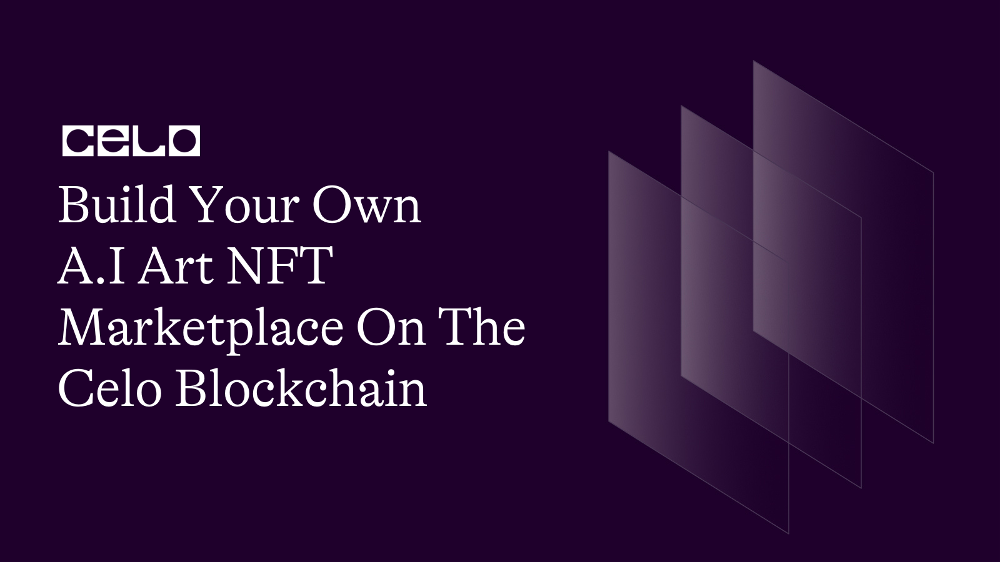

## Introduction

In This tutorial we will build a marketplace where Unique Art works will be generated from a word prompt and converted into an NFT on the celo blockchain. Users can also trade their A.i generated art NFT on the marketplace by setting the price.

By the end of this tutorial, you would have a basic understanding on how to create an A.I NFT marketplace.

Here is a demo app [link](https://dreamy-capybara-5170e0.netlify.app) of what you’ll be creating.

## Prerequisites

To fully follow up with these tutorials, you should have a basic understanding of the following technologies.

- Solidity, smart-contract, and blockchain concepts.
- Hardhat.
- OpenZeppelin.
- React.
- Basic web Development.

## Requirements

- NodeJS 12.0.1 upwards installed.
- Celo Extension Wallet.

## Installation

Click on this [link](https://github.com/4undRaiser/celo-ai-art-marketplace) repo from your github.

- Clone the repo to your computer.
- open the project from from vscode.
- Run `npm install` command to install all the dependencies required to run the app locally.

## SmartContract

Let's dive into the smart contract to understand how it works.

Navigate to the contracts folder and open the MyNft.sol file

The Finished Smart Contract will look like this.

```solidity
// SPDX-License-Identifier: MIT
pragma solidity ^0.8.0;

import "@openzeppelin/contracts/utils/Counters.sol";
import "@openzeppelin/contracts/token/ERC721/ERC721.sol";
import "@openzeppelin/contracts/token/ERC721/extensions/ERC721URIStorage.sol";

contract MyNFT is ERC721URIStorage {
    using Counters for Counters.Counter;
    Counters.Counter private _tokenIds;
    Counters.Counter private allArts;

    address public owner;

    constructor(
        string memory _name,
        string memory _symbol
    ) ERC721(_name, _symbol) {
        owner = msg.sender;
    }

struct Art {
  uint tokenId;
  uint price;
  address seller;
  bool forSale;
}

mapping(uint256 => Art) public arts;

modifier onlyArtOwner(uint _Id) {
        require(msg.sender == arts[_Id].seller);
        _;
    }

    function mintArt(string memory tokenURI) public payable {
        _tokenIds.increment();

        uint256 newItemId = _tokenIds.current();
        _mint(msg.sender, newItemId);
        _setTokenURI(newItemId, tokenURI);
        listArt(newItemId);
    }

    function listArt(uint256 _tokenId) private {
    allArts.increment();
    arts[allArts.current()] = Art(
       _tokenId,
       0,
       payable(msg.sender),
       false
       );
  }

  function sellArt(uint256 _Id, uint _price) external onlyArtOwner(_Id){
     Art storage art = arts[_Id];
     require(_price != 0);
     require(art.seller == msg.sender, "Only the nft owner can sell nft");
     require(art.forSale == false);
      _transfer(msg.sender, address(this), _Id);
      art.price = _price;
     art.forSale = true;
  }

  function cancelArtSale(uint _Id) external onlyArtOwner(_Id){
     Art storage art = arts[_Id];
     require(art.seller == msg.sender);
     require(art.forSale == true);
      _transfer(address(this), msg.sender, _Id);
     art.forSale = false;
  }

  function buyArt(uint _Id) external payable {
        Art storage art = arts[_Id];
        require(_Id > 0 && _Id <= allArts.current(), "item doesn't exist");
        require(msg.value >= art.price,"not enough balance for this transaction");
        require(art.forSale != false, "item is not for sell");
        require(art.seller != msg.sender, "You cannot buy your own nft art");
        payable(art.seller).transfer(art.price);
         _transfer(address(this), msg.sender, art.tokenId);
        art.seller = msg.sender;
        art.forSale = false;
    }

    function totalSupply() public view returns (uint256) {
        return _tokenIds.current();
    }

     function getArt(uint _Id) public view returns (Art memory) {
        return arts[_Id];
    }

     function getAllArts() public view returns (uint) {
        return allArts.current();
    }

}

```

## Breakdown

The first step is to declare the license and solidity version and import all the necessary OpenZeppelin contracts.

```solidity
// SPDX-License-Identifier: MIT
pragma solidity ^0.8.2;

import "@openzeppelin/contracts/utils/Counters.sol";
import "@openzeppelin/contracts/token/ERC721/ERC721.sol";
import "@openzeppelin/contracts/token/ERC721/extensions/ERC721URIStorage.sol";
```

Next, we define our Contract.

```solidity
contract MyNFT is ERC721URIStorage {
    // ...contract goes here
}
```

**Using Counters**

We use the `Counters` library to manage token IDs and the total number of arts. This library provides a simple counter implementation that can be incremented and decremented.

```solidity
using Counters for Counters.Counter;
Counters.Counter private _tokenIds;
Counters.Counter private allArts;
```

**Contract Constructor**

We then define the contract constructor that sets the token name and symbol, and initializes the contract owner

```soldity
constructor(string memory _name, string memory _symbol) ERC721(_name, _symbol) {
    owner = msg.sender;
}
```

**Defining the Art struct and mappings**

We create a struct named `Art` to store information about each NFT. Then, create a mapping named `arts` to associate token IDs with `Art` structs.

```solidity
struct Art {
    uint tokenId;
    uint price;
    address seller;
    bool forSale;
}

mapping(uint256 => Art) public arts;
```

**Defining modifiers**

We define a modifier `onlyArtOwner` to ensure that only the owner of an NFT can call certain functions.

```solidity
modifier onlyArtOwner(uint _Id) {
    require(msg.sender == arts[_Id].seller);
    _;
}
```

**Minting NFTs**

Next we create a function `mintArt` that allows users to mint a new NFT. Increment the token ID counter, mint the token, and call the `listArt` function.

```solidity
   function mintArt(string memory tokenURI) public payable {
    _tokenIds.increment();
    uint256 newItemId = _tokenIds.current();
    _mint(msg.sender, newItemId);
    _setTokenURI(newItemId, tokenURI);
    listArt(newItemId);
}
```

**Listing NFTs for sale**

We then create a private function `listArt` that initializes an Art struct and stores it in the `arts` mapping. Increment the `allArts` counter.

```solidity
    function listArt(uint256 _tokenId) private {
    allArts.increment();
    arts[allArts.current()] = Art(
       _tokenId,
       0,
       payable(msg.sender),
       false
       );
  }
```

**Selling NFTs**

We also create a function `sellArt` that allows NFT owners to list their NFT for sale at a specified price. This function uses the `onlyArtOwner` modifier and transfers the NFT to the contract.

```solidity
function sellArt(uint256 _Id, uint _price) external onlyArtOwner(_Id) {
    Art storage art = arts[_Id];
    require(_price != 0);
    require(art.seller == msg.sender, "Only the nft owner can sell nft");
    require(art.forSale == false);
    _transfer(msg.sender, address(this), _Id);
    art.price = _price;
    art.forSale = true;
}
```

**Canceling NFT sales**

Next we create a function `cancelArtSale` that allows NFT owners to cancel the sale of their NFT. This function also uses the `onlyArtOwner` modifier and transfers the NFT back to the owner.

```solidity
 function cancelArtSale(uint _Id) external onlyArtOwner(_Id) {
    Art storage art = arts[_Id];
    require(art.seller == msg.sender);
    require(art.forSale == true);
    _transfer(address(this), msg.sender, _Id);
    art.forSale = false;
}
```

**Buying NFTs**

Then we create a function `buyArt` that allows users to purchase NFTs. This function checks that the NFT exists, the buyer has enough funds, the NFT is for sale, and the buyer is not the seller. The function then transfers the funds and updates the NFT's ownership and sale status.

```solidity
function buyArt(uint _Id) external payable {
    Art storage art = arts[_Id];
    require(_Id > 0 && _Id <= allArts.current(), "item doesn't exist");
    require(msg.value >= art.price, "not enough balance for this transaction");
    require(art.forSale != false, "item is not for sell");
    require(art.seller != msg.sender, "You cannot buy your own nft art");
    payable(art.seller).transfer(art.price);
    _transfer(address(this), msg.sender, art.tokenId);
    art.seller = msg.sender;
    art.forSale = false;
}
```

**Utility functions**

Finally, we create utility functions `totalSupply`, `getArt`, and `getAllArts` to retrieve information about the total supply of NFTs, details of a specific NFT, and the total number of arts, respectively.

```solidity
 function totalSupply() public view returns (uint256) {
    return _tokenIds.current();
}

function getArt(uint _Id) public view returns (Art memory) {
    return arts[_Id];
}

function getAllArts() public view returns (uint) {
    return allArts.current();
}
```

## Front end

### Stack

We’ll use the following stack for this section.

- Hardhat
- React

### Setup

Clone the full project from [this Repository](https://github.com/4undRaiser/celo-ai-art-marketplace) to follow up with this section.

Here is an example of the env file

```.env
REACT_APP_HUGGING_FACE_API_KEY=""
REACT_APP_NFT_STORAGE_API_KEY=""
MNEMONIC=""
```

Firstly, we need to grab our environment variables as seen in the env example.

To get our hugging face api key, [click here](https://huggingface.co/) create an account and navigate to your profile and create a new api key.

You'll also need to create an account on [NFT.Storage](https://nft.storage/), and create a new API key.

And finally we need to provide a mnemonic for our celo wallet.

### Deployment

We’ll use hardhat to deploy our smart-contracts to the celo blockchain.

Configure your `hardhat.config` file to look like this to enable hardhat to deploy the smart contracts to the celo blockchain.

```javascript
require("@nomicfoundation/hardhat-toolbox");
require("dotenv").config({ path: ".env" });

// This is a sample Hardhat task. To learn how to create your own go to
// https://hardhat.org/guides/create-task.html
task("accounts", "Prints the list of accounts", async (taskArgs, hre) => {
  const accounts = await hre.ethers.getSigners();

  for (const account of accounts) {
    console.log(account.address);
  }
});

module.exports = {
  solidity: "0.8.9",
  networks: {
    alfajores: {
      url: "https://alfajores-forno.celo-testnet.org",
      accounts: {
        mnemonic: process.env.MNEMONIC,
        path: "m/44'/52752'/0'/0",
      },
      chainId: 44787,
    },
  },
};
```

Next let's create a script to deploy the smart contract.

Navigate to the script folder to find the `deploy.js` file

```javascript
const hre = require("hardhat");

async function main() {
  const NAME = "AI Generated NFT";
  const SYMBOL = "AINFT";

  const MyNFT = await hre.ethers.getContractFactory("MyNFT");
  const myNFT = await MyNFT.deploy(NAME, SYMBOL);

  await myNFT.deployed();

  console.log("MyNFT deployed to:", myNFT.address);
  storeContractData(myNFT);
}

function storeContractData(contract) {
  const fs = require("fs");
  const contractsDir = __dirname + "/../src/contracts";

  if (!fs.existsSync(contractsDir)) {
    fs.mkdirSync(contractsDir);
  }

  fs.writeFileSync(
    contractsDir + "/MyNFT-address.json",
    JSON.stringify({ MyNFT: contract.address }, undefined, 2)
  );

  const MyNFTArtifact = artifacts.readArtifactSync("MyNFT");

  fs.writeFileSync(
    contractsDir + "/MyNFT.json",
    JSON.stringify(MyNFTArtifact, null, 2)
  );
}

main()
  .then(() => process.exit(0))
  .catch((error) => {
    console.error(error);
    process.exit(1);
  });
```

The script above will deploy the smart contract and create a contract folder for the ABI and contract address of the smart contract.

Deploy the smart contracts to the celo block-chain by running this command

`npx hardhat run scripts/deploy.js --network alfajores`

You should see something like this in the terminal

`MyNFT deployed to: 0x49F39D9531B826826EDc7066161F20570105AFb1`

**App.js File**

the completed code will look like this

```javascript
import Web3 from "web3";
import { newKitFromWeb3 } from "@celo/contractkit";
import { useState, useEffect, useCallback } from "react";
import axios from "axios";
import { NFTStorage, File } from "nft.storage";

import Spinner from "react-bootstrap/Spinner";

//abis
import MyNFTAbi from "./contracts/MyNFT.json";
import MyNFTAddress from "./contracts/MyNFT-address.json";

// Components
import Marketplace from "./components/marketplace.js";
import Home from "./components/Home.js";

const ERC20_DECIMALS = 18;
var loadingText;

function App() {
  const [contract, setContract] = useState(null);
  const [address, setAddress] = useState(null);
  const [kit, setKit] = useState(null);
  const [cUSDBalance, setcUSDBalance] = useState(0);
  const [arts, setArts] = useState([]);
  const [isLoading, setIsLoading] = useState(false);

  const connectToWallet = async () => {
    if (window.celo) {
      try {
        await window.celo.enable();
        const web3 = new Web3(window.celo);
        let kit = newKitFromWeb3(web3);

        const accounts = await kit.web3.eth.getAccounts();
        const user_address = accounts[0];
        kit.defaultAccount = user_address;

        await setAddress(user_address);
        await setKit(kit);
      } catch (error) {
        console.log(error);
      }
    } else {
      alert("Error Occurred");
    }
  };

  const getBalance = useCallback(async () => {
    try {
      const balance = await kit.getTotalBalance(address);
      const USDBalance = balance.cUSD.shiftedBy(-ERC20_DECIMALS).toFixed(2);

      const contract = new kit.web3.eth.Contract(
        MyNFTAbi.abi,
        MyNFTAddress.MyNFT
      );
      setContract(contract);
      setcUSDBalance(USDBalance);
    } catch (error) {
      console.log(error);
    }
  }, [address, kit]);

  const createAndMint = async (_name, _description) => {
    if (_name === "" || _description === "") {
      window.alert("Please provide a name and description");
      return;
    }

    try {
      setIsLoading(true);
      loadingText = "Creating and Minting Art......";
      // Call AI API to generate a image based on description
      const imageData = await createImage(_name, _description);

      if (imageData) {
        const url = await uploadToIpfs(imageData, _name, _description);
        console.log(url);

        //Mint NFT
        await mintImage(url);
      }

      getArts();
    } catch (error) {
      console.error("Error creating and minting NFT:", error);
    } finally {
      setIsLoading(false);
    }
  };

  const createImage = async (_name, _description) => {
    //  setMessage("Generating Image...")

    // You can replace this with different model API's
    const URL = `https://api-inference.huggingface.co/models/stabilityai/stable-diffusion-2`;

    // Send the request
    const response = await axios({
      url: URL,
      method: "POST",
      headers: {
        Authorization: `Bearer ${process.env.REACT_APP_HUGGING_FACE_API_KEY}`,
        Accept: "application/json",
        "Content-Type": "application/json",
      },
      data: JSON.stringify({
        inputs: _description,
        options: { wait_for_model: true },
      }),
      responseType: "arraybuffer",
    });

    const data = response.data;
    // step 2
    return data;
  };

  const mintImage = async (tokenURI) => {
    //setMessage("Waiting for Mint...")
    await contract.methods.mintArt(tokenURI).send({ from: address });
  };

  const getArts = async () => {
    try {
      const nfts = [];
      const nftsLength = await contract.methods.getAllArts().call();
      // contract starts minting from index 1
      for (let i = 1; i <= Number(nftsLength); i++) {
        const nft = new Promise(async (resolve) => {
          const art = await contract.methods.getArt(i).call();
          const res = await contract.methods.tokenURI(i).call();
          const meta = await fetchNftMeta(res);
          resolve({
            index: i,
            tokenId: art.tokenId,
            price: art.price,
            seller: art.seller,
            forSale: art.forSale,
            name: meta.data.name,
            image: meta.data.image,
            description: meta.data.description,
          });
        });
        nfts.push(nft);
      }
      const _nfts = await Promise.all(nfts);
      setArts(_nfts);
    } catch (e) {
      console.log({ e });
    }
  };

  const fetchNftMeta = async (ipfsUrl) => {
    try {
      if (!ipfsUrl) return null;
      const meta = await axios.get(ipfsUrl);
      return meta;
    } catch (e) {
      console.log({ e });
    }
  };

  const uploadToIpfs = async (imageData, _name, _description) => {
    // Create instance to NFT.Storage
    const nftstorage = new NFTStorage({
      token: process.env.REACT_APP_NFT_STORAGE_API_KEY,
    });

    // Send request to store image
    const { ipnft } = await nftstorage.store({
      image: new File([imageData], "image.jpeg", { type: "image/jpeg" }),
      name: _name,
      description: _description,
    });

    // Save the URL
    const url = `https://ipfs.io/ipfs/${ipnft}/metadata.json`;
    return url;
  };

  const sellArt = async (_tokenId, _price) => {
    try {
      setIsLoading(true);
      loadingText = "Setting price to sell Art......";
      await contract.methods.sellArt(_tokenId, _price).send({ from: address });
      getArts();
    } catch (error) {
      alert(error);
    } finally {
      setIsLoading(false);
    }
  };

  const cancel = async (_tokenId) => {
    try {
      setIsLoading(true);
      loadingText = "Canceling Art Sale........";
      await contract.methods.cancelArtSale(_tokenId).send({ from: address });
      getArts();
    } catch (error) {
      alert(error);
    } finally {
      setIsLoading(false);
    }
  };

  const buyArt = async (tokenId) => {
    try {
      setIsLoading(true);
      loadingText = "Buying and transfering NFT Art.....";
      const listing = await contract.methods.getArt(tokenId).call();
      await contract.methods
        .buyArt(tokenId)
        .send({ from: address, value: listing.price });
    } catch (error) {
      console.log({ error });
    } finally {
      setIsLoading(false);
    }
  };

  useEffect(() => {
    connectToWallet();
  }, []);

  useEffect(() => {
    if (kit && address) {
      getBalance();
    }
  }, [kit, address, getBalance]);

  useEffect(() => {
    if (contract) {
      getArts(contract);
    }
  }, [contract]);

  return (
    <div className="App">
      {isLoading && (
        <div className="spinner-container">
          <Spinner animation="border" role="status">
            <span className="visually-hidden">Loading...</span>
          </Spinner>
          <p className="spinner-text">{loadingText}</p>
        </div>
      )}

      <Home cUSDBalance={cUSDBalance} createAndMint={createAndMint} />
      <Marketplace
        arts={arts}
        sellArt={sellArt}
        cancel={cancel}
        buyArt={buyArt}
        walletAddress={address}
      />
    </div>
  );
}

export default App;
```

Now lets break down the components

First we import all the neccesary libraries and components that we will be needing.

```javascript
import Web3 from "web3";
import { newKitFromWeb3 } from "@celo/contractkit";
import { useState, useEffect, useCallback } from "react";
import axios from "axios";
import { NFTStorage, File } from "nft.storage";
import Spinner from "react-bootstrap/Spinner";

//abis
import MyNFTAbi from "./contracts/MyNFT.json";
import MyNFTAddress from "./contracts/MyNFT-address.json";

// Components
import Marketplace from "./components/marketplace.js";
import Home from "./components/Home.js";
```

Then we use the useState hook to define some state variables — `contract`, `address`, `kit`, `cUSDBalance`, `arts`, and `isLoading` — that will be used throughout the code.

```javascript
const [contract, setContract] = useState(null);
const [address, setAddress] = useState(null);
const [kit, setKit] = useState(null);
const [cUSDBalance, setcUSDBalance] = useState(0);
const [arts, setArts] = useState([]);
const [isLoading, setIsLoading] = useState(false);
```

Next, we create the `connectToWallet` function, which enables the user to connect to their wallet. This function uses the window.celo object, provided by the Celo wallet, to access the user’s address and create a Web3 instance using their address. This Web3 instance is then used to create a `ContractKit` instance and set the user’s address as the default account.

```javascript
const connectToWallet = async () => {
  if (window.celo) {
    try {
      await window.celo.enable();
      const web3 = new Web3(window.celo);
      let kit = newKitFromWeb3(web3);

      const accounts = await kit.web3.eth.getAccounts();
      const user_address = accounts[0];
      kit.defaultAccount = user_address;

      await setAddress(user_address);
      await setKit(kit);
    } catch (error) {
      console.log(error);
    }
  } else {
    alert("Error Occurred");
  }
};
```

We then call the `getBalance` function, which uses the `ContractKit` instance to get the user’s cUSD balance and create a Contract instance for the MyNFT contract.

```javascript
const getBalance = useCallback(async () => {
  try {
    const balance = await kit.getTotalBalance(address);
    const USDBalance = balance.cUSD.shiftedBy(-ERC20_DECIMALS).toFixed(2);

    const contract = new kit.web3.eth.Contract(
      MyNFTAbi.abi,
      MyNFTAddress.MyNFT
    );
    setContract(contract);
    setcUSDBalance(USDBalance);
  } catch (error) {
    console.log(error);
  }
}, [address, kit]);
```

The `createAndMint` function is used to create and mint an NFT. It calls the `createImage`, `uploadToIpfs`, and `mintImage` functions to generate an image based on the name and description provided, upload the image to IPFS (NFT.Storage), and mint an NFT with the uploaded image.

```javascript
onst createAndMint = async (_name, _description) => {

   if (_name === "" || _description === "") {
     window.alert("Please provide a name and description")
     return
   }

     try{
       setIsLoading(true);
       loadingText = "Creating and Minting Art......"
   // Call AI API to generate a image based on description
   const imageData = await createImage(_name, _description);

   if(imageData){
   const url = await uploadToIpfs(imageData, _name, _description)
   console.log(url);

   //Mint NFT
   await mintImage(url);
   }

   getArts()
 }catch (error) {
   console.error("Error creating and minting NFT:", error);
 } finally {
   setIsLoading(false);
 }
};
```

The `createImage` function is used to generate an image based on the `name` and `description` provided, using the `HuggingFace` AI API.

```javascript
const createImage = async (_name, _description) => {
  // You can replace this with different model API's
  const URL = `https://api-inference.huggingface.co/models/stabilityai/stable-diffusion-2`;

  const response = await axios({
    url: URL,
    method: "POST",
    headers: {
      Authorization: `Bearer ${process.env.REACT_APP_HUGGING_FACE_API_KEY}`,
      Accept: "application/json",
      "Content-Type": "application/json",
    },
    data: JSON.stringify({
      inputs: _description,
      options: { wait_for_model: true },
    }),
    responseType: "arraybuffer",
  });

  const data = response.data;

  return data;
};
```

The `mintImage` function is used to mint an NFT with the url of the uploaded image.

```javascript
onst mintImage = async (tokenURI) => {

   await contract.methods.mintArt(tokenURI)
  .send({ from: address });
}

```

The `getArts` function is used to retrieve all the NFTs that have been minted.

```javascript
onst getArts = async () => {
try {
  const nfts = [];
  const nftsLength = await contract.methods
    .getAllArts()
    .call();
  // contract starts minting from index 1
  for (let i = 1; i <= Number(nftsLength); i++) {
    const nft = new Promise(async (resolve) => {
      const art = await contract.methods
        .getArt(i)
        .call();
      const res = await contract.methods.tokenURI(i).call();
      const meta = await fetchNftMeta(res);
      resolve({
        index: i,
        tokenId: art.tokenId,
        price: art.price,
        seller: art.seller,
        forSale: art.forSale,
        name: meta.data.name,
        image: meta.data.image,
        description: meta.data.description,
      });
    });
    nfts.push(nft);
  }
  const _nfts = await Promise.all(nfts);
  setArts(_nfts);
} catch (e) {
  console.log({ e });
}
};
```

The `fetchNftMeta` function is used to fetch the `metadata` of an NFT.

```javascript
const fetchNftMeta = async (ipfsUrl) => {
  try {
    if (!ipfsUrl) return null;
    const meta = await axios.get(ipfsUrl);
    return meta;
  } catch (e) {
    console.log({ e });
  }
};
```

The `uploadToIpfs` function is used to upload the generated image to IPFS (NFT.Storage).

```javascript
const uploadToIpfs = async (imageData, _name, _description) => {
  // Create instance to NFT.Storage
  const nftstorage = new NFTStorage({
    token: process.env.REACT_APP_NFT_STORAGE_API_KEY,
  });

  // Send request to store image
  const { ipnft } = await nftstorage.store({
    image: new File([imageData], "image.jpeg", { type: "image/jpeg" }),
    name: _name,
    description: _description,
  });

  const url = `https://ipfs.io/ipfs/${ipnft}/metadata.json`;
  return url;
};
```

The `sellArt` function is used to set the price for a specific NFT Art and also to toggle the forsale property of an NFT Art.

```javascript
const sellArt = async (_tokenId, _price) => {
  try {
    setIsLoading(true);
    loadingText = "Setting price to sell Art......";
    await contract.methods.sellArt(_tokenId, _price).send({ from: address });
    getArts();
  } catch (error) {
    alert(error);
  } finally {
    setIsLoading(false);
  }
};
```

The `cancel` function is used to cancel the sale of an NFT.

```javascript
const cancel = async (_tokenId) => {
  try {
    setIsLoading(true);
    loadingText = "Canceling Art Sale........";
    await contract.methods.cancelArtSale(_tokenId).send({ from: address });
    getArts();
  } catch (error) {
    alert(error);
  } finally {
    setIsLoading(false);
  }
};
```

The `buyArt` function is used to buy an NFT and transfer ownership of the NFT to the buyer once the transaction is successfull.

```javascript
const buyArt = async (tokenId) => {
  try {
    setIsLoading(true);
    loadingText = "Buying and transfering NFT Art.....";
    const listing = await contract.methods.getArt(tokenId).call();
    await contract.methods
      .buyArt(tokenId)
      .send({ from: address, value: listing.price });
  } catch (error) {
    console.log({ error });
  } finally {
    setIsLoading(false);
  }
};
```

The `useEffect` hook is used to connect to the wallet and retrieve the user's balance when the component is mounted, and fetch all the `NFTs` when the contract is set.

```javascript
useEffect(() => {
  connectToWallet();
}, []);

useEffect(() => {
  if (kit && address) {
    getBalance();
  }
}, [kit, address, getBalance]);

useEffect(() => {
  if (contract) {
    getArts(contract);
  }
}, [contract]);
```

And then finally, we render all our components and also added some logic for our loader spinner.

```javascript
return (
  <div className="App">
    {isLoading && (
      <div className="spinner-container">
        <Spinner animation="border" role="status">
          <span className="visually-hidden">Loading...</span>
        </Spinner>
        <p className="spinner-text">{loadingText}</p>
      </div>
    )}
    <Home cUSDBalance={cUSDBalance} createAndMint={createAndMint} />
    <Marketplace
      arts={arts}
      sellArt={sellArt}
      cancel={cancel}
      buyArt={buyArt}
      walletAddress={address}
    />
  </div>
);

export default App;
```

There you have it. We have successfully interacted with our smart contract.

## Next Steps

I hope you learned a lot from this tutorial. Here are some relevant links that would aid your learning further.

- [Celo Docs](https://docs.celo.org/)
- [OpenZeppelin](https://www.openzeppelin.com/contracts)
- [Solidity Docs](https://docs.soliditylang.org/en/v0.8.17/)

## About the author

I'm Jonathan Iheme, A full stack block-chain Developer from Nigeria.

[LinkedIn](https://www.linkedin.com/in/jonathan-iheme-31a63718b)

Thank You!!
