import YouTube from '@components/YouTube';

# 3 Simple Steps to Get Started with Valora on Celo

_Send, pay, and spend cryptocurrency like everyday money — all from the palm of your hand._

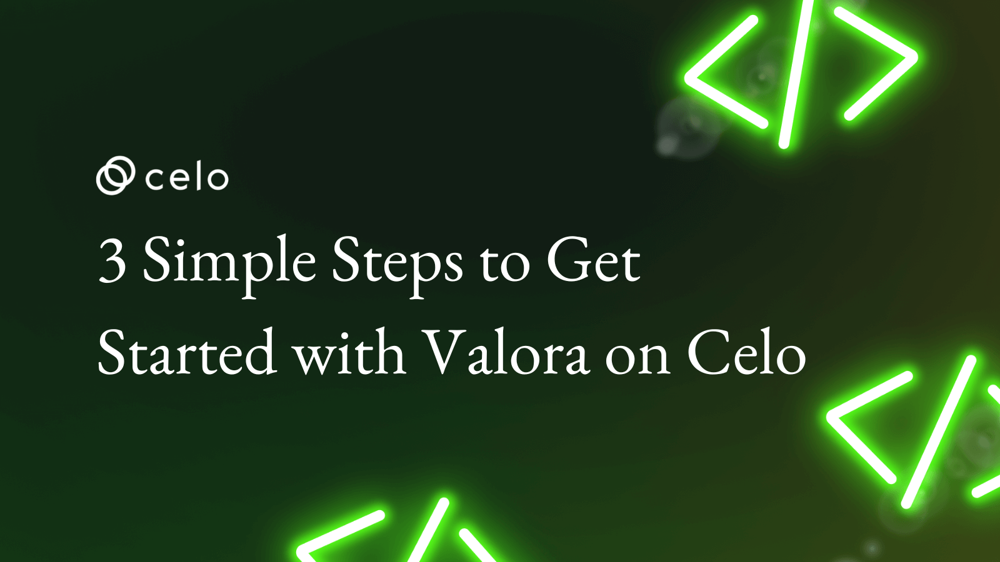

## Hello Developers 🌱

Welcome to today’s post, where we’ll break down a blockchain topic into bite-sized pieces to help you learn and apply your new skills in the real world.

Today’s topic is Getting started with Valora on Celo.

**Here’s a list of what we’ll cover 🗒**

- ✅ **Step 1:** Download Valora
- ✅ **Step 2:** Create your Valora account
- ✅ **Step 3:** Use the Valora app

By the end of this post, you’ll be up and running with Valora and ready to send Celo assets to your friends directly from your mobile phone.

Let’s go! 🚀

## Introduction to Valora

[Valora](https://valoraapp.com/) is a mobile wallet focused on making global peer-to-peer payments simple and accessible to anyone. It’s built on Celo and allows your to use your mobile phone number to send payments to your friends.

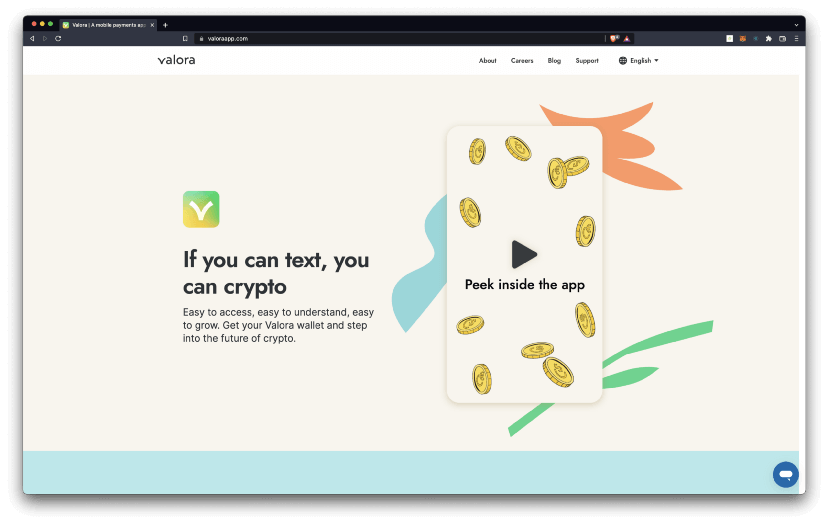

Valora syncs to your contacts list, which means you can make payments, send international remittances or simply split the bill with someone in your contact list — no matter where they are in the world.

## ✅ Step 1: Download Valora

To get started you’ll download Valora app. It is available in the [App Store](https://apps.apple.com/us/app/valora-crypto-wallet/id1520414263) for iOS devices and [Play Store](https://play.google.com/store/apps/details?id=co.clabs.valora&gl=US) for Android devices (links available on our [home page](https://valoraapp.com/).

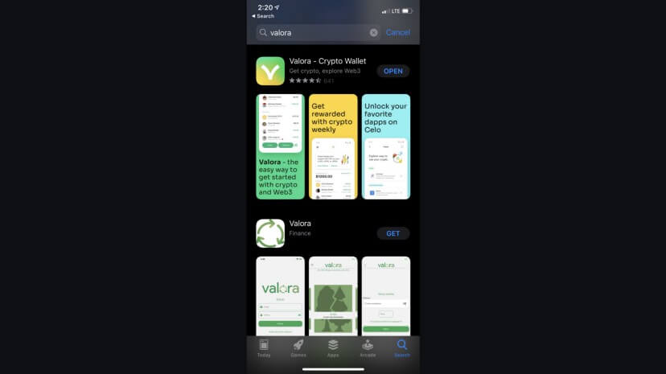

Open the Valora app once it is done installing on your mobile device.

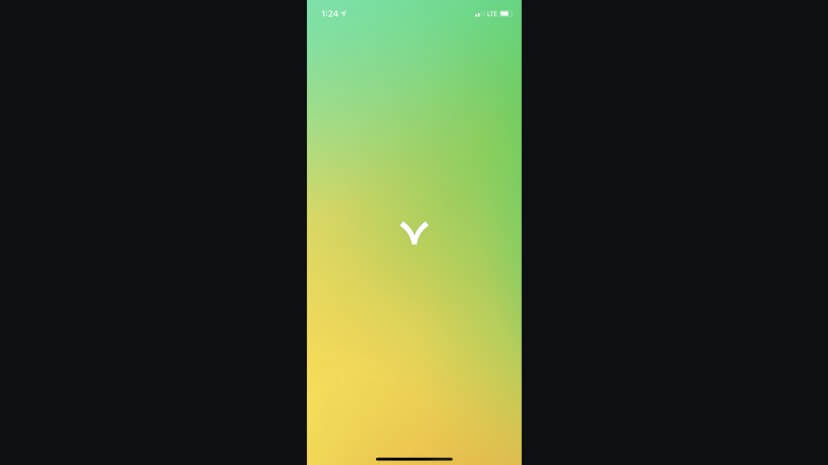

Read and navigate through the introductory screens and click **Get Started**.

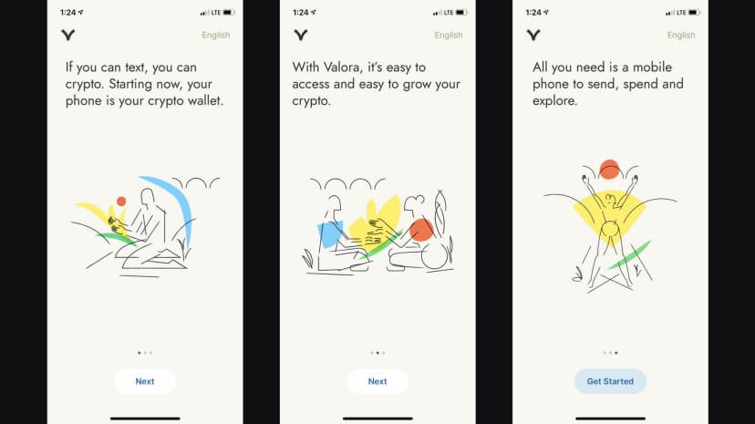

## ✅ Step 2: Create your Valora account

From your Valora app, select create a new account to start setting up your new wallet. You may also **Restore an account** if you have an existing Valora account.

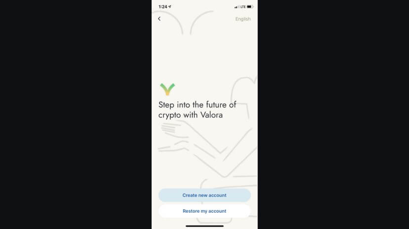

### Terms and Conditions

Read and accept the terms and conditions.

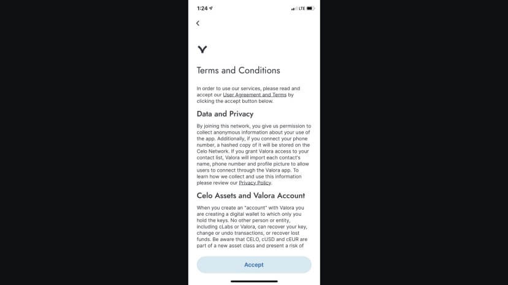

### Name and Profile

Create a name for your account and add a profile photo.

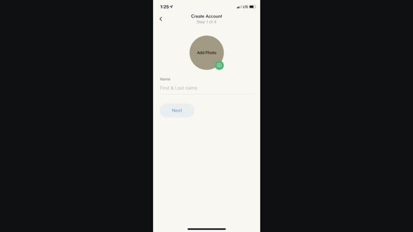

### Pin Number

Create a memorable but secure pin number. You will need your PIN whenever you make a transaction, so make it memorable but not easy to guess.

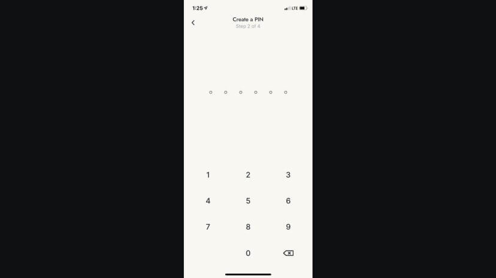

### Face ID

Click Turn on Face ID if you would like to secure your wallet and make it easier to access Valora.

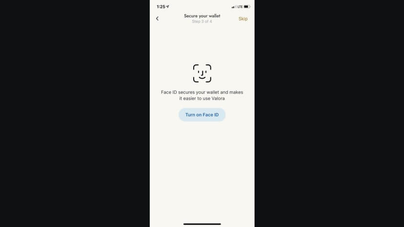

### Connect your phone number

Finally, connect your phone number to Valora. You will need to connect your own phone number if you wish to send funds directly to the phone number of your friends and family members.

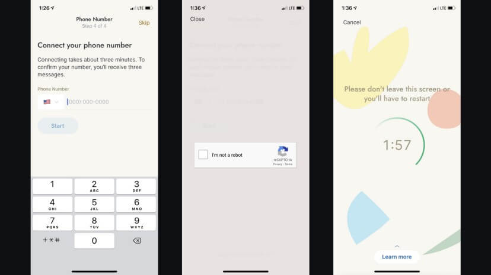

You’ll receive 3 confirmation texts, each with a unique code. Just enter these in the respective fields. Hold tight, as the codes might take a few seconds to arrive. Once your number is connected, you can sync your contact information.

## ✅ Step 3: Use the Valora app

At this point, you have completed your account setup and can begin using Valora. Click Add Funds on the popup to fund your account from a debit card, bank account, or cryptocurrency exchange.

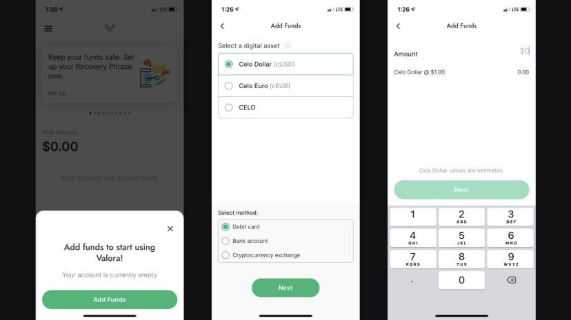

For now, you may close this popup to skip this step use Valora without adding funds. You’ll instead add funds later after you create your recovery phrase.

### Menu

Select the menu on the top left of your app to view other screens on the Valora app. These screens include home, CELO, Dapps, Recovery Phrase, Add & Withdraw, Settings, and Help. This menu also shows your account address which you may share with others to receive transactions on Valora.

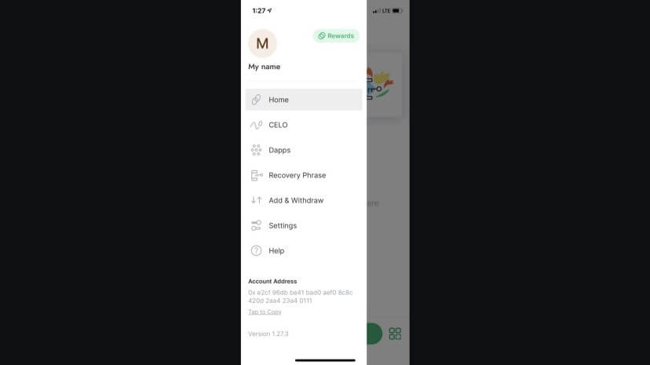

### Home

You can send or request payments with your contacts from the home screen! To sync your contact list, tap send on your Valora home screen to send funds from a users name, phone number, address, or QR code.

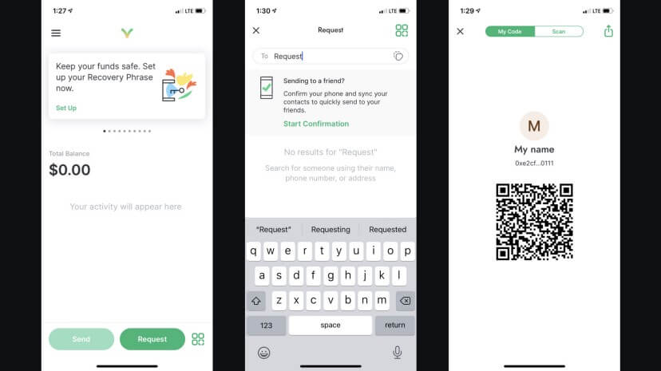

Search and select the contact you want to send funds to and follow the prompts on the screen. If your contact doesn’t have Valora yet, don’t worry, the funds will be kept safe until they create their Valora account.

### CELO

The CELO screen allows you to view the current price of CELO and your current CELO balance. You may also withdraw CELO and view all of your CELO activity from this screen.

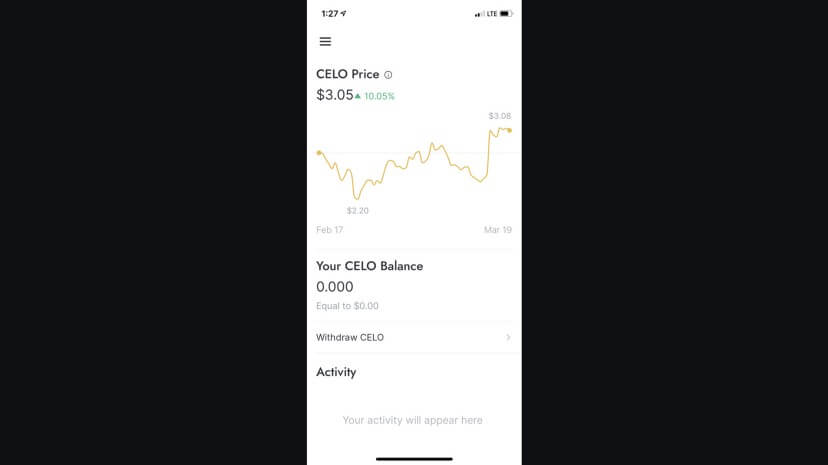

### Dapps

The Dapp screen is Valora’s Dapp explorer that allows you to view all Celo applications that integrate with Valora. You may use your Celo assets to make use of any application listed on this menu.

Selecting a Dapp will take you to its home page where you can learn more about getting started with the Dapp and its Valora integration.

### Recovery Phrase

Set this up before funding your account. Your Valora recovery phrase is an extremely important part of your account. Without this phrase you may not be able to recover your account in the future, and with this phrase anyone can access your account.

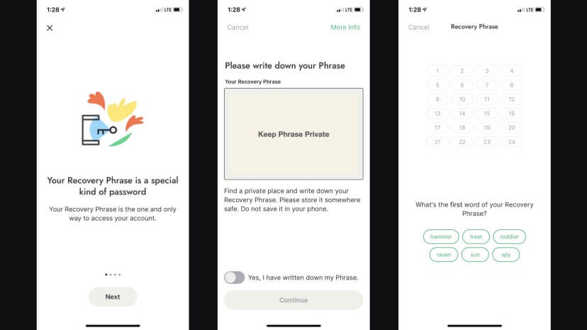

Read more about[what your Recovery Phrase is and why it is important](https://valoraapp.com/support/account-key).

### Add & Withdraw

Now that you have a recovery phrase, you may add or withdraw Celo assets at any time using your debit card, bank account, or cryptocurrency exchange. Use the link provided for additional details on funding your account.

You can also send Celo assets to your account from any other wallet using the Account Address shown on the bottom of your menu.

### Settings

The settings page allows you to manage important account information like your profile, security, data, and legal information. Use this anytime you’d like to edit important account details.

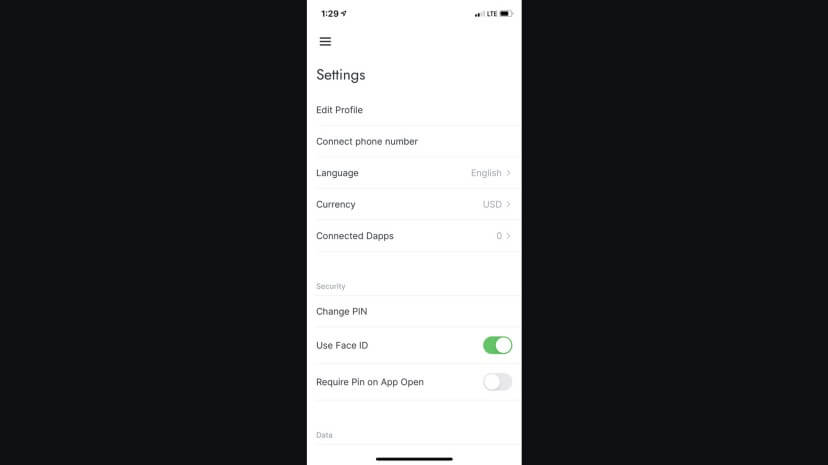

### Help

The help page links you to frequently asked questions, forum, and contact information to allow you to get support from the Valora team. Use this anytime you run into issues with Valora or would like to contact the Valora team.

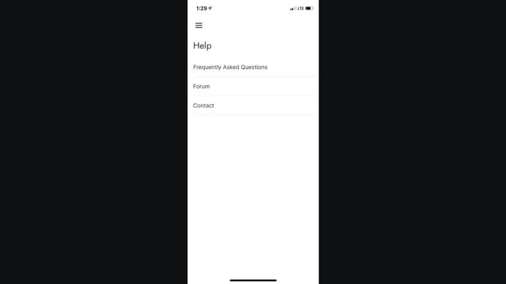

### Supercharge

By adding Celo Dollars or Celo Euros to your account, you will automatically start earning rewards on those balances. Select the Rewards icon from the menu to learn more about supercharging your rewards.

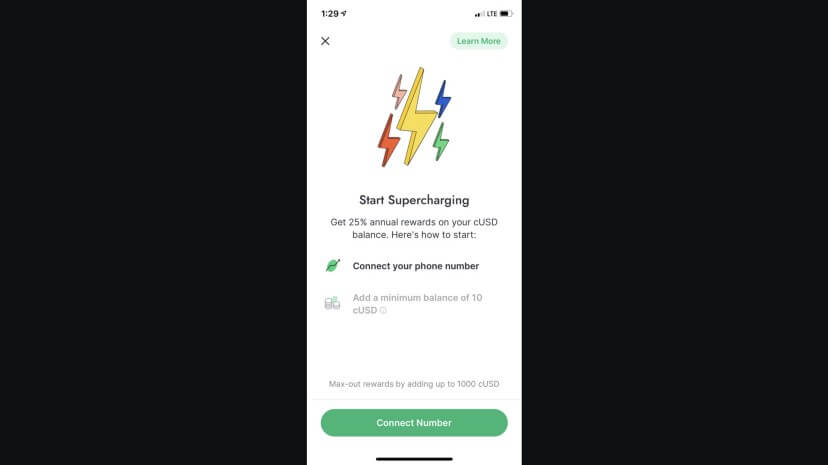

## Congratulations 🎉

That wraps up today’s topic on Getting started with Valora on Celo. You can review each of the items we covered below and check that you’re ready to apply these new skills.

**Here’s a quick review of what we covered 🤔**

- ✅ **Step 1:** Download Valora
- ✅ **Step 2:** Create your Valora account
- ✅ **Step 3:** Use the Valora app

If you made it this far, you downloaded Valora, created an account, and understand how to use each of its basic features. You’re now ready to send Celo assets to your friends from your mobile phone.

GN! 👋
