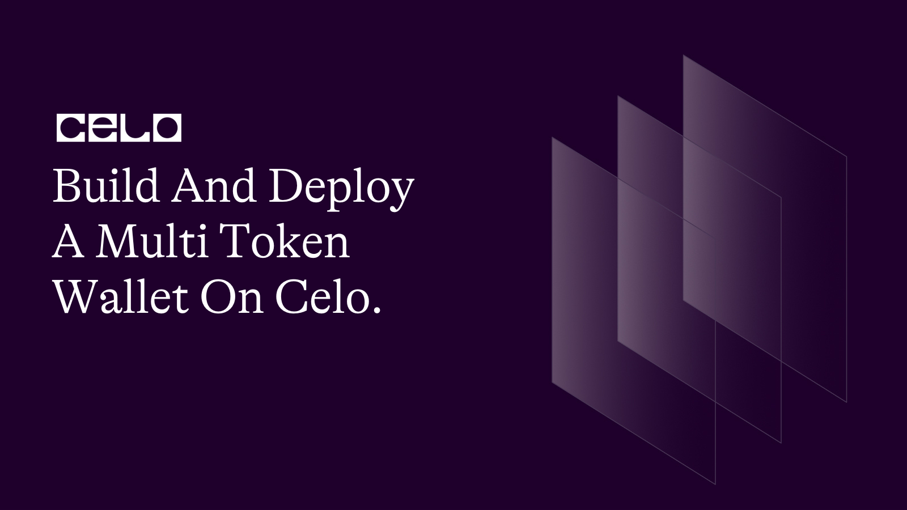

## Introduction

In this tutorial, we will be creating a Decentralized Multitoken wallet smart contract that allows users to deposit and withdraw multiple ERC20 standard tokens in a single wallet. The contract is designed to support any ERC20 token that implements the IERC20 interface. The contract will also have functionality to set the maximum idle time for an account, as well as the ability to add or remove supported tokens.

[Project Repository](https://github.com/4undRaiser/celo-multi-token-wallet)

## Prerequisites

To follow this tutorial, you will need the following:

- Basic knowledge of Solidity programming language.
- A Development Environment Like Remix.
- The celo Extension Wallet.

## SmartContract

Let's begin writing our smart contract in Remix IDE

The completed code Should look like this.

```solidity
// SPDX-License-Identifier: MIT
pragma solidity ^0.8.0;

interface IERC20 {
    function balanceOf(address account) external view returns (uint256);

    function transfer(address to, uint256 value) external returns (bool);

    function transferFrom(
        address from,
        address to,
        uint256 value
    ) external returns (bool);
}

contract MultiTokenWallet {
    uint256 private _maxIdleTime = 30 minutes;

    address private contractOwner;

    constructor() {
        contractOwner = msg.sender;
    }

    mapping(address => mapping(address => uint256)) private _balances;
    mapping(address => bool) private _supportedTokens;
    mapping(address => uint256) private _lastSeen;

    event Deposit(
        address indexed account,
        address indexed token,
        uint256 amount
    );
    event Withdrawal(
        address indexed account,
        address indexed token,
        uint256 amount
    );

    function deposit(address token, uint256 amount) external {
        require(_supportedTokens[token], "Unsupported token");
        require(
            IERC20(token).transferFrom(msg.sender, address(this), amount),
            "Token transfer failed"
        );
        _balances[msg.sender][token] += amount;
        _lastSeen[msg.sender] = block.timestamp;
        emit Deposit(msg.sender, token, amount);
    }

    function withdraw(address token, uint256 amount) external {
        require(_balances[msg.sender][token] >= amount, "Insufficient balance");
        require(
            IERC20(token).transfer(msg.sender, amount),
            "Token transfer failed"
        );
        _balances[msg.sender][token] -= amount;
        _lastSeen[msg.sender] = block.timestamp;
        emit Withdrawal(msg.sender, token, amount);
    }

    function balanceOf(
        address account,
        address token
    ) external view returns (uint256) {
        return _balances[account][token];
    }

    function setSupportedToken(address token, bool isSupported) external {
        require(
            msg.sender == owner(),
            "Only owner can modify supported tokens"
        );
        _supportedTokens[token] = isSupported;
    }

    function setMaxIdleTime(uint256 idleTime) external {
        require(msg.sender == owner(), "Only owner can modify max idle time");
        _maxIdleTime = idleTime;
    }

    function owner() public view returns (address) {
        return (contractOwner);
    }
}
```

### Setting up

First, we declared our license and the solidity version.

```solidity
// SPDX-License-Identifier: MIT
pragma solidity ^0.8.0;
```

The next part of the code defines an interface called `IERC20`, which is a standard interface for `ERC20 tokens`. It defines three functions: `balanceOf()`, `transfer()`, and `transferFrom()`.

And then we defined our smart contract `MultiTokenWallet`.

```solidity
interface IERC20 {
    function balanceOf(address account) external view returns (uint256);
    function transfer(address to, uint256 value) external returns (bool);
    function transferFrom(address from, address to, uint256 value) external returns (bool);
}

contract MultiTokenWallet {
    // Contract code goes here
}
```

### Variables and mappings

We will now define some variables and mappings that will be used by our contract.

```solidity
    uint256 private _maxIdleTime = 30 minutes;

    address private contractOwner;

    constructor(){
        contractOwner = msg.sender;
    }

    mapping(address => mapping(address => uint256)) private _balances;
    mapping(address => bool) private _supportedTokens;
    mapping(address => uint256) private _lastSeen;

```

The `_maxIdleTime` variable determines the amount of time that an account can remain idle before its funds can be forfeited. The `contractOwner` variable is used to store the address of the owner of the contract, which is set to the address of the account that deployed the contract.

The `_balances` mapping stores the balances of each account for each supported token. The `_supportedTokens` mapping is used to keep track of which tokens are supported by the wallet. And the `_lastSeen` mapping keeps track of the last time that an account interacted with the wallet.

### Events

We will now define two events that will be emitted by our contract whenever a deposit or withdrawal is made.

```solidity
    event Deposit(address indexed account, address indexed token, uint256 amount);
    event Withdrawal(address indexed account, address indexed token, uint256 amount);
```

The `Deposit` event is emitted whenever a deposit is made to the wallet, and includes the account that made the deposit, the token that was deposited, and the amount that was deposited. The `Withdrawal` event is emitted whenever a withdrawal is made from the wallet, and includes the account that made the withdrawal, the token that was withdrawn, and the amount that was withdrawn.

### Deposit function

We will now define the `deposit()` function, which will allow users to deposit tokens into the wallet.

```solidity
     function deposit(address token, uint256 amount) external {
        require(_supportedTokens[token], "Unsupported token");
        require(IERC20(token).transferFrom(msg.sender, address(this), amount), "Token transfer failed");
        _balances[msg.sender][token] += amount;
        _lastSeen[msg.sender] = block.timestamp;
        emit Deposit(msg.sender, token, amount);
    }
```

The function takes two arguments: `token`, which is the address of the token being deposited, and `amount`, which is the amount of the token being deposited. The function first checks that the token being deposited is supported and then it transfers the token from the sender to the smart contract. It then update the account balance and the last seen of the sender address.

And finally it emits a `Deposit` event with the defined outputs

### Withdraw function

Now let's take a look at the `withdraw()` function. This function allows a user to withdraw a certain amount of tokens from their balance in the contract. Similar to the deposit function, the user must specify which token they wish to withdraw, and the amount they wish to withdraw.

```solidity
function withdraw(address token, uint256 amount) external {
    require(_balances[msg.sender][token] >= amount, "Insufficient balance");
    require(IERC20(token).transfer(msg.sender, amount), "Token transfer failed");
    _balances[msg.sender][token] -= amount;
    _lastSeen[msg.sender] = block.timestamp;
    emit Withdrawal(msg.sender, token, amount);
}
```

The function first checks that the user has a sufficient balance of the specified token in the contract. If the user does not have enough balance, the function will revert and the transaction will not be executed. If the user has enough balance, the function will transfer the specified amount of tokens from the contract to the user's address using the transfer function from the `IERC20 interface`. The user's `balance` in the contract is then updated accordingly and the `_lastSeen` mapping is updated with the current `timestamp` to track the last time the user interacted with the contract. Finally, the function emits a Withdrawal event to notify external parties of the transaction.

### BalanceOf function

Next, let's look at the balanceOf function:

```solidity
function balanceOf(address account, address token) external view returns (uint256) {
    return _balances[account][token];
}
```

This function simply returns the balance of the specified token for the specified account. It is a view function, meaning that it does not modify the state of the contract and does not require a transaction to be executed.

### setSupportedToken function

Moving on, we have the `setSupportedToken` function:

```solidity
  function setSupportedToken(address token, bool isSupported) external {
    require(msg.sender == owner(), "Only owner can modify supported tokens");
    _supportedTokens[token] = isSupported;
}
```

This function allows the contract owner to add or remove support for a particular `token`. The function takes in the `token` address and a boolean flag indicating whether the token should be supported or not. The function first checks that the caller of the function is the contract owner using the owner function, and reverts the transaction if this condition is not met. If the caller is the contract owner, the function updates the `_supportedTokens` mapping to reflect the new support status for the specified `token`.

The `executeProposal()` is a function that allows the proposer of a proposal to execute it. The function first checks that the proposer is the one calling the function, that the proposal has not been executed yet, and that the number of "yes" votes is greater than the number of "no" votes. If all of these conditions are met, the function sets the executed flag to true, indicating that the proposal has been executed. Finally, any actions described in the proposal can be performed.

### setMaxIdleTime function

Lastly, we have the `setMaxIdleTime()` function:

```solidity
 function setMaxIdleTime(uint256 idleTime) external {
    require(msg.sender == owner(), "Only owner can modify max idletime");
    _maxIdleTime = idleTime;
}
```

This function allows the contract owner to set the maximum amount of time that can elapse without a user interacting with the contract before their tokens are considered "idle". The function takes in the idle time in seconds as an argument. The function first checks that the caller of the function is the contract owner using the owner function, and reverts the transaction if this condition is not met. If the caller is the contract owner, the function updates the `_maxIdleTime` variable to reflect the new maximum idle time.

## Deployment

To deploy our smart contract successfully, we need the celo extention wallet which can be downloaded from [here](https://chrome.google.com/webstore/detail/celoextensionwallet/kkilomkmpmkbdnfelcpgckmpcaemjcdh?hl=en)

Next, we need to fund our newly created wallet which can done using the celo alfojares faucet [Here](https://celo.org/developers/faucet)

You can now fund your wallet and deploy your contract using the celo plugin in remix.

## Conclusion

That concludes our tutorial on the MultiTokenWallet contract! In summary, we've covered how to implement a simple multi-token wallet contract that allows users to deposit and withdraw various ERC20 tokens. The contract owner can add or remove support for different tokens, as well as set a maximum idle time.

## Next Steps

I hope you learned a lot from this tutorial. Here are some relevant links that would aid your learning further.

- [Celo Docs](https://docs.celo.org/)
- [Solidity Docs](https://docs.soliditylang.org/en/v0.8.17/)

## About the author

I'm Jonathan Iheme, A full stack block-chain Developer from Nigeria.

Thank You!!
