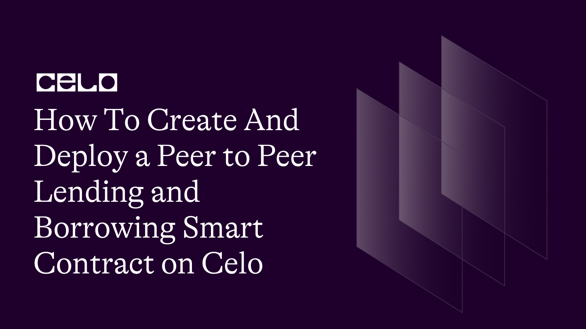

## Introduction

In this tutorial, we will be building a peer to peer lending and borrowing smart contract. This contract enables users to create, fund, and repay loans using the celo cUSD as a form of payment. It also defines the minimum and maximum loan amounts, as well as the minimum and maximum interest rates that can be set for a loan. By the end of the tutorial, you should have a good strong foundational knowledge on building a p2p lending and borrowing smart contract.

[Project Repository](https://github.com/4undRaiser/celo-p2p-lending)

## Requirements

- [Remix IDE](https://remix.ethereum.org/)

## Prerequisites

- [Solidity](https://docs.soliditylang.org/en/v0.8.17/)
- Basic Understanding Of Blockchain Technology.

### Writing The P2PLending Smart Contract

Now it's time to write your p2plending smart contract

This is how the completed code should look like.

```solidity
// SPDX-License-Identifier: MIT
pragma solidity ^0.8.0;
contract P2PLending {
    // The minimum and maximum amount of ETH that can be loaned
    uint public constant MIN_LOAN_AMOUNT = 0.1 ether;
    uint public constant MAX_LOAN_AMOUNT = 10 ether;
    // The minimum and maximum interest rate in percentage that can be set for a loan
    uint public constant MIN_INTEREST_RATE = 1;
    uint public constant MAX_INTEREST_RATE = 10;
    struct Loan {
        uint amount;
        uint interest;
        uint duration;
        uint repaymentAmount;
        uint fundingDeadline;
        address borrower;
        address payable lender;
        bool active;
        bool repaid;
    }
    mapping(uint => Loan) public loans;
    uint public loanCount;
    event LoanCreated(
        uint loanId,
        uint amount,
        uint interest,
        uint duration,
        uint fundingDeadline,
        address borrower,
        address lender
    );
    event LoanFunded(uint loanId, address funder, uint amount);
    event LoanRepaid(uint loanId, uint amount);
    modifier onlyActiveLoan(uint _loanId) {
        require(loans[_loanId].active, "Loan is not active");
        _;
    }
    modifier onlyBorrower(uint _loanId) {
        require(
            msg.sender == loans[_loanId].borrower,
            "Only the borrower can perform this action"
        );
        _;
    }
    function createLoan(
        uint _amount,
        uint _interest,
        uint _duration
    ) external payable {
        require(
            _amount >= MIN_LOAN_AMOUNT && _amount <= MAX_LOAN_AMOUNT,
            "Loan amount must be between MIN_LOAN_AMOUNT and MAX_LOAN_AMOUNT"
        );
        require(
            _interest >= MIN_INTEREST_RATE && _interest <= MAX_INTEREST_RATE,
            "Interest rate must be between MIN_INTEREST_RATE and MAX_INTEREST_RATE"
        );
        require(_duration > 0, "Loan duration must be greater than 0");
        uint _repaymentAmount = _amount + (_amount * _interest) / 100;
        uint _fundingDeadline = block.timestamp + (1 days);
        uint loanId = loanCount++;
        Loan storage loan = loans[loanId];
        loan.amount = _amount;
        loan.interest = _interest;
        loan.duration = _duration;
        loan.repaymentAmount = _repaymentAmount;
        loan.fundingDeadline = _fundingDeadline;
        loan.borrower = msg.sender;
        loan.lender = payable(address(0));
        loan.active = true;
        loan.repaid = false;
        emit LoanCreated(
            loanId,
            _amount,
            _interest,
            _duration,
            _fundingDeadline,
            msg.sender,
            address(0)
        );
    }
    function fundLoan(uint _loanId) external payable onlyActiveLoan(_loanId) {
        Loan storage loan = loans[_loanId];
        require(
            msg.sender != loan.borrower,
            "Borrower cannot fund their own loan"
        );
        require(loan.amount == msg.value, "not enough");
        require(
            block.timestamp <= loan.fundingDeadline,
            "Loan funding deadline has passed"
        );
        payable(address(this)).transfer(msg.value);
        loan.lender = payable(msg.sender);
        loan.active = false;
        emit LoanFunded(_loanId, msg.sender, msg.value);
    }
    function repayLoan(
        uint _loanId
    ) external payable onlyActiveLoan(_loanId) onlyBorrower(_loanId) {
        require(
            msg.value == loans[_loanId].repaymentAmount,
            "Incorrect repayment amount"
        );
        loans[_loanId].lender.transfer(msg.value);
        loans[_loanId].repaid = true;
        loans[_loanId].active = false;
        emit LoanRepaid(_loanId, msg.value);
    }
    function getLoanInfo(
        uint _loanId
    )
        external
        view
        returns (
            uint amount,
            uint interest,
            uint duration,
            uint repaymentAmount,
            uint fundingDeadline,
            address borrower,
            address lender,
            bool active,
            bool repaid
        )
    {
        Loan storage loan = loans[_loanId];
        return (
            loan.amount,
            loan.interest,
            loan.duration,
            loan.repaymentAmount,
            loan.fundingDeadline,
            loan.borrower,
            loan.lender,
            loan.active,
            loan.repaid
        );
    }
    function withdrawFunds(uint _loanId) external onlyBorrower(_loanId) {
        Loan storage loan = loans[_loanId];
        require(loan.active = false);
        payable(msg.sender).transfer(loan.amount);
    }
}
```

Let's go over the code to see what's happening.

```solidity
// SPDX-License-Identifier: MIT
pragma solidity ^0.8.0;

contract P2PLending {

    // The minimum and maximum amount of ETH that can be loaned
    uint constant public MIN_LOAN_AMOUNT = 0.1 ether;
    uint constant public MAX_LOAN_AMOUNT = 10 ether;

    // The minimum and maximum interest rate in percentage that can be set for a loan
    uint constant public MIN_INTEREST_RATE = 1;
    uint constant public MAX_INTEREST_RATE = 10;
}

```

First we declare the license and the solidity version we will be using. Then we define our constants for the minimum and maximum loan amounts, as well as the minimum and maximum interest rates that can be set for a loan. We did this by declaring the constants `MIN_LOAN_AMOUNT`, `MAX_LOAN_AMOUNT`, `MIN_INTEREST_RATE`, and `MAX_INTEREST_RATE`.

```solidity
 struct Loan {
        uint amount;
        uint interest;
        uint duration;
        uint repaymentAmount;
        uint fundingDeadline;
        address borrower;
        address payable lender;
        bool active;
        bool repaid;
    }
```

The next step is to create a structure to store loan data. This structure, named `Loan`, includes the following fields: `amount`, `interest`, `duration`, `repaymentAmount`, `fundingDeadline`, `borrower`, `lender`, `active`, and `repaid`. Amount is the amount of ETH to be loaned. Interest is the interest rate in percentage for the loan. Duration is the amount of time the loan will last for. RepaymentAmount is the total amount to be repaid, which is calculated by adding the loan amount and the interest rate together. FundingDeadline is the deadline for the loan to be fully funded. Borrower is the address of the borrower. Lender is the address of the lender. Active is a boolean value, which is set to true if the loan is still active, and false if the loan has been funded or repaid. Repaid is a boolean value, which is set to true if the loan has been repaid, and false if the loan is still outstanding.

```solidity
 mapping (uint => Loan) public loans;
    uint public loanCount;
```

After the `loan` structure is defined, a mapping is created to store loan data. This mapping, named `loans`, stores `Loan` structs, and is indexed by `uints`. A uint, named `loanCount`, is also created to keep track of the number of loans that have been created.

```solidity
 event LoanCreated(uint loanId, uint amount, uint interest, uint duration, uint fundingDeadline, address borrower, address lender);
    event LoanFunded(uint loanId, address funder, uint amount);
    event LoanRepaid(uint loanId, uint amount);

    modifier onlyActiveLoan(uint _loanId) {
        require(loans[_loanId].active, "Loan is not active");
        _;
    }

    modifier onlyBorrower(uint _loanId) {
        require(msg.sender == loans[_loanId].borrower, "Only the borrower can perform this action");
        _;
    }

```

We created `Events` to log loan activities, such as `LoanCreated`, `LoanFunded` and `LoanRepaid`.

We also added `Modifiers` to restrict certain functions to only the borrower, lender, and funders of the loan.

Now let's look at the functions.

```solidity
 function createLoan(
        uint _amount,
        uint _interest,
        uint _duration
    ) external payable {
        require(
            _amount >= MIN_LOAN_AMOUNT && _amount <= MAX_LOAN_AMOUNT,
            "Loan amount must be between MIN_LOAN_AMOUNT and MAX_LOAN_AMOUNT"
        );
        require(
            _interest >= MIN_INTEREST_RATE && _interest <= MAX_INTEREST_RATE,
            "Interest rate must be between MIN_INTEREST_RATE and MAX_INTEREST_RATE"
        );
        require(_duration > 0, "Loan duration must be greater than 0");

        uint _repaymentAmount = _amount + (_amount * _interest) / 100;
        uint _fundingDeadline = block.timestamp + (1 days);

        uint loanId = loanCount++;

        Loan storage loan = loans[loanCount];

        loan.amount = _amount;
        loan.interest = _interest;
        loan.duration = _duration;
        loan.repaymentAmount = _repaymentAmount;
        loan.fundingDeadline = _fundingDeadline;
        loan.borrower = msg.sender;
        loan.lender = payable(address(0));
        loan.active = true;
        loan.repaid = false;

        emit LoanCreated(
            loanId,
            _amount,
            _interest,
            _duration,
            _fundingDeadline,
            msg.sender,
            address(0)
        );
    }

```

The `createLoan()` function is used to create a loan. This function requires the loan amount, interest rate, and duration as parameters. It then calculates the repayment amount, which is the loan amount plus the interest rate, and sets the funding deadline to one day after the loan is created. It then creates a new loan, and stores it in the loans mapping, indexed by the `loanCount` uint. Finally, it emits a `LoanCreated` event.

```solidity
  function fundLoan(uint _loanId) external payable onlyActiveLoan(_loanId) {
        Loan storage loan = loans[_loanId];
        require(
            msg.sender != loan.borrower,
            "Borrower cannot fund their own loan"
        );
        require(loan.amount == msg.value, "not enough");
        require(
            block.timestamp <= loan.fundingDeadline,
            "Loan funding deadline has passed"
        );
        payable(address(this)).transfer(msg.value);
        loan.lender = payable(msg.sender);
        loan.active = false;

        emit LoanFunded(_loanId, msg.sender, msg.value);
    }
```

Next, is the `fundLoan()` function which is used to fund a loan. This function requires the loan `ID` as a parameter. It then checks if the loan is active, and if the loan is still needing to be funded. Then it checks that the sender of the transaction is not the borrower, and that the `amount` sent is not more than what is needed to fully fund the loan. it sets the loan to `inactive`. Finally, it emits a `LoanFunded` event.

```solidity
function repayLoan(
        uint _loanId
    ) external payable onlyActiveLoan(_loanId) onlyBorrower(_loanId) {
        require(
            msg.value == loans[_loanId].repaymentAmount,
            "Incorrect repayment amount"
        );

        loans[_loanId].lender.transfer(msg.value);
        loans[_loanId].repaid = true;
        loans[_loanId].active = false;

        emit LoanRepaid(_loanId, msg.value);
    }
```

Next, the `repayLoan()` is then created, which is used to repay a loan. This function requires the loan ID as a parameter. It then checks if the loan is active, and if the sender is the borrower. It also checks that the amount sent is equal to the repayment amount of the loan. It then transfers the repayment amount to the lender, sets the loan to inactive, and sets the repaid boolean to true. Finally, it emits a `LoanRepaid` event.

```solidity
function getLoanInfo(
        uint _loanId
    )
        external
        view
        returns (
            uint amount,
            uint interest,
            uint duration,
            uint repaymentAmount,
            uint fundingDeadline,
            address borrower,
            address lender,
            bool active,
            bool repaid
        )
    {
        Loan storage loan = loans[_loanId];
        return (
            loan.amount,
            loan.interest,
            loan.duration,
            loan.repaymentAmount,
            loan.fundingDeadline,
            loan.borrower,
            loan.lender,
            loan.active,
            loan.repaid
        );
    }

```

Next, `getLoanInfo()` is then created, which is used to get information about a loan. This function requires the loan ID as a parameter. It then returns the loan amount, interest rate, duration, repayment amount, funding deadline, borrower address, lender address, active boolean, and repaid boolean.

```solidity
function withdrawFunds(uint _loanId) external onlyBorrower(_loanId) {
        Loan storage loan = loans[_loanId];
        require(loan.active = false);

        payable(msg.sender).transfer(loan.amount);
    }
```

Finally, the `withdrawFunds()` function is created, which is used to withdraw funds from the contract. This function transfers the balance of the loan to the borrower.

## Deployment

To deploy our smart contract successfully, we need the celo extention wallet which can be downloaded from [here](https://chrome.google.com/webstore/detail/celoextensionwallet/kkilomkmpmkbdnfelcpgckmpcaemjcdh?hl=en)

Next, we need to fund our newly created wallet which can done using the celo alfojares faucet [Here](https://celo.org/developers/faucet)

You can now fund your wallet and deploy your contract using the celo plugin in remix.

## Conclusions

In conclusion, This tutorial have covered how to create a smart contract for a P2P Lending contract. It has explained the process for creating a loan, funding a loan, repaying a loan, and getting loan information. It has also explained how the borrower can withdraw their funds from the contract.

## Next Steps

I hope you learned a lot from this tutorial. Here are some relevant links that would aid your learning further.

- [Celo Docs](https://docs.celo.org/)
- [Solidity Docs](https://docs.soliditylang.org/en/v0.8.17/)

## About the author

I'm Jonathan Iheme, A full stack block-chain Developer from Nigeria.

Thank You!!
