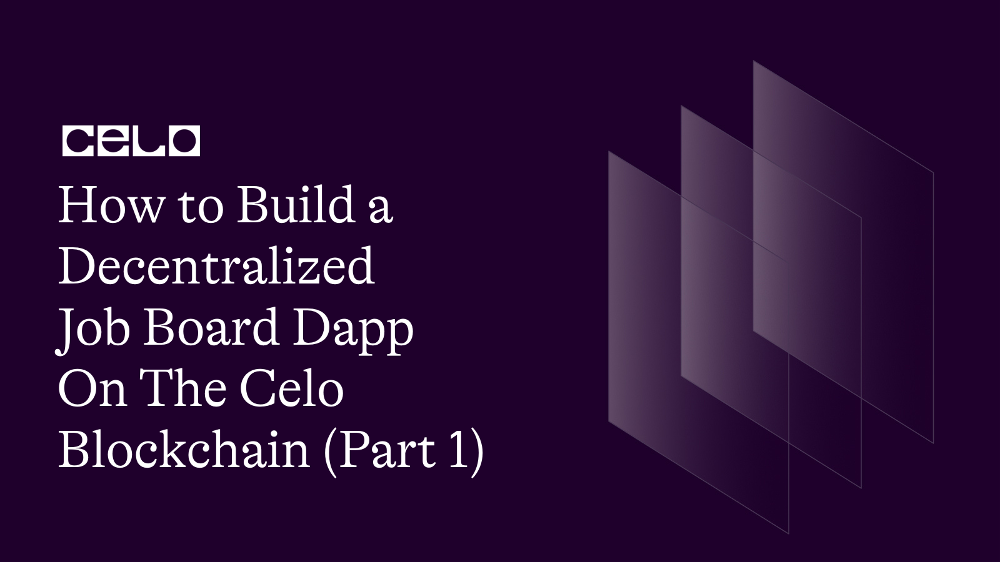

## Introduction

The Job Board Smart Contract is a Solidity contract that enables employers to post job openings and job seekers to browse through job openings. The contract maintains a list of job postings along with their details such as job name, job description, and salary. Employers can post jobs, and job seekers can view the list of job openings. The contract also provides the functionality to remove job posts, but only the employer who posted the job can remove the job post.

## Prerequisites

To follow this tutorial, you will need the following:

- Basic knowledge of Solidity programming language.
- A Development Environment Like Remix.
- The celo Extension Wallet.

## SmartContract

Let's begin writing our smart contract in Remix IDE

The completed code Should look like this.

```solidity
// SPDX-License-Identifier: MIT
pragma solidity ^0.8.0;

// Job Board Smart Contract
contract JobBoard {

    struct JobPosting {
        uint jobId;
        address employer;
        string jobName;
        string jobDescription;
        uint256 salary;
    }
    uint private jobCount = 0;

    mapping(uint => JobPosting) jobs;


    event JobPosted(
        uint jobId,
        address employer,
        string jobName,
        string jobDescription,
        uint salary
    );


    // Function to post a job
    function postJob(
        string memory _jobName,
        string memory _jobDescription,
        uint256 _salary
    ) public {
        // Create a new job
        JobPosting memory job = JobPosting(
              jobCount,
            msg.sender,
            _jobName,
            _jobDescription,
            _salary
        );
        // Store the new job in the mapping
        jobs[jobCount] = job;

        jobCount++;

        // Emit the JobPosted event
        emit JobPosted(
            job.jobId,
            job.employer,
            job.jobName,
            job.jobDescription,
            job.salary
        );
    }

 function getJobposts(uint256 _jobId)
        public
        view
        returns (
            uint,
            address,
            string memory,
            string memory,
            uint
        )
    {
         JobPosting storage job = jobs[_jobId];
        return (
            job.jobId,
            job.employer,
            job.jobName,
            job.jobDescription,
            job.salary
        );
    }

     function removeJobPost(uint _jobId) external {
	        require(msg.sender == jobs[_jobId].employer, "not permmited");
            jobs[_jobId] = jobs[jobCount - 1];
            delete jobs[jobCount - 1];
            jobCount--;
	 }


}
```

### breakdown

First, we declared our license and the solidity version.

```solidity
// SPDX-License-Identifier: MIT
pragma solidity ^0.8.0;
```

And then we defined our smart contract `JobBoard`.

```solidity
contract JobBoard {
    // Contract code goes here
}
```

We will now define some variables, structs and mappings that will be used by our contract.

```solidity
 struct JobPosting {
        uint jobId;
        address employer;
        string jobName;
        string jobDescription;
        uint256 salary;
    }

     uint private jobCount = 0;

    mapping(uint => JobPosting) jobs;


```

First we define a struct called `JobPosting` that represents a job posting with the following fields:

- `jobId`: A unique ID for the job posting.
- `employer`: The address of the employer who posted the job.
- `jobName`: The name of the job.
- `jobDescription`: A brief description of the job.
- `salary`: The salary for the job.

The `jobCount` variable keeps track of the number of job postings made, and the `jobs` mapping maps each job ID to its corresponding `JobPosting` struct.

We will now define one events that will be emitted by our contract.

```solidity
  event JobPosted(
        uint jobId,
        address employer,
        string jobName,
        string jobDescription,
        uint salary
    );
```

This is an event called `JobPosted` which is emitted whenever a job posting is added to the job board. It includes the details of the job posting like `job ID`, `employer address`, `job name`, `job description`, and `salary`.

let's work on the functions.

```solidity
        function postJob(
        string memory _jobName,
        string memory _jobDescription,
        uint256 _salary
    ) public {
        JobPosting memory job = JobPosting(
            jobCount,
            msg.sender,
            _jobName,
            _jobDescription,
            _salary
        );
        jobs[jobCount] = job;
        jobCount++;
        emit JobPosted(
            job.jobId,
            job.employer,
            job.jobName,
            job.jobDescription,
            job.salary
        );
    }

```

This is the `postJob` function which allows employers to post job openings to the job board. It takes in the job name, job description, and salary as parameters.

Inside the function, a new `JobPosting` struct is created with the `jobCount` as its `jobId`, the `msg.sender` as the employer and the provided `jobName`, `jobDescription`, and `salary`. The new `JobPosting` is stored in the jobs mapping using the `jobCoun`t as the key. The `jobCount` is then incremented to keep track of the new job posting.

```solidity
    function getJobposts(uint256 _jobId)
        public
        view
        returns (
            uint,
            address,
            string memory,
            string memory,
            uint
        )
    {
         JobPosting storage job = jobs[_jobId];
        return (
            job.jobId,
            job.employer,
            job.jobName,
            job.jobDescription,
            job.salary
        );
    }

```

Next, is the `getJobposts` function which takes a job ID as a parameter and returns the details of the job posting associated with that ID.

Inside the function, the `JobPosting` struct associated with the provided `jobId` is retrieved from the jobs mapping and stored in a local variable `job`. The details of the job posting are then returned as a tuple.

```solidity
    function removeJobPost(uint _jobId) external {
        require(msg.sender == jobs[_jobId].employer, "not permmited");
        jobs[_jobId] = jobs[jobCount - 1];
        delete jobs[jobCount - 1];
        jobCount--;
    }

```

Finally, the `removeJobPost` function which allows employers to remove a job posting from the job board. It takes a job ID as a parameter.

Inside the function, a require statement is used to ensure that the sender of the transaction is the employer who posted the job. If the condition is not met, the function will revert with the provided error message.

## Deployment

To deploy our smart contract successfully, we need the celo extention wallet which can be downloaded from [here](https://chrome.google.com/webstore/detail/celoextensionwallet/kkilomkmpmkbdnfelcpgckmpcaemjcdh?hl=en)

Next, we need to fund our newly created wallet which can done using the celo alfojares faucet [Here](https://celo.org/developers/faucet)

You can now fund your wallet and deploy your contract using the celo plugin in remix.

## Next Steps

I hope you learned a lot from this tutorial. Here are some relevant links that would aid your learning further.

- [Celo Docs](https://docs.celo.org/)
- [Solidity Docs](https://docs.soliditylang.org/en/v0.8.17/)

## About the author

I'm Jonathan Iheme, A full stack block-chain Developer from Nigeria.

Thank You!!
