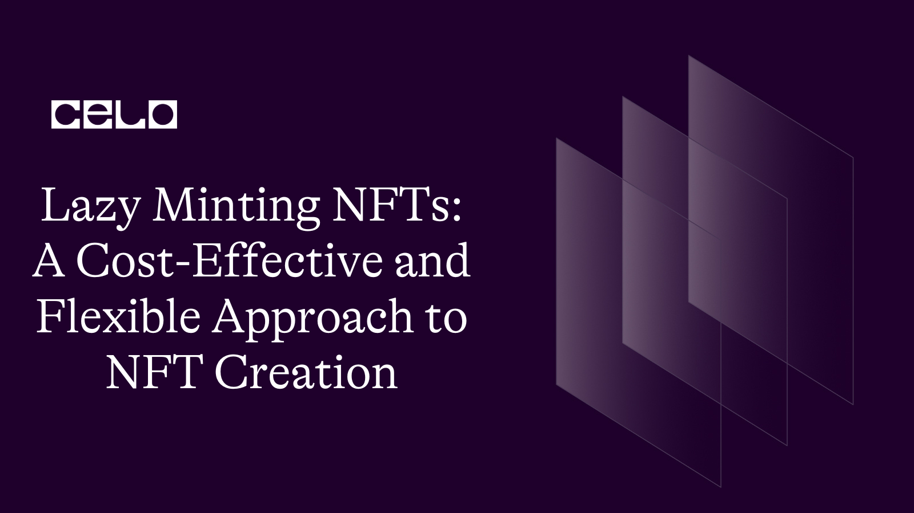

## 🌱 Introduction

In recent years, Non-Fungible Tokens (NFTs) have gained immense popularity in the world of art, music, and gaming. NFTs are unique digital assets that use blockchain technology to provide proof of ownership and authenticity. However, creating NFTs can be a complex and expensive process that requires technical knowledge and investment. This is where lazy minting NFTs come in, providing a cost-effective and flexible approach to NFT creation.

Let's get started!

### What are Lazy Minting NFTs?

Lazy minting NFTs are a new type of NFT that allows creators to mint NFTs on-demand without the upfront costs and technical knowledge required in traditional NFT creation. Traditional NFT creation requires the creator to mint a certain number of NFTs upfront, which can be expensive and requires technical knowledge of blockchain technology. Lazy minting NFTs, on the other hand, allow creators to mint NFTs only when they are sold, reducing the upfront costs and technical requirements.

Lazy minting NFTs are created using smart contracts on a blockchain network. These smart contracts are programmed to only mint an NFT when it is sold, allowing creators to create and sell NFTs without the upfront costs and technical requirements of traditional NFT creation.

### Benefits of Lazy Minting NFTs

- Cost-effective: Lazy minting NFTs eliminate the need for upfront costs, making NFT creation more accessible to creators of all levels.

- Flexible: Creators can mint NFTs on-demand, allowing them to create and sell NFTs without having to commit to a certain number of NFTs upfront.

- Scalable: Lazy minting NFTs can be sold on a global scale, providing a scalable and efficient way to sell NFTs to a wider audience.

## 🗈 Prerequisites

- A computer with an internet connection. You will need a computer with a stable internet connection to follow along with this guide.

- Basic knowledge of programming. While we will provide step-by-step instructions, it will be helpful to have some basic knowledge of programming languages such as JavaScript and Solidity.

- Node.js and npm installed. You will need to have Node.js and npm (the package manager for Node.js) installed on your computer. You can check if you have them installed by running the following commands in your terminal:

```bash
node -v
npm -v
```

- A code editor. You will need a code editor to write and edit your code. Some popular options include Visual Studio Code and Atom.
- A Metamask account. You will need a Metamask account to interact with the Celo blockchain from your web browser. If you don't already have one, you can create one by installing the Metamask extension for Chrome or Firefox.

## ⚠️ Requirements

- Truffle: a development environment, testing framework, and asset pipeline for Ethereum
- Node.js: a JavaScript runtime that allows you to run JavaScript on the command line
- Yarn: a package manager for JavaScript
- next: Next.js is a framework for building server-rendered or statically-exported React applications.
- CeloCli - The celocli lets you interact with the Celo Protocol smart contracts.

**_ Let's start building the future together! _**

:::tip
To learn more about setting up the environment to create Lazy Mint NFTs , check out the **[step-by-step guide to deploying your first full-stack dApp on Celo](https://docs.celo.org/blog/tutorials/step-by-step-guide-to-deploying-your-first-full-stack-dapp-on-celo#steps-to-set-up-the-truffle-project-and-its-configs)**, which provides detailed instructions on getting started.
:::

## How to Create Lazy Minting NFTs

Creating lazy minting NFTs requires some technical knowledge of smart contracts and blockchain technology. Here are the steps to create lazy minting NFTs:

- Step 1: Create a Smart Contract
  The first step in creating lazy minting NFTs is to create a smart contract on a blockchain network. The smart contract should be programmed to only mint an NFT when it is sold.

```solidity
// SPDX-License-Identifier: MIT
pragma solidity ^0.8.4;

import "@openzeppelin/contracts@4.7.3/token/ERC721/ERC721.sol";
import "@openzeppelin/contracts@4.7.3/token/ERC721/extensions/ERC721URIStorage.sol";
import "@openzeppelin/contracts@4.7.3/access/Ownable.sol";
import "@openzeppelin/contracts@4.7.3/utils/cryptography/draft-EIP712.sol";

contract LazyNFT is ERC721, ERC721URIStorage, Ownable, EIP712 {
    string private constant SIGNING_DOMAIN = "Voucher-Domain";
    string private constant SIGNATURE_VERSION = "1";
    address public minter;

    constructor(address _minter) ERC721("LazyNFT", "LNFT") EIP712(SIGNING_DOMAIN, SIGNATURE_VERSION) {
        minter = _minter;
    }

    struct LazyNFTVoucher {
        uint256 tokenId;
        uint256 price;
        string uri;
        address buyer;
        bytes signature;
    }

    function recover(LazyNFTVoucher calldata voucher) public view returns (address) {
        bytes32 digest = _hashTypedDataV4(keccak256(abi.encode(
            keccak256("LazyNFTVoucher(uint256 tokenId,uint256 price,string uri,address buyer)"),
            voucher.tokenId,
            voucher.price,
            keccak256(bytes(voucher.uri)),
            voucher.buyer
        )));
        address signer = ECDSA.recover(digest, voucher.signature);
        return signer;
    }

    function safeMint(LazyNFTVoucher calldata voucher)
        public
        payable
    {
        require(minter == recover(voucher), "Wrong signature.");
        require(msg.value >= voucher.price, "Not enough ether sent.");
        _safeMint(voucher.buyer, voucher.tokenId);
        _setTokenURI(voucher.tokenId, voucher.uri);
    }

    // The following functions are overrides required by Solidity.

    function _burn(uint256 tokenId) internal override(ERC721, ERC721URIStorage) {
        super._burn(tokenId);
    }

    function tokenURI(uint256 tokenId)
        public
        view
        override(ERC721, ERC721URIStorage)
        returns (string memory)
    {
        return super.tokenURI(tokenId);
    }
}
```

**The LazyNFT contract inherits from four other contracts: ERC721, ERC721URIStorage, Ownable, and EIP712.**

- ERC721 and ERC721URIStorage are OpenZeppelin contracts that define the standard for non-fungible tokens on the Ethereum blockchain. The ERC721URIStorage extension allows for storing metadata about each token on the blockchain.

- Ownable is an OpenZeppelin contract that provides basic authorization control functions. It allows the owner of the contract to restrict access to certain functions.

- EIP712 is an OpenZeppelin contract that provides an implementation of the Ethereum Improvement Proposal (EIP) 712, which is a standard for typed data hashing and signing.

- The LazyNFT contract has a constructor function that takes an address \_minter as a parameter and initializes the minter variable with that value. The minter variable represents the address that is authorized to mint new NFTs.

- The contract defines a struct called LazyNFTVoucher that contains five variables: tokenId, price, uri, buyer, and signature. This struct represents a voucher that can be redeemed for a LazyNFT token.

- The contract also defines a recover function that takes a LazyNFTVoucher as input and returns the address of the person who signed the voucher. This function is used to verify that the voucher was signed by the authorized minter.

- The safeMint function takes a LazyNFTVoucher as input, and it checks that the voucher was signed by the authorized minter and that the buyer sent enough ether to cover the price of the NFT. If both conditions are met, the function mints a new NFT and assigns it to the buyer's address.

Finally, the contract overrides two functions from the ERC721 and ERC721URIStorage contracts: \_burn and tokenURI. These functions are required by the Solidity compiler.

- Step 2: Deploy the Smart Contract
  Once the smart contract is created, it needs to be deployed on a blockchain network. There are several blockchain networks that support NFT creation, including Ethereum, Binance Smart Chain, and Solana.

Deploying a smart contract requires the use of a blockchain wallet and a smart contract deployment tool. Some popular tools include Remix, Truffle, and Hardhat. These tools allow you to deploy your smart contract to the blockchain network of your choice.

:::tip
To learn more about setting up the environment to create Lazy Mint NFTs , check out the **[step-by-step guide to deploying your first full-stack dApp on Celo](https://docs.celo.org/blog/tutorials/step-by-step-guide-to-deploying-your-first-full-stack-dapp-on-celo#steps-to-set-up-the-truffle-project-and-its-configs)**, which provides detailed instructions on getting started.
:::

- Step 3: Create and Sell Lazy Minting NFTs
  Once the smart contract is deployed, you can create and sell lazy minting NFTs. To create an NFT, simply call the mintNFT function on the smart contract with `[voucher.tokenId,voucher.price,voucher.uri,voucher.buyer,voucher.signature]`.

```js
LazyNFT nft = LazyNFT(addressOfDeployedContract);
nft.safeMint(
        [voucher.tokenId,voucher.price,voucher.uri,voucher.buyer,voucher.signature], { from: walletAddress }
      );
```

When the NFT is sold, the smart contract will mint the NFT and transfer it to the buyer.

- Here is the source code for [frontend](https://github.com/developerkunal/Lazy-minting-frontend)

- Here is the [Website](https://lazy-minting-frontend-p261iw0cx-developerkunal.vercel.app/)

## Conclusion

Lazy minting NFTs provide a cost-effective and flexible approach to NFT creation, making it more accessible to creators of all levels. By only minting NFTs when they are sold, lazy minting NFTs eliminate the need for upfront costs and technical knowledge required in traditional NFT creation. With the ability to create and sell NFTs on-demand, lazy minting NFTs provide a scalable and efficient way to sell NFTs to a wider audience.

If you are interested in learning more about lazy minting NFTs, there are several resources available online, including tutorials and documentation on smart contract development and NFT creation.

## About Author

Hi! My name is Kunal Dawar and I am a Full Stack web2/web3 Developer. I have participated in numerous hackathons and have been fortunate enough to win many of them.

One thing that I am truly passionate about is creating things that are reliable and don't break easily. I believe that creating high-quality products is important not only for the users but also for the overall growth and success of a business.

In my free time, I enjoy learning about new technologies and staying up-to-date with the latest trends in the field. I also love to share my knowledge with others and mentor those who are interested in pursuing a career in web development.
