import YouTube from '@components/YouTube';

# Celo Composer: Extend and Customize your Full-Stack Mobile dApps

_Step-by-step guide to create a new custom dApp using the Celo Composer._

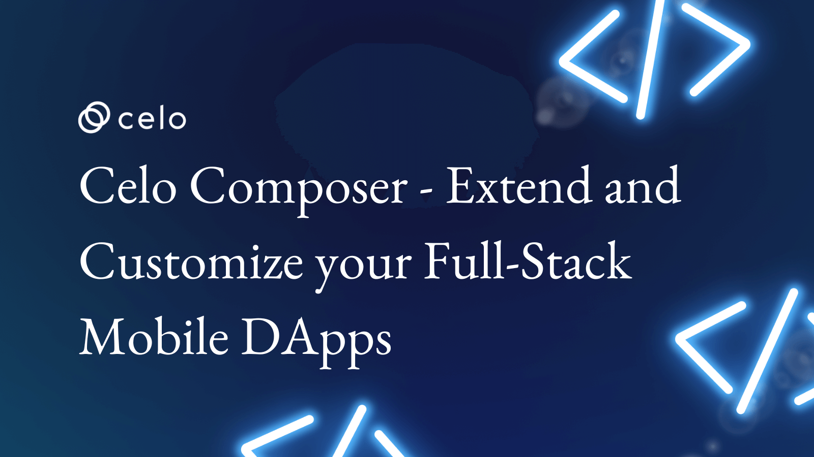

## Hello Developers 🌱

Welcome to today’s post, where we’ll break down a blockchain topic into byte-sized pieces to help you learn and apply your new skills in the real world.

Today’s topic is building a new dApp using the Celo Composer.

**Here’s a list of what we’ll cover 🗒**

- ✅ **Step 1:** Create your smart contract
- ✅ **Step 2:** Write your deploy script
- ✅ **Step 3:** Deploy your smart contract
- ✅ **Step 4:** Add a new tab
- ✅ **Step 5:** Build your component
- ✅ **Step 6:** Interact with your dApp
- ✅ **Step 7:** Host your dApp

By the end of this post, you’ll be able to create, deploy, interact with, and host your new Dapp using Celo Composer.

Let’s go! 🚀

:::tip

This post is a continuation of [Celo Composer: Easily Build Full-Stack Mobile dApps on Celo](https://joenyzio.medium.com/build-celo-dapps-in-15-minutes-or-less-438ea954d0b1). Please read this post before getting started.

:::

### What you’ll build

In this post you’ll build a brand new Messenger dApp. It will work like the default `Greeter dApp` and allows you to read and write text to the Celo blockchain.


To do this, you’ll create a new smart contract, update the deploy script and build the front-end of your dApp. Once you’re done, you’ll have a new tab added to the Celo Composer that allows you to read and write messages to the Celo blockchain.

:::tip

If at any point you need some help, you can view all of the code both before and after the changes shown in this [GitHub repo](https://github.com/joenyzio/celo-custom-dappstarter-tutorial).

:::

### Things to know

To get the most out of this post, here are a few things that it helps to know.

- [Celo](https://joenyzio.medium.com/celo-spotlight-build-a-financial-system-that-creates-the-conditions-for-prosperity-for-everyone-7b1830efc254?source=your_stories_page----------------------------------------)
- [React](https://reactjs.org/)
- [Solidity](https://docs.soliditylang.org/en/v0.8.10/#)
- [Hardhat](https://joenyzio.medium.com/hardhat-and-celo-the-ultimate-guide-to-deploy-celo-dapps-using-hardhat-747f42ad0788)
- [Material UI](https://mui.com/)
- [use-contractkit](https://github.com/celo-org/use-contractkit)

But don’t worry if you don’t! We’ll walk you through everything step-by-step so that you can get started right away.

### Set up your environment

If you haven’t yet, complete [this post](https://medium.com/@joenyzio/build-celo-dapps-in-15-minutes-or-less-438ea954d0b1), and when you’re done you should be able to view the Celo Composer from your local environment.

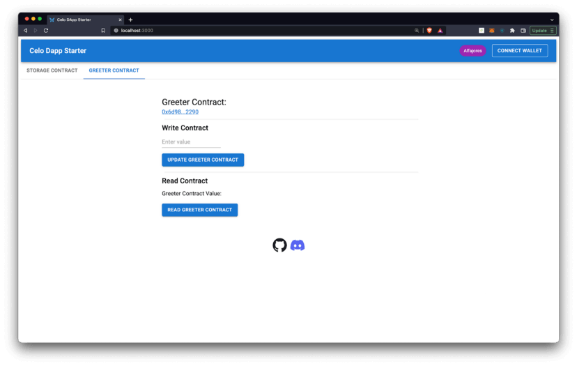

From here you are able to interact with the default contracts and view project code from your editor.

### Navigate to the project folder

```
cd your-project-name

```

### Open your project

```
code . //example in VS Code
```

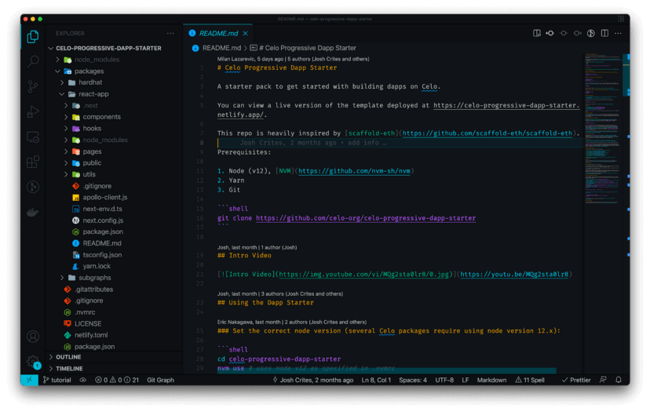

## ✅ Step 1: Create your smart contract

You’ll start your dApp by creating a new smart contract. Navigate to `packages/hardhat/contracts/` and create a file named `Messenger.sol`.

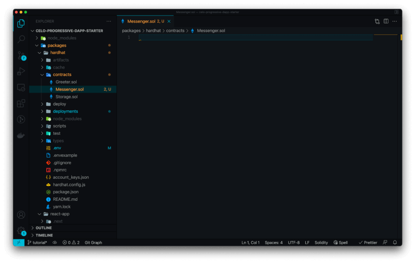

Copy the code from `Greeter.sol` and paste it into your new file.

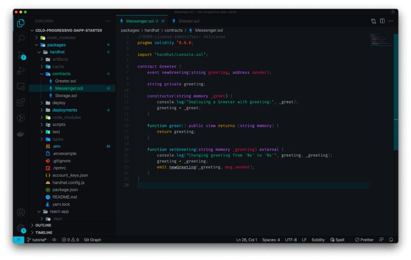

Update the `contract name`, `events`, `variables`, `function`, and `references` to `messenger` and `message` as needed. When you are done your contract should look like [this](https://github.com/joenyzio/celo-custom-dappstarter-tutorial/blob/main/contracts/Messenger.sol).

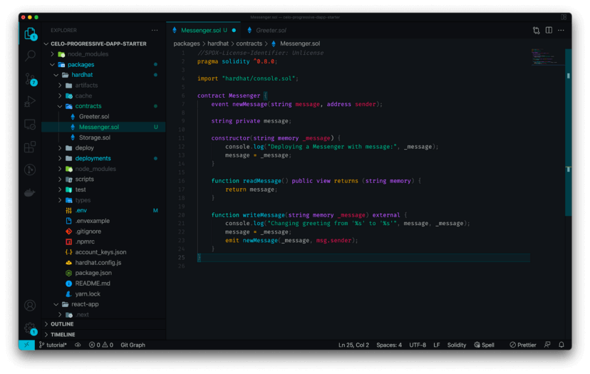

## ✅ Step 2: Write your deploy script

Now that your smart contract is complete, you’ll update the deploy script. This will make it so that you can deploy this smart contract to the Celo blockchain.

Open the `filepackages/hardhat/deploy/00-deploy.js`.

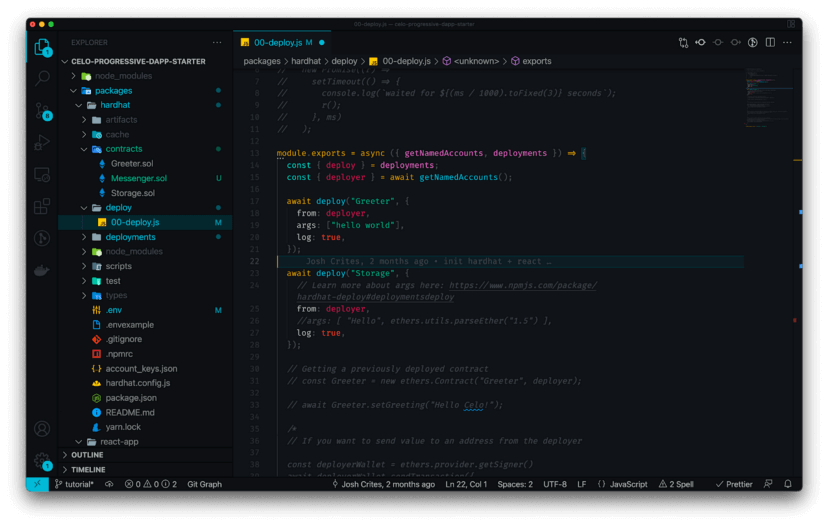

Copy and paste the deploy script used for the Greeter contract to set up a new deployment.

### Greeter contract deployment code

```
await deploy("Greeter", {
    from: deployer,
    args: ["hello world"],
    log: true,
});
```

### Messenger contract deployment code

Update the contract name to Messenger and provide a message as the args value.

```
await deploy(“Messenger”, {
    from: deployer,
    args: [“GM Blockstar!”],
    log: true,
});
```

:::tip

Note on args: You will pass args into your deploy script whenever the constructor function from your smart contract accepts in a parameter. In your `Messenger.sol` contract.

:::

Scroll to the bottom of `00-deploy.js` and add your deployment to the module export tags.

```
module.exports.tags = [“Greeter”, “Storage”, “Messenger”];
```

Your `00-deploy.js` file should now look like this.

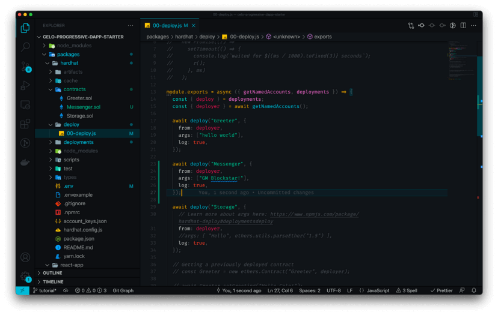

## ✅ Step 3: Deploy your smart contract

Now that your smart contract is ready and your deploy script is updated, you can deploy your smart contract and view it using the [Celo block explorer](https://alfajores-blockscout.celo-testnet.org/).

### Deploy your contract

Open your terminal and run `yarn deploy` from within the `packages/hardhat` folder.

```
yarn deploy
```

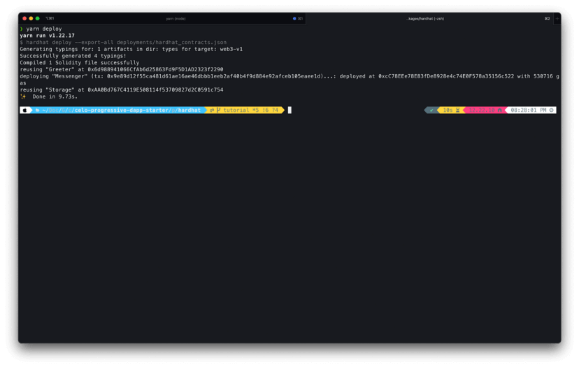

### View smart contract

Open [Celo Block Explorer (Alfajores Testnet)](https://alfajores-blockscout.celo-testnet.org/) and paste the tx or deployed at address if you would like to view the transaction or smart contract.

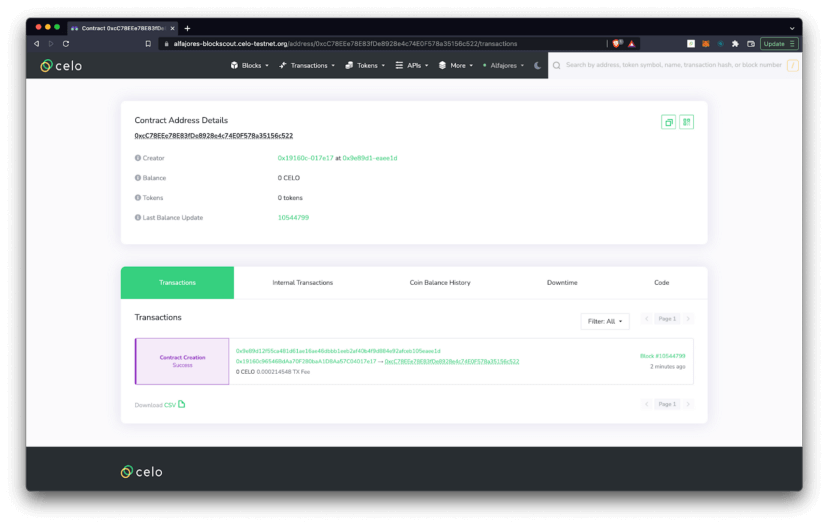

### Check your wallet

If you check your MetaMask wallet, you’ll notice that you now have less Celo. This is due to the gas cost of deploying your smart contracts to the blockchain.

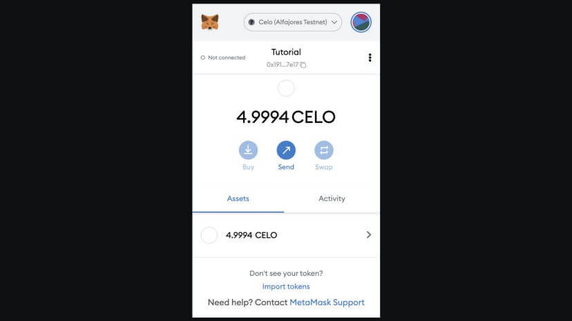

### View your account address

You may also view your contract deployments from the [Celo Block Explorer](https://alfajores-blockscout.celo-testnet.org/) by searching for your wallet address. There should be 1–3 contract deployments including your `Messenger` contract. This is because while you only created one contract, you also deployed the existing `Greeter` and `Storage` contracts as shown in your terminal.

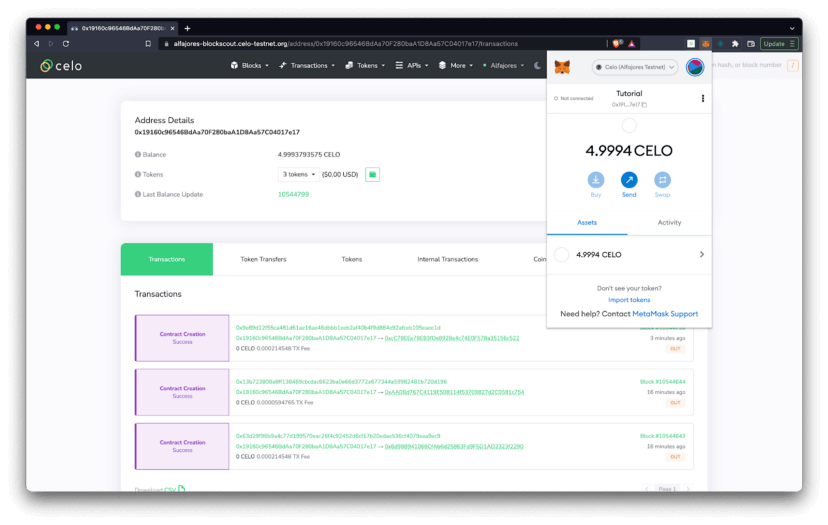

### View the Smart Contract ABI

Finally, you may view the ABI for your contract in `deployments/alfajores/Messenger`.json. The ABI is the interface that allows you to access your smart contract functions from the front-end of your dApp.

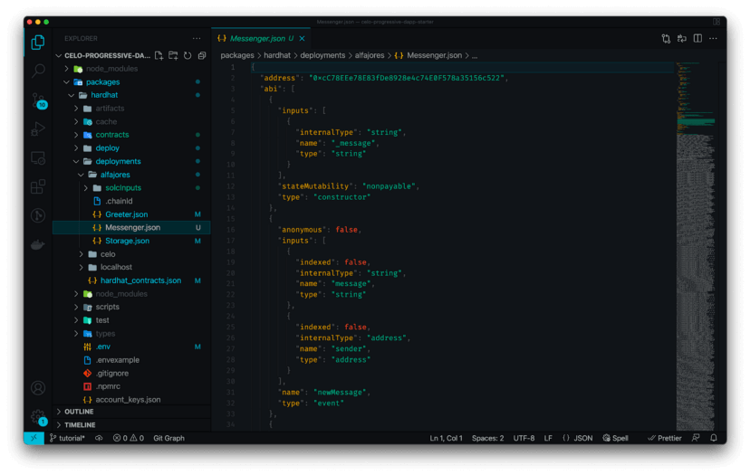

### Verify your smart contract (Optional)

Check out [Introduction to Hardhat on Celo | Step 8: Verify your Smart Contract](https://medium.com/@joenyzio/hardhat-and-celo-the-ultimate-guide-to-deploy-celo-dapps-using-hardhat-747f42ad0788) if you would like to verify your smart contract on the Celo Block Explorer. This will allow anyone to view your contract and interact with its functions from within the Celo Block Explorer.


### Deploy on other networks (Optional)

By default, the Celo Composer deploys your smart contract to the Celo Alfajores Testnet. This is because it is set as the default network in the configuration file.

If you would like to deploy on another network, navigate to the `hardhat.config.js` and replace the `const defaultNetwork` with `celo`, which deploys to mainnet, or `localhost`, which will deploy to a local blockchain.

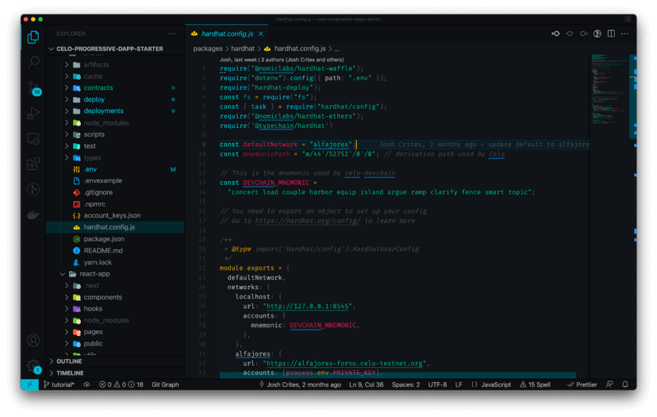

:::tip

For any of these deployment options to work you’ll need to have your local network setup with accounts available on whichever blockchain you deploy to. Remember to replace your private key in the .env file with a private key with funds for the blockchain you choose.

:::

## ✅ Step 4: Add a new tab

To interact with your contract from the Celo Composer, you’ll create a new page from a component that is accessible from a new tab.

### Create basic component

Navigate to `react-app/components/` create a file named `MessengerContract.tsx`, and add the following code.

```
import * as React from "react";
export function MessengerContract({}) {
    return <div>GM Blockstars!</div>;
}
```

For now, this component doesn’t do much, but later in the post you’ll turn this into the front-end interface of your dApp!

### Export your component

Exporting your component will make it accessible from other files in your project. Navigate to `index.ts` and add your component to the list of exports like this.

```
export * from ‘./MessengerContract’
```

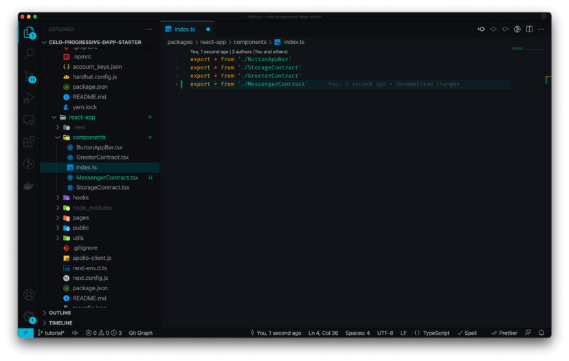

### Add component navigation

Open `pages/index.tsx` to view the code that creates the main display of your application.

### Import MessengerContract

Add `MessengerContract` to your list of exports as shown below.

```
import {
    StorageContract,
    GreeterContract,
    MessengerContract,
    ButtonAppBar,
    } from “@/components”;
```

### Add a new tab

Under `return > div > Box > Box > Tabs` add a new `Tab`. Update the label to the name you would like displayed on the front end and update `…allyProps` to `2`.

```
<Tab label=”Messenger Contract” {…a11yProps(2)} />
```

### Add tab panel

Add a new `TabPanel` and update the index, contract name, and contract data to match your contract.

```
<TabPanel value={value} index={2}>
   <MessengerContract contractData={contracts?.Messenger} />
</TabPanel>
```

Your index.tsx file should now look like this.


You should now see your new tab in `localhost:3000`.

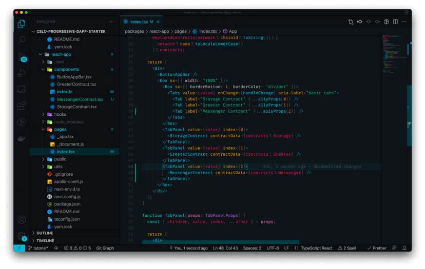

## ✅ Step 5: Build your component

Now that your contract is live and you can view your component, it’s time to finish the front-end. In this step, we’ll update the `MessengerContract` component so that your front-end looks like the image below.

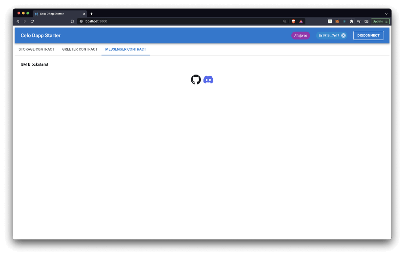

## Update Messenger component code

Navigate to `react-app/components/MessengerContract.tsx` and replace the code you added previously with the code in `GreeterContract.tsx`.


Since our contract has the same basic functions as the Greeter Contract, this will help you get up and running quickly while you’re getting more familiar with the code.

:::tip

We won’t go through each detail on the different tools used in this post but by referring to the Material UI, react.js, and use-contractkit docs you can get a better understanding of how this all works. When you’re ready, feel free to replace this code with any framework you’d like,— and if you do — please share your work!

:::

### Update contract import

Update the contract import to the Messenger contract.

**Update:**

```
import { Greeter } from “../../hardhat/types/Greeter”;
```

**To:**

```
import { Messenger } from “../../hardhat/types/Messenger”;
```

### Update component name

Replace the `GreeterContract` component name with `MessengerContract`.

**Update:**

```
export function GreeterContract({ contractData }) {
```

**To:**

```
export function MessengerContract({ contractData }) {
```

### Update hooks

Hooks are used to manage the state of your dApp. Update the names of your component states to set message input and values. You’ll use these throughout the functions you create in your dApp!

**Update:**

```
const [greeterValue, setGreeterValue] = useState<string | null>(null);
const [greeterInput, setGreeterInput] = useInput({ type: “text” });
```

**To:**

```
const [messageValue, setMessageValue] = useState<string | null>(null);
const [messageInput, setMessageInput] = useInput({ type: “text” });
```

Update Contract
The const contract uses web3 to call the ABI of your contract. By updating this to your messenger contract, you’ll be able to interact with its functions.

**Update:**

```
const contract = contractData
    ? (new kit.web3.eth.Contract(
    contractData.abi,
    contractData.address
    ) as any as Greeter)
    : null;
```

**To:**

```
const contract = contractData
    ? (new kit.web3.eth.Contract(
    contractData.abi,
    contractData.address
    ) as any as Messenger)
    : null;
```

### Update functions

Next, you can update the function names and smart contract function calls. In this case, we’ll update your function names to `writeMessage` and `readMessage`, and reference the `setMessage` and `readMessage` functions from your smart contract.

#### setMessage

Update setGreeter to setMessage and call setMessage rather than setGreeting. Updates are in bold.

**Update:**

```
const setGreeter = async () => {
    try {
        await performActions(async (kit) => {
           const gasLimit = await contract.methods
           .setGreeting(greeterInput as string)
           .estimateGas();
           const result = await contract.methods
           .setGreeting(greeterInput as string)
           //@ts-ignore
          .send({ from: address, gasLimit });
```

**To:**

```
const setMessage = async () => {
    try {
        await performActions(async (kit) => {
           const gasLimit = await contract.methods
           .setMessage(messageInput as string)
           .estimateGas();
           const result = await contract.methods
           .setMessage(messageInput as string)
           //@ts-ignore
          .send({ from: address, gasLimit });
```

#### getMessage

Update getGreeter to getMessage and call readMessage rather than greet . Also note that we update setGreeterValue to setMessageValue which is one of the state values you defined in the hooks above.

**Update:**

```
const getGreeter = async () => {
    try {
        const result = await contract.methods.greet().call();
        setGreeterValue(result);
    } catch (e) {
      console.log(e);
    }
};
```

**To:**

```
const getMessage = async () => {
    try {
        const result = await contract.methods.readMessage().call();
        setMessageValue(result);
      } catch (e) {
        console.log(e);
      }
};
```

### Update Set Message button

The `setGreeterInput` captures the input provided by the user. When the user clicks the button, it calls the setMessage function and passes in the provided input. Here you’ll update this to use the state and function names you created above.

:::tip

Button styling details are omitted for simplicity.

:::

**Update**

```
<Box sx={{ m: 1, marginLeft: 0 }}>{setGreeterInput}</Box>
<Button
    sx={{ m: 1, marginLeft: 0 }}
    variant="contained" onClick={setGreeter}
>
    Update Greeter Contract
</Button>
```

**to**

```
<Box sx={{ m: 1, marginLeft: 0 }}>{setMessageInput}</Box>
<Button
    sx={{ m: 1, marginLeft: 0 }}
    variant="contained" onClick={setMessage}
>
    Update Messenger Contract
</Button>
```

### Update Get Message Button

The `getGreeter` button calls the state of the Greeting in the smart contract and displays it as the state set in greeterValue. Here you’ll update this to use the state and function names you created above.

:::tip

Button styling details are omitted for simplicity.

:::

**Update**

```
<Typography sx={{ m: 1, marginLeft: 0, wordWrap: "break-word" }}>
    Greeter Contract Value: {greeterValue}
</Typography>
<Button
    sx={{ m: 1, marginLeft: 0 }}
    variant="contained"
    onClick={getGreeter}
>
    Read Greeter Contract
</Button>
```

**to**

```
<Typography sx={{ m: 1, marginLeft: 0, wordWrap: "break-word" }}>
    Messenger Contract Value: {messageValue}
</Typography>
<Button
    sx={{ m: 1, marginLeft: 0 }}
    variant="contained"
    onClick={getMessage}
>
    Read Messenger Contract
</Button>
```

### Update text

At this point, everything in your contract is working! The last bit of code you’ll want to update is some of the remaining text displayed to the user. For example, instead of `Greeter Contract` you may instead want to instead display `Messenger Contract`.

Finalize your component by replacing the text displayed to your users. Your final component will look something like [this](https://github.com/joenyzio/celo-custom-dappstarter-tutorial/blob/main/components/MessengerContract.tsx).

## ✅ Step 6: Interact with your dApp

Congratulations! Your dApp is complete! Now you can test its functionality and see how it all works.

### Read messages

Click `Read Greeter Contract` to read the value you set as the args in your `deploy/00-deploy.js` file.

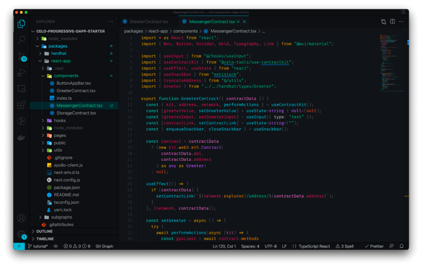

### Write messages

You can write new messages to change this text to anything you’d like. Type some text in the `Write Message` field, click When setting a message you’ll be asked to connect your MetaMask wallet.

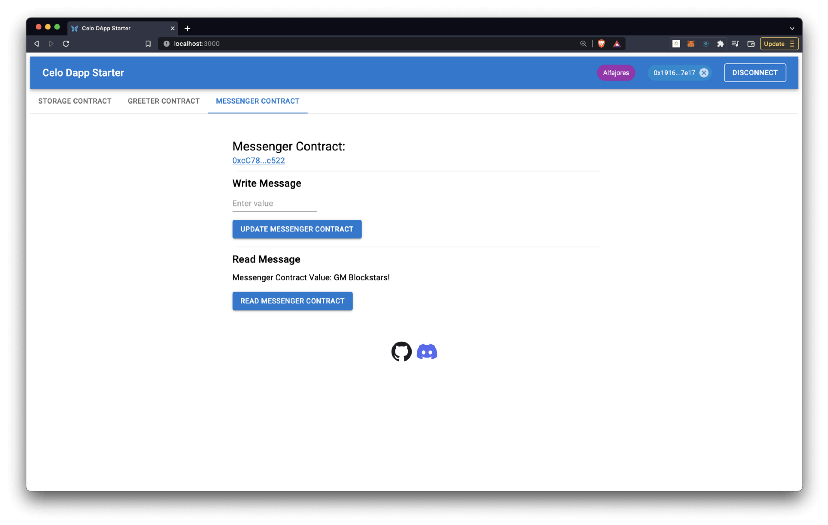

After connecting your MetaMask wallet, verify the transaction to write your new message to the Celo blockchain!

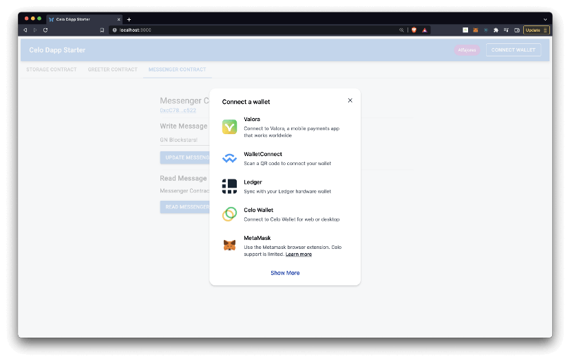

### View your transaction

Click the popup showing `Transaction` processed after you write your message.

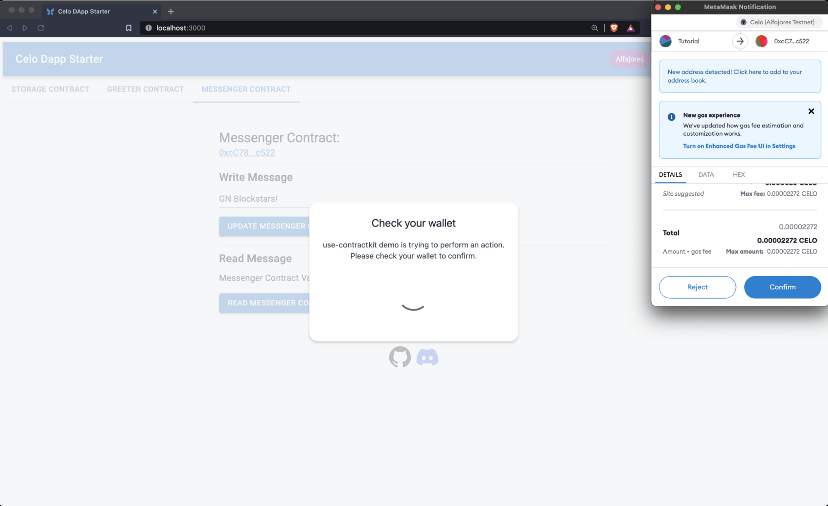

This will take you back to the [Celo Block Explorer](https://alfajores-blockscout.celo-testnet.org/) where you can view the details of your new transaction.

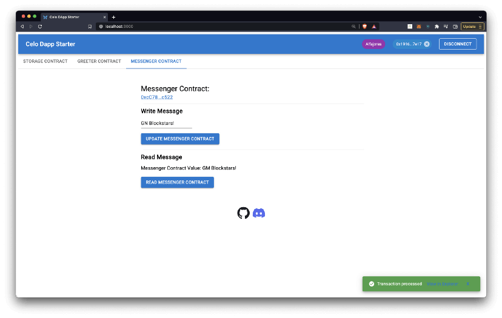

If you’d like, you can update the `Raw Input` field to `UTF-8` to view the message you wrote.


### View your message

Back on your dApp page, select the Read Messenger Contract button to view your new message!

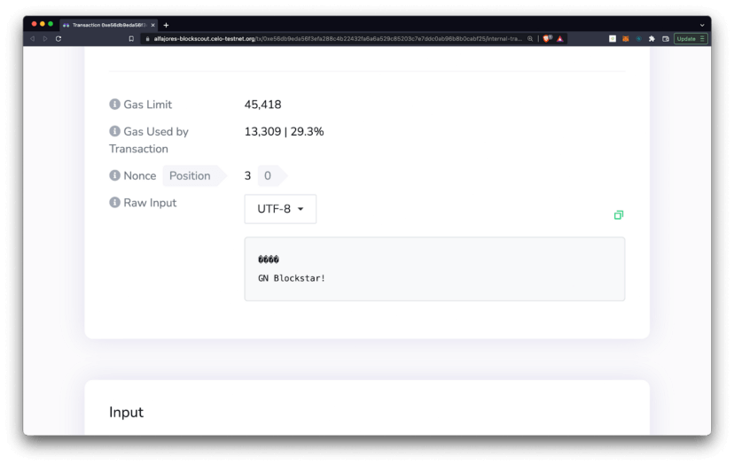

## ✅ Step 7: Host your dApp

Once your dApp is complete, you can share it with the world!

Before hosting your dApp using either of these methods, make sure to push the changes you have made to your GitHub repo.

### Add your local changes

```
git add .
```

### Commit your local changes

```
git commit -m 'my new dApp'
```

### Push your changes to GitHub

```
git push -u origin main
```

:::tip

You may also install the [GitHub Desktop app](https://desktop.github.com/) if you prefer making these updates through a user interface.

:::

### Hosting services

There are a many ways to host a dApp, and here you’ll find resources to get set up using either GitHub pages or Netlify.

### Netlify

[Netlify](https://www.netlify.com/) unites an entire ecosystem of modern tools and services into a single, simple workflow for building high performance sites and apps. Netlify is an excellent way to quickly host and share your Celo dApp for free.


[How to host websites using Netlify](https://www.netlify.com/blog/2016/09/29/a-step-by-step-guide-deploying-on-netlify/)

### GitHub Pages

[GitHub Pages](https://pages.github.com/) is a static site hosting service that takes HTML, CSS, and JavaScript files straight from a repository on GitHub, optionally runs the files through a build process, and publishes a website. GitHub pages is another way to quickly host and share your Celo dApp for free.

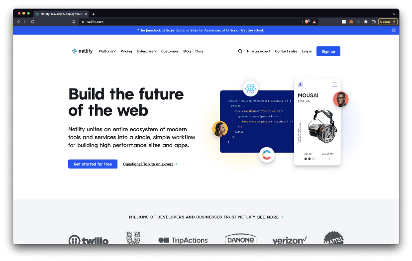

[How to host websites using GitHub Pages](https://www.codecademy.com/article/f1-u3-github-pages)

## Congratulations 🎉

That wraps up today’s topic on building a new dApp using the Celo Composer. You can review each of the items we covered below and check that you’re ready to apply these new skills.

**Here’s a quick review of what we covered 🤔**

- ✅ **Step 1:** Create your smart contract
- ✅ **Step 2:** Write your deploy script
- ✅ **Step 3:** Deploy your smart contract
- ✅ **Step 4:** Add a new tab
- ✅ **Step 5:** Build your component
- ✅ **Step 6:** Interact with your dApp
- ✅ **Step 7:** Host your dApp

If you made it this far, you’re now able to create, deploy, interact with, and host your new Dapp using Celo Composer.

GN! 👋
