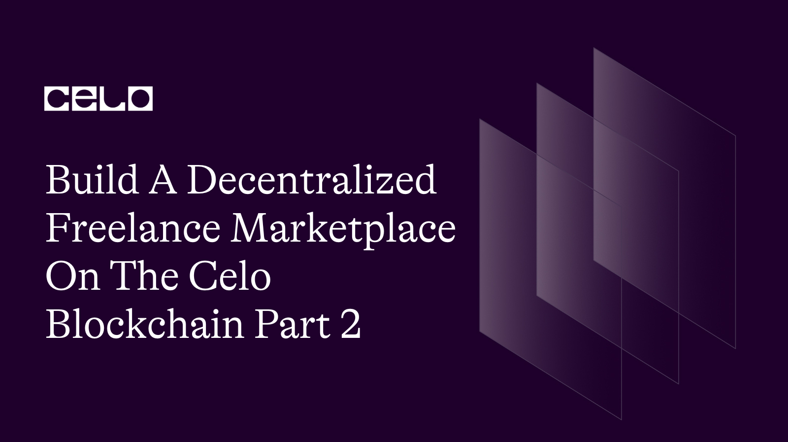

## Introduction

In the first part of the tutorial, We built and explored a simple Freelancer Marketplace Smart Contract built on the Celo network using Solidity. The contract allows freelancers to create profiles, change their price and description, and toggle their availability. Clients can hire freelancers and pay them in cUSD ERC20 tokens.

In this part we will follow up and create a front end for our marketplace.

Here’s a demo [link](https://polite-wisp-2b0ef5.netlify.app) of what you’ll be creating.

## Prerequisites

To follow this tutorial, you will need the following:

- Solidity, smart-contract and blockchain concepts.
- Basic web Development.

## Requirements

- React.
- Bootstrap.
- NodeJS 12.0.1 upwards installed.
- Celo Extension Wallet.

## Front-end

Click on [this](https://github.com/4undRaiser/celo-freelancer-marketplace) repo from your github.

- Clone the repo to your computer.
- open the project from from vscode.
- Run `npm install` command to install all the dependencies required to run the app locally.

### App.js

The completed code Should look like this.

```javascript
import "./App.css";
import Home from "./components/home";
import { Freelancers } from "./components/Freelancers";
import { useState, useEffect, useCallback } from "react";
import Web3 from "web3";
import { newKitFromWeb3 } from "@celo/contractkit";
import freelancer from "./contracts/freelancer.abi.json";
import IERC from "./contracts/IERC.abi.json";

import BigNumber from "bignumber.js";

const ERC20_DECIMALS = 18;
const contractAddress = "0xA371b0718b07026D87F2606295562e86Fa3Dd364";
const cUSDContractAddress = "0x874069Fa1Eb16D44d622F2e0Ca25eeA172369bC1";

function App() {
  const [contract, setcontract] = useState(null);
  const [address, setAddress] = useState(null);
  const [kit, setKit] = useState(null);
  const [cUSDBalance, setcUSDBalance] = useState(0);
  const [freelancers, setFreelancers] = useState([]);

  const connectToWallet = async () => {
    if (window.celo) {
      try {
        await window.celo.enable();
        const web3 = new Web3(window.celo);
        let kit = newKitFromWeb3(web3);

        const accounts = await kit.web3.eth.getAccounts();
        const user_address = accounts[0];
        kit.defaultAccount = user_address;

        await setAddress(user_address);
        await setKit(kit);
      } catch (error) {
        console.log(error);
      }
    } else {
      alert("Error Occurred");
    }
  };

  const getBalance = useCallback(async () => {
    try {
      const balance = await kit.getTotalBalance(address);
      const USDBalance = balance.cUSD.shiftedBy(-ERC20_DECIMALS).toFixed(2);

      const contract = new kit.web3.eth.Contract(freelancer, contractAddress);
      setcontract(contract);
      setcUSDBalance(USDBalance);
    } catch (error) {
      console.log(error);
    }
  }, [address, kit]);

  const getFreelancers = useCallback(async () => {
    const freelancerLength = await contract.methods
      .getFreelancersLength()
      .call();
    const freelancers = [];
    for (let index = 0; index < freelancerLength; index++) {
      let _freelancers = new Promise(async (resolve, reject) => {
        let freelancer = await contract.methods.getFreelancers(index).call();

        resolve({
          index: index,
          freelancerAddress: freelancer[0],
          image: freelancer[1],
          name: freelancer[2],
          title: freelancer[3],
          description: freelancer[4],
          price: freelancer[5],
          noOfJobs: freelancer[6],
          available: freelancer[7],
        });
      });
      freelancers.push(_freelancers);
    }

    const _freelancers = await Promise.all(freelancers);
    setFreelancers(_freelancers);
  }, [contract]);

  const addFreelancer = async (_image, _name, _title, _description, _price) => {
    try {
      await contract.methods
        .newFreelancer(_image, _name, _title, _description, _price)
        .send({ from: address });
      getFreelancers();
    } catch (error) {
      alert(error);
    }
  };

  const changeDescription = async (_index, _description) => {
    try {
      await contract.methods
        .changeDescription(_index, _description)
        .send({ from: address });
      getFreelancers();
    } catch (error) {
      alert(error);
    }
  };

  const changePrice = async (_index, _newprice) => {
    try {
      await contract.methods
        .changePrice(_index, _newprice)
        .send({ from: address });
      getFreelancers();
    } catch (error) {
      alert(error);
    }
  };

  const toggleAvailable = async (_index) => {
    try {
      await contract.methods.toggleAvailable(_index).send({ from: address });
      getFreelancers();
    } catch (error) {
      alert(error);
    }
  };

  const hireFreelancer = async (_index, _hours) => {
    try {
      const cUSDContract = new kit.web3.eth.Contract(IERC, cUSDContractAddress);
      const totalPayment = _hours * freelancers[_index].price;
      const cost = new BigNumber(totalPayment)
        .shiftedBy(ERC20_DECIMALS)
        .toString();
      console.log(totalPayment);
      await cUSDContract.methods
        .approve(contractAddress, cost)
        .send({ from: address });
      await contract.methods
        .hireFreelancerHourly(_index, _hours, cost)
        .send({ from: address });
      getFreelancers();
      getBalance();
      alert("you have successfully sent cusd to this user");
    } catch (error) {
      alert(error);
    }
  };

  useEffect(() => {
    connectToWallet();
  }, []);

  useEffect(() => {
    if (kit && address) {
      getBalance();
    }
  }, [kit, address, getBalance]);

  useEffect(() => {
    if (contract) {
      getFreelancers();
    }
  }, [contract, getFreelancers]);

  return (
    <div className="App">
      <Home cUSDBalance={cUSDBalance} addFreelancer={addFreelancer} />
      <Freelancers
        freelancers={freelancers}
        hireFreelancer={hireFreelancer}
        changeDescription={changeDescription}
        changePrice={changePrice}
        walletAddress={address}
        toggleAvailable={toggleAvailable}
      />
    </div>
  );
}

export default App;
```

### Breakdown

The first few lines of the code import the required dependencies and components.

```javascript
import "./App.css";
import Home from "./components/home";
import { Freelancers } from "./components/Freelancers";
import { useState, useEffect, useCallback } from "react";
import Web3 from "web3";
import { newKitFromWeb3 } from "@celo/contractkit";
import freelancer from "./contracts/freelancer.abi.json";
import IERC from "./contracts/IERC.abi.json";
import BigNumber from "bignumber.js";
```

**Declaring constants and initializing state:**

We declare some constants for our contracts' addresses and decimals. We also initialize our state using useState hooks.

```javascript
const ERC20_DECIMALS = 18;
const contractAddress = "0xA371b0718b07026D87F2606295562e86Fa3Dd364";
const cUSDContractAddress = "0x874069Fa1Eb16D44d622F2e0Ca25eeA172369bC1";

function App() {
  const [contract, setcontract] = useState(null);
  const [address, setAddress] = useState(null);
  const [kit, setKit] = useState(null);
  const [cUSDBalance, setcUSDBalance] = useState(0);
  const [freelancers, setFreelancers] = useState([]);
  // ...
}
```

**Connecting to the user's wallet and get user's balance:**

```javascript
const connectToWallet = async () => {
  if (window.celo) {
    try {
      await window.celo.enable();
      const web3 = new Web3(window.celo);
      let kit = newKitFromWeb3(web3);

      const accounts = await kit.web3.eth.getAccounts();
      const user_address = accounts[0];
      kit.defaultAccount = user_address;

      await setAddress(user_address);
      await setKit(kit);
    } catch (error) {
      console.log(error);
    }
  } else {
    alert("Error Occurred");
  }
};

const getBalance = useCallback(async () => {
  try {
    const balance = await kit.getTotalBalance(address);
    const USDBalance = balance.cUSD.shiftedBy(-ERC20_DECIMALS).toFixed(2);

    const contract = new kit.web3.eth.Contract(freelancer, contractAddress);
    setcontract(contract);
    setcUSDBalance(USDBalance);
  } catch (error) {
    console.log(error);
  }
}, [address, kit]);
```

We create a `connectToWallet` function that checks if the Celo extension is available, then connects to the user's wallet, and sets the user's default account.

We also create a `getBalance` function using useCallback to fetch the user's cUSD balance and initialize the freelancer contract.

**Funtions to interact with the smart contract:**

We create a `getFreelancers` function using `useCallback` to fetch the list of freelancers from the smart contract and update the state.

```javascript
const getFreelancers = useCallback(async () => {
  const freelancerLength = await contract.methods.getFreelancersLength().call();
  const freelancers = [];
  for (let index = 0; index < freelancerLength; index++) {
    let _freelancers = new Promise(async (resolve, reject) => {
      let freelancer = await contract.methods.getFreelancers(index).call();

      resolve({
        index: index,
        freelancerAddress: freelancer[0],
        image: freelancer[1],
        name: freelancer[2],
        title: freelancer[3],
        description: freelancer[4],
        price: freelancer[5],
        noOfJobs: freelancer[6],
        available: freelancer[7],
      });
    });
    freelancers.push(_freelancers);
  }

  const _freelancers = await Promise.all(freelancers);
  setFreelancers(_freelancers);
}, [contract]);
```

`addFreelancer` Function:

```javascript
const addFreelancer = async (_image, _name, _title, _description, _price) => {
  try {
    await contract.methods
      .newFreelancer(_image, _name, _title, _description, _price)
      .send({ from: address });
    getFreelancers();
  } catch (error) {
    alert(error);
  }
};
```

We define an async function called `addFreelancer` that takes the freelancer's details as arguments and calls the `newFreelancer` function from the smart contract.

Changing a freelancer's description and price:

```javascript
onst changeDescription = async (_index, _description) => {
    try {
      await contract.methods
        .changeDescription(_index, _description)
        .send({ from: address });
      getFreelancers();
    } catch (error) {
      alert(error);
    }
  };
```

```javascript
const changePrice = async (_index, _newprice) => {
  try {
    await contract.methods
      .changePrice(_index, _newprice)
      .send({ from: address });
    getFreelancers();
  } catch (error) {
    alert(error);
  }
};
```

We define async functions `changeDescription` and `changePrice` that allow freelancers to update their description and hourly price.

Toggling a freelancer's availability:

```javascript
const toggleAvailable = async (_index) => {
  try {
    await contract.methods.toggleAvailable(_index).send({ from: address });
    getFreelancers();
  } catch (error) {
    alert(error);
  }
};
```

We define an async function called `toggleAvailable` that allows a freelancer to toggle their availability status.

Hiring a freelancer:

```javascript
const hireFreelancer = async (_index, _hours) => {
  try {
    const cUSDContract = new kit.web3.eth.Contract(IERC, cUSDContractAddress);
    const totalPayment = _hours * freelancers[_index].price;
    const cost = new BigNumber(totalPayment)
      .shiftedBy(ERC20_DECIMALS)
      .toString();
    console.log(totalPayment);
    await cUSDContract.methods
      .approve(contractAddress, cost)
      .send({ from: address });
    await contract.methods
      .hireFreelancerHourly(_index, _hours, cost)
      .send({ from: address });
    getFreelancers();
    getBalance();
    alert("you have successfully sent cusd to this user");
  } catch (error) {
    alert(error);
  }
};
```

We define an async function called `hireFreelancer` that calculates the total payment based on the freelancer's hourly rate and the number of hours worked, approves the payment in cUSD, and calls the `hireFreelancerHourly` function from the smart contract.

**useEffect hooks**:

```javascript
useEffect(() => {
  connectToWallet();
}, []);

useEffect(() => {
  if (kit && address) {
    getBalance();
  }
}, [kit, address, getBalance]);

useEffect(() => {
  if (contract) {
    getFreelancers();
  }
}, [contract, getFreelancers]);
```

We use three `useEffect` hooks to automatically connect to the wallet, fetch the user's cUSD balance, and fetch the list of freelancers when the component is mounted or when any of the relevant state variables change.

**Rendering the components:**

```javascript
return (
    <div className="App">
      <Home cUSDBalance={cUSDBalance} addFreelancer={addFreelancer} />
      <Freelancers
        freelancers={freelancers}
        hireFreelancer={hireFreelancer}
        changeDescription={changeDescription}
        changePrice={changePrice}
        walletAddress={address}
        toggleAvailable={toggleAvailable}
      />
    </div>
  );
}

export default App;
```

We then render the Home and Freelancers components, passing the required state variables and callback functions as props.

### Home.js

Navigate into the components folder to access the `Home` component.

```javascript
import React, { useState } from "react";

import {
  Button,
  Modal,
  Form,
  FloatingLabel,
  Nav,
  Badge,
  Container,
  Navbar,
} from "react-bootstrap";

const Home = (props) => {
  const [image, setImage] = useState("");
  const [name, setName] = useState("");
  const [title, setTitle] = useState("");
  const [description, setDescription] = useState("");
  const [price, setPrice] = useState("");

  const isFormFilled = () => image && name && title && description && price;

  const [show, setShow] = useState(false);

  const handleClose = () => setShow(false);
  const handleShow = () => setShow(true);

  return (
    <>
      <Navbar bg="light">
        <Container>
          <Navbar.Brand href="#home">FreeLancer Marketplace</Navbar.Brand>
          <Navbar.Toggle />
          <Nav className="me-auto">
            <Badge bg="secondary" className="ms-auto">
              Balance {props.cUSDBalance}cUSD
            </Badge>
          </Nav>
          <Navbar.Collapse className="justify-content-end">
            <Button onClick={handleShow} variant="dark">
              <h5> New freelancer </h5>
            </Button>
          </Navbar.Collapse>
        </Container>
      </Navbar>

      <Modal show={show} onHide={handleClose} centered>
        <Modal.Header closeButton>
          <Modal.Title>New Freelancer</Modal.Title>
        </Modal.Header>
        <Form>
          <Modal.Body>
            <FloatingLabel
              controlId="inputImage"
              label="Image"
              className="mb-3"
            >
              <Form.Control
                type="text"
                onChange={(e) => {
                  setImage(e.target.value);
                }}
                placeholder="Image"
              />
            </FloatingLabel>

            <FloatingLabel controlId="inputName" label="name" className="mb-3">
              <Form.Control
                type="text"
                onChange={(e) => {
                  setName(e.target.value);
                }}
                placeholder="Enter name"
              />
            </FloatingLabel>

            <FloatingLabel
              controlId="inputTitle"
              label="title"
              className="mb-3"
            >
              <Form.Control
                type="text"
                onChange={(e) => {
                  setTitle(e.target.value);
                }}
                placeholder="Enter Career title"
              />
            </FloatingLabel>

            <FloatingLabel
              controlId="inputDescription"
              label="Description"
              className="mb-3"
            >
              <Form.Control
                as="textarea"
                placeholder="Enter carrer description"
                style={{ height: "80px" }}
                onChange={(e) => {
                  setDescription(e.target.value);
                }}
              />
            </FloatingLabel>

            <FloatingLabel
              controlId="inputPrice"
              label="price"
              className="mb-3"
            >
              <Form.Control
                type="number"
                onChange={(e) => {
                  setPrice(e.target.value);
                }}
                placeholder="Enter price per hour"
              />
            </FloatingLabel>
          </Modal.Body>
        </Form>
        <Modal.Footer>
          <Button variant="outline-secondary" onClick={handleClose}>
            Close
          </Button>
          <Button
            variant="dark"
            disabled={!isFormFilled()}
            onClick={() => {
              props.addFreelancer(image, name, title, description, price);
              handleClose();
            }}
          >
            Add new freelancer
          </Button>
        </Modal.Footer>
      </Modal>
    </>
  );
};

export default Home;
```

The Home React component displays a navigation bar with the user's cUSD balance and a button to open a modal form for adding a new freelancer profile. The form contains input fields for the freelancer's `image`, `name`, `title`, `description`, and `price`. When submitted, the form calls a callback function to add the profile to the blockchain. The component utilizes React Bootstrap for styling and layout.

### Freelancers.js

Also Navigate into the components folder to access the `Freelancers` component.

```javascript
import React from "react";
import { useState } from "react";
import { Card, Badge, Col, Stack, Row } from "react-bootstrap";

export const Freelancers = (props) => {
  const [newPrice, setNewPrice] = useState("");
  const [hours, setHours] = useState("");
  const [newDescription, setNewDescription] = useState("");

  return (
    <Row xs={1} md={3} className="g-4">
      {props.freelancers.map((freelancer) => (
        <Col key={freelancer.index}>
          <Card className="h-100">
            <Card.Header>
              <Stack direction="horizontal" gap={2}>
                <Badge bg="secondary" className="ms-auto">
                  {freelancer.index} ID
                </Badge>

                <Badge bg="secondary" className="ms-auto">
                  {freelancer.price} cUSD per hour
                </Badge>

                <Badge bg="secondary" className="ms-auto">
                  {freelancer.noOfJobs} Jobs Done
                </Badge>
              </Stack>
            </Card.Header>

            <div className=" ratio ratio-4x3">
              
            </div>

            <Card.Body className="d-flex  flex-column text-center">
              <Card.Title className="flex-grow-1">{freelancer.name}</Card.Title>
              <Card.Title className="flex-grow-1">
                {freelancer.title}
              </Card.Title>

              <Card.Text className="flex-grow-1">
                {freelancer.description}
              </Card.Text>
              <Badge bg="secondary" className="ms-auto">
                {freelancer.available ? "Available for Hire" : "Not Available"}{" "}
                {freelancer.available}
              </Badge>

              {freelancer.freelancerAddress === props.walletAddress && (
                <button
                  type="button"
                  onClick={() => props.toggleAvailable(freelancer.index)}
                  class="btn btn-dark btn-sm mt-1"
                >
                  {freelancer.available
                    ? "Set to Not Available"
                    : "Set to Available"}
                </button>
              )}

              {freelancer.freelancerAddress !== props.walletAddress &&
                freelancer.available === true && (
                  <form>
                    <div class="form-r">
                      <input
                        type="number"
                        class="form-control mt-3"
                        value={hours}
                        onChange={(e) => setHours(e.target.value)}
                        placeholder="enter duration in hours"
                      />
                      <button
                        type="button"
                        onClick={() =>
                          props.hireFreelancer(freelancer.index, hours)
                        }
                        class="btn btn-dark mt-1"
                      >
                        Hire this freelancer
                      </button>
                    </div>
                  </form>
                )}

              {freelancer.freelancerAddress === props.walletAddress && (
                <form>
                  <div class="form-r">
                    <input
                      type="number"
                      class="form-control mt-3"
                      value={newPrice}
                      onChange={(e) => setNewPrice(e.target.value)}
                      placeholder="enter new price"
                    />

                    <button
                      type="button"
                      onClick={() =>
                        props.changePrice(freelancer.index, newPrice)
                      }
                      class="btn btn-dark mt-1"
                    >
                      Update Hourly Rate
                    </button>
                  </div>
                </form>
              )}

              {freelancer.freelancerAddress === props.walletAddress && (
                <form>
                  <div class="form-r">
                    <input
                      type="text"
                      class="form-control mt-3"
                      value={newDescription}
                      onChange={(e) => setNewDescription(e.target.value)}
                      placeholder="enter new description"
                    />

                    <button
                      type="button"
                      onClick={() =>
                        props.changeDescription(
                          freelancer.index,
                          newDescription
                        )
                      }
                      class="btn btn-dark mt-1"
                    >
                      Change Description
                    </button>
                  </div>
                </form>
              )}
            </Card.Body>
          </Card>
        </Col>
      ))}
    </Row>
  );
};
```

The `Freelancers` component displays a list of freelancer profiles in a responsive grid layout using Bootstrap components. It allows users to view and interact with the profiles. Users can update their own freelancer details, toggle their availability, or hire other available freelancers for a specified number of hours. The component manages state variables for new hourly price, number of hours to hire, and new description, and uses callbacks to handle user interactions.

## Conclusion

In this tutorial, we have built the front-end for our freelancer marketplace DApp using React on the Celo network. Users can list their profiles, update their details, and hire other freelancers for hourly work.

## Next Steps

I hope you learned a lot from this tutorial. Here are some relevant links that would aid your learning further.

- [Celo Docs](https://docs.celo.org/)
- [Solidity Docs](https://docs.soliditylang.org/en/v0.8.17/)

## About the author

I'm Jonathan Iheme, A full stack block-chain Developer from Nigeria.

Thank You!!
