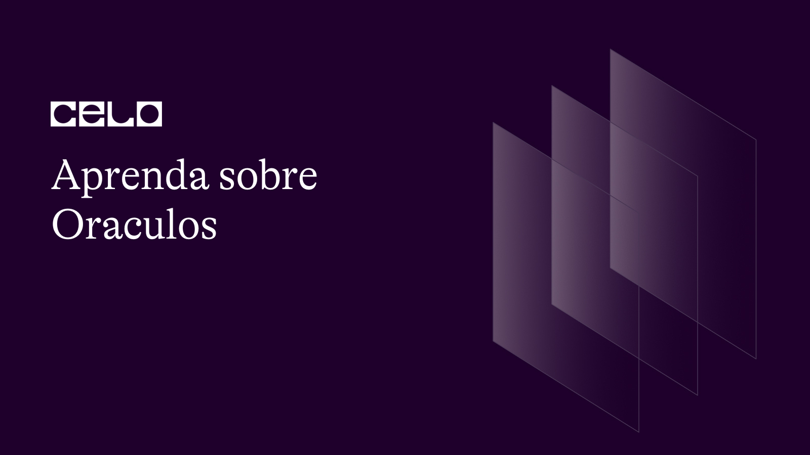

import YouTube from '@components/YouTube';

## Introdução

Um oráculo no contexto de blockchain e contratos inteligentes é um serviço ou software de terceiros que fornece dados externos para uma rede blockchain. Em outras palavras, um oráculo é uma fonte confiável de informações que pode ser acessada por contratos inteligentes executados em um blockchain.

O uso de oráculos é necessário em situações em que os contratos inteligentes exigem acesso a dados que não estão disponíveis no blockchain, como dados de mercado, condições climáticas ou o resultado de um evento esportivo. Os contratos inteligentes dependem de oráculos para recuperar esses dados externos e acionar certas ações com base neles.

Os oráculos são usados para tornar os contratos inteligentes mais versáteis e úteis em aplicativos do mundo real. Eles permitem que contratos inteligentes interajam com sistemas e dados externos, abrindo novas possibilidades para automação, instrumentos financeiros e outras aplicações.

No entanto, é importante observar que o uso de oráculos apresenta riscos potenciais, como a possibilidade de dados imprecisos ou manipulados serem inseridos no contrato inteligente. Portanto, é importante projetar e implementar cuidadosamente os oráculos, bem como verificar a autenticidade e precisão dos dados que eles fornecem.

## Pré-requisitos

Para este tutorial não é necessário conhecimento prévio. As ferramentas utilizadas serão:

- Remix: [Remix](https://remix.ethereum.org/) é uma Integrated Development Environment (IDE) para desenvolvimento de smart contracts na blockchain Ethereum. Ele fornece uma plataforma fácil de usar para escrever, testar e depurar smart contracts escritos na linguagem Solidity. Além disso, a IDE Remix também fornece ferramentas para simular e executar smart contracts em diferentes ambientes de rede, incluindo a rede principal Ethereum e redes de teste. Ele é uma ferramenta popular entre desenvolvedores de smart contracts, pois oferece recursos avançados para facilitar o desenvolvimento e teste de contratos inteligentes.

## Tutorial

Confira no video como construir um smart contract utilizando oraculos em Celo.

<YouTube videoId="1YQqLxm1SqE"/>

Confira o código completo no [github](https://github.com/guizostudios/oracle)

Leia mais sobre o [Witnet](https://docs.witnet.io/smart-contracts/witnet-data-feeds/addresses/celo)

## Conclusão

Parabéns! Você concluiu o tutorial e agora sabe como utilizar oraculos em Celo 🎉 .

## Próximos passos

Como próximos passos sugiro a você consultar outros [videos](https://docs.celo.org/tutorials?tags=video).

Além disso, convido você a ver nossos próximos conteúdos em português.

## Sobre o Autor

Eu sou um empreendedor serial, founder da Guizo Studios e sempre disponível para ajudar o ecossistema Celo.

[LinkedIn](https://www.linkedin.com/in/ewertonlopes/)
