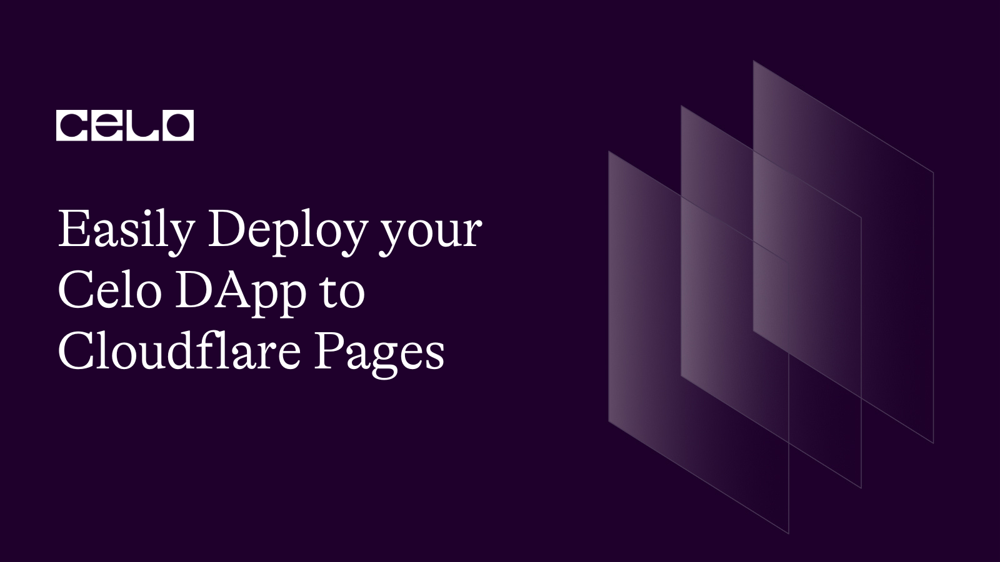

## Introduction

Any software development life cycle is not complete until the product or solution the development teams are building reaches the customers. For this to be possible there is a need for a series setup and configuration to create an environment to run the solution to make it accessible to all the customers as need be. After adopting a version control system, every code push to this system can be tracked and automatically deliver to our customer. Celo is a famous blockchain platform for building decentralized applications (DApps). If you've developed a Celo DApp and you're ready to make it available to your users, deploying it to a hosting platform like Cloudflare Pages is a great option. In this article, we'll walk you through the steps to deploy your Celo DApp to Cloudflare Pages using GitHub.

## Prerequisite

- GitHub Account
- Celo DApp code repository
- Cloudflare Account
- Git and CLI

## Before we get started

Make sure your DApp is prepared for production before deploying it. This entails checking that the code has been extensively tested, that all relevant dependencies are installed and that all configurations are set up correctly. To ensure a successful deployment procedure, make sure to adhere to the best practices for DApp development and deployment.

## GitHub Set up

Despite the fact, this is a beginner-level tutorial I will not be explaining how to create a GitHub account it is as simple as visiting [this link](https://github.com/) and following the prompt. If you are a student I will suggest using your student email to access what is called Github Student Developer Pack from the GitHub Education team to get free access to the different resources to upskill but that is not the point of this tutorial.

## Setting up Cloudflare Account

After the successful creation of GitHub, you can create a repository using this link and provide names and descriptions of your DApp. Leave the `README` checkbox unchecked to have access to detailed steps on how to connect your local repository to your GitHub repository. This is a bit complex but I believe you have a working GIT environment setup. If not try following this documentation to set up and push your code to the remote GitHub repository you just created above. After a successful `push` - making all your codes available on GitHub we can now proceed to the next stage of the deployment phase which is the configuration phase.

Because this is a beginner focus tutorial, I will be taking us through a step-by-step of creating a Cloudflare account. The goal after creating a Cloudflare account is to get the Cloudflare dashboard up and running to have access to everything Cloudflare cooked up for us.

- Step 1: Navigate the Cloudflare page, you can use [this direct link](https://www.cloudflare.com/)

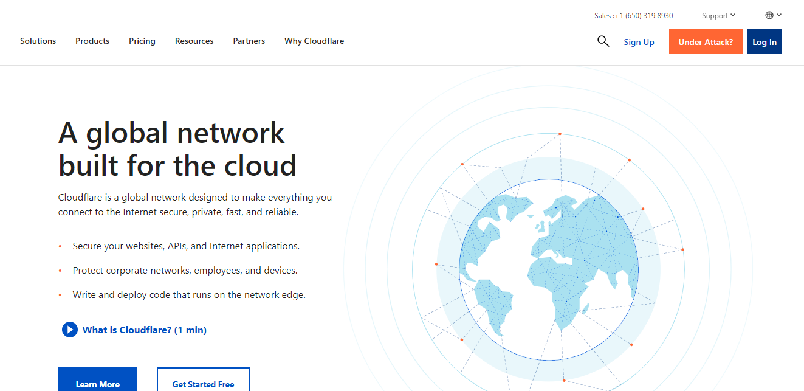

- Step 2: Click on the `Sign Up` button in the right-hand corner
- Step 3: Fill out your email and password to create an account and you will be presented with a dashboard like below

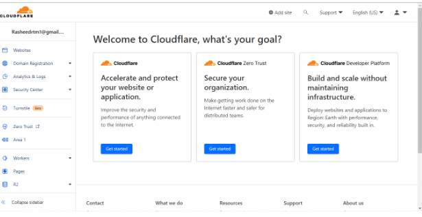

- Step 4: Despite having a dashboard already, it is important to verify your account by looking out for an email from Cloudflare in the email address you provided and after that, you’ve completely registered on Cloudflare.

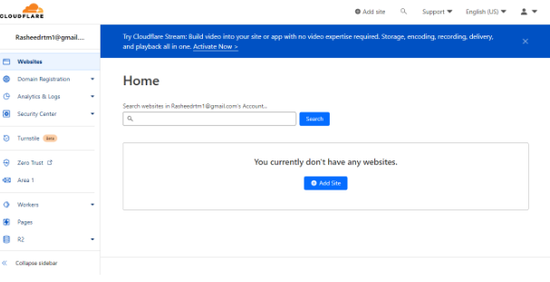

## Let’s set up the pages for deployment

## Setting up `pages`

- Step 1: After successfully logging in to your Cloudflare account
- Step 2: Navigate to the `pages` tab
- Step 3: Click on the `Create a project` button.

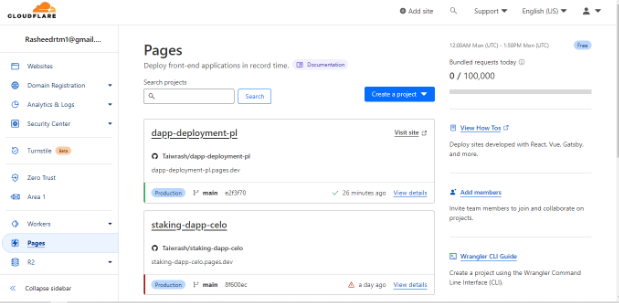

- Step 4: A pop-up to choose the right version control will pop up, in this case, we are using Git and Github. So select `Connect to Git`

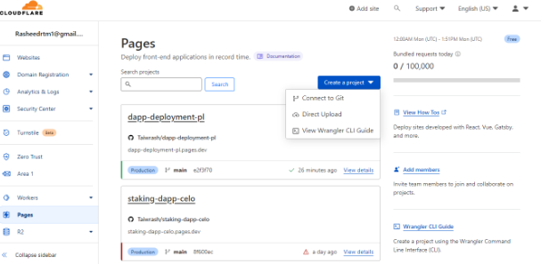

- Step 5: You will be presented with a connection and authorization page, give the authorised access to your Cloudflare to access your personal GitHub account where your repository lives. It is advisable to select all repositories for access then you can choose a repo to deploy on the Cloudflare page after successful authorization and the final stage will look like this with all your repository listed here.

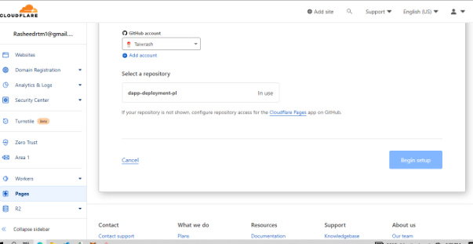

- Step 6: Select the repository to deploy and click `Begin Setup`.
- Step 7: You will be presented with a page to set up your build process, if you are using a framework, ensure to choose the right framework in the list presented and if it is a custom DApp, you can leave it as `None`. In this case, choose `Create React App` and other things will be populated. You will have the option of adding the environment variables. Add any if necessary, in this case of this we don’t have any then choose `save and deploy` and watch magic starting in actions.

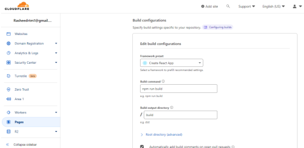

- Step 8: Watch the build going

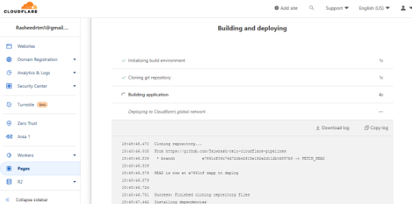

- Step 9: After successful deployment, you have something like the below where you can check the DApp you just deployed and be able to share the link with the world to test out.

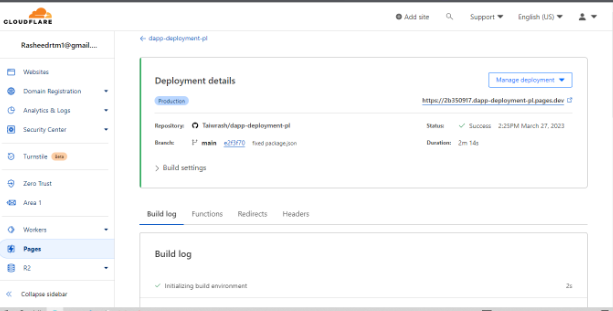

Suppose you follow along with the same repository I used. On clicking that link you will be presented with a screen like below, make sure you have browser support and the necessary extension to run a DApp and after necessary extension acceptance and confirmation you will have your DApp up and running like we have this one running here.

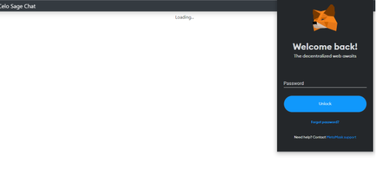

Viola! You’ve successfully built and deployed your DApp and it is accessible and available for your users wherever they are in the whole world. [Here](https://2b350917.dapp-deployment-pl.pages.dev) is the one we did together.

## Conclusion

Making your application accessible to more users is made easy and simple by deploying your Celo DApp to Cloudflare Pages. You can easily deploy your DApp to Cloudflare Pages by following the instructions in this guide, assuring a seamless user experience for your users and offering an easy way to make your items available for your consumers. The GitHub repository for the tutorial is [here](https://github.com/Taiwrash/dapp-deployment-pl)

## About the Author

Hey, I am Rasheed Mudasiru. A software developer who is passionate about community, open source and developer relations: I write about DevOps, automation, deployments and cloud computing.
