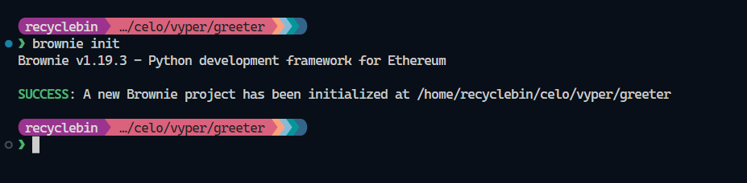
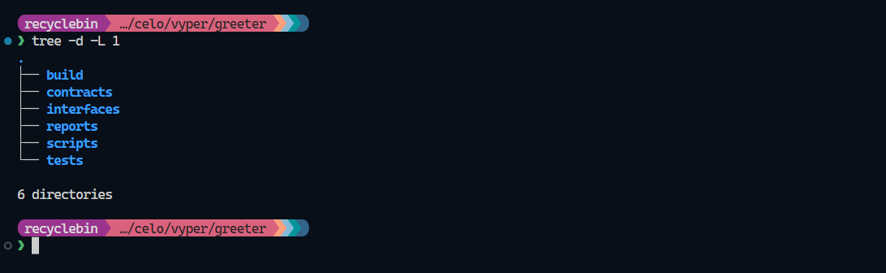
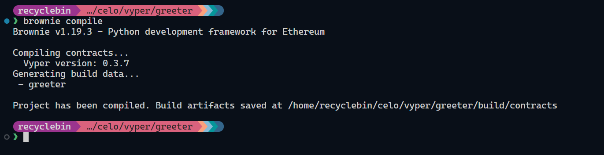
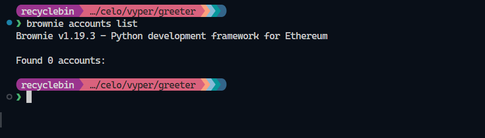
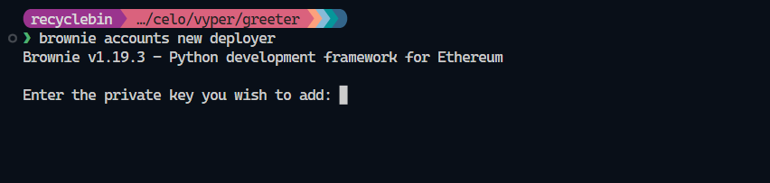
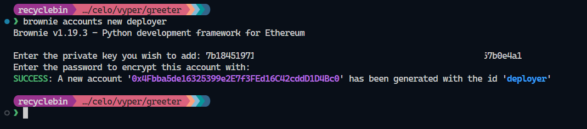
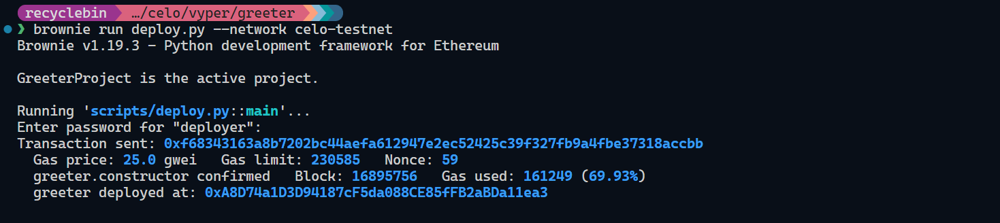
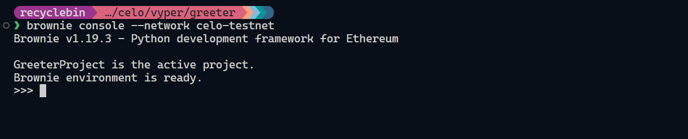

## Introduction

When people talk about smart contracts, Solidity is often the first language that comes to mind. However, there are other options available, and one of the most popular among them is Vyper. Vyper is a contract-oriented, pythonic programming language designed for the Ethereum Virtual Machine (EVM). It emphasizes security, simplicity of language, and compiler.

In this tutorial, we will first set up a development environment and then build a greeter smart contract. This tutorial will help you understand the basics of Vyper and provide a great starting point for any Vyper projects you may want to create in the future.

## Prerequisites

Since Vyper is similar to Python, it's important to have a basic understanding of Python.

## Requirements

To use Vyper, you must have Python 3.6 or higher installed on your machine. To check the version of Python, run the following command in the terminal:

```bash
python --version
```

If you don't have Python 3.6 or above installed or if you don't have Python installed at all, go to the [official download page](https://www.python.org/downloads/) and follow the instructions to install Python.

You also need to install **`pipx`** for this tutorial. We will be using **`pipx`** to install all the necessary dependencies. To install **`pipx`**, run the following command if you are on Linux:

```bash
python3 -m pip install --user pipx
```

Finally, run **`python3 -m pipx ensurepath`** to ensure that the **`PATH`** variable is updated. If you use a different operating system, please refer to the **`pipx`** [documentation](https://pypa.github.io/pipx/installation/) and follow the installation instructions.

Also, make sure to install the [Vyper extension](https://marketplace.visualstudio.com/items?itemName=tintinweb.vscode-vyper) in VS Code, which provides features like syntax highlighting for Vyper.

## Setting Up the Project

First step, in setting up project is to install Vyper. If you have Vyper installed already skip the next step.

### Installing Vyper

We will need the Vyper compiler to compile our smart contracts. To install Vyper, run the following command in the terminal:

```bash
pipx install vyper
```

After a successful installation, you should see the following output:


### Installing Brownie

Brownie is a Python-based development and testing framework for smart contracts that target the Ethereum Virtual Machine. To install Brownie, run the following command in the terminal:

```bash
pipx install eth-brownie
```

### Creating a New Project

To create an empty project, start by creating a new folder:

```bash
brownie init
```

You will see the following output in the terminal:



You can read about the project structure [here](https://eth-brownie.readthedocs.io/en/stable/structure.html). This is the project structure:



Finally, create a **`greeter.vy`** file in the **`contracts`** directory to complete the project setup.

## Writing a Smart Contract

Let's write our first Vyper contract that allows someone to get and set greetings. First, open our **`greeter.vy`** file, and similar to any solidity contract, we need to define the version of Vyper at the top of the file. To define the version, add the following code to the contract file:

```python
# @version ^0.3.7
```

Next, we can define our **`greeting`** variable where we will store our greeting.

```python
greeting: String[64]
```

Our first function in the contract will be our constructor, which we will define with **`__init__`**, in which we will assign a value to the **`greeting`** variable that is passed as an argument to the constructor during deployment. Since we are going to call this while deployment from outside, we can set visibility to external using the **`@external`** decorator.

```python
@external
def __init__(_greeting: String[64]):
    self.greeting = _greeting
```

Now that we have set the greeting after deployment, let's write a function to get that greeting called **`getGreeting`**. It will simply return the stored greeting. Since this function will be accessed from outside the contract and won't change any state, we can set the external and view function with **`@external`** and **`@view`** decorators. The return value for this function will be of type **`String[64]`**, similar to our **`greeting`** variable.

```python
@view
@external
def getGreeting() -> String[64]:
    return self.greeting
```

Lastly, we can write a function to set the greeting called **`setGreeting`**. This function will simply assign the provided value to the **`greeting`** variable, and the visibility will be external.

```python
@external
def setGreeting(_greeting: String[64]):
    self.greeting = _greeting
```

Here, you can see the our completed Vyper contract.

```python
# @version ^0.3.7

greeting: String[64]

@external
def __init__(_greeting: String[64]):
    self.greeting = _greeting

@view
@external
def getGreeting() -> String[64]:
    return self.greeting

@external
def setGreeting(_greeting: String[64]):
    self.greeting = _greeting
```

We have completed our first Vyper contract, so let's compile it and deploy it on the Alfajores testnet.

## Compile the Contract

To compile the contract, you can run the following command in the terminal:

```bash
brownie compile
```

This will create a contract ABI, which can be found in **`build/contracts/greeter.json`**, and show the following output on the terminal:



## Contract Deployment

First, we need to add our deployer wallet and Alfajores network configuration to Brownie, which will help us deploy our contract. First, run the following command to see if you have any wallets added to Brownie already:

```bash
brownie accounts list
```

If you don't have any accounts, it will say **`Found 0 accounts`**.



So, let's add our deployer account. We have three ways to add a wallet using a private key, keystore file, or using a hardware wallet. For now, we will add a wallet using a private key. To add a wallet, run the following command in the terminal:

```bash
brownie account new deployer
```

After executing the command, it will ask you for your private key. After you add the private key, press enter.



In the next step, the system will ask for a password to protect the private key. Once you enter your password and press enter, the wallet will be added, and it will be saved with deployer as its ID. Make sure to get some testnet tokens from [Alfajores faucet](https://faucet.celo.org/).



Next, we can add the Alfajroes to Brownie's network list. You can check the existing networks with the **`brownie networks list`** command. To add the Alfajores network, run the following command:

```bash
brownie networks add Celo celo-testnet host=https://alfajores-forno.celo-testnet.org name=Alfajores chainid=44787 explorer=https://alfajores.celoscan.io/
```

The structure of the command is `brownie networks add [environment] [id] host=[host] [KEY=VALUE, ...]` so in our command Celo is the environment and celo-testnet is the ID. The rest of the parameters are self-explanatory.

The last thing to do in the deployment process is to write a script to deploy our contract. First, create a **`deploy.py`** file in the **`scripts`** directory and add the following snippet to it:

```python
from brownie import greeter, accounts

def main():
    acct = accounts.load("deployer")
    greeter.deploy("Hello World!", {'from': acct})
```

This is a very simple script. First, we are importing our contract and accounts object from Brownie. Then, in the main function, we are loading our deployer wallet in the **`acct`** variable and deploying the contract using the **`deploy`** method, which takes two arguments: the greeting and an object that tells from which account the deployment should run.

Now that we have set up everything for deployment, the last thing to do is to run the following command in the terminal to deploy the contract:

```bash
brownie run deploy.py --network celo-testnet
```

This will ask for the password for our wallet, which we entered previously. After entering the correct password, it will deploy the contract and show an output similar to the following:



The address of deployed contract is logged in the terminal, we will need it to interact with contract in the next step.

## Interacting with Deployed Contract

To interact with the deployed contract, we can use the Brownie console. To open the console, run the following command:

```bash
brownie console --network celo-testnet
```

This will open the console, and we can interact with the Alfajores testnet.



To get started, we need to import the contract and accounts, and load the deployer wallet. When loading the accounts, it will prompt for the password again, so enter it.

```bash
>>> from brownie import greeter, accounts
>>> acct = accounts.load("deployer")
```

Next, we use the **`at`** method of the contract class to create an instance of our deployed contract. You can add your contract address or just use given address.

```bash
>>> greeter_contract = greeter.at("0xA8D74a1D3D94187cF5da088CE85fFB2aBDa11ea3")
```

Now, we can access all the functions of the contract and experiment with it.


## **Conclusion**

We have successfully developed and deployed our first Vyper contract using Brownie. We have also set up our development environment for any Vyper project that we might want to work on in the future. We have explored how Brownie manages accounts and networks, and we have interacted with our contract deployed on Alfajores using the Brownie console.

## **Next Steps**

Now that we have our setup ready, we can recreate our favorite dapp in Vyper or try to create something we have previously worked on in Solidity. Here are some Solidity examples that we can convert to Vyper.

If we create something exciting using Vyper, we should share it with the Celo Discord community.

## About the Author

Nikhil Bhintade is a tech-savvy product manager and technical writer, always eager to discover the latest and greatest in the tech world. With a sharp mind for all things technical, he is constantly exploring new ideas and looking for ways to push the boundaries of what's possible with technical content and products.

When he's not crafting compelling product stories and technical documents, you can catch him tinkering on his latest projects on [GitHub](https://github.com/nikbhintade). And if you're looking for a tech industry insider to connect with, he's always up for a chat on [LinkedIn](http://linkedin.com/in/nikbhintade), where he stays on top of the latest trends and developments.

## References

- Project Repo: [https://github.com/nikbhintade/greeter-vyper](https://github.com/nikbhintade/greeter-vyper)
- Vyper Documentation: [https://docs.vyperlang.org/en/stable/](https://docs.vyperlang.org/en/stable/)
- Brownie Documentation: [https://eth-brownie.readthedocs.io/en/stable/](https://eth-brownie.readthedocs.io/en/stable/)
- Python Download Page: [https://www.python.org/downloads/](https://www.python.org/downloads/)
