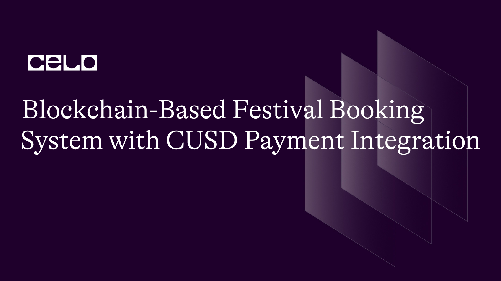

## INTRODUCTION

Welcome to this tutorial on a smart contract written in Solidity. This contract is called "Festival" and it allows users to create and read festival programmes, as well as book and cancel slots for those programmes using a specific ERC20 token (cUSD).

The contract includes an interface for the ERC20 token, which defines the functions necessary for transferring and managing the token. The contract also defines a struct called "Programme" which stores information about each festival programme, such as its owner, URL, theme, description, location, price and sold slots.

The "writeProgramme" function allows users to create a new festival programme by providing the necessary information. The "readProgramme" function allows users to retrieve information about a specific programme.

The "bookSlot" function enables users to book a slot for a specific programme by transferring the required amount of cUSD tokens to the owner of the programme. The "cancelBooking" function allows users to cancel a booking and receive a refund.

Overall, this contract demonstrates the basic functionality of a decentralized application that can be used to manage festival programmes and bookings. In the following sections of the tutorial, we will explore each function in more detail and explain how they work.

## REQUIREMENT

To take this tutorial, you will need:

- Access to a code editor or text editor such as Remix.

- A reliable internet browser and internet connection

## PREREQUISITE

- Basic knowledge of Javascript.

- Understand how Blockchain works.

- Have a basic knowledge of solidity.

To begin writing our smart contract, we will need to use Remix, an online IDE for writing and testing Solidity code. To get started, open Remix in your web browser and create a new file by clicking on the plus sign located on the left-hand side of the screen. Name the festival.sol. [you can click this link to access the remix plugin](https://remix-ide.readthedocs.io/en/latest/file_explorer.html#:~:text=Creating%20new%20files,-There%20are%202&text=The%20first%20is%20to%20click,will%20open%20in%20the%20Editor.).

After creating a new file in Remix, we can start writing our smart contract by declaring some statements. These statements will define the functionality and behavior of our contract. We will start by defining the version of Solidity we will be using, followed by the contract name and any necessary imports or interfaces. We will then define any necessary state variables, structs, or mappings, and then proceed to write the functions that define the behavior of our contract.

```solidity
// SPDX-License-Identifier: MIT

pragma solidity >=0.7.0 <0.9.0;
```

Next, we will add an ERC20 token interface to our smart contract.

```solidity
interface IERC20Token {
  function transfer(address, uint256) external returns (bool);
  function approve(address, uint256) external returns (bool);
  function transferFrom(address, address, uint256) external returns (bool);
  function totalSupply() external view returns (uint256);
  function balanceOf(address) external view returns (uint256);
  function allowance(address, address) external view returns (uint256);

  event Transfer(address indexed from, address indexed to, uint256 value);
  event Approval(address indexed owner, address indexed spender, uint256 value);
}
```

In this code above, we are defining an interface for an ERC20 token. An interface is a way to define a set of functions that a contract must implement in order to be considered compatible with the interface. This interface defines six functions: transfer, approve, transferFrom, totalSupply, balanceOf, and allowance.

- `transfer` allows a user to send tokens to another address. It takes two arguments: the address of the recipient and the amount of tokens to send. It returns a boolean value indicating whether the transfer was successful.

- `approve` allows a user to give permission for another address to spend tokens on their behalf. It takes two arguments: the address of the spender and the maximum amount of tokens they are allowed to spend. It returns a boolean value indicating whether the approval was successful.

- `transferFrom` allows a user to send tokens on behalf of another user. It takes three arguments: the address of the owner, the address of the recipient, and the amount of tokens to send. It returns a boolean value indicating whether the transfer was successful.

- `totalSupply` returns the total number of tokens in existence.

- `balanceOf` returns the balance of tokens held by a particular address.

- `allowance` returns the maximum amount of tokens that a spender is allowed to spend on behalf of a particular owner.

In addition to these functions, this interface also defines two events: Transfer and Approval. These events are emitted whenever a transfer or approval occurs and allow external parties to track the movement of tokens within the contract.

By implementing this interface in our smart contract, we can interact with any ERC20 token that also implements these functions. This allows us to create more flexible and interoperable contracts that can interact with a wide range of other applications and systems.

Moving on, we will name our contract and define a struct in our smart contract.

```solidity
contract Festival {

    uint internal programmesLength = 0;
    address internal cUsdTokenAddress = 0x686c626E48bfC5DC98a30a9992897766fed4Abd3;

    struct Programme {
        address payable owner;
        string url;
        string theme;
        string description;
        string location;
        uint price;
        uint sold;
    }
```

In the code snippet above, we can see that we have created a smart contract called `Festival`. Within this contract, we have defined a struct called Programme, which has several properties such as `owner`, `url`, `theme`, `description`, `location`, `price`, and `sold`. These properties will be used to define the attributes of each programme that will be added to the festival.

Additionally, we have defined two internal variables `programmesLength` and `cUsdTokenAddress`. programmesLength will be used to keep track of the number of programmes added to the festival, while cUsdTokenAddress is the address of the ERC20 token that will be used for payment.

The Programme `struct` is used to store the details of each programme, and programmesLength is used to keep track of the number of programmes that have been added to the festival. The cUsdTokenAddress variable is used to store the address of the ERC20 token that will be used for payment, specifically the cUSD token.

After defining our struct, we add a `mapping` that allows us to store and retrieve program information. The mapping data structure in Solidity is similar to an associative array or a hash table in other programming languages. In this case, we map a uint (which will serve as an ID for each program) to its corresponding Programme struct.

```solidity
 mapping (uint => Programme) internal programmes;
```

To add more functionality to our smart contract, we'll define some functions. The first function we'll create is called `writeProgramme`. This function is responsible for adding a new festivals to the list of existing programmes in our programmes mapping.

```solidity
 function writeProgramme(
        string memory _url,
        string memory _theme,
        string memory _description,
        string memory _location,
        uint _price
    ) public {
        uint _sold = 0;
        programmes[programmesLength] = Programme(
            payable(msg.sender),
            _url,
            _theme,
            _description,
            _location,
            _price,
            _sold
        );
        programmesLength++;
    }
```

The `writeProgramme` function is used to create a new programme on our smart contract. It takes in five parameters: `_url`, `_theme`, `_description`, `_location`, and `_price`.

Inside the function, we first set the number of bookings sold to zero, which will be incremented later when users book slots for the programme.

Then, we create a new programme by assigning it to the programmes mapping using the programmesLength variable as the key. We do this by passing in the function parameters and the \_sold variable into the Programme struct.

Finally, we increment the programmesLength variable so that the next programme created will have a unique key.

Let's proceed to create the `readProgramme` function.

```solidity
function readProgramme(uint _index) public view returns (
        address payable,
        string memory,
        string memory,
        string memory,
        string memory,
        uint,
        uint
    ) {
        return (
            programmes[_index].owner,
            programmes[_index].url,
            programmes[_index].theme,
            programmes[_index].description,
            programmes[_index].location,
            programmes[_index].price,
            programmes[_index].sold
        );
    }
```

This function can be called by anyone and doesn't modify any data on the blockchain, so it doesn't require any gas fees. Its purpose is to allow us to retrieve information about a programme that has been added to the smart contract.

To use this function, we need to pass in one parameter called \_index, which is the index of the programme in the programmes array that we want to retrieve information about. The function returns several pieces of information about the programme, including:

- The address of the owner of the programme, which is of type address payable

- The URL of the programme, which is of type string memory

- The theme of the programme, which is of type string memory

- The description of the programme, which is of type string memory

- The location of the programme, which is of type string memory

- The price of the programme, which is of type uint

- The number of tickets sold for the programme, which is of type uint.

To retrieve this information, we simply need to call the function and provide the \_index parameter. The function will then access the relevant properties of the programme at the specified index in the programmes array and return them as a tuple.

Overall, this function is a useful tool for anyone who wants to get information about a specific programme that has been added to the smart contract. By making this information available through a view function, the smart contract provides transparency and accessibility for all parties involved in the programme.

Up next is the `bookSlot` function.

```solidity
 function bookSlot(uint _index) public payable  {
        require(
          IERC20Token(cUsdTokenAddress).transferFrom(
            msg.sender,
            programmes[_index].owner,
            programmes[_index].price
          ),
          "Transfer failed."
        );
        programmes[_index].sold++;
    }
```

This function is called bookSlot and it takes in a single parameter called \_index, which represents the index of the program slot that someone wants to book. The function also requires that the caller sends a certain amount of a specific type of cryptocurrency called cUSD to the owner of the program slot in order to book it.

The function first checks that the transfer of cUSD tokens from the caller to the program slot owner is successful. If the transfer is successful, the function increments the sold variable of the program slot, indicating that someone has booked that slot. If the transfer fails, the function will throw an error message saying "Transfer failed."

In simpler terms, this function allows someone to book a program slot by sending cUSD tokens to the owner of that slot. If the transfer is successful, the slot will be marked as sold.

Finally, we add the `cancelBooking` function and the `getProgrammesLength()`.

```solidity
   function cancelBooking(uint _index) public {
    require(
        programmes[_index].sold > 0,
        "No bookings have been made for this programme."
    );
    require(
        IERC20Token(cUsdTokenAddress).transfer(
            msg.sender,
            programmes[_index].price
        ),
        "Refund failed."
    );
    programmes[_index].sold--;
}
 function getProgrammesLength() public view returns (uint) {
        return (programmesLength);
    }

}
```

The `cancelBooking` function takes in one input parameter \_index, which is an unsigned integer representing the index of a program in an array of programs. The function is public, which means that anyone can call it from outside the contract.

Here's what the function does:

- It uses the `require` function to check that at least one booking has been made for the program with the given \_index. If no bookings have been made, the function will return an error message.

- It uses the `require` function again to transfer the price of the program back to the user who made the booking using an ERC20 token contract. If the transfer fails, the function will return an error message.

- It decrements the sold variable for the program at the given \_index by 1, to reflect the cancellation of the booking.

The next function is the `getProgrammesLength` function. It is also a public function, which means that anyone can call it from outside the contract. This function doesn't take any input parameters.

Here's what the function does:

It returns the value of the programmesLength variable. This variable represents the number of programs available in the array of programs.
So, in summary, the cancelBooking function cancels a booking for a program and refunds the user, while the getProgrammesLength function returns the number of programs available in the contract.

The complete code for this session is provided below:

```solidity
  // SPDX-License-Identifier: MIT

pragma solidity >=0.7.0 <0.9.0;

interface IERC20Token {
  function transfer(address, uint256) external returns (bool);
  function approve(address, uint256) external returns (bool);
  function transferFrom(address, address, uint256) external returns (bool);
  function totalSupply() external view returns (uint256);
  function balanceOf(address) external view returns (uint256);
  function allowance(address, address) external view returns (uint256);

  event Transfer(address indexed from, address indexed to, uint256 value);
  event Approval(address indexed owner, address indexed spender, uint256 value);
}

contract Festival {

    uint internal programmesLength = 0;
    address internal cUsdTokenAddress = 0x686c626E48bfC5DC98a30a9992897766fed4Abd3;

    struct Programme {
        address payable owner;
        string url;
        string theme;
        string description;
        string location;
        uint price;
        uint sold;
    }

    mapping (uint => Programme) internal programmes;

    function writeProgramme(
        string memory _url,
        string memory _theme,
        string memory _description,
        string memory _location,
        uint _price
    ) public {
        uint _sold = 0;
        programmes[programmesLength] = Programme(
            payable(msg.sender),
            _url,
            _theme,
            _description,
            _location,
            _price,
            _sold
        );
        programmesLength++;
    }

    function readProgramme(uint _index) public view returns (
        address payable,
        string memory,
        string memory,
        string memory,
        string memory,
        uint,
        uint
    ) {
        return (
            programmes[_index].owner,
            programmes[_index].url,
            programmes[_index].theme,
            programmes[_index].description,
            programmes[_index].location,
            programmes[_index].price,
            programmes[_index].sold
        );
    }

    function bookSlot(uint _index) public payable  {
        require(
          IERC20Token(cUsdTokenAddress).transferFrom(
            msg.sender,
            programmes[_index].owner,
            programmes[_index].price
          ),
          "Transfer failed."
        );
        programmes[_index].sold++;
    }

    function cancelBooking(uint _index) public {
    require(
        programmes[_index].sold > 0,
        "No bookings have been made for this programme."
    );
    require(
        IERC20Token(cUsdTokenAddress).transfer(
            msg.sender,
            programmes[_index].price
        ),
        "Refund failed."
    );
    programmes[_index].sold--;
}
 function getProgrammesLength() public view returns (uint) {
        return (programmesLength);
    }

}
```

[Click this link to access the full code for this session](https://github.com/Ikanji201/festivalllls)

## CONTRACT DEPLOYMENT

To deploy the flower smart contract on the Celo blockchain, you would need the following:

CeloExtensionWallet: Download and install the Celo Extension Wallet from the Google Chrome store, create a wallet, and securely store your key phrase. [Click here to intall the celo extension wallet](https://chrome.google.com/webstore/detail/celoextensionwallet/kkilomkmpmkbdnfelcpgckmpcaemjcdh?hl=en)

Celo Faucet: Fund your wallet by copying your wallet address and pasting it into the Celo Faucet, then confirm. [Click here to access celo faucet](https://faucet.celo.org/)

Celo Remix Plugin: Open Remix and create a new Solidity file, paste the Festival contract code into the file, and ensure the Solidity compiler is set to version 0.8.7 or later. [Click here to access to access the remix ide](https://remix.ethereum.org/)

Compile the contract by clicking the "Compile Festival.sol" button in the Solidity Compiler tab in Remix.

In the "Deploy & Run Transactions" tab, select the Celo network from the dropdown menu, connect your wallet to Remix by clicking "Connect to wallet", and select "FloralNft" from the "Contract" dropdown menu.

Click the "Deploy" button, confirm the transaction in your wallet, and wait for the transaction to be confirmed on the Celo blockchain.

Once the transaction is confirmed, the Festival contract will be deployed on the Celo blockchain and you can interact with it using Remix.

## CONCLUSION

Well done on creating a functional smart contract for Festivals on the Celo blockchain! This is a significant achievement, and you should feel proud of the effort you put in to make it happen. Keep up the great work, and take the time to appreciate the rewards of your dedication and hard work. Celebrate and enjoy your success! 🎉

## NEXT STEPS

I hope you found this tutorial informative and gained valuable insights from it. If you're interested in furthering your education, I've listed some helpful links below that you might find beneficial to explore:

The official Celo documentation: https://docs.celo.org/

Solidity By Example, a website with code examples for learning Solidity: https://solidity-by-example.org/

OpenZeppelin Contracts, a library of secure, tested smart contract code: https://www.openzeppelin.com/contracts/

Solidity documentation for version 0.8.17: https://docs.soliditylang.org/en/v0.8.17/

I hope these resources prove to be useful to you!

## About the author

I'm David Ikanji, a web3 developer residing in Nigeria, and I have a strong passion for working with blockchain technology.
