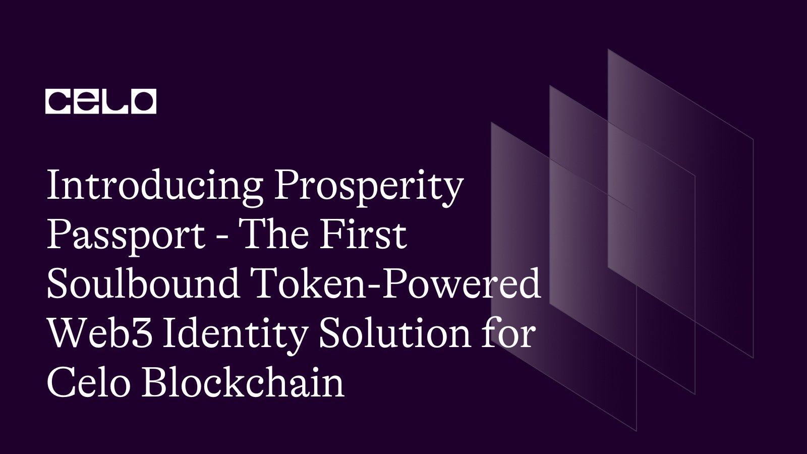
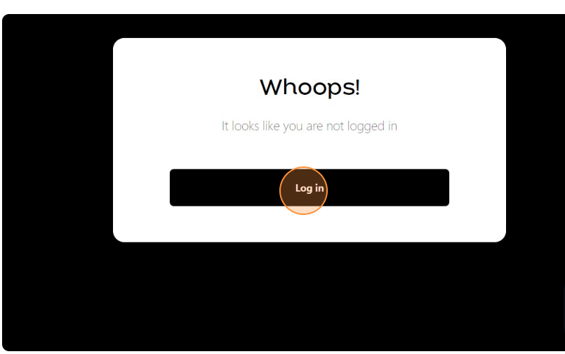
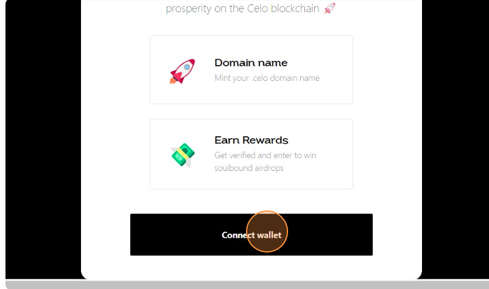
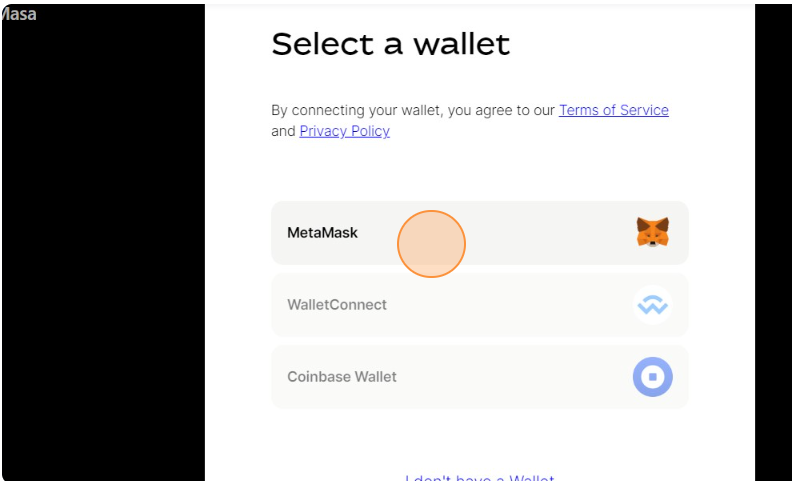
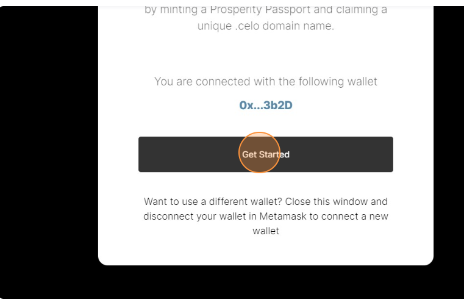
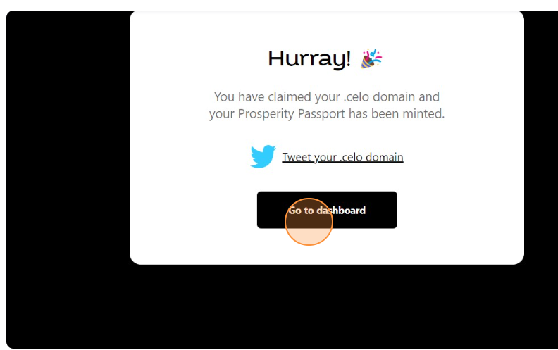
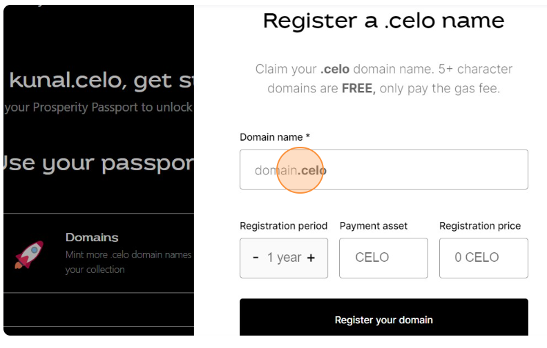
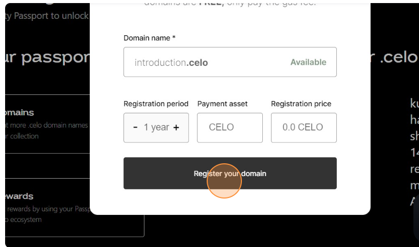
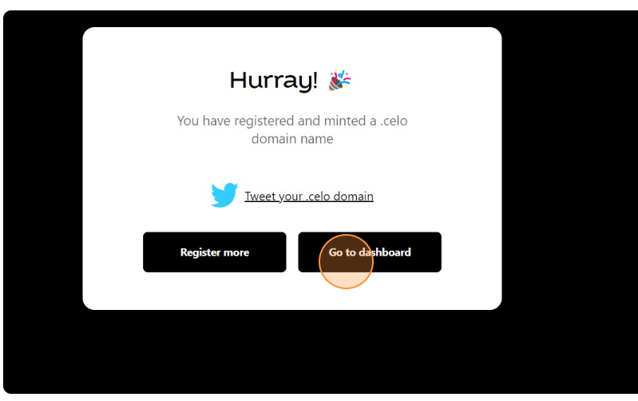

## 🌱 Introduction

The rise of Web3 technologies has created new opportunities for decentralized identity solutions that provide more privacy, security, and control for users. One such solution is Prosperity Passport, the first soulbound token-powered identity solution for the Celo blockchain.

## What is Prosperity Passport?

Prosperity Passport is a decentralized identity solution that allows users to create and manage their own digital identity on the Celo blockchain. It leverages the power of soulbound tokens to secure and authenticate users' identities, making it more difficult for hackers and bad actors to steal or manipulate them.

Soulbound tokens are unique digital assets that are created when a user's identity is verified on the Celo blockchain. These tokens are then bound to the user's identity and cannot be transferred to anyone else. This means that only the rightful owner of the token can access their digital identity, making it more secure and tamper-proof.

## How does Prosperity Passport work?

To use Prosperity Passport, users first need to verify their identity on the Celo blockchain. This can be done by providing some basic information, such as their name, address, and phone number. Once their identity is verified, a soulbound token is created and bound to their identity.

Users can then use their soulbound token to access various services and applications on the Celo blockchain. For example, they can use it to authenticate themselves on decentralized finance (DeFi) platforms, access decentralized marketplaces, and participate in decentralized governance.

## What are the benefits of using Prosperity Passport?

There are several benefits to using Prosperity Passport as your decentralized identity solution:

- Increased privacy: With Prosperity Passport, users have more control over their personal data and can choose which information to share with which applications.

- Improved security: Soulbound tokens make it more difficult for bad actors to steal or manipulate users' identities, making Prosperity Passport a more secure solution.

- Seamless user experience: With Prosperity Passport, users only need to verify their identity once and can then access various services and applications on the Celo blockchain without having to repeat the process.

- Interoperability: Prosperity Passport is designed to be interoperable with other decentralized identity solutions, making it easier for users to switch between different solutions as needed.

## How to Claim a .Celo Domain & Mint a Prosperity Passport

To get started with Prosperity Passport, users can mint their Prosperity Passport, which automatically creates their soulbound identity on Celo. Users can also mint a .celo domain, similar to an ENS domain, but on the Celo blockchain.

**Here are the steps to claim a .Celo domain and mint a Prosperity Passport:**

1. Visit [app.prosperity.global](https://app.prosperity.global)
   Connect your wallet and authenticate it on the Prosperity Passport dashboard. If you are not yet on Celo, add Celo Mainnet to your MetaMask and switch to Celo Mainnet.

   

2. You’ll be prompted to create and mint your unique .celo domains (e.g. refi.celo; green.celo). Pick a domain name for your Prosperity Passport, and the time-frame you’d like to register it for. You can use any combination of numbers, letters and emojis.

   

   

   

   

3. Five-character .celo domains and above are free — you just need to pay the Celo gas gee. The average gas fee is $0.0005, according to Celo’s website.

   

   

4. Approve the transaction & success, that’s it! Don’t forget to share your newly minted .celo domain on social.
   .Celo Domains

   

   

5. Once you create your Prosperity Passport, you can give it a domain name in the format of .celo, similar to an ENS. Up next, Masa will be working to integrate full .celo domain names within the Celo ecosystem wallet infrastructure, so you can use your .celo as your human-readable address across Celo.

**_Feel free to mint as many .celo domains as you like. Use any creative combination of letters, numbers and emojis to create fun, unique, and rare .celo domains. Don’t forget to share your newly minted .celo on social!_**

## Rewards

Masa has some exciting rewards, perks, and partnerships lined up within the Celo Ecosystem in the near future. Get started by creating your Prosperity Passport at app.prosperity.passport.

## Conclusion

Prosperity Passport is a promising decentralized identity solution that leverages the power of soulbound tokens to provide more privacy, security, and control for users on the Celo blockchain. As Web3 technologies continue to evolve, it's exciting to see innovative solutions like Prosperity Passport emerge to help users take back control of their digital identities.

## About Author

Hi! My name is Kunal Dawar and I am a Full Stack web2/web3 Developer. I have participated in numerous hackathons and have been fortunate enough to win many of them.

One thing that I am truly passionate about is creating things that are reliable and don't break easily. I believe that creating high-quality products is important not only for the users but also for the overall growth and success of a business.

In my free time, I enjoy learning about new technologies and staying up-to-date with the latest trends in the field. I also love to share my knowledge with others and mentor those who are interested in pursuing a career in web development.