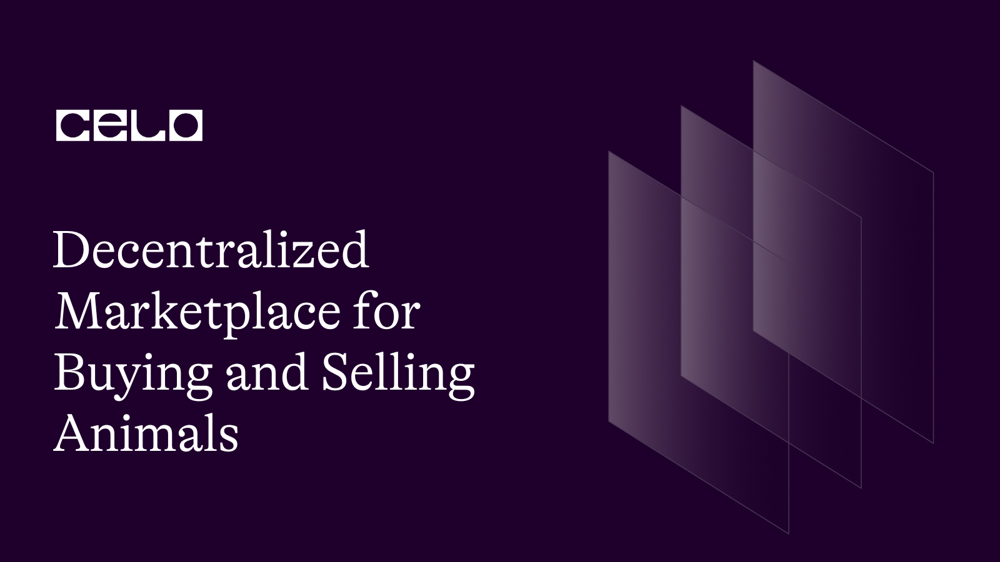

## INTRODUCTION

Welcome to this tutorial on how to create an Animal Marketplace using Solidity! In this tutorial, we will walk through a simple Solidity code that allows users to add and buy animals, update animal information, and change animal prices.

This code is a great example of how to create a decentralized marketplace using the Celo blockchain. We will be using the ERC-20 token standard to handle payments and the Solidity programming language to write our smart contract.

## REQUIREMENT

- A code editor or text editor, for this tutorial we will be using remix.

- An Internet Browser and good internet connection.

## PREREQUISITE

- Basic knowledge of Javascript.

- Understand how Blockchain works.

- Have a basic knowledge of solidity.

To get started with this tutorial, we will begin by creating our smart contract that will define the functionality of our animal marketplace. We will use Solidity programming language to write our smart contract, which will allow us to interact with the Celo blockchain and create a decentralized marketplace.

To create our smart contract, we will be using Remix, an online Solidity IDE. We will begin by creating a new file called "animalHub.sol" in the Remix editor. Once we have created the file, we will open it and start by adding the initial statements that are required for a Solidity file.

```solidity
// SPDX-License-Identifier: MIT

pragma solidity >=0.7.0 <0.9.0;
```

Adding SPDX license identifiers at the top of a Solidity contract file helps to specify the license that the contract is using. This is important for ensuring that the contract is compliant with the appropriate legal and licensing requirements.

In addition, we use the pragma statement to specify the version of Solidity that our smart contract uses. This helps the compiler to determine the necessary syntax and functionality required for our contract.

The next step is to add our ERC20 token interface, which will define the standard functions and events that our token contract must implement.

```solidity
interface IERC20Token {
   function transfer(address, uint256) external returns (bool);

    function approve(address, uint256) external returns (bool);

    function transferFrom(
        address,
        address,
        uint256
    ) external returns (bool);

    function totalSupply() external view returns (uint256);

    function balanceOf(address) external view returns (uint256);

    function allowance(address, address) external view returns (uint256);

    event Transfer(address indexed from, address indexed to, uint256 value);
    event Approval(
        address indexed owner,
        address indexed spender,
        uint256 value
    );
}
```

As we develop our animal marketplace, we will make use of the ERC20 token interface to enable the buying and selling of animals with tokens. The functions defined in the interface will allow us to transfer tokens between addresses, check balances, and get information about the total supply of the token. We will also use the event system to log transactions for transparency and record-keeping purposes.

Next, We will give our animal marketplace contract a name, `AnimalHouse` and also add a `struct`.

```solidity
contract  AnimalHouse {


    uint internal animalsLength = 0;
    address internal cUsdTokenAddress =   0x874069Fa1Eb16D44d622F2e0Ca25eeA172369bC1;

    struct  Animal {
        address payable owner;
        string image;
        string name;
        string breed;
        string age;
         uint price;

    }
```

Now, we can name our smart contract and define our struct. In this tutorial, we will call our contract `AnimalHouse`. We then create our struct `Animal` with the properties we want to store for each animal that we will add to our marketplace. These properties include the animal's `owner`, `image`, `name`, `breed`, `age`, and `price`. We declare `owner` as an address payable since the owner will receive payment when an animal is sold. We also declare `animalsLength` as an unsigned integer (uint) and `cUsdTokenAddress` as an address.

The `animalsLength` variable will keep track of the number of animals that have been added to our marketplace, while the `cUsdTokenAddress` variable will store the address of the token we will use for payment. We will be using the ERC20 token, cUSD.

After defining our struct, we proceed to add our mapping.

```solidity
  mapping (uint =>  Animal) internal animals;
```

We use a mapping to store and retrieve our Animal struct using an index. In this case, we are mapping an unsigned integer (uint) to an Animal struct. The `internal` keyword is used to make the mapping only accessible within the smart contract. The animals variable is the name of our mapping.

To add more functionality to our smart contract, we will be implementing various functions. The first function we will add is called `addAnimal`.

```solidity

     function addAnimal (
        string memory _image,
        string memory _name,
        string memory _breed,
         string memory _age,
        uint _price

          ) public {
       Animal storage animalhub = animals[animalsLength];

        animalhub.owner = payable(msg.sender);
           animalhub.image = _image;
            animalhub.name = _name;
            animalhub.breed = _breed;
           animalhub.age = _age;
           animalhub.price = _price;


        animalsLength++;
          }
```

In this function, we first declare a new instance of our Animal struct, which we call animalhub. Then we set the values of the various properties of this struct instance using the arguments passed to the function. Specifically, we set the owner, image, name, breed, age, and price of the animal.

After setting these values, we then increment the animalsLength counter to keep track of the number of animals that have been added to the AnimalHouse.

It is important to note that the owner property is set to the address of the caller of the function, which is obtained using the msg.sender function. The payable keyword is added to ensure that the address is payable, allowing for transfers of funds to the address if needed.

Next, we add the `buyAnimal` function.

```solidity
 function buyAnimal(uint _index) public payable  {
        require(
          IERC20Token(cUsdTokenAddress).transferFrom(
            msg.sender,
            animals[_index].owner,
            animals[_index].price
          ),
          "Transfer failed."
        );

         animals[_index].owner = payable(msg.sender);

    }
```

We have a public function called `buyAnimal` that takes in one parameter, `_index`, which represents the index of the animal the user wants to purchase. To buy an animal, the user sending the transaction must include a certain amount of funds (in the form of a token) as payment for the animal.

In the buyAnimal function, we use a require statement to check that the transfer of the specified token from the sender (msg.sender) to the current owner of the animal (represented by animals[_index].owner) is successful. If the transfer fails, the function will revert and return the error message "Transfer failed."

If the transfer is successful, we update the owner of the animal to the sender (msg.sender) by assigning msg.sender to the owner property of the specified animal in the animals array. It's worth noting that the owner property is declared as payable, which means it can receive payments (in this case, the animal's purchase price).

Overall, the buyAnimal function allows users to purchase animals from the array of animals stored in the contract, provided they have enough funds to pay the animal's price in the specified token.

In addition, we add the `getAnimal` function.

```solidity
 function getAnimal(uint _index) public view returns (
        address payable,
        string memory,
        string memory,
        string memory,
        string memory,
        uint


    ) {

      return (
            animals[_index].owner,
            animals[_index].image,
             animals[_index].name,
            animals[_index].breed,
            animals[_index].age,
            animals[_index].price


        );
    }

```

The `getAnimal` function is a public function that we've created to allow users to retrieve information about a specific animal in the animals array. It takes in one parameter, `_index`, which represents the index of the animal the user wants to retrieve information about. The function is marked as view, which means it doesn't modify the state of the contract.

When the getAnimal function is called with a specific index value, it returns a tuple containing several pieces of information about the animal. Specifically, we return the following information about the animal at the specified index:

- The address of the animal's current owner, which is represented by the owner property of the animal at the specified index in the animals array. This address is returned as a payable address, which means it can receive payments.

- The image associated with the animal, which is represented by the image property of the animal at the specified index in the animals array. We return this value as a string type.

- The name of the animal, which is represented by the name property of the animal at the specified index in the animals array. We return this value as a string type.

- The breed of the animal, which is represented by the breed property of the animal at the specified index in the animals array. We return this value as a string type.
- The age of the animal, which is represented by the age property of the animal at the specified index in the animals array. We return this value as an unsigned integer (uint) type.

- The price of the animal, which is represented by the price property of the animal at the specified index in the animals array. We return this value as an unsigned integer (uint) type.

Overall, the getAnimal function provides a way for users to retrieve information about a specific animal in the animals array without modifying the state of the contract. This can be useful for displaying information about animals in a user interface or for checking the state of the contract without performing any updates.

Next, we add the `UpdateAge` and the `addNewprice` functions.

```solidity
  function UpdateAge(uint _index, string memory _age) public {
        require(msg.sender == animals[_index].owner, "Only creator can perform this operation");
        animals[_index].age = _age;
    }

    function AddNewPrice(uint _index, uint _price) public {
        require(msg.sender == animals[_index].owner, "Only creator can perform this operation");
        animals[_index].price = _price;

    }
```

The `UpdateAge` function and the `AddNewPrice` function are two public functions we have created to allow the owner of an animal to update its age and price, respectively. Both functions require that the sender of the transaction be the current owner of the animal, as determined by the owner property of the animal at the specified index in the animals array. If the sender is not the current owner, the function will revert and return an error message indicating that only the creator (i.e., current owner) can perform the operation.

- The UpdateAge function takes in two parameters: \_index, which represents the index of the animal in the animals array whose age is to be updated, and \_age, which represents the new age of the animal in the form of a string. If the sender of the transaction is the current owner of the animal, as determined by the require statement, the function updates the age property of the animal at the specified index in the animals array to the new age specified by the \_age parameter.

- The AddNewPrice function takes in two parameters as well: \_index, which represents the index of the animal in the animals array whose price is to be updated, and \_price, which represents the new price of the animal in the form of an unsigned integer (uint). If the sender of the transaction is the current owner of the animal, as determined by the require statement, the function updates the price property of the animal at the specified index in the animals array to the new price specified by the \_price parameter.

Finally, we add the `getanimalsLength()` function.

```solidity
function getanimalsLength() public view returns (uint) {
        return (animalsLength);
    }
}
```

The getanimalsLength function is a public function that does not take any parameters. Its purpose is to return the length of the animals array, which represents the number of animals currently stored in the contract.

The complete code for this session:

```solidity
// SPDX-License-Identifier: MIT

pragma solidity >=0.7.0 <0.9.0;


interface IERC20Token {
   function transfer(address, uint256) external returns (bool);

    function approve(address, uint256) external returns (bool);

    function transferFrom(
        address,
        address,
        uint256
    ) external returns (bool);

    function totalSupply() external view returns (uint256);

    function balanceOf(address) external view returns (uint256);

    function allowance(address, address) external view returns (uint256);

    event Transfer(address indexed from, address indexed to, uint256 value);
    event Approval(
        address indexed owner,
        address indexed spender,
        uint256 value
    );
}


 contract  AnimalHouse {


    uint internal animalsLength = 0;
    address internal cUsdTokenAddress =   0x874069Fa1Eb16D44d622F2e0Ca25eeA172369bC1;

    struct  Animal {
        address payable owner;
        string image;
        string name;
        string breed;
        string age;
         uint price;


    }
       mapping (uint =>  Animal) internal animals;


     function addAnimal (
        string memory _image,
        string memory _name,
        string memory _breed,
         string memory _age,
        uint _price

          ) public {
       Animal storage animalhub = animals[animalsLength];

        animalhub.owner = payable(msg.sender);
           animalhub.image = _image;
            animalhub.name = _name;
            animalhub.breed = _breed;
           animalhub.age = _age;
           animalhub.price = _price;


        animalsLength++;
          }


      function buyAnimal(uint _index) public payable  {
        require(
          IERC20Token(cUsdTokenAddress).transferFrom(
            msg.sender,
            animals[_index].owner,
            animals[_index].price
          ),
          "Transfer failed."
        );

         animals[_index].owner = payable(msg.sender);

    }


     function getAnimal(uint _index) public view returns (
        address payable,
        string memory,
        string memory,
        string memory,
        string memory,
        uint


    ) {

      return (
            animals[_index].owner,
            animals[_index].image,
             animals[_index].name,
            animals[_index].breed,
            animals[_index].age,
            animals[_index].price


        );
    }


    function UpdateAge(uint _index, string memory _age) public {
        require(msg.sender == animals[_index].owner, "Only creator can perform this operation");
        animals[_index].age = _age;
    }

    function AddNewPrice(uint _index, uint _price) public {
        require(msg.sender == animals[_index].owner, "Only creator can perform this operation");
        animals[_index].price = _price;

    }
 function getanimalsLength() public view returns (uint) {
        return (animalsLength);
    }
}
```

[Click this link to access the github repository for this code](https://github.com/Ogoyi/AnimalHouse)

## CONTRACT DEPLOYMENT

In order to deploy the AnimalHub smart contract on the Celo blockchain, several things are required such as:

To ensure a smooth deployment of our smart contract, it is essential to download the Celo extension wallet from the given link, [Celo Extension wallet](https://chrome.google.com/webstore/detail/celoextensionwallet/kkilomkmpmkbdnfelcpgckmpcaemjcdh?hl=en). Once done, the next step is to fund the wallet that we have created, [Celo faucet](https://faucet.celo.org/). This can be accomplished by accessing the Celo Alfojares faucet using the provided link.

With our wallet funded, we can now proceed to deploy the smart contract using the Celo plugin available in Remix.

## CONCLUSION

Great work on completing the smart contract for animals on the Celo blockchain! Your achievement is impressive, and I want to congratulate you on your success. You can now feel proud of yourself and enjoy the results of your hard work. Keep up the good work! 🎉

## Next step

Great job! It's always helpful to provide additional resources for further learning. Don't hesitate to reach out if you have any more questions or if you need further assistance, you can reach out to me on twitter by clicking [this link](https://twitter.com/thompsonogoyi). Happy learning!

## About the author

My name is Ogoyi Thompson, and I'm a web3 developer based in Nigeria. I am enthusiastic about working with blockchain technology.
