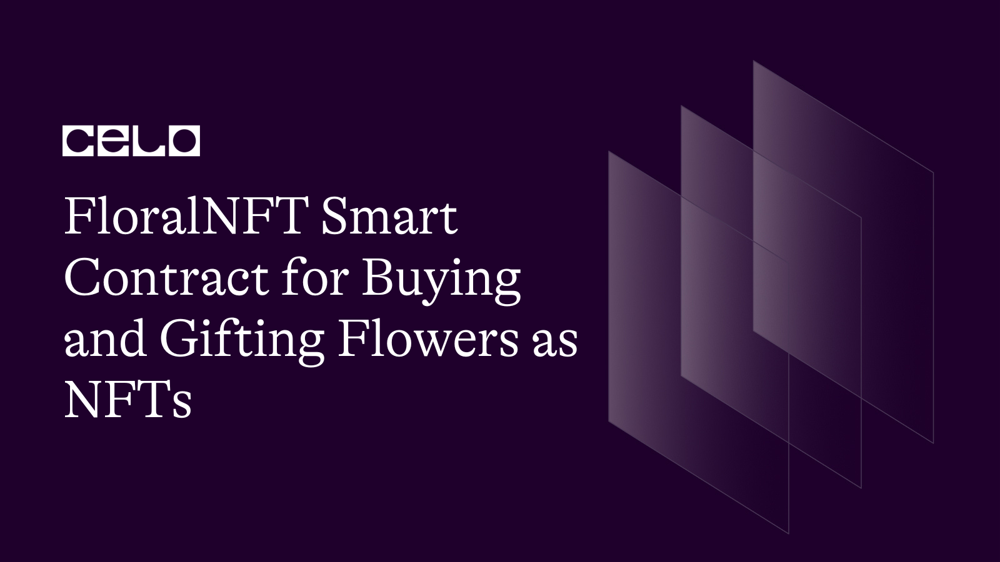

## INTRODUCTION

### What is Celo?

Celo is a decentralized platform that aims to make financial tools accessible to people everywhere, especially in emerging markets. It uses a blockchain to secure transactions and allow for fast, cheap, and secure transfers of its stablecoin, CELO, which is pegged to the value of a basket of national currencies to reduce volatility. The Celo network is maintained by a network of validators who run its blockchain software and are incentivized with CELO tokens. The platform also includes a suite of dApps to offer financial services such as remittances, loans, and payments.

## PREREQUISITE

To take this tutorial, you will need:

- A desktop computer with internet and a Chrome web browser.
- A basic understanding of blockchain technology and smart contracts.
- A desktop computer with internet and a Chrome web browser.

## REQUIREMENT

- A code or text editor. This tutorial uses the [Remix IDE](https://remix.ethereum.org/).
- An internet browser and stable internet connection.

## Tutorial Overview

In this tutorial, we would be building a smart contract for buying and selling flowers on the Celo blockchain. The contract contains a set of rules and conditions that must be met before the transaction can take place. The conditions include the price of the flowers and any other relevant terms. Once the conditions are met, the contract automatically executes the transaction, transferring ownership of the flowers and the payment between the buyer and the seller in a secure, transparent, and tamper-proof manner. This eliminates the need for intermediaries and ensures that the transaction is fair, efficient, and reliable.

Now let's begin writing our smart contract.

To get started, we will create a new file on Remix called `flower.sol`. Click on this link to learn how to create a new file on Remix [(here)](https://remix-ide.readthedocs.io/en/latest/file_explorer.html#:~:text=Creating%20new%20files,-There%20are%202&text=The%20first%20is%20to%20click,will%20open%20in%20the%20Editor.).

After creating a new file we start by declaring some statements in our smart contract.

```solidity
// SPDX-License-Identifier: MIT

pragma solidity >=0.7.0 <0.9.0;
```

The line `SPDX-License-Identifier: MIT` is an identifier for the license of the code, in this case, the `MIT License`. [The SPDX (Software Package Data Exchange)](https://spdx.dev/) identifier is a standardized way to identify open-source licenses.

The next line is the declaration of the version of the Solidity programming language used in the smart contract, specifically stating that the code is written in Solidity version 0.7.0 or later, but not later than 0.9.0.

Next, we add our ERC20 token interface.

```js
interface IERC20Token {
  function transfer(address, uint256) external returns (bool);
  function approve(address, uint256) external returns (bool);
  function transferFrom(address, address, uint256) external returns (bool);
  function totalSupply() external view returns (uint256);
  function balanceOf(address) external view returns (uint256);
  function allowance(address, address) external view returns (uint256);
  event Transfer(address indexed from, address indexed to, uint256 value);
  event Approval(address indexed owner, address indexed spender, uint256 value);
}
```

The **IERC20Token** is an interface in the Ethereum network that defines the standard set of functions that an ERC-20 token contract must implement. It specifies the following functions:

- transfer: This function allows the transfer of a specified amount of cUSD tokens from the caller's account to another address.
- approve: This function allows the caller to approve a specified address to transfer a specified amount of cUSD tokens from their account.
- transferFrom: This function allows us to transfer a specified amount of cUSD tokens from one address to another if the caller has previously approved the transfer.
- totalSupply: This function returns the total supply of tokens in the contract.
- balanceOf: This function returns the balance of cUSD tokens for a specified address.
- allowance: This function returns the amount of cUSD tokens that a specified spender is approved to transfer from a specified owner's account.
- Transfer: This is an event that is triggered whenever cUSD tokens are transferred from one address to another.
-
- Approval: This is an event that is triggered whenever a transfer of tokens is approved.

Next, we begin by naming our contract and also creating our struct.

A `struct` in Solidity is a user-defined complex data type that allows you to group multiple variables under a single name. It is used to define a custom type in the contract and can be used to store multiple values of different types under a single object. A struct can contain elements of different data types including other structs, arrays, and mappings. (Learn more about [structs](https://docs.soliditylang.org/en/v0.8.17/types.html#structs))

```solidity
contract FloralNft{
    struct Flower{
        address payable owner;
        string name;
        string description;
        string image;
        uint price;
        bool forSale;
    }
```

The first line is the name given to our smart contract called `FloraNft`.

The next line is the struct called `Flower` which holds information about a unique digital flower. The struct contains the following fields:

- `owner`: an address that stores the owner of the flower, denoted by the "address payable" data type, which allows payments to be made to that address.
- `name`: a string that stores the name of the flower.
- `description`: a string that stores a description of the flower.
- `image`: a string that stores the image of the flower.
- `price`: an unsigned integer (uint) that stores the price of the flower.
- `forSale`: a boolean value that indicates whether the flower is for sale or not.

Additionally, to interact with the cUSD token on the Celo Alfajores test network, it is necessary to include the address of the token.

```js
 address internal cUsdTokenAddress = 0x874069Fa1Eb16D44d622F2e0Ca25eeA172369bC1;
```

Next, we create our mapping. Click on this link to learn more about mappings [(Mapping)](https://medium.com/upstate-interactive/mappings-in-solidity-explained-in-under-two-minutes-ecba88aff96e).

```js
mapping (uint => Flower) internal flowers;
    uint internal flowersLength = 0;
```

The mapping, named `flowers`, maps a key of type `uint` to a value of type `Flower`. This data structure allows for a unique `uint` key to be associated with a specific "Flower" object, allowing for efficient look-up and retrieval of "Flower" values based on their associated keys.

A state variable named `flowersLength` is being declared in the next line as a data type of `uint`. This variable will store the number of flowers permanently in the contract and only accept unsigned integer values.

Furthermore, to make our smart contract more interesting we begin to add functions. The first function we will be adding is the `createFlower` function.

```js

    function createFlower(
        string memory _name,
        string memory _description,
        string memory _image,
        uint _price,
        bool _isSale
    )public{
        flowers[flowersLength] = Flower(
            payable(msg.sender),
            _name,
            _description,
            _image,
            _price,
            _isSale
        );
        flowersLength++;
    }
```

The `createFlower` function creates a new flower and stores it in a mapping named `flowers` where `flowersLength` keeps track of the number of flowers stored. The function takes 5 parameters:

1. `_name` - The name of the flower
2. `_description` - The description of the flower
3. `_image` - The URL or reference to the image of the flower
4. `_price` - The price of the flower
5. `_isSale` - A boolean indicating if the flower is on sale.

The `public` keyword ensures that the function can be accessed outside and inside of the smart contract.

Next, we have the `getFlower` function.

```js
  function getFlower(uint _index) public view returns(
        address payable,
        string memory,
        string memory,
        string memory,
        uint,
        bool
    ){
        Flower storage flower  = flowers[_index];
        return (
            flower.owner,
            flower.name,
            flower.description,
            flower.image,
            flower.price,
            flower.forSale
        );
    }
```

The `getFlower` function helps retrieves information about a flower stored in the `flowers` mapping based on its index. The function has only one parameter, the `_index` which is the index of the desired flower in the mapping. The function is marked with the view and public keywords, meaning that it can be called both externally and internally and does not modify the state of the contract. The function returns the `owner's address`, `name`, `description`, `image`, `price`, and `sale status` of the flower.

Next, we add a `buyFlower` function that will enable users to purchase flowers from the blockchain.

```js
    function buyFlower(uint _index)public payable{
        require(flowers[_index].forSale, "Flower is not for sale");
        require(
            IERC20Token(cUsdTokenAddress).transferFrom(
                msg.sender,
                flowers[_index].owner,
                flowers[_index].price
            ),
            "Transaction can not be performed"
        );
        flowers[_index].forSale = false;
        flowers[_index].owner = payable(msg.sender);
    }
```

The `buyFlower` function allows a user to purchase an existing flower. The input parameter `_index` determines which flower the user wants to buy. The function is marked as `payable` and `public` to allow external access to it.

The function first checks if the flower is for sale and then checks if the required amount has been successfully transferred from the buyer's account to the seller's account using the `transferFrom` function of the cUSD token. If the transfer fails, an error message "Transaction can not be performed" is thrown. If the transfer succeeds, the flower's `forSale` status is set to false and the ownership is transferred to the buyer.

Up next is the `setForsale` function.

```js
    function setForSale(uint _index)public{
        require(flowers[_index].owner == msg.sender, "Only the flower's owner can perform this action");
        flowers[_index].forSale = !flowers[_index].forSale;
    }
```

This function allows a user to toggle the `forSale` boolean value of a flower where `true` would mean that the flower is available for sale and `false` would mean it isn't available.

The function takes one parameter `_index` which is the index of the flower that needs to be changed.

Then, the function checks if the sender of the transaction is the flower's owner, and if true, it then updates the "forSale" property of the flower at that index to the opposite of its current value. For example, if the "forSale" property was "true", it would now become "false", and if it was "false", it would now become "true".

Next, we add the `giftFlower` function.

```js
    function giftFlower(uint _index, address _address)public{
        require(flowers[_index].owner == msg.sender, "Only the flower's owner can perform this action");
        flowers[_index].owner = payable(_address);
        flowers[_index].forSale = false;
    }
```

The `giftFlower` function allows a user to gift a flower they own to another user. The function takes two parameters:

1. `_index` - The index of the flower in the `flowers` mapping
2. `_address` - The user's address to gift the flower to

It then checks if the sender of the transaction is the `owner` of the flower, if true, it updates the `owner` of the flower to the `_address` and changes the `forSale` value to `false` as the new `owner` might not want to sell the flower.

Finally, we add the `getFlowersLegth` function that will help users know how many flowers are currently in our smart contract's state, without having to look through the entire `flowers` mapping. It provides a quick and easy way to retrieve this information.

```js
 function getFlowerLength() public view returns (uint) {
        return (flowersLength);
    }
```

This function does not take any parameters and returns a `uint` value representing the number of flowers created.

The complete code for this session is provided below.

```solidity
// SPDX-License-Identifier: MIT

pragma solidity >=0.7.0 <0.9.0;

// Token Interface
interface IERC20Token {
  function transfer(address, uint256) external returns (bool);
  function approve(address, uint256) external returns (bool);
  function transferFrom(address, address, uint256) external returns (bool);
  function totalSupply() external view returns (uint256);
  function balanceOf(address) external view returns (uint256);
  function allowance(address, address) external view returns (uint256);
  event Transfer(address indexed from, address indexed to, uint256 value);
  event Approval(address indexed owner, address indexed spender, uint256 value);
}

contract FloralNft{
    struct Flower{
        address payable owner;
        string name;
        string description;
        string image;
        uint price;
        bool forSale;
    }
    address internal ownerAddress = 0xb7BF999D966F287Cd6A1541045999aD5f538D3c6;
    address internal cUsdTokenAddress = 0x874069Fa1Eb16D44d622F2e0Ca25eeA172369bC1;
    mapping (uint => Flower) internal flowers;
    uint internal flowersLength = 0;

    function createFlower(
        string memory _name,
        string memory _description,
        string memory _image,
        uint _price,
        bool _isSale
    )public{
        flowers[flowersLength] = Flower(
            payable(msg.sender),
            _name,
            _description,
            _image,
            _price,
            _isSale
        );
        flowersLength++;
    }

    function getFlower(uint _index) public view returns(
        address payable,
        string memory,
        string memory,
        string memory,
        uint,
        bool
    ){
        Flower storage flower  = flowers[_index];
        return (
            flower.owner,
            flower.name,
            flower.description,
            flower.image,
            flower.price,
            flower.forSale
        );
    }

    function buyFlower(uint _index)public payable{
        require(flowers[_index].forSale, "Flower is not for sale");
        require(
            IERC20Token(cUsdTokenAddress).transferFrom(
                msg.sender,
                flowers[_index].owner,
                flowers[_index].price
            ),
            "Transaction can not be performed"
        );
        flowers[_index].forSale = false;
        flowers[_index].owner = payable(msg.sender);
    }

    function giftFlower(uint _index, address _address)public{
        require(flowers[_index].owner == msg.sender, "Only the flower's owner can perform this action");
        flowers[_index].owner = payable(_address);
        flowers[_index].forSale = false;
    }
    function setForSale(uint _index)public{
        require(flowers[_index].owner == msg.sender, "Only the flower's owner can perform this action");
        flowers[_index].forSale = !flowers[_index].forSale;
    }

    function getFlowerLength() public view returns (uint) {
        return (flowersLength);
    }
}
```

## CONTRACT DEPLOYMENT

To deploy the flower smart contract on the Celo blockchain, you would need the following:

CeloExtensionWallet: Download and install the Celo Extension Wallet from the Google Chrome store, create a wallet, and securely store your key phrase.

Celo Faucet: Fund your wallet by copying your wallet address and pasting it into the Celo Faucet, then confirm.

Celo Remix Plugin: Open Remix and create a new Solidity file, paste the FloraNft contract code into the file, and ensure the Solidity compiler is set to version 0.8.7 or later.

Compile the contract by clicking the "Compile FloralNft.sol" button in the Solidity Compiler tab in Remix.

In the "Deploy & Run Transactions" tab, select the Celo network from the dropdown menu, connect your wallet to Remix by clicking "Connect to wallet", and select "FloralNft" from the "Contract" dropdown menu.

Click the "Deploy" button, confirm the transaction in your wallet, and wait for the transaction to be confirmed on the Celo blockchain.

Once the transaction is confirmed, the FloralNft contract will be deployed on the Celo blockchain and you can interact with it using Remix.

## CONCLUSION

Congratulations on your accomplishment! You have done an excellent job of developing a smart contract for the sale of flowers on the Celo blockchain. Well done, and enjoy your success! 🎉

## NEXT STEPS

I trust that you found this tutorial informative and learned a lot from it. If you would like to continue your education, I have provided some helpful links below that you may find useful to explore:

The official Celo documentation: https://docs.celo.org/

Solidity By Example, a website with code examples for learning Solidity: https://solidity-by-example.org/

OpenZeppelin Contracts, a library of secure, tested smart contract code: https://www.openzeppelin.com/contracts/

Solidity documentation for version 0.8.17: https://docs.soliditylang.org/en/v0.8.17/

I hope these resources prove to be useful to you!

## About the author

I'm Ogoyi Thompson, a web3 developer residing in Nigeria, and I have a strong passion for working with blockchain technology.
