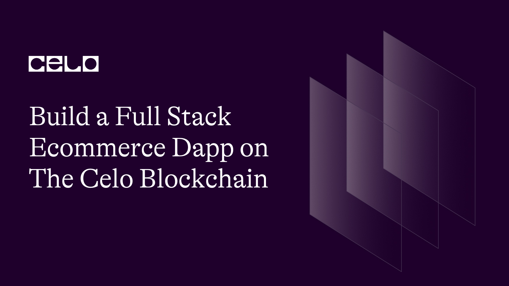

## Introduction

Welcome to this tutorial In this tutorial, we will go through each part of the code step by step and explain what each line does. By the end of this tutorial, you will have a better understanding of how to create a basic marketplace smart contract in Solidity.

The marketplace smart contract allows users to buy and sell products using a cUSD stablecoin. The contract defines an interface for the ERC-20 token and provides functions for reading and writing products, buying products, and getting the total number of products in the marketplace.

Here's a demo of what you'll be creating: [demo link](https://incredible-gaufre-9b74e2.netlify.app/)

## Prerequisites

To follow this tutorial, you will need the following:

- Basic knowledge of Solidity programming language.
- A Development Environment Like Remix.
- The celo Extension Wallet.
- Basic web developement with react.

## SmartContract

Let's begin writing our smart contract in Remix IDE

The completed code Should look like this.

```solidity
   // SPDX-License-Identifier: MIT
pragma solidity ^0.8.0;

interface IERC20Token {
    function transfer(address, uint256) external returns (bool);

    function approve(address, uint256) external returns (bool);

    function transferFrom(address, address, uint256) external returns (bool);

    function totalSupply() external view returns (uint256);

    function balanceOf(address) external view returns (uint256);

    function allowance(address, address) external view returns (uint256);

    event Transfer(address indexed from, address indexed to, uint256 value);
    event Approval(
        address indexed owner,
        address indexed spender,
        uint256 value
    );
}

contract Marketplace {
    uint internal productsLength = 0;
    address internal cUsdTokenAddress =
        0x874069Fa1Eb16D44d622F2e0Ca25eeA172369bC1;

    struct Product {
        address payable owner;
        string name;
        string image;
        string description;
        string location;
        uint price;
        uint sold;
    }

    mapping(uint => Product) internal products;

    function writeProduct(
        string memory _name,
        string memory _image,
        string memory _description,
        string memory _location,
        uint _price
    ) public {
        uint _sold = 0;
        products[productsLength] = Product(
            payable(msg.sender),
            _name,
            _image,
            _description,
            _location,
            _price,
            _sold
        );
        productsLength++;
    }

    function readProduct(
        uint _index
    )
        public
        view
        returns (
            address payable,
            string memory,
            string memory,
            string memory,
            string memory,
            uint,
            uint
        )
    {
        return (
            products[_index].owner,
            products[_index].name,
            products[_index].image,
            products[_index].description,
            products[_index].location,
            products[_index].price,
            products[_index].sold
        );
    }

    function buyProduct(uint _index) public payable {
        require(
            IERC20Token(cUsdTokenAddress).transferFrom(
                msg.sender,
                products[_index].owner,
                products[_index].price
            ),
            "Transfer failed."
        );
        products[_index].sold++;
    }

    function getProductsLength() public view returns (uint) {
        return (productsLength);
    }
}
```

### Breakdown

```solidity
// SPDX-License-Identifier: MIT
   pragma solidity >=0.7.0 <0.9.0;
```

First, we declared our license and the solidity version.

```solidity
interface IERC20Token {
    function transfer(address, uint256) external returns (bool);

    function approve(address, uint256) external returns (bool);

    function transferFrom(address, address, uint256) external returns (bool);

    function totalSupply() external view returns (uint256);

    function balanceOf(address) external view returns (uint256);

    function allowance(address, address) external view returns (uint256);

    event Transfer(address indexed from, address indexed to, uint256 value);
    event Approval(
        address indexed owner,
        address indexed spender,
        uint256 value
    );
}
```

We define an interface for the `ERC-20` token. The interface lists the functions and events that the ERC-20 token should implement. The ERC-20 token we will be using is the cUSD.

### Defining the Freelancer struct:

```solidity
 contract Marketplace {
    uint internal productsLength = 0;
    address internal cUsdTokenAddress =
        0x874069Fa1Eb16D44d622F2e0Ca25eeA172369bC1;

    struct Product {
        address payable owner;
        string name;
        string image;
        string description;
        string location;
        uint price;
        uint sold;
    }

    mapping(uint => Product) internal products;
 }
```

In This code, we define the `Marketplace` contract. The contract contains a state variable `productsLength`, which keeps track of the total number of products in the marketplace. The contract also contains an internal address variable `cUsdTokenAddress`, which stores the address of the cUSD token.

We also define a `Product` struct that contains information about a product, such as the owner, name, image, description, location, price, and the number of units sold. The contract also defines a mapping products that maps a product ID to its corresponding `Product` struct.

```solidity
    function writeProduct(
        string memory _name,
        string memory _image,
        string memory _description,
        string memory _location,
        uint _price
    ) public {
        uint _sold = 0;
        products[productsLength] = Product(
            payable(msg.sender),
            _name,
            _image,
            _description,
            _location,
            _price,
            _sold
        );
        productsLength++;
    }

```

We then add a function that allow users to add a new product to the marketplace. The function takes in the product `_name`, product `image`, product `_description`, product `_location`, and product `_price` as input parameters.

The function creates a new `Product` struct with the given inputs and initializes the sold variable to 0. The function then adds the new product to the `products` mapping with the `productsLength` as the key and increments the `productsLength` variable by 1.

```solidity
    function readProduct(
        uint _index
    )
        public
        view
        returns (
            address payable,
            string memory,
            string memory,
            string memory,
            string memory,
            uint,
            uint
        )
    {
        return (
            products[_index].owner,
            products[_index].name,
            products[_index].image,
            products[_index].description,
            products[_index].location,
            products[_index].price,
            products[_index].sold
        );
    }

```

This function allows anyone to read the details of a product from the marketplace. The function takes in a product ID (`_index`) as an input parameter and returns the details of the corresponding product.

```solidity
function buyProduct(uint _index) public payable {
        require(
            IERC20Token(cUsdTokenAddress).transferFrom(
                msg.sender,
                products[_index].owner,
                products[_index].price
            ),
            "Transfer failed."
        );
        products[_index].sold++;
    }
```

This function allows anyone to buy a product from the marketplace. The function takes in a product ID (`_index`) as an input parameter and transfers the specified amount of cUSD tokens from the buyer to the seller. The function also increments the sold` variable of the corresponding product.

```solidity
    function getProductsLength() public view returns (uint) {
        return (productsLength);
    }

```

This function allows anyone to get the total number of `products` in the marketplace.

## Deployment

To deploy our smart contract successfully, we need the celo extention wallet which can be downloaded from [here](https://chrome.google.com/webstore/detail/celoextensionwallet/kkilomkmpmkbdnfelcpgckmpcaemjcdh?hl=en)

Next, we need to fund our newly created wallet which can done using the celo alfojares faucet [Here](https://celo.org/developers/faucet)

You can now fund your wallet and deploy your contract using the celo plugin in remix.

## Front-end

Click on [this](https://github.com/4undRaiser/celo-ecommerce-dapp) repo from your github.

- Clone the repo to your computer.
- open the project from from vscode.
- Run `npm install` command to install all the dependencies required to run the app locally.

### App.js

The completed code Should look like this.

```javascript
import "./App.css";
import Home from "./components/home";
import { Products } from "./components/Products";
import { useState, useEffect, useCallback } from "react";
import Web3 from "web3";
import { newKitFromWeb3 } from "@celo/contractkit";
import marketplace from "./contracts/marketplace.abi.json";
import IERC from "./contracts/IERC.abi.json";
import BigNumber from "bignumber.js";

const ERC20_DECIMALS = 18;
const contractAddress = "0x86B54C4b5c8a6f2e65bd3A5c3157990B5cD1e18c";
const cUSDContractAddress = "0x874069Fa1Eb16D44d622F2e0Ca25eeA172369bC1";

function App() {
  const [contract, setcontract] = useState(null);
  const [address, setAddress] = useState(null);
  const [kit, setKit] = useState(null);
  const [cUSDBalance, setcUSDBalance] = useState(0);
  const [products, setProducts] = useState([]);

  const connectToWallet = async () => {
    if (window.celo) {
      try {
        await window.celo.enable();
        const web3 = new Web3(window.celo);
        let kit = newKitFromWeb3(web3);

        const accounts = await kit.web3.eth.getAccounts();
        const user_address = accounts[0];
        kit.defaultAccount = user_address;

        await setAddress(user_address);
        await setKit(kit);
      } catch (error) {
        console.log(error);
      }
    } else {
      alert("Error Occurred");
    }
  };

  const getBalance = useCallback(async () => {
    try {
      const balance = await kit.getTotalBalance(address);
      const USDBalance = balance.cUSD.shiftedBy(-ERC20_DECIMALS).toFixed(2);

      const contract = new kit.web3.eth.Contract(marketplace, contractAddress);
      setcontract(contract);
      setcUSDBalance(USDBalance);
    } catch (error) {
      console.log(error);
    }
  }, [address, kit]);

  const getProducts = useCallback(async () => {
    const productsLength = await contract.methods.getProductsLength().call();
    const products = [];
    for (let index = 0; index < productsLength; index++) {
      let _products = new Promise(async (resolve, reject) => {
        let product = await contract.methods.readProduct(index).call();

        resolve({
          index: index,
          owner: product[0],
          name: product[1],
          image: product[2],
          description: product[3],
          location: product[4],
          price: product[5],
          sold: product[6],
        });
      });
      products.push(_products);
    }

    const _products = await Promise.all(products);
    setProducts(_products);
  }, [contract]);

  const addProduct = async (
    _name,
    _image,
    _description,
    _location,
    _price,
    _sold
  ) => {
    let price = new BigNumber(_price).shiftedBy(ERC20_DECIMALS).toString();
    try {
      await contract.methods
        .writeProduct(_name, _image, _description, _location, price)
        .send({ from: address });
      getProducts();
    } catch (error) {
      alert(error);
    }
  };

  const buyProduct = async (_index) => {
    try {
      const cUSDContract = new kit.web3.eth.Contract(IERC, cUSDContractAddress);
      await cUSDContract.methods
        .approve(contractAddress, products[_index].price)
        .send({ from: address });
      await contract.methods.buyProduct(_index).send({ from: address });
      getProducts();
      getBalance();
      alert("you have successfully bought this product");
    } catch (error) {
      alert(error);
    }
  };

  useEffect(() => {
    connectToWallet();
  }, []);

  useEffect(() => {
    if (kit && address) {
      getBalance();
    }
  }, [kit, address, getBalance]);

  useEffect(() => {
    if (contract) {
      getProducts();
    }
  }, [contract, getProducts]);

  return (
    <div className="App">
      <Home cUSDBalance={cUSDBalance} addProduct={addProduct} />
      <Products
        products={products}
        buyProduct={buyProduct}
        walletAddress={address}
      />
    </div>
  );
}

export default App;
```

### Breakdown\_\_

Let's breakdown our code and see how each component works.

**Importing required components, libraries, and ABI files**

```javascript
import "./App.css";
import Home from "./components/home";
import { Products } from "./components/Products";
import { useState, useEffect, useCallback } from "react";
import Web3 from "web3";
import { newKitFromWeb3 } from "@celo/contractkit";
import marketplace from "./contracts/marketplace.abi.json";
import IERC from "./contracts/IERC.abi.json";
import BigNumber from "bignumber.js";
```

The App component imports necessary components `Home`, `Products`, libraries `web3`, `ContractKit`, `BigNumber`, and contract ABI files `marketplace.abi`. `json`, `IERC.abi.json`.

**Defining constant values**

```javascript
const ERC20_DECIMALS = 18;
const contractAddress = "0x86B54C4b5c8a6f2e65bd3A5c3157990B5cD1e18c";
const cUSDContractAddress = "0x874069Fa1Eb16D44d622F2e0Ca25eeA172369bC1";
```

The component defines constant values such as the ERC20 token decimal places (18), contract address, and cUSD contract address.

**Initializing state variables**

```javascript
const [contract, setcontract] = useState(null);
const [address, setAddress] = useState(null);
const [kit, setKit] = useState(null);
const [cUSDBalance, setcUSDBalance] = useState(0);
const [products, setProducts] = useState([]);
```

State variables such as contract, `address`, `kit`, `cUSDBalance`, and `products` are initialized using the `useState()` React hook.

**connectToWallet() function**

```javascript
const connectToWallet = async () => {
  if (window.celo) {
    try {
      await window.celo.enable();
      const web3 = new Web3(window.celo);
      let kit = newKitFromWeb3(web3);

      const accounts = await kit.web3.eth.getAccounts();
      const user_address = accounts[0];
      kit.defaultAccount = user_address;

      await setAddress(user_address);
      await setKit(kit);
    } catch (error) {
      console.log(error);
    }
  } else {
    alert("Error Occurred");
  }
};
```

This function checks if the Celo extension wallet (window.celo) is available in the user's browser. If it is, it prompts the user to connect their wallet, creates a new instance of `Web3` using the Celo provider, initializes the `ContractKit` instance, sets the default account, and updates the state variables.

**getBalance() function**

```javascript
const getBalance = useCallback(async () => {
  try {
    const balance = await kit.getTotalBalance(address);
    const USDBalance = balance.cUSD.shiftedBy(-ERC20_DECIMALS).toFixed(2);

    const contract = new kit.web3.eth.Contract(marketplace, contractAddress);
    setcontract(contract);
    setcUSDBalance(USDBalance);
  } catch (error) {
    console.log(error);
  }
}, [address, kit]);
```

This function retrieves the user's cUSD balance using the `ContractKit` SDK and updates the `cUSDBalance` state variable.

**getProducts() function**

```javascript
const getProducts = useCallback(async () => {
  const productsLength = await contract.methods.getProductsLength().call();
  const products = [];
  for (let index = 0; index < productsLength; index++) {
    let _products = new Promise(async (resolve, reject) => {
      let product = await contract.methods.readProduct(index).call();

      resolve({
        index: index,
        owner: product[0],
        name: product[1],
        image: product[2],
        description: product[3],
        location: product[4],
        price: product[5],
        sold: product[6],
      });
    });
    products.push(_products);
  }

  const _products = await Promise.all(products);
  setProducts(_products);
}, [contract]);
```

This function fetches the list of available products from the marketplace smart contract, loops through each product, and populates the `products` state variable.

**addProduct() function**

```javascript
const addProduct = async (
  _name,
  _image,
  _description,
  _location,
  _price,
  _sold
) => {
  let price = new BigNumber(_price).shiftedBy(ERC20_DECIMALS).toString();
  try {
    await contract.methods
      .writeProduct(_name, _image, _description, _location, price)
      .send({ from: address });
    getProducts();
  } catch (error) {
    alert(error);
  }
};
```

This function takes product details as arguments, formats the price using `BigNumber`, and sends a transaction to the smart contract to create a new product. It then updates the list of products using the `getProducts()` function.

**buyProduct() function**

```javascript
const buyProduct = async (_index) => {
  try {
    const cUSDContract = new kit.web3.eth.Contract(IERC, cUSDContractAddress);
    await cUSDContract.methods
      .approve(contractAddress, products[_index].price)
      .send({ from: address });
    await contract.methods.buyProduct(_index).send({ from: address });
    getProducts();
    getBalance();
    alert("you have successfully bought this product");
  } catch (error) {
    alert(error);
  }
};
```

This function takes a product `index` as an argument, approves the transaction using the cUSD contract, sends a transaction to the smart contract to buy the product, updates the list of `products` using the `getProducts()` function, and refreshes the user's balance using the `getBalance()` function.

**useEffect() hooks**

```javascript
useEffect(() => {
  connectToWallet();
}, []);

useEffect(() => {
  if (kit && address) {
    getBalance();
  }
}, [kit, address, getBalance]);

useEffect(() => {
  if (contract) {
    getProducts();
  }
}, [contract, getProducts]);
```

There are three `useEffect()` hooks:

- The first one runs on component mount and calls the `connectToWallet()` function.
- The second one is triggered whenever the kit or address state variables change and calls the `getBalance()` function.
- The third one is triggered when the contract state variable changes and calls the `getProducts()` function.

**Rendering components**

```javascript
return (
  <div className="App">
    <Home cUSDBalance={cUSDBalance} addProduct={addProduct} />
    <Products
      products={products}
      buyProduct={buyProduct}
      walletAddress={address}
    />
  </div>
);
```

The App component renders the `Home` and `Products` components, passing the required state variables and functions as props.

### Home.js

Navigate into the components folder to access the `Home` component.

```javascript
import React, { useState } from "react";

import {
  Button,
  Modal,
  Form,
  FloatingLabel,
  Nav,
  Badge,
  Container,
  Navbar,
} from "react-bootstrap";

const Home = (props) => {
  const [name, setname] = useState("");
  const [image, setImage] = useState("");
  const [description, setDescription] = useState("");
  const [location, setLocation] = useState("");
  const [price, setPrice] = useState(0);

  const isFormFilled = () => name && image && description && location && price;

  const [show, setShow] = useState(false);

  const handleClose = () => setShow(false);
  const handleShow = () => setShow(true);

  return (
    <>
      <Navbar bg="light">
        <Container>
          <Navbar.Brand href="#home">Celo-Ecommerce-marketplace</Navbar.Brand>
          <Navbar.Toggle />
          <Nav className="me-auto">
            <Badge bg="secondary" className="ms-auto">
              Balance {props.cUSDBalance}cUSD
            </Badge>
          </Nav>
          <Navbar.Collapse className="justify-content-end">
            <Button onClick={handleShow} variant="dark">
              <h5> Add new product </h5>
            </Button>
          </Navbar.Collapse>
        </Container>
      </Navbar>

      <Modal show={show} onHide={handleClose} centered>
        <Modal.Header closeButton>
          <Modal.Title>New Product</Modal.Title>
        </Modal.Header>
        <Form>
          <Modal.Body>
            <FloatingLabel
              controlId="inputName"
              label="Product Name"
              className="mb-3"
            >
              <Form.Control
                type="text"
                onChange={(e) => {
                  setname(e.target.value);
                }}
                placeholder="name"
              />
            </FloatingLabel>

            <FloatingLabel
              controlId="inputImage"
              label="Image"
              className="mb-3"
            >
              <Form.Control
                type="text"
                onChange={(e) => {
                  setImage(e.target.value);
                }}
                placeholder="Image"
              />
            </FloatingLabel>

            <FloatingLabel
              controlId="inputDescription"
              label="Description"
              className="mb-3"
            >
              <Form.Control
                as="textarea"
                placeholder="description"
                style={{ height: "80px" }}
                onChange={(e) => {
                  setDescription(e.target.value);
                }}
              />
            </FloatingLabel>

            <FloatingLabel
              controlId="inputLocation"
              label="location"
              className="mb-3"
            >
              <Form.Control
                type="text"
                onChange={(e) => {
                  setLocation(e.target.value);
                }}
                placeholder="location"
              />
            </FloatingLabel>

            <FloatingLabel
              controlId="inputPrice"
              label="price"
              className="mb-3"
            >
              <Form.Control
                type="number"
                onChange={(e) => {
                  setPrice(e.target.value);
                }}
                placeholder="price"
              />
            </FloatingLabel>
          </Modal.Body>
        </Form>
        <Modal.Footer>
          <Button variant="outline-secondary" onClick={handleClose}>
            Close
          </Button>
          <Button
            variant="dark"
            disabled={!isFormFilled()}
            onClick={() => {
              props.addProduct(name, image, description, location, price);
              handleClose();
            }}
          >
            Add Product
          </Button>
        </Modal.Footer>
      </Modal>
    </>
  );
};

export default Home;
```

The `Home` components allow It allows users to view their balance and add new `products`. The component uses `React-Bootstrap` for styling and handling user input.

State variables are initialized to manage form data and modal visibility. Event handlers are defined for opening and closing the modal and updating the state when the user inputs data.

The component also renders a navbar with a balance badge and a button to open the modal for adding new products. The modal contains a form with input fields for product details and a submit button. When the submit button is clicked, it calls the `addProduct` function passed via `props` and closes the modal.

### Products.js

Also Navigate into the components folder to access the `Products` component.

```javascript
import React from "react";
import { Card, Badge, Col, Stack, Row } from "react-bootstrap";

export const Products = (props) => {
  return (
    <Row xs={1} md={3} className="g-4">
      {props.products.map((product) => (
        <Col key={product.index}>
          <Card className="h-100">
            <Card.Header>
              <Stack direction="horizontal" gap={2}>
                <Badge bg="secondary" className="ms-auto">
                  {product.index} ID
                </Badge>

                <Badge bg="secondary" className="ms-auto">
                  {product.price / 1000000000000000000}cUSD
                </Badge>

                <Badge bg="secondary" className="ms-auto">
                  {product.sold} Sold
                </Badge>
              </Stack>
            </Card.Header>

            <div className=" ratio ratio-4x3">
              
            </div>

            <Card.Body className="d-flex  flex-column text-center">
              <Card.Title className="flex-grow-1">{product.name}</Card.Title>

              <Card.Text className="flex-grow-1">
                {product.description}
              </Card.Text>
              {props.walletAddress !== product.owner && (
                <button
                  type="button"
                  onClick={() => props.buyProduct(product.index)}
                  class="btn btn-dark mt-1"
                >
                  Buy
                </button>
              )}
            </Card.Body>
          </Card>
        </Col>
      ))}
    </Row>
  );
};
```

The `Products` component is a React functional component that takes two props: `products`, an array of product objects, and `walletAddress`, a string representing the current user's wallet address. It utilizes React-Bootstrap components to create a responsive grid layout to display the product details in a card format.

The component maps through the `products` array and creates a `Card` component for each product. Inside each card, product details such as ID, price, sold count, image, name, and description are displayed using various React-Bootstrap components like `Badge`, `Stack`, `Card.Title`, and `Card.Text`.

A "Buy" button is conditionally rendered for each product if the current user's `walletAddress` is not the same as the product owner's address. When the "Buy" button is clicked, it calls the `props.buyProduct` function with the product index as an argument.

Thats all for the tutorial. We have successfully built an ecommerce marketplace on the celo blockchain.

## Next Steps

I hope you learned a lot from this tutorial. Here are some relevant links that would aid your learning further.

- [Celo Docs](https://docs.celo.org/)
- [Solidity Docs](https://docs.soliditylang.org/en/v0.8.17/)

## About the author

I'm Jonathan Iheme, A full stack block-chain Developer from Nigeria.

Thank You!!
