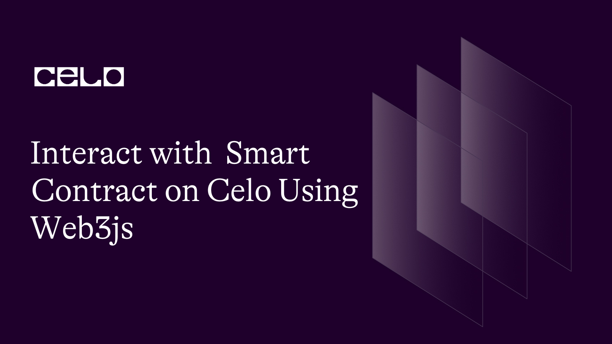
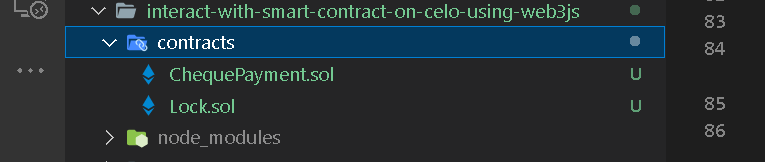
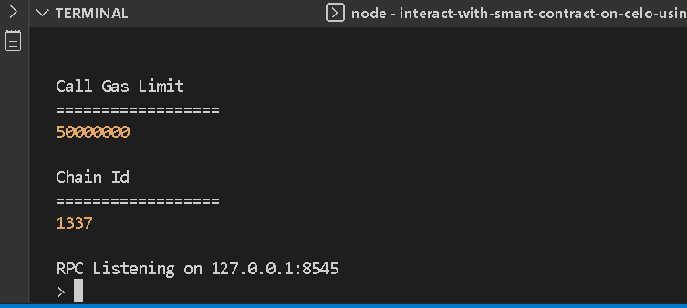

## Introduction

Interacting with the Ethereum protocol has been made easy with the advent of frameworks and libraries such as Web3.js. The Celo blockchain is EVM-compatible hence almost all the tools and libraries available for interacting with the EVM can be employed. As a Celo developer, understanding how to develop DApps using Web3.js will undoubtedly improve your experience in the field.

## Prerequisites​

This tutorial is designed to help Celo developers understand the backbone behind blockchain interactions using Web3js. Readers are expected to have previous experience and skills in the following areas:

- Smart contract development using Solidity.
- Good knowledge working with Typescript and Javascript.
- Using hardhat for smart contract development. Refer to **[this tutorial](https://docs.celo.org/blog/tutorials/getting-started-on-celo-with-hardhat)** to get started.

## Requirements​

- You should install an editor/IDE. I recommend VSCode since it is what I used in this tutorial.
- Install NodeJs version >=14.0.0.

**What is Web3Js?**

Web3Js is a collection of libraries or API references for interacting with Ethereum nodes using IPC, HTTP, or WebSocket. Since Celo is an EVM-compatible blockchain, almost every development tool, library, and framework in the Ethereum ecosystem work with Celo. More than a library, Web3js is a framework that consists of libraries listed as follows, each dealing with a specific aspect :

- Web3 : The umbrella class for the web3.js package. It is a class object through which you can access or construct the Ethereum-related modules, versions, utils, providers, and givenProvider.

- web3.eth: This is used for interacting with the Ethereum blockchain including smart contracts.

- web3.bzz: This module is meant to be used for interacting with decentralized file storage, targeted specifically at the swarm protocol.

- web3.utils is loaded with helper functions and utilities for dealing with numbers, conversions, and addresses.

- web3.shh is for whisper protocol - a decentralized communication protocol that allows connected nodes to communicate with each other. It also enables broadcasting, p2p, and user-encrypted messages.

Since we are concerned with interacting with smart contracts on Celo, we will focus on modules that are relevant to the topic in the discussion which is `web3.eth` and `web3.utils`.

**Setting up development environment**

I am a fan of using Hardhat but you should not be limited to it. If you can work with others tools, go ahead to complete the setup before continuing with this tutorial otherwise follow these steps.

- Let's create a project folder and call it "interact-with-smart-contract-on-celo-using-web3js". Then navigate into it.

```bash
mkdir interact-with-smart-contract-on-celo-using-web3js
cd interact-with-smart-contract-on-celo-using-web3js
```

- Create a hardhat project

```bash Yarn
yarn add hardhat
```

```bash npm
npm install hardhat
```

Install the `openzeppelin` library.

```bash yarn
yarn add '@openzeppelin/contracts'
```

```bash npm
npm install '@openzeppelin/contracts'
```

Now, hardhat is installed in your project.

- Invoke it to set up a simple Typescript project

```bash
npx hardhat
```

Choose the `typescript` option, and install the required dependencies provided in the terminal.

- Proceed into the `contracts` folder from the current project directory, and create a new solidity file. Name it `ChequePayment.sol`.

```bash
cd contracts
```

Now, you should have two files under the contracts folder.

- interact-with-smart-contract-on-celo-using-web3js
  - contracts
    - ChequePayment.sol
    - Lock.sol



Open the `ChequePayment.sol` file and paste the following code

```js
  // SPDX-License-Identifier: MIT
  pragma solidity 0.8.18;

  import "@openzeppelin/contracts/access/Ownable.sol";
  import "@openzeppelin/contracts/utils/math/SafeMath.sol";
  import "@openzeppelin/contracts/utils/Address.sol";

  contract ChequePayment is Ownable {
    using SafeMath for uint256;

    error InsufficientBalance(uint actualBalance, uint intendedCheque);
    error InsufficientCreditToPayCheque(uint balance, uint actualValue);
    error ChequeExpired(uint validTill, uint currentTimestamp);
    error InsufficientValueToCoverCheque(uint incomingValue);
    error ValueExceedReducer(uint value, uint reducer);
    error PeriodOutOfBound(uint);
    error CancellationGraceElapsed();
    error NoChequeForCaller(address);
    error PayeeIsZeroAddress(address);

    event ChequeDrawn (address indexed payee, uint value);
    event ChequeWithdrawn (uint dateWithdrawn, address beneficiary, uint amount);

    uint private nonce;
    uint public openCheques;
    uint public immutable trGas;

    struct ChequeInfo {
      uint dateDrawn;
      uint validTill;
      uint value;
    }

    mapping (address => ChequeInfo) public payees;

    constructor() {
      trGas = 22000 * 21;
    }

    receive() payable external {}

    /**@dev Draws a new cheque in favor of beneficiary - payee
     * @param validityWindowInHrs - Period within which cheque is valid
     *
     */
    function drawCheque(address payee, uint amount, uint8 validityWindowInHrs) public payable onlyOwner {
      _safeGuardCheques(amount, msg.value);
      if(validityWindowInHrs >= type(uint8).max) revert PeriodOutOfBound(validityWindowInHrs);
      if(payee == address(0)) revert PayeeIsZeroAddress(payee);
      uint vwIh = _now().add(validityWindowInHrs * 1 hours);
      payees[payee] = ChequeInfo(
        _now(),
        vwIh,
        amount
      );

      emit ChequeDrawn(payee, amount);
    }

    function cancelDrawnCheque(address payee) public onlyOwner {
      ChequeInfo memory cInfo = payees[payee];
      if(_now() >= cInfo.dateDrawn.add(6 hours)) revert CancellationGraceElapsed();
      if(openCheques >= cInfo.value) openCheques = openCheques.sub(cInfo.value);
      payees[payee] = ChequeInfo(0, 0, 0);
    }

    function reduceChequeValue(address payee, uint reducer) public onlyOwner {
      openCheques = openCheques.sub(reducer);
      ChequeInfo memory ci = payees[payee];
      if(ci.value < reducer) revert ValueExceedReducer(ci.value, reducer);
      unchecked {
        payees[payee].value = ci.value - reducer;
      }
    }

    function _safeGuardCheques (uint amount, uint incomingValue) internal {
      uint balance = address(this).balance;
      uint _supposetotalCheques = openCheques.add(amount).add(trGas);
      if(_supposetotalCheques > balance) {
        if(incomingValue < _supposetotalCheques.sub(balance)) revert InsufficientValueToCoverCheque(incomingValue);
      }
      unchecked {
        openCheques += amount;
      }
    }

    function increaseChequeValue(address payee, uint amount) public payable onlyOwner {
      _safeGuardCheques(amount, msg.value);
      ChequeInfo memory ci = payees[payee];
      require(ci.value > 0, "Payee not found");
      payees[payee].value = ci.value + amount;
    }

    function cashout() public {
      ChequeInfo memory cInfo = payees[_msgSender()];
      if(cInfo.value == 0) revert NoChequeForCaller(_msgSender());
      if(_now() > cInfo.validTill) revert ChequeExpired(cInfo.validTill, _now());
      payees[_msgSender()] = ChequeInfo(0, 0, 0);
      uint balance = address(this).balance;
      uint transferAmt = cInfo.value;
      if(balance < cInfo.value.add(trGas)) revert InsufficientCreditToPayCheque(balance, cInfo.value.add(trGas));
      require(openCheques >= transferAmt, "Cheque anomally");
      openCheques = openCheques.sub(transferAmt);
      Address.sendValue(payable(_msgSender()), cInfo.value);
    }

    function _now() internal view returns(uint) {
      return block.timestamp;
    }
  }

```

**What the code does**

The above solidity code is a simple cheque payment that enables the owner - _drawer_ to issue a cheque in favor of another party - _payee_. The party on whom the cheque is drawn is the smart contract acting as the bank called the _drawee_. The cheque can be valid over a stipulated period of time specified by the drawer at the time the cheque was drawn. If the time elapsed, the payee will be denied to the withdrawal of the cheque.

In the contract, the owner can perform the following functions except for `cashout`:

- `drawCheque`: This is an only-owner payable function that accepts three arguments:

1. _payee_ : address of the beneficiary.
2. _amount_: Value of the cheque.
3. _validityWindowInHrs_: Period through which the cheque remains valid.

In the `drawCheque` function, we called the `_safeGuardCheques` function which ensures the Celo balance in the contract always corresponds to open cheques. That way the drawer cannot issue a bounced cheque - a situation where the payee wants to cash out but the balance in the contract cannot cover the cheque value.

- `cancelDrawnCheque`
  An 'only owner' function that accepts the address of the payee as an argument. The successful invocation cancels all cheques drawn in favor of the `payee`.

- `increaseChequeValue`
  The account owner may wish to increase the cheque value for any valid addresses. The 'increaseChequeValue()' adds up to the value on the cheque for the target address. This is different from the `drawCheque()` that overrides the value in storage rather than increments it.

- `reduceChequeValue` performs a similar function as its counterpart - `increaseChequeValue` except that it reduces the value instead.

- `cashout`
  This function is callable by anyone for whom a cheque was drawn.

**Compile**
Compile the contract by running the following command.

```bash
npx hardhat compile
```

If you follow the steps accordingly, the contract should compile successfully.

**Deploy, Interact with the contract**

To interact with the contract, firstly, we will need to deploy it either locally or to the Celo test network. However, we will try to use both methods and deploy it programmatically using the `web3.eth` module.

To use `web3.js`, we have to include it in the `node_modules` folder. Install it using any of the below package managers.

```bash yarn
yarn add -dev @nomiclabs/hardhat-web3 web3
```

```bash npm
npm install --save-dev @nomiclabs/hardhat-web3 web3
```

To deploy locally, we need to run a copy of the blockchain node locally. Besides the inbuilt node, hardhat allows us to run a copy of an external blockchain instance against it. For this tutorial, we need to install `Ganache` either globally or locally and set its running port and URI to connect to the hardhat environment.

> Note: For security reasons, it is advisable to install Ganache using the Node Package Manager - **NPM**.

```bash npm
npm install --global ganache
```

To confirm if Ganache is successfully installed, open the terminal and run the following command.

```bash
ganache
```

or

```bash
npx ganache
```

An instance of Ganache will start to run locally on port 8545. We are not ready to use ganache for now. You can keep it running or kill the process by typing `ctrl c` in the terminal.



Now that we have all the dependencies installed, we'll write a script for the purpose of deploying and interacting with the contract. Firstly, create a `.ts` file that exports an object containing the utilities we need for the program. This is to reduce the amount of code we'll keep in the main script.

Inside the `script` folder, make a new file.

```bash
touch accountsUtils.ts
```

- Import the `web3` package.

```ts accountsUtils.ts
import Web3 from "web3";
```

Let's declare a few constant variables.

- export types and interfaces for Typescript compatibility

```ts accountsUtils.ts
export type CNumber = string | number | import("bn.js");
export type SignedTransaction = import("web3-eth-accounts").SignedTransaction;

export interface TrxProps {
  data?: string;
  to?: string;
  privateKey?: string;
  gas?: string | number;
  gasPrice?: CNumber;
  value?: CNumber;
  functionName: string;
}
```

- Declare and set the validity window variable to 1. You can use any number not greater than 255. For testing purposes, it makes sense to set it to a lower boundary. This is the period during which cheques are valid.

```ts accountsUtils.ts
const VALIDITY_WINDOW_IN_HRS = 1;
```

- Set the gas and gas price

```ts accountsUtils.ts
const GAS = 1500000;
const GASPRICE = 3000000000;
```

- With toggling a variable, we want to be able to switch between a local node and Celo's Alfajores.

```ts accountsUtils.ts
export const mode: boolean = true;
```

- Let's create a web3 instance using the `Web3` class wrapper. It expects a provider object. Since we are not using external or given providers such as Metamask or Valora, we need a way to pay for transactions for making changes to the blockchain. An answer to it is creating a wallet or provider.

To create a provider, we'll use the `Web3` class to invoke either the `HttpProvider` or `WebsocketProvider` to construct a provider object. Either of the constructors expect a URI. For the `HttpsProvider`, we'll supply the URI on which ganache runs, while we give Celo's testnet websocket URI to the `WebsocketProvider` constructor. The previous boolean variable - `mode` let us switch between the nodes.

```ts accountsUtils.ts
const LOCAL_HTTPPROVIDER_URL = new Web3.providers.HttpProvider(
  "http://127.0.0.1:8545"
);

const SOCKET_URL = "wss://alfajores-forno.celo-testnet.org/ws";

const WEB_SOCKETPROVIDER = new Web3.providers.WebsocketProvider(SOCKET_URL);

const web3 = new Web3(mode ? LOCAL_HTTPPROVIDER_URL : WEB_SOCKETPROVIDER);
```

- Declare an `accounts` variable using the `let` keyword with the initial value set to the value generated from `web3.eth.accounts.privateKeyToAccount`. It generates an account from a private key. We'll use this type of account to interact with the smart contract while connected to the live network i.e Alfajores. You should have an account already created for this purpose funded with testnet Celo. Give the private key to the `privateKeyToAccount` function to generate an account.

> Warning: It is unsafe to store private keys the way we did. This is for tutorial purposes only. You'd want to use a more secure and subtle way of handling private keys.

```ts accountsUtils.ts
let accounts = [
  web3.eth.accounts.privateKeyToAccount(
    "ba28d5cea192f121................................................"
  ), //payee
  web3.eth.accounts.privateKeyToAccount(
    "8c0dc6d793391e9c................................................"
  ), // owner
];
```

- If the mode is local, we use `web3.eth.accounts`. This will auto-connect to the local node i.e ganache, and the ganache's accounts are available for us to use otherwise, we'll use the HDWallet or account generated from the explicitly supplied private keys.

```ts accountsUtils.ts
if (mode) {
  const newAccounts = web3.eth.accounts;
  for (let i = 0; i < 2; i++) {
    const alc = newAccounts.create("null");
    accounts[i] = alc;
    console.log(`New Account ${alc.address} with index ${i} created `);
  }
}
```

- We can now assign accounts based on the connected mode.

```ts accountsUtils.ts
const PAYEE = accounts[0];
const OWNER = accounts[1];
```

- Let's create a function that scrutinizes the balances to ensure the accounts are working as expected. If `mode` is local, we generate new accounts using web3 account utils. These accounts have no coin in them. We may need to test Celo to pay for the gas fee, it's smart if we could use ganache as a faucet, transferring Celo from ganache to locally generated accounts.

> Note: Ganache is pre-loaded with 1000 Celo when launched. This is correct at the time of writing this tutorial in April 2023. It may change in the future.

```ts accountsUtils.ts
async function getBalances() {
  if (mode) {
    const receivers = [PAYEE.address, OWNER.address];
    const newAccounts = await web3.eth.getAccounts();
    let index = 0;
    for (const receiver of receivers) {
      const sender = newAccounts[index];
      await web3.eth.sendTransaction(
        {
          from: sender,
          to: receiver,
          gas: 21000,
          value: Web3.utils.toWei("100", "ether"),
        },
        (error, transactionHash) => {
          if (!error) console.log(`Trxn hash: ${transactionHash}`);
          else console.log(`Trxn Errored: ${error}`);
        }
      );
      index++;
    }
  }
  const payee_bal = web3.utils.fromWei(
    await web3.eth.getBalance(String(PAYEE.address))
  );
  const owner_bal = web3.utils.fromWei(
    await web3.eth.getBalance(String(OWNER.address))
  );
  console.log(
    `Payee Balance: ${payee_bal}
      \nOwner Balance: ${owner_bal}
      `
  );
  return { payee_bal, owner_bal };
}
```

- Let's create a functioning utility that broadcasts signed raw transactions to the network

```ts accountsUtils.ts
const sendSignedTransaction = async (
  signedRawTrx: string | undefined | SignedTransaction,
  functionName: string
) => {
  return await web3.eth.sendSignedTransaction(
    String(signedRawTrx),
    (error, hash) => {
      if (!error) console.log(`Hash:, ${hash} \n${functionName} was run.`);
    }
  );
};
```

- We can now export a function that returns the utilities to use anywhere in our program. In addition, it returns a utility function `signAndSendTrx` which accepts an object of type `TrxnProps`. It signs already prepared transaction encoded as data using the private key, parsed into the `props` object, and broadcast it to the network. The return value is of type `TransactionReceipt` after the transaction is approved and added to the blockchain.

```ts accountsUtils.ts
export const utils = () => {
  return {
    web3,
    GAS,
    GASPRICE,
    PAYEE: PAYEE,
    OWNER: OWNER,
    VALIDITY_WINDOW_IN_HRS,
    getBalances: getBalances,
    sendSignedTransaction,
    signAndSendTrx: async function (props: TrxProps) {
      const address = PAYEE.address;
      console.log(`\nPreparing to send transaction from ${address}`);
      const { data, to, gas, value, privateKey, functionName } = props;

      const signedRawTrx = await web3.eth.accounts.signTransaction(
        {
          data: data,
          to: to,
          gas: gas,
          value: value,
        },
        String(privateKey)
      );
      return await sendSignedTransaction(
        signedRawTrx.rawTransaction,
        functionName
      );
    },
  };
};
```

`/scripts/deploy.ts`

In this file, we will write the script that deploys the contract at the same time interacts with it.

- Import the `Web3` class. We will need to access the `utils` module later in this section.

- Import the `AbiItem` type from the `web3-utils` module. We'll need it to stop typescript errors when dealing with the ABI.

- Import the `abi` and `bytecode` from the artifacts generated when the contract was compiled.

- Import the utilities we created in the previous file. All of the imports are outside the `main` function.

```ts
import Web3 from "web3";
import { AbiItem } from "web3-utils";
import {
  abi,
  bytecode,
} from "../artifacts/contracts/ChequePayment.sol/ChequePayment.json";
import { utils, CNumber, SignedTransaction, mode } from "./accountsUtils";
```

- Every code we'll write in this section should be inside the main function.
- Destructure the utilities we exported in the `utils` function.

```ts
const {
  web3,
  GAS,
  PAYEE,
  OWNER,
  GASPRICE,
  getBalances,
  signAndSendTrx,
  sendSignedTransaction,
  VALIDITY_WINDOW_IN_HRS,
} = utils();
```

- Invoke the `getBalance()` to confirm that we have enough Celo in the accounts.

```ts
await getBalances();
```

- The `logData` is a boolean flag that determines whether to log data to the console or not. You can always toggle it.

```ts
let logData = false;
```

- Create an instance of the Cheque payment contract. Give the `abi` we imported as the first argument. Typescript may throw an error inferring the ABI we have supplied is not compatible with the expected type. Using the `abi` as `AbiItem[]` will solve the problem.

```ts
var chequePayment = new web3.eth.Contract(abi as AbiItem[]);
```

- Run the constructor. Give the `bytecode` as an argument to the `deploy` function.

```ts
const chequePaymentTrx = chequePayment.deploy({ data: bytecode });
```

- Create the transaction to sign using `web3.eth.accounts.signTransaction`. Remember we are still trying to complete the contract deployment, and we have options to either deploy locally or to the Celo testnet based on the current mode. The `signTransaction` function accepts three arguments thus:

  - Transaction object to sign. We parse three properties:

    - `data`: An encoded transaction of type string.
    - `gas`: The intrinsic gas cost we're willing to pay for this transaction.
    - `gasPrice`: The amount of Celo in wei.

  - The second argument is the private key of the account sending the transaction.
  - The last argument is a callback function that will be invoked whether the transaction is successful or not.

```ts
const signedRawTrx = mode
  ? await web3.eth.accounts.signTransaction(
      {
        data: chequePaymentTrx.encodeABI(),
        gas: GAS,
        gasPrice: GASPRICE,
      },
      OWNER.privateKey,
      function (error: Error, signedTransaction: SignedTransaction) {
        if (!error) console.log("Signed Transaction: ", signedTransaction);
      }
    )
  : await OWNER.signTransaction(
      {
        data: chequePaymentTrx.encodeABI(),
        gas: GAS,
      },
      (signedTransaction: SignedTransaction) => {
        console.log("Signed Trx: ", signedTransaction);
      }
    );
```

- Now that the transaction is signed, let's send it to the network for approval to be included in the blocks. An amount charged in Celo is expected to be incurred as a transaction fee. A receipt is then returned to us.

```ts
const receipt = await sendSignedTransaction(
  signedRawTrx.rawTransaction,
  "Constructor"
);
```

- After our contract is deployed, we can then create an instance of the deployed contract using the `abi` and contract address from the `receipt` object that was returned to us.

```ts
// Create contract instance
const contractInstance = new web3.eth.Contract(
  abi as AbiItem[],
  receipt.contractAddress
);
```

- First, let's create a function that fetches all open cheques in the storage for us.

```ts
async function getOpenCheques(funcName: string) {
  await contractInstance.methods
    .openCheques()
    .call({ from: PAYEE.address })
    .then((openCheques: { toString: () => any }) => {
      console.log(
        `\nOpenCheques balance after ${funcName} was called : ${openCheques.toString()}`
      );
    });
}
```

We will as well create a javascript function for every public function declared in the contract.

- Function that allows the owner to write a new cheque. We will access all contract functions from the `methods` object in the `contractInstance` object. The steps and processes we use are similar to that of deployment transactions.

```ts
async function drawCheque(amount: CNumber, value: CNumber) {
  const drawCheque = contractInstance.methods.drawCheque(
    PAYEE.address,
    amount,
    VALIDITY_WINDOW_IN_HRS
  );
  await signAndSendTrx({
    value: value,
    data: drawCheque?.encodeABI(),
    gas: GAS,
    to: receipt.contractAddress,
    privateKey: OWNER.privateKey,
    functionName: "DrawCheque",
  }).then(function (receipt: any) {
    logData && console.log("\nDrawCheque Trx hash", receipt.transactionHash);
  });
}
```

- With `increaseCheque()`, the owner can increase the previously drawn cheque with the `amount` argument.

```ts
async function increaseCheque(amount: CNumber, msgValue: CNumber) {
  const increaseChequeValue = contractInstance.methods.increaseChequeValue(
    PAYEE.address,
    amount
  );
  await signAndSendTrx({
    gasPrice: GASPRICE,
    value: msgValue,
    data: increaseChequeValue?.encodeABI(),
    gas: GAS,
    to: receipt.contractAddress,
    privateKey: OWNER.privateKey,
    functionName: "IncreaseCheque",
  }).then(async function (receipt: any) {
    logData && console.log("\nTrx receipt: ", receipt);
    await getOpenCheques("IncreaseCheque");
  });
}
```

- The owner can also reduce previously drawn cheques by `amount`.

```ts
async function reduceCheque(amount: CNumber) {
  const reduceChequeValue = contractInstance.methods.reduceChequeValue(
    PAYEE.address,
    amount
  );
  await signAndSendTrx({
    gasPrice: GASPRICE,
    data: reduceChequeValue?.encodeABI(),
    gas: GAS,
    to: receipt.contractAddress,
    privateKey: OWNER.privateKey,
    functionName: "ReduceCheque",
  }).then(async function (receipt: any) {
    logData && console.log("\nTrx receipt: ", receipt);
    await getOpenCheques("ReduceCheque");
  });
}
```

- The owner can cancel cheques provided they're within the cancellation window.

```ts
async function cancelCheque() {
  const cancelDrawnCheque = contractInstance.methods.cancelDrawnCheque(
    PAYEE.address
  );
  await signAndSendTrx({
    gasPrice: GASPRICE,
    data: cancelDrawnCheque?.encodeABI(),
    gas: GAS,
    to: receipt.contractAddress,
    privateKey: OWNER.privateKey,
    functionName: "CancelCheque",
  }).then(async function (receipt: any) {
    logData && console.log("\nTrx receipt: ", receipt);
    await getOpenCheques("CancelCheque");
  });
}
```

- Payee will cash out the cheque if they have one drawn in their favor.

```ts
async function cashout() {
  const cashout = contractInstance.methods.cashout();
  await signAndSendTrx({
    gasPrice: GASPRICE,
    data: cashout?.encodeABI(),
    gas: GAS,
    to: receipt.contractAddress,
    privateKey: PAYEE.privateKey,
    functionName: "Cashout",
  }).then(async function (receipt: any) {
    logData && console.log("\nTrx receipt: ", receipt);
    await getOpenCheques("Cashout");
  });
}
```

- It's time to run the script. We will invoke the functions one after the other as they ought to have been called from the contract. Any invocation not aligned with the expressed or implied rules will not be honored.

  - First, the owner writes a cheque in favor of the account - `PAYEE`. The `INIT_CHEQUE_AMOUNT` value was sent in the call. The `web3.utils` module provides us with handy functions for working with big numbers in Javascript. So, we can access the `toBN` function to convert the literal value - `10000000000000000` to a big number value.

  - `OWNER` then canceled the cheque previously drawn.
  - Again, a new cheque was drawn in favor of the same beneficiary.
  - This time, the `OWNER` increment the cheque by an `increment` value.
  - The remainder cheque balance was then reduced by a `decrement` value from the `OWNER`.
  - Lastly, the `PAYEE` can cash out the cheque.

```ts
  // Initial cheque amount
  const INIT_CHEQUE_AMOUNT = Web3.utils.toBN('10000000000000000');
  const SUB_CHEQUE_AMOUNT = Web3.utils.toBN('20000000000000000');
  let increment = Web3.utils.toBN('50000000000000000');
  let decrement = Web3.utils.toBN('40000000000000000');
  const MSG_VALUE = Web3.utils.toWei("100000000000000000", "wei");
  // logData = true;

  await drawCheque(INIT_CHEQUE_AMOUNT, MSG_VALUE);
  await cancelCheque();
  await drawCheque(SUB_CHEQUE_AMOUNT, MSG_VALUE);
  await increaseCheque(increment, MSG_VALUE);
  await reduceCheque(decrement);
  await cashout();
}
  // We recommend this pattern to be able to use async/await everywhere
// and properly handle errors.
main().catch((error) => {
  console.error(error);
  process.exitCode = 1;
});
```

Spring up the local node first.

```bash
ganache
```

Open a new terminal or split the current one into two if you're using a VSCode terminal. Navigate into the project, and run the script:

```bash
npx hardhat run scripts/deploy.ts
```

Let's deploy the same code to Celo's testnet. Go to the `scripts/accountsUtils.ts` file, and toggle the `mode` variable to be **true**. Then run the script again.

Inspect the logs in the terminal. The balance on the `opencheques` should read `0`.

The complete code for this tutorial can be found **[on the github](https://github.com/bobeu/interact-with-smart-contract-on-celo-using-web3js)**.

## Conclusion​

From the log, we can see everything runs smoothly. We can deploy and interact with smart contracts programmatically using web3.js.

You're exposed to `web3.eth` and `web3.utils` usage which are fundamental for this course.

Other things you learn are:

- Writing and compiling smart contracts using hardhat.
- How to quickly set up a hardhat development environment.

## What next?

​Although, you have learned how to use the web3.js framework. You should practice knowing more of the functionalities. Create a project from the scratch without using this example, and see how well you have improved.

For more about Celo blockchain, visit the **[Celo documentation](https://docs.celo.org/tutorials)**

## About the Author​

**Isaac Jesse** , aka _Bobelr_ is a smart contract/Web3 developer. He has been in the field since 2018, worked as an ambassador with several projects like Algorand and so on as a content producer. He has also contributed to Web3 projects as a developer.

## References​

- [Celo developers resources](https://docs.celo.org/developer/)
- [Source code](https://github.com/bobeu/interact-with-smart-contract-on-celo-using-web3js)
- [Web3js doc](https://web3js.readthedocs.io/)
