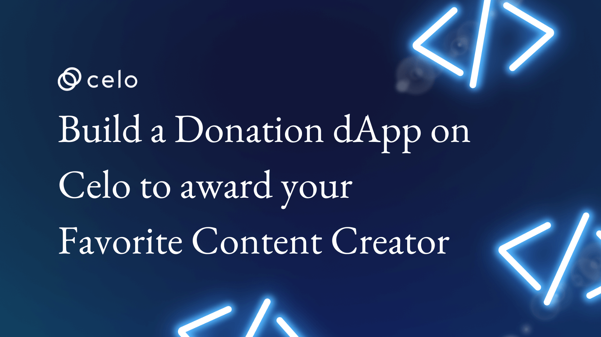

## Introduction

Hello guys. Today we are going to build a donation dApp. Building a donation dApp is an excellent example of a Blockchain use case. Building a donation dApp (decentralized application) on the blockchain can provide several benefits over traditional donation platforms. These include increased transparency, as all transactions on the blockchain are recorded on a public ledger that anyone can audit.

Additionally, using a blockchain-based platform can increase the security of donations, as it is more difficult to hack or tamper with transactions on a decentralized network. Additionally, it can increase trust and transparency in the donation process. It will be less prone to fraud or scams as the transactions are recorded on a public ledger and can be audited by anyone.

## Prerequisites

 - Knowledge of Solidity.
 - Knowledge of HTML, CSS, and JavaScript.

## Requirements

 - **Hardhat:** We will use hardhat to write the smart contract.
 - **Code editor:** Code editor of your choice.

## Let's go 🔥🔥🔥

Here is a list of what we are going to cover in this tutorial:
 - **Creating the smart contract using hardhat.**
 - **Deploying smart contract on CELO testnet using hardhat.**
 - **Creating frontend using vanilla HTML, CSS and JavaScript.**

To begin with, we need to have a clear picture of what our dApp is going to do. We want to donate to our favorite content creators. Here is how it is going to work:

Creators can get onboarded using our UI by uploading the IPFS hash of any digital file.
1. Anyone will be able to reward the creator except the creator himself.
2. When the user rewards the creator in CELO, the amount will go directly to the creator.

Now we have a clear picture, let's get started...

## Code

### Smart Contract

Below is the smart contract that will facilitate all the features.

```solidity
// SPDX-License-Identifier: MIT
pragma solidity ^0.8.9;

contract CreatorReward {
    
    struct Creator {
        string name;
        string description;
        string ipfsHash;
        address payable wallet;
    }

    event CreatorLog(string name, string description, string ipfsHash, address indexed wallet);

    event RewardLog(address indexed donor, address indexed creator, uint256 indexed amount);

    Creator[] private creators;

    function createAccount(string memory _name, string memory _description, string memory _ipfsHash) public {
        creators.push(Creator(_name, _description, _ipfsHash, payable(msg.sender)));
        emit CreatorLog(_name, _description, _ipfsHash, msg.sender);
    }

    function creatorsNumber() public view returns (uint) {
        return creators.length;
    }

    function creatorById(uint _id) public view returns (string memory, string memory, address) {
        return(creators[_id].name, creators[_id].ipfsHash, creators[_id].wallet);
    }

    function rewardCreatorById(uint _id) public payable {
        require(msg.value > 0, "CELO amount must be greater then 0");
        require(msg.sender != creators[_id].wallet, "Creator cannot send CELO to itself")
        (bool sent, bytes memory data) = creators[_id].wallet.call{value: msg.value}("");
        require(sent, "Failed to send Ether");

        emit RewardLog(msg.sender, creators[_id].wallet, msg.value);
    }
}
```

Now let's see what this smart contract does:

```solidity
// SPDX-License-Identifier: MIT
```
Above line identifies the license, here in our case it is MIT.

```solidity
pragma solidity ^0.8.9;
```
Here we are defining solidity version. In our case, we are using solidity version greater than `0.8.9`.

```solidity
contract CreatorReward {}
```
This is the beginning of the contract. The name of our contract is `CreatorReward`.

```solidity
struct Creator {
    string name;
    string description;
    string ipfsHash;
    address payable wallet;
}
```
Here we have defined the `Creator` structure. We will store the information of a creator. As you can see, `name`, `description` and `ipfsHash` are of type `string`. `wallet` is of type `payable address` because we are storing the wallet address of the creator and users can pay to her address.

```solidity
event CreatorLog(string name, string description, string ipfsHash, address indexed wallet);

event RewardLog(address indexed donor, address indexed creator, uint256 indexed amount);
```

Here, we have defined two events. First is `CreatorLog` and second is `RewardLog`.

`Event` in solidity serves special purpose. When a function of a smart contract is executed, we can emit the `event`. Data of events is stored inside the transaction's log. Events help notify the frontend of dApp to let the user know something has happened.

`CreatorLog` takes `name`, `description`, `ipfsHash` and `wallet` address as arguments. We emit this event when a new creator is onboarded.

`RewardLog` takes `donor` address, `creator` address and `amount` of CELO rewarded to the creator. This event is emitted when a user rewards a creator.

```solidity
Creator[] private creators;
```
Here, we are creating `creators` array of type `Creator` to store all the creators who are getting onboarded. It is `private` means one cannot read `creators` array.

```solidity
function createAccount(string memory _name, string memory _description, string memory _ipfsHash) public {
  creators.push(Creator(_name, _description, _ipfsHash, payable(msg.sender)));
  emit CreatorLog(_name, _description, _ipfsHash, msg.sender);
}
```
In the function above, `createAccount`, any user can call this function and can become a creator. This function takes `_name` `_description` and `_ipfsHash` as arguments.

we are pushing `Creator` data inside `creators` array to store a creator's information.

Finally, we emit an event `CreatorLog` so that this data could be included in the transaction receipt. We can even listen to this data and notify the user once she is onboarded.

```solidity
function creatorsNumber() public view returns (uint) {
  return creators.length;
}
```
We have created `creatorsNumber` function that returns the total number of creators onboarded so far.

```solidity
function creatorById(uint _id) public view returns (string memory, string memory, address) {
    return(creators[_id].name, creators[_id].ipfsHash, creators[_id].wallet);
}
```
The above function returns the creator's data by `id`. It returns the name, ipfsHash and wallet address of a creator.

```solidity
function rewardCreatorById(uint _id) public payable {
    require(msg.value > 0, "CELO amount must be greater then 0");
    require(msg.sender != creators[_id].wallet, "Creator cannot send CELO to itself")
    (bool sent, bytes memory data) = creators[_id].wallet.call{value: msg.value}("");
    require(sent, "Failed to send Ether");

    emit RewardLog(msg.sender, creators[_id].wallet, msg.value);
    }
```
In the above function, we are rewarding a creator in CELO. The first two conditions are, CELO sent should be greater than equal to 0 and that a creator can't fund herself. In the end, we are emitting `RewardLog` event so that information could be included in the transaction receipt.

You can clone this repository -> https://github.com/avirajkhare00/celo-creator-reward-dapp.git

It contains code both for smart contracts and frontend.

To deploy smart contract via hardhat on `alfajores` testnet, execute the following command:

```sh
npx hardhat run scripts/deploy.js --network alfajores
```

Since we have covered our smart contract. It's time we start with our frontend.

We are going to create frontend now. It's going to be vanilla HTML, CSS and JavaScript without any heavy dependencies.

Here is the frontend code:

```html
<!doctype html>
<html lang="en">

<head>
    <meta charset="utf-8">
    <meta name="viewport" content="width=device-width, initial-scale=1">
    <title>dApp</title>
    <link href="https://cdn.jsdelivr.net/npm/bootstrap@5.3.0-alpha1/dist/css/bootstrap.min.css" rel="stylesheet"
        integrity="sha384-GLhlTQ8iRABdZLl6O3oVMWSktQOp6b7In1Zl3/Jr59b6EGGoI1aFkw7cmDA6j6gD" crossorigin="anonymous">
</head>

<body>
    <center>
        <h1>Reward your favourite content creator on CELO!</h1>
    </center>

    <div class="row">
        <div class="col-md-2"></div>
        <div class="col-md-8">
            <center>
                <h2>Become a creator</h2>
            </center>
            <form>
                <div class="mb-3">
                    <label for="name" class="form-label">Name</label>
                    <input type="text" class="form-control" id="name">
                </div>
                <div class="mb-3 form-floating">
                    <textarea class="form-control" placeholder="Your description..." id="description"
                        style="height: 100px"></textarea>
                    <label for="description">Description</label>
                </div>
                <div class="mb-3">
                    <label for="ipfsHash" class="form-label">IPFS Hash</label>
                    <input type="text" class="form-control" id="ipfsHash">
                </div>
                <button type="button" id="creatorOnboardSubmitBtn" class="btn btn-primary">Submit</button>
            </form>
            <center>
                <h2>Reward creators</h2>
                <div id="creatorsDOM"></div>
            </center>

        </div>
        <div class="col-md-2"></div>
    </div>

    <script src="https://cdn.jsdelivr.net/npm/bootstrap@5.3.0-alpha1/dist/js/bootstrap.bundle.min.js"
        integrity="sha384-w76AqPfDkMBDXo30jS1Sgez6pr3x5MlQ1ZAGC+nuZB+EYdgRZgiwxhTBTkF7CXvN"
        crossorigin="anonymous"></script>
    <script src="js/web3.min.js"></script>
    <script type="text/javascript">

        if (typeof window.ethereum !== 'undefined') {
            console.log('MetaMask is installed!');
        } else {
            alert('Please install Metamask first.');
        }

        async function getAccount() {
            const accounts = await ethereum.request({ method: 'eth_requestAccounts' });
            return accounts[0];
        }

        function getTotalCreators() {
            const creators = contract.methods.creatorsNumber().call();
            return creators;
        }

        async function onboardCreator(name, description, ipfsHash) {
            const account = await getAccount();
            await contract.methods.createAccount(name, description, ipfsHash).send({ from: account });
        }

        async function rewardCreatorById(creatorId){
            let account = await getAccount();
            let amount = document.getElementById(`input${creatorId}`).value;
            await contract.methods.rewardCreatorById(creatorId).send({from: account, value: web3.utils.toWei(amount, 'ether')});
        }

        async function fillCreatorDOM() {
            const creators = await getTotalCreators();
            for (i = 0; i <= creators; i++) {
                let creator = await contract.methods.creatorById(i).call();
                let creatorName = creator[0];
                let ipfsHash = creator[1];
                let description = creator[2];
                let newDiv = document.createElement("div");
                newDiv.setAttribute("id", i);
                newDiv.setAttribute("class", "card-body");
                document.getElementById('creatorsDOM').appendChild(newDiv);
                newDiv.innerHTML = `<div class="card">
                        <div class="card-body">
                            Name: ${creatorName}
                            <br />
                            Description: ${description}
                            <br />
                            IFPS Hash: <a href="https://ipfs.filebase.io/ipfs/${ipfsHash}">Link</a>
                            <br />
                            Creator reward amount: <input type="text" id="input${i}">
                            <br />
                            <button class="btn btn-primary" onclick="rewardCreatorById(${i})">Reward</button>
                        </div>
                    </div>`
            }
        }

        const ABI = [{"anonymous":false,"inputs":[{"indexed":false,"internalType":"string","name":"name","type":"string"},{"indexed":false,"internalType":"string","name":"description","type":"string"},{"indexed":false,"internalType":"string","name":"ipfsHash","type":"string"},{"indexed":true,"internalType":"address","name":"wallet","type":"address"}],"name":"CreatorLog","type":"event"},{"anonymous":false,"inputs":[{"indexed":true,"internalType":"address","name":"donor","type":"address"},{"indexed":true,"internalType":"address","name":"creator","type":"address"},{"indexed":true,"internalType":"uint256","name":"amount","type":"uint256"}],"name":"RewardLog","type":"event"},{"inputs":[{"internalType":"string","name":"_name","type":"string"},{"internalType":"string","name":"_description","type":"string"},{"internalType":"string","name":"_ipfsHash","type":"string"}],"name":"createAccount","outputs":[],"stateMutability":"nonpayable","type":"function"},{"inputs":[{"internalType":"uint256","name":"_id","type":"uint256"}],"name":"creatorById","outputs":[{"internalType":"string","name":"","type":"string"},{"internalType":"string","name":"","type":"string"},{"internalType":"string","name":"description","type":"string"}],"stateMutability":"view","type":"function"},{"inputs":[],"name":"creatorsNumber","outputs":[{"internalType":"uint256","name":"","type":"uint256"}],"stateMutability":"view","type":"function"},{"inputs":[{"internalType":"uint256","name":"_id","type":"uint256"}],"name":"rewardCreatorById","outputs":[],"stateMutability":"payable","type":"function"}]

        const contractAddress = "0x3785f284E8E456E8608025F630643C0c75b2d150";

        const web3 = new Web3(Web3.givenProvider);
        const account = getAccount();

        const contract = new web3.eth.Contract(ABI, contractAddress);

        fillCreatorDOM();

        document.getElementById('creatorOnboardSubmitBtn').onclick = function () {
            let name = document.getElementById('name').value;
            let description = document.getElementById('description').value;
            let ipfsHash = document.getElementById('ipfsHash').value;
            onboardCreator(name, description, ipfsHash);
        }

    </script>
</body>

</html>
```

Now I will break down HTML so that you can understand how we can create frontend for our dApp.

```html
<head>
    <meta charset="utf-8">
    <meta name="viewport" content="width=device-width, initial-scale=1">
    <title>dApp</title>
    <link href="https://cdn.jsdelivr.net/npm/bootstrap@5.3.0-alpha1/dist/css/bootstrap.min.css" rel="stylesheet"
        integrity="sha384-GLhlTQ8iRABdZLl6O3oVMWSktQOp6b7In1Zl3/Jr59b6EGGoI1aFkw7cmDA6j6gD" crossorigin="anonymous">
</head>
```
This is our head of HTML document. Here, we defined the title and we are importing the `bootstrap` library.

```html
<div class="row">
        <div class="col-md-2"></div>
        <div class="col-md-8">
            <center>
                <h2>Become a creator</h2>
            </center>
            <form>
                <div class="mb-3">
                    <label for="name" class="form-label">Name</label>
                    <input type="text" class="form-control" id="name">
                </div>
                <div class="mb-3 form-floating">
                    <textarea class="form-control" placeholder="Your description..." id="description"
                        style="height: 100px"></textarea>
                    <label for="description">Description</label>
                </div>
                <div class="mb-3">
                    <label for="ipfsHash" class="form-label">IPFS Hash</label>
                    <input type="text" class="form-control" id="ipfsHash">
                </div>
                <button type="button" id="creatorOnboardSubmitBtn" class="btn btn-primary">Submit</button>
            </form>
            <center>
                <h2>Reward creators</h2>
                <div id="creatorsDOM"></div>
            </center>

        </div>
        <div class="col-md-2"></div>
    </div>
```
Here, we have our basic HTML, and we have created a form. It will be used to onboard a new creator. Also, we created `creatorsDOM` so that we can fetch the data from the blockchain and display it on the frontend.

Now I will explain the JS part of the code so that we can interact with the smart contracts.

```js
if (typeof window.ethereum !== 'undefined') {
    console.log('MetaMask is installed!');
} else {
    alert('Please install Metamask first.');
}
```
Here we are checking if `MetaMask` is installed on the user's machine.

```js
async function getAccount() {
    const accounts = await ethereum.request({ method: 'eth_requestAccounts' });
    return accounts[0];
}
```
`getAccount()` is used to get the current account of the user selected in the Metamask.

```js
function getTotalCreators() {
    const creators = contract.methods.creatorsNumber().call();
    return creators;
}
```
This function is getting all the creators so that we can get the data of all the creators.

```js
async function onboardCreator(name, description, ipfsHash) {
    const account = await getAccount();
    await contract.methods.createAccount(name, description, ipfsHash).send({ from: account });
}
```
This function is used to onboard a creator. It accepts the name, description and ipfsHash of the creator.

```js
async function fillCreatorDOM() {
    const creators = await getTotalCreators();
    for (i = 0; i <= creators; i++) {
        let creator = await contract.methods.creatorById(i).call();
        let creatorName = creator[0];
        let ipfsHash = creator[1];
        let description = creator[2];
        let newDiv = document.createElement("div");
        newDiv.setAttribute("id", i);
        newDiv.setAttribute("class", "card-body");
        document.getElementById('creatorsDOM').appendChild(newDiv);
        newDiv.innerHTML = `<div class="card">
                <div class="card-body">
                    Name: ${creatorName}
                    <br />
                    Description: ${description}
                    <br />
                    IFPS Hash: <a href="https://ipfs.filebase.io/ipfs/${ipfsHash}">Link</a>
                    <br />
                    Creator reward amount: <input type="text" id="input${i}">
                    <br />
                    <button class="btn btn-primary" onclick="rewardCreatorById(${i})">Reward</button>
                </div>
            </div>`
    }
}
```
Since we are writing vanilla JavaScript, we are doing the DOM manipulation using JS. This function gets the total number of creators. Then it will get information about every creator and will append it to the DOM.

```js
async function rewardCreatorById(creatorId){
    let account = await getAccount();
    let amount = document.getElementById(`input${creatorId}`).value;
    await contract.methods.rewardCreatorById(creatorId).send({from: account, value: web3.utils.toWei(amount, 'ether')});
}
```
This function is used to reward the content creator. It takes the `creatorId` and rewards the creator. This function is called when the user clicks on the reward button.

```js
const ABI = [{"anonymous":false,"inputs":[{"indexed":false,"internalType":"string","name":"name","type":"string"},{"indexed":false,"internalType":"string","name":"description","type":"string"},{"indexed":false,"internalType":"string","name":"ipfsHash","type":"string"},{"indexed":true,"internalType":"address","name":"wallet","type":"address"}],"name":"CreatorLog","type":"event"},{"anonymous":false,"inputs":[{"indexed":true,"internalType":"address","name":"donor","type":"address"},{"indexed":true,"internalType":"address","name":"creator","type":"address"},{"indexed":true,"internalType":"uint256","name":"amount","type":"uint256"}],"name":"RewardLog","type":"event"},{"inputs":[{"internalType":"string","name":"_name","type":"string"},{"internalType":"string","name":"_description","type":"string"},{"internalType":"string","name":"_ipfsHash","type":"string"}],"name":"createAccount","outputs":[],"stateMutability":"nonpayable","type":"function"},{"inputs":[{"internalType":"uint256","name":"_id","type":"uint256"}],"name":"creatorById","outputs":[{"internalType":"string","name":"","type":"string"},{"internalType":"string","name":"","type":"string"},{"internalType":"string","name":"description","type":"string"}],"stateMutability":"view","type":"function"},{"inputs":[],"name":"creatorsNumber","outputs":[{"internalType":"uint256","name":"","type":"uint256"}],"stateMutability":"view","type":"function"},{"inputs":[{"internalType":"uint256","name":"_id","type":"uint256"}],"name":"rewardCreatorById","outputs":[],"stateMutability":"payable","type":"function"}]

const contractAddress = "0x3785f284E8E456E8608025F630643C0c75b2d150";

const web3 = new Web3(Web3.givenProvider);
const account = getAccount();

const contract = new web3.eth.Contract(ABI, contractAddress);
```
You can get ABI of a smart contract by running `npx hardhat compile` command. It is stored inside `artifacts/contracts` directory.

You can copy the `contractAddress` when you deployed the smart contract.

`const web3 = new Web3(Web3.givenProvider);`
Here we have initialized `web3` as `Web3` object and gave Metamask as given provider.

`const contract = new web3.eth.Contract(ABI, contractAddress);`
Here, we are initializing the `contract` object. It is an instance of `web3.eth.Contract()` which takes an `ABI` and `contractAddress`.

Here is what the dApp looks like.


Once you reward a creator, you can look in the internal transaction that amount went to the creator.


Thanks a lot for following this tutorial so far.

## About the author

Aviraj Khare
Ex Gojek, into web3 space since 2016.

## References
 - https://web3js.readthedocs.io/en/v1.8.2/
 - https://getbootstrap.com/
 - https://docs.soliditylang.org/en/v0.8.18/
 - https://hardhat.org/
