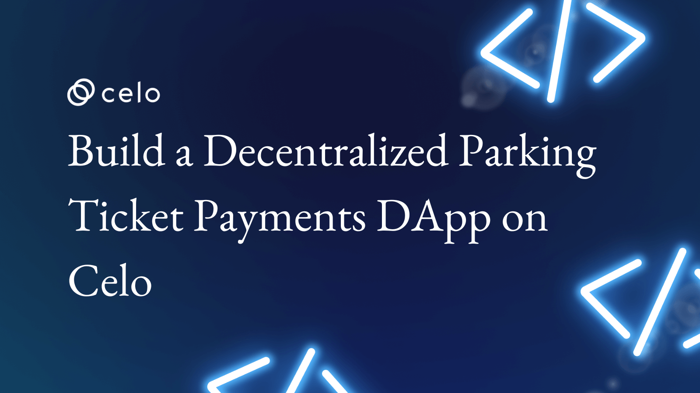
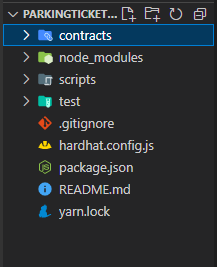

<!--truncate-->

### Introduction

One of the major challenges of the government of today while issuing or accepting payment of fines is the dishonest and fraudulent act of the middlemen between the government and the offenders.

The payment processes payers went through often get cumbersome. An example is the parking ticket. Often, the beneficiary received less than expected due to unforeseen arbitrary expenses or the act of corrupted people in service.

Web3 could offer a more subtle way of reducing time spent on issuing tickets or fines, a faster way of making payments that comes with proof verifiable on the blockchain.

In this tutorial, we are going to create a smart contract that will enable anyone to pay parking tickets in a decentralized manner. To make data accessibility easier, we will deploy it on the Celo Blockchain.

### Prerequisites​

This tutorial assumes you have a fundamental knowledge of the following concepts

 How the blockchain works and how Smart Contracts operate on a higher level.

 Basics of solidity programming language like mappings, structs, and functions

 How to work with JavaScript and ethers JS

 Working with ReactJs

### Requirements​

 We'll need Metamask Install it from here If you don`t have it

 NodeJS 12.0.1+ version

### Creating the project

We're going to use hardhat for smart contract development since it comes bundled with most of the tools and libraries we need for successful development.

### Install hardhat into your workspace with either npm or yarn

```bash
yarn add hardhat
```

After the installation is successful, run `npx hardhat` to initialize a new hardhat project and select Create a JavaScript project

```bash
$ npx hardhat
888    888                      888 888               888
888    888                      888 888               888
888    888                      888 888               888
8888888888  8888b.  888d888 .d88888 88888b.   8888b.  888888
888    888     "88b 888P"  d88" 888 888 "88b     "88b 888
888    888 .d888888 888    888  888 888  888 .d888888 888
888    888 888  888 888    Y88b 888 888  888 888  888 Y88b.
888    888 "Y888888 888     "Y88888 888  888 "Y888888  "Y888

👷 Welcome to Hardhat v2.9.9 👷‍

? What do you want to do? …
❯ Create a JavaScript project
  Create a TypeScript project
  Create an empty hardhat.config.js
  Quit
```

This will prompt you to install several dependencies make sure you install them before proceeding.

You need to install these dependencies to run the sample project:

```bash
  yarn add --dev "hardhat@^2.11.1" "@nomicfoundation/hardhat-toolbox@^2.0.0" "@nomicfoundation/hardhat-network-helpers@^1.0.0" "@nomicfoundation/hardhat-chai-matchers@^1.0.0" "@nomiclabs/hardhat-ethers@^2.0.0" "@nomiclabs/hardhat-etherscan@^3.0.0" "chai@^4.2.0" "ethers@^5.4.7" "hardhat-gas-reporter@^1.0.8" "solidity-coverage@^0.8.0" "@typechain/hardhat@^6.1.2" "typechain@^8.1.0" "@typechain/ethers-v5@^10.1.0" "@ethersproject/abi@^5.4.7" "@ethersproject/providers@^5.4.7"
```

This will scaffold a new hardhat project as shown below;



With the basic hardhat setup, it is enough to start building and testing smart contracts. But I like to make it more convenient by  using hardhat with another library called `hardhat deploy`

It helps shorten the deployment script and enhance testing.

Install hardhat deploy with `yarn add --dev hardhat-deploy`

For  compatibility with  `hardhat-deploy`, we need to override the baked-in deploy feature with a new plugin using the following  command;

```bash
yarn add --dev @nomiclabs/hardhat-ethers@npm:hardhat-deploy-ethers ethers
```

Open the `hardhat.config.js` file on top of it add the following line;

```javascript
require('hardhat-deploy')
```

### Creating the Smart contract

Before we start writing the code, we need to first list out the functionalities.

1. An admin account that can authorize ticket creation for the drivers.

2. An object containing ticket data such as ;

### price

### date created

### vehicle's registration number

### a way to verify or check whether the ticket has been paid or not

> Note: The Vehicle plate number is very important to feature on the ticket object because it will be unique and will help us traverse, filter and search for ticket objects in the contract. So keep track of it.

### Admin Address

Under the contracts folder, create a new contract and name it `Ledger.sol`.

```solidity
// SPDX-License-Identifier: UNLICENSED
pragma solidity ^0.8.9;

contract Ledger {

}
```

At the top, we specified the license and declared a solidity version for compiling our code

Declare a contract and name it `Ledger`

Going back to our workflow, we need to have an admin address that will create tickets for users. This will be the only address that will be whitelisted to be able to create tickets for divers.

```solidity
    address immutable private i_admin;
    uint256 private s_ticketCount;
```

We make the address immutable and private by default using the `immutable` & `private` keywords. By doing so, after initialization, the admin address will be fixed and can't be changed.

But we may need to be able to read the admin address, currently, we can't do that because we've made the address private. To query the admin address from the contract, we'll explicitly create a public function that will return the address from the contract.

We may also need to track the number of tickets issued in the contract, so we've added the `s_ticketCount` property.

```solidity
    function getAdminAddress() public view returns (address) {
        return i_admin;
    }
```

We make the function public so anyone can call it.

### The Constructor

In practice, smart contracts may have initial values set globally within them. These values may be defined initially during deployment or by special functions to update them. In our case, we have the `i_admin` and `s_ticketCount`. We want these variables to have values assigned at deployment. The constructor function is invoked only once during deployment with our `i_admin` and `s_ticketCount` set to `msg.sender` and `0` respectively.

Set the constructor;

```solidity
    constructor() {
        i_admin = msg.sender;
        s_ticketCount = 0;
    }
```

### Ticket data

We will create an object that holds all the ticket data as follow, and here's how we can do it;

```solidity
    struct Ticket {
        uint256 ticketNumber;
        string location;
        string carNumberPlate;
        uint256 price;
        uint256 issuedAt;
        bool isPaid;
    }
```

We use a struct to hold the data. We'll make use of the Ticket object with specific fields like the location where the ticket was issued, the vehicle registration number, the fine, the date issued, and the 'isPaid' boolean flag to check whether the ticket was cleared or not.

We also want to track all the tickets in the contract in an array so we can perform special operations on them like looping.

In this case, we'll use

```solidity
    Ticket[] private s_tickets;
```

With the `s_tickets` array, we'll be able to store new tickets.

Let's create a readOnly function that will fetch the `s_tickets` from storage.

```solidity
  function getAllTickets() public view returns (Ticket[] memory) {
        return s_tickets;
    }
```

This function will return all the tickets in the contract

### Create Ticket

We need a way of creating a new ticket in our smart contract and the best way to do this is by assigning a function to do that.

Add the function below your constructor;

```solidity
    function createTicket(
        string memory enteredLocation,
        string memory carPlate,
        uint256 tixPrice
    ) public {
        if (msg.sender != i_admin) {
            revert Ledger__NotPermitted();
        }

        // Create a new Ticket obj
        s_tickets.push(
            Ticket(enteredLocation, carPlate, tixPrice, block.timestamp, false)
        );

        emit NewTicketIssued(carPlate, enteredLocation);
    }
```

The `createTicket` function accepts three arguments, `enteredLocation`, `carPlate`, and `tixPrice`; these are parameters that end up in the `Ticket` struct.

Firstly, we want to ensure only the admin has permission to issue new tickets to users and we make this check by comparing the calling address - `msg.sender` property to the `s_admin` stored in the state. If they do not match, the contract reverts with a custom error - `Ledger__NotPermitted()`.

### Custom Revert Messages

> Note: solidity supports custom error messages out of the box if you need to have explicit and readable error messages.

We define our custom error messages on top of the file with the `error NameOfErrorMessge()`

In the case of `Ledger__NotPermitted()`, we name-spaced the error message starting with the contract name `Ledger` followed by `___` so that we can easily identify which contract is emitting the errors.

At the top of the contract add this code;

```solidity
error Ledger__NotPermitted();
```

Next, we create an instance of the ticket object with expected data, then pushed to the `s_tickets` array.

```solidity
        s_tickets.push(
            Ticket(enteredLocation, carPlate, tixPrice, block.timestamp, false)
        );
```

### Events

Lastly, we fired an event using the keyword `emit`.

> Note: Events are relevant for creating awareness to show that an action took place in the contract. We use front-end/clients to listen to events. We may then execute logic based on the fired events.

In this case, we fired a `NewTicketIssued()` event when a new ticket was created. To create an event instance, we use the `event EventName()` to create the event and emit it using `emit EventName()`.

Events are functions too. Hence, they can accept arguments.

Paste the following code above the constructor;

`solidity event NewTicketIssued(string indexed carPlate, string indexed location);`

Emit the event in the `createTicket` function like this:

`solidity emit NewTicketIssued(carPlate, enteredLocation);`

Our code so far;

```solidity
// SPDX-License-Identifier: UNLICENSED
pragma solidity ^0.8.9;

// Uncomment this line to use console.log
// import "hardhat/console.sol";
/*
    1. We need an admin address to issue a new ticket
    2. Ticket object should have - {
        price,
        date created,
        car number plate,
        is paid -- (bool)
    }
    3. Anyone can pay for the ticket on the owner's behalf

    NB: The car's license plate is very important because we may need to query
        its details or loop through and filter between paid and unpaid tickets (using the license plates)
 */

error Ledger__NotPermitted();

contract Ledger {
    // Set the admin default address
    address private immutable i_admin;
    uint256 private s_ticketCount;

    // Create the ticket issuing object
    struct Ticket {
        uint256 ticketNumber;
        string location;
        string carNumberPlate;
        uint256 price;
        uint256 issuedAt;
        bool isPaid;
    }

    // All Tickets array
    Ticket[] private s_tickets;

    // Events
    event NewTicketIssued(string indexed carPlate, string indexed location);

    // Constructor
    constructor() {
        i_admin = msg.sender;
    }

    function createTicket(
        string memory enteredLocation,
        string memory carPlate,
        uint256 tixPrice
    ) public {
        if (msg.sender != i_admin) {
            revert Ledger__NotPermitted();
        }

        // Create a new Ticket obj
        s_tickets.push(
            Ticket(
                  s_ticketCount,
                  enteredLocation,
                  carPlate,
                  tixPrice,
                  block.timestamp,
                  false
            ));

        emit NewTicketIssued(carPlate, enteredLocation);
    }

    // View functions
    function getAdminAddress() public view returns (address) {
        return i_admin;
    }

    // get all tickets obj
    function getAllTickets() public view returns (Ticket[] memory) {
        return s_tickets;
    }
}
```

We'll need to scrutinize the vehicle's specific ticket info such as parking tickets assigned to each vehicle's registration number.

We can do this in several ways. Either;

1. Filter the `s_tickets` array on the front end and return only the required tickets to a vehicle's registration number. Or,

2. We could create a function that will filter the vehicle's tickets and return an already filtered array to the front end.

In my opinion, option 2 is more efficient since it uses an already-baked on-chain function that returns the required data we need. This will greatly reduce the number of computations done on the front end to extract the required data.

### Extending CreateTicket

We defined the `s_vehicleTickets` mapping that accepts a `string` property and returns an array of 'Tickets' data mapped to the `string`. In this case, this `string` will be the vehicle's registration number.

A mapping works similarly to a dictionary in python where there is a key-value pair relationship. In this case, the `string` is the key to the `Ticket[]`.

During data entry, we'll store a Ticket object that corresponds to the vehicle's registration number so we can easily pull the target data without having to loop through a giant pile of tickets.

Go to the `createTicket` function, and add the following code to create a ticket in the storage;

```solidity
   s_vehicleTickets[carPlate].push(
            Ticket(
                s_ticketCount,
                enteredLocation,
                carPlate,
                tixPrice,
                block.timestamp,
                false
            )
        );
```

Your function should be like this. ;

```solidity
    function createTicket(
        string memory enteredLocation,
        string memory carPlate,
        uint256 tixPrice
    ) public {
        if (msg.sender != i_admin) {
            revert Ledger__NotPermitted();
        }

        // Create a new Ticket obj
        s_tickets.push(
            Ticket(
                  s_ticketCount,
                  enteredLocation,
                  carPlate,
                  tixPrice,
                  block.timestamp,
                  false
            ));
        );

        s_vehicleTickets[carPlate].push(
            Ticket(
                s_ticketCount,
                enteredLocation,
                carPlate,
                tixPrice,
                block.timestamp,
                false
            )
        );

        // add the vehicle to the s_vehicleTicket mapping
        emit NewTicketIssued(carPlate, enteredLocation);
    }
```

Finally, we'll create a function to return all the tickets in storage when we supply the vehicle's registration number.

Add this code to the `getVehicleTickets` function. ;

```solidity
    function getVehicleTickets(
        string memory carPlate
    ) public view returns (Ticket[] memory) {
        return s_vehicleTickets[carPlate];
    }
```

### Filtering the unpaid tickets

As we move on, we'll consider having a vehicle's profile overview on the front end where we'll filter paid and unpaid ticket history. In practice, It is a good idea we do the filtration and selection in the contract so that we can return a properly formatted array of tickets to the front end.

We are going to begin by filtering unpaid tickets.

Add the following at the top of your contract;

```solidity
    mapping(string => Ticket[]) private s_vehicleUpaidTickets;
    
```

`s_vehicleUpaidTickets` will hold or store all unpaid tickets. Let's create a function that retrieves all unpaid tickets from storage.

Below the constructor, add the following function.

```solidity
    function getVehicleUnPaidTickets(
        string memory carPlate
    ) public view returns (Ticket[] memory) {
        return s_vehicleUpaidTickets[carPlate];
    }
```

> Note: Later, we will create a function to retrieve paid tickets after we have created a function to pay tickets.

### Pay Ticket

At this point, we need the driver to be able to clear the outstanding ticket for their vehicle. We`d want to make it as dynamic as possible for anyone to pay for a ticket. That is, any address can make the payment. We need to be able to keep track of who pays for tickets and when.

Let's create the `payTicket` function.

```solidity
 function payTicket(
        string memory carPlate,
        uint256 ticketNo
    ) public payable {

    }
```

> Note that we annotate the above function with the `payable` property. This allows the function to accept Celo

The function accepts `carPlate` and `ticketNo` arguments to enable us to filter and index the specific ticket that the driver is paying for.

We retrieve the target ticket from the storage and store it in memory.

```solidity
// Get the required ticket
    Ticket memory vehicleTicket = s_vehicleTickets[carPlate][ticketNo];
    uint256 tixPrice = vehicleTicket.price;
```

Thereafter, we verify that the caller is paying the right amount.

To do this, we compare the incoming value to the ticket price in storage and check if the condition is false otherwise it fails and reverts with the custom error `Ledger__NotEnoughFundsPaid()`.

```solidity
    // Verify to see that they'repaying the right ticket amount
    if (msg.value < tixPrice) {
        revert Ledger__NotEnoughFundsPaid();
    }
```

Now that the important checks are done, we can now update the ticket `isPaid` status from `false` to `true` in storage.

To remove the paid ticket from the unpaid list, we'll invoke solidity's global `delete` keyword on the `s_vehicleUnpaidTickets` mapping.

```solidity
        // Clear / Remove the ticket from the vehicle's unpaid tickets
        delete s_vehicleUpaidTickets[carPlate][ticketNo];
```

### Paid Tickets

Now that we have the needed functionalities written, we need a way to return all unpaid tickets. The best place to do this is in the `payTicket` function. After removing the paid ticket from the unpaid ones in storage, we may then push them to storage.

Add this above the constructor.

```solidity
    mapping(string => Ticket[]) private s_vehiclePaidTickets;
```

Then add this to the `payTicket` function.

```solidity
        // Add it to the paid tickets array;
        s_vehiclePaidTickets[carPlate].push(vehicleTicket);
```

Lastly, add a function that returns all paid tickets.

```solidity
    function getVehiclePaidTickets(
        string memory carPlate
    ) public view returns (Ticket[] memory) {
        return s_vehiclePaidTickets[carPlate];
    }
```

Let's examine what we have written so far.

```solidity
/**
 *Submitted for verification at alfajores.celoscan.io on 2023-01-29
*/

// SPDX-License-Identifier: UNLICENSED
pragma solidity ^0.8.7;


    // 1. We need an admin address to issue a new ticket
    // 2. Ticket object should have - {
    //     price,
    //     date created,
    //     car number plate,
    //     is paid -- (bool)
    // }
    // 3. Anyone can pay for the ticket on the owner's behalf

    // NB: The car's license plate is very important because we may need to query
    //     its details or loop through and filter between paid and unpaid tickets (using the license plates)


error Ledger__NotPermitted();
error Ledger__NotEnoughFundsPaid();

contract Ledger {
    // Set the admin default address
    address private immutable i_admin;
    uint256 private s_ticketCount;
    uint256 private s_ledgerBalance;

    // Create the ticket issuing object
    struct Ticket {
        uint256 ticketNumber;
        string location;
        string carNumberPlate;
        uint256 price;
        uint256 issuedAt;
        bool isPaid;
    }

    // All Tickets array
    Ticket[] private s_tickets;

    mapping(string => Ticket[]) private s_vehicleTickets;
    mapping(string => Ticket[]) private s_vehicleUpaidTickets;
    mapping(string => Ticket[]) private s_vehiclePaidTickets;

    // Events
    event NewTicketIssued(string indexed carPlate, string indexed location);
    event TicketPaid(uint256 indexed ticketNumber, string indexed carPlate);
    event IncomingPayment(string msg);

    // Constructor
    constructor() {
        i_admin = msg.sender;
        s_ticketCount = 0;
        s_ledgerBalance = 0;
    }

    function createTicket(
        string memory enteredLocation,
        string memory carPlate,
        uint256 tixPrice
    ) public {
        if (msg.sender != i_admin) {
            revert Ledger__NotPermitted();
        }

        // Create a new Ticket obj
        s_tickets.push(
            Ticket(
                s_ticketCount,
                enteredLocation,
                carPlate,
                tixPrice,
                block.timestamp,
                false
            )
        );

        s_vehicleTickets[carPlate].push(
            Ticket(
                s_ticketCount,
                enteredLocation,
                carPlate,
                tixPrice,
                block.timestamp,
                false
            )
        );

        s_vehicleUpaidTickets[carPlate].push(
            Ticket(
                s_ticketCount,
                enteredLocation,
                carPlate,
                tixPrice,
                block.timestamp,
                false
            )
        );

        s_ticketCount += 1;

        // add the vehicle to the s_vehicleTicket mapping
        emit NewTicketIssued(carPlate, enteredLocation);
    }

    function payTicket(
        string memory carPlate,
        uint256 ticketNo
    ) public payable {
        // Get the required ticket
        Ticket memory vehicleTicket = s_vehicleTickets[carPlate][ticketNo];
        uint256 tixPrice = vehicleTicket.price;

        // Verify to see that they'repaying the right ticket amount
        if (msg.value < tixPrice) {
            revert Ledger__NotEnoughFundsPaid();
        }

        // Update the contract balances
        s_ledgerBalance += msg.value;

        // Change the in memory vehicleTicket is Paid to true
        vehicleTicket.isPaid = true;

        // Change the isPaid status to true in the all s_tickets array
        Ticket storage fromAllTix = s_tickets[ticketNo];
        fromAllTix.isPaid = true;


        // Change in the vehicleTicket isPaid to true
        s_vehicleTickets[carPlate][ticketNo].isPaid = true;

        // Clear / Remove the ticket from the vehicle's unpaid tickets
        delete s_vehicleUpaidTickets[carPlate][ticketNo];

        // Add it to the paid tickets array;
        s_vehiclePaidTickets[carPlate].push(vehicleTicket);

        
    }

    receive() external payable{
        // Emit event to show a new ticket paid..
        emit IncomingPayment("New payment incoming");
    }
    fallback() external payable{}
    

    // View functions
    function getAdminAddress() public view returns (address) {
        return i_admin;
    }

    // get all tickets obj
    function getAllTickets() public view returns (Ticket[] memory) {
        return s_tickets;
    }

    function getTicketInfo(
        uint256 ticketNo
    ) public view returns (Ticket memory) {
        // return s_vehicleUpaidTickets[carPlate][ticketNo];
        return s_tickets[ticketNo];
    }

    // Get vehicle tickets
    function getVehicleTickets(
        string memory carPlate
    ) public view returns (Ticket[] memory) {
        return s_vehicleTickets[carPlate];
    }

    function getVehicleUnPaidTickets(
        string memory carPlate
    ) public view returns (Ticket[] memory) {
        return s_vehicleUpaidTickets[carPlate];
    }

    function getVehiclePaidTickets(
        string memory carPlate
    ) public view returns (Ticket[] memory) {
        return s_vehiclePaidTickets[carPlate];
    }
}
```

### Compiling the Contract

Let`s compile the contract. Run the following command in the terminal:

```bash
PS C:\Users\Desktop\Celosage\parkingticketsdapp> npx hardhat compile
```

Output:

```bash
PS C:\Users\Desktop\Celosage\parkingticketsdapp> npx hardhat compile
Compiled 1 solidity file successfully
```

Hooray! Our contract compiles successfully.

### Deploying the contract

The next step is to deploy the compiled contract. Using Hardhat CLI, we will deploy it to the local network. The hardhat node is good for local deployment and testing before deploying to a live network since it uses test Celo.

To see what the hardhat local network looks like, open the terminal and type the following command.

```bash
    npx hardhat node
```

Output;

```bash
Started HTTP and WebSocket JSON-RPC server at http://127.0.0.1:8545/

Accounts
========

WARNING: These accounts, and their private keys, are publicly known.
Any funds sent to them on Mainnet or any other live network WILL BE LOST.

Account #0: 0xf39Fd6e51aad88F6F4ce6aB8827279cffFb92266 (10000 ETH)
Private Key: 0xac0974bec39a17e36ba4a6b4d238ff944bacb478cbed5efcae784d7bf4f2ff80

Account #1: 0x70997970C51812dc3A010C7d01b50e0d17dc79C8 (10000 ETH)
Private Key: 0x59c6995e998f97a5a0044966f0945389dc9e86dae88c7a8412f4603b6b78690d

...
```

This spin-off is a local chain so we can deploy our contract and run tests.

### Deploy script  

To deploy the contract, we need to write a script for it. In your project's root directory, Under the `script` folder create a file named `01-deploy-ledger.js`. We use the naming convention prefixed with a "01", to give a hierarchy of how our contracts will be deployed. For example, if we have multiple contracts in our projects that all need to be deployed, we'll put them in different deploy scripts and deploy them in order of the prefixed number before the file name. In our case, we only have one contract to deploy.

### Hardhat config file

  For the deploy script to work, we need some special variables. The hardhat config file contains the following:

1. The script needs to know which chain it is deploying the contract to.

2. The account that pays for the network fee.

3. The compiler version to use and so on.

Populate the `hardhat.config.js` with the following code:

```JavaScript
require('@nomicfoundation/hardhat-toolbox')
require('hardhat-deploy')
require('dotenv').config()

const { ALFAJORES_URL, PRIVATE_KEY } = process.env

/** @type import('hardhat/config').HardhatUserConfig */
module.exports = {
  defaultNetwork: 'hardhat',
  networks: {
    hardhat: {
      chainId: 31337,
    },
    localhost: {
      url: 'http://127.0.0.1:8545',
      chainId: 31337,
    },
    alfajores: {
      url: ALFAJORES_URL,
      accounts: [PRIVATE_KEY],
      chainId: 44787,
    },
  },
  solidity: '0.8.17',
  namedAccounts: {
    deployer: {
      default: 0,
    },
  },
}
```

We have created a `networks` property that consists of different networks and their corresponding chain IDs. We have a network with chainID 31337 which we will initially deploy our contract. Also is localhost, which is the local hardhat node that we previously used using the `npx hardhat node` command. The node is active as long as the designated terminal is not interrupted. Finally, we have alfajores i.e Celo testnet which is the final destination for the contract in this tutorial.

> Note Sensitive information like the PRIVATE KEY and RPC URLs are kept in the `.env` file and are accessed using the `process.env` property.

You can get the alfajores network RPC from Celo documentation here

Get your private key from your browser wallet. In my case I use MetaMask.

The `namedAccounts` is where we define the deployer who is specified from the PRIVATE KEY configured. Who is chosen from the `accounts` array.

### Deploy Script

 Inside our deploy file, we need to write and export an async function like;

```JavaScript
    module.exports = async({ getNamedAccounts, deployments }) => {

    }
```

We can extract the `getNamedAccounts` and `deployments` from the function injected by the hardhat config influenced by the `hardhat-deploy` plugin. Because we need a deployer account to deploy our contract, we'll extract them from the `getNamedAccounts` function ;

The `deployments` data returns a function that we'll use to deploy the contract.

We get the deploy function from destructuring the `deployment` property.

```JavaScript
  const { deployer, log } = await getNamedAccounts()
```

The `log` attribute is used for logging information to the console.

```JavaScript
  const args = []
  const waitConfirmations = 1

  await deploy('Ledger', {
    from: deployer,
    args: args,
    waitConfirmations: waitConfirmations,
    log: true,
  })
```

The `deploy` function accepts a string - contract name, as the first argument and an object as the second argument.

1. from: The deployer of the contract.

2. args: This is an array of constructor arguments for our contract but, in this case, the contract does not expect any argument.

3. waitConfirmations : Number of blocks to wait for a transaction to be confirmed.

4. log : Log status / print back info after deployment.

Finally, we export the tags to the deploy script. These tags are needed during testing to select specific contracts for deployment.

Our script so far;

```JavaScript

module.exports = async ({ getNamedAccounts, deployments }) => {
  const { deployer } = await getNamedAccounts()

  const { deploy, log } = deployments

  const args = []
  const waitConfirmations = 1

  await deploy('Ledger', {
    from: deployer,
    args: args,
    waitConfirmations: waitConfirmations,
    log: true,
  })

  log('Ledger contract deployed --------------')
}

module.exports.tags = ['all', 'deploy']
```

Now we can deploy the contract to the local network. Run the following command in the terminal.

```bash
    npx hardhat deploy
```

Output:

```bash
C:\Users\Desktop\Celosage\parkingticketsdapp>npx hardhat deploy
Nothing to compile
deploying "Ledger" (tx: 0x5ef47676bfe870be4a8d99a7830f6b2e7db957645b0260e69ef781ea8194a087)...: deployed at 0x5FbDB2315678afecb367f032d93F642f64180aa3 with 1764306 gas
Ledger contract deployed --------------
```

### Unit Testing

Let's write some unit tests. It is very important to programmatically test your smart contracts before deploying them. Not only does it enable you to detect potential bugs ahead of time, including unexpected behaviors during interaction but also helps you simulate how users will be able to interact with your contract.

It is advisable to test along as you write your contract so you can test your logic on the go. We did not use this method because I didn't want to introduce complexity in this tutorial. We write the contract first, then write the tests later.

### Set up

Under the test folder, create a file named, `Ledger.test.js`. The convention is to use the contact name + `.test` and `.js`. We use this naming so that the hardhat CLI compiler can find the file when we run the test script.

To keep this fairly short and precise, we'll have only one test script, and it will be for the constructor. Just to give an overview of the rest of the functions, because it's fairly the same process over again.

We need to import a few helper functions that will help us carry out these tests. At the top of the file, import these libraries.

```JavaScript
const { getNamedAccounts, deployments, ethers } = require('hardhat')
const { assert, expect } = require('chai')
```

We import the `getNamedAccounts` and `deployments` again because we'll need to access the deployer and the deployed contract fixtures again.

The `assert` and `expect` properties are imported from `chai`. These will help us in defining the test scripts.

Writing tests is not different from any other unit tests done in JavaScript. Chai is one of the standard libraries in JavaScript for testing.

A test script could consist of a `describe()` function that acts as a parent of smaller separated test scripts that run independently of one another.

Let's take a look at what the function looks like;

```JavaScript
describe('Ledger', function () {
})
```

The function takes in two arguments,

1. The Smart Contract name

2. A callback function to have test scripts defined there.

Inside the callback function, we have a `beforeEach()`, a function that accepts an async callback function.

```JavaScript
    beforeEach(async function(){

    })
```

Similar to the `constructor()` function in smart contracts, the `beforeEach()` is executed once when the test script runs. This property makes it a very good place to deploy and return global variables we're planning to use later in testing. For example, the deployer, deployed contract instance, address, signers, etc.

Paste the following code in the `describe` function.

```JavaScript
describe('Ledger', function () {
  let signer, ledgerContract, ledgerAddress
  beforeEach(async function () {
    // get the deployer
    const { deployer } = await getNamedAccounts()

    await deployments.fixture(['all'])

    const contract = await ethers.getContract('Ledger')
    ledgerAddress = contract.address

    // signer
    const signers = await ethers.getSigners()
    signer = signers[0]

    // connect signer
    // ledgerContract = await contract.connect(signer)
    ledgerContract = await contract.connect(signer)
  })
})
```

We declare global variables at the top of the function;

1. ### signer

  This will be the connected account to the contract that can interact with the contract. In this case, we declared a global variable called `signer`.

2. ### ledgerContract

  This is the signed contract instance that we'll invoke the contract's functions on. This instance of the contract will be connected to the signer.

3. ### ledgerAddress

  We will need the deployed contract address, and we have declared it in this variable.

We use the `deployments.fixture` with an `all` tag to reference the specified tag that we declared in the deploy script as `module.exports.tags`.

Also, we use ethers to get the contract instance with the `.getContract()` that accepts the contract name as an argument.

From the contract, we can use the `.address` property to get the contract's address.

Etherjs has the `.getSigners()` function that returns a list of test accounts. We will get only one signer from the function.  
Lastly, we want the signer to connect to the contract, so we'll invoke the `.connect()` function on the contract instance, and pass in the signer as an argument. This will return a signed contract instance, thereafter, we'll store it in the `ledgerContract` variable.

Now, we have everything we need to start writing our first test script. And as you would notice, we'll start with the constructor.

## Testing the constructor function

  We can declare as many describe functions as we want. But typically, every function meant to be tested is scoped to a describe function of its own. Inside the describe function, we can have another `beforeEach()` function as well.

Commonly, most of the test function logic is written in a built-in function `it()`. It accepts two arguments, a simple description of the test logic and an async function for the test logic.

> Note: The `beforeEach()` is optional. It can be left out.

Creating a test constructor.

```JavaScript
  describe('Constructor', function () {
    it('Should set the admin address successfully', async function () {
      const currentAddress = signer.address
      const adminAddress = await ledgerContract.getAdminAddress()

      assert.equal(currentAddress, adminAddress.toString())
    })
  })
```

### What we are testing

In our contract function, one of the variables we're setting is the admin address. So, to know that the deployment was successful, we need to verify that:

1. The contract admin address is set successfully

2. The set contract admin address is the same as the deployer/signer address.

We get the signer address from the `signer.address` property and use the `getAdminAddress()` from our smart contract to return the set admin contract address. We then compare the two to verify that these are the same using the `assert.equal()` function.

Do not forget to stringify the returned admin address data so that JavaScript can understand the data from the chain as shown in the assert function using, `adminAddress.toString();`

### Running tests

Tests are conventionally run from top to bottom using the `npx hardhat test` command. This will execute and run all tests giving pass or fail according to the required logic. But most of the time we may want to run specific test functions individually, and this is done using the `--grep "Test description`. In the grep quotes, we can pass the test description from the `it()` function or the function name in the `describe()` function. This will execute all the tests corresponding to the information accordingly.

In your terminal you run;

```bash
    npx hardhat test
```

### A failed test

A failed test will output a bunch of failed errors and a reason as to why it failed. for example;

```bash
PS C:\Users\Desktop\Celosage\parkingticketsdapp> npx hardhat test --grep "Should set the admin address"


  Ledger
    Constructor
      1) Should set the admin address successfully


  0 passing (1s)
  1 failing

  1) Ledger
       Constructor
         Should set the admin address successfully:
     AssertionError: expected SignerWithAddress{ …(4) } to equal '0xf39Fd6e51aad88F6F4ce6aB8827279cffFb…'
```

Here is a script of a failed test script that does not prove the set admin address is the same as the signer's address.

### Passed test script output

Here is a passed test script of our constructor that successfully proves that the set admin address is equal to the signer address.

Output;

```bash
PS C:\Users\Desktop\Celosage\parkingticketsdapp> npx hardhat test --grep "Should set the admin address"


  Ledger
    Constructor
      ✔ Should set the admin address successfully (139ms)


  1 passing (1s)
```

We've successfully tested the constructor function, and made sure it successfully sets the admin address to the deployer.

### Testing the CreateTicket Function

We want to make sure that the `createTicket` function successfully creates and adds a new ticket to the contract while passing in all the required arguments.

We want to have the flexibility to test the contract's functions in isolation. Also, be able to jump in and test any part of the function that we want. To achieve this, it's important to separate any contract functions into their own `describe()` functions.

In this function, we want to test that the tickets are successfully added to the contract

Let's create a new `describe()` function for 'createTicket'

```JavaScript
describe('CreateTicket', function() {

    it('Should successfully add a ticket to the contract', async function () {
      const tx = await ledgerContract.createTicket(
        TicketObj.location,
        TicketObj.carPlate,
        TicketObj.price
      )

      await tx.wait(1)

      const tickets = await ledgerContract.getAllTickets()
      assert.isArray(tickets)
    })
})
```

We have defined a new `it()` function with a description of 'Should successfully add a ticket to the contract'.

Onto the `ledgerContract` instance we can call the '.createTicket()' function and pass in the args; location, vehicle plate Number, and the price of the ticket.

We then query the `.getAllTickets()` function on the `ledgerContract` instance and verify that the response is of an array using the `assert.isArray()` function from chai.

To run our test type;

```bash
npx hardhat test --grep "CreateTicket"
```

Output;

```bash
C:\Users\Desktop\Celosage\parkingticketsdapp>npx hardhat test --grep "CreateTicket"


  Ledger
    CreateTicket
      ✔ Should successfully add a ticket to the contract (229ms)


  1 passing (2s)
```

### Testing the PayTicket Function

Using the same logic we used for testing the `createTicket()` function, we also want to test `payTicketFunction()`

Add a new `describe()` function for `PayTicket();`

```JavaScript
describe('PayTicket', function() {

    it('Should add the ticket to the vehicle paid tickets list', async function () {
      const tx = await ledgerContract.payTicket(
        ticketOne.carNumberPlate,
        ticketOne.ticketNumber,
        {
          value: ticketOne.price,
        }
      )

      await tx.wait(1)

      const tickets = await ledgerContract.getVehiclePaidTickets(
        ticketOne.carNumberPlate
      )
      console.log(tickets)
      assert.isArray(tickets)
    })

})
```

On the `ledgerContract` instance, call `payTicket()` and we pass in the vehicle plate number and the number of the ticket we're intending to pay as arguments.

As the second parameter of the function, we pass it as an object with a 'value: ' as the ticket price payable to the contract.

To verify that the function successfully pays the ticket, we need to make sure that the paid ticket is successfully added to the vehicle's paid tickets array.

So we call the `.getVehiclePaidTickets()` function and pass in the vehicle's plate number as an argument.

`assert.isArray()` will verify if the returned test is an array containing the new ticket.

In your terminal run;

```bash
npx hardhat test --grep "Should add the ticket to the vehicle paid tickets list"
```

Output;

```bash
C:\Users\Desktop\Celosage\parkingticketsdapp>npx hardhat test --grep "Should add the ticket to the vehicle paid tickets list"


  Ledger
    PayTicket
      ✔ Should add the ticket to the vehicle paid tickets list (276ms)


  1 passing (3s)
```

We can keep writing more tests and verify a few more functionality, but for the sake of the tutorial, we'll keep it at that.

Note: If you want to go more in-depth on how to test your smart contracts, you can check out this tutorial [here](https://docs.celo.org/blog/tutorials/how-to-create-and-test-contract-calls-on-hardhat)

### Deploying to Celo Alfajores

All along we've been testing our smart contract to a local network. Now we want to deploy our contract to the Celo network (Alfajores), a celo test network.

To deploy the contract to Alfajores, we need to alter the network configurations in the `hardhat.config.js` file.

In the hardhat config file, we need to add the RPC URL for Celo Alfajores network, and this can be created from a various number of Node providers like Infura.

You can create your RPC URL from Infura here

create an account and a new app for Celo Alfajores and copy the RPC URL

Save your RPC URL in the `.env` file. Then import it in the `hardhat.config.js` file.

### Getting Deployer's Private Key

Next, remember that when using the local network, we didn't have to care so much about the employer's account because hardhat is smart enough to automatically point it to the first test account and award it some test funds to deploy the contract. This will not work for Alfojores. We need to declare the deployer's Private Key to fund deploying the contract.

We can get the deployer's private key from any wallet of your choice. In this case, we'll go with metamask. Unlock the wallet;

1. Click on the three dots

2. Click the `Export Private key` button

3. Enter your password and copy the private key to the clipboard.

Paste the private key in the `.env` file and import it as shown below;

```JavaScript
    const { ALFAJORES_URL, PRIVATE_KEY } = process.env
```

### Funding the Deployer's account

  Right now, our deployer doesn't have funds in their wallet. They will not be able to fund the deployment of the contract. We need to give the deployer some funds. Celo has a test faucet site that awards test funds of 1 CEL and 1 cUSD to any address that you request.

Copy the deployer's s address and visit the faucet to funds to your wallet.

We pass in the Private key of the deployer and the Alfajores RPC URL under the alfajores network object.

hardhat.config.js

```JavaScript
require('@nomicfoundation/hardhat-toolbox')
require('hardhat-deploy')
require('dotenv').config()

const { ALFAJORES_URL, PRIVATE_KEY } = process.env

/** @type import('hardhat/config').HardhatUserConfig */
module.exports = {
  defaultNetwork: 'hardhat',
  networks: {
    hardhat: {
      chainId: 31337,
    },
    localhost: {
      url: 'http://127.0.0.1:8545',
      chainId: 31337,
    },
    alfajores: {
      url: ALFAJORES_URL,
      accounts: [PRIVATE_KEY],
      chainId: 44787,
    },
  },
  solidity: {
    compilers: [
      {
        version: '0.8.17',
      },
      {
        version: '0.8.7',
      },
      {
        version: '0.8.9',
      },
    ],
  },
  namedAccounts: {
    deployer: {
      default: 0,
    },
  },
  paths: {
    artifacts: './client/backend',
  },
  mocha: {
    timeout: 500000, // 500 seconds max for running tests
  },
}
```

We specified a custom path where we are going to save our compiled artifacts to a new folder `/client/backend`. We do this because we want our front end to have parent-level access to the contract's ABI, and hardhat will always update the artifacts to the latest one every time we compile them.

Our config file is ready and set to deploy to the Celo test network. To deploy our contract, inside your terminal run the;

```bash
npx hardhat deploy --network alfajores
```

We use the `--network` flag with `alfajores` to explicitly tell hardhat we want to deploy the compiled contract to the alfajores network, not the hardhat network.

Output;

```bash
C:\Users\Desktop\Celosage\parkingticketsdapp>npx hardhat deploy --network alfajores
Nothing to compile
Local networks detected!
reusing "Ledger" at 0xd74664Ed0bBc5bBA2D5B65E9d36Eb363ea1ccfCF
Ledger contract deployed --------------

C:\Users\Desktop\Celosage\parkingticketsdapp>
```

Congratulations! Your contract has been successfully deployed to Celo testnet and returned a contract address.

```bash
0xd74664Ed0bBc5bBA2D5B65E9d36Eb363ea1ccfCF
```

Feel free to inspect the contract at `https://alfajores.celoscan.io/address/`

Finally, we're done with the smart contract and we've deployed it to Celo test network alfajores at the address `0xd74664Ed0bBc5bBA2D5B65E9d36Eb363ea1ccfCF`.

### Connecting with the frontend

Here are some steps to help you set up the front-end

You can clone the client repo [here](https://github.com/JovanMwesigwa/celo-parking-ticketing-dapp) and connect it to your contract address if you want to test your app on the front end.

Here are a few steps to help you set up the front end.

1. Clone the repo from [here](https://github.com/JovanMwesigwa/celo-parking-ticketing-dapp)

2. Navigate to the `/client` and run `npm install` or `yarn` to install all the dependencies

3. Inside the `/client` folder, navigate to `/client/constants/index.js` and replace my contract address and admin address with yours respectively;

```JavaScript
export const CONTRACT_ADDRESS = ''"
export const AMDMIN_ADDRESS = ''"
```

1. Run `yarn run dev` or `npm run dev` to test out your project

### Conclusion

The architecture of building and writing smart contract-powered applications has a very wide range of use cases that we can explore and are only limited to our minds. It is important to choose a very scalable and low-cost chain to build your dApp. Celo is very good for such.

### Next Steps​​

Building on the blockchain is as exciting and incredibly simple as you've seen. There's a lot of functionality we can add to the Dapp, for example, we can add the ability to whitelist admin-only addresses that can create new tickets, or we can let drivers create a profile and link them to their vehicle, and so on. All leave this to you to expand it on your own.

### About the Author​

Created by Jovan Mwesigwa B, Blockchain, solidity developer

Reach out;

Twitter: [@unreal_joova](http://twitter.com/unreal_joova)

Github: [JovanMwesigwa](https://github.com/JovanMwesigwa)

### References​

[Developers](https://celo.org/developers) | Celo For Celo dev setup

[Hardhat docs](https://hardhat.org/docs) for local development project setup using

[Next JS](https://nextjs.org/docs/api-reference/create-next-app) for frontend setup using Next JS and Tailwind
