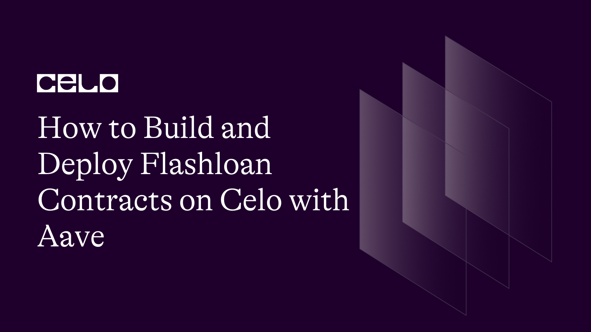

## Introduction

A relatively new method of borrowing assets on the blockchain is through Flash Loans. Other popular Defi protocols like dYdX immediately added this new feature after Aave introduced it.

With a Flash Loan, a user can borrow assets without providing any upfront security as long as they are returned together with a fee in the same blockchain transaction. You will need to build a contract that requests a Flash Loan.

The contract will then need to execute some custom logic, e.g. arbitrage and pay back the loan + interest and fees, all within the same transaction.

## About Aave

Aave has catapulted to the forefront of the Defi space with over 3.93 billion dollars worth of value in it (\$3.93b TVL). Aave was the first to come up with the idea of a Flash Loan.

Before flash loans, you would need to stake an over-collateralized asset to loan another asset. For example, if we wanted to borrow 10 USDC, we would have to deposit another cryptocurrency that exceeded that value, e.g. one ETH.

In other words, you had to have money to borrow money. Flash Loans demolished this idea. And they opened up doors for a new loaning system. They allowed users to borrow without putting up anything as collateral.

In this tutorial, you will learn how this is possible, as we will be doing this together!
Aave could be a decentralized pseudo-bank. Instead of a central bank or authority that validates all of its transactions, Aave has smart contracts that do all of this work in an automated fashion.

**Note: Aave Does Not Support Celo
Before we proceed in this tutorial, it is important to underscore that Aave does not yet support Celo. We cannot deploy a flash loan contract on Celo with the Aave implementations.**

**[Here](https://github.com/johnfawole/flashloan_contract_on_celo/tree/main) is a link to the complete flashloan contract folder you'll be writing in this tutorial.**

The reason is that Aave only provides addresses for the Ethereum mainnet and Goerli testnet.
But is there any way forward?

The [Celo community is in talks with Aave](https://governance.aave.com/t/launch-aave-v3-on-celo/11059) on this issue. Thus, Aave may support Celo soon.

On this note, this tutorial will show you how to deploy flash loan smart contracts on Ethereum. Once Aave supports Celo, you only need to make a few adjustments such as

- Using the provided Celo address as the address Provider
- Getting testnet cUSD instead of Goerli Eth
- Deploying to Celo mainnet or Alfajores Testnet

Having clarified that, we shall continue with our tutorial.

## Setting up with Remix

We will be using the Remix IDE for this tutorial.

Before we begin writing our smart contracts, we'll need to install a browser extension that allows us to interact with the Ethereum blockchain.

There are several tools available to unlock such functionality, but MetaMask is the most popular.
This article assumes you already have the following configuration:

- [Metamask browser wallet](https://metamask.io/)
- [Remix IDE](https://remix-project.org/)
- A new solidity file (MyFlashloanContract.sol)
- Some [Goerli ETH](https://goerlifaucet.com/)

Click on injected web3 inside the Remix IDE to ensure that your Goerli network is connected to your smart contract, as shown below:


### Step 1: Setting up your Code

You'll need to create a new contract that both you and the Aave protocol's lending contract can call. They can be separate, however, for ease of understanding, we'll merge those functions into one contract.

Add a new file and name it myFlashLoan.sol and add the following code to it:

```solidity
// SPDX-License-Identifier: MIT
pragma solidity 0.8.17;

import { FlashLoanReceiverBase } from "./FlashLoanReceiverBase.sol";
import { ILendingPool, ILendingPoolAddressesProvider, IERC20 } from "./Interfaces.sol";
import { SafeMath } from "./Libraries.sol";
import "./Ownable.sol";
/**
    !!!
    Never keep funds permanently on your FlashLoanReceiverBase contract as they could be
    exposed to a 'griefing' attack, where an attacker uses the stored funds.
    !!!
 */
contract MyV2FlashLoan is FlashLoanReceiverBase, Ownable {
    using SafeMath for uint256;

    constructor(ILendingPoolAddressesProvider _addressProvider) FlashLoanReceiverBase(_addressProvider) {}
```

Although remix can import solidity source files directly from GitHub, In the first 3 lines, we are locally importing the files necessary to interface with the Aave Protocol. You will want to create several files on that segue:

- [FlashLoanReceiverBase.sol](https://gist.github.com/johnfawole/741aff645a7e375f8fbccb0fab5ee910)
- [Interfaces.sol](https://gist.github.com/johnfawole/c2844bd1450607ead2969b8f83e340a3)
- [Libraries.sol](https://gist.github.com/johnfawole/353940d436643123603a8375703646ec)
- [Ownable.sol](https://gist.github.com/johnfawole/8e37c45d86315744339b952a2846ff84)


The `MyFlashLoan` contract inherits from the `FlashLoanReceiverBase` and Ownable contract.

On line 20, we are passing in a constructor argument of an address to the inherited FlashLoanReceiverBase contract which determines which LendingPoolAddressProvider to use on the network the contract is deployed.

We can find the `_addressProvider` from [the documentation](https://docs.aave.com/developers/v/2.0/deployed-contracts/deployed-contracts) as we'll be passing in the relevant LendingPoolAddressProvider value at deployment.

### Step 2: Implementing your Flash Loan function

Next, add the function that will be called to initiate the Flash Loan process. Let's call the function `myFlashLoanCall()` and this function will take the address of the token you want to flash loan as an argument.

We will limit access to it to the owner (i.e. you), this will help guard against griefing attacks. You will request a Flash Loan of 1 USDC (1\* 10^6 as USDC has 6 decimal places). We don't need data for the flash loan, so we are passing an empty string.

This function then calls the `flashloan()` function on the lending pool contract for you to receive the tokens.

```solidity
    function myFlashLoanCall(address _tokenAddress) public onlyOwner {
        address receiverAddress = address(this);

        address[] memory assets = new address[](1);
        assets[0] = address(_tokenAddress); //goerli USDC 0x9FD21bE27A2B059a288229361E2fA632D8D2d074

        uint256[] memory amounts = new uint256[](1);
        amounts[0] = 1*10**6;

        // 0 = no debt, 1 = stable, 2 = variable
        uint256[] memory modes = new uint256[](1);
        modes[0] = 0;

        address onBehalfOf = address(this);
        bytes memory params = "";
        uint16 referralCode = 0;

        LENDING_POOL.flashLoan(
            receiverAddress,
            assets,
            amounts,
            modes,
            onBehalfOf,
            params,
            referralCode
        );
    }
}
```

### Step 3: Executing your Flash Loan operation

If we have requested a valid amount from a valid reserve, then the LendingPool contract will call the `executeOperation()` function in our contract. This is where we utilize the funds received from the lending pool. It checks if we received the appropriate loan amount or will throw an error message.
As shown below, we can include our `executeOperation()` function:

```solidity
    function executeOperation(
        address[] calldata assets,
        uint256[] calldata amounts,
        uint256[] calldata premiums,
        address initiator,
        bytes calldata params
    )
        external
        override
        returns (bool)
    {

        //
        // This contract now has the funds requested.
        // Your logic goes here.
        //

        // At the end of your logic above, this contract owes
        // the flash loaned amounts + premiums.
        // Therefore ensure your contract has enough to repay
        // these amounts.

        // Approve the LendingPool contract allowance to *pull* the owed amount
        for (uint i = 0; i < assets.length; i++) {
            uint amountOwing = amounts[i].add(premiums[i]);
            IERC20(assets[i]).approve(address(LENDING_POOL), amountOwing);
        }

        return true;
    }

```

Before the end of the execution, you must approve the Lending pool to pull (payback) the borrowed funds. Failure to do so will cause the transaction to revert.

Kindly note that the `executeOperation()` function signature must match exactly. When the LendingPool contract calls your `executeOperation()` function, it will pass in the assets, amounts, premiums, initiator, and params for you to use in your operation.

```solidity
function executeOperation(
        address[] calldata assets,
        uint256[] calldata amounts,
        uint256[] calldata premiums,
        address initiator,
        bytes calldata params
    )
        external
        override
        returns (bool);
```

### Step 4: Deploying The Contract

Switch to the `Solidity Compiler` tab. Set the compiler to 0.8.17 and click `Compile myFlashLoan.sol`. You should see some warnings but no error message.


We will move on to deploy the contract to the Goerli network. Switch to the `Deploy & Run Transactions` tab.


You should ensure that the `contract` field is set to `MyV2FlashLoan.sol`, the full code is also available [here](https://gist.github.com/johnfawole/a536dcd65ca563eab0bcc83a78956a25) for reference. Provide the LendingPool address in the text field that is next to the deploy button.


In our case, it will be `0x5E52dEc931FFb32f609681B8438A51c675cc232d`. Then click `Deploy`. It should open up MetaMask. After that, you should confirm the transaction on your wallet.

### Step 5: Funding The Flash Loan


Under the new Deployed Contracts tab, you can copy the deployed contract's address. Hold on while we address this later.

In the meantime, we need to add USDC to our Flash Loan contract. This is because Flash Loans need funds in the contract to execute successfully.

We can mint some testnet USDC for ourselves [here](https://gist.github.com/johnfawole/a536dcd65ca563eab0bcc83a78956a25). Under `write contract` you should connect your wallet and mint some USDC.


Note that USDC has 6 decimals.


After receiving transaction confirmation, we will add the USDC token to MetaMask. To do so, launch MetaMask. At the bottom, click the `Add Token` button. Fill out the `Token Contract Address` field with `0x9FD21bE27A2B059a288229361E2fA632D8D2d074`. This is USDC's contract address on Goerli's testnet. After clicking `Next`, the USDC you minted earlier should be displayed.


Then, select the USDC token. Clicking `Send` should open a window like the one shown below, where we enter our Flash Loan's contract address and send some USDC (preferably 100), then click `Next` to confirm the transaction!

### Step 6: Executing The Flash Loan

Head back to Remix. Under the deployed Flash Loan contract, there’s another `myFlashLoanCall` text field. This field takes the contract address of the asset we want to borrow as an argument.

In our case, it’s the Goerli Testnet’s USDC contract, which is `0x9FD21bE27A2B059a288229361E2fA632D8D2d074`. With that field correctly filled in, you can now hit the `transact` button, as shown below.


When calling the function, MetaMask should prompt you for transaction approval. When you confirm the transaction, you should see a success message. You should see a URL in Remix's terminal. Click on that, and you should be redirected to Etherscan.


- The yellow highlight indicates the transfer of 1 USDC from LendingPool to our contract.
- The red highlight indicates the payback of 1 USDC and the fees to the Landing pool.
- The green highlight shows the interest generated by USDC, which has its separate utility.

## Conclusion

We successfully wrote the smart contract for a Flash Loan! In a single transaction, we could borrow USDC from the pool, pay the Flash Loan fee, and repay the borrowed amount. You just borrowed money with no collateral!

## Next Steps

Since you have successfully deployed a flash loan smart contract with Aave, it is high time you started delving deeper into deeper DeFi smart contract development.

A fun project you can embark on next is to create a flash loan with tight security from scratch without using the Aave implementations.

## About the Author

John Fawole is a blockchain technical writer and Solidity dev; connect with him on [LinkedIn](https://www.linkedin.com/in/johnfawole/).
